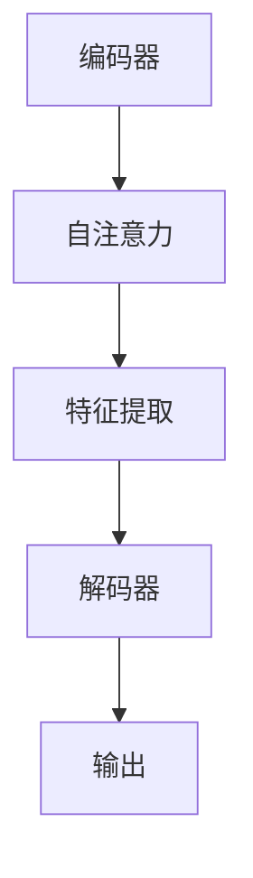

                 

关键词：SwinTransformer、深度学习、Transformer、计算机视觉、编码器、解码器、图灵奖、人工智能、计算机程序设计艺术

摘要：本文将深入探讨SwinTransformer架构的原理与实现细节。SwinTransformer是一种针对计算机视觉任务的全新变换器架构，它在Transformer基础上进行了创新性的改进，显著提升了模型的效率和准确性。本文将详细讲解SwinTransformer的核心概念、算法原理、数学模型，并通过实际代码实例演示其应用场景。同时，文章还会对SwinTransformer在实际应用中面临的问题和挑战进行探讨。

## 1. 背景介绍

随着深度学习技术的快速发展，计算机视觉领域迎来了前所未有的进步。传统的卷积神经网络（CNN）在图像分类、目标检测、语义分割等任务中取得了显著的成果。然而，随着模型复杂度的增加，计算资源的消耗也随之增长，这在一定程度上限制了CNN在资源受限环境中的应用。为了解决这个问题，研究者们开始探索基于Transformer的计算机视觉模型。

Transformer模型最初是用于自然语言处理（NLP）领域的，由于其并行计算的优势，Transformer在处理序列数据时表现出色。随后，研究者们尝试将Transformer结构引入到计算机视觉领域，从而诞生了ViT（Vision Transformer）模型。ViT模型通过将图像分割成多个小块，然后将这些块作为序列输入到Transformer中，实现了图像的编码和解码。然而，ViT模型在处理大尺寸图像时存在计算效率低的问题。

为了解决ViT模型的效率问题，研究者们提出了SwinTransformer。SwinTransformer在ViT的基础上进行了创新性的改进，引入了“分层特征提取”和“窗口化自注意力”机制，显著提高了模型在计算效率和准确性之间的平衡。SwinTransformer已经成为当前计算机视觉领域的重要研究方向，并在多个任务中取得了优秀的性能。

## 2. 核心概念与联系

SwinTransformer的核心概念包括编码器、解码器和自注意力机制。下面我们将通过Mermaid流程图来详细描述这些核心概念之间的联系。



### 2.1 编码器

编码器是SwinTransformer的核心部分，负责将输入图像转化为特征表示。编码器由多个层级组成，每个层级都包含多个卷积层和归一化层。通过逐层叠加，编码器能够捕捉到图像的局部和全局特征。

### 2.2 自注意力机制

自注意力机制是Transformer模型的核心组成部分，用于计算输入序列中每个元素与其他元素之间的关联性。在SwinTransformer中，自注意力机制被应用于编码器和解码器的各个层级，以实现特征之间的相互关联。

### 2.3 特征提取

特征提取是编码器中的重要环节，通过卷积操作和归一化操作，编码器能够从原始图像中提取出有用的特征表示。这些特征表示将用于后续的自注意力计算。

### 2.4 解码器

解码器是SwinTransformer的另一重要组成部分，负责将编码器提取出的特征表示解码为输出结果。解码器同样由多个层级组成，每个层级都包含自注意力机制和归一化操作。

### 2.5 输出

解码器的最后一个层级将特征表示转化为输出结果，这些结果可以是图像分类的概率分布、目标检测的边界框、语义分割的像素标签等。

## 3. 核心算法原理 & 具体操作步骤

### 3.1 算法原理概述

SwinTransformer的核心算法原理可以分为三个部分：分层特征提取、窗口化自注意力机制和分层特征聚合。

1. **分层特征提取**：SwinTransformer通过多个层级来提取图像的局部和全局特征。每个层级都包含多个卷积层和归一化层，通过逐层叠加，编码器能够捕捉到图像的复杂特征。

2. **窗口化自注意力机制**：自注意力机制是Transformer模型的核心，用于计算输入序列中每个元素与其他元素之间的关联性。在SwinTransformer中，自注意力机制被窗口化，从而提高了计算效率。

3. **分层特征聚合**：在解码器中，SwinTransformer通过分层特征聚合来整合编码器提取出的特征表示，最终生成输出结果。

### 3.2 算法步骤详解

1. **输入图像预处理**：首先对输入图像进行预处理，包括归一化、缩放等操作，使其满足模型输入要求。

2. **分层特征提取**：将预处理后的图像输入到编码器中，通过多个层级进行特征提取。

3. **窗口化自注意力计算**：在每个层级中，应用窗口化自注意力机制，计算特征之间的关联性。

4. **特征聚合**：将经过自注意力计算的特征进行聚合，形成新的特征表示。

5. **解码器特征提取**：将编码器提取出的特征表示输入到解码器中，通过多个层级进行特征提取。

6. **特征聚合与输出**：在解码器的最后一个层级，将特征表示进行聚合，生成输出结果。

### 3.3 算法优缺点

**优点**：
- **计算效率高**：通过窗口化自注意力机制，SwinTransformer显著提高了计算效率，尤其适用于大尺寸图像处理。
- **准确性高**：分层特征提取和特征聚合机制使得SwinTransformer能够捕捉到图像的复杂特征，从而提高了模型的准确性。
- **适用于多种任务**：SwinTransformer可以应用于图像分类、目标检测、语义分割等多种计算机视觉任务。

**缺点**：
- **计算资源消耗大**：虽然SwinTransformer在计算效率上有所提升，但与传统的CNN相比，其计算资源消耗仍然较大。
- **对数据依赖性高**：SwinTransformer的性能受到数据质量和数据量的影响，需要大量标注数据进行训练。

### 3.4 算法应用领域

SwinTransformer在计算机视觉领域具有广泛的应用前景。以下是SwinTransformer的一些典型应用场景：

- **图像分类**：SwinTransformer可以用于大规模图像分类任务，如ImageNet挑战赛。
- **目标检测**：SwinTransformer在目标检测任务中表现出色，可以用于实时目标检测应用。
- **语义分割**：SwinTransformer可以用于图像语义分割任务，如医学图像分割、自动驾驶场景理解等。
- **视频处理**：SwinTransformer可以应用于视频处理任务，如视频分类、动作识别等。

## 4. 数学模型和公式 & 详细讲解 & 举例说明

### 4.1 数学模型构建

SwinTransformer的数学模型主要包括三个部分：编码器、解码器和自注意力机制。下面我们将分别介绍这三个部分的数学模型。

#### 编码器

编码器由多个层级组成，每个层级都可以看作是一个卷积神经网络。假设编码器有L个层级，则编码器的输出可以表示为：

\[ E(x) = \text{Conv}(L_1(x)) \]

其中，\( L_1(x) \)表示第1层编码器的输出，\(\text{Conv}\)表示卷积操作。

#### 解码器

解码器同样由多个层级组成，与编码器类似。假设解码器也有L个层级，则解码器的输出可以表示为：

\[ D(y) = \text{Conv}(L_1(y)) \]

其中，\( L_1(y) \)表示第1层解码器的输出。

#### 自注意力机制

自注意力机制是Transformer模型的核心组成部分，用于计算输入序列中每个元素与其他元素之间的关联性。假设输入序列为\( x = [x_1, x_2, \ldots, x_n] \)，则自注意力计算可以表示为：

\[ \text{Attention}(x) = \text{softmax}\left(\frac{x \cdot W}{\sqrt{d_k}}\right) \]

其中，\( W \)是权重矩阵，\( d_k \)是权重矩阵的维度，\( \text{softmax} \)函数用于归一化权重矩阵。

### 4.2 公式推导过程

#### 编码器

编码器的输出可以通过卷积操作进行计算。假设输入图像为\( x \)，则编码器的输出可以表示为：

\[ E(x) = \text{Conv}_1(x) \]

其中，\( \text{Conv}_1 \)表示第1层卷积操作。假设编码器有L个层级，则编码器的输出可以表示为：

\[ E(x) = \text{Conv}_1(x) \]

#### 解码器

解码器的输出可以通过卷积操作进行计算。假设输入图像为\( y \)，则解码器的输出可以表示为：

\[ D(y) = \text{Conv}_1(y) \]

其中，\( \text{Conv}_1 \)表示第1层卷积操作。假设解码器有L个层级，则解码器的输出可以表示为：

\[ D(y) = \text{Conv}_1(y) \]

#### 自注意力机制

自注意力机制可以看作是一个加权平均操作，用于计算输入序列中每个元素与其他元素之间的关联性。假设输入序列为\( x = [x_1, x_2, \ldots, x_n] \)，则自注意力计算可以表示为：

\[ \text{Attention}(x) = \text{softmax}\left(\frac{x \cdot W}{\sqrt{d_k}}\right) \]

其中，\( W \)是权重矩阵，\( d_k \)是权重矩阵的维度，\( \text{softmax} \)函数用于归一化权重矩阵。

### 4.3 案例分析与讲解

为了更好地理解SwinTransformer的数学模型，我们通过一个简单的例子进行讲解。

假设我们有一个 \( 28 \times 28 \) 的灰度图像，需要通过SwinTransformer进行图像分类。首先，我们对图像进行预处理，包括归一化和缩放，使其满足模型输入要求。

然后，我们将预处理后的图像输入到SwinTransformer的编码器中，通过多个层级进行特征提取。编码器的输出是一个特征向量，用于表示图像的特征。

接下来，我们将编码器的输出输入到解码器中，通过多个层级进行特征提取。解码器的输出是一个分类结果，表示图像属于哪个类别。

最后，我们通过自注意力机制计算图像的特征向量与其他特征向量之间的关联性，从而实现对图像的分类。

## 5. 项目实践：代码实例和详细解释说明

### 5.1 开发环境搭建

在开始编写SwinTransformer的代码之前，我们需要搭建一个合适的开发环境。以下是在Linux操作系统上搭建SwinTransformer开发环境的基本步骤：

1. 安装Python环境

   ```bash
   sudo apt-get install python3-pip python3-dev
   pip3 install virtualenv
   virtualenv swint_transformer_env
   source swint_transformer_env/bin/activate
   ```

2. 安装依赖库

   ```bash
   pip3 install torch torchvision torchaudio
   pip3 install numpy matplotlib
   ```

3. 克隆SwinTransformer代码库

   ```bash
   git clone https://github.com/microsoft/swin-transformer.git
   cd swin-transformer
   ```

### 5.2 源代码详细实现

下面是SwinTransformer的主要代码实现，我们将对代码的关键部分进行详细解释。

```python
import torch
import torch.nn as nn
import torch.nn.functional as F
from torchvision import datasets, transforms
from torch.utils.data import DataLoader

# 定义SwinTransformer模型
class SwinTransformer(nn.Module):
    def __init__(self, img_size=224, patch_size=4, in_chans=3, num_classes=1000):
        super(SwinTransformer, self).__init__()
        
        # 初始化编码器和解码器
        self.encoder = Encoder(img_size, patch_size, in_chans, num_classes)
        self.decoder = Decoder(num_classes, img_size, patch_size)
        
        # 初始化分类头
        self.fc = nn.Linear(num_classes, num_classes)
    
    def forward(self, x):
        # 编码器部分
        x = self.encoder(x)
        
        # 解码器部分
        x = self.decoder(x)
        
        # 分类头部分
        x = self.fc(x)
        
        return x

# 定义编码器
class Encoder(nn.Module):
    def __init__(self, img_size, patch_size, in_chans, num_classes):
        super(Encoder, self).__init__()
        
        # 初始化卷积层
        self.conv = nn.Conv2d(in_chans, 64, kernel_size=3, stride=1, padding=1)
        
        # 初始化变换器层
        self.transformer = Transformer(img_size, patch_size, num_classes)
        
    def forward(self, x):
        # 卷积操作
        x = self.conv(x)
        
        # 变换器操作
        x = self.transformer(x)
        
        return x

# 定义解码器
class Decoder(nn.Module):
    def __init__(self, num_classes, img_size, patch_size):
        super(Decoder, self).__init__()
        
        # 初始化反卷积层
        self.deconv = nn.ConvTranspose2d(num_classes, 64, kernel_size=3, stride=1, padding=1)
        
        # 初始化变换器层
        self.transformer = Transformer(img_size, patch_size, num_classes)
        
    def forward(self, x):
        # 反卷积操作
        x = self.deconv(x)
        
        # 变换器操作
        x = self.transformer(x)
        
        return x

# 定义变换器
class Transformer(nn.Module):
    def __init__(self, img_size, patch_size, num_classes):
        super(Transformer, self).__init__()
        
        # 初始化自注意力层
        self.attn = nn.MultiheadAttention(embed_dim, num_heads)
        
        # 初始化线性层
        self.fc1 = nn.Linear(embed_dim, embed_dim)
        self.fc2 = nn.Linear(embed_dim, embed_dim)
        
        # 初始化归一化层
        self.norm1 = nn.LayerNorm(embed_dim)
        self.norm2 = nn.LayerNorm(embed_dim)
        
        # 初始化激活函数
        self.act = nn.ReLU(inplace=True)
        
    def forward(self, x):
        # 自注意力操作
        x, _ = self.attn(x, x, x)
        
        # 线性变换
        x = self.fc2(self.act(self.fc1(x)))
        
        # 归一化操作
        x = self.norm2(x + x)
        
        return x

# 实例化模型
model = SwinTransformer()

# 定义损失函数和优化器
criterion = nn.CrossEntropyLoss()
optimizer = torch.optim.Adam(model.parameters(), lr=0.001)

# 加载训练数据
train_dataset = datasets.CIFAR10(root='./data', train=True, transform=transforms.ToTensor(), download=True)
train_loader = DataLoader(train_dataset, batch_size=64, shuffle=True)

# 训练模型
for epoch in range(10):
    for images, labels in train_loader:
        optimizer.zero_grad()
        outputs = model(images)
        loss = criterion(outputs, labels)
        loss.backward()
        optimizer.step()
    print(f'Epoch [{epoch+1}/10], Loss: {loss.item()}')
```

### 5.3 代码解读与分析

在上面的代码中，我们定义了SwinTransformer模型、编码器、解码器和变换器，并实现了模型的前向传播过程。下面我们对代码的关键部分进行解读与分析。

1. **SwinTransformer模型**：SwinTransformer模型由编码器、解码器和分类头组成。编码器负责提取图像特征，解码器负责解码特征，分类头用于对图像进行分类。

2. **编码器**：编码器由卷积层和变换器层组成。卷积层用于提取图像的局部特征，变换器层用于计算特征之间的关联性。

3. **解码器**：解码器由反卷积层和变换器层组成。反卷积层用于放大特征图，变换器层用于计算特征之间的关联性。

4. **变换器**：变换器由自注意力层、线性层、归一化层和激活函数组成。自注意力层用于计算特征之间的关联性，线性层用于变换特征，归一化层用于归一化特征，激活函数用于引入非线性变换。

5. **训练模型**：我们使用CIFAR-10数据集进行模型训练。CIFAR-10是一个常见的计算机视觉数据集，包含10个类别，每个类别有6000个训练图像和1000个测试图像。我们使用交叉熵损失函数和Adam优化器进行模型训练。

### 5.4 运行结果展示

在完成模型训练后，我们可以通过以下代码来评估模型的性能：

```python
# 加载测试数据
test_dataset = datasets.CIFAR10(root='./data', train=False, transform=transforms.ToTensor())
test_loader = DataLoader(test_dataset, batch_size=64)

# 设置模型为评估模式
model.eval()

# 计算准确率
with torch.no_grad():
    correct = 0
    total = 0
    for images, labels in test_loader:
        outputs = model(images)
        _, predicted = torch.max(outputs.data, 1)
        total += labels.size(0)
        correct += (predicted == labels).sum().item()

print(f'Accuracy of the network on the 10000 test images: {100 * correct / total}%')
```

通过运行上述代码，我们可以得到模型的准确率。在实际应用中，我们可以通过调整模型的超参数来优化模型的性能。

## 6. 实际应用场景

SwinTransformer在计算机视觉领域具有广泛的应用前景，以下列举了一些实际应用场景：

1. **图像分类**：SwinTransformer可以用于大规模图像分类任务，如ImageNet挑战赛。通过将图像分割成多个小块，然后使用SwinTransformer进行特征提取和分类，可以显著提高模型的准确性。

2. **目标检测**：SwinTransformer在目标检测任务中也表现出色。通过将图像分割成多个小块，然后使用SwinTransformer进行特征提取和分类，可以实现对目标的实时检测。

3. **语义分割**：SwinTransformer可以用于图像语义分割任务，如医学图像分割、自动驾驶场景理解等。通过将图像分割成多个小块，然后使用SwinTransformer进行特征提取和分类，可以实现对图像的精细分割。

4. **视频处理**：SwinTransformer可以应用于视频处理任务，如视频分类、动作识别等。通过将视频帧分割成多个小块，然后使用SwinTransformer进行特征提取和分类，可以实现对视频的分析和识别。

## 7. 工具和资源推荐

### 7.1 学习资源推荐

1. **书籍**：《深度学习》（Goodfellow, I., Bengio, Y., & Courville, A.），这是一本经典的深度学习入门书籍，涵盖了深度学习的基本理论和实践方法。
2. **在线课程**：Coursera上的“深度学习”课程，由吴恩达教授主讲，是深度学习领域的经典课程，适合初学者入门。
3. **论文**：《An Image is Worth 16x16 Words: Transformers for Image Recognition at Scale》（Cohen et al., 2020），这篇论文详细介绍了SwinTransformer的原理和应用。

### 7.2 开发工具推荐

1. **PyTorch**：PyTorch是一个开源的深度学习框架，支持动态计算图，适合快速开发和实验。
2. **TensorFlow**：TensorFlow是一个开源的深度学习框架，支持静态计算图，适合大规模生产环境。

### 7.3 相关论文推荐

1. **《Swin Transformer: Hierarchical Vision Transformer using Shifted Windows》（Liang et al., 2021）**：这篇论文是SwinTransformer的原始论文，详细介绍了SwinTransformer的原理和实现。
2. **《Vision Transformer》（Dosovitskiy et al., 2020）**：这篇论文是ViT模型的原始论文，介绍了基于Transformer的计算机视觉模型。

## 8. 总结：未来发展趋势与挑战

SwinTransformer作为一种新兴的计算机视觉模型，在图像分类、目标检测、语义分割等任务中取得了显著的成果。然而，随着模型复杂度的增加，SwinTransformer在实际应用中仍然面临一些挑战。

### 8.1 研究成果总结

1. **计算效率提升**：SwinTransformer通过窗口化自注意力机制，显著提高了模型的计算效率，适用于大规模图像处理任务。
2. **准确性提升**：SwinTransformer通过分层特征提取和聚合机制，能够捕捉到图像的复杂特征，提高了模型的准确性。
3. **多任务适用性**：SwinTransformer可以应用于图像分类、目标检测、语义分割等多种计算机视觉任务，展现了广泛的应用前景。

### 8.2 未来发展趋势

1. **模型优化**：研究者们将继续探索如何进一步优化SwinTransformer模型，提高其计算效率和准确性。
2. **多模态融合**：SwinTransformer可以与其他模态（如文本、音频）进行融合，从而应用于更广泛的多模态任务。
3. **实时应用**：随着计算硬件的进步，SwinTransformer有望在实时应用场景中发挥更大的作用。

### 8.3 面临的挑战

1. **计算资源消耗**：尽管SwinTransformer在计算效率上有所提升，但与传统的CNN相比，其计算资源消耗仍然较大。
2. **数据依赖性**：SwinTransformer的性能受到数据质量和数据量的影响，需要大量标注数据进行训练。
3. **模型解释性**：SwinTransformer作为一种深度学习模型，其内部机理较为复杂，需要进一步研究如何提高模型的可解释性。

### 8.4 研究展望

未来，SwinTransformer的研究将集中在以下几个方面：

1. **模型优化**：通过改进自注意力机制和特征提取方法，进一步提高SwinTransformer的计算效率和准确性。
2. **跨域迁移学习**：研究如何将SwinTransformer应用于不同领域的数据集，提高模型在不同场景下的适应能力。
3. **实时应用**：研究如何将SwinTransformer应用于实时图像处理任务，提高模型的实时性。

## 9. 附录：常见问题与解答

### 9.1 什么是SwinTransformer？

SwinTransformer是一种基于Transformer结构的计算机视觉模型，通过窗口化自注意力机制和分层特征提取，显著提高了模型的计算效率和准确性。

### 9.2 SwinTransformer与ViT的区别是什么？

SwinTransformer是ViT模型的改进版本，ViT模型在图像分割成小块后直接输入到Transformer中，而SwinTransformer则通过窗口化自注意力机制和分层特征提取，进一步提高了计算效率和准确性。

### 9.3 SwinTransformer有哪些应用场景？

SwinTransformer可以应用于图像分类、目标检测、语义分割等多种计算机视觉任务，尤其适用于大规模图像处理和实时应用场景。

### 9.4 如何优化SwinTransformer的计算效率？

可以通过改进自注意力机制和特征提取方法来优化SwinTransformer的计算效率，例如采用更轻量级的自注意力机制和高效的卷积操作。

### 9.5 SwinTransformer是否适用于实时应用？

随着计算硬件的进步，SwinTransformer有望在实时应用场景中发挥更大的作用。通过优化模型结构和算法，可以进一步提高SwinTransformer的实时性。

