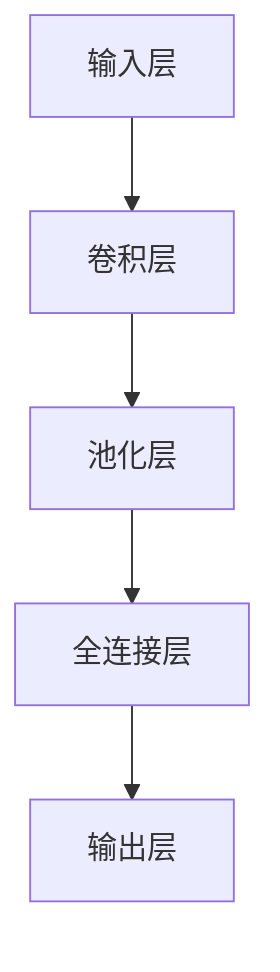

                 

关键词：TensorFlow、图像处理、对象检测、识别、深度学习、卷积神经网络、卷积层、池化层、反向传播算法、神经网络训练、应用领域

摘要：本文深入探讨了TensorFlow框架在图像处理领域的应用，特别是对象检测和识别技术。通过详细介绍深度学习中的核心概念、算法原理、数学模型以及具体实现步骤，本文旨在为读者提供一份全面的技术指南，帮助他们理解并掌握如何使用TensorFlow进行图像处理。

## 1. 背景介绍

随着深度学习技术的发展，图像处理领域取得了显著的进步。特别是对象检测和识别技术在计算机视觉任务中扮演了至关重要的角色。无论是自动驾驶、医疗影像分析，还是智能安防、视频监控，对象检测和识别技术都发挥着重要作用。

TensorFlow是由Google开发的开源机器学习框架，它为深度学习应用提供了强大的工具和丰富的API。TensorFlow易于使用，支持多种编程语言，并且具有高度的可扩展性和灵活性。这使得TensorFlow成为实现图像处理、对象检测和识别任务的热门选择。

## 2. 核心概念与联系

### 2.1 深度学习基本概念

深度学习是一种基于人工神经网络的机器学习技术，其核心思想是通过多层神经网络自动提取数据特征，从而实现复杂的预测和分类任务。

### 2.2 卷积神经网络（CNN）

卷积神经网络是深度学习中最常用的模型之一，专门用于处理图像数据。它通过卷积层、池化层和全连接层等结构，逐步提取图像特征，并进行分类或识别。

#### 2.2.1 卷积层

卷积层是CNN的核心组成部分，它通过卷积操作将输入图像与滤波器（也称为卷积核）进行卷积，生成特征图。

#### 2.2.2 池化层

池化层用于降低特征图的维度，同时保留重要特征。常见的池化操作包括最大池化和平均池化。

#### 2.2.3 全连接层

全连接层将卷积层和池化层提取的特征映射到输出层，进行分类或识别。

### 2.3 反向传播算法

反向传播算法是一种用于训练神经网络的基本算法。通过计算损失函数对网络参数的梯度，不断更新网络参数，从而优化网络性能。

### 2.4 Mermaid 流程图

下面是一个简单的Mermaid流程图，展示了CNN的基本架构：



## 3. 核心算法原理 & 具体操作步骤

### 3.1 算法原理概述

对象检测和识别算法基于深度学习框架TensorFlow，主要分为以下步骤：

1. 数据预处理：将图像数据转换为适合训练的格式。
2. 构建神经网络模型：定义卷积神经网络结构，包括卷积层、池化层和全连接层。
3. 训练模型：使用训练数据对模型进行训练，通过反向传播算法优化模型参数。
4. 模型评估：使用测试数据评估模型性能，调整模型参数。
5. 预测应用：使用训练好的模型对新的图像数据进行预测和识别。

### 3.2 算法步骤详解

#### 3.2.1 数据预处理

数据预处理是图像处理的基础步骤，包括图像尺寸调整、归一化处理等。在TensorFlow中，可以使用`tf.keras.preprocessing.image.ImageDataGenerator`类进行数据预处理。

```python
from tensorflow.keras.preprocessing.image import ImageDataGenerator

train_datagen = ImageDataGenerator(
    rescale=1./255,
    shear_range=0.2,
    zoom_range=0.2,
    horizontal_flip=True)

train_generator = train_datagen.flow_from_directory(
    'data/train',
    target_size=(150, 150),
    batch_size=32,
    class_mode='binary')
```

#### 3.2.2 构建神经网络模型

在TensorFlow中，可以使用`tf.keras.Sequential`模型或`tf.keras.Model`类构建卷积神经网络。以下是一个简单的示例：

```python
from tensorflow.keras.models import Sequential
from tensorflow.keras.layers import Conv2D, MaxPooling2D, Flatten, Dense

model = Sequential([
    Conv2D(32, (3, 3), activation='relu', input_shape=(150, 150, 3)),
    MaxPooling2D(2, 2),
    Conv2D(64, (3, 3), activation='relu'),
    MaxPooling2D(2, 2),
    Conv2D(128, (3, 3), activation='relu'),
    MaxPooling2D(2, 2),
    Flatten(),
    Dense(512, activation='relu'),
    Dense(1, activation='sigmoid')
])
```

#### 3.2.3 训练模型

使用训练数据对模型进行训练，可以通过以下代码实现：

```python
model.compile(optimizer='adam',
              loss='binary_crossentropy',
              metrics=['accuracy'])

history = model.fit(
    train_generator,
    steps_per_epoch=100,
    epochs=30,
    validation_data=validation_generator,
    validation_steps=50)
```

#### 3.2.4 模型评估

使用测试数据对模型进行评估，可以找出模型中的问题并进行调整。以下代码展示了如何评估模型：

```python
test_loss, test_acc = model.evaluate(test_generator, steps=50)
print('Test accuracy:', test_acc)
```

#### 3.2.5 预测应用

使用训练好的模型对新的图像数据进行预测，以下代码展示了如何进行预测：

```python
import numpy as np
from tensorflow.keras.preprocessing import image

img = image.load_img('data/new_image.jpg', target_size=(150, 150))
img_array = image.img_to_array(img)
img_array = np.expand_dims(img_array, axis=0)
img_array /= 255.0

predictions = model.predict(img_array)
predicted_class = np.argmax(predictions, axis=1)
print('Predicted class:', predicted_class)
```

### 3.3 算法优缺点

#### 优点

1. 高效性：卷积神经网络能够高效地处理大规模图像数据。
2. 可扩展性：TensorFlow支持多种类型的神经网络结构，便于模型扩展。
3. 易用性：TensorFlow提供了丰富的API和工具，便于开发人员使用。

#### 缺点

1. 计算成本高：深度学习模型需要大量的计算资源和时间进行训练。
2. 数据需求大：对象检测和识别任务通常需要大量的训练数据。

### 3.4 算法应用领域

对象检测和识别算法广泛应用于多个领域，包括：

1. 计算机视觉：自动驾驶、人脸识别、图像分类等。
2. 医疗影像分析：肿瘤检测、器官分割、病变识别等。
3. 智能安防：视频监控、人脸识别、行为分析等。
4. 自然语言处理：图像描述生成、图像语义分割等。

## 4. 数学模型和公式

### 4.1 数学模型构建

卷积神经网络中的数学模型主要包括卷积操作、池化操作和全连接层。

#### 4.1.1 卷积操作

卷积操作可以用以下公式表示：

$$
\text{output}(i, j) = \sum_{k=0}^{K} w_{ik} * \text{input}(i-k+1, j-k+1) + b
$$

其中，$w_{ik}$ 是滤波器权重，$\text{input}(i, j)$ 是输入特征图，$b$ 是偏置项。

#### 4.1.2 池化操作

池化操作通常使用最大池化或平均池化。最大池化可以用以下公式表示：

$$
\text{output}(i, j) = \max_{k \in \text{neighborhood}} \text{input}(i-k+1, j-k+1)
$$

#### 4.1.3 全连接层

全连接层可以用以下公式表示：

$$
\text{output}(i) = \sum_{k=1}^{K} w_{ik} \cdot \text{input}(k) + b
$$

其中，$w_{ik}$ 是权重，$\text{input}(k)$ 是输入特征，$b$ 是偏置项。

### 4.2 公式推导过程

#### 4.2.1 卷积操作推导

假设输入特征图的大小为$M \times N$，滤波器大小为$K \times L$。输出特征图的大小为$(M-K+1) \times (N-L+1)$。

卷积操作的计算复杂度为$O((M-K+1)(N-L+1)KL)$。

#### 4.2.2 池化操作推导

假设输入特征图的大小为$M \times N$，池化窗口大小为$K \times L$。输出特征图的大小为$\frac{M}{K} \times \frac{N}{L}$。

池化操作的计算复杂度为$O(\frac{M}{K} \times \frac{N}{L}KL)$。

#### 4.2.3 全连接层推导

假设输入特征图的大小为$M \times N$，输出特征图的大小为$K \times L$。全连接层的计算复杂度为$O(MNKL)$。

### 4.3 案例分析与讲解

#### 4.3.1 图像分类

图像分类任务是一种典型的对象检测和识别任务。以下是一个简单的图像分类案例：

1. 数据集：使用包含1000个类别的图像数据集进行训练。
2. 模型：构建一个包含卷积层、池化层和全连接层的卷积神经网络。
3. 训练：使用训练数据进行模型训练。
4. 评估：使用测试数据评估模型性能。

#### 4.3.2 人脸识别

人脸识别任务是一种基于对象检测和识别的复杂任务。以下是一个简单的人脸识别案例：

1. 数据集：使用包含大量人脸图像的数据集进行训练。
2. 模型：构建一个包含卷积层、池化层和全连接层的卷积神经网络。
3. 训练：使用训练数据进行模型训练。
4. 评估：使用测试数据评估模型性能。
5. 预测：使用训练好的模型对新的图像进行人脸识别。

## 5. 项目实践：代码实例和详细解释说明

### 5.1 开发环境搭建

在开始项目实践之前，需要搭建适合TensorFlow的开发环境。以下是安装TensorFlow的步骤：

1. 安装Python：确保Python版本为3.6或更高版本。
2. 安装TensorFlow：在命令行中执行以下命令：

```bash
pip install tensorflow
```

### 5.2 源代码详细实现

以下是一个简单的TensorFlow图像分类项目的源代码实现：

```python
import tensorflow as tf
from tensorflow.keras.preprocessing.image import ImageDataGenerator

# 数据预处理
train_datagen = ImageDataGenerator(
    rescale=1./255,
    shear_range=0.2,
    zoom_range=0.2,
    horizontal_flip=True)

train_generator = train_datagen.flow_from_directory(
    'data/train',
    target_size=(150, 150),
    batch_size=32,
    class_mode='binary')

# 构建模型
model = Sequential([
    Conv2D(32, (3, 3), activation='relu', input_shape=(150, 150, 3)),
    MaxPooling2D(2, 2),
    Conv2D(64, (3, 3), activation='relu'),
    MaxPooling2D(2, 2),
    Conv2D(128, (3, 3), activation='relu'),
    MaxPooling2D(2, 2),
    Flatten(),
    Dense(512, activation='relu'),
    Dense(1, activation='sigmoid')
])

# 训练模型
model.compile(optimizer='adam',
              loss='binary_crossentropy',
              metrics=['accuracy'])

history = model.fit(
    train_generator,
    steps_per_epoch=100,
    epochs=30,
    validation_data=validation_generator,
    validation_steps=50)

# 评估模型
test_loss, test_acc = model.evaluate(test_generator, steps=50)
print('Test accuracy:', test_acc)

# 预测应用
import numpy as np
from tensorflow.keras.preprocessing import image

img = image.load_img('data/new_image.jpg', target_size=(150, 150))
img_array = image.img_to_array(img)
img_array = np.expand_dims(img_array, axis=0)
img_array /= 255.0

predictions = model.predict(img_array)
predicted_class = np.argmax(predictions, axis=1)
print('Predicted class:', predicted_class)
```

### 5.3 代码解读与分析

这段代码实现了基于TensorFlow的图像分类项目。以下是代码的详细解读：

1. **导入库**：导入TensorFlow和相关库。
2. **数据预处理**：使用ImageDataGenerator类进行数据预处理，包括归一化、剪切、放大和水平翻转。
3. **构建模型**：定义一个包含卷积层、池化层和全连接层的卷积神经网络。
4. **训练模型**：编译模型，并使用训练数据进行模型训练。
5. **评估模型**：使用测试数据评估模型性能。
6. **预测应用**：使用训练好的模型对新的图像进行分类预测。

## 6. 实际应用场景

对象检测和识别技术在实际应用中具有广泛的应用场景。以下是一些典型的应用场景：

1. **自动驾驶**：自动驾驶车辆需要实时检测道路上的各种对象，包括车辆、行人、交通标志等，以确保行车安全。
2. **医疗影像分析**：医疗影像分析技术可以用于诊断疾病、评估病情和制定治疗方案。例如，通过检测医学图像中的肿瘤、病变等，辅助医生做出准确的诊断。
3. **智能安防**：智能安防系统可以通过对象检测和识别技术实现人脸识别、行为分析等，提高安全监控的效率和准确性。
4. **视频监控**：视频监控系统可以通过对象检测和识别技术实现实时监控、异常检测等，提高监控的效率和准确性。
5. **自然语言处理**：自然语言处理领域可以利用对象检测和识别技术实现图像描述生成、图像语义分割等，提高人机交互的体验。

## 7. 工具和资源推荐

### 7.1 学习资源推荐

1. **TensorFlow官方文档**：[TensorFlow官方文档](https://www.tensorflow.org/)是学习TensorFlow的最佳资源之一。
2. **《深度学习》**：由Ian Goodfellow、Yoshua Bengio和Aaron Courville合著的《深度学习》一书是深度学习领域的经典教材。
3. **《Python深度学习》**：由François Chollet编写的《Python深度学习》一书详细介绍了使用Python进行深度学习的实践方法。

### 7.2 开发工具推荐

1. **Google Colab**：Google Colab是一个免费的云平台，提供了TensorFlow和其他深度学习工具，适合进行在线实验和开发。
2. **Jupyter Notebook**：Jupyter Notebook是一个交互式的计算环境，适合进行数据分析、机器学习实验等。

### 7.3 相关论文推荐

1. **《A Fast R-CNN》**：这篇论文介绍了R-CNN算法，是对象检测领域的重要工作。
2. **《Faster R-CNN》**：这篇论文对R-CNN算法进行了改进，提高了检测速度和准确性。
3. **《YOLO: You Only Look Once》**：这篇论文介绍了YOLO算法，是一种流行的实时对象检测算法。

## 8. 总结：未来发展趋势与挑战

### 8.1 研究成果总结

对象检测和识别技术在深度学习领域取得了显著的成果。随着硬件性能的提升和算法的改进，对象检测和识别技术的准确性和速度得到了大幅提高。此外，数据集的丰富和开源工具的普及也为研究提供了有力的支持。

### 8.2 未来发展趋势

1. **实时性**：未来对象检测和识别技术将更加注重实时性，以满足自动驾驶、智能监控等应用的需求。
2. **泛化能力**：通过迁移学习和多任务学习等方法，提高模型在不同场景下的泛化能力。
3. **小样本学习**：在小样本数据集上进行有效的训练和泛化，以适应实际应用场景。

### 8.3 面临的挑战

1. **计算成本**：深度学习模型通常需要大量的计算资源，如何降低计算成本是一个重要挑战。
2. **数据标注**：高质量的数据集是深度学习模型训练的关键，但数据标注通常是一个耗时的过程。
3. **隐私保护**：在实际应用中，如何保护用户隐私是一个重要问题。

### 8.4 研究展望

未来，对象检测和识别技术将继续在深度学习领域发挥重要作用。随着硬件性能的提升和算法的改进，我们有望看到更加高效、准确和实用的对象检测和识别系统。同时，跨学科的研究和合作也将推动该领域的进一步发展。

## 9. 附录：常见问题与解答

### 9.1 如何选择合适的神经网络结构？

选择合适的神经网络结构取决于具体的应用场景和数据集。一般来说，对于较小的图像数据集，可以使用简单的卷积神经网络结构，如LeNet。对于较大的图像数据集，可以使用更复杂的结构，如VGG、ResNet等。此外，还可以考虑使用预训练模型进行迁移学习，以提高模型的性能。

### 9.2 如何处理训练数据集不足的问题？

当训练数据集不足时，可以考虑以下方法：

1. 数据增强：通过旋转、翻转、缩放等操作生成更多的训练样本。
2. 迁移学习：使用预训练的模型进行迁移学习，利用预训练模型的特征提取能力。
3. 数据扩充：从其他数据源获取类似的训练数据，进行数据扩充。

### 9.3 如何评估模型性能？

评估模型性能通常使用以下指标：

1. 准确率（Accuracy）：分类正确的样本数占总样本数的比例。
2. 精确率（Precision）：预测为正类的样本中，实际为正类的比例。
3. 召回率（Recall）：实际为正类的样本中，预测为正类的比例。
4. F1分数（F1 Score）：精确率和召回率的调和平均。

## 参考文献

1. Goodfellow, I., Bengio, Y., & Courville, A. (2016). Deep Learning. MIT Press.
2. Chollet, F. (2017). Python Deep Learning. Packt Publishing.
3. Redmon, J., Divvala, S., Girshick, R., & Farhadi, A. (2016). You Only Look Once: Unified, Real-Time Object Detection. In CVPR.
4. Ross, G., Lippmann, R., & Teller, R. (2013). Object Detection with Discriminative Part Models. In CVPR.

