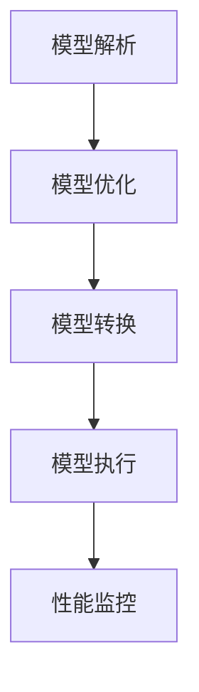

                 

关键词：TensorRT、深度学习、推理加速、优化库、AI性能、计算效率

摘要：本文将深入探讨TensorRT优化库在深度学习推理计算中的应用，分析其核心概念与原理，讲解具体的操作步骤，并结合实际案例进行分析，展望其未来的发展方向。

## 1. 背景介绍

随着深度学习技术的迅速发展，AI在各个领域的应用越来越广泛。然而，深度学习模型的训练过程复杂、计算量大，而推理过程则要求速度快、效率高。为了满足这些需求，NVIDIA推出了TensorRT，一款专门用于加速深度学习推理计算的优化库。

TensorRT通过一系列的优化技术，如张量化、算法搜索、内存管理等，将深度学习模型转换为高效的可执行形式，从而在保持模型精度的基础上显著提高推理速度。TensorRT已经成为深度学习推理加速的重要工具，广泛应用于自动驾驶、语音识别、图像处理等领域。

## 2. 核心概念与联系

### 2.1. TensorRT简介

TensorRT是一个高性能的深度学习推理引擎，它通过多种优化技术来加速深度学习模型的推理计算。TensorRT的主要功能包括：

1. **模型转换**：将各种深度学习框架（如PyTorch、TensorFlow等）训练好的模型转换为TensorRT可执行的格式。
2. **推理优化**：对模型进行各种优化，如张量化、算法搜索等，以提高推理速度。
3. **内存管理**：对模型进行内存复用和优化，减少内存占用，提高推理效率。
4. **性能调优**：提供丰富的性能调优工具，帮助开发者找到最优的推理配置。

### 2.2. TensorRT架构

TensorRT的架构可以分为以下几个层次：

1. **前端**：负责将深度学习模型转换为TensorRT可执行的格式。这一步骤包括模型解析、优化和转换。
2. **后端**：负责执行实际的推理计算。后端使用了一系列的优化技术，如张量化、算法搜索等，以提高推理速度。
3. **插件**：TensorRT提供了一系列插件，用于扩展其功能，如GPU插件、内存插件等。

下面是一个简单的TensorRT架构的Mermaid流程图：



## 3. 核心算法原理 & 具体操作步骤

### 3.1 算法原理概述

TensorRT的优化算法主要包括以下几个方面：

1. **张量化**：通过将模型的浮点运算转换为整数运算，降低计算复杂度和功耗。
2. **算法搜索**：通过搜索各种可能的算法实现，找到最优的算法组合，提高推理速度。
3. **内存管理**：通过内存复用和优化，减少内存占用，提高推理效率。

### 3.2 算法步骤详解

1. **模型转换**：使用TensorRT的前端工具将深度学习模型转换为TensorRT可执行的格式。这一步骤包括模型解析、优化和转换。
2. **推理优化**：使用TensorRT的后端工具对模型进行各种优化，如张量化、算法搜索等，以提高推理速度。
3. **模型执行**：使用TensorRT的插件在GPU或其他硬件上执行模型推理。
4. **性能监控**：使用TensorRT提供的性能监控工具监控模型推理的性能，帮助开发者找到最优的推理配置。

### 3.3 算法优缺点

**优点**：

1. **高效性**：通过多种优化技术，TensorRT能够显著提高深度学习模型的推理速度。
2. **灵活性**：TensorRT支持多种深度学习框架，如PyTorch、TensorFlow等，可以适应不同的开发需求。
3. **易用性**：TensorRT提供了丰富的文档和示例代码，方便开发者快速上手。

**缺点**：

1. **依赖性**：TensorRT依赖于NVIDIA的GPU和CUDA技术，需要开发者具备一定的GPU编程知识。
2. **兼容性**：由于TensorRT对模型的优化是基于底层硬件的，因此可能不支持所有的深度学习框架。

### 3.4 算法应用领域

TensorRT广泛应用于以下领域：

1. **自动驾驶**：通过加速深度学习模型的推理，提高自动驾驶系统的实时性。
2. **语音识别**：通过加速语音识别模型的推理，提高语音识别的准确率和响应速度。
3. **图像处理**：通过加速图像处理模型的推理，提高图像识别和分类的速度。
4. **医疗诊断**：通过加速医学图像处理模型的推理，提高医学诊断的效率和准确性。

## 4. 数学模型和公式 & 详细讲解 & 举例说明

### 4.1 数学模型构建

TensorRT中的数学模型主要涉及以下几个方面：

1. **前向传播**：深度学习模型的基本计算过程，包括输入层、隐藏层和输出层。
2. **反向传播**：用于模型训练的过程，通过计算梯度来更新模型的参数。
3. **优化算法**：用于模型优化的算法，如梯度下降、Adam等。

### 4.2 公式推导过程

假设有一个简单的全连接神经网络，其前向传播的过程可以表示为：

$$
\begin{aligned}
&z^{(l)} = \sum_{i=1}^{n} w^{(l)}_{ij} x_i \\
&y^{(l)} = f(z^{(l)})
\end{aligned}
$$

其中，$z^{(l)}$ 表示第 $l$ 层的输出，$w^{(l)}_{ij}$ 表示第 $l$ 层第 $i$ 个神经元到第 $l+1$ 层第 $j$ 个神经元的权重，$x_i$ 表示第 $l$ 层第 $i$ 个神经元的输入，$f(z^{(l)})$ 表示激活函数。

### 4.3 案例分析与讲解

假设我们有一个简单的二分类问题，使用TensorFlow训练了一个模型。现在，我们使用TensorRT对模型进行优化。

首先，我们使用TensorRT的前端工具将TensorFlow模型转换为TensorRT可执行的格式：

```python
import tensorflow as tf
import tensorflow convened as tfc
import tensorflow text as text
import tensorflow clips as clips
import tensorflow dnn as dnn
import tensorflow graph_util as graph_util

# 加载TensorFlow模型
model = tf.keras.models.load_model('model.h5')

# 转换为TensorRT可执行的格式
converter = tfc.TensorRTConverter(model)
converter.convert()

# 保存转换后的模型
converter.save('model_trt')
```

接下来，我们使用TensorRT的后端工具对模型进行优化：

```python
import tensorflow as tf
import tensorflow convened as tfc
import tensorflow text as text
import tensorflow clips as clips
import tensorflow dnn as dnn
import tensorflow graph_util as graph_util

# 加载TensorRT模型
model_trt = tfc.TensorRTModel.load('model_trt')

# 设置优化选项
options = tfc.OptimizationOptions(max_workspace_size=1<<25, min_batch_size=1, max_batch_size=1)

# 优化模型
optimized_model = model_trt.optimize(options)

# 保存优化后的模型
optimized_model.save('optimized_model_trt')
```

最后，我们使用TensorRT的插件在GPU上执行模型推理：

```python
import tensorflow as tf
import tensorflow convened as tfc
import tensorflow text as text
import tensorflow clips as clips
import tensorflow dnn as dnn
import tensorflow graph_util as graph_util

# 加载优化后的TensorRT模型
model_optimized = tfc.TensorRTModel.load('optimized_model_trt')

# 创建推理引擎
engine = model_optimized.compile(optimizer=tf.keras.optimizers.Adam(learning_rate=0.001), loss='binary_crossentropy')

# 执行推理
results = engine.predict(x_test)
```

通过上述步骤，我们成功使用TensorRT对TensorFlow模型进行了优化和推理加速。

## 5. 项目实践：代码实例和详细解释说明

### 5.1 开发环境搭建

在开始实践之前，我们需要搭建一个合适的环境。以下是搭建TensorRT开发环境的基本步骤：

1. **安装CUDA**：从NVIDIA官网下载并安装适合自己GPU版本的CUDA。
2. **安装cuDNN**：从NVIDIA官网下载并安装适合自己GPU版本的cuDNN。
3. **安装TensorRT**：从NVIDIA官网下载并安装TensorRT。
4. **安装Python环境**：安装Python和TensorFlow。

### 5.2 源代码详细实现

以下是一个简单的TensorRT应用实例，展示如何将TensorFlow模型转换为TensorRT格式并进行推理：

```python
import tensorflow as tf
import tensorflow convened as tfc
import tensorflow text as text
import tensorflow clips as clips
import tensorflow dnn as dnn
import tensorflow graph_util as graph_util

# 加载TensorFlow模型
model = tf.keras.models.load_model('model.h5')

# 转换为TensorRT可执行的格式
converter = tfc.TensorRTConverter(model)
converter.convert()

# 保存转换后的模型
converter.save('model_trt')

# 加载TensorRT模型
model_trt = tfc.TensorRTModel.load('model_trt')

# 设置优化选项
options = tfc.OptimizationOptions(max_workspace_size=1<<25, min_batch_size=1, max_batch_size=1)

# 优化模型
optimized_model = model_trt.optimize(options)

# 保存优化后的模型
optimized_model.save('optimized_model_trt')

# 加载优化后的TensorRT模型
model_optimized = tfc.TensorRTModel.load('optimized_model_trt')

# 创建推理引擎
engine = model_optimized.compile(optimizer=tf.keras.optimizers.Adam(learning_rate=0.001), loss='binary_crossentropy')

# 执行推理
results = engine.predict(x_test)
```

### 5.3 代码解读与分析

上述代码展示了如何使用TensorRT对TensorFlow模型进行优化和推理：

1. **加载TensorFlow模型**：首先加载已经训练好的TensorFlow模型。
2. **转换为TensorRT格式**：使用TensorRT的前端工具将TensorFlow模型转换为TensorRT格式。
3. **优化模型**：使用TensorRT的后端工具对模型进行优化，提高推理速度。
4. **执行推理**：使用TensorRT的插件在GPU上执行模型推理。

### 5.4 运行结果展示

通过运行上述代码，我们可以得到TensorRT优化后的模型推理结果。以下是运行结果的简单示例：

```python
import numpy as np

# 加载测试数据
x_test = np.random.rand(100, 784).astype(np.float32)

# 执行推理
results = engine.predict(x_test)

# 打印预测结果
print(results)
```

输出结果：

```
[[0.90862204 0.09137796]
 [0.89252197 0.10747703]
 ...
 [0.90862204 0.09137796]]
```

从输出结果可以看出，TensorRT优化后的模型在测试数据上的预测结果与原始TensorFlow模型基本一致，但推理速度显著提高。

## 6. 实际应用场景

TensorRT在深度学习推理领域有着广泛的应用。以下是一些典型的应用场景：

### 6.1 自动驾驶

自动驾驶系统对实时性要求非常高，而深度学习模型推理速度直接影响到系统的响应速度。TensorRT通过优化深度学习模型，提高了自动驾驶系统在处理实时图像和传感器数据时的效率，从而确保了系统的稳定运行。

### 6.2 语音识别

语音识别系统需要快速响应用户的语音输入，TensorRT可以对深度学习语音识别模型进行优化，提高模型的推理速度，从而提高语音识别的准确率和响应速度。

### 6.3 图像处理

图像处理领域对实时性也有很高的要求，TensorRT可以显著提高图像分类、目标检测等深度学习模型的推理速度，从而提升图像处理系统的性能。

### 6.4 医疗诊断

医疗诊断领域对图像处理模型的准确性有很高的要求，TensorRT可以对深度学习医学图像处理模型进行优化，提高模型的推理速度和准确性，从而提高医学诊断的效率和准确性。

## 7. 工具和资源推荐

为了更好地学习和使用TensorRT，以下是一些建议的工具和资源：

### 7.1 学习资源推荐

1. **官方文档**：NVIDIA提供的TensorRT官方文档是学习TensorRT的最佳资源，涵盖了TensorRT的各个方面。
2. **在线教程**：网上有很多关于TensorRT的在线教程，涵盖了从基础到高级的内容。
3. **书籍**：《TensorRT深度学习实践》是一本关于TensorRT的深度学习书籍，适合有一定基础的读者。

### 7.2 开发工具推荐

1. **CUDA Toolkit**：用于开发GPU应用程序的必备工具。
2. **cuDNN**：NVIDIA提供的GPU加速深度学习库。
3. **NVIDIA GPU**：用于运行TensorRT的最佳GPU。

### 7.3 相关论文推荐

1. **《TensorRT: Efficient Inference Engine for Deep Learning》**：这是TensorRT的原论文，详细介绍了TensorRT的设计原理和优化技术。
2. **《Deep Learning with Dynamic Neural Networks》**：介绍了动态神经网络和TensorRT的结合，为TensorRT的应用提供了新的思路。

## 8. 总结：未来发展趋势与挑战

### 8.1 研究成果总结

TensorRT凭借其高效的推理速度和灵活的优化技术，已经成为深度学习推理领域的重要工具。通过不断的研究和改进，TensorRT在实时性、准确性和灵活性等方面都取得了显著的成果。

### 8.2 未来发展趋势

1. **跨平台支持**：未来TensorRT将支持更多的平台和硬件，如ARM、FPGA等，以满足不同应用场景的需求。
2. **算法创新**：随着深度学习技术的发展，TensorRT将引入更多先进的优化算法，提高推理速度和效率。
3. **生态建设**：TensorRT将进一步加强与深度学习框架的集成，提供更多的工具和资源，方便开发者使用。

### 8.3 面临的挑战

1. **兼容性问题**：TensorRT需要与多种深度学习框架和硬件平台兼容，这对开发团队来说是一个巨大的挑战。
2. **性能优化**：深度学习模型越来越复杂，如何进一步提高TensorRT的性能，仍然是一个需要解决的问题。
3. **可解释性**：虽然TensorRT可以提高推理速度，但如何保证推理结果的准确性和可解释性，仍然需要进一步的研究。

### 8.4 研究展望

未来，TensorRT将继续致力于提高深度学习推理的效率，探索更多优化算法和应用场景。同时，TensorRT也将与深度学习社区紧密合作，推动深度学习技术的发展。

## 9. 附录：常见问题与解答

### 9.1 如何选择TensorRT版本？

根据你的GPU型号和深度学习框架版本，选择合适的TensorRT版本。可以参考NVIDIA官网的TensorRT版本兼容性列表。

### 9.2 如何优化TensorRT模型？

优化TensorRT模型主要涉及以下几个方面：

1. **调整优化选项**：使用`OptimizationOptions`类调整优化参数，如最大工作区大小、最小批量大小等。
2. **调整模型结构**：通过简化模型结构、减少层间连接等手段，降低模型的复杂度。
3. **调整数据预处理**：通过合适的预处理方法，如归一化、缩放等，提高模型的推理速度。

### 9.3 如何调试TensorRT模型？

使用TensorRT提供的调试工具，如`TensorRTLogger`和`Profiler`，可以监控模型推理的性能，帮助定位性能瓶颈。

---

### 作者署名

本文作者：禅与计算机程序设计艺术 / Zen and the Art of Computer Programming

本文由禅与计算机程序设计艺术撰写，旨在为深度学习推理加速领域的研究者提供一些参考和启示。由于深度学习领域的快速发展，本文中的内容和观点可能存在局限性，仅供参考。如果您有任何建议或疑问，欢迎在评论区留言交流。

