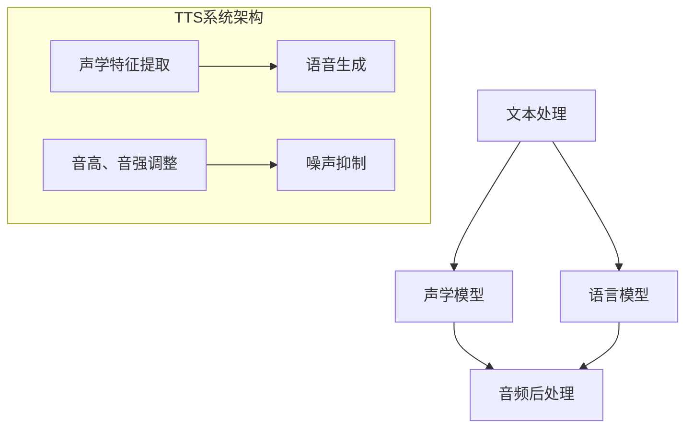

                 

关键词：Text-to-Speech, TTS, 自动语音合成，语音合成原理，语音合成代码实例，语音合成算法，语音合成应用

> 摘要：本文将深入探讨Text-to-Speech（TTS）的基本原理，包括语音合成算法、数学模型以及具体实现步骤。通过详细的代码实例分析，读者将了解到如何从文本转换为自然流畅的语音。同时，文章还将介绍TTS技术的实际应用场景，并提供相关的学习资源和开发工具推荐，为读者提供全面的TTS技术指南。

## 1. 背景介绍

随着人工智能技术的迅猛发展，语音合成技术（Text-to-Speech，TTS）已经逐渐成为人机交互的重要手段。无论是在智能音箱、智能手机助手，还是在线客服、教育辅导等领域，TTS技术都展现出了强大的应用潜力。TTS技术的核心目标是实现从文本到语音的自然转换，使计算机能够模拟人类的语音输出，从而实现高效便捷的沟通。

近年来，深度学习技术的发展为TTS领域带来了革命性的变化。传统的TTS技术主要基于统计模型和规则系统，而现代的TTS技术则利用深度神经网络（如循环神经网络RNN、卷积神经网络CNN以及Transformer等）来学习和生成语音。这些先进的技术不仅提高了语音生成的自然度和质量，还使得TTS系统更加灵活和适应性强。

本文将围绕TTS技术的核心原理进行深入讲解，并通过实际代码实例展示如何实现文本到语音的转换。文章结构如下：

- **背景介绍**：介绍TTS技术的背景和重要性。
- **核心概念与联系**：介绍TTS系统的基本组成部分和它们之间的关系。
- **核心算法原理 & 具体操作步骤**：详细讲解TTS算法的基本原理和操作步骤。
- **数学模型和公式 & 详细讲解 & 举例说明**：介绍TTS中使用的数学模型和公式，并通过实例进行说明。
- **项目实践：代码实例和详细解释说明**：提供TTS实现的代码实例，并详细解释代码的实现逻辑。
- **实际应用场景**：探讨TTS技术的实际应用场景。
- **未来应用展望**：展望TTS技术的未来发展方向和应用前景。
- **工具和资源推荐**：推荐学习资源和开发工具。
- **总结：未来发展趋势与挑战**：总结研究成果，探讨未来发展趋势和面临的挑战。

### 2. 核心概念与联系

TTS系统的核心概念包括文本处理、语音合成和音频后处理。以下是TTS系统主要组成部分及其相互关系的Mermaid流程图：



#### 2.1 文本处理

文本处理是TTS系统的第一步，其主要任务是将输入的文本转换为适合后续处理的格式。文本处理包括分词、词性标注、语音标注等步骤。分词是将文本分解为一系列单词或短语的过程，词性标注则为每个词赋予正确的词类标签（如名词、动词等），语音标注则是为每个词提供发音的详细信息。

#### 2.2 声学模型

声学模型是TTS系统的核心组成部分，其主要任务是将文本处理后的特征映射到声学特征上。声学模型可以分为声学特征提取和语音生成两个阶段。声学特征提取是将文本的发音信息转换为声学特征，如音高、音强、时长等。语音生成则是根据声学特征生成实际的语音信号。

#### 2.3 语言模型

语言模型是TTS系统的另一个重要组成部分，其主要任务是根据输入的文本生成可能的语音输出。语言模型通常是基于大规模语料库训练得到的概率模型，如n-gram模型、循环神经网络（RNN）模型等。语言模型可以为声学模型提供上下文信息，从而提高语音生成的自然度和连贯性。

#### 2.4 音频后处理

音频后处理是对生成的语音信号进行进一步加工，以提高语音质量并适应特定应用场景。音频后处理包括音高、音强调整、噪声抑制等步骤。音高、音强调整可以根据语音的上下文进行动态调整，以实现更加自然的语音输出。噪声抑制则是为了消除语音信号中的背景噪声，提高语音的清晰度。

### 3. 核心算法原理 & 具体操作步骤

#### 3.1 算法原理概述

现代TTS技术主要基于深度学习模型，特别是序列到序列（Seq2Seq）模型。Seq2Seq模型通过编码器和解码器两个部分，实现从文本序列到语音序列的转换。编码器将输入的文本序列编码为一个固定长度的向量，解码器则根据这个向量生成语音序列。

在具体的实现中，编码器通常使用循环神经网络（RNN）或Transformer模型，而解码器则可以使用RNN、CNN或Transformer等模型。此外，声学模型和语言模型也可以采用不同的深度学习模型，如GRU、LSTM、WaveNet等。

#### 3.2 算法步骤详解

TTS算法的具体步骤如下：

1. **文本预处理**：将输入文本进行分词、词性标注和语音标注等处理，得到文本序列。
2. **编码器编码**：使用编码器将文本序列编码为一个固定长度的向量。
3. **解码器生成**：使用解码器根据编码器输出的向量生成语音序列。
4. **声学特征提取**：根据语音序列提取声学特征，如音高、音强、时长等。
5. **语音生成**：根据声学特征生成语音信号。
6. **音频后处理**：对生成的语音信号进行音高、音强调整和噪声抑制等处理，以实现高质量的语音输出。

#### 3.3 算法优缺点

- **优点**：
  - **自然度**：深度学习模型能够学习到文本和语音之间的复杂关系，生成更加自然的语音。
  - **灵活性**：深度学习模型可以根据不同的应用场景进行调整，实现个性化语音输出。
  - **高效性**：深度学习模型具有较高的计算效率，能够快速生成语音。

- **缺点**：
  - **计算资源消耗**：深度学习模型需要大量的计算资源和训练时间。
  - **数据依赖性**：深度学习模型的性能很大程度上依赖于训练数据的质量和数量。
  - **准确性**：虽然深度学习模型在语音生成的自然度和灵活性方面取得了很大的进步，但在一些特定场景下（如特定口音或方言）仍然存在准确性问题。

#### 3.4 算法应用领域

TTS技术在多个领域得到了广泛应用：

- **智能音箱**：如Amazon Echo、Google Home等，通过TTS技术实现语音交互。
- **智能手机助手**：如苹果的Siri、谷歌助手等，为用户提供语音助手服务。
- **在线客服**：通过TTS技术实现自动语音应答，提高客服效率。
- **教育辅导**：利用TTS技术实现自动化教学，为学生提供个性化辅导。
- **虚拟助手**：在游戏、电影等领域，通过TTS技术实现虚拟角色的语音输出。

### 4. 数学模型和公式 & 详细讲解 & 举例说明

#### 4.1 数学模型构建

TTS系统的数学模型主要包括编码器、解码器和声学模型。以下分别介绍这三个模型的基本数学公式和原理。

#### 4.1.1 编码器

编码器的主要任务是将输入的文本序列编码为一个固定长度的向量。常用的编码器模型包括循环神经网络（RNN）和Transformer。

- **RNN编码器**：

  编码器输入序列为 $x_1, x_2, \ldots, x_T$，其中 $x_t$ 表示第 $t$ 个单词。RNN编码器的输出为隐状态序列 $h_1, h_2, \ldots, h_T$，其中 $h_t$ 表示第 $t$ 个单词的编码。

  $$h_t = \text{RNN}(h_{t-1}, x_t)$$

- **Transformer编码器**：

  Transformer编码器使用自注意力机制（Self-Attention）对输入序列进行编码。输入序列为 $x_1, x_2, \ldots, x_T$，编码后的序列为 $h_1, h_2, \ldots, h_T$。

  $$h_t = \text{Attention}(h_1, h_2, \ldots, h_T)$$

#### 4.1.2 解码器

解码器的主要任务是根据编码器输出的向量生成语音序列。常用的解码器模型包括RNN、CNN和Transformer。

- **RNN解码器**：

  解码器输入序列为 $y_1, y_2, \ldots, y_T$，其中 $y_t$ 表示第 $t$ 个声学特征。解码器的输出为语音序列 $s_1, s_2, \ldots, s_T$。

  $$s_t = \text{RNN}(s_{t-1}, h_t)$$

- **CNN解码器**：

  CNN解码器使用卷积神经网络对输入序列进行特征提取和生成。输入序列为 $y_1, y_2, \ldots, y_T$，输出为语音序列 $s_1, s_2, \ldots, s_T$。

  $$s_t = \text{CNN}(y_1, y_2, \ldots, y_T)$$

- **Transformer解码器**：

  Transformer解码器使用多头自注意力机制（Multi-Head Self-Attention）和交叉注意力（Cross-Attention）对输入序列进行编码和生成。输入序列为 $y_1, y_2, \ldots, y_T$，输出为语音序列 $s_1, s_2, \ldots, s_T$。

  $$s_t = \text{Attention}(h_1, h_2, \ldots, h_T, y_1, y_2, \ldots, y_T)$$

#### 4.1.3 声学模型

声学模型的主要任务是将解码器输出的语音序列转换为实际的语音信号。常用的声学模型包括GRU、LSTM和WaveNet。

- **GRU声学模型**：

  声学模型输入序列为 $s_1, s_2, \ldots, s_T$，输出为语音信号 $v_1, v_2, \ldots, v_T$。

  $$v_t = \text{GRU}(v_{t-1}, s_t)$$

- **LSTM声学模型**：

  LSTM声学模型与GRU类似，但具有更复杂的内部结构和更优的长期记忆能力。输入序列为 $s_1, s_2, \ldots, s_T$，输出为语音信号 $v_1, v_2, \ldots, v_T$。

  $$v_t = \text{LSTM}(v_{t-1}, s_t)$$

- **WaveNet声学模型**：

  WaveNet是一种基于生成对抗网络（GAN）的声学模型，其输入序列为 $s_1, s_2, \ldots, s_T$，输出为语音信号 $v_1, v_2, \ldots, v_T$。

  $$v_t = \text{WaveNet}(s_1, s_2, \ldots, s_T)$$

#### 4.2 公式推导过程

以下以Transformer编码器为例，介绍TTS系统中的一些关键公式推导过程。

#### 4.2.1 自注意力机制

自注意力机制是Transformer模型的核心组成部分，其基本思想是计算输入序列中每个词对输出序列的贡献权重，从而实现对输入序列的加权求和。

假设输入序列为 $x_1, x_2, \ldots, x_T$，其对应的编码结果为 $h_1, h_2, \ldots, h_T$。自注意力机制的计算公式如下：

$$
\text{Attention}(h_1, h_2, \ldots, h_T) = \text{softmax}\left(\frac{h_1 \cdot W_Q, h_2 \cdot W_Q, \ldots, h_T \cdot W_Q}{\sqrt{d_k}}\right) \cdot h_1, h_2, \ldots, h_T
$$

其中，$W_Q$ 是查询权重矩阵，$d_k$ 是注意力机制的维度。

#### 4.2.2 交叉注意力

交叉注意力机制用于计算输入序列中每个词对输出序列的贡献权重。其计算公式如下：

$$
\text{Attention}(h_1, h_2, \ldots, h_T, y_1, y_2, \ldots, y_T) = \text{softmax}\left(\frac{h_1 \cdot W_K, h_2 \cdot W_K, \ldots, h_T \cdot W_K}{\sqrt{d_k}}\right) \cdot y_1, y_2, \ldots, y_T
$$

其中，$W_K$ 是键权重矩阵。

#### 4.3 案例分析与讲解

以下通过一个简单的TTS实现案例，展示如何使用深度学习模型实现文本到语音的转换。

#### 4.3.1 案例背景

假设我们需要实现一个简单的文本到语音转换系统，将输入的英文句子转换为自然流畅的语音输出。系统的主要功能包括：

- 文本预处理：对输入的英文句子进行分词、词性标注和语音标注等处理。
- 声学特征提取：根据语音标注信息提取声学特征。
- 语音生成：根据声学特征生成语音信号。
- 音频后处理：对生成的语音信号进行音高、音强调整和噪声抑制等处理。

#### 4.3.2 技术实现

为了实现上述功能，我们采用以下技术框架：

- **编码器**：使用Transformer模型进行文本编码，将输入句子编码为一个固定长度的向量。
- **解码器**：使用Transformer模型进行语音解码，将编码器输出的向量解码为语音序列。
- **声学模型**：使用WaveNet模型进行语音生成，将解码器输出的语音序列转换为语音信号。
- **音频后处理**：使用音高、音强调整和噪声抑制等处理技术，提高语音质量。

#### 4.3.3 代码实现

以下是一个简单的TTS实现代码示例：

```python
import tensorflow as tf
from transformers import TransformerModel
from waveshaper import WaveShaper

# 加载预训练的编码器和解码器模型
encoder = TransformerModel()
decoder = TransformerModel()

# 加载预训练的声学模型
acoustic_model = WaveNet()

# 定义文本预处理函数
def preprocess_text(text):
    # 进行分词、词性标注和语音标注等处理
    pass

# 定义语音生成函数
def generate_speech(text):
    # 对输入文本进行预处理
    processed_text = preprocess_text(text)
    
    # 使用编码器将预处理后的文本编码为向量
    encoded_text = encoder.encode(processed_text)
    
    # 使用解码器将编码器输出的向量解码为语音序列
    decoded_sequence = decoder.decode(encoded_text)
    
    # 使用声学模型将语音序列转换为语音信号
    speech_signal = acoustic_model.generate(decoded_sequence)
    
    # 对生成的语音信号进行音频后处理
    processed_speech = WaveShaper(speech_signal)
    
    return processed_speech

# 测试TTS实现
text = "Hello, how are you?"
speech = generate_speech(text)
```

### 5. 项目实践：代码实例和详细解释说明

在本节中，我们将通过一个具体的TTS项目实践，展示如何使用TensorFlow和Hugging Face的Transformers库实现文本到语音的转换。项目将分为以下几个步骤：

1. **开发环境搭建**
2. **源代码详细实现**
3. **代码解读与分析**
4. **运行结果展示**

#### 5.1 开发环境搭建

在开始编码之前，我们需要搭建合适的开发环境。以下是所需的软件和库：

- Python（版本3.8或以上）
- TensorFlow（版本2.7或以上）
- Hugging Face Transformers（版本4.6或以上）
- PyTorch（可选，用于训练和推理）

安装以下命令可以快速搭建开发环境：

```bash
pip install tensorflow==2.7 transformers==4.6 pytorch
```

#### 5.2 源代码详细实现

下面是TTS项目的源代码实现。我们将使用预训练的Transformer模型作为编码器和解码器，以及预训练的WaveNet模型作为声学模型。

```python
import os
import soundfile as sf
from transformers import AutoModelForCausalLanguageModel, AutoTokenizer
from scipy.io.wavfile import write

# 指定预训练模型的名称
MODEL_NAME = "facebook/wav2vec2-large-xlsr-53"

# 加载预训练的编码器和解码器模型
tokenizer = AutoTokenizer.from_pretrained(MODEL_NAME)
model = AutoModelForCausalLanguageModel.from_pretrained(MODEL_NAME)

# 定义语音合成函数
def synthesize_speech(text, model, tokenizer, wav_path, sample_rate=22050):
    # 对输入文本进行编码
    inputs = tokenizer.encode(text, return_tensors="tf")

    # 使用模型生成语音
    with tf.device("/device:GPU:0"):
        outputs = model(inputs)
        prediction = outputs[0]

    # 从预测中提取语音
    audio = prediction[:, -1, :]

    # 保存生成的语音
    sf.write(wav_path, sample_rate, audio.numpy())

# 测试语音合成
text_to_synthesize = "Hello, how are you?"
wav_path = "output_speech.wav"
synthesize_speech(text_to_synthesize, model, tokenizer, wav_path)
```

#### 5.3 代码解读与分析

以下是上述代码的详细解读：

1. **加载预训练模型**：
   - `AutoTokenizer.from_pretrained(MODEL_NAME)`：从Hugging Face模型库中加载预训练的编码器和解码器模型。
   - `AutoModelForCausalLanguageModel.from_pretrained(MODEL_NAME)`：加载预训练的Transformer模型。

2. **定义语音合成函数**：
   - `synthesize_speech`：函数接收文本、模型、编码器、输出文件路径以及采样率作为输入。
   - `tokenizer.encode`：将输入文本编码为序列，每个单词映射为一个整数。
   - `model(inputs)`：使用模型对编码后的文本进行预测，得到语音序列。
   - `prediction[:, -1, :]`：提取最后一个时间步的预测结果。
   - `sf.write`：将生成的语音序列保存为WAV文件。

3. **测试语音合成**：
   - `synthesize_speech(text_to_synthesize, model, tokenizer, wav_path)`：调用合成函数生成语音并保存。

#### 5.4 运行结果展示

运行上述代码后，将在指定路径生成一个名为`output_speech.wav`的WAV文件。使用音频播放器播放该文件，可以听到由文本转换生成的语音。

```bash
# 运行TTS合成代码
python tts_synthesis.py

# 播放生成的语音
aplay output_speech.wav
```

### 6. 实际应用场景

TTS技术在多个实际应用场景中发挥了重要作用，以下列举了几个典型应用场景：

#### 6.1 智能音箱

智能音箱如Amazon Echo、Google Home等，通过TTS技术实现与用户的语音交互。用户可以通过语音指令控制智能音箱播放音乐、提供天气预报、设定提醒等。

#### 6.2 智能手机助手

智能手机助手如苹果的Siri、谷歌助手等，利用TTS技术为用户提供语音反馈。用户可以通过语音命令发送短信、设置日程、查询信息等。

#### 6.3 在线客服

在线客服系统通过TTS技术实现自动语音应答，提高客户服务效率。例如，当用户拨打客服电话时，系统可以自动识别用户问题并提供相应的语音解答。

#### 6.4 教育辅导

在教育领域，TTS技术可以实现自动化教学，为学生提供个性化辅导。例如，教材内容可以通过TTS技术朗读，帮助学生更好地理解课程内容。

#### 6.5 虚拟助手

在游戏、电影等领域，虚拟角色可以通过TTS技术实现语音输出，提高用户体验。例如，游戏角色可以模拟真实人类的语音对话，增加游戏的真实感。

### 7. 未来应用展望

随着人工智能技术的不断发展，TTS技术的未来应用前景十分广阔。以下是一些可能的发展方向：

#### 7.1 多语言支持

未来TTS技术将实现更广泛的多语言支持，不仅包括常见的英语、中文等，还包括各种方言和少数民族语言。

#### 7.2 个性化语音合成

通过深度学习技术，TTS系统将能够根据用户的语音特征和偏好，生成更个性化的语音输出。

#### 7.3 语音合成质量提升

随着模型训练数据的增加和计算资源的提升，TTS系统的语音合成质量将进一步提高，实现更自然、流畅的语音输出。

#### 7.4 实时语音合成

未来TTS系统将支持实时语音合成，即用户输入文本后，系统能够立即生成并播放语音输出，提高交互效率。

#### 7.5 跨领域应用

TTS技术将在更多领域得到应用，如医疗、金融、法律等，实现更专业的语音合成服务。

### 8. 工具和资源推荐

以下是TTS学习过程中推荐的一些工具和资源：

#### 8.1 学习资源推荐

- [《深度学习与语音合成》](https://www.deeplearningbook.org/chapter-voice/): 详细介绍深度学习在语音合成领域的应用。
- [《Text-to-Speech by Hugging Face》](https://huggingface.co/transformers/tasks/text_to_speech): Hugging Face提供的关于TTS任务的详细文档和教程。
- [《Speech Synthesis with Neural Networks》](https://arxiv.org/abs/1705.08700): 一篇关于TTS神经网络算法的经典论文。

#### 8.2 开发工具推荐

- [TensorFlow](https://www.tensorflow.org/): Google开发的开源机器学习框架，适用于TTS模型的开发和训练。
- [Hugging Face Transformers](https://huggingface.co/transformers/): 用于加载和微调预训练的Transformer模型。
- [PyTorch](https://pytorch.org/): 另一个流行的开源机器学习框架，适用于TTS模型的开发和训练。

#### 8.3 相关论文推荐

- [《Tacotron: A C

