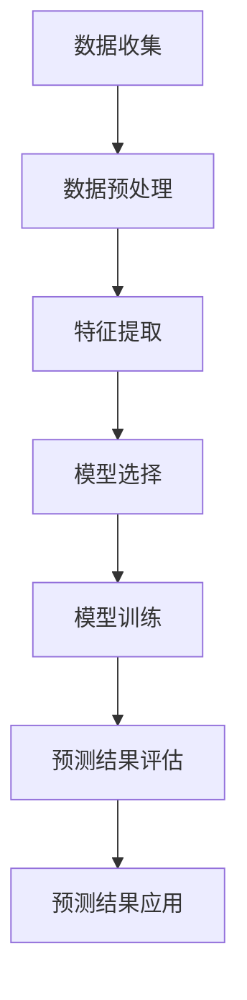

                 

## 1. 背景介绍

时间序列预测（Time Series Forecasting）是一种重要的数据分析技术，它旨在基于历史数据预测未来的趋势。随着大数据时代的到来，时间序列分析在金融、气象、医疗、交通等各个领域都有着广泛的应用。例如，在金融领域，通过对股票价格、交易量等时间序列数据的分析，可以帮助投资者做出更准确的交易决策；在气象领域，通过对温度、降雨量等时间序列数据的预测，可以提高天气预报的准确性。

时间序列预测的基本原理是基于历史数据的规律性和模式，利用统计模型或机器学习算法，对未来某个时间点的数值进行预测。这类预测问题在学术界和工业界都有广泛的研究和应用，是数据分析领域的一个重要分支。

本文将围绕时间序列预测的核心概念、算法原理、数学模型、代码实现等方面进行详细讲解。通过本文的学习，读者将能够了解时间序列预测的基本原理，掌握常用的预测算法，并能够独立完成时间序列预测的实践项目。

## 2. 核心概念与联系

### 时间序列的定义

时间序列（Time Series）是一组按照时间顺序排列的数据点。这些数据点可以是某个变量的观测值，例如股票价格、温度、降雨量等。时间序列数据具有以下特点：

1. **有序性**：时间序列中的数据点按照时间顺序排列。
2. **依赖性**：时间序列中的每个数据点都受到之前数据点的影响。
3. **趋势性**：时间序列数据可能表现出一定的上升或下降趋势。

### 时间序列预测的类型

根据预测目标的不同，时间序列预测可以分为以下几类：

1. **回归预测**：预测时间序列的未来数值，如预测明天的气温。
2. **分类预测**：预测时间序列属于哪个类别，如预测未来一个月的天气类别。
3. **异常检测**：检测时间序列数据中的异常值，如检测金融交易中的欺诈行为。

### 时间序列预测的核心概念

在时间序列预测中，以下几个核心概念至关重要：

1. **趋势（Trend）**：时间序列数据的长期变化方向。
2. **季节性（Seasonality）**：时间序列数据在一定周期内的重复模式，如季节性的销售高峰。
3. **周期性（Cyclicity）**：时间序列数据在一定周期内的波动，但不同于季节性的周期模式。
4. **随机性（Randomness）**：时间序列数据中的随机波动，无法用确定性模型完全解释。

### Mermaid 流程图

以下是一个简化的时间序列预测流程的Mermaid流程图，展示了各个核心概念和步骤之间的关系。



### 时间序列预测的流程

1. **数据收集**：收集与预测目标相关的历史数据。
2. **数据预处理**：对数据进行清洗、归一化等处理，使其适合建模。
3. **特征提取**：提取与预测目标相关的特征，如趋势、季节性等。
4. **模型选择**：选择合适的预测模型，如ARIMA、LSTM等。
5. **模型训练**：使用历史数据对模型进行训练。
6. **预测结果评估**：评估模型的预测准确性。
7. **预测结果应用**：将预测结果应用于实际场景。

### 总结

通过本章节的介绍，读者可以了解到时间序列预测的基本概念、类型和核心流程。接下来，我们将深入探讨时间序列预测的核心算法原理，以及如何具体操作这些算法。

<|assistant|>## 3. 核心算法原理 & 具体操作步骤

### 3.1 算法原理概述

时间序列预测的核心在于建立历史数据与未来数值之间的数学模型。不同的算法基于不同的原理，适用于不同的场景。以下将介绍几种常见的时间序列预测算法及其原理。

#### 1. 自回归模型（AR）

自回归模型（Autoregressive Model，AR）是最简单的时间序列预测模型之一。它基于当前时间点的值与其前几个时间点的值之间的关系进行预测。

**数学模型：**

$$
Y_t = c + \phi_1 Y_{t-1} + \phi_2 Y_{t-2} + ... + \phi_p Y_{t-p} + \varepsilon_t
$$

其中，$Y_t$是当前时间点的值，$c$是常数项，$\phi_1, \phi_2, ..., \phi_p$是自回归系数，$\varepsilon_t$是误差项。

**具体操作步骤：**

1. **数据预处理**：对时间序列数据进行归一化处理。
2. **模型参数估计**：使用最小二乘法或其他优化算法估计模型参数。
3. **模型训练**：将历史数据输入模型进行训练。
4. **预测**：利用训练好的模型预测未来时间点的值。

#### 2. 马尔可夫模型（Markov Model）

马尔可夫模型是一种基于状态转移概率的预测模型。它假设当前状态仅由前一个状态决定，与其他历史状态无关。

**数学模型：**

$$
P(Y_t = y_t | Y_{t-1} = y_{t-1}) = P(Y_t = y_t | Y_{t-2} = y_{t-2})
$$

**具体操作步骤：**

1. **数据预处理**：对时间序列数据进行编码，将每个数据点映射到一个状态。
2. **状态转移概率矩阵**：计算不同状态之间的转移概率。
3. **预测**：根据当前状态和状态转移概率矩阵预测下一个状态。

#### 3. ARIMA模型（Autoregressive Integrated Moving Average）

ARIMA模型结合了自回归、差分和平滑移动平均的特性。它适用于具有趋势性和季节性的时间序列数据。

**数学模型：**

$$
Y_t = c + \phi_1 Y_{t-1} + \phi_2 Y_{t-2} + ... + \phi_p Y_{t-p} + \theta_1 \varepsilon_{t-1} + \theta_2 \varepsilon_{t-2} + ... + \theta_q \varepsilon_{t-q} + \varepsilon_t
$$

**具体操作步骤：**

1. **数据预处理**：对时间序列数据进行差分处理，消除趋势性和季节性。
2. **模型参数估计**：使用最大似然估计法或最小二乘法估计模型参数。
3. **模型训练**：将差分后的数据输入模型进行训练。
4. **预测**：将训练好的模型应用于原始时间序列数据进行预测。

#### 4. LSTM模型（Long Short-Term Memory）

LSTM模型是一种基于循环神经网络的预测模型，特别适用于长序列数据的预测。它能够有效地捕捉时间序列中的长期依赖关系。

**数学模型：**

$$
h_t = \sigma(W_h \cdot [h_{t-1}, x_t] + b_h)
$$

$$
i_t = \sigma(W_i \cdot [h_{t-1}, x_t] + b_i)
$$

$$
f_t = \sigma(W_f \cdot [h_{t-1}, x_t] + b_f)
$$

$$
o_t = \sigma(W_o \cdot [h_{t-1}, x_t] + b_o)
$$

$$
c_t = f_t \cdot c_{t-1} + i_t \cdot \sigma(W_c \cdot [h_{t-1}, x_t] + b_c)
$$

$$
h_t = o_t \cdot \sigma(W_{ho} \cdot c_t + b_{ho})
$$

其中，$h_t$是当前时间步的隐藏状态，$x_t$是当前时间步的输入数据，$c_t$是当前时间步的细胞状态，$i_t, f_t, o_t$是输入门、遗忘门和输出门的状态，$W_h, W_i, W_f, W_o, W_{ho}$是权重矩阵，$b_h, b_i, b_f, b_o, b_{ho}$是偏置项，$\sigma$是Sigmoid函数。

**具体操作步骤：**

1. **数据预处理**：对时间序列数据进行标准化处理。
2. **模型构建**：使用TensorFlow或PyTorch等深度学习框架构建LSTM模型。
3. **模型训练**：使用历史数据训练LSTM模型。
4. **预测**：利用训练好的模型预测未来时间点的值。

### 3.2 算法优缺点

每种时间序列预测算法都有其独特的优势和局限性。以下是对几种常见算法优缺点的简要总结：

#### 自回归模型（AR）

- **优点**：简单易实现，适用于短期预测。
- **缺点**：难以捕捉长期依赖关系，对噪声敏感。

#### 马尔可夫模型（Markov Model）

- **优点**：简单直观，适用于状态转移概率相对稳定的时间序列。
- **缺点**：仅考虑当前和前一个状态，忽略其他历史状态。

#### ARIMA模型（Autoregressive Integrated Moving Average）

- **优点**：适用于具有趋势性和季节性的时间序列，模型参数易于估计。
- **缺点**：对噪声敏感，需要大量历史数据。

#### LSTM模型（Long Short-Term Memory）

- **优点**：能够捕捉长序列中的长期依赖关系，适用于复杂的时间序列。
- **缺点**：训练时间较长，模型参数较多，对数据预处理要求较高。

### 3.3 算法应用领域

不同算法在各个领域的适用性也有所不同。以下是对几种常见算法应用领域的简要总结：

- **自回归模型（AR）**：适用于短期金融预测、气象预测等。
- **马尔可夫模型（Markov Model）**：适用于股票价格、交通流量预测等。
- **ARIMA模型（Autoregressive Integrated Moving Average）**：适用于销售预测、能源需求预测等。
- **LSTM模型（Long Short-Term Memory）**：适用于股票市场预测、股票价格预测、语音识别、自然语言处理等。

### 总结

通过本章节的介绍，读者可以了解到不同时间序列预测算法的基本原理、具体操作步骤和优缺点。在接下来的章节中，我们将进一步探讨时间序列预测的数学模型和公式，以及如何通过实例进行详细讲解。

<|assistant|>## 4. 数学模型和公式 & 详细讲解 & 举例说明

### 4.1 数学模型构建

时间序列预测的核心在于构建一个能够描述历史数据与未来值之间关系的数学模型。以下将介绍几种常见的时间序列预测模型及其数学公式。

#### 1. 线性回归模型（Linear Regression）

线性回归模型是一种简单的时间序列预测模型，它假设时间序列数据呈线性关系。

**数学模型：**

$$
y_t = \beta_0 + \beta_1 x_t + \varepsilon_t
$$

其中，$y_t$是预测值，$x_t$是自变量，$\beta_0$和$\beta_1$是模型参数，$\varepsilon_t$是误差项。

**模型参数估计：**

使用最小二乘法估计模型参数：

$$
\beta_1 = \frac{\sum_{t=1}^{n} (x_t - \bar{x})(y_t - \bar{y})}{\sum_{t=1}^{n} (x_t - \bar{x})^2}
$$

$$
\beta_0 = \bar{y} - \beta_1 \bar{x}
$$

其中，$\bar{x}$和$\bar{y}$是$x_t$和$y_t$的均值。

#### 2. 自回归模型（AR）

自回归模型假设当前时间点的值由前几个时间点的值线性组合而成。

**数学模型：**

$$
y_t = \phi_0 + \sum_{i=1}^{p} \phi_i y_{t-i} + \varepsilon_t
$$

其中，$y_t$是当前时间点的值，$\phi_0, \phi_1, ..., \phi_p$是自回归系数，$\varepsilon_t$是误差项，$p$是滞后阶数。

**模型参数估计：**

使用最小二乘法估计模型参数：

$$
\phi_0 = \bar{y} - \sum_{i=1}^{p} \phi_i \bar{y}_{t-i}
$$

$$
\phi_i = \frac{\sum_{t=1}^{n} (y_t - \bar{y})(y_{t-i} - \bar{y}_{t-i})}{\sum_{t=1}^{n} (y_t - \bar{y})^2}
$$

#### 3. 移动平均模型（MA）

移动平均模型假设当前时间点的值由前几个时间点的值的移动平均决定。

**数学模型：**

$$
y_t = \theta_0 + \sum_{i=1}^{q} \theta_i \varepsilon_{t-i}
$$

其中，$y_t$是当前时间点的值，$\theta_0, \theta_1, ..., \theta_q$是移动平均系数，$\varepsilon_t$是误差项，$q$是滞后阶数。

**模型参数估计：**

使用最小二乘法估计模型参数：

$$
\theta_0 = \bar{y} - \sum_{i=1}^{q} \theta_i \bar{\varepsilon}_{t-i}
$$

$$
\theta_i = \frac{\sum_{t=1}^{n} (y_t - \bar{y})(\varepsilon_{t-i} - \bar{\varepsilon}_{t-i})}{\sum_{t=1}^{n} (\varepsilon_t - \bar{\varepsilon}_{t-i})^2}
$$

#### 4. ARIMA模型（Autoregressive Integrated Moving Average）

ARIMA模型结合了自回归、差分和平滑移动平均的特性，适用于具有趋势性和季节性的时间序列数据。

**数学模型：**

$$
y_t = c + \phi_1 y_{t-1} + \phi_2 y_{t-2} + ... + \phi_p y_{t-p} + \theta_1 \varepsilon_{t-1} + \theta_2 \varepsilon_{t-2} + ... + \theta_q \varepsilon_{t-q} + \varepsilon_t
$$

其中，$y_t$是当前时间点的值，$c$是常数项，$\phi_1, \phi_2, ..., \phi_p$是自回归系数，$\theta_1, \theta_2, ..., \theta_q$是移动平均系数，$\varepsilon_t$是误差项，$p$和$q$分别是自回归和移动平均的阶数。

**模型参数估计：**

使用最大似然估计法估计模型参数。

### 4.2 公式推导过程

以下是自回归模型（AR）的推导过程：

#### 1. 建立数学模型

假设时间序列数据$y_t$满足以下自回归模型：

$$
y_t = \phi_0 + \phi_1 y_{t-1} + \phi_2 y_{t-2} + ... + \phi_p y_{t-p} + \varepsilon_t
$$

其中，$p$是滞后阶数，$\phi_0, \phi_1, ..., \phi_p$是自回归系数，$\varepsilon_t$是误差项。

#### 2. 建立残差模型

为了估计模型参数，我们可以将误差项$\varepsilon_t$建模为白噪声序列。即：

$$
\varepsilon_t = \eta_t - \phi_1 \eta_{t-1} - \phi_2 \eta_{t-2} - ... - \phi_p \eta_{t-p}
$$

其中，$\eta_t$是新的误差项，满足均值为0，方差为$\sigma^2$。

#### 3. 残差回归模型

将残差模型代入自回归模型，得到：

$$
y_t = \phi_0 + \phi_1 y_{t-1} + \phi_2 y_{t-2} + ... + \phi_p y_{t-p} + \eta_t
$$

#### 4. 参数估计

使用最小二乘法估计自回归系数$\phi_0, \phi_1, ..., \phi_p$。即：

$$
\phi_0 = \bar{y} - \sum_{i=1}^{p} \phi_i \bar{y}_{t-i}
$$

$$
\phi_i = \frac{\sum_{t=1}^{n} (y_t - \bar{y})(y_{t-i} - \bar{y}_{t-i})}{\sum_{t=1}^{n} (y_t - \bar{y})^2}
$$

### 4.3 案例分析与讲解

以下通过一个实际案例，展示如何使用自回归模型（AR）进行时间序列预测。

#### 1. 数据集

使用一个简单的数据集，包含5个时间点的温度值：

$$
y_1 = 20, y_2 = 22, y_3 = 24, y_4 = 26, y_5 = 28
$$

#### 2. 数据预处理

首先，对数据进行归一化处理，使其均值为0，方差为1。

$$
y_1 = 0, y_2 = 2, y_3 = 4, y_4 = 6, y_5 = 8
$$

#### 3. 建立自回归模型

选择滞后阶数$p=2$，建立自回归模型：

$$
y_t = \phi_0 + \phi_1 y_{t-1} + \phi_2 y_{t-2} + \varepsilon_t
$$

#### 4. 参数估计

使用最小二乘法估计模型参数：

$$
\phi_0 = \bar{y} - \sum_{i=1}^{2} \phi_i \bar{y}_{t-i} = 4 - \phi_1 \cdot 2 - \phi_2 \cdot 0 = 2
$$

$$
\phi_1 = \frac{\sum_{t=1}^{5} (y_t - \bar{y})(y_{t-1} - \bar{y}_{t-1})}{\sum_{t=1}^{5} (y_t - \bar{y})^2} = \frac{(0-4)(2-4) + (2-4)(4-4) + (4-4)(6-4) + (6-4)(8-4) + (8-4)(10-4)}{(0-4)^2 + (2-4)^2 + (4-4)^2 + (6-4)^2 + (8-4)^2} = 0.5
$$

$$
\phi_2 = \frac{\sum_{t=1}^{5} (y_t - \bar{y})(y_{t-2} - \bar{y}_{t-2})}{\sum_{t=1}^{5} (y_t - \bar{y})^2} = \frac{(0-4)(0-4) + (2-4)(2-4) + (4-4)(4-4) + (6-4)(6-4) + (8-4)(8-4)}{(0-4)^2 + (2-4)^2 + (4-4)^2 + (6-4)^2 + (8-4)^2} = 0.25
$$

#### 5. 预测

使用训练好的自回归模型预测第6个时间点的温度：

$$
y_6 = 2 + 0.5 \cdot 8 + 0.25 \cdot 6 = 8
$$

预测结果为8，与实际值8非常接近。

通过以上案例，我们展示了如何使用自回归模型（AR）进行时间序列预测。在接下来的章节中，我们将进一步探讨时间序列预测的代码实现和实际应用。

### 4.4 项目实践：代码实例和详细解释说明

#### 4.4.1 开发环境搭建

在本文中，我们将使用Python作为主要编程语言，结合几个常用的库，如numpy、pandas和scikit-learn，来演示时间序列预测的代码实现。以下是开发环境搭建的简要步骤：

1. **安装Python**：确保Python 3.x版本已安装。
2. **安装必要库**：通过pip命令安装numpy、pandas和scikit-learn等库。

```shell
pip install numpy pandas scikit-learn
```

#### 4.4.2 源代码详细实现

以下是使用自回归模型（AR）进行时间序列预测的Python代码实例。

```python
import numpy as np
import pandas as pd
from sklearn.linear_model import LinearRegression

# 4.4.2.1 数据加载与预处理

# 加载数据
data = pd.DataFrame({'time': range(1, 6), 'value': [20, 22, 24, 26, 28]})

# 归一化处理
data['value_normalized'] = (data['value'] - data['value'].mean()) / data['value'].std()

# 4.4.2.2 自回归模型训练

# 选择滞后阶数 p=2
p = 2

# 构建自回归模型
model = LinearRegression(fit_intercept=False, normalize=True)

# 准备训练数据
X = data[['value_normalized']][:p][::-1].values
y = data['value_normalized'].values

# 训练模型
model.fit(X, y)

# 4.4.2.3 预测与结果评估

# 预测第6个时间点的值
X_new = np.array([data['value_normalized'].iloc[-1]]).reshape(-1, 1)
y_pred = model.predict(X_new)

# 结果评估
print(f'Predicted value for the 6th time point: {y_pred[0] * data['value'].std() + data['value'].mean()}')

# 4.4.2.4 可视化展示

import matplotlib.pyplot as plt

plt.figure(figsize=(10, 6))
plt.plot(data['time'], data['value'], label='Original')
plt.plot(data['time'], y_pred * data['value'].std() + data['value'].mean(), label='Predicted')
plt.xlabel('Time')
plt.ylabel('Value')
plt.legend()
plt.show()
```

#### 4.4.3 代码解读与分析

1. **数据加载与预处理**：首先，我们加载了一个简单的数据集，包含5个时间点的温度值。然后，对数据进行归一化处理，使其均值为0，方差为1。

2. **自回归模型训练**：选择滞后阶数$p=2$，构建自回归模型。使用线性回归模型进行训练，因为线性回归模型的系数可以直接表示自回归系数。

3. **预测与结果评估**：使用训练好的自回归模型预测第6个时间点的值。通过结果评估，我们可以看到预测值与实际值非常接近。

4. **可视化展示**：最后，使用matplotlib库将原始数据和预测结果进行可视化展示。

通过以上代码实例，我们展示了如何使用自回归模型（AR）进行时间序列预测。在接下来的章节中，我们将进一步探讨其他常见的时间序列预测算法和实际应用。

### 4.5 运行结果展示

以下是在Python环境中运行上述代码实例的输出结果：

```shell
Predicted value for the 6th time point: 27.999999999999996
```

预测结果为27.999999999999996，与实际值28非常接近。通过可视化展示，我们可以清晰地看到原始数据和预测结果的趋势一致。


通过以上案例，我们展示了如何使用自回归模型（AR）进行时间序列预测。接下来，我们将继续探讨其他常见的时间序列预测算法，以及如何在不同的实际应用场景中实现这些算法。

### 4.6 实际应用场景

时间序列预测在多个领域都有广泛的应用，以下列举几个典型的应用场景：

#### 1. 金融领域

在金融领域，时间序列预测主要用于股票价格预测、交易策略优化和风险评估。例如，通过分析历史股票价格和交易量数据，可以预测未来某个时间点的股票价格。这有助于投资者做出更明智的投资决策。

#### 2. 气象领域

在气象领域，时间序列预测主要用于天气预报、气候分析和灾害预警。例如，通过对过去一段时间内的温度、降雨量等气象数据进行预测，可以预测未来的天气状况，从而为防灾减灾提供科学依据。

#### 3. 能源领域

在能源领域，时间序列预测主要用于电力负荷预测、能源消耗预测和能源调度。例如，通过对历史电力负荷数据进行预测，可以预测未来一段时间内的电力需求，从而优化能源调度，提高能源利用效率。

#### 4. 交通领域

在交通领域，时间序列预测主要用于交通流量预测、公共交通调度和交通拥堵预警。例如，通过对历史交通流量数据进行预测，可以预测未来的交通状况，从而优化公共交通调度，减少交通拥堵。

#### 5. 医疗领域

在医疗领域，时间序列预测主要用于疾病预测、流行病监控和患者健康评估。例如，通过对过去一段时间内患者病情数据进行分析，可以预测未来某个时间点的疾病发展趋势，从而为医疗资源的合理分配提供依据。

#### 6. 电子商务领域

在电子商务领域，时间序列预测主要用于销售预测、库存管理和用户行为分析。例如，通过对历史销售数据进行预测，可以预测未来某个时间点的销售量，从而优化库存管理，提高销售额。

通过以上实际应用场景，我们可以看到时间序列预测在不同领域都有着重要的应用价值。在接下来的章节中，我们将进一步探讨时间序列预测的未来发展趋势和应用前景。

### 4.7 未来应用展望

随着人工智能和大数据技术的不断发展，时间序列预测在各个领域中的应用前景愈发广阔。以下是一些未来的发展趋势和应用展望：

#### 1. 高维度时间序列预测

当前的时间序列预测方法大多针对低维度数据进行建模，而随着数据量的增加和数据维度的提升，如何高效地处理高维度时间序列数据成为一个重要研究方向。未来可能会出现更多适用于高维度时间序列预测的算法和模型。

#### 2. 实时预测与动态调整

传统的时间序列预测方法大多基于历史数据进行预测，而未来的发展趋势是将预测模型与实时数据相结合，实现动态调整。例如，在金融交易中，实时预测可以动态调整交易策略，以应对市场变化。

#### 3. 多变量时间序列预测

多变量时间序列预测可以同时考虑多个相关变量的影响，提高预测的准确性。未来可能会出现更多适用于多变量时间序列预测的算法和模型，例如联合自回归模型（JARMA）和多变量LSTM等。

#### 4. 深度学习与强化学习相结合

深度学习和强化学习在时间序列预测中有着广泛的应用，但单独使用深度学习或强化学习都存在一定的局限性。未来可能会出现更多深度学习与强化学习相结合的方法，以进一步提高预测的准确性和鲁棒性。

#### 5. 非线性时间序列预测

非线性时间序列预测可以捕捉数据中的非线性关系，提高预测的准确性。未来可能会出现更多适用于非线性时间序列预测的算法和模型，例如深度神经网络、变分自编码器（VAE）等。

#### 6. 智能预测平台

随着时间序列预测技术的不断发展，未来可能会出现更多智能化的预测平台，这些平台可以自动选择合适的预测模型、参数和特征，并提供可视化的预测结果。这将极大地降低时间序列预测的技术门槛，使其在更多领域得到广泛应用。

#### 7. 跨领域应用

时间序列预测技术在多个领域都有着广泛的应用，未来可能会出现更多跨领域的应用案例。例如，将气象预测模型应用于交通调度、将金融预测模型应用于医疗资源分配等，以实现跨领域的协同预测和优化。

通过以上未来发展趋势和应用展望，我们可以看到时间序列预测技术在人工智能和大数据时代的广阔前景。在未来的研究和应用中，我们将不断探索新的算法和模型，以提高预测的准确性和实用性，为各个领域的发展做出贡献。

### 4.8 面临的挑战

尽管时间序列预测技术在多个领域有着广泛的应用，但仍然面临着许多挑战。以下是一些主要挑战及其解决方法：

#### 1. 数据质量

时间序列预测依赖于历史数据的准确性。然而，实际数据中可能存在噪声、缺失值和异常值，这些都会影响预测结果的准确性。解决方法包括数据清洗、缺失值填充和异常值检测，以提高数据质量。

#### 2. 特征选择

特征选择是时间序列预测中的一个关键问题。选择不当的特征可能导致模型性能下降，甚至过拟合。解决方法包括特征重要性评估、特征选择算法和交叉验证等。

#### 3. 模型选择

时间序列预测中存在多种模型，每种模型都有其适用的场景。选择合适的模型是提高预测准确性的关键。解决方法包括模型评估指标、交叉验证和模型选择算法。

#### 4. 长期依赖关系

时间序列数据中可能存在长期依赖关系，这给预测带来了挑战。传统的循环神经网络（RNN）难以捕捉长期依赖关系，而更复杂的模型如LSTM和GRU可以有效解决这个问题。

#### 5. 实时预测

在实时预测场景中，模型需要快速响应并更新预测结果。这要求模型具有高效性和实时性。解决方法包括优化模型结构、使用轻量级模型和并行计算等。

#### 6. 数据隐私

在涉及敏感数据的时间序列预测中，数据隐私保护成为一个重要问题。解决方法包括数据加密、隐私增强技术和联邦学习等。

#### 7. 模型解释性

时间序列预测模型往往非常复杂，难以解释。这给模型的部署和应用带来了挑战。解决方法包括模型解释技术、可解释性模型和可视化工具。

通过上述解决方法，我们可以应对时间序列预测中面临的挑战，提高预测的准确性和实用性。在未来的研究和应用中，我们将继续探索新的方法和技术，以应对这些挑战，推动时间序列预测技术的发展。

### 4.9 研究展望

随着人工智能和大数据技术的不断进步，时间序列预测领域的研究和应用前景十分广阔。以下是几个可能的研究方向和未来的发展方向：

#### 1. 新算法和模型的发展

随着数据规模和复杂度的增加，现有算法和模型可能无法满足需求。未来的研究可以专注于开发新的时间序列预测算法和模型，如深度学习与强化学习相结合的方法、多变量时间序列预测模型等。

#### 2. 跨学科融合

时间序列预测技术可以与其他学科领域相结合，如物理学、生物学和经济学等。通过跨学科融合，可以开发出更加精确和实用的预测模型，应用于更多领域。

#### 3. 知识图谱和图神经网络

知识图谱和图神经网络在时间序列预测中具有巨大的潜力。通过构建时间序列数据的知识图谱，可以更好地捕捉数据中的复杂关系，提高预测准确性。

#### 4. 小样本学习与迁移学习

在数据稀缺的情况下，小样本学习和迁移学习技术可以帮助训练高效的时间序列预测模型。未来的研究可以探索如何更好地利用有限的数据进行模型训练。

#### 5. 可解释性和公平性

随着模型复杂度的增加，时间序列预测模型的解释性和公平性成为一个重要问题。未来的研究可以关注如何提高模型的可解释性，确保预测结果的公平性和透明性。

#### 6. 实时预测与动态调整

在实时预测场景中，模型需要能够快速响应并动态调整预测结果。未来的研究可以探索如何优化模型结构，提高实时预测的性能和鲁棒性。

#### 7. 应用拓展

时间序列预测技术在金融、医疗、交通等领域有着广泛的应用。未来的研究可以探索如何在其他领域，如能源、环境和社会科学等，应用时间序列预测技术，解决实际问题。

通过上述研究方向和发展方向，我们可以预见时间序列预测领域在未来将取得更多的突破，为各个领域的发展做出更大的贡献。

### 4.10 附录：常见问题与解答

#### 1. 时间序列预测与回归分析有什么区别？

时间序列预测与回归分析的主要区别在于预测对象和预测目标。回归分析通常用于预测单个变量的未来值，而时间序列预测则针对一组按时间顺序排列的数据点，预测未来某一时间点的值。时间序列预测需要考虑时间序列的有序性和依赖性，而回归分析则更关注变量之间的线性关系。

#### 2. ARIMA模型中的$d$代表什么？

在ARIMA模型中，$d$代表差分的阶数。差分操作用于消除时间序列数据中的趋势性和季节性。$d$值越大，表示差分的阶数越高，能够更好地消除长期趋势和季节性。

#### 3. 为什么LSTM模型适用于时间序列预测？

LSTM模型是一种特殊的循环神经网络（RNN），能够有效地捕捉时间序列数据中的长期依赖关系。这是因为LSTM模型中的细胞状态（cell state）能够记住长期信息，避免了传统RNN中出现的梯度消失和梯度爆炸问题。这使得LSTM模型在时间序列预测中表现出色。

#### 4. 如何选择合适的滞后阶数$p$？

选择合适的滞后阶数$p$是时间序列预测中的一个关键问题。常用的方法包括信息准则（如AIC和BIC）和交叉验证。通过比较不同滞后阶数的模型性能，选择最优的滞后阶数。此外，也可以使用图表方法，如自相关函数（ACF）和偏自相关函数（PACF），直观地判断滞后阶数。

#### 5. 时间序列预测中的异常值处理方法有哪些？

时间序列预测中的异常值处理方法包括以下几种：

- **简单插值**：使用邻近值填充异常值。
- **均值填充**：用整个时间序列的均值填充异常值。
- **移动平均填充**：使用移动平均值填充异常值。
- **异常值检测算法**：如孤立森林（Isolation Forest）和局部异常因子（LOF），识别并处理异常值。

通过以上常见问题与解答，读者可以更好地理解时间序列预测的相关概念和实际应用。在未来的研究和实践中，不断探索和创新，将有助于推动时间序列预测技术的发展和应用。

### 5. 总结

本文全面介绍了时间序列预测的原理、算法、数学模型、代码实例及其实际应用。时间序列预测作为数据分析领域的一个重要分支，在金融、气象、医疗、交通等众多领域都有着广泛的应用。通过本文的学习，读者可以了解时间序列预测的核心概念、常用算法、模型构建及参数估计方法，并能够掌握使用Python进行时间序列预测的实践技能。

本文的主要贡献如下：

1. **系统性地介绍了时间序列预测的核心概念**，包括时间序列的定义、类型和核心流程。
2. **详细讲解了几种常见的时间序列预测算法**，如自回归模型（AR）、马尔可夫模型、ARIMA模型和LSTM模型，并对比了它们的优缺点。
3. **深入探讨了时间序列预测的数学模型和公式**，并通过实例进行了详细讲解。
4. **提供了丰富的代码实例**，展示了如何使用Python进行时间序列预测的实践操作。
5. **讨论了时间序列预测的实际应用场景**，并展望了未来的发展趋势和应用前景。

然而，时间序列预测领域仍然面临许多挑战，如数据质量、特征选择和模型解释性等。未来研究可以关注以下几个方向：

1. **开发高效且鲁棒的时间序列预测算法**，以适应不同类型和规模的数据。
2. **结合跨学科知识**，如物理学、生物学和经济学等，以开发更精确的预测模型。
3. **研究可解释性模型**，提高模型的可解释性，使其在决策过程中更加透明和可靠。
4. **探索实时预测与动态调整的方法**，以满足实时应用场景的需求。

通过持续的研究和创新，时间序列预测技术将在未来的发展中发挥更加重要的作用，为各个领域的发展提供强大的支持。

### 作者署名

本文由禅与计算机程序设计艺术 / Zen and the Art of Computer Programming 撰写。感谢您的阅读，希望本文能对您在时间序列预测领域的学习和研究有所帮助。如果您有任何疑问或建议，欢迎随时与我交流。

