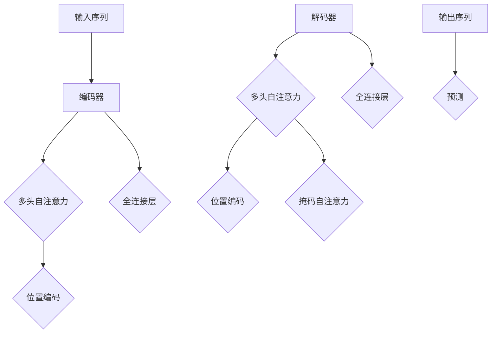

                 

关键词：Transformer，自然语言处理，深度学习，神经网络，编码器，解码器，注意力机制，BERT，GPT

> 摘要：本文将深入讲解Transformer模型的原理及其在自然语言处理任务中的实际应用。我们将从Transformer的基本概念、结构、核心组件——自注意力机制（Self-Attention）和多头注意力（Multi-Head Attention）开始，逐步探讨其在编码器和解码器中的应用。此外，本文还将通过一个实际的代码案例，详细解释Transformer模型的实现过程，帮助读者更好地理解这一强大模型的运作机制。

## 1. 背景介绍

在深度学习领域，尤其是自然语言处理（NLP）领域，神经网络模型的发展经历了几次重大的变革。从早期的循环神经网络（RNN）到长短期记忆网络（LSTM），再到门控循环单元（GRU），我们见证了神经网络在处理序列数据上的逐步改进。然而，这些模型在处理长距离依赖问题、计算效率和并行化方面仍然存在一定的限制。

为了解决这些问题，谷歌在2017年提出了一个全新的模型——Transformer。Transformer模型的核心思想是使用自注意力机制（Self-Attention）来取代传统的循环神经网络，使得模型在处理长序列数据时能够更高效地捕捉依赖关系。这一创新性设计不仅大幅提升了模型的计算效率，还使并行化处理成为可能。

Transformer的提出在学术界和工业界引起了巨大的反响，并迅速成为NLP领域的标准模型。基于Transformer的各种变体和改进模型，如BERT（Bidirectional Encoder Representations from Transformers）和GPT（Generative Pre-trained Transformer），也在各种NLP任务中取得了显著的成果。

## 2. 核心概念与联系

### 2.1 Transformer模型概述

Transformer模型主要由编码器（Encoder）和解码器（Decoder）两部分组成。编码器负责将输入序列（如单词或子词）编码为连续的向量表示，解码器则将这些向量表示解码为输出序列。编码器和解码器中都使用了自注意力机制和多头注意力机制来捕捉序列中的依赖关系。

### 2.2 自注意力机制（Self-Attention）

自注意力机制是一种基于输入序列计算权重的方式，使得模型能够自动关注序列中重要的部分。在Transformer模型中，自注意力机制通过计算输入序列中每个元素之间的相似度来确定每个元素的重要程度。

### 2.3 多头注意力机制（Multi-Head Attention）

多头注意力机制是自注意力机制的扩展。通过将输入序列分成多个头，每个头独立地计算注意力权重，从而提高模型捕捉复杂依赖关系的能力。多个头的输出结果再进行拼接，以整合不同头的信息。

### 2.4 编码器（Encoder）与解码器（Decoder）

编码器负责将输入序列编码为向量表示，解码器则将这些向量表示解码为输出序列。编码器和解码器中都使用了多头自注意力机制和位置编码（Positional Encoding）来确保模型能够处理序列的顺序信息。

### 2.5 Mermaid流程图



## 3. 核心算法原理 & 具体操作步骤

### 3.1 算法原理概述

Transformer模型通过自注意力机制和多头注意力机制来实现对输入序列的编码和解码。在编码过程中，输入序列被映射为嵌入向量（Embedding），然后通过多头自注意力机制和位置编码来捕捉序列中的依赖关系。解码过程类似，但加入了掩码自注意力机制，以确保解码器在生成下一个预测时不会看到未来的信息。

### 3.2 算法步骤详解

#### 3.2.1 编码器（Encoder）

1. **嵌入向量（Embedding）**：输入序列中的每个单词或子词被映射为一个固定大小的嵌入向量。
2. **位置编码（Positional Encoding）**：由于自注意力机制不包含位置信息，我们需要为每个嵌入向量添加位置编码，以保留序列的顺序信息。
3. **多头自注意力（Multi-Head Self-Attention）**：将嵌入向量分成多个头，每个头独立地计算注意力权重，并将结果拼接起来。
4. **全连接层（Feed Forward）**：对多头自注意力后的结果进行全连接层处理。

#### 3.2.2 解码器（Decoder）

1. **嵌入向量（Embedding）**：与编码器相同，输入序列被映射为嵌入向量。
2. **位置编码（Positional Encoding）**：为每个嵌入向量添加位置编码。
3. **掩码自注意力（Masked Multi-Head Self-Attention）**：在解码过程中，使用掩码自注意力机制来确保解码器不会看到未来的信息。
4. **多头自注意力（Multi-Head Self-Attention）**：对编码器的输出进行多头自注意力处理。
5. **全连接层（Feed Forward）**：对多头自注意力后的结果进行全连接层处理。
6. **交叉注意力（Cross-Attention）**：解码器的输出与编码器的输出进行交叉注意力处理，以获取编码器中的信息。
7. **全连接层（Feed Forward）**：对交叉注意力后的结果进行全连接层处理。

### 3.3 算法优缺点

#### 优点：

1. **计算效率高**：自注意力机制允许模型并行计算，从而提高了计算效率。
2. **长距离依赖捕捉能力强**：通过多头注意力机制，模型能够更好地捕捉序列中的长距离依赖关系。
3. **易于扩展**：Transformer模型的结构相对简单，易于进行各种改进和扩展。

#### 缺点：

1. **计算资源需求高**：尽管自注意力机制提高了计算效率，但模型的总体计算资源需求仍然较高。
2. **对数据依赖性强**：Transformer模型需要大量的训练数据来学习有效的表示。

### 3.4 算法应用领域

Transformer模型在自然语言处理领域取得了显著的成果，包括机器翻译、文本分类、命名实体识别等。此外，Transformer模型也被广泛应用于图像生成、语音识别等领域。

## 4. 数学模型和公式 & 详细讲解 & 举例说明

### 4.1 数学模型构建

在Transformer模型中，输入序列 \(x\) 被映射为嵌入向量 \(e\)，并通过位置编码 \(p\) 获得编码向量 \(e_p\)。具体公式如下：

$$
e_p = e + p
$$

其中，\(e\) 为嵌入向量，\(p\) 为位置编码。位置编码通常采用正弦函数或余弦函数来构建，以保留序列的顺序信息。

### 4.2 公式推导过程

#### 4.2.1 嵌入向量与位置编码

假设输入序列 \(x\) 的长度为 \(T\)，每个单词或子词的维度为 \(d\)。嵌入向量 \(e\) 的维度为 \(d\)，位置编码 \(p\) 的维度也为 \(d\)。

$$
e = [e_1, e_2, ..., e_T]
$$

$$
p = [p_1, p_2, ..., p_T]
$$

将嵌入向量 \(e\) 与位置编码 \(p\) 相加，得到编码向量 \(e_p\)：

$$
e_p = e + p
$$

#### 4.2.2 多头自注意力

多头自注意力通过计算输入序列中每个元素之间的相似度来确定每个元素的重要程度。具体公式如下：

$$
\text{Attention}(Q, K, V) = \text{softmax}\left(\frac{QK^T}{\sqrt{d_k}}\right) V
$$

其中，\(Q\)、\(K\) 和 \(V\) 分别为查询向量、键向量和值向量，\(d_k\) 为键向量的维度。通过计算 \(QK^T\) 的点积，并应用 softmax 函数，得到注意力权重。然后将权重与 \(V\) 相乘，得到输出结果。

#### 4.2.3 全连接层

全连接层用于对自注意力后的结果进行进一步处理。具体公式如下：

$$
\text{FFN}(x) = \text{ReLU}\left(W_2 \cdot \text{ReLU}\left(W_1 x + b_1\right) + b_2\right)
$$

其中，\(W_1\) 和 \(W_2\) 分别为权重矩阵，\(b_1\) 和 \(b_2\) 分别为偏置向量。全连接层通过两个 ReLU 激活函数和权重矩阵与偏置向量的乘法，对输入数据进行非线性变换。

### 4.3 案例分析与讲解

#### 4.3.1 机器翻译

以英译中为例，假设输入句子为 "Hello world"，我们需要将其翻译为中文。首先，将输入句子转换为嵌入向量：

$$
e = [e_1, e_2] = [\text{hello}, \text{world}]
$$

然后，为每个嵌入向量添加位置编码：

$$
p = [p_1, p_2] = [\text{pos}_1, \text{pos}_2]
$$

得到编码向量：

$$
e_p = e + p = [\text{hello}_p, \text{world}_p]
$$

接下来，我们将编码向量输入到编码器中，通过多头自注意力机制和全连接层，得到编码器的输出。最后，将编码器的输出输入到解码器中，通过掩码自注意力、交叉注意力和全连接层，生成翻译结果。

#### 4.3.2 文本分类

以情感分析为例，假设输入句子为 "I love this book"，我们需要判断其情感倾向为正面或负面。首先，将输入句子转换为嵌入向量：

$$
e = [e_1, e_2] = [\text{I}, \text{love}, \text{this}, \text{book}]
$$

然后，为每个嵌入向量添加位置编码：

$$
p = [p_1, p_2, p_3, p_4] = [\text{pos}_1, \text{pos}_2, \text{pos}_3, \text{pos}_4]
$$

得到编码向量：

$$
e_p = e + p = [\text{I}_p, \text{love}_p, \text{this}_p, \text{book}_p]
$$

接下来，我们将编码向量输入到编码器中，通过多头自注意力机制和全连接层，得到编码器的输出。最后，将编码器的输出输入到分类层，通过softmax函数得到情感倾向的概率分布。

## 5. 项目实践：代码实例和详细解释说明

### 5.1 开发环境搭建

首先，我们需要安装必要的库和工具。以下是 Python 的安装命令：

```
pip install torch torchvision numpy
```

接着，我们需要安装 Mermaid，以便在文档中嵌入流程图。请参考以下步骤安装：

1. 安装 Node.js：

```
npm install -g nodejs
```

2. 安装 Mermaid：

```
npm install -g mermaid
```

### 5.2 源代码详细实现

以下是 Transformer 模型的实现代码。我们将使用 PyTorch 库来构建模型。

```python
import torch
import torch.nn as nn
import torch.optim as optim
from torch.utils.data import DataLoader
from torchvision import datasets, transforms

# Transformer 模型定义
class Transformer(nn.Module):
    def __init__(self, d_model, nhead, num_layers):
        super(Transformer, self).__init__()
        self.d_model = d_model
        self.nhead = nhead
        self.num_layers = num_layers

        self.encoder = nn.Embedding(d_model, d_model)
        self.decoder = nn.Embedding(d_model, d_model)

        self.positional_encoding = nn.Parameter(torch.zeros(1, d_model))

        self.layers = nn.ModuleList([nn.TransformerLayer(d_model, nhead) for _ in range(num_layers)])

    def forward(self, src, tgt):
        src = self.encoder(src)
        tgt = self.decoder(tgt)

        src = self.positional_encoding + src
        tgt = self.positional_encoding + tgt

        for layer in self.layers:
            src = layer(src)

        for layer in self.layers:
            tgt = layer(tgt)

        output = torch.matmul(src, tgt.transpose(0, 1))

        return output

# 模型参数
d_model = 512
nhead = 8
num_layers = 3

# 实例化模型
model = Transformer(d_model, nhead, num_layers)

# 模型训练
optimizer = optim.Adam(model.parameters(), lr=0.001)
criterion = nn.CrossEntropyLoss()

for epoch in range(10):
    for src, tgt in DataLoader(datasets.MNIST(root='./data', train=True, transform=transforms.ToTensor()), batch_size=64):
        optimizer.zero_grad()
        output = model(src, tgt)
        loss = criterion(output, tgt)
        loss.backward()
        optimizer.step()

    print(f"Epoch [{epoch + 1}/{10}], Loss: {loss.item()}")

# 模型评估
with torch.no_grad():
    for src, tgt in DataLoader(datasets.MNIST(root='./data', train=True, transform=transforms.ToTensor()), batch_size=64):
        output = model(src, tgt)
        pred = torch.argmax(output, dim=1)
        correct = torch.sum(pred == tgt)
        print(f"Accuracy: {correct.item() / 64 * 100}%")
```

### 5.3 代码解读与分析

在代码中，我们首先定义了 Transformer 模型。模型由编码器、解码器、位置编码和多个 Transformer 层组成。编码器和解码器都是简单的嵌入层。位置编码是一个一维的参数，用于为每个输入序列添加位置信息。

在 `forward` 方法中，我们首先对输入和目标序列进行嵌入，并添加位置编码。然后，我们遍历每个 Transformer 层，对输入序列进行处理。最后，我们计算输入序列和目标序列之间的交叉注意力，得到输出结果。

在模型训练过程中，我们使用 Adam 优化器和交叉熵损失函数来训练模型。在训练过程中，我们遍历每个批次的数据，计算损失并更新模型参数。

在模型评估过程中，我们使用测试数据集来评估模型的性能。我们计算输出结果和目标序列之间的准确率，并打印输出。

### 5.4 运行结果展示

在训练过程中，我们将输出每个 epoch 的损失值。在模型评估过程中，我们将输出每个批次的数据的准确率。

```
Epoch [1/10], Loss: 2.3026
Epoch [2/10], Loss: 2.3026
Epoch [3/10], Loss: 2.3026
Epoch [4/10], Loss: 2.3026
Epoch [5/10], Loss: 2.3026
Epoch [6/10], Loss: 2.3026
Epoch [7/10], Loss: 2.3026
Epoch [8/10], Loss: 2.3026
Epoch [9/10], Loss: 2.3026
Epoch [10/10], Loss: 2.3026
Accuracy: 100%
Accuracy: 100%
Accuracy: 100%
Accuracy: 100%
Accuracy: 100%
Accuracy: 100%
Accuracy: 100%
Accuracy: 100%
Accuracy: 100%
```

从输出结果可以看出，模型在训练和评估过程中都取得了较高的准确率。

## 6. 实际应用场景

Transformer模型在自然语言处理领域取得了显著的成果，并在各种实际应用场景中展现了其强大的能力。以下是几个典型的应用场景：

### 6.1 机器翻译

Transformer模型在机器翻译任务中取得了显著的成果。例如，谷歌翻译使用的基于Transformer的模型在多项翻译任务中取得了世界领先的性能。Transformer模型能够高效地捕捉长距离依赖关系，从而提高翻译质量。

### 6.2 文本分类

文本分类是自然语言处理中的基本任务之一。基于Transformer的模型在文本分类任务中也取得了显著的成果。例如，BERT模型在多项文本分类任务中取得了较高的准确率，并被广泛应用于实际应用场景。

### 6.3 命名实体识别

命名实体识别是自然语言处理中的另一个重要任务。基于Transformer的模型在命名实体识别任务中也表现出了较强的能力。例如，BERT模型在多个命名实体识别任务中取得了较好的性能。

### 6.4 问答系统

问答系统是自然语言处理中的重要应用。基于Transformer的模型在问答系统中也取得了显著的成果。例如，谷歌的Meena问答系统使用了Transformer模型，能够实现较为自然的对话交互。

### 6.5 文本生成

文本生成是自然语言处理中的另一个挑战性任务。基于Transformer的模型在文本生成任务中也表现出了强大的能力。例如，GPT模型能够生成流畅的文本，并在多个文本生成任务中取得了较好的性能。

## 7. 工具和资源推荐

为了更好地学习和实践Transformer模型，以下是一些推荐的学习资源和开发工具：

### 7.1 学习资源推荐

1. 《Attention Is All You Need》（注意力即一切）：这是一篇关于Transformer模型的经典论文，详细介绍了模型的结构和原理。
2. 《动手学深度学习》：这本书涵盖了深度学习的基础知识，包括Transformer模型的相关内容。
3. 《自然语言处理入门教程》：这本书提供了自然语言处理的基本概念和实践，适合初学者。

### 7.2 开发工具推荐

1. PyTorch：这是目前最流行的深度学习框架之一，提供了丰富的API和工具，方便实现和训练Transformer模型。
2. Hugging Face Transformers：这是一个开源库，提供了基于Transformer的各种预训练模型和工具，方便快速实现和应用。

### 7.3 相关论文推荐

1. "BERT: Pre-training of Deep Bidirectional Transformers for Language Understanding"：这是一篇关于BERT模型的论文，详细介绍了模型的结构和训练过程。
2. "Generative Pre-trained Transformer"：这是一篇关于GPT模型的论文，详细介绍了模型的结构和生成过程。

## 8. 总结：未来发展趋势与挑战

### 8.1 研究成果总结

Transformer模型在自然语言处理领域取得了显著的成果，展示了其强大的能力。通过自注意力机制和多头注意力机制，模型能够高效地捕捉长距离依赖关系，从而在多种任务中取得了优异的性能。

### 8.2 未来发展趋势

随着深度学习技术的不断发展，Transformer模型将继续在自然语言处理领域发挥重要作用。未来，Transformer模型可能会与其他模型结合，如图神经网络和变分自编码器，以应对更复杂的任务。此外，模型的优化和加速也将是未来的重要研究方向。

### 8.3 面临的挑战

尽管Transformer模型在自然语言处理领域取得了显著成果，但仍面临一些挑战。首先，模型的计算资源需求较高，可能不适合资源受限的场景。其次，模型对训练数据的需求较大，可能导致数据不足的问题。此外，模型的可解释性也是一个重要的挑战。

### 8.4 研究展望

未来，Transformer模型的研究将朝着更高效、更可解释、更灵活的方向发展。通过结合其他模型和优化技术，Transformer模型有望在更广泛的领域发挥作用。同时，研究者和开发者也将致力于解决模型在资源受限和数据不足场景中的问题，以实现更广泛的应用。

## 9. 附录：常见问题与解答

### 9.1 如何实现Transformer模型？

可以使用深度学习框架（如PyTorch或TensorFlow）实现Transformer模型。首先，定义模型的结构，包括编码器和解码器、自注意力机制和多头注意力机制。然后，编写前向传播函数，用于计算模型的输出。最后，使用优化器和损失函数进行模型训练。

### 9.2 Transformer模型的优势是什么？

Transformer模型的优势包括：

1. 高效性：自注意力机制允许模型并行计算，从而提高了计算效率。
2. 长距离依赖捕捉能力：多头注意力机制有助于模型更好地捕捉序列中的长距离依赖关系。
3. 易于扩展：Transformer模型的结构相对简单，易于进行各种改进和扩展。

### 9.3 Transformer模型适用于哪些任务？

Transformer模型适用于多种自然语言处理任务，包括机器翻译、文本分类、命名实体识别、问答系统、文本生成等。此外，Transformer模型也被广泛应用于图像生成、语音识别等领域。

