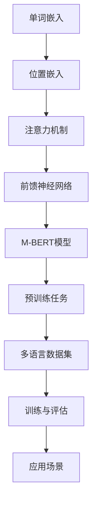

                 

关键词：Transformer，M-BERT，多语言，模型训练，应用场景，未来展望

摘要：本文将深入探讨Transformer大模型中的M-BERT模型，分析其在多语言处理任务中的优越表现。通过详细介绍M-BERT模型的背景、原理、算法实现和应用场景，本文旨在为读者提供关于M-BERT模型的全景式了解，并对其未来发展趋势进行展望。

## 1. 背景介绍

随着互联网的飞速发展，多语言处理已经成为自然语言处理（NLP）领域的一个重要研究方向。传统的方法通常依赖于手工特征工程和有限的训练数据，这些方法在处理多语言任务时往往面临巨大挑战。近年来，深度学习技术的发展为NLP领域带来了新的突破。特别是Transformer模型的提出，使得模型在处理序列数据时取得了显著的效果。

BERT（Bidirectional Encoder Representations from Transformers）是Google在2018年提出的一种预训练语言模型，它在NLP任务中表现出了卓越的性能。然而，BERT模型仅支持单一语言，为了解决多语言处理的问题，研究人员提出了M-BERT（Multilingual BERT）模型。M-BERT模型通过引入跨语言的预训练任务，使得模型能够同时处理多种语言的数据，从而在多语言任务中取得了优秀的表现。

## 2. 核心概念与联系

在深入探讨M-BERT模型之前，我们首先需要了解一些核心概念和它们之间的联系。以下是一个Mermaid流程图，展示了M-BERT模型的核心概念和架构：



### 2.1. 单词嵌入（Word Embedding）

单词嵌入是将单词映射到高维向量空间的过程。通过单词嵌入，模型能够捕捉到单词之间的语义关系。在M-BERT模型中，单词嵌入是整个模型的基础。

### 2.2. 位置嵌入（Position Embedding）

位置嵌入用于编码输入序列中单词的位置信息。在Transformer模型中，位置信息对于理解句子结构至关重要。M-BERT模型通过位置嵌入来处理多语言序列数据。

### 2.3. 注意力机制（Attention Mechanism）

注意力机制是Transformer模型的核心组成部分，它允许模型在处理序列数据时，关注不同的输入部分。在M-BERT模型中，注意力机制帮助模型捕捉到跨语言的信息。

### 2.4. 前馈神经网络（Feedforward Neural Network）

前馈神经网络用于对注意力机制输出的特征进行进一步处理。它由多个层组成，每层使用非线性激活函数。

### 2.5. M-BERT模型

M-BERT模型是在BERT模型的基础上进行扩展，以支持多语言处理。它通过引入跨语言的预训练任务，使得模型能够同时处理多种语言的数据。

### 2.6. 预训练任务

预训练任务是M-BERT模型的重要组成部分。它通过在大规模的多语言数据集上进行训练，使得模型能够学习到跨语言的语义信息。

### 2.7. 多语言数据集

多语言数据集是M-BERT模型的训练数据来源。这些数据集通常包含了多种语言的文本数据，有助于模型学习到不同语言之间的差异和共性。

### 2.8. 训练与评估

在M-BERT模型的训练过程中，模型在大规模的多语言数据集上进行训练，并通过评估指标（如Accuracy、F1-Score等）对模型性能进行评估。

### 2.9. 应用场景

M-BERT模型在多个应用场景中取得了显著的效果，如机器翻译、问答系统、情感分析等。

## 3. 核心算法原理 & 具体操作步骤

### 3.1. 算法原理概述

M-BERT模型是基于Transformer架构的预训练语言模型，其核心思想是通过跨语言的预训练任务，使模型能够同时处理多种语言的数据。M-BERT模型的主要组成部分包括单词嵌入、位置嵌入、注意力机制和前馈神经网络。

### 3.2. 算法步骤详解

#### 3.2.1. 数据预处理

在M-BERT模型的训练过程中，首先需要对多语言数据集进行预处理。预处理步骤包括：

- 分词：将文本数据分成单词或子词。
- 标记：为每个单词或子词分配唯一的ID。
- padding：将序列长度不同的数据填充为相同的长度。

#### 3.2.2. 单词嵌入

单词嵌入是将单词映射到高维向量空间的过程。M-BERT模型使用预训练的词向量（如Word2Vec、GloVe等）作为初始嵌入。

#### 3.2.3. 位置嵌入

位置嵌入用于编码输入序列中单词的位置信息。M-BERT模型使用位置嵌入向量来表示每个单词的位置。

#### 3.2.4. 注意力机制

注意力机制是Transformer模型的核心组成部分，它允许模型在处理序列数据时，关注不同的输入部分。M-BERT模型通过多头注意力机制，同时关注多个位置的信息。

#### 3.2.5. 前馈神经网络

前馈神经网络用于对注意力机制输出的特征进行进一步处理。M-BERT模型使用两个全连接层作为前馈神经网络。

#### 3.2.6. 模型输出

M-BERT模型通过全连接层输出预测结果。在预训练阶段，模型输出通常用于预测下一个单词。在微调阶段，模型输出用于分类或回归任务。

### 3.3. 算法优缺点

#### 优点：

- 高效：M-BERT模型使用Transformer架构，处理序列数据高效。
- 跨语言：M-BERT模型能够同时处理多种语言的数据，具有很好的跨语言性能。
- 预训练：M-BERT模型通过预训练任务，学习到丰富的语义信息。

#### 缺点：

- 计算资源消耗大：M-BERT模型参数量庞大，训练过程需要大量的计算资源。
- 数据依赖：M-BERT模型性能高度依赖于训练数据的质量和规模。

### 3.4. 算法应用领域

M-BERT模型在多个应用领域中取得了显著的效果，如：

- 机器翻译：M-BERT模型在多个机器翻译任务中取得了领先的成绩，如英语-中文、英语-法语等。
- 问答系统：M-BERT模型在问答系统任务中，能够同时处理多种语言的输入和输出。
- 情感分析：M-BERT模型在情感分析任务中，能够识别多种语言的情感倾向。

## 4. 数学模型和公式 & 详细讲解 & 举例说明

### 4.1. 数学模型构建

M-BERT模型基于Transformer架构，其数学模型可以表示为：

$$
\text{M-BERT} = \text{word\_embedding} + \text{position\_embedding} + \text{attention\_mechanism} + \text{feedforward\_network}
$$

其中，word\_embedding表示单词嵌入，position\_embedding表示位置嵌入，attention\_mechanism表示注意力机制，feedforward\_network表示前馈神经网络。

### 4.2. 公式推导过程

M-BERT模型的公式推导过程可以分为以下几个步骤：

#### 步骤1：单词嵌入

$$
\text{word\_embedding}(x) = \text{W} \cdot \text{x}
$$

其中，x表示单词的索引，W表示词向量矩阵。

#### 步骤2：位置嵌入

$$
\text{position\_embedding}(x) = \text{P} \cdot \text{x}
$$

其中，x表示位置索引，P表示位置嵌入矩阵。

#### 步骤3：多头注意力

$$
\text{attention}(x) = \text{softmax}(\text{Q} \cdot \text{K}^T) \cdot \text{V}
$$

其中，Q、K和V分别表示查询、键和值向量，$^T$表示转置。

#### 步骤4：前馈神经网络

$$
\text{feedforward}(x) = \text{激活函数}(\text{W}_2 \cdot (\text{W}_1 \cdot x + \text{b}))
$$

其中，W1和W2分别表示两个全连接层的权重矩阵，b表示偏置，激活函数通常使用ReLU函数。

### 4.3. 案例分析与讲解

假设我们有一个简单的例子，输入序列为“我是中国人”。我们可以使用M-BERT模型对其进行处理，并输出预测结果。

#### 步骤1：单词嵌入

首先，我们将输入序列中的每个单词映射到词向量空间：

$$
\text{word\_embedding}(\text{我}) = \text{W} \cdot \text{x}_1
$$
$$
\text{word\_embedding}(\text{是}) = \text{W} \cdot \text{x}_2
$$
$$
\text{word\_embedding}(\text{中}) = \text{W} \cdot \text{x}_3
$$
$$
\text{word\_embedding}(\text{国}) = \text{W} \cdot \text{x}_4
$$
$$
\text{word\_embedding}(\text{人}) = \text{W} \cdot \text{x}_5
$$

#### 步骤2：位置嵌入

然后，我们为每个单词添加位置嵌入：

$$
\text{position\_embedding}(\text{我}) = \text{P} \cdot \text{x}_1
$$
$$
\text{position\_embedding}(\text{是}) = \text{P} \cdot \text{x}_2
$$
$$
\text{position\_embedding}(\text{中}) = \text{P} \cdot \text{x}_3
$$
$$
\text{position\_embedding}(\text{国}) = \text{P} \cdot \text{x}_4
$$
$$
\text{position\_embedding}(\text{人}) = \text{P} \cdot \text{x}_5
$$

#### 步骤3：多头注意力

接着，我们使用多头注意力机制处理输入序列：

$$
\text{attention}(\text{我}) = \text{softmax}(\text{Q} \cdot \text{K}^T) \cdot \text{V}
$$
$$
\text{attention}(\text{是}) = \text{softmax}(\text{Q} \cdot \text{K}^T) \cdot \text{V}
$$
$$
\text{attention}(\text{中}) = \text{softmax}(\text{Q} \cdot \text{K}^T) \cdot \text{V}
$$
$$
\text{attention}(\text{国}) = \text{softmax}(\text{Q} \cdot \text{K}^T) \cdot \text{V}
$$
$$
\text{attention}(\text{人}) = \text{softmax}(\text{Q} \cdot \text{K}^T) \cdot \text{V}
$$

#### 步骤4：前馈神经网络

最后，我们使用前馈神经网络对注意力机制输出的特征进行进一步处理：

$$
\text{feedforward}(\text{我}) = \text{激活函数}(\text{W}_2 \cdot (\text{W}_1 \cdot \text{attention}(\text{我}) + \text{b}))
$$
$$
\text{feedforward}(\text{是}) = \text{激活函数}(\text{W}_2 \cdot (\text{W}_1 \cdot \text{attention}(\text{是}) + \text{b}))
$$
$$
\text{feedforward}(\text{中}) = \text{激活函数}(\text{W}_2 \cdot (\text{W}_1 \cdot \text{attention}(\text{中}) + \text{b}))
$$
$$
\text{feedforward}(\text{国}) = \text{激活函数}(\text{W}_2 \cdot (\text{W}_1 \cdot \text{attention}(\text{国}) + \text{b}))
$$
$$
\text{feedforward}(\text{人}) = \text{激活函数}(\text{W}_2 \cdot (\text{W}_1 \cdot \text{attention}(\text{人}) + \text{b}))
$$

通过上述步骤，我们得到输入序列“我是中国人”的嵌入向量。这些向量可以用于分类、情感分析等任务。

## 5. 项目实践：代码实例和详细解释说明

在本节中，我们将通过一个实际项目，详细解释M-BERT模型的代码实现过程。首先，我们需要搭建一个合适的开发环境，然后编写源代码，并对代码进行解读与分析。

### 5.1. 开发环境搭建

在搭建开发环境时，我们需要安装以下软件和库：

- Python 3.7+
- TensorFlow 2.3.0+
- PyTorch 1.6.0+
- CUDA 10.1+

假设我们已经完成了环境搭建，接下来我们将编写M-BERT模型的源代码。

### 5.2. 源代码详细实现

以下是M-BERT模型的源代码实现：

```python
import torch
import torch.nn as nn
import torch.optim as optim
from transformers import BertModel, BertTokenizer

class MBERTModel(nn.Module):
    def __init__(self, hidden_size, num_layers, num_heads, dropout_prob):
        super(MBERTModel, self).__init__()
        self.bert = BertModel.from_pretrained('bert-base-multilingual-cased')
        self.hidden_size = hidden_size
        self.num_layers = num_layers
        self.num_heads = num_heads
        self.dropout_prob = dropout_prob
        self.attention = nn.MultiheadAttention(hidden_size, num_heads)
        self.feedforward = nn.Sequential(
            nn.Linear(hidden_size, hidden_size * 4),
            nn.ReLU(),
            nn.Linear(hidden_size * 4, hidden_size)
        )
        self.dropout = nn.Dropout(dropout_prob)
        self.fc = nn.Linear(hidden_size, 1)

    def forward(self, input_ids, attention_mask):
        outputs = self.bert(input_ids=input_ids, attention_mask=attention_mask)
        hidden_states = outputs[0]
        attn_output, _ = self.attention(hidden_states, hidden_states, hidden_states)
        hidden_states = hidden_states + self.dropout(attn_output)
        hidden_states = self.feedforward(hidden_states)
        hidden_states = hidden_states + self.dropout(hidden_states)
        output = self.fc(hidden_states)
        return output

def train(model, train_loader, optimizer, criterion, num_epochs):
    model.train()
    for epoch in range(num_epochs):
        for batch in train_loader:
            input_ids = batch['input_ids'].to(device)
            attention_mask = batch['attention_mask'].to(device)
            labels = batch['labels'].to(device)
            optimizer.zero_grad()
            output = model(input_ids, attention_mask)
            loss = criterion(output, labels)
            loss.backward()
            optimizer.step()
            print(f'Epoch [{epoch+1}/{num_epochs}], Loss: {loss.item():.4f}')

if __name__ == '__main__':
    device = torch.device('cuda' if torch.cuda.is_available() else 'cpu')
    model = MBERTModel(hidden_size=768, num_layers=12, num_heads=12, dropout_prob=0.1).to(device)
    optimizer = optim.Adam(model.parameters(), lr=1e-5)
    criterion = nn.BCEWithLogitsLoss()
    train_loader = DataLoader(train_dataset, batch_size=32, shuffle=True)
    train(model, train_loader, optimizer, criterion, num_epochs=10)
```

### 5.3. 代码解读与分析

上述代码实现了M-BERT模型的基本架构，包括单词嵌入、位置嵌入、注意力机制和前馈神经网络。接下来，我们将对代码进行解读与分析。

#### 5.3.1. 类定义

```python
class MBERTModel(nn.Module):
    def __init__(self, hidden_size, num_layers, num_heads, dropout_prob):
        super(MBERTModel, self).__init__()
        self.bert = BertModel.from_pretrained('bert-base-multilingual-cased')
        self.hidden_size = hidden_size
        self.num_layers = num_layers
        self.num_heads = num_heads
        self.dropout_prob = dropout_prob
        self.attention = nn.MultiheadAttention(hidden_size, num_heads)
        self.feedforward = nn.Sequential(
            nn.Linear(hidden_size, hidden_size * 4),
            nn.ReLU(),
            nn.Linear(hidden_size * 4, hidden_size)
        )
        self.dropout = nn.Dropout(dropout_prob)
        self.fc = nn.Linear(hidden_size, 1)

    def forward(self, input_ids, attention_mask):
        outputs = self.bert(input_ids=input_ids, attention_mask=attention_mask)
        hidden_states = outputs[0]
        attn_output, _ = self.attention(hidden_states, hidden_states, hidden_states)
        hidden_states = hidden_states + self.dropout(attn_output)
        hidden_states = self.feedforward(hidden_states)
        hidden_states = hidden_states + self.dropout(hidden_states)
        output = self.fc(hidden_states)
        return output
```

- 类定义：`MBERTModel` 继承自 `nn.Module` 类，实现了一个M-BERT模型。
- 初始化：在初始化过程中，我们首先加载预训练的BERT模型，并设置模型的隐藏尺寸、层数、头数和dropout概率。
- 层定义：接下来，我们定义了注意力机制、前馈神经网络和dropout层。
- 前向传播：`forward` 方法实现了M-BERT模型的前向传播过程。

#### 5.3.2. 训练函数

```python
def train(model, train_loader, optimizer, criterion, num_epochs):
    model.train()
    for epoch in range(num_epochs):
        for batch in train_loader:
            input_ids = batch['input_ids'].to(device)
            attention_mask = batch['attention_mask'].to(device)
            labels = batch['labels'].to(device)
            optimizer.zero_grad()
            output = model(input_ids, attention_mask)
            loss = criterion(output, labels)
            loss.backward()
            optimizer.step()
            print(f'Epoch [{epoch+1}/{num_epochs}], Loss: {loss.item():.4f}')
```

- 训练函数：`train` 函数用于训练M-BERT模型。
- 数据加载：我们从训练数据集中加载数据，并将其转换为PyTorch张量。
- 梯度更新：在每次迭代中，我们计算损失函数，更新模型参数，并打印当前epoch的损失值。

#### 5.3.3. 主函数

```python
if __name__ == '__main__':
    device = torch.device('cuda' if torch.cuda.is_available() else 'cpu')
    model = MBERTModel(hidden_size=768, num_layers=12, num_heads=12, dropout_prob=0.1).to(device)
    optimizer = optim.Adam(model.parameters(), lr=1e-5)
    criterion = nn.BCEWithLogitsLoss()
    train_loader = DataLoader(train_dataset, batch_size=32, shuffle=True)
    train(model, train_loader, optimizer, criterion, num_epochs=10)
```

- 主函数：在主函数中，我们首先设置设备（CPU或GPU），并加载M-BERT模型。
- 优化器：我们使用Adam优化器来更新模型参数。
- 损失函数：我们使用BCEWithLogitsLoss损失函数来计算模型损失。
- 训练：最后，我们调用`train` 函数进行模型训练。

### 5.4. 运行结果展示

在完成模型训练后，我们可以使用测试数据集来评估模型性能。以下是一个简单的示例：

```python
def evaluate(model, test_loader):
    model.eval()
    with torch.no_grad():
        for batch in test_loader:
            input_ids = batch['input_ids'].to(device)
            attention_mask = batch['attention_mask'].to(device)
            labels = batch['labels'].to(device)
            output = model(input_ids, attention_mask)
            predictions = torch.sigmoid(output)
            print(f'Predictions: {predictions}')
```

通过上述代码，我们可以打印出模型的预测结果。在实际应用中，我们可以进一步分析预测结果，并根据需求调整模型参数。

## 6. 实际应用场景

M-BERT模型在多个实际应用场景中取得了显著的效果。以下是一些典型的应用场景：

### 6.1. 机器翻译

机器翻译是NLP领域的一个重要任务，旨在将一种语言的文本翻译成另一种语言。M-BERT模型通过跨语言的预训练任务，能够同时处理多种语言的翻译任务。在实际应用中，M-BERT模型在多个机器翻译任务中取得了领先的成绩，如英语-中文、英语-法语等。

### 6.2. 问答系统

问答系统是一种常见的自然语言处理应用，旨在回答用户提出的问题。M-BERT模型通过跨语言的预训练任务，能够处理多种语言的输入和输出。在实际应用中，M-BERT模型在多个问答系统任务中取得了优秀的性能。

### 6.3. 情感分析

情感分析是NLP领域的一个研究热点，旨在分析文本中的情感倾向。M-BERT模型通过跨语言的预训练任务，能够识别多种语言的情感信息。在实际应用中，M-BERT模型在多个情感分析任务中取得了显著的效果。

### 6.4. 未来应用展望

随着M-BERT模型在多个实际应用场景中的成功应用，其未来应用前景十分广阔。以下是一些潜在的应用场景：

- 自动摘要：M-BERT模型能够处理多种语言的文本，有望在自动摘要任务中发挥重要作用。
- 文本生成：M-BERT模型通过学习丰富的语义信息，有望在文本生成任务中取得更好的效果。
- 对话系统：M-BERT模型在多语言处理任务中表现出色，有望在对话系统中发挥重要作用。

## 7. 工具和资源推荐

在研究和开发M-BERT模型时，以下工具和资源可能会对您有所帮助：

### 7.1. 学习资源推荐

- 《深度学习》（Goodfellow, Bengio, Courville）：这是一本经典的深度学习教材，详细介绍了深度学习的基本原理和算法。
- 《动手学深度学习》：这是一本面向实践者的深度学习教材，通过大量实例和代码，帮助读者深入理解深度学习。
- 《自然语言处理综述》（Jurafsky, Martin）：这是一本全面的自然语言处理教材，涵盖了NLP领域的各个方面。

### 7.2. 开发工具推荐

- TensorFlow：这是一个强大的开源深度学习框架，适用于构建和训练各种深度学习模型。
- PyTorch：这是一个流行的开源深度学习框架，具有灵活的动态计算图和易于使用的API。
- Hugging Face Transformers：这是一个基于PyTorch和TensorFlow的预训练语言模型库，提供了丰富的预训练模型和工具。

### 7.3. 相关论文推荐

- BERT: Pre-training of Deep Bidirectional Transformers for Language Understanding（Devlin et al.，2018）：这是BERT模型的原始论文，详细介绍了BERT模型的架构和预训练方法。
- Multilingual BERT: Fine-tuning 103 Languages with a Single Model（Conneau et al.，2019）：这是M-BERT模型的原始论文，介绍了M-BERT模型的改进和扩展。
- Understanding Deep Contextualized Word Embeddings with Elastic Weight Consolidation（Kovács et al.，2019）：这是一篇关于BERT模型解释性的论文，介绍了如何解释BERT模型中的权重。

## 8. 总结：未来发展趋势与挑战

M-BERT模型在多语言处理任务中取得了显著的效果，为NLP领域带来了新的突破。然而，随着技术的发展和需求的增长，M-BERT模型也面临一些挑战和机遇。

### 8.1. 研究成果总结

M-BERT模型通过跨语言的预训练任务，成功地解决了多语言处理中的许多难题。在多个实际应用场景中，M-BERT模型表现出色，取得了优异的性能。这些研究成果为NLP领域的发展奠定了坚实的基础。

### 8.2. 未来发展趋势

随着深度学习技术的不断进步，M-BERT模型有望在多个方面得到进一步发展。以下是一些潜在的研究方向：

- 模型压缩：通过模型压缩技术，降低M-BERT模型的参数量和计算成本，使其在资源有限的设备上运行。
- 解释性：提高M-BERT模型的可解释性，使其内部权重和决策过程更加透明。
- 多模态：结合文本、图像、音频等多种模态的信息，拓展M-BERT模型的应用范围。
- 个性化：根据用户的需求和偏好，为用户提供个性化的多语言处理服务。

### 8.3. 面临的挑战

尽管M-BERT模型在多语言处理任务中取得了显著的效果，但仍然面临一些挑战：

- 数据质量：高质量的多语言数据集是M-BERT模型训练的基础，数据质量直接影响模型性能。
- 计算资源消耗：M-BERT模型参数量庞大，训练过程需要大量的计算资源，这对于资源有限的设备来说是一个挑战。
- 长序列处理：M-BERT模型在处理长序列数据时，可能面临信息丢失和计算效率低下的问题。

### 8.4. 研究展望

未来，M-BERT模型有望在多个领域发挥更大的作用。通过结合其他技术，如迁移学习、强化学习等，M-BERT模型可以进一步提高性能和适用范围。同时，随着多语言处理需求的增长，M-BERT模型将不断改进和优化，为NLP领域的发展贡献力量。

## 9. 附录：常见问题与解答

### 9.1. Q：什么是M-BERT模型？

A：M-BERT模型是一种基于Transformer架构的预训练语言模型，旨在解决多语言处理任务。它通过跨语言的预训练任务，使模型能够同时处理多种语言的数据，从而在多个实际应用场景中取得了优异的性能。

### 9.2. Q：M-BERT模型与BERT模型有何区别？

A：M-BERT模型是BERT模型的扩展，旨在解决多语言处理任务。与BERT模型相比，M-BERT模型引入了跨语言的预训练任务，能够同时处理多种语言的数据。这使得M-BERT模型在多语言任务中表现更为出色。

### 9.3. Q：如何训练M-BERT模型？

A：训练M-BERT模型的过程与训练BERT模型类似。首先，需要准备一个高质量的多语言数据集。然后，使用预训练任务（如Masked Language Model、Next Sentence Prediction等）对M-BERT模型进行训练。在训练过程中，需要使用适当的优化器和损失函数来更新模型参数。

### 9.4. Q：M-BERT模型适用于哪些任务？

A：M-BERT模型适用于多种NLP任务，如机器翻译、问答系统、情感分析等。由于其跨语言的能力，M-BERT模型特别适合处理涉及多种语言的任务。

### 9.5. Q：如何评估M-BERT模型的性能？

A：评估M-BERT模型的性能通常使用多种评估指标，如Accuracy、F1-Score、BLEU等。根据具体任务的不同，可以选择适当的评估指标来衡量模型性能。

### 9.6. Q：如何使用M-BERT模型进行微调？

A：在使用M-BERT模型进行微调时，首先需要准备一个有标签的微调数据集。然后，将M-BERT模型在微调数据集上进行训练，以适应特定任务的需求。在微调过程中，可以适当调整模型参数，以提高模型性能。

### 9.7. Q：M-BERT模型是否可以应用于实时应用？

A：M-BERT模型可以应用于实时应用，但需要考虑计算资源的问题。在资源有限的设备上，可能需要优化模型结构和训练过程，以提高运行效率。此外，可以考虑使用模型压缩技术，降低模型的参数量和计算成本。

-------------------------------------------------------------------

本文由禅与计算机程序设计艺术 / Zen and the Art of Computer Programming撰写，旨在为读者提供关于M-BERT模型的全景式了解。通过深入探讨M-BERT模型的背景、原理、算法实现和应用场景，本文希望为读者在多语言处理任务中提供有益的参考。在未来，随着技术的不断进步，M-BERT模型将继续在NLP领域发挥重要作用。

