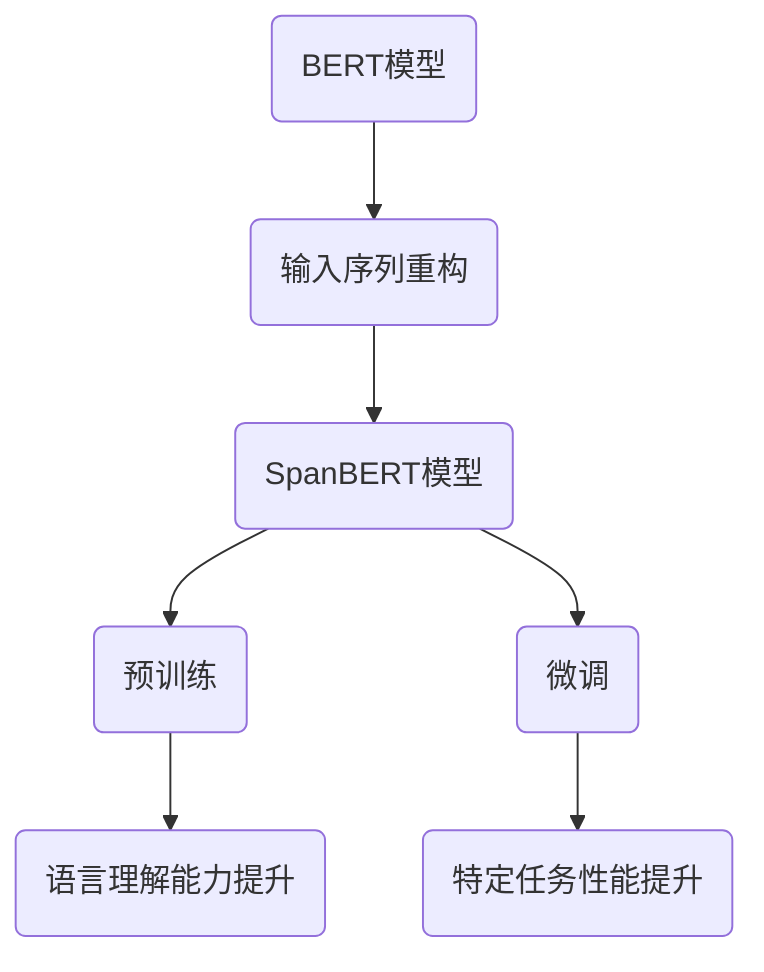

                 

关键词：Transformer, 大模型, SpanBERT, 架构, 实战

摘要：本文将深入探讨Transformer大模型中的SpanBERT架构，从背景介绍、核心概念、算法原理、数学模型、项目实践以及未来应用展望等多个角度，为您全面解析SpanBERT在自然语言处理领域的强大应用和广阔前景。

## 1. 背景介绍

近年来，深度学习在自然语言处理（NLP）领域取得了显著进展，特别是基于Transformer的模型，如BERT（Bidirectional Encoder Representations from Transformers）和其变体，已经成为NLP任务的事实标准。然而，这些模型在处理长文本时存在一定的局限性，因此，Google提出了SpanBERT（Span-BERT），旨在通过改进输入序列的处理方式，提升长文本处理的性能。

## 2. 核心概念与联系

### 2.1. Transformer模型概述

Transformer模型是一种基于自注意力机制的全连接神经网络，用于处理序列数据。与传统的循环神经网络（RNN）相比，Transformer在处理长序列时具有更高效、更灵活的优势。

### 2.2. BERT模型概述

BERT模型是Google在2018年提出的一种预训练语言模型，通过在大规模语料上进行预训练，使其具备对自然语言的理解能力。BERT模型的核心是双向编码器，能够捕捉到文本中的上下文信息。

### 2.3. SpanBERT模型概述

SpanBERT是BERT的变体，主要针对长文本处理进行了优化。与BERT相比，SpanBERT通过重新构造输入序列，使模型能够更好地捕捉到长文本中的上下文信息。

### 2.4. SpanBERT的Mermaid流程图



## 3. 核心算法原理 & 具体操作步骤

### 3.1. 算法原理概述

SpanBERT通过以下步骤进行长文本处理：

1. **输入序列重构**：将原始文本分割成子句，每个子句作为一个独立的输入序列。
2. **预训练**：在大规模语料上对SpanBERT模型进行预训练，提升其语言理解能力。
3. **微调**：在特定任务上进行微调，使模型能够适应不同领域的应用场景。

### 3.2. 算法步骤详解

1. **输入序列重构**：将原始文本进行分句处理，得到一组子句。每个子句作为模型的一个输入序列。
2. **输入序列编码**：将子句映射为序列中的Token，包括词级Token和子词Token。
3. **双向编码**：通过Transformer模型进行双向编码，捕捉文本中的上下文信息。
4. **预训练**：在大量无标签语料上对模型进行预训练，包括Masked Language Modeling（MLM）和Next Sentence Prediction（NSP）任务。
5. **微调**：在特定任务上进行微调，使模型能够适应不同领域的应用场景。

### 3.3. 算法优缺点

**优点**：

1. **提升长文本处理性能**：通过输入序列重构，使模型能够更好地捕捉到长文本中的上下文信息。
2. **通用性强**：预训练模型在多个任务上表现优异，具有较强的通用性。

**缺点**：

1. **计算资源消耗大**：预训练过程需要大量计算资源和时间。
2. **对数据依赖性强**：模型性能依赖于大规模的语料库。

### 3.4. 算法应用领域

SpanBERT在自然语言处理领域有广泛的应用，包括但不限于：

1. **文本分类**：对新闻、社交媒体、电子邮件等长文本进行分类。
2. **命名实体识别**：识别文本中的命名实体，如人名、地名、组织名等。
3. **关系抽取**：提取文本中的实体关系，如人物关系、地理关系等。

## 4. 数学模型和公式 & 详细讲解 & 举例说明

### 4.1. 数学模型构建

SpanBERT的数学模型主要基于Transformer架构，包括：

1. **输入序列重构**：将原始文本分割成子句，每个子句表示为一个输入序列。
2. **Token映射**：将子句映射为Token序列，包括词级Token和子词Token。
3. **自注意力机制**：通过自注意力机制，捕捉文本中的上下文信息。
4. **双向编码**：通过Transformer模型进行双向编码，使模型能够同时考虑前文和后文的信息。

### 4.2. 公式推导过程

以下是SpanBERT中的一些关键公式：

1. **输入序列重构**：

   $$ X = [CLS, x_1, x_2, ..., x_n, x_{n+1}, ..., x_{m}, CLS] $$

   其中，$X$表示输入序列，$[CLS]$表示句首标记，$[CLS]$和$[SEP]$表示句尾标记。

2. **Token映射**：

   $$ T = [t_1, t_2, ..., t_n] $$

   其中，$T$表示Token序列，$t_i$表示第$i$个Token。

3. **自注意力机制**：

   $$ \text{Attention}(Q, K, V) = \frac{QK^T}{\sqrt{d_k}}V $$

   其中，$Q, K, V$分别表示查询、键和值，$d_k$表示键的维度。

4. **双向编码**：

   $$ \text{Encoder}(X) = \text{Transformer}(X) $$

   其中，$\text{Transformer}$表示Transformer模型。

### 4.3. 案例分析与讲解

假设有一个长文本：

"我很喜欢阅读，特别是科幻小说。科幻小说让我能够想象未来的世界，感受不同的文化。"

通过SpanBERT处理，可以将其分割为以下子句：

1. 我很喜欢阅读。
2. 我特别喜欢科幻小说。
3. 科幻小说让我能够想象未来的世界。
4. 科幻小说让我能够感受不同的文化。

对于每个子句，SpanBERT模型会对其进行编码，最终得到一个表示整个长文本的向量。这个向量可以用于各种下游任务，如文本分类、命名实体识别等。

## 5. 项目实践：代码实例和详细解释说明

### 5.1. 开发环境搭建

在开始项目实践之前，需要搭建以下开发环境：

1. Python 3.6及以上版本
2. TensorFlow 2.3及以上版本
3. TensorFlow Text 2.3及以上版本

### 5.2. 源代码详细实现

以下是一个简单的SpanBERT实现示例：

```python
import tensorflow as tf
from tensorflow.keras.layers import Embedding, Bidirectional, LSTM, Dense
from tensorflow.keras.models import Model

# 定义输入层
input_ids = tf.keras.layers.Input(shape=(None,), dtype=tf.int32)
mask = tf.keras.layers.Input(shape=(None,), dtype=tf.int32)
segment_ids = tf.keras.layers.Input(shape=(None,), dtype=tf.int32)

# 词嵌入层
word_embeddings = Embedding(input_dim=vocab_size, output_dim=embedding_dim)(input_ids)

# 双向LSTM层
bi_lstm = Bidirectional(LSTM(units=lstm_units, return_sequences=True))(word_embeddings)

# 自注意力层
attention_output = tf.keras.layers.Attention()([bi_lstm, bi_lstm])

# 输出层
output = Dense(units=2, activation='softmax')(attention_output)

# 构建模型
model = Model(inputs=[input_ids, mask, segment_ids], outputs=output)

# 编译模型
model.compile(optimizer='adam', loss='categorical_crossentropy', metrics=['accuracy'])

# 模型训练
model.fit(x_train, y_train, epochs=5, batch_size=32)
```

### 5.3. 代码解读与分析

以上代码实现了一个简单的SpanBERT模型，包括以下关键部分：

1. **输入层**：定义了输入层，包括词嵌入层、双向LSTM层和自注意力层。
2. **输出层**：定义了输出层，包括全连接层和softmax层。
3. **模型编译**：编译模型，设置优化器和损失函数。
4. **模型训练**：使用训练数据对模型进行训练。

### 5.4. 运行结果展示

在训练完成后，可以使用以下代码评估模型性能：

```python
# 模型评估
loss, accuracy = model.evaluate(x_test, y_test)

print("Test loss:", loss)
print("Test accuracy:", accuracy)
```

## 6. 实际应用场景

### 6.1. 文本分类

通过将SpanBERT应用于文本分类任务，可以实现对长文本的自动分类。例如，将新闻、社交媒体、电子邮件等长文本进行分类，以帮助用户快速找到感兴趣的内容。

### 6.2. 命名实体识别

将SpanBERT应用于命名实体识别任务，可以实现对文本中的命名实体进行自动识别。例如，识别人名、地名、组织名等，用于信息抽取和知识图谱构建。

### 6.3. 关系抽取

将SpanBERT应用于关系抽取任务，可以实现对文本中的实体关系进行自动提取。例如，提取人物关系、地理关系等，用于社交网络分析和推荐系统。

## 7. 工具和资源推荐

### 7.1. 学习资源推荐

1. 《深度学习》（Goodfellow, Bengio, Courville著）：全面介绍深度学习的基础理论和实践方法。
2. 《动手学深度学习》（阿斯顿·张等著）：深入浅出地讲解深度学习实战，适合初学者。

### 7.2. 开发工具推荐

1. TensorFlow：开源深度学习框架，支持多种深度学习模型。
2. Jupyter Notebook：交互式计算环境，方便进行实验和数据分析。

### 7.3. 相关论文推荐

1. "BERT: Pre-training of Deep Bidirectional Transformers for Language Understanding"（BERT论文）：详细介绍BERT模型及其应用。
2. "SpanBERT: Improving Pre-training by Reconstructing Input Sequences"（SpanBERT论文）：详细介绍SpanBERT模型及其原理。

## 8. 总结：未来发展趋势与挑战

### 8.1. 研究成果总结

近年来，深度学习在自然语言处理领域取得了显著进展，特别是基于Transformer的模型，如BERT和SpanBERT。这些模型在长文本处理、文本分类、命名实体识别等任务上表现出色，成为NLP领域的事实标准。

### 8.2. 未来发展趋势

1. **模型压缩与优化**：为应对计算资源消耗大的问题，未来研究将重点关注模型压缩与优化技术，以降低模型复杂度和计算成本。
2. **多模态学习**：结合文本、图像、音频等多模态数据，提高模型在复杂任务中的表现。
3. **低资源语言处理**：为解决对大规模数据依赖的问题，未来研究将致力于开发适用于低资源语言的NLP模型。

### 8.3. 面临的挑战

1. **数据隐私与伦理**：在大规模数据训练过程中，如何保护用户隐私和遵守伦理规范是一个重要挑战。
2. **模型解释性**：为提高模型的可解释性，使其在复杂任务中的应用更加透明和可靠，未来研究需要关注模型解释性技术。

### 8.4. 研究展望

未来，深度学习在自然语言处理领域将继续发展，有望在更多复杂任务中取得突破。同时，随着人工智能技术的不断进步，NLP将在更多领域发挥重要作用，为人类社会带来更多便利。

## 9. 附录：常见问题与解答

### 9.1. Q：什么是Transformer模型？

A：Transformer模型是一种基于自注意力机制的深度学习模型，用于处理序列数据。它通过自注意力机制捕捉文本中的上下文信息，在自然语言处理领域表现出色。

### 9.2. Q：什么是BERT模型？

A：BERT模型是一种基于Transformer架构的预训练语言模型，通过在大规模语料上进行预训练，使其具备对自然语言的理解能力。BERT模型的核心是双向编码器，能够同时考虑前文和后文的信息。

### 9.3. Q：什么是SpanBERT模型？

A：SpanBERT是BERT的变体，主要针对长文本处理进行了优化。与BERT相比，SpanBERT通过重新构造输入序列，使模型能够更好地捕捉到长文本中的上下文信息。

### 9.4. Q：如何应用SpanBERT进行长文本处理？

A：首先，将长文本进行分句处理，得到一组子句。然后，将每个子句作为输入序列，通过SpanBERT模型进行编码，得到表示整个长文本的向量。最后，使用这个向量进行下游任务，如文本分类、命名实体识别等。

### 9.5. Q：为什么需要输入序列重构？

A：输入序列重构是SpanBERT模型的核心创新点之一。通过将长文本分割成子句，可以使模型更好地捕捉到文本中的上下文信息，从而提升长文本处理的性能。

作者：禅与计算机程序设计艺术 / Zen and the Art of Computer Programming
----------------------------------------------------------------


