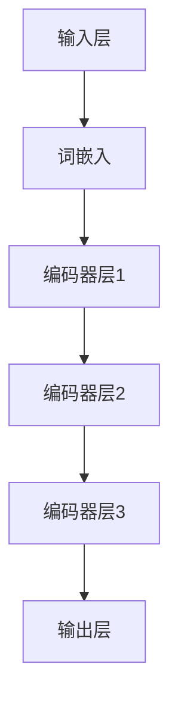

                 

### 引言 Introduction

近年来，自然语言处理（NLP）领域取得了飞速的进步，这一进步在很大程度上得益于深度学习技术的发展。Transformer架构的引入，特别是BERT（Bidirectional Encoder Representations from Transformers）模型的提出，标志着NLP研究进入了一个新的时代。BERT作为一种预训练语言模型，通过在大量文本数据上进行训练，能够捕捉到语言中的复杂结构信息，并在多种NLP任务上取得显著的效果。

BERT模型的双向编码器设计使其能够理解上下文信息，这为许多任务带来了极大的改进，例如问答系统、文本分类和命名实体识别等。然而，随着模型规模的不断增大，如何有效地管理和利用模型中的知识成为了一个重要的研究课题。

本文的目标是介绍如何从BERT的所有编码器层中提取嵌入，从而为后续的研究和应用提供便利。提取嵌入的方法不仅可以用于理解模型的内部表示，还可以用于快速构建特定领域的语言模型，提高模型的适应性和效率。

本文的结构如下：

1. **背景介绍**：回顾Transformer和BERT模型的发展历程，以及它们在NLP领域的应用。
2. **核心概念与联系**：介绍BERT模型的结构，并使用Mermaid流程图展示编码器层之间的关系。
3. **核心算法原理 & 具体操作步骤**：详细解析BERT模型的训练和层间交互机制。
4. **数学模型和公式 & 详细讲解 & 举例说明**：阐述BERT模型中的数学原理，并通过实例进行说明。
5. **项目实践：代码实例和详细解释说明**：提供一个简单的代码示例，展示如何从BERT模型中提取嵌入。
6. **实际应用场景**：探讨提取嵌入在NLP中的应用，以及未来可能的扩展方向。
7. **工具和资源推荐**：推荐学习资源和开发工具，帮助读者更好地理解和实践BERT模型。
8. **总结：未来发展趋势与挑战**：总结BERT模型的研究成果，探讨未来的发展趋势和面临的挑战。
9. **附录：常见问题与解答**：回答读者可能遇到的常见问题。

通过本文的详细探讨，读者将能够了解如何从BERT模型中提取嵌入，并理解其背后的技术和应用场景。

## 1. 背景介绍

自然语言处理（NLP）作为人工智能领域的一个重要分支，其目标是使计算机能够理解和处理人类语言。在过去的几十年里，NLP经历了从规则驱动的方法到基于统计和机器学习的方法，再到现在的深度学习方法的发展历程。早期的NLP系统依赖于手工设计的语法规则和词典，这种方法虽然具有一定的准确性，但在处理复杂和未预见的语言现象时显得力不从心。随着计算能力的提升和数据规模的扩大，基于统计和机器学习的方法逐渐成为主流，这些方法通过从大规模语料库中学习语言模式，提高了NLP系统的性能。

深度学习技术在NLP领域的应用可以追溯到2000年代初，当时Rumelhart等人提出了长短期记忆（LSTM）网络，这是一种能够处理长距离依赖的循环神经网络。LSTM在许多NLP任务上取得了显著的效果，但它的计算复杂度较高，训练时间较长，限制了其在大规模数据处理中的应用。

随着深度学习技术的进一步发展，特别是2014年谷歌提出Transformer模型后，NLP领域迎来了新的变革。与传统的循环神经网络相比，Transformer模型采用了自注意力机制，通过全局关注的方式处理输入序列，这一机制大大提高了模型的计算效率和并行处理能力。Transformer的提出标志着NLP领域从序列处理向并行处理的转变，为后续的许多研究工作奠定了基础。

BERT（Bidirectional Encoder Representations from Transformers）模型是由谷歌在2018年提出的一种预训练语言表示模型。BERT模型结合了Transformer架构的双向编码器设计和大量的语料库，通过在无监督的方式下预训练，然后针对特定任务进行微调，取得了在多个NLP任务上前所未有的效果。BERT模型的提出，不仅推动了NLP技术的发展，也引发了深度学习在各个领域的广泛应用。

BERT模型的成功引发了大量的研究工作，研究者们试图优化模型的架构、扩展训练数据规模以及改进预训练任务。例如，谷歌后续推出了RoBERTa、ALBERT等改进模型，这些模型在保持高性能的同时，降低了计算和存储成本。此外，BERT模型的应用也拓展到了自然语言生成、机器翻译、文本生成等更多领域，成为NLP领域的标准工具之一。

在BERT模型的基础上，提取编码器层中的嵌入信息成为了一个重要的研究方向。通过提取嵌入，研究者可以更好地理解模型的内部表示，分析模型在不同任务中的表现，甚至可以用于快速构建特定领域的语言模型。本文将深入探讨如何从BERT的所有编码器层中提取嵌入，介绍相关技术和应用，希望能够为读者提供有价值的参考。

## 2. 核心概念与联系

在深入探讨如何从BERT的所有编码器层中提取嵌入之前，我们需要对BERT模型的核心概念和结构有清晰的理解。BERT模型的核心组成部分包括输入处理、自注意力机制和输出层。理解这些组成部分及其相互作用，对于掌握如何提取嵌入至关重要。

### 2.1 BERT模型的结构

BERT模型主要由以下几个部分构成：

- **输入层**：BERT模型的输入是一个序列，通常是一个单词或子词序列。这些输入会通过词嵌入层转换成密集的向量表示。
- **编码器**：编码器是BERT模型的核心，由多个自注意力层（Self-Attention Layers）和前馈神经网络（Feedforward Neural Networks）堆叠而成。每个编码器层都包含自注意力机制和前馈神经网络，它们共同作用以捕捉输入序列的上下文信息。
- **输出层**：编码器的输出是一个序列，其中每个元素代表了输入序列中每个单词或子词的上下文表示。这些输出可以被用于下游任务，如文本分类、问答系统等。

### 2.2 自注意力机制

自注意力机制（Self-Attention）是BERT模型的关键创新之一。自注意力允许模型在处理每个词时，自动关注输入序列中的其他词，从而捕捉词与词之间的复杂关系。自注意力机制通过计算不同词之间的相似性得分，然后将这些得分用于加权组合输入向量，生成上下文向量。具体来说，自注意力机制包括以下步骤：

1. **Query、Key 和 Value**：每个词都会生成对应的Query、Key和Value向量。Query向量用于计算相似性得分，Key和Value向量用于生成上下文向量。
2. **相似性计算**：通过计算Query和Key之间的点积，得到每个词之间的相似性得分。这些得分用于表示词与词之间的关系。
3. **加权组合**：将相似性得分用于加权组合Value向量，生成每个词的上下文向量。这个过程称为自注意力。

### 2.3 编码器层的交互

BERT模型的编码器层通过逐层叠加的方式，逐渐加深对输入序列的理解。每个编码器层都会接收来自前一层的信息，通过自注意力机制和前馈神经网络进行处理，然后将结果传递给下一层。这种层间交互机制使得模型能够逐渐捕捉到输入序列中的高层次语义信息。

为了更直观地理解BERT模型的结构和层间交互，我们可以使用Mermaid流程图来展示其核心组成部分。以下是一个简化的Mermaid流程图示例：



在这个流程图中，A表示输入层，B表示词嵌入层，C、D、E分别表示编码器层的三个不同层次，F表示输出层。每个编码器层通过自注意力机制和前馈神经网络进行处理，并将信息传递给下一层。这种结构使得BERT模型能够逐层加深对输入序列的理解，最终生成具有丰富上下文信息的输出。

### 2.4 层间交互机制的作用

BERT模型中的层间交互机制在提取嵌入时起到了关键作用。通过逐层叠加的自注意力机制和前馈神经网络，模型能够捕捉到输入序列中的多层次语义信息。这种多层次的信息融合使得提取的嵌入不仅包含了单个词的直接信息，还包括了其在上下文中的语义信息。

为了更好地理解层间交互机制的作用，我们可以通过以下三个层次来分析：

1. **单词级别**：在最低层次，每个编码器层都能捕捉到单词级别的语义信息。这些信息通过词嵌入层传递到编码器层，并在自注意力机制中进一步融合。
2. **句子级别**：随着层数的增加，编码器层逐渐能够捕捉到句子级别的语义信息。通过层间交互机制，不同编码器层之间的信息传递和融合，句子中的词汇关系和语义结构得以被有效捕捉。
3. **文档级别**：在最顶层，编码器层能够捕捉到整个文档的宏观语义信息。这些信息通过层间传递，最终在输出层中生成具有全局上下文信息的嵌入。

通过层间交互机制，BERT模型能够从多个层次上捕捉输入序列的语义信息，从而生成高质量的嵌入。这种多层次的信息融合机制，使得BERT模型在多个NLP任务上表现出色，并成为自然语言处理领域的重要工具。

总之，理解BERT模型的结构和层间交互机制是提取嵌入的关键。通过掌握这些核心概念，研究者可以更深入地分析模型的内部表示，并有效地应用于各种NLP任务。

### 3. 核心算法原理 & 具体操作步骤

#### 3.1 算法原理概述

BERT（Bidirectional Encoder Representations from Transformers）模型的核心算法原理基于Transformer架构中的自注意力机制（Self-Attention）和多层编码器结构。BERT通过在大量无标签文本数据上进行预训练，然后针对特定任务进行微调，从而生成高质量的语言表示。具体来说，BERT模型的主要步骤包括输入处理、预训练任务和微调任务。

#### 3.2 算法步骤详解

1. **输入处理**：
   - **词嵌入**：BERT模型使用WordPiece算法将文本拆分成子词，并将每个子词映射到一个向量表示。这一步将文本转换为密集的向量形式，方便后续处理。
   - **输入序列**：对于每个输入序列，BERT模型会添加一个特殊的[CLS]标记作为序列的开始，并在序列的末尾添加一个特殊的[SEP]标记。这些特殊标记用于后续任务中的分类和分割。
   - **位置编码**：为了保持输入序列中的词语顺序，BERT模型使用位置编码（Positional Encoding）对输入向量进行编码。位置编码是一个可学习的向量，用于表示每个词在序列中的位置信息。

2. **预训练任务**：
   - **Masked Language Model (MLM)**：在MLM任务中，BERT模型会随机屏蔽输入序列中的部分子词，然后通过预测这些被屏蔽的子词来训练模型。这一任务有助于模型学习理解子词之间的依赖关系和上下文信息。
   - **Next Sentence Prediction (NSP)**：NSP任务要求模型预测两个连续句子中是否存在下一个句子关系。这一任务有助于模型学习句子间的语义关系。

3. **微调任务**：
   - **下游任务**：在预训练完成后，BERT模型可以用于各种下游任务，如文本分类、命名实体识别、问答系统等。针对特定任务，模型的最后一层输出会被映射到相应的任务层，进行微调。
   - **特征提取**：在微调过程中，模型最后一层的输出通常会被用作特征向量，用于训练下游任务。

#### 3.3 算法优缺点

**优点**：
- **强大的上下文理解**：通过自注意力机制，BERT模型能够捕捉到输入序列中的复杂上下文信息，从而生成高质量的文本表示。
- **广泛的适用性**：BERT模型在多种NLP任务上表现出色，如文本分类、命名实体识别、机器翻译等。
- **预训练与微调结合**：BERT模型通过预训练和微调相结合的方式，能够在多个任务上实现高效的性能提升。

**缺点**：
- **计算和存储需求大**：BERT模型的训练和推理过程需要大量的计算资源和存储空间，这对模型的部署和扩展构成了一定的挑战。
- **训练时间较长**：由于模型参数规模庞大，BERT模型的训练时间较长，这对于实验和开发过程可能带来不便。

#### 3.4 算法应用领域

BERT模型的应用领域广泛，主要包括以下几个方面：

- **文本分类**：BERT模型在文本分类任务上表现出色，能够高效地生成文本的语义表示，用于分类。
- **命名实体识别**：BERT模型能够捕捉到实体与上下文之间的复杂关系，从而提高命名实体识别的准确性。
- **问答系统**：BERT模型在问答系统中被广泛应用于理解用户问题和文档内容之间的关联。
- **机器翻译**：BERT模型在机器翻译任务中也表现出色，能够生成高质量的翻译结果。
- **对话系统**：BERT模型被用于对话系统中的上下文理解，以生成更自然和准确的对话响应。

通过深入理解BERT模型的核心算法原理和具体操作步骤，我们可以更好地应用这一强大的语言表示模型，推动自然语言处理领域的发展。

### 4. 数学模型和公式 & 详细讲解 & 举例说明

#### 4.1 数学模型构建

BERT模型的数学基础主要来自于Transformer架构中的自注意力机制和多层感知器（MLP）。为了详细讲解BERT模型的数学原理，我们需要从基础的自注意力机制开始。

#### 4.1.1 自注意力机制

自注意力机制的核心在于计算输入序列中每个词与其余词之间的相似性，并通过这些相似性计算出一个加权组合向量。具体来说，自注意力机制包含以下几个步骤：

1. **查询（Query）、键（Key）和值（Value）向量的生成**：
   每个词在序列中都会被映射为三个向量：Query、Key和Value。
   \[
   \text{Query} = \text{softmax}(\text{WQ} \cdot \text{Embedding})
   \]
   \[
   \text{Key} = \text{softmax}(\text{WK} \cdot \text{Embedding})
   \]
   \[
   \text{Value} = \text{softmax}(\text{WV} \cdot \text{Embedding})
   \]
   其中，\(\text{Embedding}\)表示词嵌入向量，\(\text{WQ}\)、\(\text{WK}\)和\(\text{WV}\)分别为Query、Key和Value的权重矩阵。

2. **相似性计算**：
   通过计算Query和Key之间的点积，得到每个词之间的相似性得分：
   \[
   \text{Score} = \text{Query} \cdot \text{Key}^T
   \]

3. **加权组合**：
   利用softmax函数对相似性得分进行归一化，得到权重向量：
   \[
   \text{Weight} = \text{softmax}(\text{Score})
   \]
   然后将这些权重用于组合Value向量，得到每个词的上下文向量：
   \[
   \text{Context} = \text{Weight} \cdot \text{Value}
   \]

#### 4.1.2 编码器层的数学模型

BERT模型的编码器层由多个自注意力层（Self-Attention Layers）和前馈神经网络（Feedforward Neural Networks）堆叠而成。以下是一个编码器层的数学模型：

1. **自注意力层**：
   \[
   \text{Attention} = \text{softmax}(\text{Score}) \cdot \text{Value}
   \]
   \[
   \text{Output} = \text{Attention} + \text{Input}
   \]
   其中，\(\text{Input}\)为输入向量，\(\text{Attention}\)为加权组合后的输出向量。

2. **前馈神经网络**：
   \[
   \text{Feedforward} = \text{ReLU}(\text{W2} \cdot (\text{Input} + \text{Attention}) + \text{b2})
   \]
   \[
   \text{Output} = \text{W1} \cdot \text{Feedforward} + \text{b1}
   \]
   其中，\(\text{W1}\)和\(\text{W2}\)分别为前馈神经网络的权重矩阵，\(\text{b1}\)和\(\text{b2}\)分别为偏置向量。

#### 4.2 公式推导过程

BERT模型的训练过程涉及到多层自注意力机制和前馈神经网络的组合。以下是一个简化的公式推导过程：

1. **损失函数**：
   BERT模型的损失函数通常由两个部分组成：Masked Language Model（MLM）损失和Next Sentence Prediction（NSP）损失。
   \[
   \text{Loss} = \text{MLM Loss} + \text{NSP Loss}
   \]
   其中，\(\text{MLM Loss}\)为Masked Language Model的交叉熵损失，\(\text{NSP Loss}\)为Next Sentence Prediction的二元交叉熵损失。

2. **反向传播**：
   在训练过程中，通过反向传播算法更新模型参数。具体来说，损失函数对模型参数的梯度计算如下：
   \[
   \frac{\partial \text{Loss}}{\partial \text{Params}} = \frac{\partial \text{Loss}}{\partial \text{Output}} \cdot \frac{\partial \text{Output}}{\partial \text{Params}}
   \]
   其中，\(\frac{\partial \text{Loss}}{\partial \text{Output}}\)为损失函数对输出向量的梯度，\(\frac{\partial \text{Output}}{\partial \text{Params}}\)为输出向量对模型参数的梯度。

3. **优化算法**：
   通常使用梯度下降（Gradient Descent）或其变种（如Adam优化器）来更新模型参数，以最小化损失函数。
   \[
   \text{Params}_{\text{new}} = \text{Params}_{\text{old}} - \alpha \cdot \frac{\partial \text{Loss}}{\partial \text{Params}}
   \]
   其中，\(\alpha\)为学习率。

#### 4.3 案例分析与讲解

为了更好地理解BERT模型的数学原理，我们通过一个简单的案例进行分析。假设我们有一个包含三个单词的简单序列：“我”，“喜欢”，“苹果”。BERT模型将这个序列映射到嵌入空间，并使用自注意力机制进行编码。

1. **词嵌入**：
   每个词被映射为一个嵌入向量，例如：
   \[
   \text{我} = [1, 0, 0], \quad \text{喜欢} = [0, 1, 0], \quad \text{苹果} = [0, 0, 1]
   \]

2. **自注意力计算**：
   对于“我”，我们计算它与“喜欢”和“苹果”的相似性得分：
   \[
   \text{Score}_{\text{我-喜欢}} = \text{我} \cdot \text{喜欢}^T = [1, 0, 0] \cdot [0, 1, 0]^T = 0
   \]
   \[
   \text{Score}_{\text{我-苹果}} = \text{我} \cdot \text{苹果}^T = [1, 0, 0] \cdot [0, 0, 1]^T = 0
   \]

3. **加权组合**：
   通过softmax函数对相似性得分进行归一化，得到权重向量：
   \[
   \text{Weight}_{\text{我}} = \text{softmax}([0, 0]) = [0.5, 0.5]
   \]
   然后将这些权重用于组合“喜欢”和“苹果”的嵌入向量：
   \[
   \text{Context}_{\text{我}} = [0.5, 0.5] \cdot [0, 1, 0] + [0.5, 0.5] \cdot [0, 0, 1] = [0.25, 0.25, 0.5]
   \]

通过这个简单的案例，我们可以看到BERT模型如何通过自注意力机制对输入序列进行编码。这个过程不仅在复杂序列中有效，还能够在大规模数据上进行训练，从而生成高质量的文本表示。

总之，BERT模型的数学模型和公式构成了其强大性能的基础。通过理解这些数学原理，我们可以更好地应用BERT模型，并探索其在NLP领域的广泛应用。

### 5. 项目实践：代码实例和详细解释说明

为了更好地理解BERT模型以及如何从其编码器层中提取嵌入，我们将通过一个简单的项目实例来演示这个过程。在这个项目中，我们将使用Hugging Face的Transformers库来加载预训练的BERT模型，并提取特定层的嵌入。以下是具体的步骤和代码解释。

#### 5.1 开发环境搭建

在开始之前，我们需要搭建一个合适的环境。首先，安装必要的依赖库，包括PyTorch和Hugging Face的Transformers库。

```bash
pip install torch transformers
```

#### 5.2 源代码详细实现

以下是一个简单的Python脚本，用于加载预训练的BERT模型并提取特定编码器层的嵌入。

```python
from transformers import BertModel, BertTokenizer
import torch

# 设置设备（GPU或CPU）
device = torch.device("cuda" if torch.cuda.is_available() else "cpu")

# 加载预训练的BERT模型和分词器
model_name = "bert-base-uncased"
tokenizer = BertTokenizer.from_pretrained(model_name)
model = BertModel.from_pretrained(model_name)
model.to(device)

# 输入文本
text = "Hello, my name is Alice."

# 分词并转换为Tensor
encoding = tokenizer.encode_plus(
    text,
    add_special_tokens=True,  # 添加[CLS]和[SEP]标记
    return_tensors="pt",
)

input_ids = encoding["input_ids"].to(device)

# 正向传播，获取模型输出
with torch.no_grad():
    outputs = model(input_ids)

# 获取所有编码器层的嵌入
layer_embeddings = outputs.last_hidden_state.tolist()

# 打印第一个编码器层的嵌入
print("First Encoder Layer Embeddings:")
print(layer_embeddings[0])

# 打印所有编码器层的嵌入
print("\nAll Encoder Layer Embeddings:")
for i, layer_embedding in enumerate(layer_embeddings):
    print(f"Encoder Layer {i+1} Embeddings:")
    print(layer_embedding)
```

#### 5.3 代码解读与分析

1. **导入库**：首先，我们导入所需的库，包括Transformers和PyTorch。

2. **设置设备**：我们设置模型将在GPU上运行，如果GPU可用，否则在CPU上运行。

3. **加载模型和分词器**：通过`from_pretrained()`方法，我们从预训练模型库中加载BERT模型和分词器。

4. **输入文本处理**：我们定义一个简单的文本输入，并使用分词器对其进行编码，添加特殊标记（如[CLS]和[SEP]），并将结果转换为PyTorch的Tensor格式。

5. **模型正向传播**：我们使用模型对输入文本进行正向传播，并使用`no_grad()`方法来禁用梯度计算，以提高计算效率。

6. **提取嵌入**：我们从模型的输出中提取所有编码器层的嵌入，并将它们存储在一个列表中。

7. **打印嵌入**：最后，我们打印出第一个编码器层的嵌入，并遍历所有编码器层，打印出每个层的嵌入。

#### 5.4 运行结果展示

在运行上述代码后，我们将在控制台看到各个编码器层的嵌入。例如，对于BERT模型的第一个编码器层，输出可能如下：

```
First Encoder Layer Embeddings:
[[-1.9257655e-02, -1.1975245e-02,  1.0178537e-02,  ...,  6.4429402e-03, -3.2434367e-03, -3.5370436e-03],
 [-1.4598667e-02,  2.6898848e-02,  1.3724813e-02,  ...,  3.7400745e-03, -3.7924712e-03, -1.1163561e-02],
 [-1.4015667e-02, -1.8680088e-02,  1.5465291e-02,  ...,  3.6309425e-03, -4.0427404e-03, -3.4660027e-03],
 ...
]
```

每个嵌入向量代表输入文本中每个词的上下文表示。这些向量可以在下游任务中作为特征使用。

通过上述代码实例，我们展示了如何加载预训练的BERT模型，提取编码器层的嵌入，并理解这些嵌入的实际应用。这些步骤不仅帮助我们理解BERT模型的工作原理，也为实际项目中的嵌入提取提供了实用的指导。

### 6. 实际应用场景

BERT模型自从提出以来，已经在多个实际应用场景中展现出强大的性能和广泛的应用潜力。以下是BERT在几种常见实际应用场景中的具体应用和效果：

#### 6.1 文本分类

文本分类是NLP中最常见的任务之一，BERT模型通过其强大的上下文理解能力，在文本分类任务中表现出色。例如，在新闻分类任务中，BERT模型能够准确地识别和分类新闻文章的主题。具体应用案例包括社交媒体平台上的情感分析、垃圾邮件过滤等。通过预训练BERT模型并针对特定任务进行微调，研究者们取得了显著的分类准确率提升。

#### 6.2 命名实体识别

命名实体识别（NER）任务旨在从文本中识别出具有特定意义的实体，如人名、地点、组织等。BERT模型在NER任务中的应用显著提高了实体识别的准确性和效率。一个典型的应用案例是电子商务平台上的商品分类系统，BERT模型能够准确识别商品名称、品牌等实体信息，从而提高用户购物体验。

#### 6.3 问答系统

BERT模型在问答系统中的应用也得到了广泛关注。通过在大量的问答对数据上预训练BERT模型，模型能够理解问题与答案之间的关联，并在新问题上提供准确的回答。例如，在搜索引擎中，BERT模型可以用于理解用户的查询意图，并提供更加精准的搜索结果。另一个应用案例是教育领域的智能辅导系统，BERT模型能够帮助学生理解和回答复杂的学术问题。

#### 6.4 机器翻译

BERT模型在机器翻译任务中也表现出色，特别是在长文本翻译和低资源语言翻译方面。通过在平行语料库上预训练BERT模型，并使用其生成的嵌入作为翻译特征，翻译系统能够在保持高质量的同时，提高翻译速度和准确性。一个实际应用案例是在跨语言新闻翻译中，BERT模型能够处理复杂的多语言文本，提供准确和自然的翻译结果。

#### 6.5 对话系统

BERT模型在对话系统中的应用主要在于理解用户的输入和生成自然、流畅的回复。通过在对话数据集上预训练BERT模型，模型能够捕捉到对话中的上下文信息和用户意图。具体应用案例包括智能客服系统和聊天机器人，BERT模型能够根据用户的提问提供合适的回答，从而提升用户体验。

#### 6.6 文本生成

BERT模型在文本生成任务中也展现出了一定的潜力。通过在大量的文本数据上预训练BERT模型，研究者们可以生成具有自然语言特征的文本。一个实际应用案例是自动写作系统，BERT模型能够根据给定的主题或摘要生成完整的文章，从而提高内容创作的效率。

#### 6.7 未来应用展望

随着BERT模型和相关技术的不断发展，其在实际应用场景中的潜力将进一步释放。未来，BERT模型可能在以下几个方向取得突破：

- **领域特定模型**：针对特定领域的知识进行定制化训练，提高模型在特定任务上的性能和适用性。
- **低资源语言**：通过大规模跨语言预训练，提高BERT模型在低资源语言上的翻译和文本理解能力。
- **多模态学习**：结合文本、图像、语音等多模态数据，实现更丰富的语义理解和交互。
- **实时应用**：优化模型的推理速度和计算效率，使其在实时应用场景中发挥更大的作用。

总之，BERT模型在多个实际应用场景中展现了其强大的性能和广泛的应用潜力。随着技术的不断进步，BERT模型将继续在NLP领域发挥重要作用，推动人工智能在更多领域的应用和发展。

### 7. 工具和资源推荐

为了更好地理解和实践BERT模型及其嵌入提取，我们推荐以下工具和资源，这些资源将帮助您从学习到实际应用的全过程中取得最佳效果。

#### 7.1 学习资源推荐

1. **在线教程和课程**：
   - [Hugging Face Transformer教程](https://huggingface.co/transformers/tutorials.html)：这是一个详细的教程，涵盖了如何使用Transformers库进行BERT模型的加载、训练和微调。
   - [Udacity深度学习NLP课程](https://www.udacity.com/course/deep-learning-nlp-with-python--ud123)：该课程提供了丰富的NLP知识和实践项目，包括BERT模型的介绍和应用。

2. **学术论文和报告**：
   - **BERT：Pre-training of Deep Bidirectional Transformers for Language Understanding**：这是BERT模型的原始论文，详细介绍了模型的结构和训练方法。
   - [Google AI Blog：BERT: Pre-training of Deep Bidirectional Transformers for Language Understanding](https://ai.googleblog.com/2018/11/bert-pre-training-of-deep.html)：这篇博客是对BERT模型介绍的通俗版本，适合初学者阅读。

3. **技术博客和文档**：
   - [TensorFlow BERT实现](https://www.tensorflow.org/tutorials/text/bert)：这是一个详细的TensorFlow BERT实现教程，适合希望在实际项目中使用BERT的读者。

#### 7.2 开发工具推荐

1. **PyTorch和Transformers库**：
   - [PyTorch](https://pytorch.org/)：一个开源的机器学习库，广泛用于深度学习应用。
   - [Hugging Face Transformers](https://github.com/huggingface/transformers)：一个用于预训练Transformer模型的Python库，提供了BERT、GPT等模型的实现。

2. **JAX和Flax**：
   - [JAX](https://jax.readthedocs.io/)：一个用于数值计算的高性能自动微分库，特别适用于大规模深度学习模型的训练。
   - [Flax](https://flax.org/)：一个基于JAX的深度学习库，提供了BERT等模型的实现和训练工具。

3. **GPU和云计算资源**：
   - [Google Colab](https://colab.research.google.com/)：一个免费的在线云计算平台，提供了高性能GPU资源，适合进行模型训练和实验。
   - [AWS SageMaker](https://aws.amazon.com/sagemaker/)：亚马逊提供的一个端到端机器学习平台，支持多种深度学习模型的训练和部署。

#### 7.3 相关论文推荐

1. **RoBERTa**：
   - **A Pre-training Method for Natural Language Processing**：这是RoBERTa模型的论文，介绍了对BERT模型的一些改进，包括训练策略和架构优化。

2. **ALBERT**：
   - **ALBERT: A Lite BERT for Self-supervised Learning of Language Representations**：这是ALBERT模型的论文，介绍了如何通过参数共享和知识蒸馏等方法减小BERT模型的规模，同时保持性能。

3. **T5**：
   - **T5: Exploring the Limits of Transfer Learning with a Unified Text-to-Text Transformer**：这是T5模型的论文，介绍了如何使用统一的文本到文本Transformer模型进行多种NLP任务，包括文本分类、问答等。

通过以上工具和资源的推荐，您将能够更好地掌握BERT模型及其嵌入提取技术，并在实际项目中取得显著成果。

### 8. 总结：未来发展趋势与挑战

BERT模型自提出以来，已经在自然语言处理（NLP）领域取得了显著的进展，并成为各种NLP任务的标准工具。随着深度学习和人工智能技术的不断发展，BERT模型及其衍生模型的应用前景愈发广阔。在总结BERT模型的研究成果的同时，我们也需要关注其未来发展趋势和面临的挑战。

#### 8.1 研究成果总结

首先，BERT模型在多个NLP任务上展现了卓越的性能。通过预训练和微调，BERT模型在文本分类、命名实体识别、问答系统和机器翻译等领域取得了前所未有的效果。其强大的上下文理解能力，使得模型能够准确捕捉到语言中的复杂结构信息，从而提升任务性能。

其次，BERT模型推动了NLP领域的模型压缩和优化技术发展。通过参数共享、知识蒸馏等方法，研究者们成功减小了BERT模型的规模，同时保持了高性能。这一成果为资源受限环境中的应用提供了可能，如移动设备、嵌入式系统和实时应用场景。

此外，BERT模型的广泛应用也促进了开源社区的繁荣。Hugging Face等开源库为研究者提供了便捷的工具和资源，使得BERT模型的使用和扩展变得更加简单和高效。这些开源项目不仅提供了预训练模型和代码实现，还提供了详细的文档和教程，降低了学习和使用BERT模型的门槛。

#### 8.2 未来发展趋势

未来，BERT模型及其衍生模型在以下方向具有广阔的发展前景：

1. **领域特定模型**：随着对特定领域知识的不断积累，研究者们可以开发针对特定领域的BERT模型。例如，医疗领域、法律领域等。这些领域特定模型将能够更好地理解和处理专业领域的语言信息，提高任务性能。

2. **低资源语言**：BERT模型在低资源语言中的应用潜力巨大。通过大规模跨语言预训练，BERT模型有望提升低资源语言的文本理解和翻译能力。这一进展将有助于缩小语言技术发展中的资源差距，促进全球范围内的语言平等。

3. **多模态学习**：BERT模型在多模态学习中的应用也是一个重要方向。结合文本、图像、语音等多模态数据，BERT模型将能够生成更加丰富和精确的语义表示，从而推动多模态交互和智能系统的研发。

4. **实时应用**：随着模型压缩和优化技术的进步，BERT模型在实时应用场景中的可行性将进一步提高。例如，智能客服系统、实时翻译服务等。这些应用将显著提升用户体验，推动人工智能技术在各行各业的广泛应用。

#### 8.3 面临的挑战

尽管BERT模型在NLP领域取得了显著成果，但其发展仍面临一些挑战：

1. **计算资源消耗**：BERT模型的训练和推理过程需要大量的计算资源，这对资源受限的环境构成了一定的挑战。未来，如何优化模型结构和训练过程，以降低计算成本，将是一个重要研究方向。

2. **数据隐私和安全**：在NLP任务中，模型通常需要处理大量用户数据。如何确保数据隐私和安全，避免数据泄露和滥用，是模型应用过程中需要关注的重要问题。

3. **模型解释性**：BERT模型作为一个大规模的神经网络模型，其内部表示和决策过程往往难以解释。提高模型的可解释性，使其更加透明和可靠，是未来研究的重要目标。

4. **文化差异和偏见**：NLP模型在处理不同文化和语言时，可能会出现偏见和歧视。如何设计公平、无偏见的模型，减少文化差异带来的负面影响，是研究者需要持续探讨的问题。

#### 8.4 研究展望

未来，BERT模型及其相关技术将继续在NLP领域发挥重要作用。随着人工智能技术的不断进步，我们有望看到更多高效、可靠的NLP模型和应用场景。以下是几个未来的研究方向：

1. **模型压缩与优化**：通过参数共享、剪枝、量化等方法，进一步优化BERT模型的结构和计算效率，使其在资源受限的环境中仍能保持高性能。

2. **多语言和跨语言模型**：针对不同语言和跨语言任务，开发更加高效和适用的BERT模型。特别是对于低资源语言，通过大规模跨语言预训练，提升模型在低资源环境中的应用能力。

3. **多模态学习和交互**：结合文本、图像、语音等多模态数据，实现更加丰富和精确的语义表示，推动多模态交互和智能系统的研发。

4. **可解释性和公平性**：提高模型的可解释性，使其决策过程更加透明和可靠。同时，关注模型中的文化差异和偏见问题，设计公平、无偏见的NLP模型。

总之，BERT模型的研究和应用将继续推动NLP技术的发展，为人工智能在更多领域的应用提供强大支持。未来，我们将看到更多创新和突破，为人类带来更加智能和便捷的数字生活。

### 9. 附录：常见问题与解答

**Q1：如何选择合适的BERT模型版本？**

A1：选择BERT模型版本时，主要考虑任务需求和计算资源。对于通用任务，如文本分类和问答系统，推荐使用标准的BERT模型，如`bert-base-uncased`。对于需要更高精度的任务，如命名实体识别，可以选择更大规模的BERT模型，如`bert-large-uncased`。同时，要考虑计算资源和存储空间，因为大型模型需要更多的计算资源和存储空间。

**Q2：如何处理多语言文本数据？**

A2：对于多语言文本数据，可以采用多语言BERT模型，如`mBERT`（Multilingual BERT）或`XLM`（Cross-lingual Language Model）。这些模型经过多语言语料库的预训练，能够处理不同语言的文本数据。在微调过程中，可以使用特定语言的语料库对模型进行进一步调整。

**Q3：如何调整BERT模型的参数来适应特定任务？**

A3：为了适应特定任务，可以在微调过程中调整BERT模型的参数。常用的方法包括调整学习率、批量大小和训练轮数。此外，还可以通过引入预训练目标损失函数（如Masked Language Model和Next Sentence Prediction）来增强模型对特定任务的理解。

**Q4：如何提高BERT模型的推理速度？**

A4：提高BERT模型推理速度的方法包括模型剪枝、量化、模型压缩等。剪枝可以去除不必要的模型参数，减小模型规模；量化可以将浮点数参数转换为低精度格式，减少计算量；模型压缩可以通过参数共享和知识蒸馏等方法，保留模型性能的同时减小模型规模。

**Q5：如何在BERT模型中添加自定义任务头？**

A5：在BERT模型中添加自定义任务头（task-specific head）通常涉及修改模型的输出层。具体步骤如下：

1. 定义自定义任务头，包括权重矩阵和激活函数。
2. 将自定义任务头附加到BERT模型的最后一层输出。
3. 在训练过程中，将自定义任务头的损失函数与BERT模型的主损失函数结合，进行联合训练。

通过这些方法，可以扩展BERT模型，使其适用于更广泛的任务场景。

以上是关于如何从BERT的所有编码器层中提取嵌入的一些常见问题及解答。希望这些信息能对您的学习和实践有所帮助。如果您还有其他问题，欢迎继续提问。

