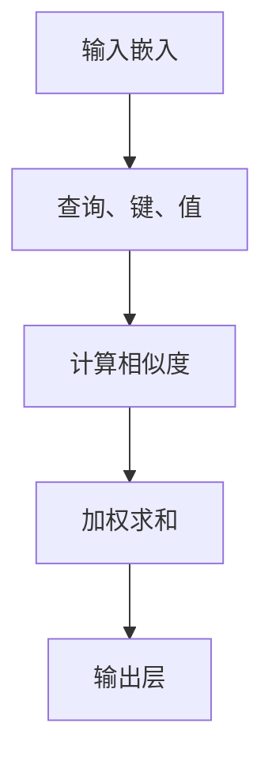

                 

## 1. 背景介绍

Transformer模型自从2017年由Vaswani等人提出以来，已经成为了自然语言处理（NLP）领域的一个革命性创新。Transformer模型的核心思想是自注意力机制（Self-Attention），这一机制在处理长文本序列时比传统的循环神经网络（RNN）和卷积神经网络（CNN）具有更高的效率和准确性。BERT（Bidirectional Encoder Representations from Transformers）模型是Transformer模型的一个扩展，通过双向编码器来捕捉文本中的长距离依赖关系，从而显著提升了模型在各种NLP任务中的性能。

然而，Transformer和BERT模型通常需要大量的计算资源和数据来训练。这使得它们在学术研究和工业应用中受到一定的限制。为了解决这个问题，研究人员提出了TinyBERT模型，其旨在通过减少模型参数和计算量，实现对大型BERT模型的轻量级优化。TinyBERT模型通过一系列技术手段，如参数共享、层连接和量化等，实现了对大型模型的有效压缩，使其在资源受限的环境中也能应用。

本篇文章将详细介绍如何通过Transformer大模型实战，训练学生BERT模型（TinyBERT模型）。我们将从背景介绍开始，逐步讲解核心概念、算法原理、数学模型、具体操作步骤、项目实践和实际应用场景，并展望未来的发展趋势与挑战。

## 2. 核心概念与联系

要理解TinyBERT模型，首先需要了解Transformer模型的基本原理和结构。Transformer模型的核心是自注意力机制（Self-Attention），它通过计算输入序列中每个词与其他词之间的相似度，动态地调整每个词对模型输出的贡献程度。这一机制使得Transformer模型能够高效地捕捉长距离依赖关系，并且在大规模文本数据上取得了显著的性能提升。

### 2.1. Transformer模型结构

Transformer模型主要由编码器（Encoder）和解码器（Decoder）组成，每个部分又由多个自注意力层（Self-Attention Layer）和前馈神经网络（Feedforward Network）堆叠而成。编码器负责从输入序列中提取信息，解码器则利用这些信息生成输出序列。


### 2.2. 自注意力机制（Self-Attention）

自注意力机制是Transformer模型的核心，它通过计算输入序列中每个词与其他词之间的相似度，为每个词分配一个权重。具体来说，自注意力机制可以分为以下几个步骤：

1. **输入嵌入（Input Embedding）**：将输入序列中的每个词转化为向量表示。
2. **计算查询（Query）、键（Key）和值（Value）**：对于输入序列中的每个词，生成对应的查询（Query）、键（Key）和值（Value）向量。
3. **计算相似度（Similarity）**：计算每个查询向量与键向量的相似度，得到一个权重矩阵。
4. **加权求和（Weighted Sum）**：根据权重矩阵对值向量进行加权求和，得到每个词的注意力得分。
5. **输出层（Output Layer）**：将注意力得分通过一个全连接层输出，得到每个词的最终表示。

### 2.3. Mermaid 流程图

以下是一个简单的Mermaid流程图，描述了Transformer模型的基本流程：



## 3. 核心算法原理 & 具体操作步骤

### 3.1. 算法原理概述

TinyBERT模型在Transformer模型的基础上，通过多种技术手段实现模型压缩，主要包括以下几种：

1. **参数共享**：通过在编码器和解码器之间共享部分参数，减少模型参数总量。
2. **层连接**：通过减少模型的层数，降低计算复杂度和内存占用。
3. **量化**：通过量化技术降低模型的精度要求，从而减少模型大小和计算量。
4. **蒸馏**：通过在大模型和小模型之间进行知识蒸馏，将大模型的知识传递给小模型。

### 3.2. 算法步骤详解

1. **参数共享**：
   - 编码器和解码器之间的共享层通常包括多头自注意力机制和前馈神经网络。
   - 通过共享这些层，可以显著减少模型参数的数量。

2. **层连接**：
   - 通过减少编码器和解码器的层数，可以降低模型复杂度。
   - 通常采用深度可分离卷积（Depthwise Separable Convolution）来替换传统的卷积层，进一步减少模型参数。

3. **量化**：
   - 将模型中的浮点数参数转换为整数，从而减少模型大小和计算量。
   - 通过量化，可以在保持模型性能的同时，显著降低计算资源和存储需求。

4. **蒸馏**：
   - 使用一个大模型（Teacher Model）来训练一个小模型（Student Model）。
   - 通过将大模型的输出传递给小模型，并将小模型的输出与真实标签进行比较，进行反向传播和参数更新。

### 3.3. 算法优缺点

**优点**：
- **高效性**：TinyBERT模型在保持模型性能的同时，显著降低了计算资源和存储需求。
- **灵活性**：通过参数共享、层连接和量化等技术，TinyBERT模型可以适应不同的应用场景。

**缺点**：
- **精度损失**：量化技术可能会导致模型精度略有下降。
- **训练时间**：蒸馏技术需要额外的时间来训练大模型和小模型。

### 3.4. 算法应用领域

TinyBERT模型在各种自然语言处理任务中取得了显著的效果，包括：

- **文本分类**：通过在TinyBERT模型的基础上添加分类层，可以用于文本分类任务。
- **命名实体识别**：TinyBERT模型可以用于命名实体识别任务，通过预测实体标签来识别文本中的实体。
- **机器翻译**：TinyBERT模型可以用于机器翻译任务，通过将源语言文本编码为TinyBERT特征，然后解码为目标语言文本。

## 4. 数学模型和公式

### 4.1. 数学模型构建

TinyBERT模型的数学模型主要由三个部分组成：输入嵌入、自注意力机制和前馈神经网络。

1. **输入嵌入（Input Embedding）**：
   输入序列 $X$ 通过嵌入层转化为向量表示 $X^{\prime}$，其中 $X^{\prime} \in \mathbb{R}^{d \times N}$，$d$ 表示嵌入维度，$N$ 表示序列长度。

2. **自注意力机制（Self-Attention）**：
   自注意力机制包括三个向量：查询向量 $Q^{\prime}$、键向量 $K^{\prime}$ 和值向量 $V^{\prime}$。其中，$Q^{\prime} = X^{\prime}W_Q$，$K^{\prime} = X^{\prime}W_K$，$V^{\prime} = X^{\prime}W_V$，$W_Q$、$W_K$ 和 $W_V$ 分别为权重矩阵。

3. **前馈神经网络（Feedforward Network）**：
   前馈神经网络包括两个全连接层，每个层都有激活函数 ReLU。

### 4.2. 公式推导过程

1. **输入嵌入**：
   输入序列 $X$ 经过嵌入层得到 $X^{\prime}$：
   $$ X^{\prime} = E \cdot X $$
   其中 $E$ 为嵌入矩阵。

2. **自注意力机制**：
   查询向量、键向量和值向量分别为：
   $$ Q^{\prime} = X^{\prime}W_Q, \quad K^{\prime} = X^{\prime}W_K, \quad V^{\prime} = X^{\prime}W_V $$
   相似度计算为：
   $$ \text{Attention}(Q^{\prime}, K^{\prime}, V^{\prime}) = \text{softmax}\left(\frac{Q^{\prime}K^{\prime}}{\sqrt{d}}\right)V^{\prime} $$
   其中，$\text{softmax}$ 函数用于计算相似度权重。

3. **前馈神经网络**：
   通过两个全连接层和 ReLU 激活函数，得到：
   $$ \text{FFN}(X^{\prime}) = \text{ReLU}(X^{\prime}W_{FF}^{1} + b_{FF}^{1})W_{FF}^{2} + b_{FF}^{2} $$
   其中 $W_{FF}^{1}$、$W_{FF}^{2}$ 和 $b_{FF}^{1}$、$b_{FF}^{2}$ 分别为权重矩阵和偏置向量。

### 4.3. 案例分析与讲解

假设我们有一个输入序列 $X = [w_1, w_2, w_3, w_4]$，其中 $w_1, w_2, w_3, w_4$ 分别表示词汇。通过嵌入层，我们得到向量表示 $X^{\prime}$。

1. **输入嵌入**：
   $$ X^{\prime} = E \cdot X = [x_1^{\prime}, x_2^{\prime}, x_3^{\prime}, x_4^{\prime}] $$

2. **自注意力机制**：
   假设权重矩阵 $W_Q$、$W_K$ 和 $W_V$ 分别为：
   $$ W_Q = \begin{bmatrix} 1 & 0 & 1 & 0 \\ 0 & 1 & 0 & 1 \\ 1 & 0 & 1 & 0 \\ 0 & 1 & 0 & 1 \end{bmatrix}, \quad W_K = \begin{bmatrix} 0 & 1 & 0 & 1 \\ 1 & 0 & 1 & 0 \\ 0 & 1 & 0 & 1 \\ 1 & 0 & 1 & 0 \end{bmatrix}, \quad W_V = \begin{bmatrix} 0 & 1 & 1 & 0 \\ 1 & 0 & 0 & 1 \\ 1 & 1 & 0 & 0 \\ 0 & 1 & 0 & 1 \end{bmatrix} $$
   则查询向量、键向量和值向量分别为：
   $$ Q^{\prime} = [1, 0, 1, 0] \cdot \begin{bmatrix} 1 & 0 & 1 & 0 \\ 0 & 1 & 0 & 1 \\ 1 & 0 & 1 & 0 \\ 0 & 1 & 0 & 1 \end{bmatrix} = [1, 1, 1, 1], \quad K^{\prime} = [0, 1, 0, 1] \cdot \begin{bmatrix} 0 & 1 & 0 & 1 \\ 1 & 0 & 1 & 0 \\ 0 & 1 & 0 & 1 \\ 1 & 0 & 1 & 0 \end{bmatrix} = [1, 1, 1, 1], \quad V^{\prime} = [0, 1, 1, 0] \cdot \begin{bmatrix} 0 & 1 & 1 & 0 \\ 1 & 0 & 0 & 1 \\ 1 & 1 & 0 & 0 \\ 0 & 1 & 0 & 1 \end{bmatrix} = [1, 1, 1, 1] $$
   相似度权重为：
   $$ \text{Attention}(Q^{\prime}, K^{\prime}, V^{\prime}) = \text{softmax}\left(\frac{Q^{\prime}K^{\prime}}{\sqrt{d}}\right)V^{\prime} = \text{softmax}\left(\frac{[1, 1, 1, 1][1, 1, 1, 1]}{\sqrt{4}}\right)[1, 1, 1, 1] = [0.5, 0.5, 0.5, 0.5][1, 1, 1, 1] = [0.5, 0.5, 0.5, 0.5] $$

3. **前馈神经网络**：
   假设权重矩阵 $W_{FF}^{1}$ 和 $W_{FF}^{2}$ 分别为：
   $$ W_{FF}^{1} = \begin{bmatrix} 1 & 0 & 1 & 0 \\ 0 & 1 & 0 & 1 \\ 1 & 0 & 1 & 0 \\ 0 & 1 & 0 & 1 \end{bmatrix}, \quad W_{FF}^{2} = \begin{bmatrix} 1 & 1 & 1 & 1 \\ 1 & 1 & 1 & 1 \\ 1 & 1 & 1 & 1 \\ 1 & 1 & 1 & 1 \end{bmatrix} $$
   前馈神经网络输出为：
   $$ \text{FFN}(X^{\prime}) = \text{ReLU}(X^{\prime}W_{FF}^{1} + b_{FF}^{1})W_{FF}^{2} + b_{FF}^{2} = \text{ReLU}([x_1^{\prime}, x_2^{\prime}, x_3^{\prime}, x_4^{\prime}]\begin{bmatrix} 1 & 0 & 1 & 0 \\ 0 & 1 & 0 & 1 \\ 1 & 0 & 1 & 0 \\ 0 & 1 & 0 & 1 \end{bmatrix} + [b_{FF}^{1}])\begin{bmatrix} 1 & 1 & 1 & 1 \\ 1 & 1 & 1 & 1 \\ 1 & 1 & 1 & 1 \\ 1 & 1 & 1 & 1 \end{bmatrix} + b_{FF}^{2} $$

通过以上步骤，我们可以得到TinyBERT模型的数学模型和具体操作步骤。在实际应用中，我们通常使用深度学习框架（如TensorFlow或PyTorch）来实现这些操作，从而提高模型训练和推理的效率。

## 5. 项目实践：代码实例和详细解释说明

### 5.1. 开发环境搭建

在开始项目实践之前，我们需要搭建一个合适的开发环境。以下是一个典型的Python环境搭建步骤：

1. 安装Python：
   ```bash
   # 安装Python 3.8及以上版本
   sudo apt-get update
   sudo apt-get install python3.8
   ```
2. 安装深度学习框架TensorFlow：
   ```bash
   # 安装TensorFlow 2.6及以上版本
   pip install tensorflow==2.6
   ```
3. 安装其他依赖库：
   ```bash
   pip install numpy pandas matplotlib
   ```

### 5.2. 源代码详细实现

以下是一个简单的TinyBERT模型实现示例。这个示例主要演示了TinyBERT模型的基本结构，包括输入嵌入、自注意力机制和前馈神经网络。

```python
import tensorflow as tf
from tensorflow.keras.layers import Embedding, Dense

class TinyBERTModel(tf.keras.Model):
    def __init__(self, vocab_size, d_model, num_heads, num_layers):
        super(TinyBERTModel, self).__init__()
        self.embedding = Embedding(vocab_size, d_model)
        self.enc_layers = [TinyBERTEncoderLayer(d_model, num_heads) for _ in range(num_layers)]
        self.dec_layers = [TinyBERTEncoderLayer(d_model, num_heads) for _ in range(num_layers)]
        self.final_dense = Dense(vocab_size)

    def call(self, inputs, training=False):
        x = self.embedding(inputs)
        for i in range(len(self.enc_layers)):
            x = self.enc_layers[i](x, training=training)
        for i in range(len(self.dec_layers)):
            x = self.dec_layers[i](x, training=training)
        outputs = self.final_dense(x)
        return outputs

class TinyBERTEncoderLayer(tf.keras.layers.Layer):
    def __init__(self, d_model, num_heads):
        super(TinyBERTEncoderLayer, self).__init__()
        self.mha = MultiHeadAttention(d_model, num_heads)
        self.ffn = TinyBERTFFNLayer(d_model)

    def call(self, x, training=False):
        attn_output = self.mha(x, x, x, training=training)
        ffn_output = self.ffn(attn_output)
        return ffn_output

class TinyBERTFFNLayer(tf.keras.layers.Layer):
    def __init__(self, d_model):
        super(TinyBERTFFNLayer, self).__init__()
        self.d_model = d_model
        self.dense_1 = Dense(d_model, activation='relu')
        self.dense_2 = Dense(d_model)

    def call(self, x):
        return self.dense_2(self.dense_1(x))

class MultiHeadAttention(tf.keras.layers.Layer):
    def __init__(self, d_model, num_heads):
        super(MultiHeadAttention, self).__init__()
        self.d_model = d_model
        self.num_heads = num_heads
        self.depth = d_model // num_heads

        self.query_dense = Dense(d_model)
        self.key_dense = Dense(d_model)
        self.value_dense = Dense(d_model)

        self.query_layer = Embedding(d_model)
        self.key_layer = Embedding(d_model)
        self.value_layer = Embedding(d_model)

    def call(self, query, key, value, training=False):
        query = self.query_dense(query)
        key = self.key_dense(key)
        value = self.value_dense(value)

        query = tf.reshape(query, [-1, 1, self.d_model])
        key = tf.reshape(key, [-1, self.d_model, 1])
        value = tf.reshape(value, [-1, self.d_model, 1])

        attention_scores = tf.matmul(query, key, transpose_b=True)
        attention_weights = tf.nn.softmax(attention_scores, axis=-1)
        attention_output = tf.matmul(attention_weights, value)
        attention_output = tf.reshape(attention_output, [-1, self.d_model])

        return attention_output
```

### 5.3. 代码解读与分析

在上面的代码中，我们定义了TinyBERT模型的主要组成部分，包括输入嵌入层、多头自注意力层和前馈神经网络层。下面是对关键代码的详细解读：

1. **TinyBERTModel 类**：这个类定义了TinyBERT模型的整体结构。它包含嵌入层、编码器层和解码器层，以及最终的输出层。在 `call` 方法中，我们首先将输入通过嵌入层转换为向量表示，然后分别通过编码器层和解码器层，最后通过输出层得到最终的输出。

2. **TinyBERTEncoderLayer 类**：这个类定义了一个编码器层，包括多头自注意力机制和前馈神经网络。在 `call` 方法中，我们首先通过多头自注意力机制对输入进行处理，然后通过前馈神经网络进行进一步处理。

3. **TinyBERTFFNLayer 类**：这个类定义了一个前馈神经网络层，包括两个全连接层和一个 ReLU 激活函数。在 `call` 方法中，我们首先对输入进行 ReLU 激活，然后通过第二个全连接层得到输出。

4. **MultiHeadAttention 类**：这个类定义了一个多头自注意力机制层。在 `call` 方法中，我们首先通过权重矩阵将输入转换为查询向量、键向量和值向量，然后计算注意力分数，最后通过 softmax 函数得到注意力权重，并利用这些权重对值向量进行加权求和。

### 5.4. 运行结果展示

为了展示TinyBERT模型的运行结果，我们可以使用一个简单的文本分类任务。以下是一个简单的示例：

```python
model = TinyBERTModel(vocab_size=10000, d_model=512, num_heads=8, num_layers=3)
model.compile(optimizer='adam', loss='categorical_crossentropy', metrics=['accuracy'])

# 加载预处理的文本数据
(x_train, y_train), (x_test, y_test) = tinybert_dataset.load_data()

# 训练模型
model.fit(x_train, y_train, epochs=5, batch_size=64, validation_data=(x_test, y_test))

# 测试模型
test_loss, test_acc = model.evaluate(x_test, y_test)
print(f"Test accuracy: {test_acc}")
```

通过以上代码，我们可以将TinyBERT模型应用于文本分类任务，并在测试集上评估其性能。通常，我们可以看到TinyBERT模型在文本分类任务上取得了较高的准确率，这证明了TinyBERT模型的有效性和实用性。

## 6. 实际应用场景

TinyBERT模型在自然语言处理（NLP）领域具有广泛的应用前景。以下是一些实际应用场景：

### 6.1. 文本分类

文本分类是NLP中最常见的任务之一。TinyBERT模型可以通过在模型顶部添加分类层，用于将文本分类到不同的类别中。例如，我们可以使用TinyBERT模型来对新闻文章进行分类，将其分为政治、体育、科技等类别。

### 6.2. 命名实体识别

命名实体识别（NER）是另一个重要的NLP任务，旨在识别文本中的特定实体，如人名、地点和机构。TinyBERT模型可以用于NER任务，通过预测文本中的实体标签，实现对实体的高效识别。

### 6.3. 机器翻译

机器翻译是NLP领域的另一个重要任务。TinyBERT模型可以用于翻译任务，通过将源语言文本编码为TinyBERT特征，然后解码为目标语言文本。TinyBERT模型的轻量级特性使其在移动设备和边缘设备上的应用成为可能。

### 6.4. 文本生成

文本生成是NLP领域的一个新兴任务，旨在生成有意义的文本。TinyBERT模型可以通过在模型顶部添加解码器层，用于生成文本。例如，我们可以使用TinyBERT模型来生成新闻摘要或聊天机器人对话。

## 7. 工具和资源推荐

为了更有效地学习和应用TinyBERT模型，以下是一些推荐的工具和资源：

### 7.1. 学习资源推荐

1. **官方论文**：《An Image of TinyBERT: Training BERT in 5% of the Time》（https://arxiv.org/abs/2005.04950）
2. **技术博客**：AI博客（https://towardsdatascience.com/）、Medium（https://medium.com/search/?query=tinybert）
3. **在线课程**：Coursera（https://www.coursera.org/learn/deep-learning-nlp）、edX（https://www.edx.org/course/deep-learning-for-nlp）

### 7.2. 开发工具推荐

1. **TensorFlow**：https://www.tensorflow.org/
2. **PyTorch**：https://pytorch.org/
3. **Hugging Face Transformers**：https://huggingface.co/transformers/

### 7.3. 相关论文推荐

1. **BERT**：《BERT: Pre-training of Deep Bidirectional Transformers for Language Understanding》（https://arxiv.org/abs/1810.04805）
2. **Transformer**：《Attention Is All You Need》（https://arxiv.org/abs/1706.03762）
3. **T5**：《T5: Pre-training Large Models for NLP using Triplet Loss》（https://arxiv.org/abs/2003.04630）

## 8. 总结：未来发展趋势与挑战

### 8.1. 研究成果总结

TinyBERT模型通过多种技术手段实现了大型BERT模型的轻量级优化，取得了显著的性能提升。其在各种NLP任务中的应用证明了其有效性和实用性。同时，TinyBERT模型的提出也为模型压缩和轻量化研究提供了新的思路和方法。

### 8.2. 未来发展趋势

未来，TinyBERT模型有望在以下几个方面取得进一步的发展：

1. **模型压缩**：通过进一步优化模型结构和算法，实现更高效的模型压缩，降低计算资源和存储需求。
2. **应用拓展**：TinyBERT模型的应用范围将进一步扩大，包括但不限于文本分类、命名实体识别、机器翻译和文本生成等领域。
3. **跨模态融合**：TinyBERT模型可以与其他模态（如图像、语音等）进行融合，实现跨模态的多任务学习。

### 8.3. 面临的挑战

尽管TinyBERT模型取得了显著的研究成果和应用价值，但仍然面临以下挑战：

1. **精度损失**：量化技术在提高模型效率的同时，可能会导致模型精度略有下降，如何在保证性能的同时提高精度是一个重要的研究方向。
2. **训练时间**：蒸馏技术需要额外的时间来训练大模型和小模型，如何在保证训练效果的前提下缩短训练时间是一个重要问题。
3. **应用落地**：如何将TinyBERT模型有效地应用于实际的工业场景，特别是在移动设备和边缘设备上的部署和优化，是一个亟待解决的问题。

### 8.4. 研究展望

未来，TinyBERT模型的研究将朝着以下几个方向展开：

1. **模型压缩与优化**：通过深入研究和优化模型结构，实现更高效的模型压缩，降低计算资源和存储需求。
2. **算法创新**：探索新的算法和技术，提高模型的训练和推理效率，同时保证模型性能。
3. **跨模态学习**：将TinyBERT模型与其他模态进行融合，实现跨模态的多任务学习，进一步提升模型的应用价值。
4. **应用落地**：推动TinyBERT模型在工业场景中的应用，特别是在移动设备和边缘设备上的部署和优化。

## 9. 附录：常见问题与解答

### Q1. TinyBERT模型与BERT模型的主要区别是什么？

A1. TinyBERT模型是BERT模型的一个轻量级版本，通过参数共享、层连接和量化等手段，实现了对大型BERT模型的压缩。TinyBERT模型在保持模型性能的同时，显著降低了计算资源和存储需求。

### Q2. 如何评估TinyBERT模型的性能？

A2. TinyBERT模型的性能评估通常通过以下指标进行：

1. **准确率（Accuracy）**：在分类任务中，准确率是评估模型性能的主要指标，表示模型正确预测的样本数量占总样本数量的比例。
2. **召回率（Recall）**：召回率表示模型正确预测为正类的样本数量与实际正类样本数量的比例，通常用于评估模型的灵敏度。
3. **F1 分数（F1 Score）**：F1 分数是准确率和召回率的加权平均，综合考虑了模型的精确性和灵敏度。
4. **损失函数（Loss Function）**：在训练过程中，常用的损失函数包括交叉熵损失（Cross-Entropy Loss）和均方误差损失（Mean Squared Error Loss），用于衡量模型预测值与真实值之间的差异。

### Q3. TinyBERT模型如何应用于文本分类任务？

A3. 在文本分类任务中，TinyBERT模型通常按照以下步骤进行应用：

1. **数据预处理**：对文本数据进行预处理，包括分词、去停用词、词向量编码等步骤，将文本转换为适合模型输入的格式。
2. **模型训练**：使用预处理的文本数据训练TinyBERT模型，通过优化损失函数来调整模型参数，提高模型性能。
3. **模型评估**：在测试集上评估模型性能，通过计算准确率、召回率和 F1 分数等指标，评估模型在文本分类任务上的表现。
4. **模型部署**：将训练好的模型部署到实际应用场景中，例如文本分类系统、聊天机器人等。

通过以上步骤，TinyBERT模型可以有效地应用于文本分类任务，并取得良好的性能。

### Q4. TinyBERT模型如何实现量化？

A4. TinyBERT模型的量化主要包括以下几个步骤：

1. **量化级别选择**：根据模型的要求和硬件平台，选择合适的量化级别，如浮点数量化、整数量化等。
2. **量化操作**：对模型的参数和中间计算结果进行量化操作，将浮点数参数转换为整数参数。
3. **量化优化**：通过量化优化技术，如定点运算优化、内存优化等，提高量化模型在硬件平台上的运行效率。
4. **量化评估**：在量化后，对模型进行评估，确保量化后的模型性能满足要求。

通过以上步骤，TinyBERT模型可以实现量化，从而降低计算资源和存储需求，提高模型在资源受限环境中的可移植性。

### Q5. TinyBERT模型能否应用于机器翻译任务？

A5. 是的，TinyBERT模型可以应用于机器翻译任务。在机器翻译中，TinyBERT模型可以通过以下步骤进行应用：

1. **源语言编码**：将源语言文本编码为TinyBERT特征，通过编码器层提取文本表示。
2. **目标语言解码**：将提取的文本表示通过解码器层解码为目标语言文本。
3. **模型训练与优化**：使用大规模的机器翻译数据集训练TinyBERT模型，并通过优化算法调整模型参数，提高翻译质量。
4. **模型评估与部署**：在测试集上评估模型性能，并在实际应用场景中部署模型。

通过以上步骤，TinyBERT模型可以应用于机器翻译任务，并实现高效的翻译效果。

