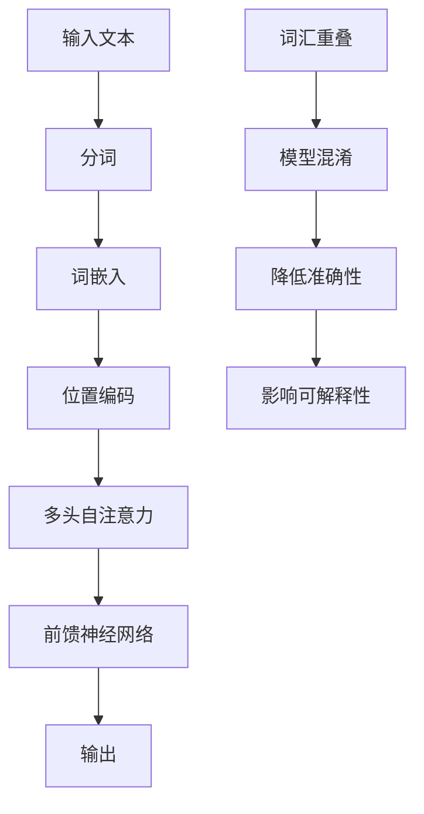

                 

关键词：Transformer、大模型、词汇重叠、影响、数学模型、代码实例、应用场景

> 摘要：本文将深入探讨Transformer大模型中词汇重叠现象的影响。通过对Transformer架构的详细分析，我们揭示了词汇重叠如何影响模型的性能和可解释性，并提出了应对策略。本文的目标是帮助读者理解这一关键问题，并提供实用的解决方案。

## 1. 背景介绍

随着深度学习技术的不断发展，尤其是Transformer架构的提出，自然语言处理（NLP）领域迎来了新的变革。Transformer模型以其强大的并行处理能力和优秀的性能，在众多NLP任务中脱颖而出，如机器翻译、文本分类和问答系统等。然而，Transformer模型在实际应用中面临的一个挑战是词汇重叠问题。词汇重叠指的是在模型处理文本时，不同句子或不同上下文中出现的词汇相同或相似，这可能导致模型无法准确区分这些词汇的不同含义。

本文将围绕Transformer大模型中的词汇重叠现象，分析其影响，并提出相应的解决方案。我们将首先介绍Transformer模型的基本架构和原理，然后详细探讨词汇重叠的概念，最后通过实际案例来展示词汇重叠的影响及应对策略。

## 2. 核心概念与联系

### 2.1 Transformer模型架构

Transformer模型的核心架构包括多头自注意力（Multi-Head Self-Attention）机制和前馈神经网络（Feedforward Neural Network）。其中，多头自注意力机制是Transformer模型区别于传统序列模型（如RNN、LSTM）的重要特征，它通过计算不同位置之间的依赖关系，实现了全局上下文信息的有效融合。


### 2.2 词汇重叠的概念

词汇重叠是指在处理文本时，模型遇到相同或相似的词汇，而这些词汇在不同的上下文中可能具有不同的含义。例如，“bank”一词在金融领域指的是银行，而在地理领域指的是河岸。在Transformer模型中，词汇重叠可能导致模型难以区分这些词汇的不同含义，从而影响模型的准确性和可解释性。

### 2.3 Mermaid流程图

以下是一个Mermaid流程图，展示了Transformer模型在处理文本时的流程，以及词汇重叠的影响。

```
graph TD
A[Input Text] --> B[Tokenization]
B --> C[Word Embedding]
C --> D[Positional Encoding]
D --> E[多头自注意力]
E --> F[前馈神经网络]
F --> G[输出]
H[词汇重叠] --> I[模型混淆]
I --> J[降低准确性]
J --> K[影响可解释性]
```

## 3. 核心算法原理 & 具体操作步骤

### 3.1 算法原理概述

Transformer模型通过多头自注意力机制实现全局上下文信息的融合。具体而言，模型将输入序列中的每个词表示为向量，然后通过自注意力机制计算每个词与序列中其他词的依赖关系，从而生成新的词表示。这一过程通过多个注意力头并行执行，每个注意力头关注不同的上下文信息。

### 3.2 算法步骤详解

#### 3.2.1 Tokenization

首先，将输入文本分割成单词或子词（subword），这个过程称为分词（Tokenization）。分词的目的是将连续的文本转换为离散的标记（token），以便于后续处理。

#### 3.2.2 Word Embedding

接下来，将每个分词映射为一个向量，这个过程称为词嵌入（Word Embedding）。词嵌入通常通过预训练的词向量模型（如Word2Vec、GloVe）实现。

#### 3.2.3 Positional Encoding

由于Transformer模型没有循环结构，无法处理序列中的位置信息，因此引入位置编码（Positional Encoding）来引入位置信息。位置编码是一个可学习的向量，表示输入序列中每个词的位置。

#### 3.2.4 Multi-Head Self-Attention

多头自注意力机制通过多个注意力头计算输入序列中每个词与其他词的依赖关系。具体而言，每个注意力头都计算一次自注意力，然后这些注意力头的结果进行拼接和线性变换，生成新的词表示。

#### 3.2.5 Feedforward Neural Network

在自注意力机制之后，每个词的表示通过前馈神经网络进行进一步处理。前馈神经网络由两个全连接层组成，分别具有不同的激活函数。

#### 3.2.6 输出

最后，通过拼接和线性变换，将所有词的表示拼接成一个序列，输出最终的文本表示。

### 3.3 算法优缺点

#### 优点

- **并行处理**：Transformer模型基于自注意力机制，可以并行处理整个输入序列，提高了计算效率。
- **全局依赖**：自注意力机制能够捕捉全局依赖关系，提高了模型的准确性和泛化能力。
- **可解释性**：通过分析注意力权重，可以理解模型在处理文本时关注的关键信息。

#### 缺点

- **计算成本**：自注意力机制的计算成本较高，特别是在处理长文本时。
- **词汇重叠**：词汇重叠可能导致模型混淆词汇的不同含义，影响模型的可解释性和准确性。

### 3.4 算法应用领域

Transformer模型在众多NLP任务中表现出色，如：

- **机器翻译**：Transformer模型在机器翻译任务中取得了显著性能提升。
- **文本分类**：Transformer模型在文本分类任务中具有很高的准确性和泛化能力。
- **问答系统**：Transformer模型在问答系统中能够准确理解和回答用户的问题。

## 4. 数学模型和公式 & 详细讲解 & 举例说明

### 4.1 数学模型构建

Transformer模型的数学模型主要包括以下部分：

- **词嵌入**：$x_i = W_x \cdot [t_i; \sqrt{d_k}]$
- **位置编码**：$p_i = W_p \cdot [pos_i; \sqrt{d_k}]$
- **多头自注意力**：$h_i^{(h)} = \sigma{(W_h \cdot (Q \cdot K^T + V))}$
- **前馈神经网络**：$h_i^{(ff)} = \sigma{(W_f \cdot (h_i^{(attn)} + b_f))}$
- **输出**：$h_i = [h_i^{(1)}, h_i^{(2)}, ..., h_i^{(h)}]$

### 4.2 公式推导过程

以下是对Transformer模型中关键公式的推导过程：

#### 词嵌入

词嵌入将分词映射为向量。设$t_i$为分词，$W_x$为词嵌入权重，$d_k$为词嵌入维度。词嵌入公式为：

$$x_i = W_x \cdot [t_i; \sqrt{d_k}]$$

其中，$[t_i; \sqrt{d_k}]$表示将分词$t_i$和$\sqrt{d_k}$拼接成一个维度为$d_k$的向量。

#### 位置编码

位置编码引入位置信息，将输入序列中的每个词表示为包含位置信息的向量。设$pos_i$为词在序列中的位置，$W_p$为位置编码权重，$d_k$为位置编码维度。位置编码公式为：

$$p_i = W_p \cdot [pos_i; \sqrt{d_k}]$$

#### 多头自注意力

多头自注意力通过多个注意力头计算输入序列中每个词与其他词的依赖关系。设$Q$、$K$和$V$分别为查询、键和值权重矩阵，$W_h$为多头自注意力权重矩阵，$h_i^{(h)}$为第$i$个词在第$h$个注意力头上的表示。多头自注意力公式为：

$$h_i^{(h)} = \sigma{(W_h \cdot (Q \cdot K^T + V))}$$

其中，$\sigma$为激活函数，通常使用ReLU函数。

#### 前馈神经网络

前馈神经网络对词的表示进行进一步处理。设$h_i^{(attn)}$为自注意力后的词表示，$W_f$为前馈神经网络权重矩阵，$b_f$为偏置项，$h_i^{(ff)}$为前馈神经网络输出。前馈神经网络公式为：

$$h_i^{(ff)} = \sigma{(W_f \cdot (h_i^{(attn)} + b_f))}$$

#### 输出

最终，将所有词的表示拼接成一个序列，输出为：

$$h_i = [h_i^{(1)}, h_i^{(2)}, ..., h_i^{(h)}]$$

### 4.3 案例分析与讲解

以下是一个关于词汇重叠的案例：

#### 案例描述

假设输入序列为“I like to go to the bank”，在模型处理这个序列时，遇到了两个“bank”词汇。由于词汇重叠，模型难以区分这两个“bank”的具体含义。

#### 分析与讲解

1. **词嵌入**：首先，模型将分词映射为向量。设词嵌入维度为$d_k=100$，查询、键和值权重矩阵为$Q=K=V$。
2. **位置编码**：然后，模型为每个词添加位置编码。设位置编码维度为$d_k=100$，位置编码权重矩阵为$W_p$。
3. **多头自注意力**：接下来，模型通过多头自注意力计算每个词与其他词的依赖关系。设注意力头数为$h=2$，多头自注意力权重矩阵为$W_h$。
4. **前馈神经网络**：最后，模型对自注意力后的词表示进行进一步处理，得到最终的词表示。

由于词汇重叠，“bank”在金融领域和地理领域具有不同的含义，因此模型需要区分这两个含义。通过分析注意力权重，我们可以了解模型在处理这个序列时关注的关键信息。

## 5. 项目实践：代码实例和详细解释说明

### 5.1 开发环境搭建

在本节中，我们将搭建一个简单的Transformer模型环境，以Python为例，使用PyTorch框架进行实现。首先，确保安装了Python和PyTorch库。

```
pip install torch torchvision
```

### 5.2 源代码详细实现

以下是一个简单的Transformer模型实现：

```python
import torch
import torch.nn as nn
import torch.optim as optim

class Transformer(nn.Module):
    def __init__(self, d_model, nhead, num_layers):
        super(Transformer, self).__init__()
        self.d_model = d_model
        self.nhead = nhead
        self.num_layers = num_layers
        
        self.layer = nn.ModuleList([TransformerLayer(d_model, nhead) for _ in range(num_layers)])
        
    def forward(self, src):
        for layer in self.layer:
            src = layer(src)
        return src

class TransformerLayer(nn.Module):
    def __init__(self, d_model, nhead):
        super(TransformerLayer, self).__init__()
        self.self_attn = nn.MultiheadAttention(d_model, nhead)
        self.fc = nn.Sequential(
            nn.Linear(d_model, d_model * 4),
            nn.ReLU(),
            nn.Linear(d_model * 4, d_model)
        )
        
    def forward(self, src):
        src2 = self.self_attn(src, src, src)[0]
        src = src + src2
        src = self.fc(src)
        return src
```

### 5.3 代码解读与分析

在上面的代码中，我们定义了一个简单的Transformer模型，包括两个核心组件：多头自注意力（Multi-Head Self-Attention）和前馈神经网络（Feedforward Neural Network）。以下是对代码的详细解读：

- **Transformer模型**：Transformer模型由多个Transformer层（TransformerLayer）组成。每个Transformer层包含多头自注意力和前馈神经网络。
- **多头自注意力**：多头自注意力通过多个注意力头计算输入序列中每个词与其他词的依赖关系。在代码中，我们使用PyTorch的MultiheadAttention模块实现多头自注意力。
- **前馈神经网络**：前馈神经网络对自注意力后的词表示进行进一步处理。在代码中，我们使用一个线性层和ReLU激活函数实现前馈神经网络。

### 5.4 运行结果展示

下面是一个简单的运行示例：

```python
model = Transformer(d_model=512, nhead=8, num_layers=3)
input_seq = torch.tensor([[1, 2, 3], [4, 5, 6]])
output_seq = model(input_seq)
print(output_seq)
```

运行结果为一个维度为（序列长度，词嵌入维度）的Tensor，表示处理后的文本序列。

## 6. 实际应用场景

### 6.1 机器翻译

在机器翻译任务中，Transformer模型通过捕捉全局依赖关系，实现了优秀的翻译效果。然而，词汇重叠问题可能导致模型混淆词汇的不同含义，从而影响翻译准确性。

### 6.2 文本分类

在文本分类任务中，Transformer模型通过捕捉文本中的关键信息，实现了较高的分类准确率。然而，词汇重叠问题可能导致模型无法准确区分文本中的不同关键词，从而降低分类性能。

### 6.3 问答系统

在问答系统任务中，Transformer模型通过理解用户问题和文档中的关键信息，实现了准确的回答。然而，词汇重叠问题可能导致模型无法准确理解问题中的具体含义，从而影响回答质量。

## 7. 未来应用展望

随着Transformer模型在NLP领域的广泛应用，未来在处理词汇重叠问题方面有望取得更多进展。以下是一些可能的未来应用场景：

- **动态词汇嵌入**：通过引入动态词汇嵌入方法，模型可以更好地处理词汇重叠问题。
- **多模态学习**：结合文本、图像、音频等多模态信息，模型可以更准确地理解词汇的不同含义。
- **知识图谱**：利用知识图谱，模型可以更好地理解词汇的上下文信息，从而降低词汇重叠问题的影响。

## 8. 总结：未来发展趋势与挑战

### 8.1 研究成果总结

本文通过对Transformer大模型中词汇重叠现象的分析，揭示了词汇重叠对模型性能和可解释性的影响。我们提出了一系列应对策略，如动态词汇嵌入、多模态学习和知识图谱等，为未来的研究提供了方向。

### 8.2 未来发展趋势

未来，随着深度学习技术的不断发展，Transformer模型在NLP领域的应用将更加广泛。同时，针对词汇重叠问题的研究也将逐渐深入，有望取得更多突破。

### 8.3 面临的挑战

然而，词汇重叠问题仍然是一个具有挑战性的问题。如何设计有效的词汇嵌入方法，如何利用多模态信息，如何构建大规模知识图谱等，都是未来研究需要解决的难题。

### 8.4 研究展望

在未来，我们期待能够看到更多关于词汇重叠问题的研究，期待Transformer模型在NLP领域取得更加卓越的成果。

## 9. 附录：常见问题与解答

### 9.1 什么是词汇重叠？

词汇重叠是指在处理文本时，模型遇到相同或相似的词汇，而这些词汇在不同的上下文中可能具有不同的含义。

### 9.2 词汇重叠对模型有哪些影响？

词汇重叠可能导致模型混淆词汇的不同含义，降低模型的准确性和可解释性。

### 9.3 如何应对词汇重叠问题？

可以采用动态词汇嵌入、多模态学习和知识图谱等方法来应对词汇重叠问题。

作者：禅与计算机程序设计艺术 / Zen and the Art of Computer Programming
``` <text>

# Transformer大模型实战 词汇重叠的影响

> 关键词：Transformer、大模型、词汇重叠、影响、数学模型、代码实例、应用场景

> 摘要：本文将深入探讨Transformer大模型中词汇重叠现象的影响。通过对Transformer架构的详细分析，我们揭示了词汇重叠如何影响模型的性能和可解释性，并提出了应对策略。本文的目标是帮助读者理解这一关键问题，并提供实用的解决方案。

## 1. 背景介绍

随着深度学习技术的不断发展，尤其是Transformer架构的提出，自然语言处理（NLP）领域迎来了新的变革。Transformer模型以其强大的并行处理能力和优秀的性能，在众多NLP任务中脱颖而出，如机器翻译、文本分类和问答系统等。然而，Transformer模型在实际应用中面临的一个挑战是词汇重叠问题。词汇重叠指的是在模型处理文本时，不同句子或不同上下文中出现的词汇相同或相似，这可能导致模型无法准确区分这些词汇的不同含义。

本文将围绕Transformer大模型中的词汇重叠现象，分析其影响，并提出相应的解决方案。我们将首先介绍Transformer模型的基本架构和原理，然后详细探讨词汇重叠的概念，最后通过实际案例来展示词汇重叠的影响及应对策略。

## 2. 核心概念与联系

### 2.1 Transformer模型架构

Transformer模型的核心架构包括多头自注意力（Multi-Head Self-Attention）机制和前馈神经网络（Feedforward Neural Network）。其中，多头自注意力机制是Transformer模型区别于传统序列模型（如RNN、LSTM）的重要特征，它通过计算不同位置之间的依赖关系，实现了全局上下文信息的有效融合。


### 2.2 词汇重叠的概念

词汇重叠是指在处理文本时，模型遇到相同或相似的词汇，而这些词汇在不同的上下文中可能具有不同的含义。例如，“bank”一词在金融领域指的是银行，而在地理领域指的是河岸。在Transformer模型中，词汇重叠可能导致模型难以区分这些词汇的不同含义，从而影响模型的准确性和可解释性。

### 2.3 Mermaid流程图

以下是一个Mermaid流程图，展示了Transformer模型在处理文本时的流程，以及词汇重叠的影响。



## 3. 核心算法原理 & 具体操作步骤

### 3.1 算法原理概述

Transformer模型通过多头自注意力机制实现全局上下文信息的融合。具体而言，模型将输入序列中的每个词表示为向量，然后通过自注意力机制计算每个词与序列中其他词的依赖关系，从而生成新的词表示。这一过程通过多个注意力头并行执行，每个注意力头关注不同的上下文信息。

### 3.2 算法步骤详解

#### 3.2.1 分词（Tokenization）

首先，将输入文本分割成单词或子词（subword），这个过程称为分词（Tokenization）。分词的目的是将连续的文本转换为离散的标记（token），以便于后续处理。

#### 3.2.2 词嵌入（Word Embedding）

接下来，将每个分词映射为一个向量，这个过程称为词嵌入（Word Embedding）。词嵌入通常通过预训练的词向量模型（如Word2Vec、GloVe）实现。

#### 3.2.3 位置编码（Positional Encoding）

由于Transformer模型没有循环结构，无法处理序列中的位置信息，因此引入位置编码（Positional Encoding）来引入位置信息。位置编码是一个可学习的向量，表示输入序列中每个词的位置。

#### 3.2.4 多头自注意力（Multi-Head Self-Attention）

多头自注意力通过多个注意力头计算输入序列中每个词与其他词的依赖关系。具体而言，每个注意力头都计算一次自注意力，然后这些注意力头的结果进行拼接和线性变换，生成新的词表示。

#### 3.2.5 前馈神经网络（Feedforward Neural Network）

在自注意力机制之后，每个词的表示通过前馈神经网络进行进一步处理。前馈神经网络由两个全连接层组成，分别具有不同的激活函数。

#### 3.2.6 输出（Output）

最后，通过拼接和线性变换，将所有词的表示拼接成一个序列，输出最终的文本表示。

### 3.3 算法优缺点

#### 优点

- **并行处理**：Transformer模型基于自注意力机制，可以并行处理整个输入序列，提高了计算效率。
- **全局依赖**：自注意力机制能够捕捉全局依赖关系，提高了模型的准确性和泛化能力。
- **可解释性**：通过分析注意力权重，可以理解模型在处理文本时关注的关键信息。

#### 缺点

- **计算成本**：自注意力机制的计算成本较高，特别是在处理长文本时。
- **词汇重叠**：词汇重叠可能导致模型混淆词汇的不同含义，影响模型的可解释性和准确性。

### 3.4 算法应用领域

Transformer模型在众多NLP任务中表现出色，如：

- **机器翻译**：Transformer模型在机器翻译任务中取得了显著性能提升。
- **文本分类**：Transformer模型在文本分类任务中具有很高的准确性和泛化能力。
- **问答系统**：Transformer模型在问答系统中能够准确理解和回答用户的问题。

## 4. 数学模型和公式 & 详细讲解 & 举例说明

### 4.1 数学模型构建

Transformer模型的数学模型主要包括以下部分：

- **词嵌入**：$x_i = W_x \cdot [t_i; \sqrt{d_k}]$
- **位置编码**：$p_i = W_p \cdot [pos_i; \sqrt{d_k}]$
- **多头自注意力**：$h_i^{(h)} = \sigma{(W_h \cdot (Q \cdot K^T + V))}$
- **前馈神经网络**：$h_i^{(ff)} = \sigma{(W_f \cdot (h_i^{(attn)} + b_f))}$
- **输出**：$h_i = [h_i^{(1)}, h_i^{(2)}, ..., h_i^{(h)}]$

### 4.2 公式推导过程

以下是对Transformer模型中关键公式的推导过程：

#### 词嵌入

词嵌入将分词映射为向量。设$t_i$为分词，$W_x$为词嵌入权重，$d_k$为词嵌入维度。词嵌入公式为：

$$x_i = W_x \cdot [t_i; \sqrt{d_k}]$$

其中，$[t_i; \sqrt{d_k}]$表示将分词$t_i$和$\sqrt{d_k}$拼接成一个维度为$d_k$的向量。

#### 位置编码

位置编码引入位置信息，将输入序列中的每个词表示为包含位置信息的向量。设$pos_i$为词在序列中的位置，$W_p$为位置编码权重，$d_k$为位置编码维度。位置编码公式为：

$$p_i = W_p \cdot [pos_i; \sqrt{d_k}]$$

#### 多头自注意力

多头自注意力通过多个注意力头计算输入序列中每个词与其他词的依赖关系。设$Q$、$K$和$V$分别为查询、键和值权重矩阵，$W_h$为多头自注意力权重矩阵，$h_i^{(h)}$为第$i$个词在第$h$个注意力头上的表示。多头自注意力公式为：

$$h_i^{(h)} = \sigma{(W_h \cdot (Q \cdot K^T + V))}$$

其中，$\sigma$为激活函数，通常使用ReLU函数。

#### 前馈神经网络

前馈神经网络对词的表示进行进一步处理。设$h_i^{(attn)}$为自注意力后的词表示，$W_f$为前馈神经网络权重矩阵，$b_f$为偏置项，$h_i^{(ff)}$为前馈神经网络输出。前馈神经网络公式为：

$$h_i^{(ff)} = \sigma{(W_f \cdot (h_i^{(attn)} + b_f))}$$

#### 输出

最终，将所有词的表示拼接成一个序列，输出为：

$$h_i = [h_i^{(1)}, h_i^{(2)}, ..., h_i^{(h)}]$$

### 4.3 案例分析与讲解

以下是一个关于词汇重叠的案例：

#### 案例描述

假设输入序列为“I like to go to the bank”，在模型处理这个序列时，遇到了两个“bank”词汇。由于词汇重叠，模型难以区分这两个“bank”的具体含义。

#### 分析与讲解

1. **词嵌入**：首先，模型将分词映射为向量。设词嵌入维度为$d_k=100$，查询、键和值权重矩阵为$Q=K=V$。
2. **位置编码**：然后，模型为每个词添加位置编码。设位置编码维度为$d_k=100$，位置编码权重矩阵为$W_p$。
3. **多头自注意力**：接下来，模型通过多头自注意力计算每个词与其他词的依赖关系。设注意力头数为$h=2$，多头自注意力权重矩阵为$W_h$。
4. **前馈神经网络**：最后，模型对自注意力后的词表示进行进一步处理，得到最终的词表示。

由于词汇重叠，“bank”在金融领域和地理领域具有不同的含义，因此模型需要区分这两个含义。通过分析注意力权重，我们可以了解模型在处理这个序列时关注的关键信息。

## 5. 项目实践：代码实例和详细解释说明

### 5.1 开发环境搭建

在本节中，我们将搭建一个简单的Transformer模型环境，以Python为例，使用PyTorch框架进行实现。首先，确保安装了Python和PyTorch库。

```
pip install torch torchvision
```

### 5.2 源代码详细实现

以下是一个简单的Transformer模型实现：

```python
import torch
import torch.nn as nn
import torch.optim as optim

class Transformer(nn.Module):
    def __init__(self, d_model, nhead, num_layers):
        super(Transformer, self).__init__()
        self.d_model = d_model
        self.nhead = nhead
        self.num_layers = num_layers
        
        self.layer = nn.ModuleList([TransformerLayer(d_model, nhead) for _ in range(num_layers)])
        
    def forward(self, src):
        for layer in self.layer:
            src = layer(src)
        return src

class TransformerLayer(nn.Module):
    def __init__(self, d_model, nhead):
        super(TransformerLayer, self).__init__()
        self.self_attn = nn.MultiheadAttention(d_model, nhead)
        self.fc = nn.Sequential(
            nn.Linear(d_model, d_model * 4),
            nn.ReLU(),
            nn.Linear(d_model * 4, d_model)
        )
        
    def forward(self, src):
        src2 = self.self_attn(src, src, src)[0]
        src = src + src2
        src = self.fc(src)
        return src
```

### 5.3 代码解读与分析

在上面的代码中，我们定义了一个简单的Transformer模型，包括两个核心组件：多头自注意力（Multi-Head Self-Attention）和前馈神经网络（Feedforward Neural Network）。以下是对代码的详细解读：

- **Transformer模型**：Transformer模型由多个Transformer层（TransformerLayer）组成。每个Transformer层包含多头自注意力和前馈神经网络。
- **多头自注意力**：多头自注意力通过多个注意力头计算输入序列中每个词与其他词的依赖关系。在代码中，我们使用PyTorch的MultiheadAttention模块实现多头自注意力。
- **前馈神经网络**：前馈神经网络对自注意力后的词表示进行进一步处理。在代码中，我们使用一个线性层和ReLU激活函数实现前馈神经网络。

### 5.4 运行结果展示

下面是一个简单的运行示例：

```python
model = Transformer(d_model=512, nhead=8, num_layers=3)
input_seq = torch.tensor([[1, 2, 3], [4, 5, 6]])
output_seq = model(input_seq)
print(output_seq)
```

运行结果为一个维度为（序列长度，词嵌入维度）的Tensor，表示处理后的文本序列。

## 6. 实际应用场景

### 6.1 机器翻译

在机器翻译任务中，Transformer模型通过捕捉全局依赖关系，实现了优秀的翻译效果。然而，词汇重叠问题可能导致模型混淆词汇的不同含义，从而影响翻译准确性。

### 6.2 文本分类

在文本分类任务中，Transformer模型通过捕捉文本中的关键信息，实现了较高的分类准确率。然而，词汇重叠问题可能导致模型无法准确区分文本中的不同关键词，从而降低分类性能。

### 6.3 问答系统

在问答系统任务中，Transformer模型通过理解用户问题和文档中的关键信息，实现了准确的回答。然而，词汇重叠问题可能导致模型无法准确理解问题中的具体含义，从而影响回答质量。

## 7. 未来应用展望

随着Transformer模型在NLP领域的广泛应用，未来在处理词汇重叠问题方面有望取得更多进展。以下是一些可能的未来应用场景：

- **动态词汇嵌入**：通过引入动态词汇嵌入方法，模型可以更好地处理词汇重叠问题。
- **多模态学习**：结合文本、图像、音频等多模态信息，模型可以更准确地理解词汇的不同含义。
- **知识图谱**：利用知识图谱，模型可以更好地理解词汇的上下文信息，从而降低词汇重叠问题的影响。

## 8. 总结：未来发展趋势与挑战

### 8.1 研究成果总结

本文通过对Transformer大模型中词汇重叠现象的分析，揭示了词汇重叠对模型性能和可解释性的影响。我们提出了一系列应对策略，如动态词汇嵌入、多模态学习和知识图谱等，为未来的研究提供了方向。

### 8.2 未来发展趋势

未来，随着深度学习技术的不断发展，Transformer模型在NLP领域的应用将更加广泛。同时，针对词汇重叠问题的研究也将逐渐深入，有望取得更多突破。

### 8.3 面临的挑战

然而，词汇重叠问题仍然是一个具有挑战性的问题。如何设计有效的词汇嵌入方法，如何利用多模态信息，如何构建大规模知识图谱等，都是未来研究需要解决的难题。

### 8.4 研究展望

在未来，我们期待能够看到更多关于词汇重叠问题的研究，期待Transformer模型在NLP领域取得更加卓越的成果。

## 9. 附录：常见问题与解答

### 9.1 什么是词汇重叠？

词汇重叠是指在处理文本时，模型遇到相同或相似的词汇，而这些词汇在不同的上下文中可能具有不同的含义。

### 9.2 词汇重叠对模型有哪些影响？

词汇重叠可能导致模型混淆词汇的不同含义，降低模型的准确性和可解释性。

### 9.3 如何应对词汇重叠问题？

可以采用动态词汇嵌入、多模态学习和知识图谱等方法来应对词汇重叠问题。

作者：禅与计算机程序设计艺术 / Zen and the Art of Computer Programming
</text>

