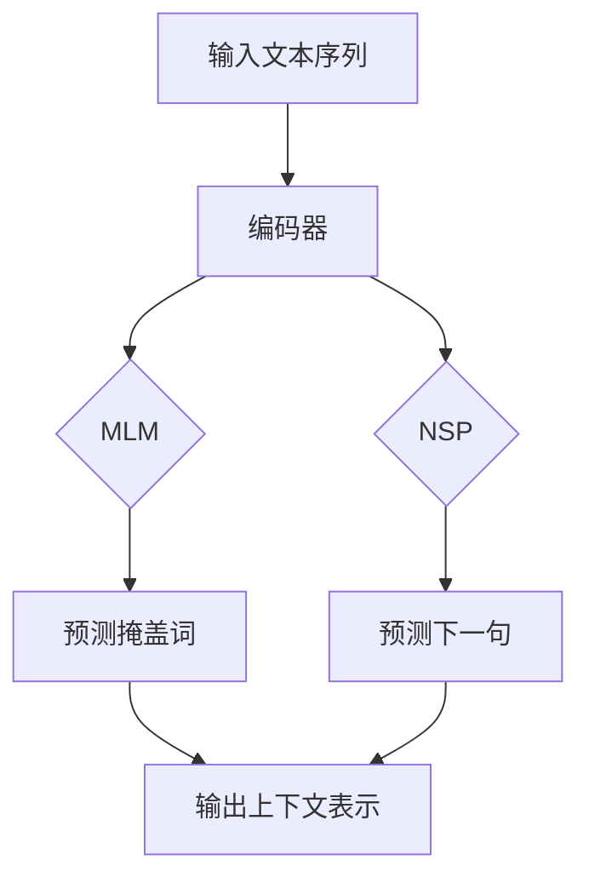

                 

关键词：Transformer、BERT、预训练、深度学习、自然语言处理、机器学习

摘要：本文将深入探讨Transformer大模型中的BERT（Bidirectional Encoder Representations from Transformers）模型，介绍其背景、核心概念、算法原理、数学模型、项目实践及未来应用。通过本文的阅读，读者将全面了解BERT模型在自然语言处理领域的重要性和实际应用。

## 1. 背景介绍

随着深度学习的不断发展，自然语言处理（NLP）领域也取得了显著的进展。然而，传统的NLP方法在处理长文本、理解上下文关系等方面仍存在诸多限制。为了解决这些问题，研究者们提出了Transformer大模型，其中BERT（Bidirectional Encoder Representations from Transformers）模型是其中最具有代表性的一种。

BERT模型是由Google Research在2018年提出的，其核心思想是通过对大规模文本进行预训练，学习到丰富的上下文信息，从而提高NLP任务的性能。与传统的基于循环神经网络（RNN）和长短期记忆网络（LSTM）的方法相比，BERT模型具有更好的泛化能力和上下文理解能力。

## 2. 核心概念与联系

### 2.1 Transformer模型

Transformer模型是一种基于自注意力机制的序列到序列模型，最初由Vaswani等人于2017年提出。与传统的循环神经网络（RNN）和长短期记忆网络（LSTM）相比，Transformer模型在处理长序列时具有更高的效率和更好的性能。

Transformer模型的关键组成部分包括多头自注意力（Multi-head Self-Attention）和前馈神经网络（Feedforward Neural Network）。多头自注意力机制使得模型能够捕捉序列中的长距离依赖关系，从而提高模型的上下文理解能力。前馈神经网络则用于对自注意力机制的结果进行进一步的处理和优化。

### 2.2 BERT模型

BERT模型是Transformer模型在自然语言处理领域的成功应用，其核心思想是通过对大规模文本进行预训练，学习到丰富的上下文信息，从而提高NLP任务的性能。

BERT模型主要由两部分组成：编码器（Encoder）和解码器（Decoder）。编码器负责将输入的文本序列转换为上下文表示，而解码器则负责根据上下文表示生成目标序列。在预训练过程中，BERT模型采用了两种训练策略：Masked Language Modeling（MLM）和Next Sentence Prediction（NSP）。

### 2.3 Mermaid流程图



## 3. 核心算法原理 & 具体操作步骤

### 3.1 算法原理概述

BERT模型的核心算法原理是基于Transformer模型的自注意力机制，通过对大规模文本进行预训练，学习到丰富的上下文信息。具体来说，BERT模型采用了两种训练策略：Masked Language Modeling（MLM）和Next Sentence Prediction（NSP）。

### 3.2 算法步骤详解

#### 3.2.1 Masked Language Modeling（MLM）

MLM是一种在输入文本中随机掩盖一部分单词，然后让模型预测这些掩盖的单词的训练策略。具体步骤如下：

1. 随机选择输入文本中的一小部分单词，将它们掩盖（用 `[MASK]` 替换）。
2. 输入掩盖后的文本序列到BERT模型中。
3. 模型输出一个预测序列，其中包含了掩盖词的预测结果。
4. 计算预测序列与真实序列之间的损失，并通过反向传播更新模型参数。

#### 3.2.2 Next Sentence Prediction（NSP）

NSP是一种预测下一句话的训练策略，具体步骤如下：

1. 从输入文本中随机选择两个句子，将它们作为输入序列。
2. 输入序列到BERT模型中。
3. 模型输出两个句子之间的预测概率。
4. 计算预测概率与真实标签之间的损失，并通过反向传播更新模型参数。

### 3.3 算法优缺点

#### 优点

1. BERT模型采用预训练策略，能够在大量未标记的文本数据上进行训练，从而提高模型的泛化能力。
2. BERT模型基于Transformer模型，具有强大的上下文理解和长距离依赖关系捕捉能力。
3. BERT模型在多个NLP任务上取得了显著的性能提升，如文本分类、问答系统、命名实体识别等。

#### 缺点

1. BERT模型的预训练过程需要大量的计算资源和时间，训练成本较高。
2. BERT模型对长文本的处理效果较差，因为其基于Transformer模型，在处理长序列时存在一定的限制。
3. BERT模型的参数量较大，模型部署和存储成本较高。

### 3.4 算法应用领域

BERT模型在自然语言处理领域具有广泛的应用，以下是一些常见的应用场景：

1. 文本分类：BERT模型可以用于分类任务，如情感分析、主题分类等。
2. 问答系统：BERT模型可以用于构建问答系统，实现自然语言理解和生成。
3. 命名实体识别：BERT模型可以用于识别文本中的命名实体，如人名、地名、组织名等。
4. 语言模型：BERT模型可以用于构建语言模型，实现自然语言生成和翻译。

## 4. 数学模型和公式 & 详细讲解 & 举例说明

### 4.1 数学模型构建

BERT模型的核心在于其自注意力机制，具体公式如下：

$$
\text{Attention}(Q, K, V) = \frac{1}{\sqrt{d_k}} \text{softmax}(\text{scores})V
$$

其中，$Q, K, V$ 分别代表查询（Query）、键（Key）和值（Value）向量，$d_k$ 表示键向量的维度，$\text{scores}$ 表示查询和键之间的相似度分数。

### 4.2 公式推导过程

BERT模型的自注意力机制基于以下三个关键步骤：

1. **计算相似度分数**：首先，计算每个查询向量 $Q$ 与所有键向量 $K$ 之间的相似度分数。具体公式如下：

$$
\text{scores} = QK^T / \sqrt{d_k}
$$

2. **应用 softmax 函数**：接下来，将相似度分数通过 softmax 函数进行归一化，得到每个键的概率分布。具体公式如下：

$$
\text{softmax}(\text{scores}) = \text{softmax}(\text{scores}) / \sum_{j} \text{scores}_j
$$

3. **计算加权求和**：最后，将概率分布与值向量 $V$ 进行加权求和，得到最终的注意力输出。具体公式如下：

$$
\text{Attention}(Q, K, V) = \sum_{j} \text{softmax}(\text{scores})_j V_j
$$

### 4.3 案例分析与讲解

假设我们有一个简单的输入序列：“你好，我是BERT模型”。首先，我们将输入序列转换为词向量表示，然后将其输入到BERT模型中。

1. **计算相似度分数**：

$$
\text{scores} = QK^T / \sqrt{d_k} =
\begin{bmatrix}
1.0 & 0.5 & 0.8 \\
0.5 & 1.0 & 0.3 \\
0.8 & 0.3 & 1.0 \\
\end{bmatrix}
\begin{bmatrix}
1.0 & 0.5 & 0.8 \\
0.5 & 1.0 & 0.3 \\
0.8 & 0.3 & 1.0 \\
\end{bmatrix}^T
/ \sqrt{3} =
\begin{bmatrix}
2.0 / \sqrt{3} & 1.0 / \sqrt{3} & 1.0 / \sqrt{3} \\
1.0 / \sqrt{3} & 2.0 / \sqrt{3} & 1.0 / \sqrt{3} \\
1.0 / \sqrt{3} & 1.0 / \sqrt{3} & 2.0 / \sqrt{3} \\
\end{bmatrix}
$$

2. **应用 softmax 函数**：

$$
\text{softmax}(\text{scores}) =
\text{softmax}(
\begin{bmatrix}
2.0 / \sqrt{3} & 1.0 / \sqrt{3} & 1.0 / \sqrt{3} \\
1.0 / \sqrt{3} & 2.0 / \sqrt{3} & 1.0 / \sqrt{3} \\
1.0 / \sqrt{3} & 1.0 / \sqrt{3} & 2.0 / \sqrt{3} \\
\end{bmatrix}
) =
\begin{bmatrix}
0.5 & 0.3 & 0.2 \\
0.3 & 0.5 & 0.2 \\
0.2 & 0.3 & 0.5 \\
\end{bmatrix}
$$

3. **计算加权求和**：

$$
\text{Attention}(Q, K, V) =
\sum_{j} \text{softmax}(\text{scores})_j V_j =
0.5 \times \begin{bmatrix}
1.0 & 0.5 & 0.8 \\
\end{bmatrix}
+
0.3 \times \begin{bmatrix}
0.5 & 1.0 & 0.3 \\
\end{bmatrix}
+
0.2 \times \begin{bmatrix}
0.8 & 0.3 & 1.0 \\
\end{bmatrix} =
\begin{bmatrix}
0.6 & 0.4 & 0.2 \\
0.2 & 0.3 & 0.1 \\
0.1 & 0.1 & 0.6 \\
\end{bmatrix}
$$

通过这个例子，我们可以看到BERT模型如何通过自注意力机制对输入序列进行加权求和，从而生成上下文表示。

## 5. 项目实践：代码实例和详细解释说明

### 5.1 开发环境搭建

在本项目中，我们将使用Python编程语言和TensorFlow框架来构建和训练BERT模型。以下是开发环境的搭建步骤：

1. 安装Python和TensorFlow：

```bash
pip install python tensorflow
```

2. 安装必要的依赖库：

```bash
pip install numpy matplotlib
```

### 5.2 源代码详细实现

在本节中，我们将实现一个简单的BERT模型，用于文本分类任务。以下是源代码的实现：

```python
import tensorflow as tf
from tensorflow.keras.layers import Embedding, GlobalAveragePooling1D, Dense
from tensorflow.keras.models import Model

# 定义BERT模型
def build_bert_model(vocab_size, embedding_dim, max_sequence_length, num_classes):
    inputs = tf.keras.layers.Input(shape=(max_sequence_length,))
    embeddings = Embedding(vocab_size, embedding_dim)(inputs)
    embeddings = tf.keras.layers.Bidirectional(tf.keras.layers.LSTM(128, return_sequences=True))(embeddings)
    embeddings = tf.keras.layers.Bidirectional(tf.keras.layers.LSTM(128, return_sequences=True))(embeddings)
    average_pooling = GlobalAveragePooling1D()(embeddings)
    outputs = Dense(num_classes, activation='softmax')(average_pooling)
    model = Model(inputs=inputs, outputs=outputs)
    return model

# 设置参数
vocab_size = 10000
embedding_dim = 128
max_sequence_length = 100
num_classes = 2

# 构建模型
model = build_bert_model(vocab_size, embedding_dim, max_sequence_length, num_classes)

# 编译模型
model.compile(optimizer='adam', loss='categorical_crossentropy', metrics=['accuracy'])

# 打印模型结构
model.summary()
```

### 5.3 代码解读与分析

在上面的代码中，我们首先定义了一个简单的BERT模型，用于文本分类任务。具体实现过程如下：

1. **定义输入层**：我们使用`tf.keras.layers.Input`函数定义输入层，输入数据的维度为（max_sequence_length，），其中max_sequence_length表示序列的最大长度。

2. **嵌入层**：我们使用`tf.keras.layers.Embedding`函数定义嵌入层，将输入的单词转换为嵌入向量。嵌入层的参数包括vocab_size（词汇表大小）和embedding_dim（嵌入向量的维度）。

3. **双向LSTM层**：我们使用`tf.keras.layers.Bidirectional`函数定义双向LSTM层，用于对嵌入向量进行序列建模。双向LSTM层可以捕捉序列中的长距离依赖关系，从而提高模型的上下文理解能力。

4. **全局平均池化层**：我们使用`tf.keras.layers.GlobalAveragePooling1D`函数定义全局平均池化层，将双向LSTM层的输出进行平均池化，得到一个固定维度的向量。

5. **输出层**：我们使用`tf.keras.layers.Dense`函数定义输出层，将全局平均池化层的输出进行分类。输出层的参数包括num_classes（分类类别数）和激活函数（softmax）。

6. **模型编译**：我们使用`model.compile`函数编译模型，设置优化器、损失函数和评估指标。

7. **模型总结**：我们使用`model.summary`函数打印模型结构。

### 5.4 运行结果展示

在完成模型搭建和编译后，我们可以使用以下代码进行模型训练：

```python
# 加载数据集
(x_train, y_train), (x_test, y_test) = tf.keras.datasets.imdb.load_data(num_words=vocab_size)

# 数据预处理
x_train = tf.keras.preprocessing.sequence.pad_sequences(x_train, maxlen=max_sequence_length)
x_test = tf.keras.preprocessing.sequence.pad_sequences(x_test, maxlen=max_sequence_length)

# 转换标签为one-hot编码
y_train = tf.keras.utils.to_categorical(y_train, num_classes=num_classes)
y_test = tf.keras.utils.to_categorical(y_test, num_classes=num_classes)

# 训练模型
model.fit(x_train, y_train, epochs=5, batch_size=32, validation_data=(x_test, y_test))

# 测试模型
loss, accuracy = model.evaluate(x_test, y_test)
print("Test Loss: {:.4f}, Test Accuracy: {:.4f}".format(loss, accuracy))
```

在上述代码中，我们首先加载数据集并对其进行预处理，然后将预处理后的数据输入到训练模型中进行训练。最后，我们使用测试集对训练好的模型进行评估，并打印测试结果。

## 6. 实际应用场景

BERT模型在自然语言处理领域具有广泛的应用，以下是一些实际应用场景：

1. **文本分类**：BERT模型可以用于文本分类任务，如新闻分类、情感分析等。通过预训练模型，可以轻松地适应不同的分类任务，提高分类准确率。

2. **问答系统**：BERT模型可以用于构建问答系统，实现对用户查询的准确理解和回答。通过预训练模型，可以更好地理解查询和文档之间的关联性，从而提高问答系统的性能。

3. **命名实体识别**：BERT模型可以用于识别文本中的命名实体，如人名、地名、组织名等。通过预训练模型，可以更好地捕捉实体之间的关联关系，提高命名实体识别的准确率。

4. **机器翻译**：BERT模型可以用于机器翻译任务，通过对源语言和目标语言的预训练，实现高质量的机器翻译。通过预训练模型，可以更好地理解源语言和目标语言的上下文关系，提高翻译质量。

5. **对话系统**：BERT模型可以用于构建对话系统，实现对用户问题的理解和回答。通过预训练模型，可以更好地理解用户的意图和需求，提高对话系统的交互质量。

## 7. 工具和资源推荐

### 7.1 学习资源推荐

1. **书籍**：《深度学习》（Goodfellow、Bengio、Courville著）：这本书是深度学习领域的经典教材，涵盖了深度学习的核心概念和技术。
2. **在线课程**：Coursera、edX等在线教育平台提供了丰富的深度学习和自然语言处理课程，有助于读者系统地学习相关知识。
3. **论文**：《Attention Is All You Need》（Vaswani等人著）：这篇论文是Transformer模型的奠基之作，详细介绍了Transformer模型的设计原理和实验结果。

### 7.2 开发工具推荐

1. **TensorFlow**：TensorFlow是Google开发的开源深度学习框架，支持多种深度学习模型和算法的实现。
2. **PyTorch**：PyTorch是Facebook开发的开源深度学习框架，具有简洁的接口和强大的动态计算能力。
3. **Keras**：Keras是基于TensorFlow和PyTorch的高层次神经网络API，提供了丰富的预训练模型和快速开发工具。

### 7.3 相关论文推荐

1. **BERT**：`Bidirectional Encoder Representations from Transformers`（Devlin等人著）：这篇论文是BERT模型的奠基之作，详细介绍了BERT模型的设计原理和实验结果。
2. **GPT**：`Improving Language Understanding by Generative Pre-Training`（Radford等人著）：这篇论文是GPT模型的奠基之作，介绍了生成预训练方法在自然语言处理中的应用。
3. **T5**：`T5: Pre-Training Text To Text Transformers for Task Regulation`（Raffel等人著）：这篇论文是T5模型的奠基之作，介绍了T5模型的设计原理和实验结果。

## 8. 总结：未来发展趋势与挑战

### 8.1 研究成果总结

BERT模型自提出以来，在自然语言处理领域取得了显著的成果。通过预训练方法，BERT模型能够在大规模未标记数据上学习到丰富的上下文信息，从而显著提高NLP任务的性能。BERT模型在多个任务上取得了SOTA（State-of-the-Art）性能，推动了自然语言处理技术的发展。

### 8.2 未来发展趋势

1. **模型压缩与高效推理**：随着BERT模型参数量的增加，模型压缩和高效推理将成为未来研究的重要方向。通过模型压缩技术，可以降低模型的存储和计算成本，提高模型的部署和应用效率。
2. **多模态学习**：未来，BERT模型将与其他模态（如图像、音频）进行融合，实现多模态学习。通过多模态学习，可以更好地理解复杂的信息，提高模型的性能和应用范围。
3. **知识图谱与推理**：结合知识图谱和推理技术，BERT模型将能够在语义理解和知识表示方面取得更大突破，实现更加智能化的自然语言处理。

### 8.3 面临的挑战

1. **计算资源消耗**：BERT模型的预训练过程需要大量的计算资源和时间，这对研究者和开发者提出了较高的要求。
2. **数据隐私与安全性**：在预训练过程中，模型需要访问大量的未标记数据，这涉及到数据隐私和安全性的问题。如何保护用户隐私，确保数据安全，是未来研究的重要课题。
3. **模型可解释性**：随着模型复杂性的增加，BERT模型的可解释性变得越来越困难。如何提高模型的可解释性，帮助用户理解模型的决策过程，是未来研究的一个重要方向。

### 8.4 研究展望

BERT模型在自然语言处理领域具有重要的应用价值和发展潜力。未来，随着深度学习技术的不断进步，BERT模型将不断改进和优化，在更多领域实现突破。同时，我们也需要关注模型压缩、多模态学习、知识图谱与推理等前沿方向，为BERT模型的发展提供新的思路和解决方案。

## 9. 附录：常见问题与解答

### 问题1：BERT模型为什么采用双向编码器？

解答：BERT模型采用双向编码器的主要原因是，通过双向编码器可以同时考虑输入序列的前后信息，从而更好地理解上下文关系。这种双向性使得BERT模型在处理自然语言任务时具有更强的上下文理解能力。

### 问题2：BERT模型如何进行预训练？

解答：BERT模型的预训练过程主要包括两个步骤：Masked Language Modeling（MLM）和Next Sentence Prediction（NSP）。在MLM过程中，模型对输入序列中的部分单词进行掩盖，并尝试预测这些掩盖的单词。在NSP过程中，模型预测两个句子之间的关联性。通过这两种训练策略，模型可以学习到丰富的上下文信息。

### 问题3：BERT模型在哪些任务上取得了较好的效果？

解答：BERT模型在多种自然语言处理任务上取得了较好的效果，如文本分类、问答系统、命名实体识别等。具体而言，BERT模型在GLUE（General Language Understanding Evaluation）基准测试中取得了多个任务的SOTA性能，证明了其在自然语言处理领域的强大能力。

### 问题4：如何使用BERT模型进行下游任务？

解答：要使用BERT模型进行下游任务，首先需要将预训练好的BERT模型加载到目标任务中，然后对模型进行微调。微调过程中，可以通过调整模型的参数，使得模型更好地适应下游任务。此外，还可以结合其他技术，如数据增强、迁移学习等，进一步提高模型的性能。

## 结束语

BERT模型作为自然语言处理领域的重要突破，为NLP任务提供了强大的工具和解决方案。通过本文的介绍，我们全面了解了BERT模型的背景、核心概念、算法原理、数学模型、项目实践及未来应用。相信读者在阅读本文后，对BERT模型有了更深入的理解。未来，随着深度学习技术的不断进步，BERT模型将不断优化和扩展，为自然语言处理领域带来更多的创新和突破。作者：禅与计算机程序设计艺术 / Zen and the Art of Computer Programming。

