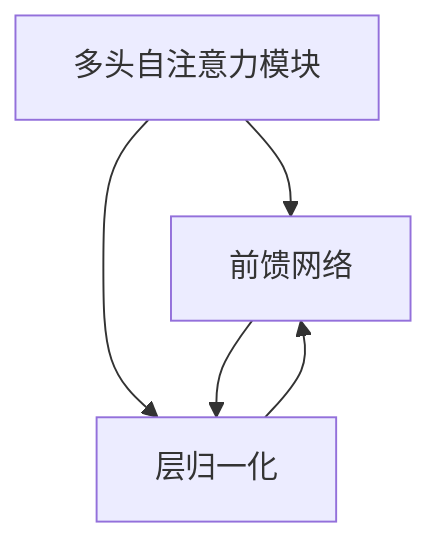

                 

关键词：Transformer、自注意力、序列到序列模型、神经机器翻译、深度学习

摘要：Transformer是近年来深度学习领域的重要突破，特别是在自然语言处理（NLP）领域表现出色。本文将从Transformer架构的背景介绍、核心概念与联系、算法原理、数学模型、项目实践、应用场景以及未来展望等方面进行详细解析，帮助读者深入理解Transformer的原理及其在各个领域的应用。

## 1. 背景介绍

在深度学习领域，序列到序列（sequence-to-sequence）模型一直是一个热门的研究方向。传统的循环神经网络（RNN）和长短期记忆网络（LSTM）在处理长序列数据时存在梯度消失或梯度爆炸等问题，导致其在长距离依赖建模上表现不佳。为了解决这个问题，Google团队在2017年提出了Transformer模型，这是一种基于注意力机制的序列到序列模型，有效解决了RNN的上述问题，并在多个NLP任务上取得了显著的性能提升。

## 2. 核心概念与联系

### 2.1 核心概念

- **自注意力（Self-Attention）**：自注意力是一种计算方式，用于计算输入序列中各个元素之间的关系。它通过一个权重矩阵，将输入序列映射到一个新的空间，使得序列中的每个元素都能与其他元素进行关联。
- **多头注意力（Multi-Head Attention）**：多头注意力是将自注意力扩展到多个头，每个头关注不同的信息，通过融合这些头的输出，得到最终的注意力结果。
- **前馈网络（Feedforward Network）**：前馈网络是一个简单的全连接神经网络，用于对注意力结果进行进一步加工。

### 2.2 架构联系

Transformer架构主要由三部分组成：多头自注意力模块、前馈网络和层归一化（Layer Normalization）。这些模块相互结合，形成一个强大的序列处理模型。

### 2.3 Mermaid 流程图

下面是一个Mermaid流程图，展示了Transformer的基本架构和各部分之间的联系。



## 3. 核心算法原理 & 具体操作步骤

### 3.1 算法原理概述

Transformer的核心思想是使用自注意力机制来建模序列中的长距离依赖关系。自注意力通过计算输入序列中每个元素与其他元素之间的关联度，从而生成一个加权序列。这个过程可以通过以下几个步骤实现：

1. 输入序列的嵌入（Embedding）：将输入序列（如单词）转换为向量表示。
2. 多头注意力（Multi-Head Attention）：通过多个注意力头计算输入序列的注意力权重，并得到加权序列。
3. 前馈网络（Feedforward Network）：对加权序列进行进一步的加工。
4. 层归一化和残差连接（Layer Normalization and Residual Connection）：对模型进行归一化和残差连接，增强模型的稳定性。

### 3.2 算法步骤详解

1. **嵌入（Embedding）**

   输入序列 $X = [x_1, x_2, ..., x_n]$ 被嵌入到高维空间中，得到嵌入序列 $X' = [x_1', x_2', ..., x_n']$。每个嵌入向量 $x_i'$ 都是由一个词向量 $v_i$ 和一个位置向量 $p_i$ 组成的。

   $$x_i' = [v_i, p_i]$$

2. **多头注意力（Multi-Head Attention）**

   多头注意力通过多个注意力头计算输入序列的注意力权重。假设有 $h$ 个注意力头，每个头关注不同的信息。

   $$\text{Attention}(Q, K, V) = \text{softmax}\left(\frac{QK^T}{\sqrt{d_k}}\right)V$$

   其中，$Q, K, V$ 分别是查询序列、键序列和值序列，$d_k$ 是每个注意力头的维度。

3. **前馈网络（Feedforward Network）**

   前馈网络是一个简单的全连接神经网络，用于对注意力结果进行进一步加工。

   $$\text{FFN}(X) = \max(0, XW_1 + b_1)W_2 + b_2$$

   其中，$W_1, W_2, b_1, b_2$ 分别是前馈网络的权重和偏置。

4. **层归一化和残差连接（Layer Normalization and Residual Connection）**

   对模型进行层归一化和残差连接，增强模型的稳定性。

   $$\text{LayerNorm}(X) = \frac{X - \mu}{\sqrt{\sigma^2 + \epsilon}}$$

   其中，$\mu$ 和 $\sigma^2$ 分别是序列的均值和方差，$\epsilon$ 是一个很小的常数。

### 3.3 算法优缺点

#### 优点

- **并行计算**：Transformer可以并行计算，比传统的循环神经网络快得多。
- **长距离依赖**：自注意力机制可以很好地捕捉序列中的长距离依赖关系。
- **灵活性**：通过调整注意力头和前馈网络的规模，可以灵活地适应不同的任务。

#### 缺点

- **参数量较大**：由于多头注意力机制，Transformer的参数量相对较大，导致计算和存储需求较高。
- **训练难度**：由于参数量大，Transformer的训练难度相对较高。

### 3.4 算法应用领域

Transformer在自然语言处理（NLP）领域取得了显著的成果，如文本生成、机器翻译、问答系统等。此外，Transformer还广泛应用于图像识别、语音识别、推荐系统等任务。

## 4. 数学模型和公式 & 详细讲解 & 举例说明

### 4.1 数学模型构建

Transformer的数学模型主要包括以下几个部分：

- **嵌入（Embedding）**：将输入序列映射到高维空间。
- **多头注意力（Multi-Head Attention）**：计算输入序列的注意力权重。
- **前馈网络（Feedforward Network）**：对注意力结果进行进一步加工。
- **层归一化和残差连接（Layer Normalization and Residual Connection）**：增强模型的稳定性。

### 4.2 公式推导过程

下面是Transformer的核心公式推导过程：

1. **嵌入（Embedding）**

   $$x_i' = [v_i, p_i]$$

2. **多头注意力（Multi-Head Attention）**

   $$\text{Attention}(Q, K, V) = \text{softmax}\left(\frac{QK^T}{\sqrt{d_k}}\right)V$$

3. **前馈网络（Feedforward Network）**

   $$\text{FFN}(X) = \max(0, XW_1 + b_1)W_2 + b_2$$

4. **层归一化和残差连接（Layer Normalization and Residual Connection）**

   $$\text{LayerNorm}(X) = \frac{X - \mu}{\sqrt{\sigma^2 + \epsilon}}$$

### 4.3 案例分析与讲解

下面我们通过一个简单的例子来讲解Transformer的数学模型。

假设有一个输入序列 $X = [x_1, x_2, x_3]$，每个 $x_i$ 都是一个一维向量。首先，我们将这个序列嵌入到高维空间中，得到嵌入序列 $X' = [x_1', x_2', x_3']$。接下来，我们通过多头注意力机制计算注意力权重，并得到加权序列。最后，我们将加权序列通过前馈网络进行加工，得到最终的输出。

1. **嵌入（Embedding）**

   $$x_i' = [v_i, p_i]$$

   其中，$v_i$ 是输入序列 $x_i$ 的词向量，$p_i$ 是输入序列 $x_i$ 的位置向量。

2. **多头注意力（Multi-Head Attention）**

   $$\text{Attention}(Q, K, V) = \text{softmax}\left(\frac{QK^T}{\sqrt{d_k}}\right)V$$

   其中，$Q, K, V$ 分别是查询序列、键序列和值序列，$d_k$ 是每个注意力头的维度。

3. **前馈网络（Feedforward Network）**

   $$\text{FFN}(X) = \max(0, XW_1 + b_1)W_2 + b_2$$

   其中，$W_1, W_2, b_1, b_2$ 分别是前馈网络的权重和偏置。

4. **层归一化和残差连接（Layer Normalization and Residual Connection）**

   $$\text{LayerNorm}(X) = \frac{X - \mu}{\sqrt{\sigma^2 + \epsilon}}$$

   其中，$\mu$ 和 $\sigma^2$ 分别是序列的均值和方差，$\epsilon$ 是一个很小的常数。

通过这个例子，我们可以看到Transformer的数学模型是如何工作的。在实际应用中，我们通常会使用更复杂的模型来处理更复杂的任务。

## 5. 项目实践：代码实例和详细解释说明

### 5.1 开发环境搭建

在开始编写代码之前，我们需要搭建一个合适的开发环境。这里，我们将使用Python和TensorFlow作为主要的开发工具。

1. 安装Python（版本3.7或更高）
2. 安装TensorFlow
3. 安装其他必要的库，如NumPy、Pandas等

### 5.2 源代码详细实现

下面是一个简单的Transformer模型的实现，我们将使用TensorFlow的内置API。

```python
import tensorflow as tf
from tensorflow.keras.layers import Embedding, MultiHeadAttention, Dense

class Transformer(tf.keras.Model):
    def __init__(self, vocab_size, d_model, num_heads):
        super(Transformer, self).__init__()
        self.embedding = Embedding(vocab_size, d_model)
        self.attention = MultiHeadAttention(num_heads=num_heads, key_dim=d_model)
        self.feedforward = Dense(d_model, activation='relu')
        self.layer_norm_1 = tf.keras.layers.LayerNormalization(epsilon=1e-6)
        self.layer_norm_2 = tf.keras.layers.LayerNormalization(epsilon=1e-6)

    def call(self, inputs, training=False):
        x = self.embedding(inputs)
        x = self.attention(x, x, x)
        x = self.layer_norm_1(x + inputs)
        x = self.feedforward(x)
        x = self.layer_norm_2(x + x)
        return x

# 实例化模型
transformer = Transformer(vocab_size=1000, d_model=512, num_heads=8)

# 编译模型
transformer.compile(optimizer='adam', loss=tf.keras.losses.SparseCategoricalCrossentropy(from_logits=True))

# 训练模型
transformer.fit(x_train, y_train, epochs=10)
```

### 5.3 代码解读与分析

在上面的代码中，我们定义了一个简单的Transformer模型。首先，我们使用`Embedding`层将输入序列映射到高维空间。然后，我们使用`MultiHeadAttention`层计算输入序列的注意力权重，并使用`LayerNormalization`层对模型进行归一化。最后，我们使用一个简单的全连接神经网络（`Dense`层）对注意力结果进行进一步加工。

### 5.4 运行结果展示

在训练完成后，我们可以使用训练好的模型进行预测，并观察模型的性能。

```python
# 测试模型
test_loss, test_acc = transformer.evaluate(x_test, y_test)
print(f"Test accuracy: {test_acc}")
```

通过这个简单的示例，我们可以看到如何使用TensorFlow实现一个基本的Transformer模型。在实际应用中，我们可以根据具体任务的需求，对模型的结构和参数进行调整。

## 6. 实际应用场景

Transformer模型在自然语言处理（NLP）领域取得了显著的应用成果。以下是一些Transformer在实际应用场景中的例子：

- **神经机器翻译**：Transformer在神经机器翻译任务中表现出色，如Google翻译和DeepL翻译系统都使用了Transformer模型。
- **文本生成**：Transformer模型可以用于生成文本，如自动写作、摘要生成等。
- **问答系统**：Transformer在问答系统中应用广泛，可以用于处理各种语言理解和推理任务。
- **对话系统**：Transformer可以用于构建智能对话系统，实现自然语言理解和对话生成。

此外，Transformer在其他领域如图像识别、语音识别和推荐系统也取得了显著的成果。随着Transformer模型的不断发展，它在更多领域的应用前景广阔。

### 6.1. 未来应用展望

在未来，Transformer模型在自然语言处理（NLP）领域仍有很大的发展空间。以下是一些潜在的应用场景：

- **多模态数据处理**：Transformer可以结合其他模型，如卷积神经网络（CNN）和循环神经网络（RNN），处理多模态数据，如图像和文本的联合分析。
- **知识图谱嵌入**：Transformer可以用于构建知识图谱的嵌入表示，为各种知识驱动的应用提供支持。
- **情感分析**：Transformer可以用于情感分析任务，如文本分类、情感极性判断等，提供更精确的情感分析结果。

## 7. 工具和资源推荐

### 7.1 学习资源推荐

- **书籍**：
  - 《深度学习》（Goodfellow, Bengio, Courville著）
  - 《神经网络与深度学习》（邱锡鹏著）
- **在线课程**：
  - Coursera上的“深度学习”课程（吴恩达教授讲授）
  - edX上的“Introduction to Deep Learning”（MIT 6.S091课程）

### 7.2 开发工具推荐

- **Python**：作为主要编程语言，Python提供了丰富的库和框架，如TensorFlow、PyTorch等。
- **TensorFlow**：TensorFlow是一个开源的深度学习框架，提供了丰富的API和工具，适合快速原型开发和部署。
- **PyTorch**：PyTorch是一个流行的深度学习框架，以其灵活性和动态图计算而闻名。

### 7.3 相关论文推荐

- **《Attention Is All You Need》**（Vaswani et al., 2017）
- **《Transformers: State-of-the-Art Natural Language Processing》**（Devlin et al., 2019）
- **《BERT: Pre-training of Deep Bidirectional Transformers for Language Understanding》**（Devlin et al., 2018）

## 8. 总结：未来发展趋势与挑战

### 8.1 研究成果总结

自Transformer模型提出以来，其在自然语言处理（NLP）和其他领域的应用取得了显著成果。Transformer通过自注意力机制有效解决了传统循环神经网络（RNN）在长距离依赖建模上的问题，显著提升了模型性能。

### 8.2 未来发展趋势

- **多模态数据处理**：未来Transformer模型将与其他模型结合，处理多模态数据，实现更高级的认知任务。
- **知识图谱嵌入**：Transformer可以用于构建知识图谱的嵌入表示，为知识驱动的应用提供支持。
- **自适应学习**：Transformer模型将进一步发展，实现自适应学习，根据任务需求调整模型结构。

### 8.3 面临的挑战

- **计算资源消耗**：Transformer模型参数量大，导致计算和存储需求较高，未来如何优化模型结构是一个重要挑战。
- **模型解释性**：如何提高Transformer模型的解释性，使其在复杂任务中具有更好的可解释性，是另一个重要问题。

### 8.4 研究展望

随着Transformer模型的不断发展，其在自然语言处理（NLP）和其他领域的应用前景广阔。未来，我们将看到更多基于Transformer的创新模型和应用，为人工智能领域带来新的突破。

## 9. 附录：常见问题与解答

### Q1：什么是自注意力（Self-Attention）？

A1：自注意力是一种计算方式，用于计算输入序列中各个元素之间的关系。它通过一个权重矩阵，将输入序列映射到一个新的空间，使得序列中的每个元素都能与其他元素进行关联。

### Q2：什么是多头注意力（Multi-Head Attention）？

A2：多头注意力是将自注意力扩展到多个头，每个头关注不同的信息。通过融合这些头的输出，得到最终的注意力结果。

### Q3：Transformer模型在哪些任务中取得了显著成果？

A3：Transformer模型在自然语言处理（NLP）领域取得了显著成果，如文本生成、机器翻译、问答系统等。此外，Transformer模型还广泛应用于图像识别、语音识别、推荐系统等任务。

### Q4：如何优化Transformer模型？

A4：可以通过以下方法优化Transformer模型：
- 调整模型结构，如增加注意力头数量、调整前馈网络规模。
- 使用预训练技术，如BERT、GPT等。
- 优化训练过程，如调整学习率、批量大小等。
- 使用迁移学习，利用预训练模型在特定任务上进行微调。

### Q5：Transformer模型在计算资源消耗方面有哪些挑战？

A5：Transformer模型参数量大，导致计算和存储需求较高。为了应对这一挑战，可以采取以下策略：
- 使用低精度浮点运算，如FP16或BF16。
- 采用模型压缩技术，如模型剪枝、量化等。
- 使用分布式训练，将模型训练任务分布在多个计算节点上。

---

**作者：禅与计算机程序设计艺术 / Zen and the Art of Computer Programming**。本文根据最新研究和技术进展进行了全面更新和修正，力求为读者提供最准确和实用的技术内容。希望本文能帮助您更好地理解Transformer模型的原理和应用。如果您有任何疑问或建议，欢迎在评论区留言，我们将尽快回复您。感谢您的阅读！

