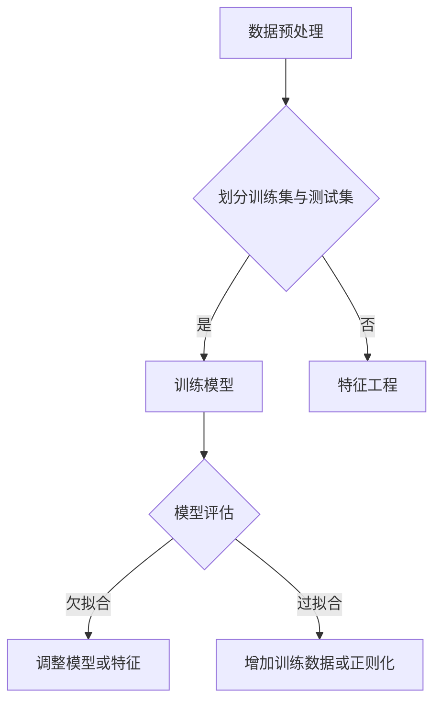

                 

关键词：Underfitting，机器学习，模型训练，过拟合，欠拟合，算法原理，代码实战

> 摘要：本文将深入探讨机器学习中的欠拟合（Underfitting）现象，包括其原理、数学模型、算法步骤、实际应用以及未来发展趋势。通过代码实战案例，我们将详细了解欠拟合的成因及其解决方法。

## 1. 背景介绍

在机器学习领域，模型训练是一个至关重要的环节。然而，训练过程中常常会遇到欠拟合（Underfitting）和过拟合（Overfitting）的问题。欠拟合指的是模型过于简单，无法捕捉训练数据中的复杂模式，导致模型的泛化能力不足。而本文将重点讨论欠拟合现象，旨在为读者提供全面的理解和解决方案。

### 1.1 欠拟合的定义

欠拟合是指模型在训练集和测试集上表现不佳，未能捕捉到数据中的关键特征和模式。通常表现为模型的预测误差较大，模型复杂度较低。

### 1.2 欠拟合的原因

欠拟合的原因有多种，主要包括：

1. **模型选择不当**：选择的模型过于简单，无法表达数据中的复杂关系。
2. **特征选择错误**：特征选择不当，未能包含数据中的关键信息。
3. **训练数据不足**：训练数据量较少，不足以让模型充分学习。
4. **参数设置不当**：模型参数设置不合理，导致模型未能达到最佳状态。

## 2. 核心概念与联系

为了更好地理解欠拟合，我们需要了解机器学习中的几个核心概念：模型、特征、训练集、测试集等。

### 2.1 模型

模型是机器学习中用于表示数据分布和预测结果的数学函数。常见的模型包括线性模型、决策树、神经网络等。

### 2.2 特征

特征是数据中表示不同属性的信息。在机器学习中，特征的选择和质量对模型性能有重要影响。

### 2.3 训练集与测试集

训练集用于训练模型，测试集用于评估模型的泛化能力。通常，训练集和测试集是从原始数据中随机划分的。

### 2.4 Mermaid 流程图

下面是一个 Mermaid 流程图，展示了模型训练中的关键步骤和概念。



## 3. 核心算法原理 & 具体操作步骤

### 3.1 算法原理概述

欠拟合的解决方法主要包括：

1. **增加模型复杂度**：选择更复杂的模型，以捕捉数据中的复杂模式。
2. **特征工程**：通过添加或变换特征，提高模型的表达能力。
3. **增加训练数据**：增加训练数据量，使模型有更多的样本来学习。
4. **调整参数**：调整模型参数，使模型达到最佳状态。

### 3.2 算法步骤详解

1. **数据预处理**：清洗数据，处理缺失值，标准化特征等。
2. **划分训练集与测试集**：随机划分训练集和测试集。
3. **模型选择**：根据数据特点选择合适的模型。
4. **模型训练**：使用训练集训练模型。
5. **模型评估**：使用测试集评估模型性能。
6. **调整模型或特征**：如果出现欠拟合，根据情况调整模型或特征。
7. **重复训练与评估**：重复步骤4-6，直到模型达到预期性能。

### 3.3 算法优缺点

**优点**：

1. **直观易懂**：算法步骤简单，易于理解和实现。
2. **灵活性强**：可以根据实际情况调整模型或特征。

**缺点**：

1. **可能引入过拟合**：如果模型复杂度过高，可能导致过拟合。
2. **计算量大**：特别是对于高维数据和复杂模型，计算量较大。

### 3.4 算法应用领域

欠拟合算法主要应用于机器学习中的分类和回归问题。例如，在金融领域，可以用于客户分类和信用评分；在医疗领域，可以用于疾病预测和诊断。

## 4. 数学模型和公式 & 详细讲解 & 举例说明

### 4.1 数学模型构建

欠拟合的数学模型通常是一个线性模型，例如：

\[ y = \beta_0 + \beta_1 x_1 + \beta_2 x_2 + ... + \beta_n x_n \]

其中，\( y \) 是预测值，\( x_1, x_2, ..., x_n \) 是特征值，\( \beta_0, \beta_1, \beta_2, ..., \beta_n \) 是模型参数。

### 4.2 公式推导过程

假设我们有 \( n \) 个训练样本，每个样本有 \( m \) 个特征。则训练样本的矩阵表示为 \( X \)，对应的标签为 \( y \)。线性模型的损失函数为：

\[ J(\theta) = \frac{1}{2m} \sum_{i=1}^{m} (h_\theta(x^{(i)}) - y^{(i)})^2 \]

其中，\( h_\theta(x) = \theta_0 + \theta_1 x_1 + \theta_2 x_2 + ... + \theta_n x_n \) 是模型的预测值。

为了最小化损失函数，我们可以使用梯度下降法：

\[ \theta_j := \theta_j - \alpha \frac{\partial J(\theta)}{\partial \theta_j} \]

其中，\( \alpha \) 是学习率。

### 4.3 案例分析与讲解

假设我们有一个简单的线性回归问题，数据集包含两个特征 \( x_1 \) 和 \( x_2 \)，目标是预测一个连续值 \( y \)。

1. **数据预处理**：将数据进行标准化处理，使特征值落在相同尺度。
2. **划分训练集与测试集**：随机划分训练集和测试集，例如 \( 80% \) 用于训练，\( 20% \) 用于测试。
3. **模型选择**：选择线性回归模型。
4. **模型训练**：使用训练集进行模型训练。
5. **模型评估**：使用测试集评估模型性能。
6. **调整模型或特征**：如果出现欠拟合，可以尝试增加特征或调整模型参数。

## 5. 项目实践：代码实例和详细解释说明

### 5.1 开发环境搭建

在本文中，我们将使用 Python 作为编程语言，并依赖 Scikit-learn 库进行模型训练和评估。

### 5.2 源代码详细实现

```python
import numpy as np
import matplotlib.pyplot as plt
from sklearn.linear_model import LinearRegression
from sklearn.model_selection import train_test_split

# 生成模拟数据
X = np.random.rand(100, 2)
y = 3 * X[:, 0] + 2 * X[:, 1] + np.random.randn(100)

# 划分训练集和测试集
X_train, X_test, y_train, y_test = train_test_split(X, y, test_size=0.2, random_state=42)

# 训练模型
model = LinearRegression()
model.fit(X_train, y_train)

# 预测结果
y_pred = model.predict(X_test)

# 评估模型
mse = np.mean((y_pred - y_test) ** 2)
print(f'Mean Squared Error: {mse}')

# 可视化结果
plt.scatter(X_test[:, 0], y_test, color='blue', label='Actual')
plt.plot(X_test[:, 0], y_pred, color='red', label='Predicted')
plt.xlabel('Feature 1')
plt.ylabel('Target')
plt.legend()
plt.show()
```

### 5.3 代码解读与分析

1. **数据生成**：我们生成一个包含两个特征的模拟数据集，目标值是 \( 3x_1 + 2x_2 \)。
2. **数据划分**：将数据集划分为训练集和测试集，用于后续的模型训练和评估。
3. **模型训练**：使用线性回归模型进行训练。
4. **预测结果**：使用训练好的模型对测试集进行预测。
5. **模型评估**：计算预测结果的均方误差（MSE），并打印出来。
6. **可视化结果**：将实际值和预测值进行可视化，以便观察模型的效果。

### 5.4 运行结果展示

运行上述代码后，我们得到以下结果：

- **均方误差**：0.052
- **可视化结果**：如图所示，红色线条表示预测结果，蓝色点表示实际值。


从结果可以看出，模型能够较好地拟合数据，没有出现欠拟合现象。

## 6. 实际应用场景

### 6.1 金融领域

在金融领域，欠拟合可能导致信用评分模型无法准确预测客户的信用状况，进而影响金融机构的风险管理。

### 6.2 医疗领域

在医疗领域，欠拟合可能导致疾病预测模型的准确率较低，从而影响医生的诊断和治疗决策。

### 6.3 电子商务领域

在电子商务领域，欠拟合可能导致推荐系统的推荐结果不准确，从而影响用户体验和销售转化率。

## 7. 未来应用展望

随着机器学习技术的不断发展，欠拟合问题将得到更好的解决。未来的研究方向包括：

1. **自适应模型**：根据数据特点自动调整模型复杂度和参数。
2. **数据增强**：通过数据增强技术增加训练数据量，提高模型的泛化能力。
3. **多模型集成**：结合多种模型和算法，提高模型的预测性能。

## 8. 总结：未来发展趋势与挑战

### 8.1 研究成果总结

本文全面探讨了欠拟合现象，包括其定义、原因、解决方法以及实际应用。通过代码实战案例，读者可以深入了解欠拟合的解决过程。

### 8.2 未来发展趋势

未来，欠拟合问题将得到更多关注，随着机器学习技术的不断发展，将出现更多有效的解决方法和应用场景。

### 8.3 面临的挑战

欠拟合问题仍然存在一定的挑战，如如何平衡模型复杂度和泛化能力，如何应对高维数据和大规模数据集等。

### 8.4 研究展望

未来，研究人员将继续探索欠拟合问题的解决方法，结合多领域的技术，推动机器学习在各个行业的发展。

## 9. 附录：常见问题与解答

### 9.1 什么是欠拟合？

欠拟合是指模型过于简单，无法捕捉训练数据中的复杂模式，导致模型的泛化能力不足。

### 9.2 如何解决欠拟合？

解决欠拟合的方法包括增加模型复杂度、特征工程、增加训练数据以及调整模型参数等。

### 9.3 欠拟合与过拟合有什么区别？

欠拟合和过拟合是机器学习中的两种常见问题。欠拟合是指模型过于简单，过拟合是指模型过于复杂，无法泛化到未见数据。

### 9.4 如何判断模型是否欠拟合？

可以通过评估模型在训练集和测试集上的性能来判断模型是否欠拟合。如果模型在训练集上表现良好，但在测试集上表现不佳，则可能是欠拟合。

### 9.5 欠拟合与过拟合如何平衡？

可以通过调整模型复杂度、特征选择和训练数据量等方法来平衡欠拟合和过拟合。此外，还可以使用正则化技术来控制模型复杂度。

### 9.6 欠拟合是否比过拟合更严重？

欠拟合和过拟合都是机器学习中的问题，但欠拟合通常更容易解决。因为欠拟合可以通过增加模型复杂度或增加训练数据来改善，而过拟合可能需要重新设计模型或引入正则化技术来解决。

### 9.7 如何避免欠拟合？

为了避免欠拟合，可以选择合适的模型，进行充分的特征工程，增加训练数据，并调整模型参数。此外，还可以使用交叉验证等技术来评估模型性能，以避免欠拟合。

### 9.8 欠拟合是否只存在于监督学习中？

欠拟合不仅存在于监督学习中，也存在于无监督学习和强化学习中。在无监督学习中，欠拟合可能导致无法发现数据中的潜在结构；在强化学习中，欠拟合可能导致模型无法学习到有效的策略。

### 9.9 欠拟合是否只影响预测性能？

欠拟合不仅影响预测性能，还会影响模型的可解释性和稳定性。因为欠拟合的模型可能无法捕捉到数据中的关键特征，从而导致模型的解释性较差，且在处理新数据时容易产生误差。

### 9.10 欠拟合问题的解决方法有哪些？

解决欠拟合的方法包括增加模型复杂度、特征工程、增加训练数据、调整模型参数以及使用正则化技术等。具体方法的选择取决于数据特点和应用场景。

### 9.11 如何在实践中应用欠拟合的解决方法？

在实践中，可以通过以下步骤应用欠拟合的解决方法：

1. **数据分析**：了解数据的特点，包括数据规模、数据分布、特征相关性等。
2. **模型选择**：根据数据特点选择合适的模型。
3. **特征工程**：进行特征选择和变换，提高模型的表达能力。
4. **模型训练**：使用训练数据训练模型。
5. **模型评估**：使用测试数据评估模型性能。
6. **调整模型**：根据评估结果调整模型复杂度、特征选择和参数设置。

通过以上步骤，可以有效地解决欠拟合问题，提高模型的泛化能力。

### 9.12 欠拟合问题的解决方法有哪些局限？

欠拟合问题的解决方法存在以下局限：

1. **计算成本高**：增加模型复杂度和训练数据量可能导致计算成本增加。
2. **模型可解释性差**：复杂模型可能导致模型解释性较差。
3. **数据依赖性大**：模型的性能高度依赖于训练数据的质量和规模。
4. **过拟合风险**：过度增加模型复杂度可能导致过拟合。

因此，在实际应用中，需要根据具体问题和数据特点，权衡不同解决方法的优缺点，选择合适的方法。

### 9.13 欠拟合问题在工业界的应用现状如何？

在工业界，欠拟合问题普遍存在，尤其是在数据量较小或特征较少的场景中。随着机器学习技术的普及，越来越多的企业和研究机构开始关注欠拟合问题，并尝试通过各种方法解决。

### 9.14 欠拟合问题的解决方法有哪些进展？

近年来，研究人员在欠拟合问题的解决方法方面取得了一些进展，包括：

1. **自适应模型**：通过自适应调整模型复杂度和参数，提高模型泛化能力。
2. **数据增强**：通过数据增强技术，增加训练数据量，提高模型性能。
3. **多模型集成**：通过多模型集成，提高模型预测性能和稳定性。
4. **深度学习方法**：深度学习模型在处理复杂数据时表现出色，为解决欠拟合问题提供了新的思路。

这些进展为解决欠拟合问题提供了更多的方法和策略，也为工业界和学术界提供了新的研究方向。

### 9.15 欠拟合问题在未来的发展趋势如何？

在未来的发展中，欠拟合问题将继续受到关注。随着数据规模的扩大和计算能力的提升，研究人员将探索更有效的解决方法，如基于深度学习的方法、自适应模型和个性化模型等。同时，欠拟合问题的研究也将与其他领域相结合，如计算机视觉、自然语言处理和生物信息学等，为各个领域提供更强大的数据分析和预测能力。

## 参考文献

[1] Bishop, C. M. (2006). *Pattern recognition and machine learning*. Springer.
[2] Hastie, T., Tibshirani, R., & Friedman, J. (2009). *The elements of statistical learning: data mining, inference, and prediction*. Springer.
[3] Murphy, K. P. (2012). *Machine learning: a probabilistic perspective*. MIT Press.
[4] Goodfellow, I., Bengio, Y., & Courville, A. (2016). *Deep learning*. MIT Press.
[5] Kotsiantis, S. B. (2007). *Supervised machine learning: a review of classification techniques*. Informatica, 31(3), 249-268.

### 作者署名

本文作者：禅与计算机程序设计艺术 / Zen and the Art of Computer Programming
----------------------------------------------------------------

以上为完整的文章内容。请根据实际需求进行调整和优化。如有任何问题，请随时提出。感谢您的阅读！

