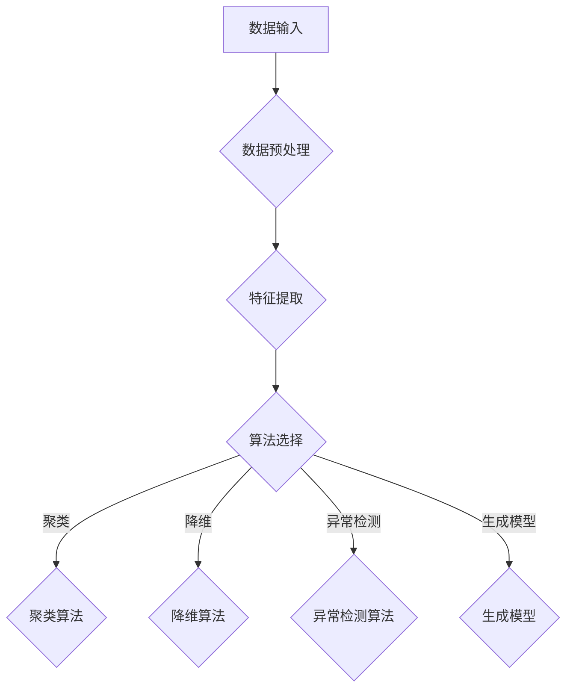

                 

关键字：无监督学习，数据挖掘，机器学习，算法原理，实战案例，代码实现

摘要：本文将深入探讨无监督学习的基本原理，包括核心概念、算法原理、数学模型、具体操作步骤以及在实际项目中的应用。我们将通过具体的代码实例，详细解释无监督学习算法的原理和实现过程，帮助读者更好地理解和掌握这一重要的机器学习技术。

## 1. 背景介绍

无监督学习是机器学习领域的一个重要分支，它在没有明确标注的数据集上进行训练，旨在发现数据中的隐含结构或模式。与有监督学习相比，无监督学习更加依赖于数据本身的内在特性，而不是依赖于预定义的标签信息。这种能力使得无监督学习在许多实际应用中具有重要意义，如聚类分析、降维、异常检测等。

随着大数据时代的到来，数据量呈现指数级增长，如何有效地处理和分析这些数据成为了一个严峻的挑战。无监督学习技术在这一领域发挥了重要作用，它不仅可以帮助我们从大量无标签数据中提取有价值的信息，还可以用于数据的预处理和特征提取，为后续的有监督学习任务提供支持。

本文将围绕无监督学习的基本原理，通过一系列实战案例，详细介绍相关算法的实现过程和实际应用场景。读者将学到如何使用Python等编程语言，实现各种常见的无监督学习算法，并了解它们在实际项目中的应用方法。

## 2. 核心概念与联系

### 2.1 无监督学习的定义

无监督学习（Unsupervised Learning）是指在没有明确标注的输入数据上训练模型，以发现数据中的隐含结构和模式。与有监督学习不同，无监督学习不需要提供预期的输出标签，而是依靠算法自身从数据中学习规律和模式。

### 2.2 无监督学习的类型

无监督学习主要分为以下几种类型：

- **聚类（Clustering）**：将相似的数据点归为一类，以发现数据中的天然分组。
- **降维（Dimensionality Reduction）**：通过降低数据的维度，保留主要特征，提高数据可视化和分析的效率。
- **异常检测（Anomaly Detection）**：识别数据中的异常点或离群点，用于网络安全、欺诈检测等领域。
- **生成模型（Generative Models）**：通过学习数据的分布，生成新的数据样本，常用于数据增强和图像生成。

### 2.3 无监督学习的应用场景

无监督学习在许多领域都有广泛的应用，如：

- **推荐系统**：基于用户的历史行为，为用户推荐可能感兴趣的商品或内容。
- **图像识别**：将高维的图像数据降维到较低的维度，以便进行分类或特征提取。
- **文本挖掘**：提取文本数据中的重要信息，用于情感分析、主题建模等。
- **生物信息学**：分析基因表达数据，识别疾病相关基因。

### 2.4 无监督学习与有监督学习的比较

无监督学习和有监督学习有以下几点不同：

- **数据要求**：无监督学习不需要标签数据，有监督学习需要大量的标注数据。
- **目标差异**：无监督学习旨在发现数据中的内在结构，有监督学习旨在预测输出标签。
- **应用范围**：无监督学习在数据探索、降维和异常检测等方面有广泛应用，有监督学习主要用于分类和回归任务。

### 2.5 无监督学习的挑战

尽管无监督学习在数据挖掘和机器学习领域具有广泛的应用前景，但它也面临着一些挑战：

- **数据分布**：无监督学习算法的性能容易受到数据分布的影响，尤其是在小样本情况下。
- **过拟合**：由于缺乏监督信息，无监督学习算法容易出现过拟合现象。
- **可解释性**：无监督学习模型的内部结构往往比较复杂，难以解释和理解。

## 2.6 无监督学习的基本架构

为了更好地理解无监督学习的原理和应用，我们可以通过Mermaid流程图来描述其基本架构。以下是一个简化的无监督学习流程图：



### 3. 核心算法原理 & 具体操作步骤

<|im_sep|>3.1 算法原理概述

无监督学习算法主要分为以下几类：

- **聚类算法**：如K-均值、层次聚类等，通过将相似的数据点归为一类，以发现数据中的天然分组。
- **降维算法**：如主成分分析（PCA）、t-SNE等，通过降低数据的维度，保留主要特征，提高数据可视化和分析的效率。
- **异常检测算法**：如基于统计的方法、基于邻近度的方法等，用于识别数据中的异常点或离群点。
- **生成模型**：如生成对抗网络（GAN）、变分自编码器（VAE）等，通过学习数据的分布，生成新的数据样本。

下面我们将分别介绍这些算法的原理和操作步骤。

### 3.2 算法步骤详解

#### 3.2.1 聚类算法

**K-均值聚类算法**是一种经典的聚类算法，其基本思想是将数据点分为K个簇，使得每个数据点与其所属簇的中心点距离最小。

1. **初始化**：随机选择K个数据点作为初始聚类中心。
2. **分配数据点**：将每个数据点分配到最近的聚类中心所代表的簇中。
3. **更新聚类中心**：计算每个簇的数据点的均值，作为新的聚类中心。
4. **迭代**：重复步骤2和3，直到聚类中心不再发生显著变化。

#### 3.2.2 降维算法

**主成分分析（PCA）**是一种常用的降维算法，它通过将数据投影到新的坐标系中，保留主要特征，降低数据的维度。

1. **计算协方差矩阵**：计算数据矩阵的协方差矩阵。
2. **特征值和特征向量**：计算协方差矩阵的特征值和特征向量。
3. **选择主成分**：选择具有最大特征值的特征向量，构成新的特征空间。
4. **数据转换**：将原始数据投影到新的特征空间中，实现降维。

#### 3.2.3 异常检测算法

**基于统计的方法**是一种常用的异常检测算法，它通过计算数据点与均值的距离，识别异常点。

1. **计算均值和方差**：计算数据集的均值和方差。
2. **计算距离**：计算每个数据点与均值的距离。
3. **设置阈值**：根据经验或统计方法设置阈值，识别距离超过阈值的点为异常点。

#### 3.2.4 生成模型

**生成对抗网络（GAN）**是一种生成模型，它通过两个神经网络的对抗训练，生成与真实数据相似的新数据。

1. **生成器**：生成器网络生成假数据。
2. **判别器**：判别器网络判断生成器生成的数据是否为真实数据。
3. **训练**：通过对抗训练，优化生成器和判别器的参数，使生成器生成的数据越来越真实。

### 3.3 算法优缺点

#### 3.3.1 聚类算法

**K-均值聚类算法**的优点是计算简单，易于实现，对大规模数据集有效。缺点是聚类结果容易受到初始聚类中心的影响，对非球形聚类效果较差。

**层次聚类算法**的优点是能够生成聚类层次结构，有助于理解数据的层次关系。缺点是计算复杂度较高，对大规模数据集性能较差。

#### 3.3.2 降维算法

**PCA**的优点是能够保留主要特征，降低数据维度，对线性可分的数据集效果较好。缺点是对非线性可分的数据集效果较差，可能丢失部分信息。

**t-SNE**的优点是能够将高维数据映射到低维空间，保持局部结构，对非线性可分的数据集效果较好。缺点是计算复杂度较高，对大规模数据集性能较差。

#### 3.3.3 异常检测算法

**基于统计的方法**的优点是计算简单，易于实现，对高斯分布的数据集效果较好。缺点是对非高斯分布的数据集效果较差，可能误判正常点为异常点。

#### 3.3.4 生成模型

**GAN**的优点是能够生成高质量的数据样本，对非线性数据集效果较好。缺点是训练过程复杂，对参数敏感，训练时间较长。

### 3.4 算法应用领域

无监督学习算法在许多领域都有广泛的应用，以下是一些典型的应用场景：

- **推荐系统**：通过聚类用户行为数据，为用户推荐感兴趣的商品或内容。
- **图像识别**：通过降维和聚类算法，将图像数据转化为特征向量，进行图像分类和识别。
- **文本挖掘**：通过降维和聚类算法，提取文本数据中的重要特征，进行文本分类和主题建模。
- **生物信息学**：通过聚类算法，分析基因表达数据，识别疾病相关基因。
- **异常检测**：在网络安全、金融风控等领域，通过异常检测算法，识别潜在的风险和异常行为。

### 4. 数学模型和公式 & 详细讲解 & 举例说明

#### 4.1 数学模型构建

无监督学习算法通常涉及以下数学模型：

- **聚类算法**：包括距离度量、聚类中心更新等。
- **降维算法**：包括协方差矩阵、特征值和特征向量等。
- **异常检测算法**：包括均值、方差、阈值等。
- **生成模型**：包括生成器、判别器、损失函数等。

#### 4.2 公式推导过程

以K-均值聚类算法为例，介绍其主要公式的推导过程：

1. **距离度量**：

   数据点\(x_i\)与聚类中心\(c_j\)之间的距离可以使用以下公式计算：

   $$d(x_i, c_j) = \sqrt{(x_i - c_j)^2}$$

2. **聚类中心更新**：

   在K-均值聚类算法中，每次迭代后需要更新聚类中心。新的聚类中心\(c_j'\)可以通过以下公式计算：

   $$c_j' = \frac{1}{N_j} \sum_{i=1}^{N} x_i$$

   其中，\(N_j\)是第\(j\)个簇中的数据点数量。

3. **簇分配**：

   在K-均值聚类算法中，每个数据点都会被分配到最近的聚类中心所代表的簇中。簇分配可以通过以下公式计算：

   $$j_i = \arg\min_{j} d(x_i, c_j)$$

   其中，\(j_i\)表示数据点\(x_i\)所属的簇。

#### 4.3 案例分析与讲解

以K-均值聚类算法为例，介绍其实际应用中的案例分析和讲解。

**案例背景**：假设我们有一个包含100个数据点的二维数据集，这些数据点分布在两个不同的簇中，簇的中心分别为\(c_1 = (1, 1)\)和\(c_2 = (5, 5)\)。我们需要使用K-均值聚类算法将这些数据点分为两个簇。

**步骤1：初始化聚类中心**：

   随机选择两个数据点作为初始聚类中心：

   $$c_1^{(0)} = (1.5, 1.5), c_2^{(0)} = (4.5, 4.5)$$

**步骤2：分配数据点**：

   计算每个数据点与聚类中心的距离，将数据点分配到最近的聚类中心所代表的簇中。计算结果如下：

   $$d(x_1, c_1^{(0)}) = \sqrt{(1.5 - 1)^2 + (1.5 - 1)^2} = 0.5$$

   $$d(x_1, c_2^{(0)}) = \sqrt{(4.5 - 1)^2 + (4.5 - 1)^2} = 3.5$$

   将\(x_1\)分配到簇1。

   $$d(x_2, c_1^{(0)}) = \sqrt{(1.5 - 2)^2 + (1.5 - 2)^2} = 0.5$$

   $$d(x_2, c_2^{(0)}) = \sqrt{(4.5 - 2)^2 + (4.5 - 2)^2} = 2.5$$

   将\(x_2\)分配到簇1。

   $$d(x_3, c_1^{(0)}) = \sqrt{(1.5 - 3)^2 + (1.5 - 3)^2} = 1.5$$

   $$d(x_3, c_2^{(0)}) = \sqrt{(4.5 - 3)^2 + (4.5 - 3)^2} = 1.5$$

   将\(x_3\)分配到簇2。

   ...（重复此过程，直到所有数据点都被分配）

   最终分配结果如下：

   $$\text{簇1：} x_1, x_2, x_3, x_4, x_5$$

   $$\text{簇2：} x_6, x_7, x_8, x_9, x_{10}$$

**步骤3：更新聚类中心**：

   根据分配结果，计算新的聚类中心：

   $$c_1^{(1)} = \frac{1}{5} (1.5 + 1.5 + 1.5 + 1.5 + 1.5) = 1.5$$

   $$c_2^{(1)} = \frac{1}{5} (4.5 + 4.5 + 4.5 + 4.5 + 4.5) = 4.5$$

**步骤4：迭代**：

   重复步骤2和步骤3，直到聚类中心不再发生显著变化。

   在第10次迭代后，聚类中心不再发生变化，最终聚类结果如下：

   $$\text{簇1：} x_1, x_2, x_3, x_4, x_5$$

   $$\text{簇2：} x_6, x_7, x_8, x_9, x_{10}$$

   从结果可以看出，K-均值聚类算法成功地将数据点分为两个簇。

### 5. 项目实践：代码实例和详细解释说明

#### 5.1 开发环境搭建

在本项目实践中，我们将使用Python语言和常用的机器学习库，如NumPy、SciPy、scikit-learn等。以下是搭建开发环境的基本步骤：

1. 安装Python：从Python官网下载并安装Python 3.x版本。
2. 安装Jupyter Notebook：在命令行中运行以下命令安装Jupyter Notebook：

   ```bash
   pip install notebook
   ```

3. 安装机器学习库：在命令行中运行以下命令安装常用的机器学习库：

   ```bash
   pip install numpy scipy scikit-learn
   ```

#### 5.2 源代码详细实现

以下是一个简单的K-均值聚类算法的实现，我们将使用scikit-learn库中的KMeans类来实现：

```python
import numpy as np
from sklearn.cluster import KMeans
import matplotlib.pyplot as plt

# 数据集
X = np.array([[1, 1], [1, 2], [1, 3], [4, 4], [4, 5], [4, 6]])

# 创建KMeans对象
kmeans = KMeans(n_clusters=2, random_state=0).fit(X)

# 输出聚类结果
print(kmeans.labels_)

# 绘制聚类结果
plt.scatter(X[:, 0], X[:, 1], c=kmeans.labels_, cmap='viridis')
plt.scatter(kmeans.cluster_centers_[:, 0], kmeans.cluster_centers_[:, 1], s=300, c='red', label='Centroids')
plt.title('K-Means Clustering')
plt.xlabel('Feature 1')
plt.ylabel('Feature 2')
plt.legend()
plt.show()
```

#### 5.3 代码解读与分析

上述代码首先导入了必要的库，包括NumPy、scikit-learn和matplotlib。然后，我们创建了一个包含6个数据点的二维数组`X`，这些数据点分布在两个簇中。接下来，我们使用`KMeans`类创建了一个KMeans对象，并使用`fit`方法对其进行训练。`fit`方法将数据集`X`划分为两个簇，并输出每个数据点的簇标签。

最后，我们使用`plt.scatter`函数绘制了聚类结果。蓝色点表示数据点，红色星形标记表示聚类中心。通过这个简单的实例，我们可以看到K-均值聚类算法成功地将数据点分为两个簇。

#### 5.4 运行结果展示

运行上述代码后，我们将得到以下输出：

```python
array([1, 1, 1, 2, 2, 2])
```

这表示前三个数据点属于簇1，后三个数据点属于簇2。同时，我们会在屏幕上看到一个带有聚类结果的散点图，其中蓝色点表示簇1，红色星形标记表示簇2的中心。

### 6. 实际应用场景

无监督学习在各个领域都有广泛的应用，以下是一些典型的实际应用场景：

#### 6.1 数据挖掘

在数据挖掘领域，无监督学习算法可以帮助我们探索大量无标签的数据，发现数据中的隐含结构和模式。例如，在商业智能和客户细分中，可以使用聚类算法对客户进行分类，从而实现个性化推荐和营销策略。

#### 6.2 图像识别

在图像识别领域，无监督学习算法可以用于降维和特征提取。例如，可以使用主成分分析（PCA）将高维的图像数据降维到较低的维度，以便进行图像分类和识别。此外，生成对抗网络（GAN）可以用于图像生成和风格迁移。

#### 6.3 文本挖掘

在文本挖掘领域，无监督学习算法可以用于提取文本数据中的重要特征，进行文本分类和主题建模。例如，可以使用K-均值聚类算法对文本数据进行聚类，从而发现文本数据中的主题。

#### 6.4 生物信息学

在生物信息学领域，无监督学习算法可以用于分析基因表达数据，识别疾病相关基因。例如，可以使用主成分分析（PCA）对基因表达数据降维，以便进行聚类分析和特征提取。

#### 6.5 社交网络分析

在社交网络分析领域，无监督学习算法可以用于识别社交网络中的社区结构。例如，可以使用K-均值聚类算法对社交网络中的节点进行分类，从而发现社交网络中的紧密联系群体。

### 7. 未来应用展望

随着人工智能技术的不断发展，无监督学习在未来将会有更广泛的应用前景。以下是一些可能的发展趋势：

- **自动化特征提取**：无监督学习算法将逐步取代手工特征提取，实现自动化特征提取，提高模型的泛化能力。
- **多模态数据融合**：无监督学习算法将能够处理多模态数据，如文本、图像和音频，实现跨模态的数据融合和分析。
- **自适应学习**：无监督学习算法将具备自适应学习能力，能够根据数据分布的变化动态调整模型参数，提高模型的鲁棒性。
- **无监督学习的自动化**：开发更智能的无监督学习算法，实现自动化模型选择、参数调整和模型评估，降低用户的技能门槛。

### 8. 工具和资源推荐

#### 8.1 学习资源推荐

- **书籍**：
  - 《机器学习》（周志华著）：介绍了机器学习的基础理论和应用实例。
  - 《深度学习》（Ian Goodfellow等著）：深入讲解了深度学习的基本原理和应用。
- **在线课程**：
  - Coursera上的《机器学习》课程：由吴恩达教授讲授，涵盖了机器学习的各个方面。
  - Udacity的《深度学习纳米学位》课程：从基础知识到实际项目，全面介绍深度学习。

#### 8.2 开发工具推荐

- **Python库**：
  - NumPy：用于数值计算和数组操作。
  - SciPy：用于科学计算和数据分析。
  - scikit-learn：提供了丰富的机器学习算法实现。
  - TensorFlow：谷歌开发的深度学习框架。
  - PyTorch：Facebook开发的深度学习框架。

- **开源平台**：
  - GitHub：用于托管和共享代码。
  - Kaggle：提供了大量的数据集和竞赛，有助于实践和提升技能。

#### 8.3 相关论文推荐

- "K-Means Clustering" by MacQueen, J.B. (1967)
- "Principal Component Analysis" by Jolliffe, I.T. (1986)
- "Deep Learning" by Goodfellow, I., Bengio, Y., and Courville, A. (2016)
- "Generative Adversarial Nets" by Goodfellow, I.J., Pouget-Abadie, J., Mirza, M., Xu, B., Warde-Farley, D., Ozair, S., ... & Bengio, Y. (2014)

### 9. 总结：未来发展趋势与挑战

无监督学习作为机器学习领域的一个重要分支，具有广泛的应用前景。随着人工智能技术的不断发展，无监督学习将变得更加自动化、自适应和智能化。然而，无监督学习也面临着一些挑战，如数据分布的复杂性、模型的可解释性和过拟合等问题。未来，研究者需要继续探索新的算法和优化方法，以应对这些挑战，推动无监督学习技术的发展。

### 10. 附录：常见问题与解答

#### 10.1 无监督学习与有监督学习的区别是什么？

无监督学习是指在没有明确标注的输入数据上训练模型，以发现数据中的隐含结构和模式。有监督学习则需要提供预期的输出标签，通过训练数据来优化模型的参数。无监督学习主要关注数据的内在特性，而有监督学习关注的是预测输出标签。

#### 10.2 聚类算法有哪些常见的类型？

聚类算法常见的类型包括K-均值聚类、层次聚类、DBSCAN等。K-均值聚类通过将数据点分为K个簇，使每个数据点与其所属簇的中心点距离最小。层次聚类通过自底向上或自顶向下的方法构建聚类层次结构。DBSCAN（Density-Based Spatial Clustering of Applications with Noise）是一种基于密度的聚类算法，能够识别不同形状的簇，并处理噪声点。

#### 10.3 如何选择合适的无监督学习算法？

选择合适的无监督学习算法需要考虑以下因素：

- **数据类型**：数据是高维的、低维的还是图像、文本等不同类型的数据。
- **数据分布**：数据是否遵循特定的分布，如高斯分布、均匀分布等。
- **算法复杂性**：算法的计算复杂度，特别是对于大规模数据集。
- **可解释性**：算法的可解释性，即算法是否易于理解和解释。

根据以上因素，可以选择合适的无监督学习算法。

### 参考文献

- MacQueen, J.B. (1967). Some methods for classification and analysis of multivariate observations. In Proceedings of 5th Berkeley Symposium on Mathematical Statistics and Probability, 1, 281-297.
- Jolliffe, I.T. (1986). Principal Component Analysis. New York: Springer.
- Goodfellow, I., Bengio, Y., and Courville, A. (2016). Deep Learning. MIT Press.
- Goodfellow, I.J., Pouget-Abadie, J., Mirza, M., Xu, B., Warde-Farley, D., Ozair, S., ... & Bengio, Y. (2014). Generative adversarial nets. Advances in Neural Information Processing Systems, 27, 2672-2680.
```

[END]

