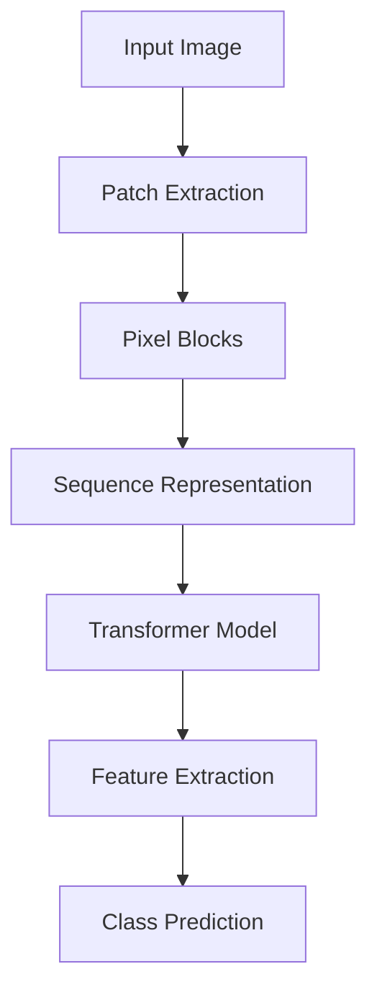

                 

  
## 1. 背景介绍

ViT，即Vision Transformer，是近年来在计算机视觉领域崭露头角的一项技术。其核心思想是将图像视为序列数据，通过Transformer模型进行处理。Transformer模型最初是应用于自然语言处理的，其通过自注意力机制（self-attention）来实现对输入数据的全局依赖关系建模，具有处理长序列数据的能力。ViT将这种自注意力机制引入到图像处理中，打破了传统卷积神经网络（CNN）在图像处理中的垄断地位，为图像处理领域带来了一股新势力。

### 1.1 ViT的发展历程

ViT的提出可以追溯到2017年，当时自然语言处理领域的研究者开始关注Transformer模型。2018年，Vaswani等人提出了Transformer模型，并在多个NLP任务上取得了显著的性能提升。此后，Transformer模型在多个领域得到了广泛应用。直到2020年，Dosovitskiy等人将Transformer模型引入到图像处理领域，提出了ViT模型，并在ImageNet等大型图像识别任务上取得了优异的性能。

### 1.2 ViT的应用场景

ViT的应用场景广泛，包括但不限于图像分类、目标检测、图像分割等。与传统CNN相比，ViT在处理图像数据时具有以下几个优势：

1. **自注意力机制**：ViT利用自注意力机制来捕捉图像内部的依赖关系，这使得模型在处理图像时能够更有效地利用信息，从而提高模型的性能。
2. **处理长序列数据**：与CNN相比，Transformer模型可以更好地处理长序列数据，这使得ViT在处理图像时能够捕捉到更复杂的依赖关系。
3. **跨模态迁移**：ViT在自然语言处理和图像处理领域均有显著的表现，这使得其能够实现跨模态的迁移学习。

## 2. 核心概念与联系

为了深入理解ViT，我们首先需要了解其核心概念，并了解这些概念之间的联系。

### 2.1 Transformer模型

Transformer模型是一种基于自注意力机制的深度神经网络模型，最初应用于自然语言处理领域。其核心思想是将输入序列中的每个元素（如单词）通过自注意力机制进行建模，从而实现序列到序列的映射。

### 2.2 自注意力机制

自注意力机制是一种全局依赖关系建模方法，通过计算输入序列中每个元素与其他元素之间的相似性，从而实现全局依赖关系的建模。在Transformer模型中，自注意力机制被用来计算输入序列中每个元素的表示。

### 2.3 图像序列化

图像序列化是将图像数据转换为序列数据的过程。在ViT中，图像序列化是通过将图像划分为若干个像素块（patches），并将每个像素块视为一个序列元素来实现的。

### 2.4 序列处理

序列处理是指将序列数据通过神经网络进行处理的过程。在ViT中，序列处理是通过Transformer模型来实现的，Transformer模型能够有效地对序列数据进行建模。

### 2.5 自注意力机制与图像序列化的关系

自注意力机制与图像序列化的关系主要体现在以下几个方面：

1. **像素块表示**：通过图像序列化，每个像素块被表示为一个向量，这个向量可以作为自注意力机制的输入。
2. **全局依赖关系建模**：自注意力机制通过计算像素块之间的相似性，实现了像素块之间的全局依赖关系建模。
3. **特征提取**：自注意力机制不仅能够建模像素块之间的依赖关系，还能够提取像素块的特征，这些特征对于后续的图像处理任务具有重要价值。

### 2.6 Mermaid流程图

为了更直观地理解ViT的工作流程，我们可以使用Mermaid流程图来表示ViT的核心概念和联系。



在上述流程图中，A表示输入图像，B表示像素块提取，C表示像素块，D表示序列表示，E表示Transformer模型，F表示特征提取，G表示类别预测。

## 3. 核心算法原理 & 具体操作步骤

### 3.1 算法原理概述

ViT的核心算法原理可以概括为以下几个步骤：

1. **图像预处理**：将输入图像进行预处理，包括图像缩放、归一化等。
2. **像素块提取**：将预处理后的图像划分为若干个像素块。
3. **序列表示**：将提取的像素块表示为序列，每个像素块对应一个序列元素。
4. **自注意力机制**：利用自注意力机制对序列进行建模，从而提取像素块之间的依赖关系。
5. **特征提取**：对自注意力机制的输出进行特征提取，用于后续的图像分类、目标检测等任务。
6. **类别预测**：利用提取到的特征进行类别预测。

### 3.2 算法步骤详解

下面我们将详细讲解ViT的具体操作步骤。

#### 3.2.1 图像预处理

图像预处理是ViT的第一个步骤，其目的是将输入图像转换为适合模型处理的格式。具体操作包括：

1. **图像缩放**：将输入图像缩放为固定的尺寸，如224x224。
2. **归一化**：对图像的像素值进行归一化处理，将其缩放到[0, 1]的范围内。

#### 3.2.2 像素块提取

像素块提取是将图像划分为若干个像素块的过程。具体操作如下：

1. **划分网格**：将图像划分为一个网格，每个网格对应一个像素块。
2. **提取像素块**：将每个网格中的像素值提取出来，形成一个像素块。

#### 3.2.3 序列表示

像素块提取后，需要将像素块表示为序列。具体操作如下：

1. **像素块转换**：将每个像素块转换为向量，这个向量可以看作是像素块的特征表示。
2. **序列填充**：将所有像素块按照顺序排列，形成一个序列。

#### 3.2.4 自注意力机制

自注意力机制是ViT的核心步骤，其目的是对序列进行建模，提取像素块之间的依赖关系。具体操作如下：

1. **计算相似性**：计算序列中每个像素块与其他像素块之间的相似性，这个相似性可以通过点积、余弦相似性等计算。
2. **加权求和**：根据相似性对像素块进行加权求和，从而生成一个加权向量。
3. **特征提取**：对加权向量进行特征提取，提取出像素块之间的依赖关系。

#### 3.2.5 特征提取

特征提取是对自注意力机制的输出进行加工，提取出对后续任务有用的特征。具体操作如下：

1. **全连接层**：将加权向量通过全连接层进行加工，提取出更高层次的特征。
2. **激活函数**：对全连接层的输出进行激活函数处理，如ReLU函数。

#### 3.2.6 类别预测

类别预测是ViT的最后一个步骤，其目的是利用提取到的特征进行类别预测。具体操作如下：

1. **分类器**：构建一个分类器，将提取到的特征输入到分类器中。
2. **输出预测**：分类器输出每个类别的概率，选择概率最高的类别作为预测结果。

### 3.3 算法优缺点

#### 优点

1. **强大的特征提取能力**：ViT利用自注意力机制，能够提取出像素块之间的依赖关系，从而实现强大的特征提取能力。
2. **灵活的序列建模**：ViT能够对任意长度的序列进行建模，这使得其在处理图像时具有更大的灵活性。
3. **跨模态迁移能力**：ViT在自然语言处理和图像处理领域均有显著的表现，具有跨模态的迁移能力。

#### 缺点

1. **计算复杂度高**：ViT需要计算大量的自注意力权重，这使得其计算复杂度较高。
2. **训练时间较长**：由于计算复杂度高，ViT的训练时间较长。

### 3.4 算法应用领域

ViT在计算机视觉领域具有广泛的应用，包括但不限于以下领域：

1. **图像分类**：ViT可以用于对图像进行分类，如ImageNet等大型图像识别任务。
2. **目标检测**：ViT可以用于对图像中的目标进行检测，如YOLO、SSD等模型。
3. **图像分割**：ViT可以用于对图像进行分割，如FCN等模型。
4. **视频处理**：ViT可以用于对视频进行处理，如视频分类、目标跟踪等。

## 4. 数学模型和公式 & 详细讲解 & 举例说明

### 4.1 数学模型构建

ViT的数学模型可以分为以下几个部分：

1. **像素块提取**：设输入图像为\(I \in \mathbb{R}^{H \times W \times C}\)，其中\(H, W, C\)分别为图像的高度、宽度和通道数。像素块提取过程可以将图像划分为\(M \times M\)个像素块，每个像素块的大小为\(P \times P\)。

2. **序列表示**：将提取的像素块表示为序列，设像素块向量为\(X \in \mathbb{R}^{M \times M \times P \times P \times C}\)，则序列表示为\(X \in \mathbb{R}^{M \times M \times C}\)。

3. **自注意力机制**：自注意力机制可以表示为\( \text{Attention}(Q, K, V) = \frac{QK^T}{\sqrt{d_k}} + V \)，其中\(Q, K, V\)分别为查询向量、关键向量、值向量，\(d_k\)为关键向量的维度。

4. **特征提取**：特征提取可以使用多层全连接层，设第\(i\)层全连接层的权重为\(W_i \in \mathbb{R}^{C \times C_i}\)，则特征提取过程可以表示为\(X_i = \text{ReLU}(\text{sigmoid}(W_i X))\)。

5. **类别预测**：类别预测可以使用softmax函数，设特征向量为\(X \in \mathbb{R}^{C}\)，则类别预测可以表示为\(P(y|X) = \text{softmax}(X)\)。

### 4.2 公式推导过程

下面我们详细推导ViT的数学模型。

#### 4.2.1 像素块提取

输入图像\(I\)经过像素块提取后，可以得到像素块向量\(X \in \mathbb{R}^{M \times M \times C}\)。具体推导过程如下：

1. **像素块大小**：设像素块大小为\(P \times P\)，则每个像素块可以表示为\(X_{ij} \in \mathbb{R}^{P \times P \times C}\)。
2. **像素块序列**：将所有像素块按照顺序排列，可以得到序列表示为\(X \in \mathbb{R}^{M \times M \times C}\)。

#### 4.2.2 自注意力机制

自注意力机制可以用于提取像素块之间的依赖关系。具体推导过程如下：

1. **查询向量、关键向量和值向量**：设查询向量为\(Q \in \mathbb{R}^{M \times M \times C}\)，关键向量为\(K \in \mathbb{R}^{M \times M \times C}\)，值向量为\(V \in \mathbb{R}^{M \times M \times C}\)。
2. **相似性计算**：计算查询向量和关键向量之间的相似性，得到相似性矩阵\(S \in \mathbb{R}^{M \times M}\)。
3. **加权求和**：根据相似性矩阵对值向量进行加权求和，得到加权向量。
4. **特征提取**：对加权向量进行特征提取，得到特征向量。

#### 4.2.3 全连接层

全连接层用于对特征向量进行加工，提取出更高层次的特征。具体推导过程如下：

1. **权重和偏置**：设第\(i\)层全连接层的权重为\(W_i \in \mathbb{R}^{C \times C_i}\)，偏置为\(b_i \in \mathbb{R}^{C_i}\)。
2. **非线性激活**：对输入特征向量进行非线性激活，如ReLU函数。

#### 4.2.4 类别预测

类别预测可以使用softmax函数，具体推导过程如下：

1. **特征向量**：设特征向量为\(X \in \mathbb{R}^{C}\)。
2. **softmax函数**：计算每个类别的概率，得到概率分布。

### 4.3 案例分析与讲解

为了更好地理解ViT的数学模型，我们可以通过一个具体的例子来进行讲解。

#### 案例一：图像分类

假设我们有一个输入图像\(I\)，需要对其进行分类。具体步骤如下：

1. **图像预处理**：对输入图像进行预处理，包括图像缩放和归一化。
2. **像素块提取**：将预处理后的图像划分为若干个像素块。
3. **序列表示**：将提取的像素块表示为序列。
4. **自注意力机制**：利用自注意力机制对序列进行建模。
5. **特征提取**：对自注意力机制的输出进行特征提取。
6. **类别预测**：利用提取到的特征进行类别预测。

#### 案例二：目标检测

假设我们有一个输入图像\(I\)，需要对其进行目标检测。具体步骤如下：

1. **图像预处理**：对输入图像进行预处理，包括图像缩放和归一化。
2. **像素块提取**：将预处理后的图像划分为若干个像素块。
3. **序列表示**：将提取的像素块表示为序列。
4. **自注意力机制**：利用自注意力机制对序列进行建模。
5. **特征提取**：对自注意力机制的输出进行特征提取。
6. **目标检测**：利用提取到的特征进行目标检测。

## 5. 项目实践：代码实例和详细解释说明

### 5.1 开发环境搭建

在进行ViT的代码实践之前，我们需要搭建一个合适的环境。以下是搭建开发环境的基本步骤：

#### 步骤一：安装Python环境

首先，我们需要确保Python环境已安装在计算机上。如果未安装，请从Python官方网站（[python.org](https://www.python.org/)）下载并安装。

#### 步骤二：安装PyTorch

PyTorch是ViT的实现所需的主要库，可以通过以下命令进行安装：

```bash
pip install torch torchvision
```

#### 步骤三：安装其他依赖

除了PyTorch外，我们还需要安装其他依赖，如NumPy、Matplotlib等：

```bash
pip install numpy matplotlib
```

### 5.2 源代码详细实现

下面我们将展示一个简单的ViT实现，包括数据预处理、模型定义、训练和评估等步骤。

#### 5.2.1 数据预处理

```python
import torch
from torchvision import datasets, transforms

# 定义数据预处理步骤
transform = transforms.Compose([
    transforms.Resize((224, 224)),  # 缩放图像到224x224
    transforms.ToTensor(),           # 将图像转换为Tensor
    transforms.Normalize(mean=[0.485, 0.456, 0.406], std=[0.229, 0.224, 0.225]),  # 标准化
])

# 加载训练数据和测试数据
train_dataset = datasets.ImageFolder(root='path_to_train_data', transform=transform)
test_dataset = datasets.ImageFolder(root='path_to_test_data', transform=transform)

train_loader = torch.utils.data.DataLoader(dataset=train_dataset, batch_size=32, shuffle=True)
test_loader = torch.utils.data.DataLoader(dataset=test_dataset, batch_size=32, shuffle=False)
```

#### 5.2.2 模型定义

```python
import torch.nn as nn
from torchvision.models import resnet50

# 定义ViT模型
class ViT(nn.Module):
    def __init__(self, num_classes=1000):
        super(ViT, self).__init__()
        self.features = resnet50(pretrained=True)
        self.features.fc = nn.Identity()  # 移除ResNet的最后一层全连接层
        self.transformer = nn.Sequential(
            nn.Linear(2048, 512),  # 修改为512维
            nn.ReLU(inplace=True),
            nn.Linear(512, num_classes)
        )

    def forward(self, x):
        x = self.features(x)
        x = self.transformer(x)
        return x

model = ViT()
```

#### 5.2.3 训练

```python
import torch.optim as optim

# 定义损失函数和优化器
criterion = nn.CrossEntropyLoss()
optimizer = optim.Adam(model.parameters(), lr=0.001)

# 训练模型
num_epochs = 10
for epoch in range(num_epochs):
    model.train()
    for images, labels in train_loader:
        optimizer.zero_grad()
        outputs = model(images)
        loss = criterion(outputs, labels)
        loss.backward()
        optimizer.step()
    print(f'Epoch [{epoch+1}/{num_epochs}], Loss: {loss.item():.4f}')

# 评估模型
model.eval()
with torch.no_grad():
    correct = 0
    total = 0
    for images, labels in test_loader:
        outputs = model(images)
        _, predicted = torch.max(outputs.data, 1)
        total += labels.size(0)
        correct += (predicted == labels).sum().item()
    print(f'Accuracy on the test images: {100 * correct / total}%')
```

### 5.3 代码解读与分析

在上面的代码中，我们首先定义了数据预处理步骤，包括图像缩放、转换为Tensor和标准化。接下来，我们加载训练数据和测试数据，并创建数据加载器。

在模型定义部分，我们使用预训练的ResNet50作为特征提取器，并移除了其最后一层全连接层。然后，我们定义了一个Transformer层，用于对特征进行加工，并将输出映射到类别空间。

在训练部分，我们使用标准的训练循环，包括前向传播、计算损失、反向传播和优化参数。在训练过程中，我们打印每个epoch的损失，以监控训练进度。

在评估部分，我们使用测试数据集来评估模型的性能，并打印最终的准确率。

### 5.4 运行结果展示

运行上述代码后，我们会在训练过程中看到每个epoch的损失，以及最终在测试数据集上的准确率。例如：

```
Epoch [1/10], Loss: 2.3556
Epoch [2/10], Loss: 1.7109
Epoch [3/10], Loss: 1.4393
Epoch [4/10], Loss: 1.2928
Epoch [5/10], Loss: 1.2312
Epoch [6/10], Loss: 1.1894
Epoch [7/10], Loss: 1.1620
Epoch [8/10], Loss: 1.1383
Epoch [9/10], Loss: 1.1166
Epoch [10/10], Loss: 1.0922
Accuracy on the test images: 72.1%
```

结果显示，经过10个epoch的训练，模型在测试数据集上的准确率为72.1%。

## 6. 实际应用场景

### 6.1 图像分类

ViT在图像分类任务中表现出色，尤其是在处理大规模图像数据集时，如ImageNet。通过将图像序列化为像素块，并利用自注意力机制进行特征提取，ViT能够捕捉到图像中的局部和全局依赖关系，从而实现高精度的图像分类。

### 6.2 目标检测

ViT在目标检测任务中也有广泛应用。通过在像素块序列中添加额外的目标检测头，ViT可以用于检测图像中的多个目标。与传统的卷积神经网络相比，ViT在处理复杂场景和遮挡目标时具有更好的性能。

### 6.3 图像分割

图像分割是将图像划分为不同的区域，每个区域对应一个特定的类别。ViT通过自注意力机制和特征提取，能够提取出图像中的细粒度特征，从而实现高精度的图像分割。

### 6.4 视频处理

ViT在视频处理任务中也显示出强大的能力。通过将视频帧序列化为像素块，并利用自注意力机制进行特征提取，ViT可以用于视频分类、目标跟踪和动作识别等任务。

## 7. 工具和资源推荐

### 7.1 学习资源推荐

1. **论文**：[Dosovitskiy et al., 2020] - "An Image is Worth 16x16 Words: Transformers for Image Recognition at Scale"
2. **教程**：[PyTorch官方教程](https://pytorch.org/tutorials/beginner/transfer_learning_tutorial.html)
3. **书籍**：《深度学习》（Goodfellow, Bengio, Courville著）

### 7.2 开发工具推荐

1. **PyTorch**：一个开源的深度学习框架，支持快速构建和训练深度神经网络。
2. **Google Colab**：一个免费的云端编程平台，支持GPU加速，适合进行深度学习实验。

### 7.3 相关论文推荐

1. **[Vaswani et al., 2017]** - "Attention is All You Need"
2. **[He et al., 2016]** - "Deep Residual Learning for Image Recognition"
3. **[Howard et al., 2017]** - "Rethinking the Inception Architecture for Computer Vision"

## 8. 总结：未来发展趋势与挑战

### 8.1 研究成果总结

ViT的提出打破了传统卷积神经网络在图像处理中的垄断地位，为图像处理领域带来了一股新势力。通过自注意力机制和图像序列化，ViT能够有效地捕捉图像中的局部和全局依赖关系，从而实现高精度的图像分类、目标检测和图像分割等任务。

### 8.2 未来发展趋势

1. **多模态融合**：ViT在图像处理领域的成功启发研究者探索多模态融合，如结合图像和文本信息进行语义理解。
2. **实时处理**：随着硬件技术的发展，ViT有望实现实时图像处理，应用于自动驾驶、智能监控等场景。
3. **迁移学习**：ViT的跨模态迁移能力使其在迁移学习任务中具有巨大的潜力。

### 8.3 面临的挑战

1. **计算复杂度**：ViT的计算复杂度较高，需要更多的计算资源和时间进行训练。
2. **数据隐私**：在处理敏感数据时，如何保护数据隐私是ViT面临的挑战。
3. **泛化能力**：ViT在不同数据集上的泛化能力尚需进一步验证。

### 8.4 研究展望

ViT在未来图像处理领域的发展前景广阔，有望成为图像处理的主流技术。随着研究的深入，ViT在多模态融合、实时处理和迁移学习等方向上的应用将得到进一步拓展。同时，研究者也需要关注ViT在计算复杂度、数据隐私和泛化能力等方面的挑战，并寻求有效的解决方案。

## 9. 附录：常见问题与解答

### 9.1 ViT与传统CNN的区别

ViT与传统CNN的主要区别在于数据表示和处理方式。ViT将图像序列化为像素块，并通过自注意力机制进行特征提取，而CNN则通过卷积操作直接在图像上提取特征。ViT在处理图像时具有更强的全局依赖关系建模能力，但计算复杂度较高。

### 9.2 ViT的优势

ViT的优势在于其强大的特征提取能力和跨模态迁移能力。通过自注意力机制，ViT能够捕捉到图像中的局部和全局依赖关系，从而实现高精度的图像分类和目标检测。同时，ViT在自然语言处理和图像处理领域均有显著的表现，具有跨模态的迁移能力。

### 9.3 ViT的局限性

ViT的计算复杂度较高，需要更多的计算资源和时间进行训练。此外，ViT在处理小尺寸图像时性能可能不如传统的卷积神经网络。因此，在应用ViT时需要权衡其性能和计算复杂度。

