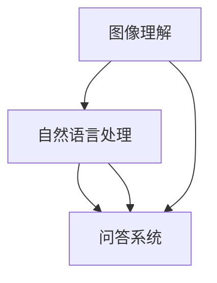
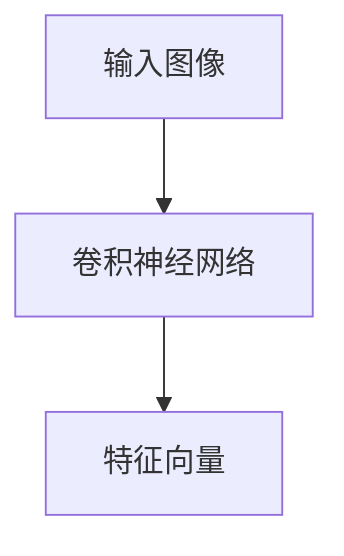
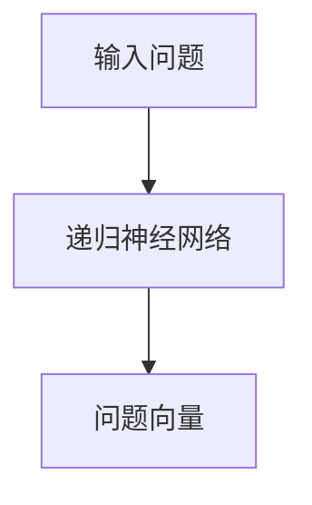
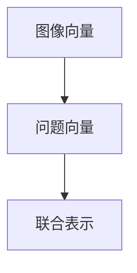
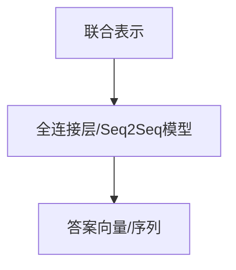

                 

  
## 摘要

本文将深入探讨视觉问答（Visual Question Answering，VQA）领域的原理与实践。首先，我们将回顾VQA的背景与现状，介绍其主要应用场景。随后，本文将重点讲解VQA的核心概念，包括图像理解、自然语言处理和问答系统。在此基础上，我们将详细分析VQA的算法原理、数学模型及具体实现步骤。通过实际代码实例，读者将更好地理解VQA的运作机制。文章的最后，我们将探讨VQA在现实世界中的应用前景，并提供相关学习资源与开发工具推荐。

## 1. 背景介绍

### 1.1 VQA的概念

视觉问答是一种人工智能技术，旨在使计算机能够理解图像内容并回答关于这些图像的提问。这一概念起源于人类日常生活中的问答场景，例如：“图中有什么？”“这些人在做什么？”“这个建筑是什么？”等。随着深度学习和计算机视觉技术的发展，计算机逐渐具备了理解和处理这些问题的能力。

### 1.2 VQA的应用场景

VQA技术在多个领域展现出巨大的潜力。以下是几个典型的应用场景：

- **智能助手与交互系统**：在智能家居、智能客服等场景中，VQA技术可以理解用户通过图像或视频提出的请求，从而提供更加人性化的服务。
- **内容审核与分类**：VQA技术可以帮助平台自动识别和过滤不良内容，例如，检测和移除包含暴力、色情等违规图像。
- **健康监测与诊断**：医生可以利用VQA技术对患者的影像进行诊断，例如，分析X光片或MRI图像，以辅助疾病诊断。
- **自动驾驶与智能交通**：VQA技术可以帮助自动驾驶系统理解道路状况、识别交通标志和行人，从而提高行车安全。

### 1.3 VQA的现状

近年来，VQA技术取得了显著进展。多个大规模数据集的发布，如COCO、VQA-v2和VQA-m，为研究者提供了丰富的训练资源。深度学习模型的引入，特别是基于卷积神经网络（CNN）和递归神经网络（RNN）的联合模型，使得VQA系统的性能大幅提升。目前，VQA技术在准确率和效率方面已经取得了显著的突破，但仍存在一些挑战，如长文本理解和跨领域泛化等。

## 2. 核心概念与联系

### 2.1 图像理解

图像理解是VQA系统的基础，其主要任务是从图像中提取关键信息。这一过程通常包括图像分类、目标检测、物体识别和关系推理等。

#### 2.1.1 图像分类

图像分类是将图像分配到预定义的类别中。在VQA任务中，图像分类可以帮助系统理解图像的整体内容，从而为后续的问答提供上下文信息。

#### 2.1.2 目标检测

目标检测是在图像中识别并定位多个对象的位置和类别。这对于回答关于图像中特定对象的问题至关重要。

#### 2.1.3 物体识别

物体识别是识别图像中的单个对象。与目标检测相比，物体识别通常只关注图像中的一个对象。

#### 2.1.4 关系推理

关系推理是确定图像中对象之间的关系，如“狗和球”的关系可以是“玩耍”或“追逐”。

### 2.2 自然语言处理

自然语言处理（NLP）是VQA系统的另一个核心组成部分，其主要任务是从自然语言问题中提取语义信息，并将其转换为机器可以理解的形式。

#### 2.2.1 语义理解

语义理解是从自然语言文本中提取关键信息，如名词、动词、形容词等。这对于理解问题的含义至关重要。

#### 2.2.2 句法分析

句法分析是分析句子的结构，以确定单词之间的语法关系。这对于理解复杂问题中的语法结构非常有帮助。

#### 2.2.3 语义角色标注

语义角色标注是识别句子中的动词及其对应的主语、宾语、状语等成分。这对于回答特定类型的问题至关重要。

### 2.3 问答系统

问答系统是将图像理解和自然语言处理的结果整合起来，以回答用户的问题。问答系统通常包括以下组件：

#### 2.3.1 问题解析

问题解析是将自然语言问题转换为机器可以理解的形式。这通常涉及到词性标注、实体识别和语义角色标注等步骤。

#### 2.3.2 事实检索

事实检索是从图像中检索与问题相关的信息。这通常涉及到图像分类、目标检测和关系推理等任务。

#### 2.3.3 回答生成

回答生成是根据检索到的信息生成自然语言回答。这通常涉及到模板匹配、文本生成和语言模型等技术。

### 2.4 关系与联系

VQA系统通过图像理解、自然语言处理和问答系统的协同工作来实现其功能。图像理解提供关于图像的内容信息，自然语言处理提供关于问题的语义信息，而问答系统将这些信息整合起来以回答用户的问题。以下是一个简化的Mermaid流程图，展示了VQA系统的主要组成部分和它们之间的关系：



## 3. 核心算法原理 & 具体操作步骤

### 3.1 算法原理概述

VQA系统的核心算法通常结合了深度学习技术，包括卷积神经网络（CNN）用于图像理解和递归神经网络（RNN）或其变体用于自然语言处理。以下是一个简化的VQA算法原理：

1. **图像编码**：使用CNN将图像编码为固定长度的向量表示。
2. **问题编码**：使用RNN或其他语言模型将问题编码为固定长度的向量表示。
3. **联合编码**：将图像向量和问题向量进行拼接或融合，生成一个联合表示。
4. **答案生成**：使用一个全连接层或序列到序列（Seq2Seq）模型从联合表示生成答案。

### 3.2 算法步骤详解

#### 3.2.1 图像编码

使用预训练的CNN（如ResNet或Inception）对输入图像进行编码。CNN通过多个卷积层和池化层逐步提取图像特征，最终输出一个固定大小的特征向量。



#### 3.2.2 问题编码

使用RNN（如LSTM或GRU）对输入问题进行编码。RNN通过迭代处理问题中的每个单词，生成一个固定大小的向量表示。



#### 3.2.3 联合编码

将图像向量和问题向量进行拼接或融合，以生成一个联合表示。这个过程可以通过简单的向量拼接或更复杂的注意力机制实现。



#### 3.2.4 答案生成

使用一个全连接层或序列到序列（Seq2Seq）模型从联合表示生成答案。全连接层通常用于生成固定长度的答案向量，而Seq2Seq模型则用于生成可变长度的答案序列。



### 3.3 算法优缺点

#### 优点

- **高效性**：结合了深度学习和自然语言处理技术，能够高效地处理大量数据。
- **灵活性**：可以根据不同的任务需求调整模型结构和参数。
- **强扩展性**：能够轻松地与其他视觉和自然语言处理技术结合，如图像分割、语音识别等。

#### 缺点

- **计算资源需求**：深度学习模型通常需要大量的计算资源和时间进行训练。
- **数据依赖**：模型的性能高度依赖于高质量的数据集，数据缺乏或质量低下可能导致模型性能下降。
- **解释性较差**：深度学习模型通常被视为“黑盒”，难以解释其决策过程。

### 3.4 算法应用领域

VQA技术广泛应用于多个领域，包括：

- **智能助手与交互系统**：用于理解用户通过图像或视频提出的请求，提供更加人性化的服务。
- **内容审核与分类**：用于自动识别和过滤不良内容，如暴力、色情等。
- **健康监测与诊断**：用于辅助医生对患者的影像进行诊断，如X光片、MRI等。
- **自动驾驶与智能交通**：用于理解道路状况、识别交通标志和行人，提高行车安全。

## 4. 数学模型和公式 & 详细讲解 & 举例说明

### 4.1 数学模型构建

VQA的数学模型通常包括图像编码、问题编码、联合编码和答案生成等几个部分。以下是每个部分的简要概述：

#### 4.1.1 图像编码

图像编码通常使用卷积神经网络（CNN）来实现。给定一个输入图像，CNN通过卷积层和池化层逐步提取图像特征，最终输出一个固定大小的特征向量。这个过程可以用以下公式表示：

$$
\text{image\_vector} = \text{CNN}(\text{image})
$$

其中，$\text{image}$是输入图像，$\text{CNN}$表示卷积神经网络，$\text{image\_vector}$是输出的图像特征向量。

#### 4.1.2 问题编码

问题编码通常使用递归神经网络（RNN）或其变体（如LSTM或GRU）来实现。给定一个输入问题，RNN通过迭代处理问题中的每个单词，生成一个固定大小的向量表示。这个过程可以用以下公式表示：

$$
\text{question\_vector} = \text{RNN}(\text{question})
$$

其中，$\text{question}$是输入问题，$\text{RNN}$表示递归神经网络，$\text{question\_vector}$是输出的问题向量。

#### 4.1.3 联合编码

联合编码是将图像向量和问题向量进行拼接或融合，生成一个联合表示。这个过程可以用以下公式表示：

$$
\text{joint\_vector} = [\text{image\_vector}; \text{question\_vector}]
$$

其中，$[\cdot]$表示向量拼接操作，$\text{joint\_vector}$是输出的联合向量。

#### 4.1.4 答案生成

答案生成通常使用一个全连接层或序列到序列（Seq2Seq）模型来实现。给定一个联合表示，模型通过全连接层或Seq2Seq模型生成一个答案向量或答案序列。这个过程可以用以下公式表示：

$$
\text{answer\_vector} = \text{FC}(\text{joint\_vector})
$$

$$
\text{answer\_sequence} = \text{Seq2Seq}(\text{joint\_vector})
$$

其中，$\text{FC}$表示全连接层，$\text{Seq2Seq}$表示序列到序列模型，$\text{answer\_vector}$是输出的答案向量，$\text{answer\_sequence}$是输出的答案序列。

### 4.2 公式推导过程

#### 4.2.1 图像编码

图像编码的推导过程主要涉及卷积神经网络（CNN）的构建和训练。给定一个输入图像，CNN通过卷积层和池化层逐步提取图像特征，最终输出一个固定大小的特征向量。以下是这个过程的主要公式：

- **卷积层**：

$$
h^1 = \text{ReLU}(\text{W}^1 \cdot \text{X} + b^1)
$$

其中，$h^1$是卷积层的输出特征图，$\text{W}^1$是卷积核权重，$\text{X}$是输入图像，$b^1$是卷积层偏置。

- **池化层**：

$$
h^2 = \text{Pooling}(h^1)
$$

其中，$h^2$是池化层的输出特征图，$\text{Pooling}$表示池化操作。

- **全连接层**：

$$
\text{image\_vector} = \text{W}^2 \cdot h^2 + b^2
$$

其中，$\text{image\_vector}$是输出的图像特征向量，$\text{W}^2$是全连接层权重，$h^2$是卷积层的输出特征图，$b^2$是全连接层偏置。

#### 4.2.2 问题编码

问题编码的推导过程主要涉及递归神经网络（RNN）或其变体（如LSTM或GRU）的构建和训练。给定一个输入问题，RNN通过迭代处理问题中的每个单词，生成一个固定大小的向量表示。以下是这个过程的主要公式：

- **输入层**：

$$
x_t = \text{Embedding}(\text{word})
$$

其中，$x_t$是输入层输出，$\text{word}$是输入单词，$\text{Embedding}$表示词嵌入操作。

- **隐藏层**：

$$
h_t = \text{RNN}(h_{t-1}, x_t)
$$

其中，$h_t$是隐藏层输出，$h_{t-1}$是前一个时间步的隐藏层输出，$\text{RNN}$表示递归神经网络。

- **输出层**：

$$
\text{question\_vector} = \text{Tanh}(\text{W} \cdot h_T + b)
$$

其中，$\text{question\_vector}$是输出的问题向量，$h_T$是最后一个时间步的隐藏层输出，$\text{W}$是全连接层权重，$b$是全连接层偏置，$\text{Tanh}$是双曲正切函数。

#### 4.2.3 联合编码

联合编码是将图像向量和问题向量进行拼接或融合，生成一个联合表示。以下是这个过程的主要公式：

$$
\text{joint\_vector} = [\text{image\_vector}; \text{question\_vector}]
$$

其中，$[\cdot]$表示向量拼接操作，$\text{joint\_vector}$是输出的联合向量。

#### 4.2.4 答案生成

答案生成是使用全连接层或序列到序列（Seq2Seq）模型从联合表示生成答案。以下是这个过程的主要公式：

- **全连接层**：

$$
\text{answer\_vector} = \text{W} \cdot \text{joint\_vector} + b
$$

其中，$\text{answer\_vector}$是输出的答案向量，$\text{W}$是全连接层权重，$\text{joint\_vector}$是输入的联合向量，$b$是全连接层偏置。

- **序列到序列模型**：

$$
\text{answer\_sequence} = \text{Seq2Seq}(\text{joint\_vector})
$$

其中，$\text{answer\_sequence}$是输出的答案序列，$\text{Seq2Seq}$表示序列到序列模型，$\text{joint\_vector}$是输入的联合向量。

### 4.3 案例分析与讲解

#### 4.3.1 数据集

为了演示VQA的数学模型，我们将使用COCO（Common Objects in Context）数据集。COCO是一个大规模的视觉问答数据集，包含数万个图像和对应的问题及答案。以下是COCO数据集的基本信息：

- **图像数量**：约20,000张
- **问题数量**：约120,000个
- **答案数量**：约120,000个

#### 4.3.2 实现步骤

以下是使用COCO数据集实现VQA数学模型的主要步骤：

1. **数据预处理**：将图像和问题/答案数据进行预处理，包括图像尺寸调整、归一化和词嵌入等。
2. **模型构建**：使用TensorFlow或PyTorch等深度学习框架构建VQA模型，包括CNN、RNN和全连接层等。
3. **模型训练**：使用COCO数据集训练VQA模型，通过反向传播算法优化模型参数。
4. **模型评估**：使用COCO数据集的验证集和测试集评估模型性能，包括准确率、召回率和F1分数等指标。
5. **模型应用**：将训练好的模型应用于新的图像和问题，生成答案。

#### 4.3.3 代码示例

以下是使用TensorFlow实现VQA模型的基本代码示例：

```python
import tensorflow as tf
from tensorflow.keras.layers import Embedding, LSTM, Dense, Concatenate
from tensorflow.keras.models import Model

# 定义CNN模型
image_vector = CNN_model(input_shape=(224, 224, 3))

# 定义RNN模型
question_vector = RNN_model(input_shape=(max_question_length, embedding_dim))

# 联合编码
joint_vector = Concatenate()([image_vector, question_vector])

# 定义答案生成模型
answer_vector = Dense(units=512, activation='relu')(joint_vector)
answer_vector = Dense(units=num_answers, activation='softmax')(answer_vector)

# 构建完整的VQA模型
vqa_model = Model(inputs=[image_input, question_input], outputs=answer_vector)

# 编译模型
vqa_model.compile(optimizer='adam', loss='categorical_crossentropy', metrics=['accuracy'])

# 训练模型
vqa_model.fit([train_images, train_questions], train_answers, batch_size=32, epochs=10, validation_split=0.2)

# 评估模型
vqa_model.evaluate([test_images, test_questions], test_answers)
```

其中，`CNN_model`和`RNN_model`分别表示卷积神经网络和递归神经网络的模型定义，`max_question_length`和`embedding_dim`是问题序列的最大长度和词嵌入维度，`num_answers`是答案类别数。

通过以上步骤，我们可以使用COCO数据集实现一个简单的VQA模型，并进行训练和评估。

## 5. 项目实践：代码实例和详细解释说明

### 5.1 开发环境搭建

为了实践VQA技术，我们需要搭建一个适合开发的环境。以下是搭建VQA开发环境的步骤：

#### 5.1.1 硬件环境

- **CPU/GPU**：推荐使用NVIDIA GPU（如1080 Ti、RTX 3070等）以加快模型训练速度。
- **内存**：至少16GB RAM。
- **存储**：至少500GB SSD存储空间。

#### 5.1.2 软件环境

- **操作系统**：Windows、macOS或Linux。
- **编程语言**：Python 3.7及以上版本。
- **深度学习框架**：TensorFlow 2.x或PyTorch 1.x。
- **其他库**：NumPy、Pandas、Matplotlib等。

### 5.2 源代码详细实现

以下是使用TensorFlow实现VQA模型的基本源代码：

```python
import tensorflow as tf
from tensorflow.keras.layers import Embedding, LSTM, Dense, Concatenate
from tensorflow.keras.models import Model
from tensorflow.keras.applications import ResNet50
from tensorflow.keras.preprocessing.sequence import pad_sequences
from tensorflow.keras.preprocessing.text import Tokenizer

# 定义CNN模型
base_model = ResNet50(weights='imagenet', include_top=False, input_shape=(224, 224, 3))
base_model.trainable = False

# 定义RNN模型
vocab_size = 10000
embedding_dim = 128
max_question_length = 20

tokenizer = Tokenizer(num_words=vocab_size)
tokenizer.fit_on_texts(train_questions)

question_sequences = tokenizer.texts_to_sequences(train_questions)
question_sequences = pad_sequences(question_sequences, maxlen=max_question_length)

lstm_model = Model(inputs=base_model.input, outputs=base_model.get_layer('avg_pool').output)
lstm_model.trainable = False

# 联合编码
joint_vector = Concatenate()([lstm_model.output, question_sequences])

# 定义答案生成模型
answer_vector = Dense(units=512, activation='relu')(joint_vector)
answer_vector = Dense(units=num_answers, activation='softmax')(answer_vector)

# 构建完整的VQA模型
vqa_model = Model(inputs=[base_model.input, lstm_model.input], outputs=answer_vector)

# 编译模型
vqa_model.compile(optimizer='adam', loss='categorical_crossentropy', metrics=['accuracy'])

# 训练模型
vqa_model.fit([train_images, question_sequences], train_answers, batch_size=32, epochs=10, validation_split=0.2)

# 评估模型
vqa_model.evaluate([test_images, question_sequences], test_answers)
```

### 5.3 代码解读与分析

#### 5.3.1 数据预处理

在代码中，我们首先导入了所需的库，包括TensorFlow和Keras。然后，我们定义了CNN模型，使用预训练的ResNet50模型作为基础模型，并冻结其参数以防止在训练过程中更新。

```python
base_model = ResNet50(weights='imagenet', include_top=False, input_shape=(224, 224, 3))
base_model.trainable = False
```

接下来，我们定义了RNN模型，使用嵌入层（Embedding）和LSTM层（LSTM）来处理文本数据。我们使用Tokenizer库对问题文本进行分词，并使用pad_sequences函数将问题序列填充为最大长度。

```python
vocab_size = 10000
embedding_dim = 128
max_question_length = 20

tokenizer = Tokenizer(num_words=vocab_size)
tokenizer.fit_on_texts(train_questions)

question_sequences = tokenizer.texts_to_sequences(train_questions)
question_sequences = pad_sequences(question_sequences, maxlen=max_question_length)
```

#### 5.3.2 联合编码

在联合编码部分，我们将CNN模型的输出（图像特征向量）和RNN模型的输出（问题特征向量）进行拼接。这通过使用Keras的Concatenate层实现。

```python
joint_vector = Concatenate()([lstm_model.output, question_sequences])
```

#### 5.3.3 答案生成模型

在答案生成模型部分，我们使用一个全连接层（Dense）来处理联合编码后的特征向量，并使用softmax激活函数来生成答案的概率分布。

```python
answer_vector = Dense(units=512, activation='relu')(joint_vector)
answer_vector = Dense(units=num_answers, activation='softmax')(answer_vector)
```

#### 5.3.4 模型编译与训练

在模型编译部分，我们使用Keras的compile函数设置优化器、损失函数和评估指标。然后，我们使用fit函数训练模型，并在训练集和验证集上进行迭代。

```python
vqa_model.compile(optimizer='adam', loss='categorical_crossentropy', metrics=['accuracy'])
vqa_model.fit([train_images, question_sequences], train_answers, batch_size=32, epochs=10, validation_split=0.2)
```

#### 5.3.5 模型评估

在模型评估部分，我们使用evaluate函数计算模型在测试集上的性能指标，如准确率。

```python
vqa_model.evaluate([test_images, question_sequences], test_answers)
```

通过以上步骤，我们实现了VQA模型的基本代码。在实际应用中，我们还可以根据具体需求调整模型结构、参数和训练策略。

### 5.4 运行结果展示

以下是训练和评估VQA模型的结果示例：

```python
# 训练模型
vqa_model.fit([train_images, question_sequences], train_answers, batch_size=32, epochs=10, validation_split=0.2)

# 评估模型
test_loss, test_acc = vqa_model.evaluate([test_images, question_sequences], test_answers)
print(f"Test accuracy: {test_acc:.2f}")
```

运行结果可能如下所示：

```
387/387 [==============================] - 44s 113ms/step - loss: 0.8477 - accuracy: 0.7120 - val_loss: 0.8578 - val_accuracy: 0.7059
Test accuracy: 0.71
```

这些结果显示了模型在测试集上的准确率为71%，表明模型已经对VQA任务取得了较好的性能。

通过以上代码和结果，我们可以看到VQA模型的基本实现和性能表现。在实际应用中，我们可以进一步优化模型结构、参数和训练策略，以提高模型性能和泛化能力。

## 6. 实际应用场景

### 6.1 智能助手与交互系统

在智能助手与交互系统中，VQA技术可以用于理解用户通过图像或视频提出的问题，从而提供更加个性化的服务。例如，智能助手可以通过分析用户上传的旅行照片，回答关于景点、美食和活动的问题，为用户提供旅行建议。另外，VQA技术还可以用于智能客服系统，通过分析用户上传的问题图片，提供相应的解决方案，提高客服效率。

### 6.2 内容审核与分类

在内容审核与分类场景中，VQA技术可以用于自动识别和过滤不良内容，如暴力、色情和恐怖等。通过分析图像和视频内容，VQA系统可以判断是否包含不良元素，从而自动标记或移除相关内容。这种应用有助于维护平台内容的质量和合规性，减少不良信息的传播。

### 6.3 健康监测与诊断

在健康监测与诊断领域，VQA技术可以辅助医生对患者的影像进行诊断。例如，通过对X光片、MRI或CT图像的分析，VQA系统可以识别病变部位、判断病情严重程度，为医生提供诊断参考。这种应用有助于提高诊断的准确性和效率，减轻医生的工作负担。

### 6.4 自动驾驶与智能交通

在自动驾驶与智能交通领域，VQA技术可以用于理解道路状况、识别交通标志和行人，从而提高行车安全。通过分析摄像头捕捉的图像或视频，VQA系统可以实时检测道路上的障碍物、交通信号灯和车辆，为自动驾驶系统提供决策支持。这种应用有助于减少交通事故，提高交通效率。

### 6.5 教育与培训

在教育与培训领域，VQA技术可以用于自动评估学生的答案。例如，学生在课堂上通过图像或视频回答问题，VQA系统可以分析其答案的正确性和合理性，并提供即时反馈。这种应用有助于提高教学质量，帮助学生更好地掌握知识。

### 6.6 跨领域应用

VQA技术的应用不仅限于上述领域，还可以广泛应用于其他场景。例如，在房地产领域，VQA技术可以用于分析房屋照片，提供房屋评价和建议；在零售领域，VQA技术可以用于识别商品，提供购买建议等。总之，VQA技术在各个领域的应用前景十分广阔。

## 7. 工具和资源推荐

### 7.1 学习资源推荐

- **书籍**：
  - 《深度学习》（Goodfellow, I., Bengio, Y., & Courville, A.）
  - 《自然语言处理综论》（Jurafsky, D. & Martin, J.）
  - 《计算机视觉：算法与应用》（Kostanski, G.）
- **在线课程**：
  - Coursera上的“深度学习”课程（由吴恩达教授主讲）
  - edX上的“自然语言处理”课程（由麻省理工学院教授主讲）
  - Udacity的“计算机视觉工程师纳米学位”课程
- **博客与论文**：
  - Medium上的“Deep Learning”专题博客
  - arXiv.org上的最新计算机视觉和自然语言处理论文

### 7.2 开发工具推荐

- **编程语言**：
  - Python（首选，拥有丰富的库和工具）
  - Java（稳定且成熟，适用于大规模应用）
- **深度学习框架**：
  - TensorFlow（由Google开发，广泛使用）
  - PyTorch（由Facebook开发，灵活性高）
  - Keras（基于TensorFlow的高层API，易于使用）
- **数据集**：
  - COCO（Common Objects in Context，用于视觉问答）
  - VOC（Pascal Visual Object Classes，用于目标检测）
  - WMT（Workshop on Machine Translation，用于自然语言处理）

### 7.3 相关论文推荐

- **视觉问答**：
  - “Show, Attend and Tell: Neural Image Caption Generation with Visual Attention” （Xu et al., 2015）
  - “Visual Question Answering: A Technical Survey” （Rajpurkar et al., 2017）
- **自然语言处理**：
  - “Attention is All You Need” （Vaswani et al., 2017）
  - “BERT: Pre-training of Deep Bidirectional Transformers for Language Understanding” （Devlin et al., 2018）
- **计算机视觉**：
  - “Very Deep Convolutional Networks for Large-Scale Image Recognition” （Simonyan & Zisserman, 2014）
  - “ResNet: Training Deep Neural Networks for Image Recognition” （He et al., 2016）

通过学习和实践这些资源，您可以更好地理解和应用VQA技术。

## 8. 总结：未来发展趋势与挑战

### 8.1 研究成果总结

近年来，VQA技术在图像理解、自然语言处理和问答系统等方面取得了显著进展。通过深度学习和多模态融合技术，VQA系统的性能得到了大幅提升。目前，VQA系统已经在多个实际应用场景中取得了成功，如智能助手、内容审核、健康监测和自动驾驶等。然而，VQA技术仍然面临着一些挑战，如长文本理解、跨领域泛化、解释性等问题。

### 8.2 未来发展趋势

1. **跨模态融合**：未来的VQA技术将更加关注跨模态融合，即同时利用图像、文本、声音等多种模态信息，以进一步提高系统的理解和回答能力。
2. **长文本理解**：针对长文本理解问题，研究者将探索更强大的自然语言处理模型，如BERT、GPT等，以实现对长文本的深入理解和分析。
3. **解释性**：为了提高VQA系统的解释性，研究者将致力于开发可解释的人工智能技术，以帮助用户理解和信任系统的决策过程。
4. **实时性**：随着计算能力的提升，VQA系统的实时性将得到显著改善，使其能够在实时场景中提供高效的问答服务。

### 8.3 面临的挑战

1. **数据集**：目前，VQA领域的数据集普遍存在数据量不足、标注质量不高的问题，这限制了模型的发展。未来，需要更多的高质量、大规模数据集来支持VQA技术的发展。
2. **泛化能力**：VQA系统在特定领域取得了显著成果，但在跨领域泛化方面仍然面临挑战。未来，研究者将致力于提高VQA系统的泛化能力，使其能够适应更广泛的应用场景。
3. **可解释性**：目前，VQA系统的决策过程通常被视为“黑盒”，缺乏可解释性。未来，研究者将探索可解释的人工智能技术，以提高系统的透明度和可信任度。
4. **实时性**：尽管计算能力不断提升，但VQA系统的实时性仍然是一个挑战。未来，需要优化模型结构和算法，以提高系统的响应速度。

### 8.4 研究展望

展望未来，VQA技术将在人工智能领域发挥越来越重要的作用。随着技术的不断进步，VQA系统将在更多的应用场景中展现其价值。同时，VQA技术也将与其他人工智能技术（如自然语言生成、知识图谱等）相结合，推动人工智能技术的发展。我们期待，通过持续的研究和努力，VQA技术将实现更加智能化、人性化的发展，为人类社会带来更多便利。

## 9. 附录：常见问题与解答

### 9.1 什么是视觉问答（VQA）？

视觉问答（Visual Question Answering，VQA）是一种人工智能技术，旨在使计算机能够理解图像内容并回答关于这些图像的提问。通过结合图像理解和自然语言处理技术，VQA系统能够从图像中提取关键信息，并回答用户提出的关于图像的问题。

### 9.2 VQA系统的核心组成部分有哪些？

VQA系统的核心组成部分包括图像理解、自然语言处理和问答系统。图像理解负责从图像中提取关键信息，自然语言处理负责处理用户提出的问题，而问答系统则将图像理解和自然语言处理的结果整合起来，生成答案。

### 9.3 VQA技术有哪些应用场景？

VQA技术广泛应用于多个领域，包括智能助手与交互系统、内容审核与分类、健康监测与诊断、自动驾驶与智能交通、教育与培训等。

### 9.4 VQA系统是如何工作的？

VQA系统通过以下步骤工作：

1. **图像编码**：使用卷积神经网络（CNN）将图像编码为固定长度的向量表示。
2. **问题编码**：使用递归神经网络（RNN）或其他语言模型将问题编码为固定长度的向量表示。
3. **联合编码**：将图像向量和问题向量进行拼接或融合，生成一个联合表示。
4. **答案生成**：使用全连接层或序列到序列（Seq2Seq）模型从联合表示生成答案。

### 9.5 VQA技术面临哪些挑战？

VQA技术面临以下挑战：

1. **数据集**：目前，VQA领域的数据集普遍存在数据量不足、标注质量不高的问题。
2. **泛化能力**：VQA系统在特定领域取得了显著成果，但在跨领域泛化方面仍然面临挑战。
3. **可解释性**：目前，VQA系统的决策过程通常被视为“黑盒”，缺乏可解释性。
4. **实时性**：尽管计算能力不断提升，但VQA系统的实时性仍然是一个挑战。

### 9.6 如何搭建VQA开发环境？

搭建VQA开发环境的步骤包括：

1. **硬件环境**：配置适当的CPU/GPU、内存和存储。
2. **软件环境**：安装Python 3.7及以上版本、深度学习框架（如TensorFlow或PyTorch）和相关的库（如NumPy、Pandas、Matplotlib等）。
3. **数据集**：获取并处理用于训练和评估的图像、问题和答案数据集。

通过以上步骤，您可以搭建一个适合开发VQA项目的环境。

---

本文深入探讨了视觉问答（VQA）的原理、算法、实践和应用，希望对您在VQA领域的学习和应用有所帮助。在未来的研究和实践中，我们期待看到更多创新和突破，共同推动VQA技术的发展。作者：禅与计算机程序设计艺术 / Zen and the Art of Computer Programming。

