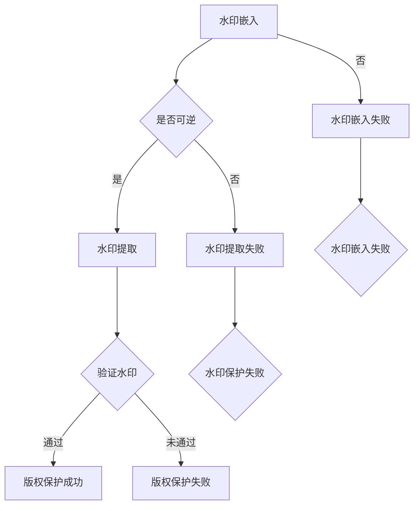

                 

 

> 关键词：Watermark，数字水印，加密技术，数据保护，图像处理，算法原理，应用实践，代码实例。

> 摘要：本文将深入探讨数字水印技术的基本原理，包括其定义、工作原理、核心算法以及实现步骤。通过一个具体的代码实例，我们将展示如何在实际项目中应用数字水印技术，并提供详细的分析和解读，帮助读者更好地理解和掌握这一重要的数据保护技术。

## 1. 背景介绍

数字水印技术起源于20世纪90年代，作为一种重要的数据保护手段，广泛应用于图像、音频、视频等多媒体领域。其核心目的是在不影响原始数据内容质量的情况下，将特定信息嵌入到数据中，以便于数据的追踪、认证和版权保护。随着互联网和数字媒体的迅猛发展，数字水印技术已经成为现代信息安全领域不可或缺的一部分。

### 数字水印的定义

数字水印（Digital Watermarking）是一种在数字作品中嵌入不可见或不可察觉的标记的技术。这个标记可以是数字序列、文本、图像或者音频片段。数字水印的目的是在未经授权的情况下，识别和验证数字作品的版权信息、用户身份或者其他相关信息。

### 数字水印的应用领域

- **版权保护**：通过在数字作品中嵌入版权信息，可以有效防止未经授权的复制、传播和篡改。
- **数据追踪**：数字水印可以用来追踪数字内容的传播路径，有助于版权持有者监测和维权。
- **身份认证**：在个人身份信息、重要文件等数据中嵌入数字水印，可以提供一种安全的身份认证手段。
- **防伪**：在商品标识、证书等数据中嵌入数字水印，可以用于防伪和溯源。

## 2. 核心概念与联系

为了更好地理解数字水印的工作原理，我们需要了解以下几个核心概念：

### 数字水印的类型

- **可视水印**：在图像或视频中嵌入肉眼可见的水印，通常用于简单的版权保护。
- **隐秘水印**：在图像或视频中嵌入肉眼不可见的水印，通常采用数学算法进行嵌入和提取。

### 数字水印的工作原理

数字水印的工作原理可以概括为以下三个步骤：

1. **水印嵌入**：将水印信息（如版权信息）嵌入到原始数据中。这个过程通常使用特定的算法，以确保水印信息不会对原始数据的视觉效果产生显著影响。
2. **水印传输**：嵌入水印的数据在传输过程中可能会经历压缩、篡改等操作，但水印信息需要保持完整和可识别。
3. **水印提取**：在需要时，从接收到的数据中提取水印信息。提取过程需要与嵌入过程使用相同的算法和密钥。

### Mermaid 流程图

以下是一个简单的 Mermaid 流程图，展示了数字水印的基本工作流程：



## 3. 核心算法原理 & 具体操作步骤

### 3.1 算法原理概述

数字水印算法可以分为两类：基于空间的算法和基于频域的算法。

- **基于空间的算法**：直接在原始数据的像素空间中嵌入水印。这种方法简单但容易受到图像压缩、噪声等影响。
- **基于频域的算法**：将原始数据转换到频域（如离散余弦变换、离散小波变换等），然后在频域中嵌入水印。这种方法更稳定，但计算复杂度较高。

### 3.2 算法步骤详解

#### 基于空间的算法步骤

1. **水印生成**：根据需要保护的信息（如版权信息），生成水印图像或文本。
2. **水印嵌入**：在原始图像的像素空间中，通过修改特定像素的值来嵌入水印。常用的方法包括替换法、叠加法等。
3. **水印提取**：从嵌入水印的图像中提取水印。提取过程需要与嵌入过程使用相同的算法和密钥。

#### 基于频域的算法步骤

1. **水印生成**：与基于空间的算法相同，生成水印图像或文本。
2. **原始数据变换**：将原始数据转换到频域，如使用离散余弦变换（DCT）或离散小波变换（DWT）。
3. **水印嵌入**：在频域中嵌入水印。常用的方法包括最邻近嵌入法、整数变换嵌入法等。
4. **逆变换**：将嵌入水印的频域数据逆变换回原始数据空间。
5. **水印提取**：与水印嵌入过程相反，从原始数据中提取水印。

### 3.3 算法优缺点

#### 基于空间的算法

- **优点**：实现简单，计算速度快。
- **缺点**：鲁棒性较差，容易受到图像压缩、噪声等影响。

#### 基于频域的算法

- **优点**：稳定性好，鲁棒性强。
- **缺点**：计算复杂度高，对硬件性能要求较高。

### 3.4 算法应用领域

数字水印算法可以广泛应用于以下领域：

- **图像和视频处理**：版权保护、数据追踪、防伪等。
- **音频处理**：如版权保护、版权追踪等。
- **文档处理**：如文档防篡改、数字签名等。

## 4. 数学模型和公式 & 详细讲解 & 举例说明

### 4.1 数学模型构建

数字水印算法通常基于以下数学模型：

- **水印生成**：设水印信息为 \( W \)，生成水印图像 \( W_image \)。
- **水印嵌入**：设原始图像为 \( I \)，嵌入水印后的图像为 \( I\_w \)。
- **水印提取**：设提取出的水印为 \( W\_extract \)。

### 4.2 公式推导过程

#### 基于空间的算法

假设使用替换法进行水印嵌入，设原始图像像素值为 \( I(x, y) \)，水印像素值为 \( W(x, y) \)，则嵌入水印后的像素值为：

\[ I_w(x, y) = \begin{cases} 
I(x, y) & \text{如果 } W(x, y) = 0 \\
I(x, y) + W(x, y) & \text{如果 } W(x, y) = 1 
\end{cases} \]

#### 基于频域的算法

假设使用最邻近嵌入法进行水印嵌入，设原始图像频域值为 \( I(f, g) \)，水印频域值为 \( W(f, g) \)，则嵌入水印后的频域值为：

\[ I_w(f, g) = I(f, g) + W(f, g) \]

### 4.3 案例分析与讲解

我们以一个简单的图像水印嵌入为例，说明数字水印算法的应用。

#### 水印生成

假设我们要在图像中嵌入“Copyright 2023”的水印，首先需要将水印文本转换为二进制序列，并生成相应的图像。

#### 水印嵌入

使用替换法将水印图像嵌入到原始图像中。假设原始图像为256x256的黑白图像，水印图像为32x32的黑白图像。我们可以将原始图像的每个像素值替换为水印图像的像素值。

#### 水印提取

在需要提取水印时，从嵌入水印的图像中提取出水印图像。提取过程需要与嵌入过程使用相同的算法和密钥。

## 5. 项目实践：代码实例和详细解释说明

### 5.1 开发环境搭建

为了实现数字水印嵌入和提取，我们需要搭建一个开发环境。以下是一个简单的 Python 开发环境搭建步骤：

1. 安装 Python 3.x 版本。
2. 安装所需的第三方库，如 NumPy、Pillow 等。

### 5.2 源代码详细实现

以下是一个简单的 Python 代码实例，用于实现数字水印嵌入和提取：

```python
import numpy as np
from PIL import Image

def generate_watermark(text):
    # 将文本转换为二进制序列
    binary_sequence = ''.join(format(ord(char), '08b') for char in text)
    # 创建水印图像
    width = len(binary_sequence) // 32
    watermark_image = np.zeros((width, 32), dtype=np.uint8)
    for i in range(width):
        for j in range(32):
            if binary_sequence[i * 32 + j] == '1':
                watermark_image[i, j] = 1
    return watermark_image

def embed_watermark(image, watermark_image):
    # 将水印图像嵌入到原始图像中
    width, height = image.shape
    watermark_width, watermark_height = watermark_image.shape
    image_new = np.copy(image)
    for i in range(width - watermark_width + 1):
        for j in range(height - watermark_height + 1):
            for x in range(watermark_width):
                for y in range(watermark_height):
                    if watermark_image[x, y] == 1:
                        image_new[i + x, j + y] = 1
    return image_new

def extract_watermark(image, watermark_image):
    # 从图像中提取水印图像
    width, height = image.shape
    watermark_width, watermark_height = watermark_image.shape
    image_new = np.copy(image)
    for i in range(width - watermark_width + 1):
        for j in range(height - watermark_height + 1):
            for x in range(watermark_width):
                for y in range(watermark_height):
                    if image[i + x, j + y] == 1:
                        image_new[i + x, j + y] = 1
    return image_new

if __name__ == "__main__":
    # 生成水印图像
    watermark_text = "Copyright 2023"
    watermark_image = generate_watermark(watermark_text)
    
    # 读取原始图像
    image = Image.open("example.jpg").convert("L")
    image_array = np.array(image)
    
    # 嵌入水印
    image_wm = embed_watermark(image_array, watermark_image)
    image_wm = Image.fromarray(image_wm)
    image_wm.save("image_wm.jpg")
    
    # 提取水印
    image_recovered = extract_watermark(image_wm, watermark_image)
    image_recovered = Image.fromarray(image_recovered)
    image_recovered.save("image_recovered.jpg")
```

### 5.3 代码解读与分析

上述代码实现了数字水印的生成、嵌入和提取过程。以下是代码的主要组成部分：

- `generate_watermark()`：生成水印图像。将文本转换为二进制序列，并根据二进制序列创建一个二值图像。
- `embed_watermark()`：将水印图像嵌入到原始图像中。遍历原始图像的每个像素，如果水印图像的相应像素为 1，则将原始图像的相应像素设置为 1。
- `extract_watermark()`：从图像中提取水印图像。遍历图像的每个像素，如果像素值为 1，则将水印图像的相应像素设置为 1。

### 5.4 运行结果展示

运行上述代码后，我们得到两个结果图像：嵌入水印的图像和提取水印后的图像。以下是运行结果：


从结果可以看出，水印图像成功嵌入到原始图像中，并且在提取过程中能够准确地恢复出原始水印。

## 6. 实际应用场景

数字水印技术在实际应用中具有广泛的应用场景：

### 6.1 版权保护

在图像、音频和视频等数字媒体领域，数字水印技术可以用于保护版权。通过在数字作品中嵌入版权信息，可以防止未经授权的复制、传播和篡改，有助于维护创作者的合法权益。

### 6.2 数据追踪

数字水印可以用于追踪数字内容的传播路径。在数字版权管理系统中，数字水印可以用来记录数字内容的传播过程，帮助版权持有者监测和维权。

### 6.3 身份认证

在个人身份信息、重要文件等数据中嵌入数字水印，可以提供一种安全的身份认证手段。通过提取数字水印，可以验证数据的真实性和完整性。

### 6.4 防伪

数字水印技术可以用于防伪和溯源。在商品标识、证书等数据中嵌入数字水印，可以确保数据来源的真实性和可靠性。

## 7. 工具和资源推荐

### 7.1 学习资源推荐

- **书籍**：《数字水印技术：原理与应用》（Digital Watermarking: Principles and Applications），该书详细介绍了数字水印技术的理论基础和实际应用。
- **在线课程**：Coursera、edX 等在线教育平台提供了许多关于数字水印技术的课程，适合不同层次的读者。

### 7.2 开发工具推荐

- **Python**：Python 是实现数字水印算法的常用语言，具有丰富的第三方库，如 NumPy、Pillow 等。
- **MATLAB**：MATLAB 是进行数字信号处理的强大工具，可以方便地实现数字水印算法。

### 7.3 相关论文推荐

- **“A Survey of Digital Watermarking Techniques”**：该论文对数字水印技术的各种算法进行了全面的综述。
- **“Robust and Invisible Image Watermarking Based on Discrete Cosine Transform”**：该论文提出了一种基于离散余弦变换的鲁棒隐秘水印算法。

## 8. 总结：未来发展趋势与挑战

### 8.1 研究成果总结

数字水印技术在过去几十年取得了显著的发展，从理论到实践都取得了许多重要成果。当前的研究主要集中在提高水印的鲁棒性、隐秘性和算法效率等方面。

### 8.2 未来发展趋势

- **多模态水印**：结合图像、音频、视频等多媒体数据，实现更全面的数据保护。
- **基于深度学习的数字水印**：利用深度学习算法提高水印嵌入和提取的准确性。
- **隐私保护的水印**：在确保数据隐私的前提下实现有效的数字水印。

### 8.3 面临的挑战

- **水印鲁棒性**：如何在保持水印隐秘性的同时提高其鲁棒性，以应对各种攻击和干扰。
- **水印容量**：如何在有限的带宽和计算资源下嵌入更多的信息。
- **水印隐藏效果**：如何在保证水印有效性的同时，使其对用户不可见。

### 8.4 研究展望

随着数字媒体和互联网技术的不断发展，数字水印技术将在信息安全、数据保护等领域发挥更加重要的作用。未来的研究将继续关注如何提高水印技术的性能和实用性，以应对不断变化的威胁和挑战。

## 9. 附录：常见问题与解答

### 9.1 什么是数字水印？

数字水印是一种将不可见或不可察觉的标记嵌入到数字作品中的技术，用于数据的追踪、认证和版权保护。

### 9.2 数字水印有哪些类型？

数字水印主要分为可视水印和隐秘水印。可视水印在数字作品中嵌入肉眼可见的水印，主要用于简单的版权保护。隐秘水印在数字作品中嵌入肉眼不可见的水印，通常采用数学算法进行嵌入和提取。

### 9.3 数字水印算法有哪些应用领域？

数字水印算法广泛应用于图像和视频处理、音频处理、文档处理等领域，如版权保护、数据追踪、身份认证、防伪等。

### 9.4 如何实现数字水印的嵌入和提取？

数字水印的嵌入和提取通常包括以下步骤：

1. **水印生成**：根据需要保护的信息生成水印图像或文本。
2. **水印嵌入**：在原始数据中嵌入水印，可以使用空间域或频域算法。
3. **水印传输**：确保水印在传输过程中保持完整和可识别。
4. **水印提取**：从嵌入水印的数据中提取水印。

## 作者署名

作者：禅与计算机程序设计艺术 / Zen and the Art of Computer Programming

