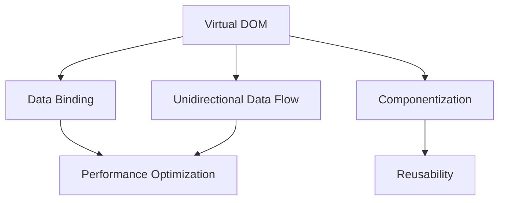

                 

在当今的软件开发领域，前端框架的选择至关重要。它们不仅影响着应用程序的性能和用户体验，还决定着开发效率和团队协作。本文旨在帮助读者深入理解不同前端框架的特点和适用场景，以便做出明智的选择。以下是本文的关键词：Web前端、框架选择、性能、用户体验、开发效率。

## 摘要

本文将探讨几种主流前端框架，包括React、Vue和Angular，分析它们在性能、开发效率和用户体验方面的优劣。我们将通过具体案例展示如何根据项目需求选择合适的前端框架，并展望未来前端框架的发展趋势。

### 1. 背景介绍

前端开发经历了从传统的HTML、CSS和JavaScript到现代框架的巨大变革。这些框架的出现极大地提高了开发效率和代码的可维护性。随着互联网应用的日益复杂，前端框架的选择变得越来越重要。

#### 1.1 历史背景

早期的Web应用主要是基于HTML、CSS和JavaScript的。这些技术虽然能够实现基本的交互功能，但在处理复杂应用时显得力不从心。于是，开发者开始寻求更高效、更模块化的解决方案，这催生了诸如jQuery这样的库。

随着时间的推移，单页面应用（Single Page Application，SPA）的概念逐渐流行起来，这需要更加强大的前端框架来处理复杂的用户界面和数据绑定。React、Vue和Angular等框架正是在这种背景下诞生的。

#### 1.2 现状与趋势

目前，React、Vue和Angular仍然是前端开发中最为流行和广泛使用的框架。每个框架都有其独特的优势和社区支持，这使得开发者可以根据项目需求和团队技能选择最合适的框架。

### 2. 核心概念与联系

在前端框架的选择中，需要理解几个核心概念，包括虚拟DOM、数据绑定、组件化和单向数据流等。下面是一个简化的Mermaid流程图，用于展示这些概念之间的关系。



#### 2.1 虚拟DOM（Virtual DOM）

虚拟DOM是一种在内存中构建和操作DOM节点的机制，它能够提高页面的渲染性能。通过将实际的DOM操作减少到最小，虚拟DOM能够显著减少浏览器渲染页面的时间。

#### 2.2 数据绑定（Data Binding）

数据绑定是前端框架的一项重要功能，它能够自动将数据变化反映到UI上，提高开发效率。React和Vue都实现了双向数据绑定，而Angular则采用单向数据流。

#### 2.3 组件化（Componentization）

组件化是一种将UI划分为可重用的组件的开发模式。React、Vue和Angular都支持组件化，这使得代码更加模块化和可维护。

#### 2.4 单向数据流（Unidirectional Data Flow）

单向数据流是一种数据传递的方式，它从父组件传递到子组件，而不是双向传递。这种模式有助于提高代码的可读性和可维护性。

### 3. 核心算法原理 & 具体操作步骤

#### 3.1 算法原理概述

前端框架的核心算法主要包括虚拟DOM的构建和更新、数据绑定的实现、组件的生命周期管理等。这些算法共同确保了应用程序的性能和用户体验。

#### 3.2 算法步骤详解

- **虚拟DOM的构建和更新**：前端框架通过构建一个虚拟的DOM树来表示实际的DOM结构。在数据变化时，框架会通过比较虚拟DOM和实际DOM的差异，只更新需要变化的节点，从而提高渲染性能。
- **数据绑定的实现**：数据绑定是通过监听数据变化并更新UI来实现的。React和Vue使用虚拟DOM来实现数据绑定，Angular则使用脏检查（Dirty Checking）机制。
- **组件的生命周期管理**：组件的生命周期包括创建、更新和销毁。前端框架提供了一系列生命周期钩子（Lifecycle Hooks）来处理这些状态。

#### 3.3 算法优缺点

- **虚拟DOM**：优点是减少实际DOM的操作，提高性能；缺点是构建虚拟DOM的开销较大。
- **数据绑定**：优点是提高开发效率，减少手动更新UI的工作量；缺点是可能会引入复杂性。
- **组件化**：优点是提高代码的可维护性和可重用性；缺点是组件间可能存在耦合。
- **单向数据流**：优点是提高代码的可读性和可维护性；缺点是可能增加数据传递的复杂性。

#### 3.4 算法应用领域

前端框架在Web应用、移动应用和桌面应用等领域都有广泛的应用。React因其灵活性和强大的社区支持，在单页面应用（SPA）中尤其受欢迎。Vue因其简洁和易用性，在中小型项目中得到了广泛应用。Angular则因其强大的功能和严格的架构，在企业级应用中占据一席之地。

### 4. 数学模型和公式 & 详细讲解 & 举例说明

前端框架的性能评估通常涉及多个数学模型和公式，以下是一个简要的概述。

#### 4.1 数学模型构建

- **响应时间模型**：\( T = f(n, p) \)，其中\( T \)是响应时间，\( n \)是虚拟DOM节点的数量，\( p \)是浏览器渲染性能。
- **数据绑定模型**：\( DB = f(d, u) \)，其中\( DB \)是数据绑定的复杂度，\( d \)是数据变化的频率，\( u \)是UI更新的频率。

#### 4.2 公式推导过程

- **虚拟DOM的构建时间**：\( T_{VDM} = O(n) \)，其中\( n \)是DOM节点的数量。
- **数据绑定的更新时间**：\( T_{DB} = O(d + u) \)，其中\( d \)是数据变化的频率，\( u \)是UI更新的频率。

#### 4.3 案例分析与讲解

假设一个应用中有1000个DOM节点，数据变化的频率为5次/秒，UI更新的频率为10次/秒。

- **虚拟DOM的构建时间**：\( T_{VDM} = O(1000) = 1000 \)毫秒。
- **数据绑定的更新时间**：\( T_{DB} = O(5 + 10) = 15 \)毫秒。

因此，该应用的响应时间可以估算为\( T = T_{VDM} + T_{DB} = 1000 + 15 = 1015 \)毫秒。

### 5. 项目实践：代码实例和详细解释说明

在本节中，我们将通过一个简单的React项目实例来展示如何搭建前端环境、编写代码以及运行和调试应用程序。

#### 5.1 开发环境搭建

1. 安装Node.js：从官网下载并安装Node.js，确保安装后命令行可以正常运行。
2. 安装Create React App：在命令行中运行以下命令：
   ```bash
   npx create-react-app my-app
   ```
3. 进入项目目录：
   ```bash
   cd my-app
   ```

#### 5.2 源代码详细实现

以下是`App.js`文件的简单示例：

```jsx
import React from 'react';

function App() {
  return (
    <div>
      <h1>Hello, World!</h1>
      <p>Welcome to React!</p>
    </div>
  );
}

export default App;
```

这是一个非常简单的React组件，它渲染了一个标题和一段文本。

#### 5.3 代码解读与分析

- **组件**：`App`是一个React组件，它接收`props`并返回一个React元素。
- **JSX**：使用JSX语法来描述UI结构，这是一种将JavaScript和HTML混合的语法。
- **React元素**：`<div>`、`<h1>`和`<p>`都是React元素，它们会被渲染到DOM中。

#### 5.4 运行结果展示

运行以下命令来启动开发服务器：

```bash
npm start
```

在浏览器中访问`http://localhost:3000`，应该看到以下输出：

```html
<div>
  <h1>Hello, World!</h1>
  <p>Welcome to React!</p>
</div>
```

### 6. 实际应用场景

前端框架在实际应用中扮演着关键角色，以下是一些常见的应用场景：

#### 6.1 单页面应用（SPA）

React、Vue和Angular都是构建SPA的优秀选择。SPA具有快速响应和流畅的用户体验，适用于电商、社交媒体和在线办公等应用。

#### 6.2 企业级应用

Angular因其严格的架构和丰富的工具支持，是企业级应用的首选框架。它适用于需要高安全性和复杂业务逻辑的大型企业应用。

#### 6.3 移动应用

React Native和Vue.js Mobile都是构建移动应用的优秀框架。它们允许开发者使用Web技术构建高性能的移动应用。

### 7. 未来应用展望

前端框架的发展将继续朝着更高效、更模块化和更灵活的方向前进。以下是一些未来应用展望：

#### 7.1 性能优化

随着硬件性能的提升，前端框架将更加注重性能优化，例如减少虚拟DOM的构建和更新开销。

#### 7.2 模块化与组件化

未来的前端框架将更加模块化和组件化，以支持更复杂的应用和更好的可维护性。

#### 7.3 人工智能集成

前端框架可能会与人工智能技术集成，以实现更智能的交互和个性化体验。

### 8. 工具和资源推荐

#### 8.1 学习资源推荐

- 《React.js 小书》：适合入门者，详细介绍了React的基本概念和用法。
- 《Vue.js权威指南》：全面介绍了Vue.js的核心概念和应用。
- 《Angular官方文档》：Angular的官方文档，包含详细的教程和API参考。

#### 8.2 开发工具推荐

- Visual Studio Code：一款强大的代码编辑器，适用于React、Vue和Angular开发。
- Webpack：一个模块打包工具，用于优化前端资源的加载和打包。

#### 8.3 相关论文推荐

- "Reactive Rendering": 介绍虚拟DOM和响应式渲染机制的论文。
- "Unidirectional Data Flow in Front-End Applications": 探讨单向数据流在Web应用中的应用。

### 9. 总结：未来发展趋势与挑战

前端框架在性能、开发效率和用户体验方面取得了显著进步，但未来仍面临一些挑战。性能优化、模块化和人工智能集成是未来发展的主要方向。同时，框架的标准化和生态系统的完善也是关键挑战。

### 9.1 研究成果总结

本文介绍了Web前端框架的选择，分析了React、Vue和Angular在性能、开发效率和用户体验方面的优劣，并展示了如何根据项目需求选择合适的前端框架。

### 9.2 未来发展趋势

前端框架将继续朝着更高效、更模块化和更智能的方向发展。虚拟DOM、数据绑定和组件化技术将更加成熟，人工智能集成将成为新的趋势。

### 9.3 面临的挑战

性能优化、框架的标准化和生态系统的完善是未来前端框架面临的挑战。开发者需要不断学习新技术，以应对日益复杂的开发需求。

### 9.4 研究展望

随着Web应用的不断演变，前端框架的研究将继续深入。未来的研究将重点关注性能优化、模块化和智能化，以提升开发效率和用户体验。

### 附录：常见问题与解答

**Q：如何选择合适的前端框架？**

A：选择前端框架时，应考虑项目需求、团队技能和开发效率。React适合构建复杂的应用，Vue适合中小型项目，Angular适合企业级应用。

**Q：前端框架与库有什么区别？**

A：前端框架是更全面的解决方案，包含组件、状态管理和路由等；而库则是特定功能的实现，如jQuery和lodash。

### 作者署名

作者：禅与计算机程序设计艺术 / Zen and the Art of Computer Programming

----------------------------------------------------------------

以上就是本文的完整内容，感谢您的阅读。希望本文能帮助您更好地理解前端框架的选择与应用。

