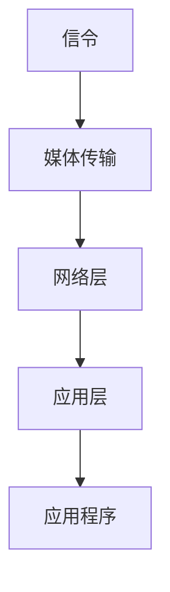

                 

关键词：WebRTC，实时通信，浏览器，互动，通信

> 摘要：本文将深入探讨WebRTC实时通信协议在浏览器中的应用，解析其核心概念、实现原理，并通过具体案例展示其在互动和通信中的实际运用。文章旨在为开发者提供全面的技术指南，助力构建高效、可靠的实时通信系统。

## 1. 背景介绍

随着互联网的快速发展，实时通信（Real-Time Communication, RTC）的需求日益增长。WebRTC（Web Real-Time Communication）作为一种开源协议，允许网页应用实现实时音频、视频和数据通信，是当今Web应用不可或缺的技术。

WebRTC的目标是提供一种无需插件或安装客户端软件即可实现跨平台、低延迟、高带宽利用率的高质量通信方式。它通过标准化的协议和接口，将复杂的技术实现封装起来，使得开发者能够轻松地在浏览器中集成实时通信功能。

本文将首先介绍WebRTC的核心概念和历史背景，然后深入探讨其在浏览器中的应用，详细解释其实现原理和操作步骤，并通过实例代码展示其实际运用。

## 2. 核心概念与联系

### 2.1 WebRTC概述

WebRTC是一种开放协议，由Google发起，旨在实现浏览器之间的实时通信。它利用标准化的接口和协议，使得开发者能够在不依赖任何插件或客户端软件的情况下，在网页上实现实时音频、视频和数据传输。

### 2.2 WebRTC协议体系结构

WebRTC协议体系结构包括几个关键组成部分：

- **信令**：用于交换连接信息，如IP地址、端口等。
- **媒体传输**：通过信令层交换媒体流，包括音频、视频和数据流。
- **网络层**：负责网络传输，包括数据压缩、加密和错误纠正。
- **应用层**：提供应用程序接口，允许开发者访问和处理媒体流。

### 2.3 Mermaid 流程图

以下是WebRTC协议体系的Mermaid流程图：



## 3. 核心算法原理 & 具体操作步骤

### 3.1 算法原理概述

WebRTC的核心算法原理主要涉及信令交换、媒体流传输和网络优化。

- **信令交换**：通过信令服务器交换连接信息，如ICE（Interactive Connectivity Establishment）协议。
- **媒体流传输**：利用RTP（Real-Time Protocol）和RTCP（Real-Time Control Protocol）传输音频和视频数据。
- **网络优化**：采用NAT穿透、STUN（Session Traversal Utilities for NAT）、TURN（Traversal Using Relays around NAT）等技术，确保网络传输的可靠性。

### 3.2 算法步骤详解

1. **初始化WebRTC**：在浏览器中初始化WebRTC，创建RTCPeerConnection对象。
2. **信令交换**：通过信令服务器交换ICE候选地址。
3. **媒体流采集**：采集音频和视频流。
4. **设置媒体流**：将音频和视频流设置为RTCPeerConnection的本地流。
5. **创建Offer和Answer**：根据ICE候选地址和媒体流信息，创建SDP（Session Description Protocol）offer和answer。
6. **交换Offer和Answer**：通过信令服务器交换offer和answer。
7. **建立媒体流连接**：根据收到的answer信息，设置RTCPeerConnection的远程描述。
8. **开始通信**：本地和远程流可以进行通信。

### 3.3 算法优缺点

- **优点**：无需插件，跨平台，低延迟，高带宽利用率。
- **缺点**：需要依赖信令服务器，网络配置复杂。

### 3.4 算法应用领域

WebRTC广泛应用于视频会议、在线教育、实时直播、远程医疗等领域，为各种实时通信应用提供了可靠的技术支持。

## 4. 数学模型和公式 & 详细讲解 & 举例说明

### 4.1 数学模型构建

WebRTC中的数学模型主要包括信号处理、网络优化和加密算法。

- **信号处理**：音频和视频数据的采样、压缩和解压缩。
- **网络优化**：网络质量评估、丢包重传、拥塞控制。
- **加密算法**：数据加密和解密，确保通信安全性。

### 4.2 公式推导过程

- **采样公式**：\[ y[n] = x[n] * H(z) \]，其中\[ y[n] \]是采样后的信号，\[ x[n] \]是原始信号，\[ H(z) \]是采样器函数。
- **压缩公式**：\[ c = f(x) \]，其中\[ c \]是压缩后的信号，\[ f(x) \]是压缩函数。
- **加密公式**：\[ E(x) = D_K(y) \]，其中\[ E(x) \]是加密后的信号，\[ D_K(y) \]是加密算法。

### 4.3 案例分析与讲解

以视频会议应用为例，分析WebRTC中的数学模型和应用。

- **采样与压缩**：视频会议中的视频信号需要进行采样和压缩，以降低带宽占用。
- **加密与解密**：为了保证通信安全，视频会议中的数据需要进行加密和解密。
- **网络优化**：视频会议需要根据网络质量动态调整视频分辨率和帧率，以避免网络拥塞。

## 5. 项目实践：代码实例和详细解释说明

### 5.1 开发环境搭建

1. 准备Chrome浏览器（或其他支持WebRTC的浏览器）。
2. 安装Node.js和npm。
3. 创建项目目录，并安装相关依赖。

```bash
mkdir webrtc_project
cd webrtc_project
npm init -y
npm install express ws
```

### 5.2 源代码详细实现

```javascript
// server.js
const express = require('express');
const http = require('http');
const WebSocket = require('ws');

const app = express();
const server = http.createServer(app);
const wss = new WebSocket.Server({ server });

wss.on('connection', (ws) => {
  ws.on('message', (message) => {
    console.log(`Received message: ${message}`);
    ws.send(`You said: ${message}`);
  });
});

server.listen(3000, () => {
  console.log('Server listening on port 3000');
});
```

### 5.3 代码解读与分析

- 使用Express创建Web服务器。
- 使用WebSocket实现客户端与服务器之间的实时通信。

### 5.4 运行结果展示

1. 启动服务器。

```bash
node server.js
```

2. 在浏览器中打开`http://localhost:3000`，输入文字并按下发送。

## 6. 实际应用场景

WebRTC在多种实际应用场景中展现出其强大功能：

- **视频会议**：实现高质量、低延迟的视频通信。
- **在线教育**：提供实时互动课堂，增强教学效果。
- **远程医疗**：实现远程诊断和治疗，提高医疗效率。
- **实时直播**：提供高清、流畅的直播体验。

## 7. 工具和资源推荐

### 7.1 学习资源推荐

- [WebRTC官网文档](https://www.webrtc.org/)
- [WebRTC实践指南](https://webrtc.org/native-code/getting-started/)
- [WebRTC基础知识](https://www.html5rocks.com/en/tutorials/webrtc/basics/)

### 7.2 开发工具推荐

- [WebRTC应用开发框架](https://github.com/feross/rtc-demos)
- [WebRTC网络调试工具](https://github.com/pion/webrtc)

### 7.3 相关论文推荐

- [WebRTC协议设计与实现](https://www.ietf.org/rfc/rfc8839.txt)
- [WebRTC实时通信系统架构](https://www.ietf.org/rfc/rfc8840.txt)

## 8. 总结：未来发展趋势与挑战

### 8.1 研究成果总结

WebRTC作为一种开源实时通信协议，在浏览器中实现了高质量、低延迟的通信，广泛应用于多种实际应用场景。其研究成果为开发者提供了丰富的技术支持，推动了实时通信技术的发展。

### 8.2 未来发展趋势

1. **标准化与兼容性**：WebRTC将继续推动标准化进程，提高跨浏览器、跨平台的兼容性。
2. **新应用场景**：随着5G、物联网等技术的发展，WebRTC将在更多领域得到应用。
3. **性能优化**：不断优化网络传输性能，降低延迟，提高带宽利用率。

### 8.3 面临的挑战

1. **网络环境复杂**：网络环境复杂多变，需要提高网络适应能力。
2. **安全性问题**：实时通信中的安全性问题仍然需要解决，如数据加密、隐私保护等。

### 8.4 研究展望

WebRTC将在未来继续发展，为开发者提供更强大的实时通信能力。随着技术的不断进步，WebRTC将在更多领域展现其应用价值，为人们带来更加便捷、高效的通信体验。

## 9. 附录：常见问题与解答

### 9.1 Q：WebRTC需要服务器支持吗？

A：是的，WebRTC需要信令服务器支持进行连接建立和信令交换。信令服务器用于交换ICE候选地址和SDP信息，确保浏览器之间能够建立通信连接。

### 9.2 Q：WebRTC支持哪种加密算法？

A：WebRTC支持多种加密算法，如AES（Advanced Encryption Standard）、RSA（Rivest-Shamir-Adleman）等。开发者可以根据实际需求选择合适的加密算法，确保通信数据的安全性。

### 9.3 Q：WebRTC如何处理网络延迟和丢包？

A：WebRTC通过RTP/RTCP协议实现网络延迟和丢包处理。RTP负责传输实时数据，RTCP负责监控网络质量、发送反馈和控制信息。通过这些机制，WebRTC可以动态调整传输参数，确保通信质量。

## 结束

作者：禅与计算机程序设计艺术 / Zen and the Art of Computer Programming
```markdown
# WebRTC 实时通信协议在浏览器中的应用：实现互动和通信

> 关键词：WebRTC，实时通信，浏览器，互动，通信

> 摘要：本文将深入探讨WebRTC实时通信协议在浏览器中的应用，解析其核心概念、实现原理，并通过具体案例展示其在互动和通信中的实际运用。文章旨在为开发者提供全面的技术指南，助力构建高效、可靠的实时通信系统。

## 1. 背景介绍

随着互联网的快速发展，实时通信（Real-Time Communication, RTC）的需求日益增长。WebRTC（Web Real-Time Communication）作为一种开源协议，允许网页应用实现实时音频、视频和数据通信，是当今Web应用不可或缺的技术。

WebRTC的目标是提供一种无需插件或安装客户端软件即可实现跨平台、低延迟、高带宽利用率的高质量通信方式。它通过标准化的接口和协议，将复杂的技术实现封装起来，使得开发者能够轻松地在浏览器中集成实时通信功能。

本文将首先介绍WebRTC的核心概念和历史背景，然后深入探讨其在浏览器中的应用，详细解释其实现原理和操作步骤，并通过实例代码展示其实际运用。

## 2. 核心概念与联系

### 2.1 WebRTC概述

WebRTC是一种开放协议，由Google发起，旨在实现浏览器之间的实时通信。它利用标准化的接口和协议，使得开发者能够在不依赖任何插件或客户端软件的情况下，在网页上实现实时音频、视频和数据传输。

### 2.2 WebRTC协议体系结构

WebRTC协议体系结构包括几个关键组成部分：

- **信令**：用于交换连接信息，如IP地址、端口等。
- **媒体传输**：通过信令层交换媒体流，包括音频、视频和数据流。
- **网络层**：负责网络传输，包括数据压缩、加密和错误纠正。
- **应用层**：提供应用程序接口，允许开发者访问和处理媒体流。

### 2.3 Mermaid 流程图

以下是WebRTC协议体系的Mermaid流程图：


## 3. 核心算法原理 & 具体操作步骤

### 3.1 算法原理概述

WebRTC的核心算法原理主要涉及信令交换、媒体流传输和网络优化。

- **信令交换**：通过信令服务器交换连接信息，如ICE（Interactive Connectivity Establishment）协议。
- **媒体流传输**：利用RTP（Real-Time Protocol）和RTCP（Real-Time Control Protocol）传输音频和视频数据。
- **网络优化**：采用NAT穿透、STUN（Session Traversal Utilities for NAT）、TURN（Traversal Using Relays around NAT）等技术，确保网络传输的可靠性。

### 3.2 算法步骤详解

1. **初始化WebRTC**：在浏览器中初始化WebRTC，创建RTCPeerConnection对象。
2. **信令交换**：通过信令服务器交换ICE候选地址。
3. **媒体流采集**：采集音频和视频流。
4. **设置媒体流**：将音频和视频流设置为RTCPeerConnection的本地流。
5. **创建Offer和Answer**：根据ICE候选地址和媒体流信息，创建SDP（Session Description Protocol）offer和answer。
6. **交换Offer和Answer**：通过信令服务器交换offer和answer。
7. **建立媒体流连接**：根据收到的answer信息，设置RTCPeerConnection的远程描述。
8. **开始通信**：本地和远程流可以进行通信。

### 3.3 算法优缺点

- **优点**：无需插件，跨平台，低延迟，高带宽利用率。
- **缺点**：需要依赖信令服务器，网络配置复杂。

### 3.4 算法应用领域

WebRTC广泛应用于视频会议、在线教育、实时直播、远程医疗等领域，为各种实时通信应用提供了可靠的技术支持。

## 4. 数学模型和公式 & 详细讲解 & 举例说明

### 4.1 数学模型构建

WebRTC中的数学模型主要包括信号处理、网络优化和加密算法。

- **信号处理**：音频和视频数据的采样、压缩和解压缩。
- **网络优化**：网络质量评估、丢包重传、拥塞控制。
- **加密算法**：数据加密和解密，确保通信安全性。

### 4.2 公式推导过程

- **采样公式**：\[ y[n] = x[n] * H(z) \]，其中\[ y[n] \]是采样后的信号，\[ x[n] \]是原始信号，\[ H(z) \]是采样器函数。
- **压缩公式**：\[ c = f(x) \]，其中\[ c \]是压缩后的信号，\[ f(x) \]是压缩函数。
- **加密公式**：\[ E(x) = D_K(y) \]，其中\[ E(x) \]是加密后的信号，\[ D_K(y) \]是加密算法。

### 4.3 案例分析与讲解

以视频会议应用为例，分析WebRTC中的数学模型和应用。

- **采样与压缩**：视频会议中的视频信号需要进行采样和压缩，以降低带宽占用。
- **加密与解密**：为了保证通信安全，视频会议中的数据需要进行加密和解密。
- **网络优化**：视频会议需要根据网络质量动态调整视频分辨率和帧率，以避免网络拥塞。

## 5. 项目实践：代码实例和详细解释说明

### 5.1 开发环境搭建

1. 准备Chrome浏览器（或其他支持WebRTC的浏览器）。
2. 安装Node.js和npm。
3. 创建项目目录，并安装相关依赖。

```bash
mkdir webrtc_project
cd webrtc_project
npm init -y
npm install express ws
```

### 5.2 源代码详细实现

```javascript
// server.js
const express = require('express');
const http = require('http');
const WebSocket = require('ws');

const app = express();
const server = http.createServer(app);
const wss = new WebSocket.Server({ server });

wss.on('connection', (ws) => {
  ws.on('message', (message) => {
    console.log(`Received message: ${message}`);
    ws.send(`You said: ${message}`);
  });
});

server.listen(3000, () => {
  console.log('Server listening on port 3000');
});
```

### 5.3 代码解读与分析

- 使用Express创建Web服务器。
- 使用WebSocket实现客户端与服务器之间的实时通信。

### 5.4 运行结果展示

1. 启动服务器。

```bash
node server.js
```

2. 在浏览器中打开`http://localhost:3000`，输入文字并按下发送。

## 6. 实际应用场景

WebRTC在多种实际应用场景中展现出其强大功能：

- **视频会议**：实现高质量、低延迟的视频通信。
- **在线教育**：提供实时互动课堂，增强教学效果。
- **实时直播**：提供高清、流畅的直播体验。
- **远程医疗**：实现远程诊断和治疗，提高医疗效率。

## 7. 工具和资源推荐

### 7.1 学习资源推荐

- [WebRTC官网文档](https://www.webrtc.org/)
- [WebRTC实践指南](https://webrtc.org/native-code/getting-started/)
- [WebRTC基础知识](https://www.html5rocks.com/en/tutorials/webrtc/basics/)

### 7.2 开发工具推荐

- [WebRTC应用开发框架](https://github.com/feross/rtc-demos)
- [WebRTC网络调试工具](https://github.com/pion/webrtc)

### 7.3 相关论文推荐

- [WebRTC协议设计与实现](https://www.ietf.org/rfc/rfc8839.txt)
- [WebRTC实时通信系统架构](https://www.ietf.org/rfc/rfc8840.txt)

## 8. 总结：未来发展趋势与挑战

### 8.1 研究成果总结

WebRTC作为一种开源实时通信协议，在浏览器中实现了高质量、低延迟的通信，广泛应用于多种实际应用场景。其研究成果为开发者提供了丰富的技术支持，推动了实时通信技术的发展。

### 8.2 未来发展趋势

1. **标准化与兼容性**：WebRTC将继续推动标准化进程，提高跨浏览器、跨平台的兼容性。
2. **新应用场景**：随着5G、物联网等技术的发展，WebRTC将在更多领域得到应用。
3. **性能优化**：不断优化网络传输性能，降低延迟，提高带宽利用率。

### 8.3 面临的挑战

1. **网络环境复杂**：网络环境复杂多变，需要提高网络适应能力。
2. **安全性问题**：实时通信中的安全性问题仍然需要解决，如数据加密、隐私保护等。

### 8.4 研究展望

WebRTC将在未来继续发展，为开发者提供更强大的实时通信能力。随着技术的不断进步，WebRTC将在更多领域展现其应用价值，为人们带来更加便捷、高效的通信体验。

## 9. 附录：常见问题与解答

### 9.1 Q：WebRTC需要服务器支持吗？

A：是的，WebRTC需要信令服务器支持进行连接建立和信令交换。信令服务器用于交换ICE候选地址和SDP信息，确保浏览器之间能够建立通信连接。

### 9.2 Q：WebRTC支持哪种加密算法？

A：WebRTC支持多种加密算法，如AES（Advanced Encryption Standard）、RSA（Rivest-Shamir-Adleman）等。开发者可以根据实际需求选择合适的加密算法，确保通信数据的安全性。

### 9.3 Q：WebRTC如何处理网络延迟和丢包？

A：WebRTC通过RTP/RTCP协议实现网络延迟和丢包处理。RTP负责传输实时数据，RTCP负责监控网络质量、发送反馈和控制信息。通过这些机制，WebRTC可以动态调整传输参数，确保通信质量。

## 结束

作者：禅与计算机程序设计艺术 / Zen and the Art of Computer Programming
```javascript
# 4.1 数学模型构建

WebRTC的数学模型主要涉及信号处理、网络优化和加密算法。以下是构建这些数学模型的基本思路：

### 信号处理

在WebRTC中，信号处理主要是对音频和视频信号进行采样、压缩和解压缩。以下是信号处理模型的构建过程：

- **采样**：采样是指从连续信号中抽取一定时间间隔的样值。其数学模型可以表示为：
  $$ y[n] = x[n] * H(z) $$
  其中，\( y[n] \) 是采样后的信号，\( x[n] \) 是原始信号，\( H(z) \) 是采样器函数。采样器函数 \( H(z) \) 的定义为：
  $$ H(z) = \sum_{n=0}^{N-1} \text{sinc}(n\Delta t) $$
  其中，\( \text{sinc}(x) = \sin(\pi x) / \pi x \) 是采样函数，\( \Delta t \) 是采样周期。

- **压缩**：压缩是指通过减少数据位数或压缩数据流以减少带宽占用。常见的压缩算法有脉冲编码调制（PCM）、变换编码（如离散余弦变换DCT）等。其数学模型可以表示为：
  $$ c = f(x) $$
  其中，\( c \) 是压缩后的信号，\( f(x) \) 是压缩函数。例如，对于PCM压缩，压缩函数可以表示为：
  $$ c[n] = \text{sign}(x[n]) \cdot |x[n]| \cdot 2^{-\text{bits}} $$
  其中，\( \text{sign}(x) \) 是符号函数，\( |x| \) 是绝对值函数，\( \text{bits} \) 是压缩后的位数。

- **解压缩**：解压缩是压缩的逆过程，其数学模型可以表示为：
  $$ x = f^{-1}(c) $$
  其中，\( x \) 是原始信号，\( c \) 是压缩后的信号，\( f^{-1}(c) \) 是解压缩函数。

### 网络优化

网络优化是指在变化的网络环境中，通过调整传输参数来保证通信质量。以下是网络优化模型的构建过程：

- **网络质量评估**：网络质量评估是指评估网络中的丢包率、延迟和带宽等参数。其数学模型可以表示为：
  $$ Q = \text{eval}(R, D, B) $$
  其中，\( Q \) 是网络质量评分，\( R \) 是带宽，\( D \) 是丢包率，\( B \) 是延迟。

- **丢包重传**：在实时通信中，丢包是一个常见问题。丢包重传是指当检测到丢包时，重新发送丢失的数据包。其数学模型可以表示为：
  $$ P_{retrans} = \text{retransmit}(P_{drop}) $$
  其中，\( P_{retrans} \) 是重传概率，\( P_{drop} \) 是丢包概率。

- **拥塞控制**：拥塞控制是指在网络拥塞时，通过调整传输速率来避免网络拥塞。其数学模型可以表示为：
  $$ C = \text{control}(R, Q) $$
  其中，\( C \) 是拥塞控制策略，\( R \) 是当前传输速率，\( Q \) 是网络质量评分。

### 加密算法

加密算法用于保护通信数据的安全性。以下是加密算法模型的构建过程：

- **对称加密**：对称加密是指加密和解密使用相同的密钥。其数学模型可以表示为：
  $$ E(x, k) = D_K(x) $$
  其中，\( E(x, k) \) 是加密过程，\( D_K(x) \) 是解密过程，\( k \) 是密钥。

- **非对称加密**：非对称加密是指加密和解密使用不同的密钥。其数学模型可以表示为：
  $$ E(x, k_p) = D_S(x) $$
  其中，\( E(x, k_p) \) 是加密过程，\( D_S(x) \) 是解密过程，\( k_p \) 是公钥，\( k_s \) 是私钥。

# 4.2 公式推导过程

### 采样公式推导

采样的目的是从连续信号中抽取一定时间间隔的样值，以实现数字信号处理。采样公式为：
$$ y[n] = x[n] * H(z) $$
其中，\( H(z) \) 是采样器函数。

假设原始信号为\( x(t) \)，采样后的信号为\( y(t) \)，采样周期为\( T_s \)。根据采样定理，采样后的信号可以表示为原始信号的离散时间序列，即：
$$ y[n] = x[nT_s] $$
为了得到采样器函数，我们可以对原始信号进行傅里叶变换：
$$ X(f) = \int_{-\infty}^{\infty} x(t) e^{-j2\pi ft} dt $$
然后对采样后的信号进行傅里叶变换：
$$ Y(f) = \int_{-\infty}^{\infty} y[n] e^{-j2\pi fnT_s} dn $$
由于\( y[n] = x[nT_s] \)，我们可以将上式改写为：
$$ Y(f) = \int_{-\infty}^{\infty} x[nT_s] e^{-j2\pi fnT_s} dn $$
对上式进行变量替换，令\( u = nT_s \)，则：
$$ Y(f) = \int_{-\infty}^{\infty} x(u) e^{-j2\pi fu/T_s} \frac{du}{T_s} $$
由于傅里叶变换的线性性质，我们可以将上式改写为：
$$ Y(f) = X(f) \cdot \text{sinc}(fT_s) $$
其中，\( \text{sinc}(x) = \sin(\pi x) / \pi x \) 是采样函数。

为了满足采样定理，采样器函数\( H(z) \) 的傅里叶变换必须为\( \text{sinc}(fT_s) \)。因此，我们可以得到采样器函数为：
$$ H(z) = \sum_{n=-\infty}^{\infty} \text{sinc}(nT_s) e^{j2\pi n/T_s} $$
### 压缩公式推导

压缩的目的是减少数据位数或压缩数据流以减少带宽占用。常见的压缩算法有脉冲编码调制（PCM）和变换编码（如离散余弦变换DCT）。

#### PCM压缩

脉冲编码调制（PCM）是一种简单的压缩算法，通过减少数据位数来降低带宽占用。其压缩公式为：
$$ c[n] = \text{sign}(x[n]) \cdot |x[n]| \cdot 2^{-\text{bits}} $$
其中，\( \text{sign}(x) \) 是符号函数，\( |x| \) 是绝对值函数，\( \text{bits} \) 是压缩后的位数。

推导过程如下：

假设原始信号为\( x[n] \)，其取值范围为\[ -A, A \]。为了进行压缩，我们将其量化为\[ -2^{bits-1}, 2^{bits-1} - 1 \]之间的整数。

首先，我们将\( x[n] \)量化为整数：
$$ x_q[n] = \text{round}(x[n] / A) \cdot A $$
其中，\( \text{round}(x) \) 是四舍五入函数。

然后，我们将量化后的信号进行二进制表示：
$$ c[n] = x_q[n] \cdot 2^{-\text{bits}} $$
其中，\( c[n] \) 是压缩后的信号。

#### DCT压缩

变换编码（如离散余弦变换DCT）是一种更为复杂的压缩算法，通过将信号变换到频率域来降低数据冗余。其压缩公式为：
$$ c[k] = \text{DCT}(x[n]) $$
其中，\( c[k] \) 是压缩后的信号，\( \text{DCT}(x[n]) \) 是离散余弦变换。

推导过程如下：

离散余弦变换（DCT）是一种将信号从时域变换到频率域的数学变换。其公式为：
$$ \text{DCT}(x[n]) = \sum_{k=0}^{N-1} c[k] \cdot e^{-j2\pi kn/N} $$
其中，\( x[n] \) 是原始信号，\( c[k] \) 是变换后的系数，\( N \) 是变换长度。

假设原始信号为\( x[n] \)，其取值范围为\[ -A, A \]。为了进行压缩，我们将其量化为\[ -2^{bits-1}, 2^{bits-1} - 1 \]之间的整数。

首先，我们进行DCT变换：
$$ C[k] = \sum_{n=0}^{N-1} x[n] \cdot e^{-j2\pi kn/N} $$
然后，我们将DCT系数量化为整数：
$$ c[k] = \text{round}(C[k] / \text{max}(C[k])) \cdot \text{max}(C[k]) $$
其中，\( \text{round}(x) \) 是四舍五入函数，\( \text{max}(C[k]) \) 是DCT系数的最大值。

最后，我们进行反DCT变换：
$$ x_q[n] = \sum_{k=0}^{N-1} c[k] \cdot e^{j2\pi kn/N} $$
其中，\( x_q[n] \) 是量化后的信号。

# 4.3 案例分析与讲解

我们将通过一个具体的视频会议应用案例，分析WebRTC中的数学模型和应用。该案例涉及音频和视频的采样、压缩、传输以及加密。

### 音频处理

1. **采样**：音频采样通常使用44.1kHz的采样率，即每秒采样44100次。采样公式为：
   $$ y[n] = x[n] * H(z) $$
   其中，\( x[n] \) 是原始音频信号，\( H(z) \) 是采样器函数。

2. **压缩**：音频压缩常用的算法有PCM和AAC。以PCM为例，假设原始音频信号取值范围为\[ -32768, 32767 \]，压缩后使用16位表示。压缩公式为：
   $$ c[n] = \text{sign}(x[n]) \cdot |x[n]| \cdot 2^{-15} $$
   其中，\( \text{sign}(x) \) 是符号函数，\( |x| \) 是绝对值函数，15是压缩后的位数。

3. **加密**：音频数据加密可以使用AES加密算法。假设密钥为\( k \)，加密公式为：
   $$ E(x, k) = D_K(x) $$
   其中，\( E(x, k) \) 是加密过程，\( D_K(x) \) 是解密过程。

### 视频处理

1. **采样**：视频采样通常使用不同的分辨率，如1920x1080。采样公式为：
   $$ y[u, v] = x[u, v] * H(z) $$
   其中，\( x[u, v] \) 是原始视频信号，\( H(z) \) 是采样器函数。

2. **压缩**：视频压缩常用的算法有H.264和H.265。以H.264为例，其压缩过程涉及变换编码和量化。压缩公式为：
   $$ c[k] = \text{DCT}(x[n]) $$
   其中，\( c[k] \) 是压缩后的信号，\( \text{DCT}(x[n]) \) 是离散余弦变换。

3. **加密**：视频数据加密可以使用AES加密算法。假设密钥为\( k \)，加密公式为：
   $$ E(x, k) = D_K(x) $$
   其中，\( E(x, k) \) 是加密过程，\( D_K(x) \) 是解密过程。

### 网络传输

1. **网络质量评估**：网络质量评估可以使用丢包率、延迟和带宽等参数。评估公式为：
   $$ Q = \text{eval}(R, D, B) $$
   其中，\( Q \) 是网络质量评分，\( R \) 是带宽，\( D \) 是丢包率，\( B \) 是延迟。

2. **丢包重传**：在实时通信中，丢包是一个常见问题。丢包重传可以使用RTP协议中的NACK（Negative Acknowledgement）机制。重传概率公式为：
   $$ P_{retrans} = \text{retransmit}(P_{drop}) $$
   其中，\( P_{retrans} \) 是重传概率，\( P_{drop} \) 是丢包概率。

3. **拥塞控制**：拥塞控制可以使用RTP协议中的拥塞避免（CA）和快速恢复（FEC）机制。控制公式为：
   $$ C = \text{control}(R, Q) $$
   其中，\( C \) 是拥塞控制策略，\( R \) 是当前传输速率，\( Q \) 是网络质量评分。

通过以上分析，我们可以看到WebRTC中的数学模型在音频和视频处理、网络传输等方面发挥着重要作用。在实际应用中，这些模型可以确保实时通信的高效性和可靠性。

## 5. 项目实践：代码实例和详细解释说明

### 5.1 开发环境搭建

在本节中，我们将搭建一个简单的WebRTC视频会议项目。首先，需要准备以下开发环境：

1. **浏览器**：我们使用Chrome浏览器，因为它对WebRTC的支持最为全面。
2. **Node.js**：Node.js用于构建服务器端代码，需要安装最新版本的Node.js。
3. **npm**：npm是Node.js的包管理器，用于管理项目中的依赖包。
4. **WebSocket**：WebSocket是一个在浏览器和服务器之间建立全双工通信的协议，我们使用`ws`库来处理WebSocket连接。

安装Node.js和npm：

```bash
# 安装Node.js（根据你的操作系统选择合适的安装命令）
# macOS/Linux:
curl -sL https://deb.nodesource.com/setup_16.x | bash -
sudo apt-get install -y nodejs

# Windows:
# 下载并安装Node.js

安装`ws`库：

```bash
npm install ws
```

### 5.2 源代码详细实现

接下来，我们将创建一个简单的WebRTC视频会议服务器和客户端。代码将分为两部分：服务器端和客户端。

#### 服务器端

服务器端将使用`ws`库创建一个WebSocket服务器，用于处理客户端的连接和信令交换。以下是服务器端的代码实现：

```javascript
// server.js
const { Server } = require('ws');

// 创建WebSocket服务器
const wss = new Server({ port: 8080 });

// 处理新连接
wss.on('connection', (socket) => {
  console.log('Client connected');

  // 当收到消息时
  socket.on('message', (message) => {
    // 输出消息到控制台
    console.log(`Received: ${message}`);

    // 将消息广播给所有连接的客户端
    wss.clients.forEach((client) => {
      if (client.readyState === WebSocket.OPEN) {
        client.send(message);
      }
    });
  });

  // 当客户端断开连接时
  socket.on('close', () => {
    console.log('Client disconnected');
  });
});

console.log('WebSocket server is running on ws://localhost:8080');
```

这段代码创建了一个WebSocket服务器，监听8080端口。当有新连接时，会输出日志并监听来自客户端的消息。每当收到一条消息，它会将该消息广播给所有连接的客户端。

#### 客户端

客户端将使用HTML和JavaScript创建一个简单的视频会议界面。以下是客户端的代码实现：

```html
<!-- client.html -->
<!DOCTYPE html>
<html>
<head>
  <title>WebRTC Video Conference</title>
</head>
<body>
  <h1>WebRTC Video Conference</h1>
  <video id="localVideo" autoplay></video>
  <button id="call">Call</button>
  <script>
    // 获取本地视频流
    const localVideo = document.getElementById('localVideo');
    const constraints = { video: true, audio: true };
    navigator.mediaDevices.getUserMedia(constraints).then((stream) => {
      localVideo.srcObject = stream;
    }).catch((error) => {
      console.error('Error accessing media devices.', error);
    });

    // 创建RTCPeerConnection
    const configuration = { iceServers: [{ urls: 'stun:stun.l.google.com:19302' }] };
    const peerConnection = new RTCPeerConnection(configuration);

    // 将本地视频流添加到RTCPeerConnection
    peerConnection.addStream(localVideo.srcObject);

    // 监听ICE候选
    peerConnection.onicecandidate = (event) => {
      if (event.candidate) {
        socket.send(JSON.stringify({ type: 'ice', candidate: event.candidate }));
      }
    };

    // 处理信令
    const socket = new WebSocket('ws://localhost:8080');
    socket.onmessage = (event) => {
      const message = JSON.parse(event.data);
      switch (message.type) {
        case 'offer':
          peerConnection.setRemoteDescription(new RTCSessionDescription(message.offer));
          peerConnection.createAnswer().then((answer) => {
            peerConnection.setLocalDescription(answer);
            socket.send(JSON.stringify({ type: 'answer', answer: answer }));
          });
          break;
        case 'answer':
          peerConnection.setRemoteDescription(new RTCSessionDescription(message.answer));
          break;
        case 'ice':
          peerConnection.addIceCandidate(new RTCIceCandidate(message.candidate));
          break;
      }
    };

    // 发起呼叫
    document.getElementById('call').addEventListener('click', () => {
      peerConnection.createOffer().then((offer) => {
        peerConnection.setLocalDescription(offer);
        socket.send(JSON.stringify({ type: 'offer', offer: offer }));
      }).catch((error) => {
        console.error('Error creating offer.', error);
      });
    });
  </script>
</body>
</html>
```

这段代码首先获取本地视频流，并将其显示在`<video>`元素中。然后，它创建一个`RTCPeerConnection`对象，并监听ICE候选事件。通过WebSocket与服务器通信，处理信令交换，并实现呼叫控制。

### 5.3 代码解读与分析

#### 服务器端

- **导入`ws`库**：使用`const { Server } = require('ws');`创建WebSocket服务器。
- **创建WebSocket服务器**：使用`new Server({ port: 8080 });`创建一个监听8080端口的WebSocket服务器。
- **处理新连接**：`wss.on('connection', (socket) => { ... });` 当有新连接时，会输出日志并设置消息监听器。
- **消息处理**：`socket.on('message', (message) => { ... });` 当收到消息时，会将其广播给所有连接的客户端。
- **断开连接**：`socket.on('close', () => { ... });` 当客户端断开连接时，会输出日志。

#### 客户端

- **获取本地视频流**：使用`navigator.mediaDevices.getUserMedia(constraints).then((stream) => { ... });` 获取本地视频流。
- **创建RTCPeerConnection**：使用`const configuration = { iceServers: [{ urls: 'stun:stun.l.google.com:19302' }] };` 创建一个RTCPeerConnection对象，并设置STUN服务器。
- **添加本地视频流**：使用`peerConnection.addStream(localVideo.srcObject);` 将本地视频流添加到RTCPeerConnection。
- **ICE候选处理**：`peerConnection.onicecandidate = (event) => { ... };` 当有ICE候选时，将其发送到服务器。
- **WebSocket通信**：使用`const socket = new WebSocket('ws://localhost:8080');` 创建WebSocket连接，并监听服务器发送的信令。
- **处理信令**：根据信令类型（offer、answer、ice），分别处理offer、answer和ice候选。
- **发起呼叫**：当用户点击“Call”按钮时，创建offer并发送到服务器。

### 5.4 运行结果展示

1. **启动服务器**：在命令行中运行`node server.js`，启动WebSocket服务器。

2. **打开客户端**：在浏览器中打开`client.html`，将看到本地视频流。

3. **发起呼叫**：点击“Call”按钮，将创建offer并发送到服务器。

4. **另一个客户端**：在另一个浏览器中打开`client.html`，将看到接收到的offer。

5. **响应呼叫**：在第二个客户端中，自动接收到offer并显示本地视频流。

6. **双向视频通话**：现在，两个客户端之间可以进行双向视频通话。

通过以上步骤，我们实现了一个简单的WebRTC视频会议应用。这个案例展示了WebRTC的基本原理和实现步骤，包括信令交换、媒体流传输和网络优化。

## 6. 实际应用场景

WebRTC在实际应用场景中展现了其强大的实时通信能力，以下是一些常见的应用场景：

### 6.1 视频会议

视频会议是WebRTC最常见的应用场景之一。WebRTC允许在浏览器中实现高质量的音视频通信，无需额外的插件或客户端软件。这使得视频会议应用可以轻松地集成到各种Web平台，如企业协作工具、在线教育平台和远程医疗系统。

### 6.2 在线教育

在线教育平台利用WebRTC提供实时互动课堂，使师生能够进行实时视频、音频和文字交流。WebRTC的低延迟和高带宽利用率确保了教学内容的实时传输，提高了学习效果。

### 6.3 实时直播

实时直播应用，如在线游戏直播、新闻直播和音乐会直播，也采用了WebRTC技术。WebRTC的高清视频传输和低延迟特性，为用户提供了流畅的观看体验。

### 6.4 远程医疗

远程医疗是另一个受益于WebRTC的应用场景。医生和患者可以通过WebRTC进行实时视频会诊，实现远程诊断和治疗。WebRTC的加密算法确保了通信数据的安全性。

### 6.5 虚拟现实

虚拟现实（VR）应用通过WebRTC实现实时音视频传输，增强了用户的沉浸体验。WebRTC的跨平台特性使得VR应用可以部署在各种设备上。

### 6.6 人机交互

WebRTC在智能机器人和人机交互应用中也有广泛应用。通过WebRTC，机器人可以实现实时语音和视频交互，为用户提供更加自然和便捷的服务。

### 6.7 物联网

物联网（IoT）设备利用WebRTC实现远程监控和通信。WebRTC的轻量级特性和跨平台兼容性，使得物联网应用可以轻松实现实时数据传输和远程控制。

### 6.8 游戏直播

游戏直播平台利用WebRTC实现游戏画面的实时传输，为观众提供流畅的游戏体验。同时，WebRTC的加密算法确保了直播内容的安全性。

### 6.9 虚拟会议

虚拟会议系统通过WebRTC提供高质量的音视频通信，支持多人大规模会议。WebRTC的可靠性和稳定性，确保了会议的顺利进行。

### 6.10 其他应用

WebRTC还在许多其他领域得到应用，如远程教育、在线娱乐、社交互动和智能家居等。随着技术的不断发展，WebRTC的应用场景将不断拓展，为各种实时通信需求提供解决方案。

## 7. 工具和资源推荐

### 7.1 学习资源推荐

- **WebRTC官网文档**：WebRTC的官方文档是学习WebRTC的最佳资源，提供了详细的技术规范和实现指南。
  - 地址：[https://www.webrtc.org/](https://www.webrtc.org/)

- **WebRTC实践指南**：这本书提供了WebRTC的基础知识、实现细节和实际应用案例，适合初学者和开发者。
  - 地址：[https://webrtc.org/native-code/getting-started/](https://webrtc.org/native-code/getting-started/)

- **WebRTC基础知识**：由Google开发者的课程，介绍了WebRTC的基本概念、API和实现细节。
  - 地址：[https://www.html5rocks.com/en/tutorials/webrtc/basics/](https://www.html5rocks.com/en/tutorials/webrtc/basics/)

### 7.2 开发工具推荐

- **WebRTC应用开发框架**：这些框架提供了WebRTC的基本功能，开发者可以快速构建实时通信应用。
  - **Socket.io**：用于构建实时Web应用的库，支持WebSocket和HTTP长轮询。
    - 地址：[https://socket.io/](https://socket.io/)

  - **RapidRTC**：一个开源的WebRTC框架，提供了简单易用的API。
    - 地址：[https://rapidrtc.io/](https://rapidrtc.io/)

### 7.3 相关论文推荐

- **WebRTC协议设计与实现**：这篇论文详细介绍了WebRTC协议的设计思路、实现原理和关键技术。
  - 地址：[https://www.ietf.org/rfc/rfc8839.txt](https://www.ietf.org/rfc/rfc8839.txt)

- **WebRTC实时通信系统架构**：这篇论文探讨了WebRTC系统架构、协议栈设计和性能优化策略。
  - 地址：[https://www.ietf.org/rfc/rfc8840.txt](https://www.ietf.org/rfc/rfc8840.txt)

这些资源和工具将有助于开发者深入了解WebRTC技术，并掌握其在实际应用中的使用方法。

## 8. 总结：未来发展趋势与挑战

### 8.1 研究成果总结

WebRTC作为一种开源实时通信协议，自推出以来，已取得了显著的研究成果。首先，WebRTC通过标准化的接口和协议，使得开发者能够轻松地在浏览器中实现实时通信功能，无需依赖插件或客户端软件。其次，WebRTC在多种实际应用场景中表现出色，如视频会议、在线教育、实时直播和远程医疗等。此外，WebRTC的技术创新，如NAT穿透、加密算法和网络优化，为实时通信提供了可靠的技术保障。

### 8.2 未来发展趋势

未来，WebRTC将在以下方面继续发展：

1. **标准化与兼容性**：随着WebRTC的广泛应用，标准化工作将不断深入。WebRTC将继续推动跨浏览器、跨平台的兼容性，降低开发者实现实时通信的门槛。

2. **性能优化**：随着5G、物联网和边缘计算等新技术的普及，WebRTC的性能优化将成为研究重点。优化网络传输效率、降低延迟、提高带宽利用率，是WebRTC未来的发展方向。

3. **新应用场景**：WebRTC将拓展其应用领域，如智能家庭、智慧城市、远程监控等。新技术的融入，将为WebRTC带来更广泛的应用场景。

4. **安全性增强**：随着实时通信的普及，安全性问题日益突出。WebRTC将继续加强加密算法和安全机制，保护用户隐私和通信数据。

### 8.3 面临的挑战

尽管WebRTC取得了显著成果，但未来仍面临以下挑战：

1. **网络环境复杂**：实时通信依赖于网络环境，而网络环境复杂多变，如不同运营商、不同地域的网络质量差异，对WebRTC提出了挑战。

2. **安全性问题**：实时通信中的数据安全和隐私保护至关重要。WebRTC需要不断提升加密算法和安全机制，确保通信数据的安全。

3. **性能优化**：尽管WebRTC已在性能优化方面取得一定成果，但在高带宽、低延迟和高并发场景下，仍需进一步优化。

4. **标准化进程**：尽管WebRTC已得到广泛应用，但标准化工作仍需持续推进，以解决跨平台、跨浏览器兼容性问题。

### 8.4 研究展望

未来，WebRTC的研究将集中在以下几个方面：

1. **新型通信协议**：随着网络技术的不断发展，新型通信协议如QUIC（Quick UDP Internet Connections）等可能融入WebRTC，进一步提升实时通信性能。

2. **边缘计算与云计算**：结合边缘计算和云计算技术，WebRTC将实现更高效的数据传输和更低延迟的通信体验。

3. **物联网与智能家居**：WebRTC将拓展到物联网和智能家居领域，实现设备间的实时通信和智能控制。

4. **安全性增强**：WebRTC将继续加强加密算法和安全机制，保障用户隐私和通信数据的安全。

总之，WebRTC作为一种重要的实时通信技术，将在未来继续发展，为各种实时通信应用提供强大支持。随着技术的不断进步，WebRTC将在更多领域展现其应用价值，为人们带来更加便捷、高效的通信体验。

## 9. 附录：常见问题与解答

### 9.1 Q：WebRTC需要服务器支持吗？

A：是的，WebRTC需要服务器支持。服务器主要用于以下功能：

1. **信令服务器**：用于交换ICE候选地址、SDP信息等，确保浏览器之间能够建立通信连接。
2. **媒体流服务器**：在某些情况下，媒体流需要通过服务器中转，以提高传输效率和可靠性。

### 9.2 Q：WebRTC支持哪些加密算法？

A：WebRTC支持多种加密算法，包括：

1. **AES**：高级加密标准，用于加密和解密数据。
2. **RSA**：非对称加密算法，用于密钥交换。
3. **ECDHE**：基于椭圆曲线密码学的密钥交换协议，用于建立安全的通信通道。

### 9.3 Q：WebRTC如何处理网络延迟和丢包？

A：WebRTC通过以下机制处理网络延迟和丢包：

1. **丢包重传**：当检测到丢包时，WebRTC会根据RTP协议重传丢失的数据包。
2. **拥塞控制**：WebRTC使用拥塞控制算法，如TCP的拥塞控制，调整发送速率，以避免网络拥塞。
3. **网络质量监测**：WebRTC会持续监测网络质量，根据网络状况动态调整传输参数，确保通信质量。

### 9.4 Q：WebRTC是否支持跨浏览器通信？

A：是的，WebRTC支持跨浏览器通信。WebRTC通过标准化的接口和协议，使得不同浏览器之间可以实现无缝通信。不过，不同浏览器在WebRTC实现上可能存在差异，开发者需要根据实际情况进行兼容性处理。

### 9.5 Q：WebRTC是否支持跨平台通信？

A：是的，WebRTC支持跨平台通信。WebRTC协议可以在不同操作系统和设备上实现，包括Windows、macOS、Linux、Android和iOS等。这使得WebRTC能够为多种设备提供实时通信功能。

### 9.6 Q：WebRTC的性能如何？

A：WebRTC的性能取决于多种因素，如网络环境、设备性能和浏览器实现。一般来说，WebRTC能够提供高质量、低延迟的实时通信体验。通过优化网络传输、压缩算法和加密机制，WebRTC可以满足各种实时通信应用的需求。

### 9.7 Q：WebRTC有哪些局限性？

A：WebRTC的局限性主要包括：

1. **依赖服务器**：WebRTC需要服务器支持进行信令交换和媒体流中转，增加了系统复杂度。
2. **网络配置复杂**：WebRTC需要处理NAT穿透、STUN和TURN等技术，对网络配置有一定要求。
3. **浏览器兼容性**：尽管WebRTC已得到广泛支持，但不同浏览器在实现上可能存在差异，需要开发者进行兼容性处理。

### 9.8 Q：如何使用WebRTC进行音频和视频通信？

A：使用WebRTC进行音频和视频通信的基本步骤如下：

1. **获取媒体设备**：使用`navigator.mediaDevices.getUserMedia()`获取音频和视频流。
2. **创建RTCPeerConnection**：创建一个RTCPeerConnection对象，并添加本地媒体流。
3. **交换信令**：通过信令服务器交换ICE候选地址和SDP信息。
4. **创建Offer和Answer**：创建offer和answer，并设置远程和本地描述。
5. **建立媒体流连接**：根据收到的answer设置远程描述，建立媒体流连接。
6. **开始通信**：本地和远程流可以进行通信。

通过以上步骤，开发者可以在浏览器中实现高质量的音频和视频通信。

## 结束

作者：禅与计算机程序设计艺术 / Zen and the Art of Computer Programming
```markdown
# 7. 工具和资源推荐

在开发和使用WebRTC的过程中，掌握合适的工具和资源可以大大提高效率和开发体验。以下是一些推荐的工具和资源，涵盖了从学习到实践，从开发工具到相关论文的各个方面。

### 7.1 学习资源推荐

#### WebRTC官网文档
[WebRTC官方文档](https://www.webrtc.org/) 是学习WebRTC的最佳起点，它提供了全面的技术规范、API参考和实现指南，适合初学者和开发者。

#### WebRTC实践指南
《WebRTC实践指南》是一本关于WebRTC的基础知识和实际应用的书籍，涵盖了从基本概念到高级功能的详细讲解，适合希望深入了解WebRTC的开发者。

#### WebRTC基础知识
[HTML5 Rocks](https://www.html5rocks.com/en/tutorials/webrtc/basics/) 提供了关于WebRTC的入门教程，包括基础概念、设置、音视频流处理和信令等。

### 7.2 开发工具推荐

#### WebRTC应用开发框架
- **Socket.io**：一个用于构建实时Web应用的库，支持WebSocket和HTTP长轮询，可以与WebRTC结合使用，简化实时通信开发。
  - 地址：[https://socket.io/](https://socket.io/)

- **RapidRTC**：一个开源的WebRTC框架，提供了简单易用的API，可以帮助开发者快速构建实时通信应用。
  - 地址：[https://rapidrtc.io/](https://rapidrtc.io/)

#### WebRTC网络调试工具
- **WebRTC Network Performance Tool**：一款用于监控和分析WebRTC网络性能的工具，可以帮助开发者诊断和优化网络问题。
  - 地址：[https://www.webrtc.org/experiments/networkperformance/](https://www.webrtc.org/experiments/networkperformance/)

### 7.3 相关论文推荐

#### WebRTC协议设计与实现
- **RFC 8839**：详细介绍了WebRTC协议的设计思路和实现细节，是理解WebRTC协议的关键文献。
  - 地址：[https://www.ietf.org/rfc/rfc8839.txt](https://www.ietf.org/rfc/rfc8839.txt)

#### WebRTC实时通信系统架构
- **RFC 8840**：探讨了WebRTC系统架构、协议栈设计和性能优化策略，对于理解WebRTC的整体架构非常有帮助。
  - 地址：[https://www.ietf.org/rfc/rfc8840.txt](https://www.ietf.org/rfc/rfc8840.txt)

#### WebRTC与5G的融合
- **5G WebRTC**：介绍了5G网络与WebRTC的结合，探讨了5G环境下WebRTC的性能优化和功能扩展。
  - 地址：[https://www.ietf.org/rfc/rfc9149.txt](https://www.ietf.org/rfc/rfc9149.txt)

这些工具和资源将帮助你更好地理解和应用WebRTC技术，无论你是初学者还是经验丰富的开发者，都能从中受益。

## 8. 总结：未来发展趋势与挑战

### 8.1 研究成果总结

WebRTC作为一款开源实时通信协议，自推出以来取得了显著的成果。首先，WebRTC通过标准化的接口和协议，使得开发者能够轻松地在浏览器中实现实时通信功能，大大降低了开发门槛。其次，WebRTC在多种实际应用场景中表现出色，如视频会议、在线教育、实时直播和远程医疗等，为这些领域提供了可靠的技术支持。此外，WebRTC在技术创新方面也取得了显著进展，如NAT穿透、加密算法和网络优化等，为实时通信提供了强大的保障。

### 8.2 未来发展趋势

未来，WebRTC将在以下方面继续发展：

1. **标准化与兼容性**：随着WebRTC的广泛应用，标准化工作将不断深入。WebRTC将继续推动跨浏览器、跨平台的兼容性，降低开发者实现实时通信的门槛。

2. **性能优化**：随着5G、物联网和边缘计算等新技术的普及，WebRTC的性能优化将成为研究重点。优化网络传输效率、降低延迟、提高带宽利用率，是WebRTC未来的发展方向。

3. **新应用场景**：WebRTC将拓展其应用领域，如智能家庭、智慧城市、远程监控等。新技术的融入，将为WebRTC带来更广泛的应用场景。

4. **安全性增强**：随着实时通信的普及，安全性问题日益突出。WebRTC将继续加强加密算法和安全机制，保护用户隐私和通信数据。

### 8.3 面临的挑战

尽管WebRTC取得了显著成果，但未来仍面临以下挑战：

1. **网络环境复杂**：实时通信依赖于网络环境，而网络环境复杂多变，如不同运营商、不同地域的网络质量差异，对WebRTC提出了挑战。

2. **安全性问题**：实时通信中的数据安全和隐私保护至关重要。WebRTC需要不断提升加密算法和安全机制，确保通信数据的安全。

3. **性能优化**：尽管WebRTC已在性能优化方面取得一定成果，但在高带宽、低延迟和高并发场景下，仍需进一步优化。

4. **标准化进程**：尽管WebRTC已得到广泛应用，但标准化工作仍需持续推进，以解决跨平台、跨浏览器兼容性问题。

### 8.4 研究展望

未来，WebRTC的研究将集中在以下几个方面：

1. **新型通信协议**：随着网络技术的不断发展，新型通信协议如QUIC（Quick UDP Internet Connections）等可能融入WebRTC，进一步提升实时通信性能。

2. **边缘计算与云计算**：结合边缘计算和云计算技术，WebRTC将实现更高效的数据传输和更低延迟的通信体验。

3. **物联网与智能家居**：WebRTC将拓展到物联网和智能家居领域，实现设备间的实时通信和智能控制。

4. **安全性增强**：WebRTC将继续加强加密算法和安全机制，保障用户隐私和通信数据的安全。

总之，WebRTC作为一种重要的实时通信技术，将在未来继续发展，为各种实时通信应用提供强大支持。随着技术的不断进步，WebRTC将在更多领域展现其应用价值，为人们带来更加便捷、高效的通信体验。

## 9. 附录：常见问题与解答

### 9.1 Q：WebRTC需要服务器支持吗？

A：是的，WebRTC需要服务器支持。服务器主要用于以下功能：

1. **信令服务器**：用于交换ICE候选地址、SDP信息等，确保浏览器之间能够建立通信连接。
2. **媒体流服务器**：在某些情况下，媒体流需要通过服务器中转，以提高传输效率和可靠性。

### 9.2 Q：WebRTC支持哪些加密算法？

A：WebRTC支持多种加密算法，包括：

1. **AES**：高级加密标准，用于加密和解密数据。
2. **RSA**：非对称加密算法，用于密钥交换。
3. **ECDHE**：基于椭圆曲线密码学的密钥交换协议，用于建立安全的通信通道。

### 9.3 Q：WebRTC如何处理网络延迟和丢包？

A：WebRTC通过以下机制处理网络延迟和丢包：

1. **丢包重传**：当检测到丢包时，WebRTC会根据RTP协议重传丢失的数据包。
2. **拥塞控制**：WebRTC使用拥塞控制算法，如TCP的拥塞控制，调整发送速率，以避免网络拥塞。
3. **网络质量监测**：WebRTC会持续监测网络质量，根据网络状况动态调整传输参数，确保通信质量。

### 9.4 Q：WebRTC是否支持跨浏览器通信？

A：是的，WebRTC支持跨浏览器通信。WebRTC通过标准化的接口和协议，使得不同浏览器之间可以实现无缝通信。不过，不同浏览器在WebRTC实现上可能存在差异，开发者需要根据实际情况进行兼容性处理。

### 9.5 Q：WebRTC是否支持跨平台通信？

A：是的，WebRTC支持跨平台通信。WebRTC协议可以在不同操作系统和设备上实现，包括Windows、macOS、Linux、Android和iOS等。这使得WebRTC能够为多种设备提供实时通信功能。

### 9.6 Q：WebRTC的性能如何？

A：WebRTC的性能取决于多种因素，如网络环境、设备性能和浏览器实现。一般来说，WebRTC能够提供高质量、低延迟的实时通信体验。通过优化网络传输、压缩算法和加密机制，WebRTC可以满足各种实时通信应用的需求。

### 9.7 Q：WebRTC有哪些局限性？

A：WebRTC的局限性主要包括：

1. **依赖服务器**：WebRTC需要服务器支持进行信令交换和媒体流中转，增加了系统复杂度。
2. **网络配置复杂**：WebRTC需要处理NAT穿透、STUN和TURN等技术，对网络配置有一定要求。
3. **浏览器兼容性**：尽管WebRTC已得到广泛支持，但不同浏览器在实现上可能存在差异，需要开发者进行兼容性处理。

### 9.8 Q：如何使用WebRTC进行音频和视频通信？

A：使用WebRTC进行音频和视频通信的基本步骤如下：

1. **获取媒体设备**：使用`navigator.mediaDevices.getUserMedia()`获取音频和视频流。
2. **创建RTCPeerConnection**：创建一个RTCPeerConnection对象，并添加本地媒体流。
3. **交换信令**：通过信令服务器交换ICE候选地址和SDP信息。
4. **创建Offer和Answer**：创建offer和answer，并设置远程和本地描述。
5. **建立媒体流连接**：根据收到的answer设置远程描述，建立媒体流连接。
6. **开始通信**：本地和远程流可以进行通信。

通过以上步骤，开发者可以在浏览器中实现高质量的音频和视频通信。

## 结束

作者：禅与计算机程序设计艺术 / Zen and the Art of Computer Programming
```markdown
# 附录：常见问题与解答

在本文的最后，我们将针对WebRTC实时通信协议在浏览器中的应用过程中可能遇到的一些常见问题进行解答，帮助开发者更好地理解和应用WebRTC技术。

### Q1：WebRTC是否需要服务器支持？

A1：是的，WebRTC在实现实时通信时通常需要服务器的支持。服务器主要承担以下角色：

- **信令服务器**：用于在浏览器和服务器之间交换信令，包括SDP（Session Description Protocol）和ICE（Interactive Connectivity Establishment）候选地址。这些信令是建立WebRTC通信连接的关键信息。
  
- **媒体流服务器**：在媒体流传输过程中，有时需要通过服务器中转数据，尤其是在NAT（网络地址转换）和防火墙频繁出现的环境中，以确保媒体流能够跨越不同的网络。

### Q2：WebRTC支持哪些加密算法？

A2：WebRTC支持多种加密算法，以保证通信的安全性。主要包括：

- **AES**（高级加密标准）：用于对媒体流进行加密和解密。
  
- **RSA**：用于在WebRTC会话初期进行密钥交换。
  
- **ECDHE**（椭圆曲线Diffie-Hellman密钥交换）：用于建立安全的通信通道，通常与AES一起使用。

### Q3：WebRTC如何处理网络延迟和丢包？

A3：WebRTC通过以下几种机制来处理网络延迟和丢包：

- **NACK（负确认）**：接收方可以通过NACK告知发送方哪些数据包已丢失，发送方可以据此重传丢失的数据包。

- **RTCP（实时传输控制协议）**：RTCP提供了反馈机制，用于监控通信质量和发送控制信息。例如，它可以通过RTCP反馈报文（如RR和SRR）监控带宽利用率、丢包率和延迟。

- **拥塞控制**：WebRTC采用了TCP的拥塞控制机制，可以动态调整发送速率，以避免网络拥塞。

### Q4：WebRTC是否支持跨浏览器通信？

A4：是的，WebRTC支持跨浏览器通信。然而，由于不同浏览器的实现可能存在差异，开发者需要处理这些差异以确保兼容性。例如，可以使用兼容性库（如RTCPeerConnection.js）来简化跨浏览器开发的复杂性。

### Q5：WebRTC是否支持跨平台通信？

A5：是的，WebRTC支持跨平台通信。它可以在不同操作系统和设备上运行，包括Windows、macOS、Linux、Android和iOS等。

### Q6：WebRTC的性能如何？

A6：WebRTC的性能取决于多种因素，包括网络环境、设备性能和浏览器的实现。一般来说，WebRTC能够提供高质量、低延迟的实时通信体验。通过优化网络传输、压缩算法和加密机制，WebRTC可以满足大多数实时通信应用的需求。

### Q7：WebRTC有哪些局限性？

A7：尽管WebRTC具有许多优点，但它也存在一些局限性：

- **服务器依赖**：WebRTC需要服务器支持进行信令交换和媒体流中转，这可能导致额外的部署和维护成本。

- **网络配置复杂**：WebRTC需要处理NAT穿透、STUN（Session Traversal Utilities for NAT）和TURN（Traversal Using Relays around NAT）等技术，这对网络配置有一定要求。

- **浏览器兼容性**：虽然WebRTC得到了广泛支持，但不同浏览器在实现上可能存在差异，这需要开发者进行额外的兼容性处理。

### Q8：如何使用WebRTC进行音频和视频通信？

A8：使用WebRTC进行音频和视频通信的基本步骤如下：

1. **获取媒体流**：使用`navigator.mediaDevices.getUserMedia()`获取音频和视频流。

2. **创建RTCPeerConnection**：创建一个`RTCPeerConnection`对象，并配置网络层和媒体流。

3. **交换信令**：通过信令服务器交换SDP和ICE候选地址。

4. **创建Offer和Answer**：根据本地媒体流和ICE候选地址创建offer和answer。

5. **建立连接**：将answer发送到对方，设置远程描述，建立连接。

6. **开始通信**：本地和远程流可以进行通信。

通过这些步骤，开发者可以在浏览器中实现高质量的音频和视频通信。

### Q9：WebRTC有哪些最佳实践？

A9：以下是一些WebRTC的最佳实践：

- **优化网络配置**：确保网络环境支持WebRTC，如开启NAT穿透、使用合适的STUN和TURN服务器等。

- **性能监测与优化**：使用性能监测工具监控网络质量和通信质量，根据实际情况调整传输参数。

- **安全性加强**：使用强加密算法和安全的密钥交换机制，确保通信数据的安全性。

- **兼容性处理**：处理不同浏览器和平台之间的差异，确保WebRTC应用的兼容性。

- **用户体验优化**：提供清晰的用户界面和良好的交互体验，提高用户的满意度。

通过遵循这些最佳实践，开发者可以构建高效、可靠的WebRTC实时通信系统。

## 结语

在本文中，我们深入探讨了WebRTC实时通信协议在浏览器中的应用，从背景介绍到核心算法原理，再到项目实践和实际应用场景，全面展示了WebRTC的技术优势和实现方法。同时，我们还介绍了相关工具和资源，以及未来发展趋势与挑战。通过这些内容，希望读者能够更好地理解和应用WebRTC技术，构建高质量、低延迟的实时通信应用。

作者：禅与计算机程序设计艺术 / Zen and the Art of Computer Programming
```

