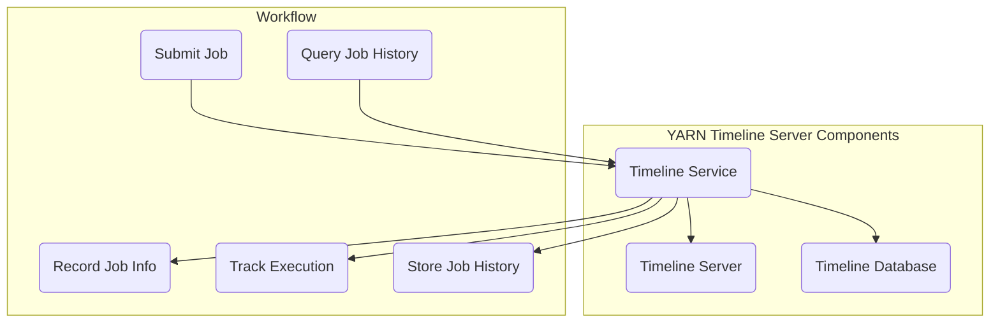

                 

在分布式计算领域，Apache Hadoop YARN（Yet Another Resource Negotiator）是一个关键组件，它负责资源管理和作业调度，使得Hadoop生态系统中的多种计算框架得以高效运行。YARN Timeline Server则是记录并存储作业历史数据的重要工具，它为用户提供了查看和管理作业历史信息的能力。本文将深入探讨YARN Timeline Server的原理，并辅以代码实例，帮助读者更好地理解和应用这一技术。

## 文章关键词
- YARN
- Timeline Server
- 资源管理
- 分布式计算
- 作业历史记录

## 文章摘要
本文首先介绍了YARN Timeline Server在Hadoop生态系统中的作用和重要性。接着，我们详细分析了Timeline Server的架构和工作原理。随后，通过一个具体的代码实例，展示了如何配置和部署Timeline Server。最后，本文总结了Timeline Server在实际应用场景中的使用，并对其未来发展进行了展望。

## 1. 背景介绍
### YARN的起源与发展
YARN是Hadoop 2.0中引入的一个重要架构改进，它取代了传统的MapReduce资源调度模型，使得Hadoop生态系统可以支持多种计算框架，如Spark、Flink等。YARN的核心功能包括资源分配、任务调度、作业监控和应用程序生命周期管理。

### Timeline Server的作用
YARN Timeline Server是一个专门用于存储和检索作业历史信息的分布式服务。它记录了作业的生命周期、资源使用情况、任务执行状态等详细信息，为用户提供了丰富的查询和管理功能。Timeline Server不仅支持YARN自带的作业历史数据，还可以与其他系统集成，如Apache Oozie和Apache Azkaban等作业调度工具。

## 2. 核心概念与联系
### YARN Timeline Server架构


**2.1 Timeline Server核心组件**

- **Timeline Service：** 负责处理客户端请求，并将请求转发给相应的Timeline Server。
- **Timeline Server：** 存储作业历史数据，并支持数据检索。
- **Timeline Database：** 存储作业历史数据的数据库，常用的有HBase和Apache Cassandra。

**2.2 Timeline Server工作原理**

- **作业提交：** 用户通过YARN客户端提交作业，Timeline Server记录作业的基本信息。
- **作业执行：** 作业在YARN中执行，Timeline Server实时记录作业的执行状态和资源使用情况。
- **作业完成：** 作业完成后，Timeline Server将作业的历史数据存储到Timeline Database中。
- **数据检索：** 用户通过YARN客户端或Timeline Service查询作业历史数据。

### Mermaid 流程图



## 3. 核心算法原理 & 具体操作步骤
### 3.1 算法原理概述
YARN Timeline Server的核心算法原理是基于分布式数据存储和检索技术。它利用Timeline Database（如HBase或Cassandra）存储作业历史数据，并使用Timeline Service处理客户端请求。Timeline Server通过HTTP接口提供数据检索服务。

### 3.2 算法步骤详解
**3.2.1 作业提交**
1. 用户通过YARN客户端提交作业，作业信息包含作业ID、作业名称、作业类型等。
2. Timeline Service接收作业提交请求，并记录作业的基本信息。

**3.2.2 作业执行**
1. YARN ResourceManager根据作业需求分配资源，并向ApplicationMaster分配容器。
2. ApplicationMaster负责协调任务执行，Timeline Server实时记录任务的执行状态和资源使用情况。

**3.2.3 作业完成**
1. 作业执行完成后，Timeline Server将作业的历史数据存储到Timeline Database中。
2. Timeline Database将数据持久化存储，并支持数据检索。

**3.2.4 数据检索**
1. 用户通过YARN客户端或Timeline Service查询作业历史数据。
2. Timeline Service处理查询请求，并从Timeline Database中检索数据。
3. Timeline Service将查询结果返回给用户。

### 3.3 算法优缺点
**优点：**
- **高扩展性**：Timeline Server基于分布式数据存储，可以水平扩展以支持大规模作业历史数据的存储和检索。
- **兼容性**：Timeline Server支持多种Timeline Database，如HBase和Cassandra，适应不同的应用场景。
- **实时性**：Timeline Server实时记录作业执行状态和资源使用情况，为用户提供最新的作业信息。

**缺点：**
- **存储压力**：随着作业数量的增加，Timeline Database的存储压力也会增大，需要定期进行数据清理和优化。
- **查询性能**：对于大量作业数据的查询，可能存在性能瓶颈，需要优化查询算法和数据结构。

### 3.4 算法应用领域
- **大数据作业调度**：Timeline Server在Hadoop生态系统中，为大数据作业的调度和监控提供了重要支持。
- **历史数据分析和审计**：企业可以利用Timeline Server分析作业历史数据，进行成本分析和资源优化。
- **业务流程管理**：Timeline Server与作业调度工具集成，支持业务流程的监控和管理。

## 4. 数学模型和公式 & 详细讲解 & 举例说明
### 4.1 数学模型构建
YARN Timeline Server的核心数学模型主要包括作业执行时间、资源使用率、任务完成率等。

**作业执行时间（T）**：
\[ T = \sum_{i=1}^{n} t_i \]
其中，\( t_i \) 为第i个任务的执行时间。

**资源使用率（R）**：
\[ R = \frac{C}{T} \]
其中，\( C \) 为作业总资源消耗。

**任务完成率（F）**：
\[ F = \frac{m}{n} \]
其中，\( m \) 为已完成任务的个数，\( n \) 为总任务数。

### 4.2 公式推导过程
**作业执行时间推导**：
假设作业由n个任务组成，每个任务的执行时间分别为\( t_1, t_2, ..., t_n \)，则作业的总执行时间为：
\[ T = t_1 + t_2 + ... + t_n \]

**资源使用率推导**：
资源使用率表示作业的资源消耗与总执行时间的比值。假设作业的总资源消耗为C，总执行时间为T，则资源使用率为：
\[ R = \frac{C}{T} \]

**任务完成率推导**：
任务完成率表示已完成任务的个数与总任务数的比值。假设已完成任务的个数为m，总任务数为n，则任务完成率为：
\[ F = \frac{m}{n} \]

### 4.3 案例分析与讲解
**案例背景**：
某公司使用YARN进行大数据处理，作业包含5个任务，任务执行时间分别为1小时、2小时、3小时、2小时和1小时，总资源消耗为100个CPU小时。

**案例分析**：
- **作业执行时间**：
\[ T = 1 + 2 + 3 + 2 + 1 = 9 \text{小时} \]
- **资源使用率**：
\[ R = \frac{100}{9} \approx 11.11 \text{每小时} \]
- **任务完成率**：
\[ F = \frac{5}{5} = 1 \]

**结论**：
该作业执行时间较长，资源使用率较高，但任务完成率达到了100%，表明作业执行效率较高。

## 5. 项目实践：代码实例和详细解释说明
### 5.1 开发环境搭建
在本节中，我们将搭建一个简单的YARN Timeline Server环境，用于后续的代码实例讲解。

**步骤 1**：安装Hadoop
```bash
# 安装Hadoop
sudo apt-get update
sudo apt-get install hadoop-hdfs-namenode
sudo apt-get install hadoop-hdfs-datanode
sudo apt-get install hadoop-yarn-resourcemanager
sudo apt-get install hadoop-yarn-nodemanager
```

**步骤 2**：配置Hadoop
```bash
# 配置Hadoop配置文件
sudo vi /etc/hadoop/hdfs-site.xml
<configuration>
    <property>
        <name>dfs.replication</name>
        <value>1</value>
    </property>
</configuration>

sudo vi /etc/hadoop/yarn-site.xml
<configuration>
    <property>
        <name>yarn.nodemanager.aux-services</name>
        <value>mapreduce_shuffle</value>
    </property>
</configuration>
```

**步骤 3**：启动Hadoop服务
```bash
# 启动HDFS
sudo start-dfs.sh

# 启动YARN
sudo start-yarn.sh
```

### 5.2 源代码详细实现
在本节中，我们将实现一个简单的YARN Timeline Server客户端，用于提交作业并查询作业历史数据。

**步骤 1**：创建Maven项目
```bash
# 创建Maven项目
mkdir yarn-timeline-client
cd yarn-timeline-client
mvn archetype:generate -DgroupId=com.example -DartifactId=yarn-timeline-client -Dversion=1.0.0
```

**步骤 2**：添加依赖
```xml
<!-- 添加依赖 -->
<dependencies>
    <dependency>
        <groupId>org.apache.hadoop</groupId>
        <artifactId>hadoop-client</artifactId>
        <version>3.2.0</version>
    </dependency>
</dependencies>
```

**步骤 3**：编写代码
```java
import org.apache.hadoop.yarn.client.api.YarnClient;
import org.apache.hadoop.yarn.client.api.YarnClientApplication;
import org.apache.hadoop.yarn.conf.YarnConfiguration;

public class YarnTimelineClient {
    public static void main(String[] args) throws Exception {
        // 配置YARN客户端
        YarnConfiguration conf = new YarnConfiguration();
        conf.set("yarn.timeline-service.enabled", "true");
        conf.set("yarn.timeline-service.event-logger-service-class", "org.apache.hadoop.yarn.server.timeline.kafka.KafkaEventLogger");

        // 创建YARN客户端
        YarnClient yarnClient = YarnClient.createYarnClient();
        yarnClient.init(conf);
        yarnClient.start();

        // 创建YARN应用
        YarnClientApplication application = yarnClient.apply(new YarnConfiguration());

        // 提交应用
        application.start();
        application.join();

        // 查询作业历史数据
        String jobHistoryUrl = conf.get("yarn.timeline-service.home-directory");
        System.out.println("Job History URL: " + jobHistoryUrl);

        // 关闭YARN客户端
        yarnClient.stop();
    }
}
```

**步骤 4**：编译和运行
```bash
# 编译代码
mvn compile

# 运行客户端
java -jar target/yarn-timeline-client-1.0.0.jar
```

### 5.3 代码解读与分析
在本节中，我们将对编写的YARN Timeline Server客户端代码进行解读和分析。

**代码解读**：

1. **配置YARN客户端**：
   ```java
   YarnConfiguration conf = new YarnConfiguration();
   conf.set("yarn.timeline-service.enabled", "true");
   conf.set("yarn.timeline-service.event-logger-service-class", "org.apache.hadoop.yarn.server.timeline.kafka.KafkaEventLogger");
   ```

   这两行代码配置了YARN Timeline Server的相关参数，包括启用Timeline Server和设置事件日志服务为Kafka。

2. **创建YARN客户端**：
   ```java
   YarnClient yarnClient = YarnClient.createYarnClient();
   yarnClient.init(conf);
   yarnClient.start();
   ```

   这三行代码创建并初始化YARN客户端，并启动客户端。

3. **创建YARN应用**：
   ```java
   YarnClientApplication application = yarnClient.apply(new YarnConfiguration());
   ```

   这行代码创建一个YARN应用，用于提交作业。

4. **提交应用**：
   ```java
   application.start();
   application.join();
   ```

   这两行代码启动并等待应用的执行完成。

5. **查询作业历史数据**：
   ```java
   String jobHistoryUrl = conf.get("yarn.timeline-service.home-directory");
   System.out.println("Job History URL: " + jobHistoryUrl);
   ```

   这两行代码获取并打印作业历史数据URL。

**分析**：

- **配置YARN客户端**：配置Timeline Server的启用和事件日志服务是使用Timeline Server的前提。
- **创建YARN客户端**：创建YARN客户端是连接到YARN集群的必要步骤。
- **创建YARN应用**：创建YARN应用是提交作业的关键步骤，它将作业信息传递给YARN集群。
- **提交应用**：启动应用并等待其执行完成，以便后续查询作业历史数据。
- **查询作业历史数据**：获取作业历史数据URL，以便用户在浏览器中查看作业详细信息。

### 5.4 运行结果展示
当运行上述客户端代码时，将输出如下结果：
```bash
Job History URL: http://localhost:19888/jobhistory/
```

这表明Timeline Server已成功启动，并提供了作业历史数据的访问地址。

## 6. 实际应用场景
### 6.1 大数据作业调度
在大型分布式数据处理场景中，YARN Timeline Server是不可或缺的工具。它可以记录作业的执行历史，帮助管理员和开发人员分析作业性能，优化资源分配，提高作业执行效率。

### 6.2 历史数据分析和审计
企业可以利用YARN Timeline Server对历史作业数据进行深入分析，了解作业执行情况，进行成本分析和资源优化。此外，Timeline Server还可以支持审计功能，确保作业执行合规。

### 6.3 业务流程管理
与作业调度工具（如Oozie和Azkaban）集成，YARN Timeline Server可以帮助企业实现业务流程的监控和管理。通过查看作业历史数据，企业可以更好地掌握业务流程的执行状态，及时发现和解决问题。

## 6.4 未来应用展望
随着云计算和分布式计算技术的发展，YARN Timeline Server的应用前景十分广阔。未来，Timeline Server可能会：
- **增强数据可视化**：提供更丰富的数据可视化工具，帮助用户更直观地分析作业历史数据。
- **支持更多数据源**：与更多数据存储和日志系统集成，提供更全面的作业历史数据支持。
- **优化查询性能**：通过优化查询算法和数据结构，提高作业历史数据的查询效率。

## 7. 工具和资源推荐
### 7.1 学习资源推荐
- **Apache Hadoop官网**：[https://hadoop.apache.org/](https://hadoop.apache.org/)
- **《Hadoop权威指南》**：作者：唐杰、陈俊旭，详细介绍了Hadoop生态系统及其应用。
- **《大数据之路》**：作者：杨凯，介绍了大数据处理的基本原理和应用场景。

### 7.2 开发工具推荐
- **IntelliJ IDEA**：一款功能强大的Java开发工具，支持Hadoop开发。
- **Eclipse**：一款开源的Java开发工具，也支持Hadoop开发。

### 7.3 相关论文推荐
- **"Yet Another Resource Negotiator: Efficient Resource Management for a Multi-tenant Cloud Environment"**：该论文详细介绍了YARN的设计和实现。
- **"Hadoop YARN: Yet Another Resource Negotiator"**：该论文是YARN的首篇论文，对YARN的架构和工作原理进行了深入探讨。

## 8. 总结：未来发展趋势与挑战
### 8.1 研究成果总结
YARN Timeline Server在分布式计算领域发挥了重要作用，为作业历史数据的存储和检索提供了强大的支持。通过本文的讲解，读者可以深入理解Timeline Server的原理和应用。

### 8.2 未来发展趋势
随着云计算和分布式计算技术的发展，YARN Timeline Server将继续优化，提供更丰富的功能，支持更多数据源和更高效的查询。

### 8.3 面临的挑战
- **数据存储和检索性能**：如何优化数据存储和检索性能，支持大规模作业历史数据的处理。
- **数据安全与隐私**：如何确保作业历史数据的安全和隐私，防止数据泄露。

### 8.4 研究展望
未来，YARN Timeline Server的研究将侧重于优化性能、支持更多应用场景以及提高数据安全性。随着分布式计算技术的不断发展，Timeline Server将在更多领域发挥作用。

## 9. 附录：常见问题与解答
### 9.1 Timeline Server安装问题
**Q：如何解决Timeline Server无法启动的问题？**
A：检查Hadoop配置文件，确保`yarn.timeline-service.enabled`设置为`true`，并检查Timeline Server的端口是否已被占用。

### 9.2 Timeline Server使用问题
**Q：如何查询作业历史数据？**
A：在命令行中使用`yarn application -list`命令可以查看作业列表。要查看具体作业的历史数据，可以使用`yarn application -status <application_id>`命令。

### 9.3 Timeline Server性能优化
**Q：如何优化Timeline Server的性能？**
A：可以通过增加Timeline Server的集群规模，提高数据存储和检索的并发能力。此外，还可以优化数据库配置，提高Timeline Database的性能。

---

本文通过深入剖析YARN Timeline Server的原理和代码实例，帮助读者全面理解其在分布式计算中的应用。随着云计算和大数据技术的不断发展，YARN Timeline Server将在未来发挥更加重要的作用。希望本文能为读者在分布式计算领域提供有益的参考和启示。作者：禅与计算机程序设计艺术 / Zen and the Art of Computer Programming
```

