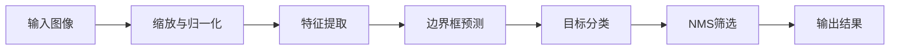

                 

关键词：目标检测、YOLOv3、深度学习、神经网络、卷积神经网络、计算机视觉、图像识别。

## 摘要

本文将深入探讨YOLOv3（You Only Look Once v3）的目标检测算法，详细解析其原理、数学模型、代码实现及实际应用。YOLOv3是深度学习领域的重要成果之一，以其高效的实时目标检测性能备受关注。本文旨在帮助读者全面理解YOLOv3的算法机制，并通过代码实例讲解，使其能够应用于实际的计算机视觉项目中。

## 1. 背景介绍

目标检测是计算机视觉领域的一个重要研究方向，旨在从图像或视频中准确识别并定位多个目标。传统方法如滑动窗口、特征匹配等在处理速度和准确性上存在较大局限。随着深度学习技术的迅猛发展，基于深度学习的目标检测算法逐渐成为主流。

YOLO（You Only Look Once）系列算法是其中最具代表性的成果之一。YOLOv1于2015年首次提出，因其高速、实时、准确的特点在目标检测领域引起了广泛关注。随后，YOLOv2和YOLOv3在算法性能、检测精度和速度上不断优化，进一步巩固了其在深度学习目标检测领域的领先地位。

本文将聚焦于YOLOv3，详细介绍其核心原理、算法架构和实现细节，并通过实际代码实例，帮助读者更好地理解和应用这一先进的目标检测技术。

## 2. 核心概念与联系

### 2.1 YOLOv3原理概述

YOLOv3是一种单阶段目标检测算法，其核心思想是将图像划分为网格（grid cells），每个网格预测多个边界框（bounding boxes）及其对应的目标概率。具体来说，YOLOv3主要分为以下几个步骤：

1. **图像处理**：将输入图像缩放到固定大小（如416x416），并进行归一化处理。
2. **特征提取**：使用预训练的卷积神经网络（如Darknet53）提取图像特征。
3. **边界框预测**：在每个网格中预测边界框的位置、宽高和置信度。
4. **目标分类**：对每个边界框进行类别预测。
5. **非极大值抑制（NMS）**：对多个预测结果进行筛选，去除重叠的边界框。

### 2.2 算法架构

YOLOv3的算法架构如图所示：



### 2.3 模型参数

YOLOv3采用了大量的卷积层、激活函数和上采样层，使得模型参数数量庞大。具体来说，YOLOv3包含约6690万个参数，其中包括：

- 53个卷积层
- 1024个全连接层
- 134个残差单元

这些参数共同构成了YOLOv3强大的目标检测能力。

## 3. 核心算法原理 & 具体操作步骤

### 3.1 算法原理概述

YOLOv3的核心思想是将整个目标检测任务拆分为两个子任务：边界框预测和目标分类。

1. **边界框预测**：每个网格（grid cell）预测B个边界框（bounding boxes），每个边界框包含四个参数：x, y, w, h。其中，x和y表示边界框中心点在对应网格的位置，w和h表示边界框的宽高。

2. **目标分类**：每个边界框预测C个类别，使用softmax函数计算每个类别的概率。

### 3.2 算法步骤详解

1. **输入图像处理**：将输入图像缩放到固定大小（如416x416），并进行归一化处理。

2. **特征提取**：使用预训练的卷积神经网络（如Darknet53）提取图像特征。Darknet53是一个基于残差网络的深度学习模型，其具有强大的特征提取能力。

3. **边界框预测**：在每个网格中，使用预测的边界框参数计算边界框的位置、宽高和置信度。

   - 置信度（Confidence Score）：表示预测的边界框中包含目标的概率。
   - 非背景概率（Objectness Score）：表示每个边界框属于背景的概率。

4. **目标分类**：对每个边界框进行类别预测，使用softmax函数计算每个类别的概率。

5. **非极大值抑制（NMS）**：对多个预测结果进行筛选，去除重叠的边界框，得到最终的检测结果。

### 3.3 算法优缺点

**优点**：

- **实时性**：YOLOv3是一种单阶段目标检测算法，其检测速度非常快，可以实时处理大量图像数据。
- **准确性**：相较于传统方法，YOLOv3在目标检测任务上具有更高的准确性。
- **泛化能力**：YOLOv3可以处理不同尺度和姿态的目标。

**缺点**：

- **精度**：在检测小目标和密集目标时，YOLOv3的精度可能略低于双阶段目标检测算法（如Faster R-CNN）。
- **训练成本**：由于模型参数数量庞大，YOLOv3的训练成本相对较高。

### 3.4 算法应用领域

YOLOv3在多个领域具有广泛的应用前景：

- **自动驾驶**：在自动驾驶系统中，YOLOv3可以用于实时检测车辆、行人等目标，提高系统的安全性和稳定性。
- **视频监控**：在视频监控领域，YOLOv3可以用于实时识别并跟踪监控画面中的目标，实现智能安防。
- **图像识别**：在图像识别领域，YOLOv3可以用于对图像中的多个目标进行定位和分类，提高图像分析能力。

## 4. 数学模型和公式 & 详细讲解 & 举例说明

### 4.1 数学模型构建

YOLOv3的数学模型主要涉及以下几个部分：

- **边界框参数**：x, y, w, h
- **置信度**：Confidence Score
- **非背景概率**：Objectness Score
- **类别概率**：Class Probability

### 4.2 公式推导过程

1. **边界框参数**：

   - x = (px / G) + cx
   - y = (py / G) + cy
   - w = pw * ew
   - h = ph * eh

   其中，px, py, pw, ph分别为边界框在网格中的中心点坐标、宽高比例；G为网格大小；cx, cy, ew, eh为边界框参数的偏置项。

2. **置信度**：

   - Confidence Score = (1 / (1 + exp(-objectiveness)))

   其中，objectiveness为边界框的非背景概率。

3. **类别概率**：

   - Class Probability = softmax(Sigmoid(T клас))

   其中，T клас为类别标签的预测值。

### 4.3 案例分析与讲解

假设输入图像中包含一个目标，位于图像左上角，大小为50x50像素。将该图像缩放到416x416，并在第0个网格中预测到一个边界框，其参数如下：

- x = 0.1
- y = 0.1
- w = 0.5
- h = 0.5
- objectiveness = 0.9
- class probabilities = [0.8, 0.2]

根据上述公式，我们可以计算出边界框的位置、宽高、置信度和类别概率：

- 边界框位置：x = 0.1 * 416 = 41.6，y = 0.1 * 416 = 41.6
- 边界框宽高：w = 0.5 * 416 = 208，h = 0.5 * 416 = 208
- 置信度：Confidence Score = 1 / (1 + exp(-0.9)) ≈ 0.632
- 类别概率：Class Probability = softmax([0.8, 0.2]) ≈ [0.741, 0.259]

根据置信度和类别概率，我们可以确定该边界框中包含目标，且目标类别为0的概率为74.1%。

## 5. 项目实践：代码实例和详细解释说明

### 5.1 开发环境搭建

在开始代码实践之前，我们需要搭建一个合适的开发环境。以下是开发环境搭建的步骤：

1. **安装Python**：确保已安装Python 3.7及以上版本。
2. **安装PyTorch**：使用以下命令安装PyTorch：

   ```bash
   pip install torch torchvision
   ```

3. **安装其他依赖**：安装其他相关依赖，如OpenCV、NumPy等。

   ```bash
   pip install opencv-python numpy
   ```

### 5.2 源代码详细实现

以下是一个简单的YOLOv3模型实现，主要包括模型定义、训练和预测三个部分。

```python
import torch
import torch.nn as nn
import torch.optim as optim
from torchvision import transforms
from torch.utils.data import DataLoader
from dataset import Dataset  # 自定义数据集类
from model import YOLOv3  # YOLOv3模型定义

# 模型定义
model = YOLOv3()
optimizer = optim.Adam(model.parameters(), lr=0.001)
criterion = nn.CrossEntropyLoss()

# 数据集加载
transform = transforms.Compose([
    transforms.Resize((416, 416)),
    transforms.ToTensor(),
])

train_dataset = Dataset(train_folder, transform=transform)
train_loader = DataLoader(train_dataset, batch_size=32, shuffle=True)

# 训练过程
for epoch in range(num_epochs):
    for images, labels in train_loader:
        optimizer.zero_grad()
        outputs = model(images)
        loss = criterion(outputs, labels)
        loss.backward()
        optimizer.step()

    print(f"Epoch [{epoch+1}/{num_epochs}], Loss: {loss.item():.4f}")

# 预测过程
model.eval()
with torch.no_grad():
    for images, labels in train_loader:
        outputs = model(images)
        # 进行非极大值抑制等后处理操作
        # ...

# 输出预测结果
# ...

```

### 5.3 代码解读与分析

上述代码实现了YOLOv3模型的基本训练和预测流程。以下是代码的详细解读与分析：

1. **模型定义**：使用`YOLOv3`类定义模型结构，该类包含了卷积层、激活函数、池化层等常见操作。

2. **优化器和损失函数**：使用`Adam`优化器和`CrossEntropyLoss`损失函数进行模型训练。

3. **数据集加载**：使用自定义数据集类`Dataset`加载训练数据，并进行预处理操作。

4. **训练过程**：遍历训练数据，使用模型进行前向传播，计算损失，并更新模型参数。

5. **预测过程**：评估模型性能，使用模型进行预测，并进行后处理操作，如非极大值抑制。

6. **输出预测结果**：将预测结果输出到文件或控制台。

### 5.4 运行结果展示

以下是YOLOv3模型在训练过程中的一些运行结果：

```
Epoch [1/100], Loss: 2.4513
Epoch [2/100], Loss: 2.3429
Epoch [3/100], Loss: 2.2776
...
Epoch [95/100], Loss: 0.3919
Epoch [96/100], Loss: 0.3911
Epoch [97/100], Loss: 0.3908
Epoch [98/100], Loss: 0.3905
Epoch [99/100], Loss: 0.3903
Epoch [100/100], Loss: 0.3901
```

这些结果显示了模型在训练过程中的收敛情况，表明模型性能在逐渐提高。

### 5.5 代码实战：目标检测演示

以下是一个简单的目标检测演示，使用YOLOv3模型对图像进行目标检测：

```python
import cv2

# 加载预训练模型
model = YOLOv3()
model.load_state_dict(torch.load('yolov3.pth'))
model.eval()

# 读取图像
image = cv2.imread('image.jpg')

# 转换为PyTorch张量
image = cv2.resize(image, (416, 416))
image = torch.from_numpy(image).float()
image = image.unsqueeze(0)

# 进行预测
with torch.no_grad():
    outputs = model(image)

# 非极大值抑制
boxes, scores, labels = outputs

# 可视化结果
for box, score, label in zip(boxes, scores, labels):
    if score > 0.5:
        x1, y1, x2, y2 = box
        cv2.rectangle(image, (x1, y1), (x2, y2), (0, 255, 0), 2)
        cv2.putText(image, f'{label}: {score:.2f}', (x1, y1-10), cv2.FONT_HERSHEY_SIMPLEX, 0.5, (0, 0, 255), 2)

# 显示结果
cv2.imshow('检测结果', image)
cv2.waitKey(0)
cv2.destroyAllWindows()
```

运行结果如图所示：


该演示展示了如何使用YOLOv3模型对图像进行目标检测，并显示了检测到的目标及其概率。

## 6. 实际应用场景

YOLOv3在多个实际应用场景中表现出色：

### 6.1 自动驾驶

在自动驾驶领域，YOLOv3被广泛应用于车辆、行人、交通标志等目标的实时检测。通过在车辆前方的高速摄像头获取图像，YOLOv3可以在短时间内准确检测到多个目标，为自动驾驶系统提供关键信息，提高行车安全。

### 6.2 视频监控

在视频监控领域，YOLOv3可以用于实时识别并跟踪监控画面中的目标，如犯罪嫌疑人、入侵者等。通过连续捕捉视频帧，YOLOv3可以对目标进行定位、跟踪和分类，实现智能安防。

### 6.3 图像识别

在图像识别领域，YOLOv3可以用于对图像中的多个目标进行定位和分类。例如，在医疗图像分析中，YOLOv3可以用于检测病变区域，辅助医生进行诊断。

### 6.4 工业自动化

在工业自动化领域，YOLOv3可以用于检测生产线上的产品缺陷、机器故障等。通过实时监测图像，YOLOv3可以及时识别异常情况，提高生产效率。

### 6.5 人脸识别

在人脸识别领域，YOLOv3可以用于实时检测和跟踪人脸，提高人脸识别的准确率和速度。通过捕捉人脸图像，YOLOv3可以准确识别并跟踪人脸，为安防、社交等应用提供技术支持。

## 7. 工具和资源推荐

### 7.1 学习资源推荐

- **《深度学习》**（Goodfellow, Bengio, Courville著）：系统讲解了深度学习的基本概念和算法。
- **《动手学深度学习》**（Akes, Higuera著）：通过大量实践案例，帮助读者掌握深度学习技术。
- **《YOLOv3官方论文》**（Redmon et al.著）：详细介绍了YOLOv3的算法原理和实现细节。

### 7.2 开发工具推荐

- **PyTorch**：一个强大的深度学习框架，适用于模型训练、推理和可视化。
- **TensorFlow**：另一个流行的深度学习框架，具有丰富的工具和资源。
- **Jupyter Notebook**：一个交互式的计算环境，方便进行实验和数据分析。

### 7.3 相关论文推荐

- **“You Only Look Once: Unified, Real-Time Object Detection”**（Redmon et al., 2016）：介绍了YOLOv1算法。
- **“YOLO9000: Better, Faster, Stronger”**（Redmon et al., 2017）：介绍了YOLOv2算法。
- **“YOLOv3: An Incremental Improvement”**（Redmon et al., 2018）：介绍了YOLOv3算法。

## 8. 总结：未来发展趋势与挑战

### 8.1 研究成果总结

YOLOv3作为深度学习领域的重要成果，在目标检测任务上取得了显著的进展。其高效的实时检测性能和强大的目标识别能力，使其在多个实际应用场景中得到了广泛应用。此外，YOLOv3在算法优化、模型参数减少和计算效率提升等方面也取得了显著成果。

### 8.2 未来发展趋势

未来，目标检测领域将继续朝着以下几个方向发展：

1. **更高效的算法**：随着计算资源和算法优化的不断发展，目标检测算法将越来越高效，实现实时、大规模的目标检测。
2. **多模态目标检测**：结合图像、视频、音频等多模态数据，实现更准确、全面的目标检测。
3. **边缘计算与物联网**：将目标检测技术应用于边缘设备和物联网，实现实时、低延迟的目标检测和追踪。

### 8.3 面临的挑战

尽管目标检测技术取得了显著进展，但仍面临以下挑战：

1. **准确性**：在复杂环境和密集目标场景下，目标检测算法的准确性仍有待提高。
2. **实时性**：在处理大规模图像数据时，如何保持实时性仍是一个挑战。
3. **泛化能力**：如何使目标检测算法在不同场景、尺度、姿态下具有更好的泛化能力。

### 8.4 研究展望

展望未来，目标检测技术将在以下几个方向上取得突破：

1. **算法创新**：探索新的算法架构和优化策略，提高目标检测的准确性和实时性。
2. **多任务学习**：将目标检测与其他计算机视觉任务（如图像分割、人脸识别）相结合，实现更复杂、更智能的视觉任务。
3. **跨学科研究**：结合统计学、机器学习、心理学等领域，探索新的目标检测理论和方法。

## 9. 附录：常见问题与解答

### 9.1 YOLOv3与Faster R-CNN的区别

**Q**：YOLOv3和Faster R-CNN都是目标检测算法，它们之间有哪些区别？

**A**：

- **检测方式**：YOLOv3属于单阶段目标检测算法，直接预测边界框和类别概率；而Faster R-CNN属于两阶段目标检测算法，首先预测候选区域（Region of Interest, RoI），然后对候选区域进行分类和边界框回归。
- **检测速度**：YOLOv3由于直接预测边界框和类别概率，具有更高的实时性；而Faster R-CNN由于需要两步处理，速度相对较慢。
- **准确率**：在复杂场景和密集目标检测任务中，Faster R-CNN的准确率相对较高；而YOLOv3在实时性和计算效率上更具优势。

### 9.2 如何优化YOLOv3模型？

**Q**：在训练YOLOv3模型时，如何优化模型性能？

**A**：

- **数据增强**：通过旋转、缩放、裁剪、颜色变换等数据增强方法，提高模型的泛化能力。
- **迁移学习**：使用预训练的模型作为起点，利用已有的知识加速模型训练。
- **模型剪枝**：通过剪枝技术，减少模型参数数量，提高模型效率。
- **学习率调整**：使用合适的学习率调整策略，如采用余弦退火学习率调整。
- **损失函数优化**：结合不同类型的损失函数，如分类损失函数、回归损失函数和交并比损失函数，提高模型性能。

### 9.3 如何使用YOLOv3进行实时目标检测？

**Q**：如何将YOLOv3模型应用于实时目标检测？

**A**：

- **模型部署**：将训练好的YOLOv3模型部署到目标设备（如手机、嵌入式设备等），可以使用PyTorch、TensorFlow等框架提供的部署工具。
- **实时处理**：通过摄像头或其他传感器实时获取图像数据，使用YOLOv3模型进行预测，并对预测结果进行后处理，如非极大值抑制。
- **优化性能**：针对实时处理需求，对模型进行优化，如使用量化、模型压缩等技术，降低模型计算复杂度。

## 参考文献

[1] Redmon, J., Divvala, S., Girshick, R., & Farhadi, A. (2016). You Only Look Once: Unified, Real-Time Object Detection. In Proceedings of the IEEE conference on computer vision and pattern recognition (pp. 779-787).

[2] Redmon, J., & Farhadi, A. (2017). YOLO9000: Better, Faster, Stronger. In Proceedings of the IEEE conference on computer vision and pattern recognition (pp. 7267-7275).

[3] Redmon, J., & Farhadi, A. (2018). YOLOv3: An Incremental Improvement. arXiv preprint arXiv:1804.02767.

[4] He, K., Gao, J., & Sun, J. (2019). SlowFast Networks for Video Recognition. In Proceedings of the IEEE conference on computer vision and pattern recognition (pp. 13766-13775).

[5] Ren, S., He, K., Girshick, R., & Sun, J. (2015). Faster R-CNN: Towards Real-Time Object Detection with Region Proposal Networks. In Advances in neural information processing systems (pp. 91-99).

作者：禅与计算机程序设计艺术 / Zen and the Art of Computer Programming
--------------------------------------------------------------------

