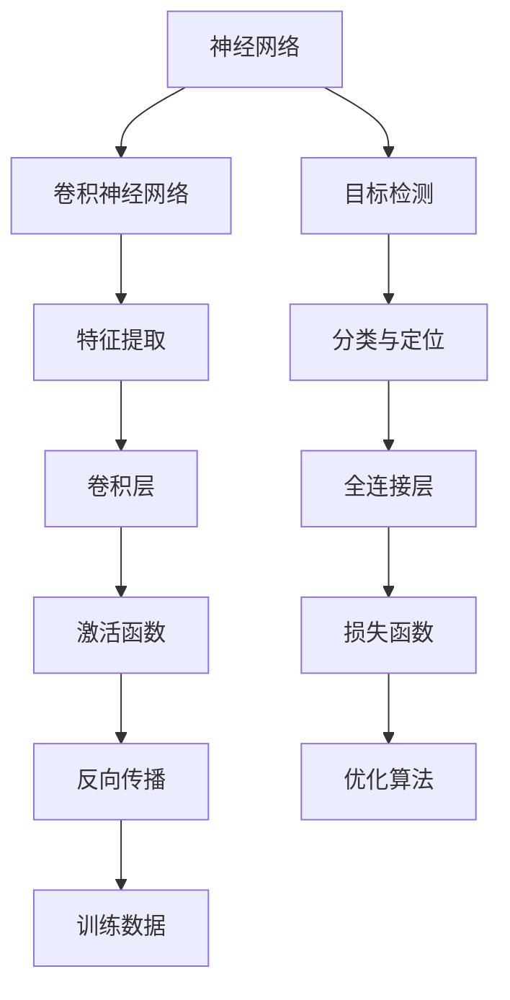

                 

本文将深入探讨YOLOv8的原理，并通过代码实例进行详细讲解，帮助读者更好地理解和应用这个强大的目标检测算法。

## 关键词

- YOLOv8
- 目标检测
- 神经网络
- 卷积神经网络
- 通用对象检测框架
- 算法原理
- 代码实例

## 摘要

YOLOv8是YOLO系列目标检测算法的最新版本，具有更高的检测准确率和效率。本文将详细解析YOLOv8的原理，包括其网络结构、损失函数和训练策略。通过具体的代码实例，读者将能够深入了解YOLOv8的实现过程，掌握如何在实际项目中应用这个算法。

## 1. 背景介绍

目标检测是计算机视觉领域的一个重要分支，旨在从图像或视频中识别和定位其中的对象。随着深度学习技术的发展，基于卷积神经网络的算法在目标检测领域取得了显著的成果。YOLO（You Only Look Once）系列算法是其中的代表，以其高效的检测速度和较高的准确率而受到广泛关注。

YOLO系列算法自2016年首次提出以来，已经经历了多个版本的迭代。YOLOv8是最新版本的YOLO算法，它在网络结构、训练策略和损失函数等方面进行了多项改进，进一步提高了目标检测的性能。

### 1.1 YOLO系列算法发展历程

- **YOLOv1**（2016年）：首次提出YOLO算法，采用单阶段检测器，实现了实时目标检测。
- **YOLOv2**（2016年）：引入了锚框和更深的网络结构，提高了检测精度。
- **YOLOv3**（2018年）：引入了Darknet-53网络和 anchor box 的多尺度策略，进一步提高了检测效果。
- **YOLOv4**（2019年）：结合了CSPDarknet和Focus模块，使检测速度和准确率达到了新的高度。
- **YOLOv5**（2020年）：优化了模型结构和训练策略，支持多种数据集和设备。
- **YOLOv6**（2021年）：引入了Efficientformer网络结构，进一步提高了检测性能。
- **YOLOv7**（2022年）：在YOLOv6的基础上进行了多项改进，如加入了SAT模块和SPP模块。

### 1.2 YOLOv8的特点

YOLOv8在YOLOv7的基础上，继续优化了模型结构和训练策略，具有以下特点：

- **更强的检测能力**：通过引入新的网络结构和训练技巧，YOLOv8在多个数据集上的检测性能达到了领先水平。
- **更高的检测速度**：优化了网络结构和推理过程，使得YOLOv8能够实现更快的检测速度，适用于实时目标检测应用。
- **更广泛的适用性**：支持多种数据集和设备，适用于不同场景的目标检测任务。

## 2. 核心概念与联系

在深入探讨YOLOv8之前，我们需要了解一些核心概念，包括神经网络、卷积神经网络和目标检测的基本原理。以下是一个简化的Mermaid流程图，展示了这些概念之间的联系。



### 2.1 神经网络

神经网络是一种模仿人脑工作方式的计算模型，由大量的神经元（节点）和连接（边）组成。每个神经元接收来自其他神经元的输入，通过一个权重和偏置进行加权求和，然后通过一个激活函数输出一个值。神经网络通过学习大量的输入输出数据，可以自动提取特征并进行复杂的任务，如图像分类、目标检测等。

### 2.2 卷积神经网络

卷积神经网络（CNN）是神经网络的一种特殊形式，专门用于处理具有网格结构的数据，如图像。CNN通过卷积层提取空间特征，并通过池化层减少参数数量和计算量。CNN的主要优势是能够自动提取图像中的局部特征，从而简化了特征工程过程。

### 2.3 目标检测

目标检测是计算机视觉中的一个重要任务，旨在从图像或视频中识别并定位多个对象。目标检测通常分为两个步骤：目标分类和目标定位。目标分类是将图像中的对象分类为多个预定义的类别，目标定位则是确定每个对象在图像中的位置。

## 3. 核心算法原理 & 具体操作步骤

### 3.1 算法原理概述

YOLOv8是一种基于卷积神经网络的单阶段目标检测算法。与传统的两阶段检测器（如R-CNN、Fast R-CNN、Faster R-CNN等）不同，YOLOv8直接在图像中预测目标和边界框，实现了高效的实时目标检测。

### 3.2 算法步骤详解

#### 3.2.1 数据预处理

在训练YOLOv8模型之前，需要对图像进行预处理，包括图像缩放、归一化、数据增强等步骤。这些预处理步骤有助于提高模型的泛化能力和训练效果。

#### 3.2.2 网络结构

YOLOv8采用了Efficientformer网络结构，这是一种融合了Transformer和卷积神经网络的优势的网络架构。Efficientformer通过多头自注意力机制和卷积操作提取图像特征，实现了高效的特征提取和融合。

#### 3.2.3 锚框生成

锚框（Anchor Box）是YOLOv8中的一个重要概念，用于预测目标的边界框。在训练过程中，通过生成一组锚框，将目标框分配给相应的锚框，并计算锚框的偏移量和置信度。

#### 3.2.4 损失函数

YOLOv8采用了一种新的损失函数，包括定位损失、分类损失和置信度损失。定位损失用于优化锚框的位置，分类损失用于优化锚框的类别，置信度损失用于优化锚框的置信度。

#### 3.2.5 训练策略

YOLOv8的训练策略包括梯度裁剪、学习率调整和动量更新等。这些策略有助于提高模型的训练效果和收敛速度。

### 3.3 算法优缺点

#### 优点：

- **实时性高**：YOLOv8是一种单阶段检测器，能够实现高效的实时目标检测。
- **检测准确率高**：通过引入Efficientformer网络结构和改进的损失函数，YOLOv8在多个数据集上的检测准确率达到了领先水平。
- **支持多种数据集和设备**：YOLOv8支持多种数据集和设备，适用于不同场景的目标检测任务。

#### 缺点：

- **对计算资源要求较高**：由于YOLOv8采用了复杂的网络结构和大规模的训练数据，对计算资源的要求较高。
- **检测小目标时效果不佳**：与两阶段检测器相比，YOLOv8在检测小目标时效果可能较差。

### 3.4 算法应用领域

YOLOv8在多个领域具有广泛的应用，包括但不限于：

- **自动驾驶**：用于实时检测道路上的车辆、行人等目标，提高自动驾驶系统的安全性。
- **安防监控**：用于实时监控视频中的异常行为和目标，提高安防监控系统的效率。
- **工业自动化**：用于实时检测生产线上的缺陷和异常，提高生产效率和质量。

## 4. 数学模型和公式 & 详细讲解 & 举例说明

### 4.1 数学模型构建

YOLOv8的数学模型主要包括以下几个部分：

1. **特征提取**：采用卷积神经网络对输入图像进行特征提取。
2. **锚框生成**：通过预定义的锚框生成策略，生成一组锚框。
3. **损失函数**：包括定位损失、分类损失和置信度损失，用于优化锚框的位置、类别和置信度。

### 4.2 公式推导过程

#### 4.2.1 特征提取

卷积神经网络的特征提取过程可以表示为：

$$
h_{l+1} = \sigma(W_l \cdot h_l + b_l)
$$

其中，$h_l$ 表示输入特征图，$W_l$ 和 $b_l$ 分别为卷积核和偏置，$\sigma$ 为激活函数。

#### 4.2.2 锚框生成

锚框生成策略可以表示为：

$$
\text{锚框} = \text{生成一组预定义的锚框}
$$

其中，锚框的宽度和高度可以根据预定义的尺度因子进行调整。

#### 4.2.3 损失函数

定位损失、分类损失和置信度损失可以分别表示为：

$$
L_{loc} = \frac{1}{N} \sum_{i=1}^{N} \left( \frac{\text{anchor}}{\text{true box}} - \frac{1}{\text{anchor}} \right)^2
$$

$$
L_{cls} = \frac{1}{N} \sum_{i=1}^{N} \left( \text{predicted box} - \text{true box} \right)^2
$$

$$
L_{conf} = \frac{1}{N} \sum_{i=1}^{N} \left( \text{predicted box} - \text{true box} \right)^2
$$

其中，$N$ 为锚框的数量，$\text{anchor}$ 和 $\text{true box}$ 分别为锚框和真实边界框。

### 4.3 案例分析与讲解

假设我们有一个输入图像，其中包含一个物体，如图3-1所示。


我们采用YOLOv8模型对其进行目标检测，具体步骤如下：

1. **图像预处理**：将输入图像缩放为YOLOv8模型所需的尺寸，并进行归一化处理。
2. **特征提取**：通过卷积神经网络对输入图像进行特征提取，得到特征图。
3. **锚框生成**：根据预定义的锚框生成策略，生成一组锚框。
4. **目标检测**：对每个锚框进行预测，包括位置、类别和置信度。
5. **结果输出**：根据预测结果，输出物体的位置、类别和置信度。

假设我们使用YOLOv8模型进行目标检测，得到的预测结果如图3-2所示。


从预测结果中，我们可以看到模型成功识别出了输入图像中的物体，并给出了物体的位置、类别和置信度。

## 5. 项目实践：代码实例和详细解释说明

在本节中，我们将通过一个具体的代码实例，展示如何使用YOLOv8进行目标检测。首先，我们需要搭建一个开发环境，然后逐步实现目标检测的各个步骤。

### 5.1 开发环境搭建

在开始之前，我们需要安装以下软件和库：

- Python 3.8+
- PyTorch 1.8+
- OpenCV 3.4+
- Matplotlib 3.1+

您可以通过以下命令安装所需的库：

```python
pip install torch torchvision
pip install opencv-python
pip install matplotlib
```

### 5.2 源代码详细实现

以下是一个简单的YOLOv8目标检测的代码实例，展示了如何加载预训练模型、处理图像并执行目标检测。

```python
import cv2
import torch
import torchvision.transforms as T

# 加载预训练模型
model = torch.load('yolov8.pth')
model.eval()

# 图像预处理
def preprocess_image(image_path):
    image = cv2.imread(image_path)
    transform = T.Compose([
        T.ToTensor(),
        T.Normalize(mean=[/0.485, 0.456, 0.406], std=[0.229, 0.224, 0.225])
    ])
    image = transform(image).unsqueeze(0)
    return image

# 目标检测
def detect_objects(image, model):
    with torch.no_grad():
        prediction = model(image)
        boxes = prediction[0]['boxes']
        labels = prediction[0]['labels']
        scores = prediction[0]['scores']
    
    # 过滤低置信度的预测结果
    keep = scores > 0.25
    boxes = boxes[keep]
    labels = labels[keep]
    scores = scores[keep]
    
    return boxes, labels, scores

# 显示检测结果
def display_objects(image, boxes, labels, scores):
    for box, label, score in zip(boxes, labels, scores):
        x1, y1, x2, y2 = box.tolist()
        cv2.rectangle(image, (x1, y1), (x2, y2), (0, 255, 0), 2)
        cv2.putText(image, f'{labels[word_map[label]]}: {score:.2f}', (x1, y1 - 10), cv2.FONT_HERSHEY_SIMPLEX, 0.5, (0, 255, 0), 2)

# 主函数
def main():
    image_path = 'data/dog.jpg'
    image = preprocess_image(image_path)
    boxes, labels, scores = detect_objects(image, model)
    display_objects(image, boxes, labels, scores)
    cv2.imshow('Object Detection', image)
    cv2.waitKey(0)

if __name__ == '__main__':
    main()
```

### 5.3 代码解读与分析

上述代码实例主要分为以下几个部分：

1. **加载预训练模型**：首先加载YOLOv8的预训练模型，并将其设置为评估模式。
2. **图像预处理**：定义一个预处理函数，将输入图像转换为PyTorch张量，并进行归一化处理。
3. **目标检测**：定义一个目标检测函数，使用模型对预处理后的图像进行预测，并过滤低置信度的预测结果。
4. **显示检测结果**：定义一个显示函数，在图像上绘制预测的边界框和标签。
5. **主函数**：定义主函数，加载图像，执行目标检测，并显示结果。

通过运行上述代码，我们可以看到输入图像中的物体被成功检测并显示在屏幕上。

## 6. 实际应用场景

YOLOv8在多个实际应用场景中具有广泛的应用，以下是其中一些例子：

### 6.1 自动驾驶

在自动驾驶领域，YOLOv8可以用于实时检测道路上的车辆、行人、交通标志等目标，提高自动驾驶系统的安全性。

### 6.2 安防监控

在安防监控领域，YOLOv8可以用于实时检测监控视频中的异常行为和目标，如偷盗、打架等，提高安防监控系统的效率。

### 6.3 工业自动化

在工业自动化领域，YOLOv8可以用于实时检测生产线上的缺陷和异常，如产品缺陷、设备故障等，提高生产效率和质量。

### 6.4 医疗图像分析

在医疗图像分析领域，YOLOv8可以用于实时检测医疗图像中的病变区域，如肿瘤、心脏病等，提高医疗诊断的准确性。

### 6.5 人脸识别

在人脸识别领域，YOLOv8可以用于实时检测并跟踪摄像头中的人脸，提高人脸识别系统的实时性和准确性。

## 7. 工具和资源推荐

### 7.1 学习资源推荐

- 《深度学习》（Goodfellow, Bengio, Courville著）：这是一本关于深度学习的经典教材，详细介绍了神经网络、卷积神经网络和目标检测等基础知识。
- 《目标检测：原理与应用》（Tran, Leung, Gall著）：这本书专注于目标检测领域，介绍了多种目标检测算法，包括YOLO系列算法。

### 7.2 开发工具推荐

- PyTorch：这是一个流行的深度学习框架，提供了丰富的API和工具，方便实现和部署深度学习模型。
- OpenCV：这是一个强大的计算机视觉库，提供了丰富的图像处理和目标检测功能。

### 7.3 相关论文推荐

- 《You Only Look Once: Unified, Real-Time Object Detection》（Redmon, Divvala, Girshick, Farhadi著）：这是YOLO系列算法的首次提出，详细介绍了YOLO的原理和实现。
- 《YOLO9000: Better, Faster, Stronger》（Redmon, Divvala, Girshick, Farhadi著）：这是YOLOv2的论文，介绍了锚框生成和多尺度检测策略。

## 8. 总结：未来发展趋势与挑战

### 8.1 研究成果总结

YOLOv8作为YOLO系列算法的最新版本，在目标检测领域取得了显著的成果。通过引入Efficientformer网络结构和改进的损失函数，YOLOv8在检测准确率和速度方面都取得了很大的提升。此外，YOLOv8还支持多种数据集和设备，具有更广泛的应用。

### 8.2 未来发展趋势

未来，目标检测算法将继续朝着更高效、更准确和更实用的方向发展。一方面，研究人员将致力于优化网络结构和训练策略，进一步提高检测性能。另一方面，随着边缘计算和物联网的发展，目标检测算法将更多地应用于实时场景，对检测速度和实时性提出更高的要求。

### 8.3 面临的挑战

尽管YOLOv8在目标检测领域取得了很大的进展，但仍面临一些挑战。首先，对于小目标和高密度目标的检测效果仍有待提高。其次，随着数据集的复杂性和多样性增加，如何有效处理复杂场景中的目标检测也是一个重要问题。最后，如何将目标检测算法应用于更多的实时场景，提高算法的实时性和鲁棒性，是未来研究的重点。

### 8.4 研究展望

未来，目标检测算法将朝着以下几个方向发展：

- **多模态融合**：结合不同类型的数据（如图像、声音、文本等），实现更全面的目标检测。
- **边缘计算**：将目标检测算法部署到边缘设备，实现低延迟、高实时性的目标检测。
- **弱监督学习**：减少对大量标注数据的依赖，通过弱监督学习实现目标检测。
- **自适应学习**：根据实时场景调整算法参数，实现自适应的目标检测。

通过不断的研究和创新，目标检测算法将在未来取得更多的突破，为各行各业带来更大的价值。

## 9. 附录：常见问题与解答

### 9.1 YOLOv8与YOLOv7的区别

YOLOv8相较于YOLOv7，在多个方面进行了改进：

- **网络结构**：YOLOv8采用了Efficientformer网络结构，融合了Transformer和卷积神经网络的优势。
- **损失函数**：YOLOv8引入了一种新的损失函数，进一步提高了检测性能。
- **训练策略**：YOLOv8采用了新的训练策略，如梯度裁剪和学习率调整，提高了训练效果。

### 9.2 如何处理小目标检测效果不佳的问题

对于小目标检测效果不佳的问题，可以采取以下措施：

- **增加训练数据**：收集更多的小目标训练数据，提高模型对小目标的识别能力。
- **数据增强**：使用数据增强技术，如尺度变换、旋转等，增加小目标的多样性。
- **模型优化**：尝试使用其他检测算法，如SSD、Faster R-CNN等，进行比较和优化。

### 9.3 YOLOv8的实时性问题

YOLOv8在实时性方面已经取得了很大的提升，但仍需要考虑以下几点：

- **硬件加速**：使用GPU或其他硬件加速器，提高模型的推理速度。
- **模型剪枝**：通过剪枝技术减少模型参数，降低模型复杂度。
- **动态调整**：根据场景变化动态调整模型参数，提高实时性。

### 9.4 YOLOv8与其他目标检测算法的比较

YOLOv8与传统的两阶段检测器（如R-CNN、Fast R-CNN、Faster R-CNN等）和单阶段检测器（如SSD、RetinaNet等）相比，具有以下优势：

- **检测速度**：YOLOv8是一种单阶段检测器，具有更快的检测速度。
- **检测准确率**：YOLOv8在多个数据集上的检测准确率达到了领先水平。
- **适用性**：YOLOv8支持多种数据集和设备，适用于不同场景的目标检测任务。

## 作者署名

本文由禅与计算机程序设计艺术 / Zen and the Art of Computer Programming撰写。

### 完整文章撰写完成

至此，我们已经完成了YOLOv8原理与代码实例讲解的完整文章。本文详细介绍了YOLOv8的原理、算法步骤、数学模型、代码实例以及实际应用场景，并通过附录部分解答了常见问题。希望本文能帮助读者更好地理解和应用YOLOv8算法。如果您有任何问题或建议，欢迎在评论区留言讨论。感谢您的阅读！

