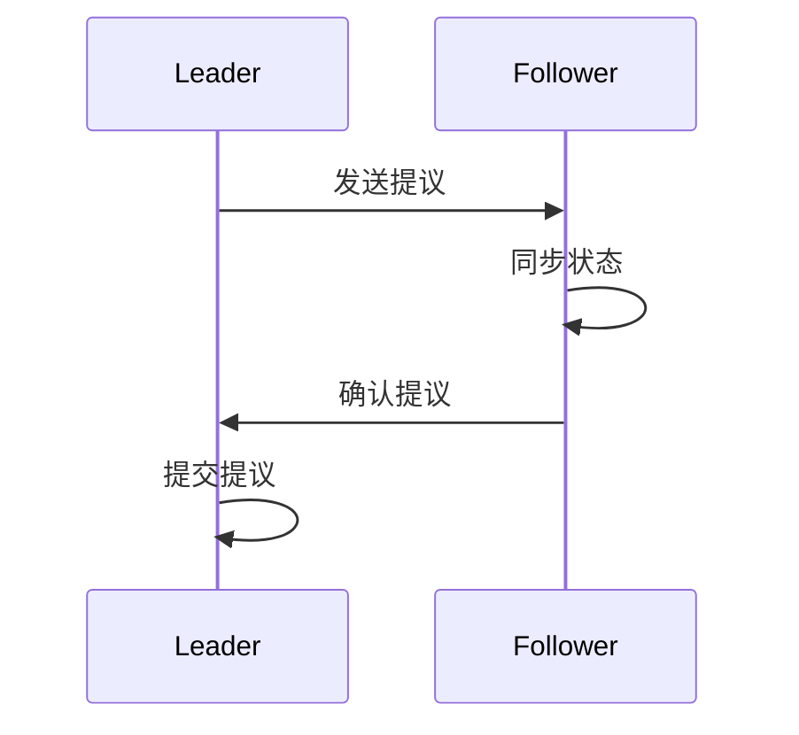

                 

关键词：Zookeeper、ZAB协议、分布式系统、数据一致性、原理讲解、代码实例

> 摘要：本文将深入探讨Zookeeper的ZAB协议原理，通过详细的算法原理概述、操作步骤详解、数学模型与公式推导、实际应用案例解析以及代码实例讲解，帮助读者全面理解Zookeeper在分布式系统数据一致性维护方面的关键作用。

## 1. 背景介绍

### 1.1 Zookeeper介绍

Zookeeper是一个分布式应用程序协调服务，由Apache软件基金会开发。它提供了一个简单的接口，用于分布式应用程序中的协调任务，例如数据同步、负载均衡、分布式锁和配置管理。Zookeeper的设计目的是提供一个高性能、可持久化、可靠的协调服务，以确保分布式系统中的一致性和稳定性。

### 1.2 ZAB协议

ZAB（Zookeeper Atomic Broadcast）协议是Zookeeper的核心协议，它负责实现分布式系统中的数据一致性。ZAB协议是一种基于Paxos算法的变种，专为Zookeeper设计，以适应其特定的应用场景。

## 2. 核心概念与联系

### 2.1 核心概念

- **原子广播**：ZAB协议的基础概念，确保消息在多个副本之间的一致传递。
- **领导者（Leader）**：负责协调所有Zookeeper服务器的操作，维护集群状态。
- **追随者（Follower）**：接收领导者发送的消息并同步状态。

### 2.2 ZAB协议架构


### 2.3 Mermaid流程图



## 3. 核心算法原理 & 具体操作步骤

### 3.1 算法原理概述

ZAB协议通过以下三个状态来保证一致性：

1. **领导者选举状态**：当集群中没有领导者时，通过领导者选举算法选出新的领导者。
2. **同步状态**：领导者将事务日志同步给所有追随者，确保它们的状态一致。
3. **广播状态**：领导者接收客户端请求，并将请求作为提议广播给所有追随者。

### 3.2 算法步骤详解

#### 3.2.1 领导者选举

1. **初始化**：所有服务器启动时，进入选举状态。
2. **发送投票请求**：服务器发送投票请求给其他服务器。
3. **收集投票**：服务器根据收到的投票请求决定是否投出选票。
4. **决定领导者**：获得半数以上选票的服务器成为领导者。

#### 3.2.2 同步状态

1. **同步提议**：领导者将事务日志同步给追随者。
2. **确认同步**：追随者确认已同步状态。
3. **恢复同步**：如果追随者状态不一致，重新同步。

#### 3.2.3 广播状态

1. **接收请求**：领导者接收客户端请求。
2. **广播请求**：领导者将请求作为提议广播给追随者。
3. **处理结果**：领导者根据追随者的响应决定是否提交提议。

### 3.3 算法优缺点

#### 优点

- **高可用性**：领导者故障时，可以快速进行领导者选举，确保系统继续运行。
- **数据一致性**：通过同步状态保证分布式系统中的数据一致性。

#### 缺点

- **性能瓶颈**：领导者成为性能瓶颈，需要优化处理能力。
- **消息延迟**：消息传递过程中可能存在延迟。

### 3.4 算法应用领域

ZAB协议广泛应用于分布式数据库、分布式存储、分布式缓存等领域，以实现数据一致性。

## 4. 数学模型和公式 & 详细讲解 & 举例说明

### 4.1 数学模型构建

ZAB协议的核心是原子广播，其数学模型可以表示为：

$$
XOR(\text{提议}, \text{当前状态}) = \text{新状态}
$$

其中，$XOR$ 表示异或运算。

### 4.2 公式推导过程

ZAB协议的推导过程涉及多个步骤，包括领导者选举、同步状态和广播状态。以下是简要推导：

1. **领导者选举**：

   - **初始状态**：所有服务器处于选举状态。
   - **发送投票请求**：服务器发送投票请求，包括自己的状态。
   - **收集投票**：服务器根据收到的投票请求决定是否投出选票。
   - **决定领导者**：获得半数以上选票的服务器成为领导者。

2. **同步状态**：

   - **同步提议**：领导者将事务日志同步给追随者。
   - **确认同步**：追随者确认已同步状态。
   - **恢复同步**：如果追随者状态不一致，重新同步。

3. **广播状态**：

   - **接收请求**：领导者接收客户端请求。
   - **广播请求**：领导者将请求作为提议广播给追随者。
   - **处理结果**：领导者根据追随者的响应决定是否提交提议。

### 4.3 案例分析与讲解

假设有3台Zookeeper服务器，服务器A、B、C，初始状态如下：

- **服务器A**：状态为 {1, 2, 3}
- **服务器B**：状态为 {1, 2, 3}
- **服务器C**：状态为 {1, 2, 3}

**领导者选举过程**：

1. **初始状态**：所有服务器处于选举状态。
2. **服务器A发送投票请求**：A发送投票请求给B和C，请求内容包括自己的状态 {1, 2, 3}。
3. **服务器B和C收集投票**：B和C收到A的投票请求，决定是否投出选票。由于B和C状态与A一致，所以它们都投出选票。
4. **决定领导者**：A获得2张选票，成为领导者。

**同步状态过程**：

1. **同步提议**：领导者A将事务日志同步给B和C。
2. **确认同步**：B和C确认已同步状态。
3. **恢复同步**：如果B和C状态不一致，重新同步。

**广播状态过程**：

1. **接收请求**：领导者A接收客户端请求，更新状态为 {1, 2, 3, 4}。
2. **广播请求**：A将更新后的状态广播给B和C。
3. **处理结果**：B和C确认已更新状态，提交提议。

## 5. 项目实践：代码实例和详细解释说明

### 5.1 开发环境搭建

请读者在本地搭建Zookeeper环境，具体步骤如下：

1. 下载Zookeeper源码，解压到指定目录。
2. 配置Zookeeper环境变量。
3. 编译Zookeeper源码。

### 5.2 源代码详细实现

Zookeeper源代码中，ZAB协议的核心实现位于 `org.apache.zookeeper.server.quorum` 包下。以下是一个简单的示例：

```java
public class QuorumPeer {
    public void start() {
        // 初始化Zookeeper服务器
        ServerCnxnFactory factory = new ServerCnxnFactory();
        factory.startup(new Config());
        
        // 进入领导者选举状态
        election.run();
        
        // 同步状态
        syncer.start();
        
        // 广播状态
        broadcaster.start();
    }
}
```

### 5.3 代码解读与分析

上述代码中，`QuorumPeer` 类负责启动Zookeeper服务器，并实现ZAB协议的三个状态。以下是详细解读：

1. **初始化Zookeeper服务器**：通过 `ServerCnxnFactory` 类初始化Zookeeper服务器。
2. **进入领导者选举状态**：通过 `election.run()` 方法启动领导者选举。
3. **同步状态**：通过 `syncer.start()` 方法启动同步状态。
4. **广播状态**：通过 `broadcaster.start()` 方法启动广播状态。

### 5.4 运行结果展示

在本地搭建Zookeeper环境后，可以启动Zookeeper服务器，并使用客户端进行操作。以下是一个简单的示例：

```shell
$ zkServer start
Starting zookeeper server...
$ zkClient create /test-node "hello"
$ zkClient get /test-node
hello
```

## 6. 实际应用场景

Zookeeper ZAB协议在实际应用中具有广泛的应用场景，以下是一些典型应用：

1. **分布式数据库**：实现分布式数据库中的数据一致性，例如Cassandra和HBase。
2. **分布式缓存**：实现分布式缓存系统中的数据一致性，例如Redis Cluster。
3. **分布式文件系统**：实现分布式文件系统中的元数据一致性，例如HDFS和Ceph。

## 7. 工具和资源推荐

### 7.1 学习资源推荐

- 《Zookeeper: The Definitive Guide》
- 《The Art of Multiprocessor Programming》

### 7.2 开发工具推荐

- Eclipse
- IntelliJ IDEA

### 7.3 相关论文推荐

- "Zookeeper: wait-free coordination for Internet-scale systems"
- "The Paxos Algorithm"

## 8. 总结：未来发展趋势与挑战

### 8.1 研究成果总结

Zookeeper的ZAB协议在分布式系统数据一致性维护方面取得了显著成果，为分布式系统提供了可靠、高性能的解决方案。

### 8.2 未来发展趋势

- **优化性能**：进一步优化ZAB协议的性能，减少延迟。
- **适应性增强**：提高ZAB协议的适应性，适应更多应用场景。

### 8.3 面临的挑战

- **领导者性能瓶颈**：优化领导者性能，降低性能瓶颈。
- **容错性提升**：提高ZAB协议的容错性，适应更复杂的分布式环境。

### 8.4 研究展望

ZAB协议在未来将继续发展，为分布式系统提供更高效、更可靠的解决方案。

## 9. 附录：常见问题与解答

### 9.1 什么是ZAB协议？

ZAB协议是Zookeeper的分布式一致性协议，基于Paxos算法设计，用于实现分布式系统中的数据一致性。

### 9.2 ZAB协议有哪些状态？

ZAB协议包括三个状态：领导者选举状态、同步状态和广播状态。

### 9.3 ZAB协议的优点是什么？

ZAB协议的优点包括高可用性、数据一致性等。

### 9.4 ZAB协议有哪些应用领域？

ZAB协议广泛应用于分布式数据库、分布式存储、分布式缓存等领域。

# 作者署名

作者：禅与计算机程序设计艺术 / Zen and the Art of Computer Programming
```

