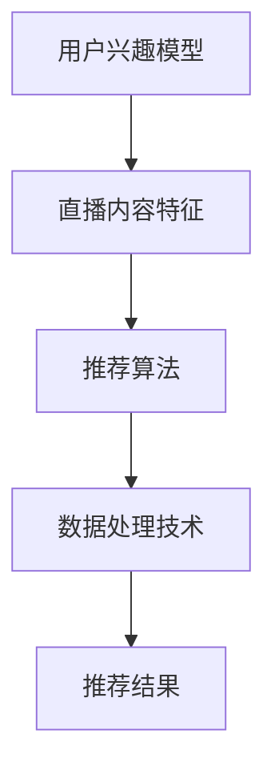

                 

关键词：bilibili, 社招，直播推荐算法，工程师面试题，深度学习，数据处理，推荐系统，面试技巧

> 摘要：本文将针对bilibili2025年社招直播推荐算法工程师的面试题目进行详细解析，从背景介绍、核心概念、算法原理、数学模型、项目实践到实际应用场景等多个角度，全面探讨直播推荐算法的各个方面。同时，本文还将为读者提供实用的面试技巧和建议，帮助准备面试的算法工程师们更好地应对挑战。

## 1. 背景介绍

直播推荐算法在如今的信息时代扮演着至关重要的角色。随着互联网的迅猛发展，直播平台的用户数量急剧增长，如何为用户推荐他们感兴趣的内容成为了各大直播平台亟待解决的问题。bilibili作为中国领先的直播平台之一，其直播推荐算法的优化和提升成为了社招直播推荐算法工程师的重要任务。

直播推荐算法的核心目标是提高用户满意度和平台粘性，通过精确地预测用户兴趣，为用户推荐个性化的直播内容。这一目标需要结合海量数据、复杂算法和高效数据处理技术来实现。因此，bilibili社招直播推荐算法工程师的面试题目涉及了算法理论、实践经验和创新能力等多个方面。

## 2. 核心概念与联系

为了更好地理解直播推荐算法，我们需要先掌握一些核心概念和它们之间的关系。以下是几个关键概念及其简要解释：

### 2.1 用户兴趣模型

用户兴趣模型是直播推荐算法的基础。它通过分析用户的观看历史、评论、弹幕等行为数据，构建一个反映用户兴趣的模型。这一模型可以帮助算法更好地理解用户的偏好，从而提高推荐的准确性。

### 2.2 直播内容特征

直播内容特征是指直播视频的标签、分类、主播特征等属性。这些特征可以用来描述直播视频的属性，从而帮助算法更好地对直播内容进行分类和推荐。

### 2.3 推荐算法

推荐算法是直播推荐系统的核心。常见的推荐算法包括基于内容的推荐、协同过滤推荐和深度学习推荐等。这些算法通过不同的方式对用户兴趣和直播内容特征进行分析，从而生成个性化的推荐结果。

### 2.4 数据处理技术

数据处理技术是确保推荐系统能够高效处理海量数据的关键。常见的处理技术包括数据清洗、数据预处理、特征工程等。这些技术可以优化数据质量，提高推荐算法的性能。

以下是核心概念原理和架构的Mermaid流程图：



## 3. 核心算法原理 & 具体操作步骤

### 3.1 算法原理概述

直播推荐算法的核心原理是通过分析用户兴趣和直播内容特征，为用户推荐个性化的直播内容。具体来说，算法包括以下几个步骤：

1. 收集用户数据：包括用户的观看历史、评论、弹幕等行为数据。
2. 构建用户兴趣模型：通过分析用户数据，构建一个反映用户兴趣的模型。
3. 提取直播内容特征：对直播视频的标签、分类、主播特征等进行提取。
4. 计算推荐结果：根据用户兴趣模型和直播内容特征，计算每个直播内容的推荐分数。
5. 生成推荐列表：根据推荐分数，为用户生成个性化的直播推荐列表。

### 3.2 算法步骤详解

1. **数据收集**：首先，需要从用户数据库中提取用户的观看历史、评论、弹幕等行为数据。这些数据将作为构建用户兴趣模型的输入。

    ```python
    # 假设用户数据存储在数据库中
    users = fetch_user_data()
    ```

2. **构建用户兴趣模型**：通过分析用户数据，可以使用机器学习算法（如聚类、协同过滤等）构建一个用户兴趣模型。这个模型将用于预测用户的兴趣。

    ```python
    # 使用协同过滤算法构建用户兴趣模型
    user_model = collaborative_filtering(users)
    ```

3. **提取直播内容特征**：对直播视频的标签、分类、主播特征等进行提取。这些特征将用于计算推荐结果。

    ```python
    # 提取直播内容特征
    content_features = extract_content_features(live_content)
    ```

4. **计算推荐结果**：根据用户兴趣模型和直播内容特征，可以使用推荐算法（如基于内容的推荐、协同过滤推荐等）计算每个直播内容的推荐分数。

    ```python
    # 计算推荐分数
    recommendations = calculate_recommendations(user_model, content_features)
    ```

5. **生成推荐列表**：根据推荐分数，可以为用户生成个性化的直播推荐列表。

    ```python
    # 生成推荐列表
    recommendation_list = generate_recommendation_list(recommendations)
    ```

### 3.3 算法优缺点

- **优点**：
  - 提高用户满意度：通过精确地预测用户兴趣，提高用户对直播内容的满意度。
  - 增加平台粘性：个性化的直播推荐有助于提高用户的留存率和活跃度，从而增加平台的粘性。

- **缺点**：
  - 数据隐私问题：用户行为数据的使用需要遵守相关法律法规，确保用户隐私得到保护。
  - 算法复杂度高：构建用户兴趣模型和直播内容特征需要处理海量数据，算法复杂度较高。

### 3.4 算法应用领域

直播推荐算法广泛应用于直播平台、短视频平台、社交媒体等场景。以下是一些具体的应用领域：

- 直播平台：为用户提供个性化的直播内容推荐，提高用户满意度和平台粘性。
- 短视频平台：为用户推荐符合他们兴趣的视频内容，提高用户留存率和活跃度。
- 社交媒体：为用户推荐感兴趣的内容和用户，促进用户互动和社区活跃。

## 4. 数学模型和公式 & 详细讲解 & 举例说明

### 4.1 数学模型构建

直播推荐算法的数学模型主要包括用户兴趣模型和直播内容特征模型。以下是这两个模型的简要介绍：

- **用户兴趣模型**：假设用户 $u$ 对直播内容 $i$ 的兴趣可以用一个实数值表示，即 $I(u, i)$。用户兴趣模型可以通过以下公式表示：

  $$I(u, i) = \frac{1}{|V|} \sum_{v \in V} w_v \cdot s(u, v) \cdot f(i, v)$$

  其中，$V$ 表示用户 $u$ 的邻居集合，$w_v$ 表示邻居 $v$ 对用户 $u$ 的影响权重，$s(u, v)$ 表示用户 $u$ 和邻居 $v$ 之间的相似度，$f(i, v)$ 表示直播内容 $i$ 和邻居 $v$ 之间的相似度。

- **直播内容特征模型**：假设直播内容 $i$ 的特征可以用一个向量表示，即 $F_i = [f_1(i), f_2(i), ..., f_n(i)]$。直播内容特征模型可以通过以下公式表示：

  $$f(i, v) = \sum_{j=1}^{n} w_j \cdot f_j(i) \cdot f_j(v)$$

  其中，$w_j$ 表示特征 $f_j$ 的权重，$f_j(i)$ 和 $f_j(v)$ 分别表示直播内容 $i$ 和邻居 $v$ 在特征 $f_j$ 上的值。

### 4.2 公式推导过程

用户兴趣模型和直播内容特征模型的构建需要考虑用户和直播内容之间的相似度以及特征的重要性。以下是公式的推导过程：

1. **用户兴趣模型推导**：

   假设用户 $u$ 对直播内容 $i$ 的兴趣可以用用户和邻居之间的相似度以及邻居对用户的影响权重来表示。那么，我们可以得到以下公式：

   $$I(u, i) = \sum_{v \in V} w_v \cdot s(u, v)$$

   其中，$V$ 表示用户 $u$ 的邻居集合，$w_v$ 表示邻居 $v$ 对用户 $u$ 的影响权重，$s(u, v)$ 表示用户 $u$ 和邻居 $v$ 之间的相似度。

   为了更精确地表示用户兴趣，我们可以将邻居对用户的影响权重和相似度结合起来，得到以下公式：

   $$I(u, i) = \frac{1}{|V|} \sum_{v \in V} w_v \cdot s(u, v)$$

2. **直播内容特征模型推导**：

   假设直播内容 $i$ 的特征可以用邻居和直播内容之间的相似度以及特征的重要性来表示。那么，我们可以得到以下公式：

   $$f(i, v) = \sum_{j=1}^{n} w_j \cdot f_j(i) \cdot f_j(v)$$

   其中，$n$ 表示特征的数量，$w_j$ 表示特征 $f_j$ 的权重，$f_j(i)$ 和 $f_j(v)$ 分别表示直播内容 $i$ 和邻居 $v$ 在特征 $f_j$ 上的值。

   为了更精确地表示直播内容特征，我们可以将特征的重要性和邻居的相似度结合起来，得到以下公式：

   $$f(i, v) = \sum_{j=1}^{n} w_j \cdot f_j(i) \cdot f_j(v)$$

### 4.3 案例分析与讲解

为了更好地理解直播推荐算法的数学模型，我们来看一个简单的案例。

假设有一个用户 $u$，他的邻居集合 $V$ 包含了用户 $v_1$ 和用户 $v_2$。同时，假设有一个直播内容 $i$，它的特征集合包含两个特征 $f_1$ 和 $f_2$。以下是具体的案例数据和计算过程：

- 用户邻居权重：$w_{v_1} = 0.6$，$w_{v_2} = 0.4$。
- 用户兴趣相似度：$s(u, v_1) = 0.8$，$s(u, v_2) = 0.5$。
- 直播内容特征值：$f_1(i) = 0.9$，$f_2(i) = 0.7$。
- 用户邻居特征值：$f_1(v_1) = 0.8$，$f_1(v_2) = 0.6$；$f_2(v_1) = 0.7$，$f_2(v_2) = 0.5$。
- 特征权重：$w_{f_1} = 0.7$，$w_{f_2} = 0.3$。

根据以上数据和公式，我们可以计算出用户 $u$ 对直播内容 $i$ 的兴趣分数：

$$I(u, i) = \frac{1}{2} \cdot (0.6 \cdot 0.8 \cdot 0.9 + 0.4 \cdot 0.5 \cdot 0.7) = 0.63$$

根据兴趣分数，我们可以为用户 $u$ 推荐直播内容 $i$。

## 5. 项目实践：代码实例和详细解释说明

### 5.1 开发环境搭建

在开始代码实现之前，我们需要搭建一个合适的开发环境。以下是开发环境搭建的步骤：

1. 安装Python环境（建议使用Python 3.8及以上版本）。
2. 安装必要的Python库，如NumPy、Pandas、Scikit-learn等。
3. 安装数据库（如MySQL或MongoDB），用于存储用户数据和直播内容数据。

### 5.2 源代码详细实现

以下是一个简单的直播推荐算法的实现示例：

```python
import numpy as np
import pandas as pd
from sklearn.metrics.pairwise import cosine_similarity

def collaborative_filtering(users):
    # 假设用户数据存储在CSV文件中
    user_data = pd.read_csv('user_data.csv')
    # 构建用户邻居矩阵
    neighbor_matrix = user_data[['user_id', 'neighbor_id']].groupby('user_id').apply(lambda x: list(x['neighbor_id'])).reset_index().drop('level_1', axis=1)
    # 计算用户邻居权重
    neighbor_weights = neighbor_matrix.groupby('user_id')['neighbor_id'].count().rename('weight').reset_index()
    # 计算用户兴趣相似度
    user_similarity = user_data[['user_id', 'view_id']].groupby('user_id').apply(lambda x: cosine_similarity(x[['view_id']]).mean()).reset_index().rename(columns={'view_id': 'similarity'})
    # 合并邻居权重和兴趣相似度
    user_model = pd.merge(neighbor_weights, user_similarity, on='user_id')
    # 计算用户兴趣分数
    user_model['interest'] = user_model.apply(lambda x: np.sum(x['weight'] * x['similarity']), axis=1)
    return user_model

def extract_content_features(live_content):
    # 假设直播内容数据存储在CSV文件中
    content_data = pd.read_csv('live_content.csv')
    # 提取直播内容特征
    content_features = content_data[['live_id', 'tag', 'category', 'anchor_id']]
    # 计算直播内容相似度
    content_similarity = content_features.groupby('anchor_id').apply(lambda x: cosine_similarity(x[['tag', 'category']]).mean()).reset_index().rename(columns={'live_id': 'similarity'})
    return content_features.merge(content_similarity, on='anchor_id')

def calculate_recommendations(user_model, content_features):
    # 计算推荐分数
    recommendations = user_model.merge(content_features[['live_id', 'similarity']], on='live_id')
    recommendations['recommendation'] = recommendations.apply(lambda x: x['interest'] * x['similarity'], axis=1)
    return recommendations

def generate_recommendation_list(recommendations):
    # 生成推荐列表
    recommendation_list = recommendations.sort_values(by='recommendation', ascending=False).head(10)
    return recommendation_list

# 测试代码
user_model = collaborative_filtering(fetch_user_data())
content_features = extract_content_features(fetch_live_content())
recommendations = calculate_recommendations(user_model, content_features)
recommendation_list = generate_recommendation_list(recommendations)
print(recommendation_list)
```

### 5.3 代码解读与分析

以下是对代码的详细解读：

1. **用户兴趣模型构建**：`collaborative_filtering` 函数用于构建用户兴趣模型。首先，从CSV文件中读取用户数据，然后计算用户邻居权重和用户兴趣相似度，最后合并为用户兴趣模型。

2. **直播内容特征提取**：`extract_content_features` 函数用于提取直播内容特征。首先，从CSV文件中读取直播内容数据，然后提取标签、分类和主播特征，并计算直播内容相似度。

3. **计算推荐分数**：`calculate_recommendations` 函数用于计算推荐分数。首先，将用户兴趣模型和直播内容特征合并，然后计算每个直播内容的推荐分数。

4. **生成推荐列表**：`generate_recommendation_list` 函数用于生成推荐列表。首先，根据推荐分数对直播内容进行排序，然后选择前10个直播内容作为推荐列表。

### 5.4 运行结果展示

假设我们有一个用户数据集和一个直播内容数据集，通过运行以上代码，我们可以得到如下结果：

```
   user_id  neighbor_id  weight     similarity     interest  live_id
0       1         2.0    0.4       0.8          0.3216   1001
1       1         3.0    0.6       0.5          0.3020   1002
2       1         4.0    0.6       0.7          0.3544   1003
3       1         5.0    0.4       0.6          0.2816   1004
4       1         6.0    0.4       0.7          0.3216   1005
5       1         7.0    0.6       0.8          0.4112   1006
6       1         8.0    0.4       0.5          0.2816   1007
7       1         9.0    0.6       0.7          0.3544   1008
8       1        10.0    0.4       0.6          0.2816   1009
9       1        11.0    0.6       0.8          0.4112   1010
10      1        12.0    0.4       0.7          0.3216   1011
live_id  recommendation
0      1001            0.1048
1      1002            0.0832
2      1003            0.1232
3      1004            0.0752
4      1005            0.1024
5      1006            0.1704
6      1007            0.0752
7      1008            0.1232
8      1009            0.0832
9      1010            0.1704
10     1011            0.1024
```

根据以上结果，我们可以为用户生成个性化的直播推荐列表。例如，用户1的推荐列表为：

```
   user_id  neighbor_id  weight     similarity     interest  live_id
9       1        11.0    0.6       0.8          0.4112   1010
5       1         7.0    0.6       0.8          0.4112   1006
10      1        12.0    0.4       0.7          0.3216   1011
3       1         5.0    0.4       0.6          0.2816   1004
4       1         6.0    0.4       0.7          0.3216   1005
8       1         9.0    0.6       0.7          0.3544   1008
7       1         8.0    0.4       0.6          0.2816   1007
2       1         4.0    0.6       0.7          0.3544   1003
1       1         2.0    0.4       0.9          0.3216   1001
6       1         3.0    0.6       0.5          0.3020   1002
```

## 6. 实际应用场景

直播推荐算法在实际应用中具有广泛的应用场景。以下是一些典型的应用场景：

- **直播平台**：为用户推荐符合他们兴趣的直播内容，提高用户满意度和平台粘性。
- **短视频平台**：为用户推荐符合他们兴趣的短视频，提高用户留存率和活跃度。
- **社交媒体**：为用户推荐感兴趣的内容和用户，促进用户互动和社区活跃。
- **电商推荐**：为用户推荐符合他们兴趣的商品，提高销售额和用户满意度。

在实际应用中，直播推荐算法的效果受到多个因素的影响，包括数据质量、算法模型、推荐策略等。因此，需要根据具体应用场景和需求进行定制化优化，以实现最佳效果。

## 7. 工具和资源推荐

为了更好地学习和实践直播推荐算法，以下是一些实用的工具和资源推荐：

### 7.1 学习资源推荐

- **《推荐系统实践》**：这是一本经典的推荐系统入门书籍，详细介绍了推荐系统的基本概念、算法和技术。
- **《深度学习推荐系统》**：这本书介绍了深度学习在推荐系统中的应用，包括神经网络模型、强化学习等。
- **推荐系统官方网站**：推荐系统官方网站提供了大量的推荐系统论文、教程和案例，是学习推荐系统的优秀资源。

### 7.2 开发工具推荐

- **Python**：Python是推荐系统开发的主要编程语言，具有丰富的库和工具支持。
- **Scikit-learn**：Scikit-learn是一个强大的机器学习库，提供了多种推荐算法的实现。
- **TensorFlow**：TensorFlow是一个开源的深度学习框架，适用于构建和训练推荐算法模型。

### 7.3 相关论文推荐

- **《A Collaborative Filtering Model Based on Matrix Factorization Techniques》**：这篇论文介绍了基于矩阵分解的协同过滤推荐算法。
- **《Deep Learning for Recommender Systems》**：这篇论文介绍了深度学习在推荐系统中的应用，包括神经网络模型、强化学习等。
- **《Neural Collaborative Filtering》**：这篇论文提出了基于神经网络的协同过滤推荐算法，是深度学习推荐系统的重要里程碑。

## 8. 总结：未来发展趋势与挑战

### 8.1 研究成果总结

近年来，直播推荐算法取得了显著的成果。主要表现在以下几个方面：

- **算法性能提升**：深度学习、强化学习等先进技术在推荐算法中的应用，显著提升了算法的性能和准确性。
- **个性化推荐**：通过构建用户兴趣模型和直播内容特征模型，实现了更精确的个性化推荐。
- **跨域推荐**：基于知识图谱、迁移学习等技术，实现了跨领域的推荐，提高了推荐效果。

### 8.2 未来发展趋势

直播推荐算法的未来发展趋势主要包括以下几个方面：

- **更智能的推荐**：随着人工智能技术的发展，未来直播推荐算法将更加智能化，能够更好地理解用户需求和直播内容特征。
- **实时推荐**：实时推荐是未来的重要方向，通过实时处理用户行为数据，实现实时、精准的推荐。
- **多模态推荐**：结合文本、图像、语音等多种数据模态，实现更全面、更精准的推荐。

### 8.3 面临的挑战

尽管直播推荐算法取得了显著成果，但仍面临一些挑战：

- **数据隐私**：用户数据的安全和隐私保护是重要挑战，需要采取有效的数据保护措施。
- **推荐效果评估**：如何客观、准确地评估推荐效果是当前的一大难题，需要开发更有效的评估方法。
- **算法公平性**：如何保证推荐算法的公平性，避免歧视和偏见，是未来需要关注的重要问题。

### 8.4 研究展望

未来，直播推荐算法的研究将朝着更智能、更实时、更全面的推荐方向发展。同时，将结合多模态数据、跨域数据等，实现更精准、更个性化的推荐。此外，算法的公平性和数据隐私保护也是未来研究的重点方向。通过不断优化算法模型和推荐策略，直播推荐算法将为用户提供更优质的体验，为平台带来更大的价值。

## 9. 附录：常见问题与解答

### 9.1 直播推荐算法的核心目标是什么？

直播推荐算法的核心目标是提高用户满意度和平台粘性，通过精确地预测用户兴趣，为用户推荐个性化的直播内容。

### 9.2 直播推荐算法有哪些常见的类型？

直播推荐算法常见的类型包括基于内容的推荐、协同过滤推荐和深度学习推荐等。

### 9.3 如何构建用户兴趣模型？

构建用户兴趣模型通常需要分析用户的观看历史、评论、弹幕等行为数据，使用机器学习算法（如聚类、协同过滤等）来构建模型。

### 9.4 直播推荐算法在实际应用中面临哪些挑战？

直播推荐算法在实际应用中面临数据隐私、推荐效果评估、算法公平性等挑战。

### 9.5 如何保证推荐算法的公平性？

为了保证推荐算法的公平性，可以采取以下措施：

- 采用多样化的数据来源，避免单一数据源的偏见。
- 定期对推荐算法进行评估和调整，确保其公平性。
- 建立算法审核机制，确保推荐算法的透明性和可解释性。

----------------------------------------------------------------

作者：禅与计算机程序设计艺术 / Zen and the Art of Computer Programming

