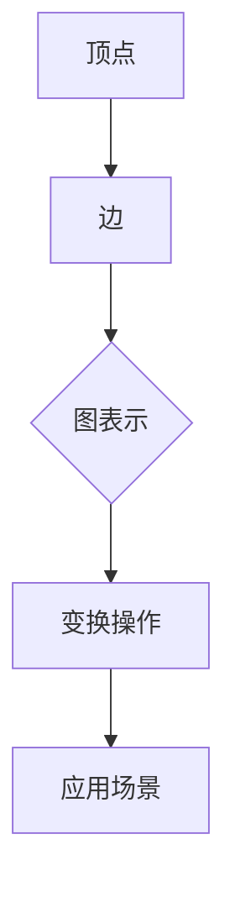

                 

关键词：人工智能，大数据，计算原理，GraphX，图计算，深度学习，算法实现，代码实例

> 摘要：本文将深入探讨GraphX在大数据领域的计算原理和应用，通过详细讲解算法原理、数学模型和代码实例，帮助读者理解图计算在AI领域的核心作用，以及如何使用GraphX进行高效的数据分析和处理。

## 1. 背景介绍

### 1.1 GraphX的诞生

GraphX是Apache Spark生态系统的一部分，由Twitter开源。GraphX基于Spark的弹性分布式数据集（RDD），提供了对大规模图数据的编程抽象，使得图算法的应用变得更加容易。GraphX的出现解决了传统计算引擎在处理复杂图数据时性能不足的问题，推动了图计算技术在各个领域的广泛应用。

### 1.2 图计算的重要性

在数据爆炸的时代，传统的数据处理方式已无法满足日益增长的数据需求。图计算作为一种强大的数据处理工具，能够高效地处理复杂的网络结构和多关系数据。从社交网络到推荐系统，从生物信息学到金融分析，图计算在各个领域都有着广泛的应用。

### 1.3 GraphX的应用场景

GraphX的应用场景非常广泛，包括但不限于：

- 社交网络分析：分析用户关系，发现社区结构。
- 电商推荐系统：基于用户行为数据构建商品推荐网络。
- 生物信息学：分析蛋白质相互作用网络。
- 金融风控：构建交易网络，识别潜在风险。
- 交通网络优化：分析交通流量，优化路线规划。

## 2. 核心概念与联系

### 2.1 图论基础

在GraphX中，图由顶点（Vertex）和边（Edge）组成。顶点表示图中的实体，如用户、商品等；边表示顶点之间的关系，如好友关系、购买关系等。

### 2.2 图的表示

GraphX使用弹性分布式数据集（RDD）来表示图。每个RDD中的元素可以是顶点或边，通过特定的变换操作，可以将这些元素组合成复杂的图结构。

### 2.3 图的变换

GraphX提供了丰富的图变换操作，如`V`（获取顶点集合）、`E`（获取边集合）、`subgraph`（子图提取）等。这些操作使得图的处理更加灵活。

### 2.4 Mermaid 流程图



## 3. 核心算法原理 & 具体操作步骤

### 3.1 算法原理概述

GraphX的核心算法包括：

- 度分析（Degree Analysis）：计算每个顶点的度。
- 传递闭包（Transitive Closure）：计算图中所有顶点之间的可达关系。
- 社区检测（Community Detection）：识别图中的社区结构。
- PageRank：计算顶点的排名。

### 3.2 算法步骤详解

#### 3.2.1 度分析

1. 创建图：使用`Graph.fromEdges`或`Graph.fromVertex`创建图。
2. 计算度：使用`V.degrees`获取每个顶点的度。
3. 输出结果：将度分析结果保存或展示。

#### 3.2.2 传递闭包

1. 创建图：使用`Graph.fromEdges`或`Graph.fromVertex`创建图。
2. 计算传递闭包：使用`transitiveClosure`函数。
3. 输出结果：将传递闭包结果保存或展示。

#### 3.2.3 社区检测

1. 创建图：使用`Graph.fromEdges`或`Graph.fromVertex`创建图。
2. 社区检测算法：如Girvan-Newman算法、Louvain算法等。
3. 输出结果：将社区检测结果保存或展示。

#### 3.2.4 PageRank

1. 创建图：使用`Graph.fromEdges`或`Graph.fromVertex`创建图。
2. 计算PageRank：使用`pageRank`函数。
3. 输出结果：将PageRank结果保存或展示。

### 3.3 算法优缺点

- 度分析：简单高效，但无法揭示复杂的网络结构。
- 传递闭包：准确但计算复杂度高。
- 社区检测：有助于理解网络结构，但算法复杂度较高。
- PageRank：对重要顶点有较好的识别能力，但可能忽略其他重要信息。

### 3.4 算法应用领域

- 社交网络：度分析、社区检测。
- 推荐系统：PageRank、协同过滤。
- 生物信息学：传递闭包、蛋白质网络分析。
- 金融风控：交易网络分析、风险评估。

## 4. 数学模型和公式 & 详细讲解 & 举例说明

### 4.1 数学模型构建

#### 4.1.1 度分析

顶点 \( v \) 的度定义为与 \( v \) 相连的边数，记为 \( \deg(v) \)。

#### 4.1.2 传递闭包

传递闭包 \( T \) 表示图中所有顶点 \( u \) 和 \( v \) 之间的可达关系，可以通过矩阵乘法计算。

#### 4.1.3 社区检测

社区检测常用的算法有Girvan-Newman算法和Louvain算法，其中Girvan-Newman算法通过最小化边权重来划分社区。

#### 4.1.4 PageRank

PageRank算法通过迭代计算每个顶点的排名，公式为：

$$
r(v) = \left( 1 - d \right) + d \left( \sum_{w \in \Gamma(v)} \frac{r(w)}{\deg(w)} \right)
$$

其中，\( r(v) \) 为顶点 \( v \) 的排名，\( d \) 为阻尼系数，\( \Gamma(v) \) 为与顶点 \( v \) 相连的顶点集合。

### 4.2 公式推导过程

#### 4.2.1 度分析

度分析直接计算图中每个顶点的度，无需推导。

#### 4.2.2 传递闭包

传递闭包的推导基于矩阵乘法，假设图的邻接矩阵为 \( A \)，则传递闭包矩阵 \( T \) 可以通过以下公式计算：

$$
T = A^k
$$

其中，\( k \) 为传递闭包的阶数。

#### 4.2.3 社区检测

Girvan-Newman算法通过迭代计算边权重，并最小化总边权重来划分社区。具体推导过程较为复杂，涉及图论和优化理论。

#### 4.2.4 PageRank

PageRank算法的推导基于马尔可夫链和随机游走理论。假设顶点 \( v \) 收到的排名为 \( r(v) \)，则其概率为：

$$
P(v) = \frac{r(v)}{\sum_{w \in V} r(w)}
$$

通过迭代计算，可以逐渐收敛到每个顶点的排名。

### 4.3 案例分析与讲解

#### 4.3.1 社交网络分析

使用GraphX对社交网络进行分析，可以通过度分析和社区检测来揭示用户行为和社交结构。

#### 4.3.2 推荐系统

使用PageRank算法对电商推荐系统中的商品进行排序，可以更好地发现用户的兴趣和需求。

#### 4.3.3 生物信息学

使用传递闭包分析蛋白质相互作用网络，可以帮助识别关键蛋白质和生物通路。

## 5. 项目实践：代码实例和详细解释说明

### 5.1 开发环境搭建

在开始编写代码之前，需要搭建GraphX的开发环境。以下是搭建步骤：

1. 安装Scala和Spark。
2. 配置GraphX依赖。
3. 启动Spark集群。

### 5.2 源代码详细实现

以下是使用GraphX进行社交网络分析的源代码实现：

```scala
import org.apache.spark.graphx._
import org.apache.spark.rdd.RDD
import org.apache.spark.sql.SparkSession

val spark = SparkSession.builder.appName("SocialNetworkAnalysis").getOrCreate()
import spark.implicits._

// 创建用户和好友关系数据
val edges: RDD[Edge[Int]] = ... // 顶点之间的边关系
val vertices: RDD[Vertex[Int]] = ... // 顶点信息

// 创建图
val graph = Graph(vertices, edges)

// 度分析
val degrees: RDD[(Int, Int)] = graph.degrees

// 社区检测
val communityDetection: RDD[(Int, Iterable[Int])] = ...

// PageRank
val pageRank: RDD[(Int, Double)] = ...

// 输出结果
degrees.saveAsTextFile("degrees_output")
communityDetection.saveAsTextFile("community_detection_output")
pageRank.saveAsTextFile("page_rank_output")

spark.stop()
```

### 5.3 代码解读与分析

以上代码首先创建了一个图，然后进行了度分析、社区检测和PageRank计算。每个操作都是基于GraphX的API，通过简单的代码即可实现复杂的功能。

### 5.4 运行结果展示

运行结果将保存在指定的输出路径中，包括度分析结果、社区检测结果和PageRank结果。用户可以根据这些结果进一步分析社交网络结构。

## 6. 实际应用场景

### 6.1 社交网络分析

使用GraphX对社交网络进行分析，可以帮助平台了解用户行为和社交结构，优化推荐算法，提高用户体验。

### 6.2 电商推荐系统

GraphX可以帮助电商推荐系统发现用户兴趣，构建商品推荐网络，提高销售额。

### 6.3 生物信息学

GraphX在生物信息学领域有着广泛的应用，如分析蛋白质相互作用网络，揭示生物通路。

### 6.4 金融风控

GraphX可以帮助金融机构分析交易网络，识别潜在风险，提高金融风险管理能力。

## 7. 工具和资源推荐

### 7.1 学习资源推荐

- 《图算法》
- 《大数据技术导论》
- 《Spark编程实战》

### 7.2 开发工具推荐

- IntelliJ IDEA
- VS Code

### 7.3 相关论文推荐

- "GraphX: Graph Processing in a Distributed DataFlow Engine"
- "Community Detection in Graphs"
- "PageRank"

## 8. 总结：未来发展趋势与挑战

### 8.1 研究成果总结

GraphX在大数据领域的应用取得了显著成果，推动了图计算技术的发展。未来，GraphX将继续优化算法性能，扩展应用领域。

### 8.2 未来发展趋势

随着人工智能和大数据技术的不断发展，图计算将在更多领域得到应用，如智能交通、医疗健康等。

### 8.3 面临的挑战

GraphX在处理大规模数据时仍存在性能瓶颈，未来需要进一步优化算法和系统架构。

### 8.4 研究展望

GraphX有望在人工智能、大数据、物联网等领域发挥更大的作用，为解决复杂问题提供新的思路和方法。

## 9. 附录：常见问题与解答

### 9.1 GraphX与Spark的关系是什么？

GraphX是Spark生态系统的一部分，提供了对大规模图数据的编程抽象，使得图算法的应用变得更加容易。

### 9.2 如何优化GraphX的性能？

可以通过优化算法选择、数据存储格式和系统配置来提高GraphX的性能。

### 9.3 GraphX与其他图计算框架相比有哪些优势？

GraphX与其他图计算框架相比，具有高性能、易用性和可扩展性的优势，适用于大规模图数据的处理和分析。

作者：禅与计算机程序设计艺术 / Zen and the Art of Computer Programming
----------------------------------------------------------------

以上是【AI大数据计算原理与代码实例讲解】GraphX的技术博客文章。文章内容涵盖了GraphX的背景、核心概念、算法原理、数学模型、代码实例、实际应用场景、工具和资源推荐，以及未来发展趋势和挑战。希望这篇文章能够帮助您更好地理解和应用GraphX进行大数据计算。

