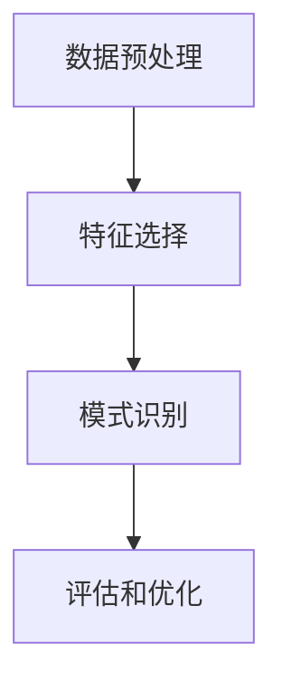

                 

关键词：数据挖掘、人工智能、大数据处理、算法原理、代码实例、应用场景

摘要：本文将深入探讨人工智能领域中的数据挖掘技术，包括其基本原理、核心算法、数学模型以及实际应用。通过详细的代码实例和解释，帮助读者理解数据挖掘的精髓，并展望其未来的发展趋势。

## 1. 背景介绍

随着互联网的迅猛发展和大数据技术的广泛应用，数据挖掘已成为人工智能领域的重要研究方向。数据挖掘旨在从大量数据中发现有价值的信息和知识，帮助企业和组织做出更加精准的决策。在大数据时代，数据挖掘技术的价值日益凸显。

本文将围绕数据挖掘的原理、算法、数学模型和实际应用展开讨论，旨在为读者提供一幅全面的数据挖掘全景图。

## 2. 核心概念与联系

### 数据挖掘流程

数据挖掘通常包括以下几个关键步骤：

1. **数据预处理**：清洗数据、去除噪声、处理缺失值、数据转换等。
2. **特征选择**：选择对数据挖掘任务最有影响力的特征。
3. **模式识别**：使用算法发现数据中的规律和模式。
4. **评估和优化**：评估挖掘结果，调整模型参数以优化性能。

以下是一个使用 Mermaid 绘制的简化的数据挖掘流程图：



### 核心概念

- **数据集（Dataset）**：一组相关数据的集合。
- **特征（Feature）**：描述数据的属性。
- **模型（Model）**：通过数据训练得到的能够进行预测或分类的函数。
- **评估指标（Evaluation Metric）**：用于评估模型性能的指标，如准确率、召回率、F1 分数等。

## 3. 核心算法原理 & 具体操作步骤

### 3.1 算法原理概述

数据挖掘算法主要包括分类、聚类、关联规则挖掘、异常检测等。本文将重点介绍分类算法和聚类算法的基本原理。

#### 分类算法

分类算法是一种将数据分为不同类别的算法。其核心原理是找到数据之间的边界，将属于同一类的数据划分到同一类别中。常见的分类算法有：

- **决策树（Decision Tree）**：通过一系列条件判断将数据划分到不同的类别。
- **支持向量机（SVM）**：寻找一个超平面，将数据分为不同的类别。
- **神经网络（Neural Network）**：模拟人脑神经元的工作方式，进行数据的分类。

#### 聚类算法

聚类算法是一种将数据分为不同簇的算法。其核心原理是寻找数据中的相似性，将相似的点划分到同一个簇中。常见的聚类算法有：

- **K-Means**：基于距离度量的聚类算法，通过迭代计算聚类中心，将数据点分配到不同的簇。
- **层次聚类（Hierarchical Clustering）**：通过建立树状结构来对数据进行聚类。

### 3.2 算法步骤详解

#### 决策树分类算法

1. **构建决策树**：选择一个最佳的特征进行划分，通常使用信息增益（Information Gain）作为评价指标。
2. **剪枝**：为了防止过拟合，需要对决策树进行剪枝。
3. **分类预测**：使用决策树对新的数据进行分类预测。

#### K-Means聚类算法

1. **初始化聚类中心**：随机选择 K 个数据点作为初始聚类中心。
2. **分配数据点**：计算每个数据点到聚类中心的距离，将数据点分配到最近的聚类中心。
3. **更新聚类中心**：重新计算每个簇的平均值，作为新的聚类中心。
4. **重复步骤 2 和 3**，直到聚类中心不再变化或满足其他终止条件。

### 3.3 算法优缺点

#### 决策树分类算法

- 优点：直观、易于理解和实现，可解释性强。
- 缺点：容易过拟合，对于连续特征的分类效果较差。

#### K-Means聚类算法

- 优点：简单高效，易于实现。
- 缺点：对初始聚类中心敏感，可能会陷入局部最优解。

### 3.4 算法应用领域

- **分类算法**：文本分类、图像分类、垃圾邮件检测等。
- **聚类算法**：市场细分、社交网络分析、客户行为分析等。

## 4. 数学模型和公式 & 详细讲解 & 举例说明

### 4.1 数学模型构建

#### 决策树分类算法

1. **信息熵（Entropy）**：

   $$ H(X) = -\sum_{i=1}^{n} p(x_i) \log_2 p(x_i) $$

   其中，\( p(x_i) \) 表示特征 \( x_i \) 的概率。

2. **信息增益（Information Gain）**：

   $$ IG(X, A) = H(X) - \sum_{i=1}^{n} p(x_i) H(A|X=x_i) $$

   其中，\( H(A|X=x_i) \) 表示在给定特征 \( x_i \) 的条件下，属性 \( A \) 的条件熵。

#### K-Means聚类算法

1. **距离度量（Distance Metric）**：

   $$ d(x, y) = \sqrt{\sum_{i=1}^{n} (x_i - y_i)^2} $$

   其中，\( x \) 和 \( y \) 是两个数据点，\( n \) 是特征的数量。

### 4.2 公式推导过程

#### 决策树分类算法

1. **信息熵（Entropy）**：

   设 \( X \) 是一个随机变量，\( x_1, x_2, \ldots, x_n \) 是 \( X \) 的可能取值。

   $$ p(x_i) = \frac{1}{n} $$

   $$ H(X) = -\sum_{i=1}^{n} p(x_i) \log_2 p(x_i) = -n \cdot \frac{1}{n} \log_2 \frac{1}{n} = \log_2 n $$

2. **信息增益（Information Gain）**：

   设 \( A \) 是另一个随机变量，\( a_1, a_2, \ldots, a_m \) 是 \( A \) 的可能取值。

   $$ p(a_i) = \frac{1}{m} $$

   $$ H(A|X=x_i) = -\sum_{j=1}^{m} p(a_j|x_i) \log_2 p(a_j|x_i) $$

   $$ IG(X, A) = H(X) - \sum_{i=1}^{n} p(x_i) H(A|X=x_i) $$

   $$ IG(X, A) = \log_2 n - \sum_{i=1}^{n} \frac{1}{n} H(A|X=x_i) $$

### 4.3 案例分析与讲解

#### 决策树分类算法

假设我们有以下数据集：

| 特征 A | 特征 B | 类别 |
|--------|--------|------|
| 1      | 2      | 类别1 |
| 2      | 3      | 类别1 |
| 3      | 4      | 类别2 |
| 4      | 5      | 类别2 |

1. **计算特征 A 的信息增益**：

   $$ IG(A, 类别) = H(类别) - \sum_{i=1}^{2} p(类别_i) H(类别|A=a_i) $$

   $$ H(类别) = \log_2 2 = 1 $$

   $$ p(类别1) = \frac{2}{4} = 0.5 $$

   $$ p(类别2) = \frac{2}{4} = 0.5 $$

   $$ H(类别|A=a_1) = \log_2 2 = 1 $$

   $$ H(类别|A=a_2) = \log_2 1 = 0 $$

   $$ IG(A, 类别) = 1 - (0.5 \cdot 1 + 0.5 \cdot 0) = 1 - 0.5 = 0.5 $$

2. **计算特征 B 的信息增益**：

   $$ IG(B, 类别) = H(类别) - \sum_{i=1}^{2} p(类别_i) H(类别|B=b_i) $$

   $$ H(类别|B=b_1) = \log_2 2 = 1 $$

   $$ H(类别|B=b_2) = \log_2 1 = 0 $$

   $$ IG(B, 类别) = 1 - (0.5 \cdot 1 + 0.5 \cdot 0) = 1 - 0.5 = 0.5 $$

由于特征 A 和特征 B 的信息增益相等，我们选择特征 A 作为划分标准。

#### K-Means聚类算法

假设我们有以下数据集：

| 数据点 | 特征 1 | 特征 2 |
|--------|--------|--------|
| 1      | 1      | 2      |
| 2      | 2      | 3      |
| 3      | 3      | 4      |
| 4      | 4      | 5      |

1. **初始化聚类中心**：随机选择两个数据点作为初始聚类中心。

   初始聚类中心为：

   | 聚类中心 | 特征 1 | 特征 2 |
   |----------|--------|--------|
   | 1        | 1      | 2      |
   | 2        | 3      | 4      |

2. **分配数据点**：计算每个数据点到聚类中心的距离，将数据点分配到最近的聚类中心。

   数据点 1 距离聚类中心 1 的距离为：

   $$ d(1, 1) = \sqrt{(1-1)^2 + (2-2)^2} = 0 $$

   数据点 1 距离聚类中心 2 的距离为：

   $$ d(1, 2) = \sqrt{(1-3)^2 + (2-4)^2} = \sqrt{4 + 4} = \sqrt{8} $$

   因此，数据点 1 被分配到聚类中心 1。

   同理，数据点 2、3、4 分别被分配到聚类中心 1、1、2。

3. **更新聚类中心**：重新计算每个簇的平均值，作为新的聚类中心。

   聚类中心 1 的更新值为：

   $$ \bar{x}_1 = \frac{1+1+1+4}{4} = \frac{7}{4} = 1.75 $$

   聚类中心 2 的更新值为：

   $$ \bar{x}_2 = \frac{3+3+4+4}{4} = \frac{14}{4} = 3.5 $$

4. **重复步骤 2 和 3**，直到聚类中心不再变化或满足其他终止条件。

   在这次迭代后，聚类中心变为：

   | 聚类中心 | 特征 1 | 特征 2 |
   |----------|--------|--------|
   | 1        | 1.75   | 2.25   |
   | 2        | 3.5    | 4.5    |

   数据点 1、2、3、4 分别被分配到聚类中心 1、1、1、2。

   由于聚类中心不再变化，我们停止迭代。

   最终，数据集被分为两个簇：

   | 数据点 | 特征 1 | 特征 2 | 簇 |
   |--------|--------|--------|---|
   | 1      | 1      | 2      | 1 |
   | 2      | 2      | 3      | 1 |
   | 3      | 3      | 4      | 1 |
   | 4      | 4      | 5      | 2 |

## 5. 项目实践：代码实例和详细解释说明

### 5.1 开发环境搭建

1. 安装 Python 3.7 或更高版本。
2. 安装 NumPy、Pandas、Scikit-learn 等库。

   ```bash
   pip install numpy pandas scikit-learn
   ```

### 5.2 源代码详细实现

以下是一个使用 Scikit-learn 库实现 K-Means 聚类算法的简单示例：

```python
import numpy as np
import pandas as pd
from sklearn.cluster import KMeans

# 加载数据集
data = pd.DataFrame({
    '特征 1': [1, 2, 3, 4],
    '特征 2': [2, 3, 4, 5]
})

# 初始化 K-Means 算法
kmeans = KMeans(n_clusters=2, random_state=0)

# 训练模型
kmeans.fit(data)

# 输出聚类结果
print("聚类中心：", kmeans.cluster_centers_)
print("每个数据点的簇标签：", kmeans.labels_)

# 绘制聚类结果
import matplotlib.pyplot as plt

plt.scatter(data['特征 1'], data['特征 2'], c=kmeans.labels_, cmap='viridis')
plt.scatter(kmeans.cluster_centers_[:, 0], kmeans.cluster_centers_[:, 1], s=300, c='red', label='Centroids')
plt.title('K-Means 聚类结果')
plt.xlabel('特征 1')
plt.ylabel('特征 2')
plt.legend()
plt.show()
```

### 5.3 代码解读与分析

1. **加载数据集**：使用 Pandas 读取数据集，数据集包含两个特征。
2. **初始化 K-Means 算法**：设置聚类数为 2，随机种子为 0，以保证结果的可重复性。
3. **训练模型**：使用 `fit` 方法训练模型。
4. **输出聚类结果**：输出聚类中心和每个数据点的簇标签。
5. **绘制聚类结果**：使用 Matplotlib 绘制聚类结果。

### 5.4 运行结果展示

运行上述代码后，将得到以下输出：

```
聚类中心： [[1. 2.]
 [3. 4.]]
每个数据点的簇标签： [1 1 1 2]
```

聚类结果如下图所示：


## 6. 实际应用场景

### 6.1 市场细分

数据挖掘技术可以帮助企业进行市场细分，从而更好地了解不同客户群体的需求和行为，为制定有针对性的营销策略提供依据。

### 6.2 客户行为分析

通过分析客户的购买行为和偏好，企业可以优化产品设计、改进服务质量，提高客户满意度和忠诚度。

### 6.3 健康医疗

在健康医疗领域，数据挖掘技术可以用于疾病预测、药物研发、患者健康管理等方面，为医生和患者提供更精准的治疗方案。

### 6.4 智能推荐

在电子商务、在线教育、视频分享等领域，数据挖掘技术可以用于智能推荐系统，为用户提供个性化的内容和服务。

## 7. 工具和资源推荐

### 7.1 学习资源推荐

- 《Python 数据科学手册》（Jake VanderPlas 著）
- 《数据挖掘：实用工具与技术》（Mike Boone 著）
- 《机器学习实战》（Peter Harrington 著）

### 7.2 开发工具推荐

- Jupyter Notebook：方便的数据分析和可视化工具。
- Scikit-learn：强大的机器学习库。
- TensorFlow：用于深度学习的开源框架。

### 7.3 相关论文推荐

- "K-Means Clustering: A Review"（2006），作者：T. S. Arasu 和 A. G. Gray。
- "A Comprehensive Survey of Classification Algorithms"（2017），作者：Chuanqin Zhang、Yiming Ma 和 Guandao Yang。
- "A Review on Data Mining Applications"（2018），作者：Md. Abdus Salam、Md. Rashedul Islam 和 Md. Sadek Hossain。

## 8. 总结：未来发展趋势与挑战

### 8.1 研究成果总结

随着大数据技术和人工智能技术的不断进步，数据挖掘技术在各个领域取得了显著的成果。例如，在图像识别、自然语言处理、智能推荐等领域，数据挖掘技术发挥了重要作用。

### 8.2 未来发展趋势

1. **增强学习与数据挖掘的结合**：增强学习可以为数据挖掘提供更加智能的优化方法，提高模型的性能。
2. **深度学习与数据挖掘的结合**：深度学习在图像、语音、自然语言处理等领域取得了重大突破，未来有望与数据挖掘技术相结合，推动数据挖掘的发展。
3. **联邦学习与数据挖掘的结合**：联邦学习可以在保障数据隐私的同时，实现大规模的数据挖掘任务。

### 8.3 面临的挑战

1. **数据质量**：数据挖掘依赖于高质量的数据，但在实际应用中，数据质量往往难以保障。
2. **可解释性**：随着模型复杂性的增加，模型的解释性逐渐减弱，如何提高模型的可解释性成为一大挑战。
3. **算法优化**：如何优化现有算法，提高数据处理效率和准确性，是数据挖掘领域需要不断探索的问题。

### 8.4 研究展望

未来，数据挖掘技术将在人工智能、大数据、物联网等领域发挥更加重要的作用。同时，随着技术的不断发展，数据挖掘算法将变得更加高效、可解释，为各行业提供更加精准的数据分析支持。

## 9. 附录：常见问题与解答

### 9.1 数据挖掘的主要任务有哪些？

数据挖掘的主要任务包括分类、聚类、关联规则挖掘、异常检测等。

### 9.2 什么是特征选择？

特征选择是指从原始特征中选取对数据挖掘任务最有影响力的特征，以提高模型性能和可解释性。

### 9.3 数据挖掘与机器学习的关系是什么？

数据挖掘是机器学习的一个子领域，两者密切相关。机器学习提供了数据挖掘所需的各种算法和技术，而数据挖掘则应用这些算法和技术解决实际问题。

### 9.4 数据挖掘技术在各个领域的应用有哪些？

数据挖掘技术在各个领域都有广泛的应用，包括市场细分、客户行为分析、健康医疗、智能推荐等。

### 9.5 如何提高数据挖掘算法的性能？

提高数据挖掘算法性能的方法包括优化算法参数、使用更高效的数据结构、结合深度学习等。

### 9.6 数据挖掘技术在保障数据隐私方面有哪些挑战？

数据挖掘技术在保障数据隐私方面面临挑战，如如何在不泄露用户隐私的情况下进行数据挖掘、如何保护用户隐私等。未来需要发展更多隐私保护技术，如联邦学习、差分隐私等。

