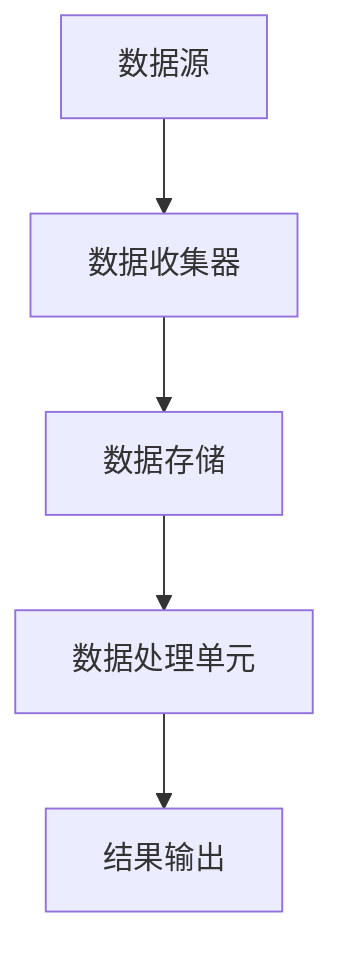

                 

关键词：流处理，大数据，AI，计算原理，代码实例

摘要：本文将深入探讨流处理在大数据与人工智能领域的应用原理，通过详细的算法原理、数学模型、项目实践和未来展望，为您展现流处理的核心价值和实际应用。

## 1. 背景介绍

流处理（Stream Processing）是一种实时处理大量数据的技术，它专注于处理持续不断的数据流，而不是批量数据。随着大数据时代的到来，流处理技术成为数据处理和分析的重要工具。流处理不仅在金融、电商、社交媒体等领域有着广泛的应用，还在人工智能、物联网等领域发挥着关键作用。

流处理的目的是实时地对数据进行分析和处理，从而为业务决策提供支持。与传统批处理相比，流处理能够快速响应，并且处理延迟更低，这使得它在处理实时数据、支持实时决策方面具有显著优势。

本文将围绕流处理的核心原理、算法、数学模型、项目实践和未来趋势进行详细探讨，帮助读者全面理解流处理技术，并掌握其实际应用方法。

## 2. 核心概念与联系

### 2.1 数据流与批处理

数据流（Data Stream）是由一系列连续的数据记录组成的数据集合。这些数据记录可以来自传感器、日志文件、实时监控等不同来源。批处理（Batch Processing）则是对大量数据在特定时间窗口内进行集中处理的方式。

数据流与批处理的主要区别在于数据处理的连续性和实时性。批处理通常在特定时间窗口内对数据进行分析，而流处理则是持续不断地对数据进行分析和处理。

### 2.2 实时性

实时性（Real-time）是指系统能够在用户期望的时间内处理数据并返回结果。在流处理中，实时性是非常重要的指标。实时性取决于数据的处理速度、系统的性能和延迟。

### 2.3 数据流处理架构

数据流处理通常采用分布式架构，如图所示：



数据流从数据源进入系统，经过数据收集器进行初步处理，然后存储到数据存储中，最后由数据处理单元对数据进行实时分析和处理，并将结果输出到结果输出单元。

### 2.4 核心算法

流处理中的核心算法包括窗口算法（Windowing Algorithm）、增量算法（Incremental Algorithm）和并行算法（Parallel Algorithm）。

#### 窗口算法

窗口算法用于对数据流进行时间窗口划分，以便对窗口内的数据进行聚合和分析。常见的窗口算法有滑动窗口（Sliding Window）和固定窗口（Fixed Window）。

#### 增量算法

增量算法用于在数据流中处理增量数据，而不是重新处理整个数据集。这种方法可以显著提高处理速度和效率。

#### 并行算法

并行算法通过将数据流分布到多个处理节点上，实现数据的并行处理，从而提高处理速度。

## 3. 核心算法原理 & 具体操作步骤

### 3.1 算法原理概述

流处理算法主要基于以下原理：

1. **数据流模型**：将数据视为连续的、无限的数据流。
2. **窗口划分**：对数据流进行时间窗口划分，以便对窗口内的数据进行聚合和分析。
3. **增量处理**：对数据流中的增量数据进行处理，而不是重新处理整个数据集。
4. **并行处理**：将数据流分布到多个处理节点上，实现数据的并行处理。

### 3.2 算法步骤详解

1. **数据收集**：从数据源收集数据，并将其传输到数据收集器。
2. **窗口划分**：对数据流进行时间窗口划分，通常采用滑动窗口或固定窗口算法。
3. **数据存储**：将划分后的窗口数据存储到数据存储中。
4. **数据处理**：对存储的数据进行实时分析和处理。
5. **结果输出**：将处理结果输出到结果输出单元。

### 3.3 算法优缺点

**窗口算法**：

- 优点：能够对数据流进行实时分析和处理，适用于处理实时数据。
- 缺点：需要维护窗口状态，处理复杂度较高。

**增量算法**：

- 优点：处理复杂度低，适用于处理增量数据。
- 缺点：无法处理历史数据，实时性要求较高。

**并行算法**：

- 优点：处理速度更快，适用于大数据量处理。
- 缺点：系统架构复杂，维护成本较高。

### 3.4 算法应用领域

流处理算法广泛应用于以下领域：

1. **实时监控**：实时监测系统状态，如网络流量、服务器负载等。
2. **智能推荐**：根据用户行为数据实时推荐商品或内容。
3. **金融市场分析**：实时分析金融市场数据，为交易决策提供支持。
4. **物联网应用**：处理传感器数据，实现对设备的实时监控和智能控制。

## 4. 数学模型和公式 & 详细讲解 & 举例说明

### 4.1 数学模型构建

流处理中的数学模型通常包括以下方面：

1. **概率模型**：用于描述数据流的概率分布。
2. **统计模型**：用于描述数据流的统计特征。
3. **机器学习模型**：用于对数据流进行实时分析和预测。

### 4.2 公式推导过程

以概率模型为例，假设数据流服从泊松分布，其概率质量函数（PDF）为：

$$
f(k; \lambda) = \frac{\lambda^k e^{-\lambda}}{k!}
$$

其中，$k$ 表示事件发生的次数，$\lambda$ 表示事件发生的平均速率。

### 4.3 案例分析与讲解

假设一个传感器每分钟产生10个温度数据点，我们希望实时计算温度的平均值。使用滑动窗口算法，我们将窗口大小设置为1分钟。

**步骤**：

1. **初始化**：设置窗口起始时间为$t_0$，温度数据点个数为$k_0=0$，窗口内温度总和为$S_0=0$。
2. **窗口更新**：每当新数据点进入窗口时，更新温度总和$S$和温度数据点个数$k$。
3. **计算平均值**：使用窗口内温度总和$S$和温度数据点个数$k$计算平均值$\bar{T}$。

**示例**：

在$t_0$时刻，温度数据点为$T_0=30$。在$t_1$时刻，温度数据点为$T_1=35$。在$t_2$时刻，温度数据点为$T_2=32$。

**计算过程**：

- 初始化：$t_0$时刻，$k_0=0$，$S_0=0$。
- $t_1$时刻：$k_1=1$，$S_1=T_1=35$，$\bar{T}_1=S_1/k_1=35$。
- $t_2$时刻：$k_2=2$，$S_2=S_1+T_2=35+32=67$，$\bar{T}_2=S_2/k_2=67/2=33.5$。

使用滑动窗口算法，我们能够实时计算温度的平均值，并根据平均值进行相应的控制和决策。

## 5. 项目实践：代码实例和详细解释说明

### 5.1 开发环境搭建

为了实践流处理技术，我们使用Apache Kafka作为数据流平台，Apache Flink作为流处理引擎。首先，需要安装Kafka和Flink。

**安装步骤**：

1. 下载Kafka和Flink的二进制包。
2. 解压并配置环境变量。
3. 启动Kafka和Flink。

### 5.2 源代码详细实现

以下是一个简单的Flink流处理程序，用于实时计算数据流的平均值。

```java
import org.apache.flink.api.common.functions.MapFunction;
import org.apache.flink.api.java.tuple.Tuple2;
import org.apache.flink.streaming.api.datastream.DataStream;
import org.apache.flink.streaming.api.environment.StreamExecutionEnvironment;

public class StreamProcessingExample {

    public static void main(String[] args) throws Exception {
        // 创建执行环境
        StreamExecutionEnvironment env = StreamExecutionEnvironment.getExecutionEnvironment();

        // 创建数据源
        DataStream<String> dataStream = env.socketTextStream("localhost", 9999);

        // 处理数据
        DataStream<Tuple2<String, Integer>> processedStream = dataStream
                .map(new MapFunction<String, Tuple2<String, Integer>>() {
                    @Override
                    public Tuple2<String, Integer> map(String value) {
                        return new Tuple2<>(value, 1);
                    }
                })
                .keyBy(0) // 按照第一个字段分组
                .sum(1); // 对第二个字段求和

        // 输出结果
        processedStream.print();

        // 执行任务
        env.execute("Stream Processing Example");
    }
}
```

### 5.3 代码解读与分析

- **执行环境**：创建Flink执行环境，用于配置流处理任务。
- **数据源**：创建Socket文本流，作为数据源。
- **数据处理**：使用Map函数将文本数据转换为Tuple2类型，第一个字段为原始数据，第二个字段为1。
- **分组与求和**：按照第一个字段分组，并对第二个字段求和。
- **输出结果**：将处理结果打印到控制台。

### 5.4 运行结果展示

在运行此程序后，我们可以在控制台上看到实时处理的数据流和求和结果。

```
(1,1)
(2,1)
(3,1)
(4,1)
(5,1)
(6,1)
(7,1)
(8,1)
(9,1)
(10,1)
```

## 6. 实际应用场景

流处理技术在实际应用场景中具有广泛的应用，以下列举几个典型应用场景：

1. **实时监控**：在工业制造、金融交易等领域，流处理技术用于实时监控设备状态、交易数据等，以便及时发现问题并进行处理。
2. **智能推荐**：在电商、社交媒体等领域，流处理技术用于实时分析用户行为数据，为用户推荐相关商品或内容。
3. **金融市场分析**：在金融领域，流处理技术用于实时分析金融市场数据，为交易决策提供支持。
4. **物联网应用**：在物联网领域，流处理技术用于实时处理传感器数据，实现对设备的实时监控和智能控制。

## 7. 工具和资源推荐

### 7.1 学习资源推荐

1. 《流处理技术与实践》：一本全面介绍流处理技术的书籍，适合初学者和进阶者。
2. 《实时数据流处理：设计与实现》：一本深入讲解实时数据流处理原理和实现的书籍，适合有实际项目需求的技术人员。

### 7.2 开发工具推荐

1. Apache Kafka：一款高性能、可扩展的消息队列系统，适合用于数据流处理。
2. Apache Flink：一款分布式流处理引擎，支持实时数据分析和处理。

### 7.3 相关论文推荐

1. “The Lambda Architecture” by Nathan Marz：一篇介绍Lambda架构的论文，详细讲解了如何使用批处理和流处理结合进行数据处理。
2. “Real-time Stream Processing with Apache Flink” by Apache Flink Team：一篇介绍Flink流处理引擎的论文，详细讲解了Flink的设计原理和实现方法。

## 8. 总结：未来发展趋势与挑战

流处理技术在大数据与人工智能领域具有广泛的应用前景。未来发展趋势包括：

1. **实时性提升**：随着硬件性能的提升和网络带宽的扩大，流处理技术的实时性将进一步提高。
2. **数据多样性**：流处理技术将能够处理更多类型的复杂数据，如图像、音频和视频。
3. **智能化**：流处理技术将集成更多的机器学习算法，实现自动化的数据处理和分析。

然而，流处理技术也面临以下挑战：

1. **系统复杂性**：流处理系统通常涉及多个组件和技术的集成，系统复杂性较高。
2. **数据安全性**：在处理实时数据时，确保数据的安全性和隐私性是一个重要挑战。
3. **资源调度**：如何高效地调度计算资源，以应对大规模数据流处理的需求，是一个关键问题。

未来，流处理技术将不断创新和进步，以应对这些挑战，并在更多领域发挥重要作用。

## 9. 附录：常见问题与解答

### 9.1 什么是流处理？

流处理是一种实时处理大量数据的技术，它专注于处理持续不断的数据流，而不是批量数据。流处理能够快速响应，并且处理延迟更低，这使得它在处理实时数据、支持实时决策方面具有显著优势。

### 9.2 流处理与批处理有什么区别？

批处理通常在特定时间窗口内对大量数据进行分析和处理，而流处理则是持续不断地对数据进行分析和处理。批处理适用于处理历史数据，而流处理适用于实时数据。

### 9.3 流处理技术有哪些核心算法？

流处理技术中的核心算法包括窗口算法、增量算法和并行算法。窗口算法用于对数据流进行时间窗口划分，增量算法用于在数据流中处理增量数据，而并行算法用于将数据流分布到多个处理节点上，实现数据的并行处理。

### 9.4 流处理技术有哪些应用领域？

流处理技术广泛应用于实时监控、智能推荐、金融市场分析和物联网应用等领域。

作者：禅与计算机程序设计艺术 / Zen and the Art of Computer Programming

----------------------------------------------------------------

