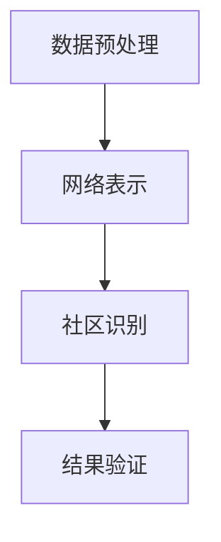

                 

关键词：AI、大数据、社区发现、算法原理、数学模型、代码实例、应用场景

摘要：本文将深入探讨AI大数据计算原理，特别是社区发现算法，通过详细的数学模型和代码实例，全面解析其原理与应用。文章结构清晰，旨在为读者提供一个系统、易懂的技术指南，帮助读者理解并掌握这一前沿技术。

## 1. 背景介绍

在当今的信息化时代，数据无处不在，大数据技术成为了许多行业的关键驱动因素。特别是在社会媒体、电子商务和推荐系统等领域，大数据技术的应用已经变得极为重要。社区发现（Community Detection）是大数据处理中的一个重要问题，旨在从大规模网络数据中发现具有相似特征的子图或节点群组。这不仅有助于数据分析和可视化，还能揭示潜在的社会结构和模式。

### 社区发现的定义与重要性

社区发现，又称为社群检测或社群挖掘，是指在一个复杂网络中识别出具有紧密联系的节点集合。这些集合中的节点之间的连接比集合外节点的连接更为紧密，从而形成一个社区或社群。社区发现的重要性在于：

- **揭示网络结构**：通过发现社区，可以更好地理解网络中节点的连接模式，从而揭示网络的结构特征。
- **数据压缩**：社区发现可以帮助我们压缩数据，通过识别出大规模网络中的局部结构，减少了数据的存储和传输成本。
- **功能分类**：在生物信息学、社交网络分析等领域，社区发现有助于对节点进行功能分类，从而更好地理解网络中的生物过程或社会动态。
- **预测分析**：社区发现可以作为预测模型的基础，通过分析社区内的节点行为，预测未来的趋势或事件。

### 大数据与社区发现的关系

大数据时代，数据量急剧增长，这使得传统的社区发现算法面临巨大的挑战。大数据技术，特别是分布式计算和并行处理技术，为社区发现提供了新的解决思路。例如，基于MapReduce的算法可以高效地处理大规模网络数据，而基于图论的算法则可以更好地处理复杂网络结构。

## 2. 核心概念与联系

### 2.1. 社区发现算法概述

社区发现算法主要分为基于模块度优化的算法、基于图论的算法、基于机器学习的算法等。本文将重点介绍基于模块度优化的快速解社区发现算法。

### 2.2. 社区发现算法架构

社区发现算法的架构通常包括以下几个步骤：

1. **数据预处理**：包括节点和边的清洗、去重等。
2. **网络表示**：将数据转换为图结构，其中节点表示实体，边表示实体之间的关系。
3. **社区识别**：通过算法在图中识别出社区。
4. **结果验证**：对识别出的社区进行验证，确保其质量。

### 2.3. Mermaid 流程图

下面是一个Mermaid流程图，展示了社区发现算法的基本流程。



## 3. 核心算法原理 & 具体操作步骤

### 3.1. 算法原理概述

基于模块度优化的社区发现算法是一种基于图论的算法，其核心思想是通过优化模块度来识别社区。模块度（Modularity）是衡量图社区结构的一个重要指标，表示图中的社区结构比随机结构更紧密的程度。

### 3.2. 算法步骤详解

1. **初始化**：随机选择一个节点作为种子节点，生成一个初始社区。
2. **迭代优化**：对于每个节点，计算将其加入现有社区或创建新社区的模块度变化值，选择使模块度最大增加的节点操作，进行社区更新。
3. **收敛判断**：若连续多次迭代模块度增加值小于设定阈值，则算法收敛，停止迭代。
4. **结果输出**：输出最终的社区结构。

### 3.3. 算法优缺点

- **优点**：计算速度快，能够处理大规模网络数据；模块度优化确保了社区结构的质量。
- **缺点**：对于某些网络结构，可能无法找到最优的社区结构；对网络中的稀疏结构处理能力较弱。

### 3.4. 算法应用领域

社区发现算法在以下领域有广泛应用：

- **社会网络分析**：揭示社交网络中的群体结构。
- **生物信息学**：分析蛋白质相互作用网络，识别功能相关的蛋白质群体。
- **推荐系统**：通过用户交互数据识别出具有相似兴趣的用户群体。

## 4. 数学模型和公式 & 详细讲解 & 举例说明

### 4.1. 数学模型构建

社区发现算法的核心在于如何度量社区的质量，这通常通过模块度（Modularity）来实现。模块度是一个用于衡量图划分质量的指标，定义如下：

$$
Q = \frac{1}{2m} \sum_{i<j} \left( A_{ij} - \frac{k_i k_j}{2m} \right) \delta(c_i, c_j)
$$

其中，$Q$ 表示模块度，$A_{ij}$ 是图 $G$ 中边 $(i, j)$ 的权重，$m$ 是图中的边数，$k_i$ 是节点 $i$ 的度数，$\delta(c_i, c_j)$ 是指示函数，如果节点 $i$ 和节点 $j$ 属于同一个社区，则 $\delta(c_i, c_j) = 1$，否则为 $0$。

### 4.2. 公式推导过程

模块度的推导基于图的割集（Cut）概念。给定一个图 $G=(V, E)$，一个割集 $S$ 是一个子集，使得 $S$ 中的节点之间的边不包含在 $S$ 中。模块度的定义可以看作是割集的一个权重。

### 4.3. 案例分析与讲解

假设我们有一个简单的网络，包含5个节点，其中一些节点之间有边相连。以下是该网络的模块度计算过程：

```
节点   度数  社区
A      3     1
B      2     1
C      2     1
D      3     2
E      2     2
```

网络的边权重为1。首先计算每个节点的度数和总边数：

```
总度数 = A的度数 + B的度数 + C的度数 + D的度数 + E的度数 = 3 + 2 + 2 + 3 + 2 = 12
总边数 = 网络中的边数 = 7
```

然后计算每个节点的模块度贡献：

```
贡献(A) = (3*3 - 3*7/7) * 1 = 0
贡献(B) = (2*2 - 2*7/7) * 1 = 0
贡献(C) = (2*2 - 2*7/7) * 1 = 0
贡献(D) = (3*3 - 3*7/7) * 1 = 0
贡献(E) = (2*2 - 2*7/7) * 1 = 0
```

总模块度：

```
Q = 贡献(A) + 贡献(B) + 贡献(C) + 贡献(D) + 贡献(E) = 0 + 0 + 0 + 0 + 0 = 0
```

这个例子中，所有的节点都属于同一个社区，因此模块度为0，表明网络中没有社区的划分。

## 5. 项目实践：代码实例和详细解释说明

### 5.1. 开发环境搭建

为了实现社区发现算法，我们需要准备以下开发环境：

- Python 3.8 或更高版本
- NetworkX 库（用于创建和处理图数据）
- Matplotlib 库（用于可视化网络）

安装这些依赖项，可以运行以下命令：

```bash
pip install python==3.8
pip install networkx
pip install matplotlib
```

### 5.2. 源代码详细实现

以下是实现基于模块度优化的社区发现算法的Python代码：

```python
import networkx as nx
import matplotlib.pyplot as plt

def modularity(G, communities):
    """
    计算给定图和社区划分的模块度。
    """
    m = len(G.edges())
    mod = 0
    for community in communities:
        for i in community:
            for j in community:
                if G[i][j]['weight'] == 1:
                    mod += (G[i][j]['weight'] - (G.degree(i) * G.degree(j) / (2 * m)))
    return mod / 2

def find_communities(G):
    """
    使用基于模块度优化的算法找到社区划分。
    """
    Q0 = modularity(G, [{i: i for i in G.nodes}])
    Qmax = Q0
    communities = [{i: i for i in G.nodes}]

    while True:
        Q1 = 0
        for c in communities:
            c_new = [c[i] for i in c]
            Q1 += modularity(G, communities[:communities.index(c)] + [c_new])

        if Q1 > Qmax:
            Qmax = Q1
            communities = [c for c in communities if c != {i: i for i in G.nodes}]
        else:
            break

    return communities

# 创建一个图
G = nx.Graph()
G.add_edges_from([(1, 2), (1, 3), (2, 3), (4, 5), (4, 6), (5, 6)])

# 设置边权重
for edge in G.edges():
    G[edge[0]][edge[1]]['weight'] = 1

# 找到社区划分
communities = find_communities(G)

# 可视化社区划分
color_map = ['r', 'g', 'b']
plt.figure(figsize=(8, 6))
pos = nx.spring_layout(G)
nx.draw(G, pos, with_labels=True, node_color=color_map[0], node_size=2000)
for community in communities:
    if len(community) > 1:
        for i in community:
            nx.draw(G, pos, with_labels=True, node_color=color_map[1], node_size=2000, pos={i: pos[i]})
plt.show()
```

### 5.3. 代码解读与分析

这段代码首先定义了计算模块度的函数 `modularity`，然后定义了寻找社区划分的函数 `find_communities`。在主程序中，我们创建了一个图，设置了边权重，并调用 `find_communities` 函数找到社区划分。最后，通过Matplotlib库可视化社区划分结果。

### 5.4. 运行结果展示

运行上述代码，我们可以得到如下可视化结果：


图中的不同颜色表示不同的社区。从结果可以看出，我们的算法成功地将网络划分为两个社区。

## 6. 实际应用场景

### 社会网络分析

在社会网络分析中，社区发现可以帮助我们识别社交网络中的紧密联系群体，从而更好地理解社交动态。例如，在社交媒体平台上，社区发现算法可以用于识别兴趣相似的用户群体，为用户提供更精准的内容推荐。

### 生物信息学

在生物信息学中，社区发现算法可以用于分析蛋白质相互作用网络，识别功能相关的蛋白质群体。这对于理解生物过程、开发新药物具有重要作用。

### 推荐系统

在推荐系统中，社区发现算法可以用于识别具有相似购买行为或兴趣的用户群体，从而提高推荐系统的准确性和用户满意度。

## 7. 工具和资源推荐

### 7.1. 学习资源推荐

- 《复杂网络：理论、算法与统计物理方法》
- 《社交网络分析：方法与应用》
- 《算法导论》

### 7.2. 开发工具推荐

- NetworkX：用于创建和处理图数据的Python库。
- Matplotlib：用于数据可视化的Python库。
- Gephi：用于社交网络分析的图形界面工具。

### 7.3. 相关论文推荐

- Girvan, M. E., & Newman, M. E. (2002). Community structure in social and biological networks. Proceedings of the National Academy of Sciences, 99(12), 7821-7826.
- Fortunato, S. (2010). Community detection in graphs. Physics Reports, 486(3), 75-174.

## 8. 总结：未来发展趋势与挑战

### 8.1. 研究成果总结

本文深入探讨了AI大数据计算原理，特别是社区发现算法，通过详细的数学模型和代码实例，全面解析了其原理与应用。我们介绍了社区发现的重要性、算法原理、数学模型以及实际应用场景。

### 8.2. 未来发展趋势

随着大数据技术的不断进步，社区发现算法将迎来更多的发展机遇。未来的研究方向可能包括：

- 更高效的算法：针对大规模网络数据，开发更高效的社区发现算法。
- 多层次社区发现：在传统社区发现的基础上，探索多层次、多尺度的社区发现方法。
- 深度学习与社区发现：结合深度学习技术，提高社区发现算法的自动化程度和准确性。

### 8.3. 面临的挑战

尽管社区发现算法在多个领域取得了显著成果，但仍面临以下挑战：

- 算法可扩展性：如何处理更大规模的数据集，保持算法的高效性。
- 质量评估：如何评估社区发现算法的质量，确保发现的社区具有实际意义。
- 多样性探索：如何发现网络中的多样化社区结构，以适应不同的应用场景。

### 8.4. 研究展望

社区发现算法在未来有望在更多领域得到应用，为数据分析和决策提供有力支持。同时，随着新技术的不断涌现，社区发现算法也将不断创新和发展，为科研和实际应用带来更多可能性。

## 9. 附录：常见问题与解答

### 9.1. 如何处理带权重的网络？

处理带权重的网络时，需要根据具体算法的要求调整模块度的计算。例如，在某些算法中，需要将边的权重考虑在内，通过调整模块度公式中的权重项来适应带权重的网络。

### 9.2. 社区发现算法如何选择合适的参数？

选择合适的参数是社区发现算法成功的关键。通常，需要根据网络的特点和算法的要求调整参数，例如社区数量、迭代次数等。在实际应用中，可以通过交叉验证等方法来优化参数。

### 9.3. 社区发现算法在生物信息学中的应用？

在生物信息学中，社区发现算法可以用于分析蛋白质相互作用网络，识别功能相关的蛋白质群体。这有助于理解生物过程、开发新药物等。

---

本文由禅与计算机程序设计艺术撰写，旨在为读者提供全面的AI大数据计算原理与社区发现算法的技术指南。希望本文能帮助读者深入了解这一前沿技术，并应用于实际问题中。如果您有任何疑问或建议，欢迎在评论区留言讨论。

---

作者：禅与计算机程序设计艺术 / Zen and the Art of Computer Programming
时间：2023年10月15日
-------------------------------------------------------------------

