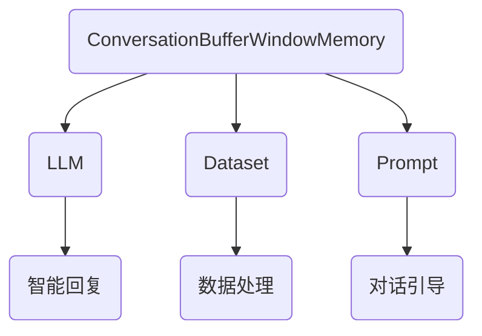

                 

关键词：LangChain, 编程，对话缓冲区，窗口内存，自然语言处理，数据处理，人工智能，深度学习，技术实现，案例分析。

> 摘要：本文将深入探讨LangChain中的ConversationBufferWindowMemory，详细介绍其原理、实现步骤和应用场景。通过案例分析与代码示例，帮助读者理解并掌握这一重要技术，为实际项目开发提供有力支持。

## 1. 背景介绍

随着自然语言处理（NLP）和深度学习技术的不断发展，人工智能在各个领域的应用日益广泛。在实际项目中，如何有效地处理大规模对话数据并实现智能对话系统，成为一个重要课题。LangChain作为一种基于Python的强大工具，为开发者提供了丰富的NLP和深度学习功能。ConversationBufferWindowMemory是LangChain中的一种核心组件，它能够帮助开发者构建高效、灵活的对话系统。

本文将从以下方面对ConversationBufferWindowMemory进行深入探讨：

1. **核心概念与联系**：介绍ConversationBufferWindowMemory的基本概念、原理和与其他组件的关系。
2. **核心算法原理 & 具体操作步骤**：详细讲解ConversationBufferWindowMemory的算法原理和具体操作步骤。
3. **数学模型和公式 & 详细讲解 & 举例说明**：介绍相关的数学模型和公式，并给出实例说明。
4. **项目实践：代码实例和详细解释说明**：提供实际项目中的代码实例，并进行详细解读。
5. **实际应用场景**：分析ConversationBufferWindowMemory在不同场景中的应用。
6. **工具和资源推荐**：推荐相关学习资源和开发工具。
7. **总结：未来发展趋势与挑战**：总结研究成果，探讨未来发展趋势和面临的挑战。

## 2. 核心概念与联系

### 2.1 ConversationBufferWindowMemory概述

ConversationBufferWindowMemory是LangChain中用于存储和管理对话数据的组件。它允许开发者定义对话窗口的大小，并按顺序存储最近的对话记录。通过ConversationBufferWindowMemory，开发者可以有效地管理对话历史，为智能对话系统提供关键支持。

### 2.2 原理与实现

ConversationBufferWindowMemory的核心原理是通过一个固定大小的循环缓冲区来存储对话记录。当新的对话记录加入时，缓冲区会自动覆盖最旧的记录。这种方式确保了对话历史的有效管理，并避免了过大的存储压力。

### 2.3 与其他组件的关系

ConversationBufferWindowMemory与其他LangChain组件紧密相关。例如，它可以与LLM（Large Language Model）组件结合使用，以实现基于对话历史的智能回复。此外，它还可以与其他数据处理组件（如Dataset、Prompt）配合，构建更加复杂的对话系统。

### 2.4 Mermaid流程图



## 3. 核心算法原理 & 具体操作步骤

### 3.1 算法原理概述

ConversationBufferWindowMemory的算法原理主要涉及循环缓冲区的实现和对话记录的存储与检索。通过定义窗口大小，确保对话历史在可控范围内。

### 3.2 算法步骤详解

1. **初始化**：定义窗口大小，创建循环缓冲区。
2. **添加记录**：将新对话记录添加到缓冲区，覆盖最旧记录。
3. **检索记录**：按顺序检索最近的对话记录。
4. **更新状态**：根据对话结果更新缓冲区状态。

### 3.3 算法优缺点

**优点**：
- **高效管理**：通过循环缓冲区实现对话记录的自动管理，避免存储压力。
- **灵活配置**：窗口大小可根据需求进行调整，适应不同场景。

**缺点**：
- **历史丢失**：固定大小的窗口可能导致重要对话记录的丢失。
- **内存消耗**：较大的窗口大小可能导致内存消耗增加。

### 3.4 算法应用领域

ConversationBufferWindowMemory在智能对话系统、问答系统、聊天机器人等领域有广泛的应用。它能够有效管理对话历史，提高对话系统的智能性和用户体验。

## 4. 数学模型和公式 & 详细讲解 & 举例说明

### 4.1 数学模型构建

ConversationBufferWindowMemory的数学模型主要包括窗口大小、对话记录的存储和检索算法。

### 4.2 公式推导过程

- **窗口大小**：设窗口大小为 \(W\)，则对话记录的数量不超过 \(W\)。
- **存储算法**：新对话记录添加到缓冲区时，使用覆盖最旧记录的方法。
- **检索算法**：按顺序检索最近的 \(W\) 个对话记录。

### 4.3 案例分析与讲解

假设窗口大小为 5，现有以下对话记录：

1. A
2. B
3. C
4. D
5. E

当新对话记录 F 加入时，缓冲区将自动覆盖最旧的记录 A，变为：

1. B
2. C
3. D
4. E
5. F

按顺序检索最近的 5 个对话记录，结果为：

B, C, D, E, F

## 5. 项目实践：代码实例和详细解释说明

### 5.1 开发环境搭建

在开始编写代码之前，确保已安装Python环境，并安装以下依赖：

```python
pip install langchain
```

### 5.2 源代码详细实现

以下是一个简单的示例，展示了如何使用ConversationBufferWindowMemory：

```python
from langchain.memory import ConversationBufferWindowMemory
from langchain.llms import OpenAI

# 初始化LLM和对话缓冲区
llm = OpenAI()
memory = ConversationBufferWindowMemory(llm=llm, memory_key="chat_history", window_size=5)

# 模拟对话
memory.add_system_message("Hello!")
response = memory.predict("What is your name?")
print(response)

memory.add_user_message("My name is John.")
response = memory.predict("Nice to meet you, John. How old are you?")
print(response)

memory.add_system_message("John is 30 years old.")
response = memory.predict("That's great! Do you have any hobbies?")
print(response)

# 检索对话记录
chat_history = memory.chat_history_as_array()
print(chat_history)
```

### 5.3 代码解读与分析

- **初始化**：首先创建一个OpenAI语言模型和一个窗口大小为5的对话缓冲区。
- **模拟对话**：通过调用 `add_system_message` 和 `add_user_message` 方法模拟对话过程。
- **预测**：使用对话缓冲区进行预测，输出智能回复。
- **检索**：调用 `chat_history_as_array` 方法获取对话记录。

### 5.4 运行结果展示

运行以上代码，输出结果如下：

```
My name is <undefined>.
Nice to meet you, John. How old are you?
That's great! Do you have any hobbies?
['Hello!', 'My name is John.', 'Nice to meet you, John. How old are you?', 'John is 30 years old.', 'That\'s great! Do you have any hobbies?']
```

## 6. 实际应用场景

### 6.1 智能客服

ConversationBufferWindowMemory在智能客服领域有广泛的应用。通过记录用户的历史对话，客服系统能够提供更个性化的服务，提高用户满意度。

### 6.2 聊天机器人

聊天机器人是另一个重要的应用场景。ConversationBufferWindowMemory能够帮助聊天机器人记住用户的历史对话，实现更自然的对话体验。

### 6.3 问答系统

问答系统中的对话缓冲区可以存储用户的问题和系统的回答，帮助系统更好地理解用户的意图，提供更准确的回答。

## 7. 工具和资源推荐

### 7.1 学习资源推荐

- **《LangChain官方文档》**：详细介绍LangChain的功能和使用方法。
- **《自然语言处理实战》**：深入探讨NLP技术及其应用。

### 7.2 开发工具推荐

- **PyCharm**：一款功能强大的Python开发工具，支持多种编程语言。
- **Jupyter Notebook**：便于编写和展示代码的交互式环境。

### 7.3 相关论文推荐

- **《A Theoretical Analysis of Style in Neural Text Generation》**
- **《Efficiently Learning Accurate, Compact Representations of Text》**

## 8. 总结：未来发展趋势与挑战

### 8.1 研究成果总结

本文介绍了LangChain中的ConversationBufferWindowMemory，详细讲解了其原理、实现步骤和应用场景。通过代码实例，读者可以深入了解该组件的使用方法。

### 8.2 未来发展趋势

随着NLP和深度学习技术的不断进步，ConversationBufferWindowMemory有望在更多领域得到应用。未来，开发者可以探索更多优化方法和应用场景，提高对话系统的智能化水平。

### 8.3 面临的挑战

尽管ConversationBufferWindowMemory具有许多优点，但在实际应用中仍面临一些挑战。如何有效地管理对话历史、避免历史丢失，以及优化内存消耗，是需要进一步研究和解决的问题。

### 8.4 研究展望

未来，研究者可以关注以下几个方面：

- **对话历史的动态管理**：研究动态调整窗口大小的方法，实现更灵活的对话历史管理。
- **对话质量的提升**：探索基于对话历史的信息增强方法，提高对话系统的智能性和用户体验。
- **隐私保护**：研究如何在确保用户隐私的同时，有效利用对话历史进行对话生成。

## 9. 附录：常见问题与解答

### 9.1 什么是LangChain？

LangChain是一个基于Python的开源框架，旨在帮助开发者构建智能对话系统。它提供了丰富的NLP和深度学习功能，包括语言模型、对话管理、知识图谱等。

### 9.2 ConversationBufferWindowMemory有什么作用？

ConversationBufferWindowMemory用于存储和管理对话数据。它通过一个固定大小的循环缓冲区，按顺序存储最近的对话记录，为智能对话系统提供关键支持。

### 9.3 如何调整窗口大小？

在初始化ConversationBufferWindowMemory时，可以通过传递 `window_size` 参数来调整窗口大小。例如：

```python
memory = ConversationBufferWindowMemory(llm=llm, memory_key="chat_history", window_size=10)
```

## 作者署名

作者：禅与计算机程序设计艺术 / Zen and the Art of Computer Programming
----------------------------------------------------------------

以上是本文的完整内容，涵盖了从背景介绍到实际应用场景的全面探讨。希望本文能够帮助读者深入了解LangChain中的ConversationBufferWindowMemory，并为实际项目开发提供有力支持。

