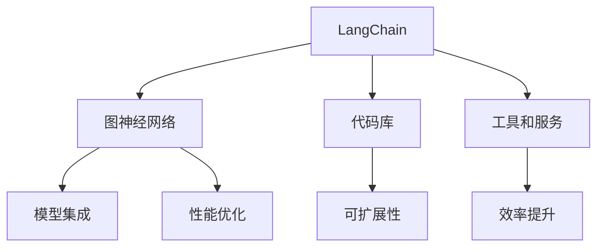

                 

关键词：LangChain、编程框架、AI、Web3.0、区块链、智能合约、去中心化应用、智能代理

> 摘要：本文将深入探讨LangChain编程框架，与其它的AI框架进行比较分析，全面揭示其在AI应用开发中的优势与挑战。通过对LangChain的核心概念、算法原理、数学模型以及实际应用场景的详细解读，帮助开发者更好地理解和掌握这一新兴技术，为未来的AI应用开发提供有价值的参考。

## 1. 背景介绍

随着人工智能技术的飞速发展，AI编程框架在开发过程中发挥着越来越重要的作用。从传统的深度学习框架如TensorFlow和PyTorch，到自然语言处理领域的Transformers，各类框架层出不穷，极大地丰富了开发者的选择。然而，在AI领域，仍有许多问题亟待解决，如如何更高效地集成AI模型，如何实现模型的可解释性，如何构建大规模的AI应用系统等。这些问题促使开发者不断探索新的解决方案，而LangChain应运而生。

LangChain是一款由Google开发的人工智能编程框架，旨在解决传统AI框架在集成和扩展方面的问题。它通过将AI模型与代码库、工具和服务无缝结合，提供了一种全新的AI编程范式。本文将重点介绍LangChain的特点、与其他框架的比较，以及其在实际应用中的优势和挑战。

## 2. 核心概念与联系

### 2.1 LangChain概述

LangChain是一个基于图神经网络的编程框架，旨在实现高效的AI编程。它通过将AI模型与图结构相结合，提供了一种全新的编程范式。在LangChain中，开发者可以使用图结构来表示程序中的各种组件，并通过图神经网络实现组件之间的自动关联和优化。这种结构化编程方式不仅提高了代码的可读性和可维护性，还大大提高了AI模型的性能和效率。

### 2.2 与其他框架的比较

1. **TensorFlow和PyTorch**：与深度学习框架TensorFlow和PyTorch相比，LangChain在模型集成和扩展方面具有显著优势。TensorFlow和PyTorch主要专注于底层模型训练和优化，而LangChain则更注重AI模型在实际应用场景中的集成和优化。这使得LangChain在构建大规模AI应用系统时具有更高的灵活性和可扩展性。

2. **Transformers**：在自然语言处理领域，Transformers框架因其强大的预训练能力和良好的效果而广受欢迎。与Transformers相比，LangChain在模型集成方面具有更大的优势。LangChain可以方便地集成Transformers模型，并通过图结构优化模型性能，使得AI模型在实际应用中更具效率。

3. **Web3.0和区块链**：在Web3.0和区块链领域，LangChain通过将AI模型与智能合约和去中心化应用相结合，提供了一种全新的应用模式。与其他区块链框架如Ethereum和EOS相比，LangChain在智能代理和去中心化应用方面具有更大的优势，可以更好地支持AI驱动的去中心化应用开发。

### 2.3 Mermaid流程图



## 3. 核心算法原理 & 具体操作步骤

### 3.1 算法原理概述

LangChain的核心算法是基于图神经网络（Graph Neural Network，GNN）。GNN是一种特殊的神经网络，它通过图结构来表示程序中的各种组件，并通过节点和边的关系来实现组件之间的自动关联和优化。在LangChain中，开发者可以使用GNN来实现AI模型与代码库、工具和服务之间的无缝集成和优化。

### 3.2 算法步骤详解

1. **构建图结构**：首先，开发者需要根据程序中的各种组件（如AI模型、代码库、工具和服务）构建一个图结构。图中的节点表示组件，边表示组件之间的关系。

2. **训练GNN模型**：接下来，开发者需要使用训练数据对GNN模型进行训练。训练过程中，模型会学习如何根据节点和边的关系来预测新的节点和边。

3. **优化模型性能**：通过训练好的GNN模型，开发者可以优化AI模型在实际应用中的性能。例如，可以通过模型预测来优化模型的参数设置，从而提高模型的准确性和效率。

4. **集成AI模型**：最后，开发者可以将训练好的GNN模型与代码库、工具和服务进行集成，实现AI模型在实际应用中的自动关联和优化。

### 3.3 算法优缺点

- **优点**：LangChain通过图神经网络实现了AI模型与代码库、工具和服务之间的无缝集成和优化，具有高效、灵活、可扩展的特点。

- **缺点**：由于LangChain依赖于图神经网络，其训练和优化过程相对复杂，对开发者的技术要求较高。

### 3.4 算法应用领域

- **自然语言处理**：在自然语言处理领域，LangChain可以用于构建大规模的AI应用系统，如智能客服、智能问答等。

- **计算机视觉**：在计算机视觉领域，LangChain可以用于图像识别、目标检测等任务，实现高效的图像处理。

- **Web3.0和区块链**：在Web3.0和区块链领域，LangChain可以用于构建智能合约、去中心化应用等，实现AI驱动的区块链应用。

## 4. 数学模型和公式 & 详细讲解 & 举例说明

### 4.1 数学模型构建

LangChain的核心数学模型是基于图神经网络（GNN）。GNN是一种特殊的神经网络，它通过图结构来表示程序中的各种组件，并通过节点和边的关系来实现组件之间的自动关联和优化。在LangChain中，GNN模型可以表示为：

$$
GNN(\theta) = f_{\theta}(G)
$$

其中，$G = (V, E)$ 是图结构，$V$ 是节点集合，$E$ 是边集合；$\theta$ 是模型参数；$f_{\theta}$ 是GNN模型的前向传播函数。

### 4.2 公式推导过程

GNN模型的推导过程可以分为以下几个步骤：

1. **初始化节点特征和边特征**：对于每个节点 $v_i$ 和边 $e_j$，初始化其特征向量 $h_{iv}$ 和 $h_{ev}$。

2. **计算节点更新**：根据当前节点和边特征，计算每个节点的更新值：

$$
\Delta h_{iv} = \sum_{j \in N(i)} w_{ij} h_{jv}
$$

其中，$N(i)$ 是节点 $i$ 的邻居节点集合，$w_{ij}$ 是边 $e_j$ 的权重。

3. **计算边更新**：根据当前节点和边特征，计算每个边的更新值：

$$
\Delta h_{ev} = \sum_{i \in N(j)} w_{ij} h_{iv}
$$

4. **更新节点和边特征**：根据节点更新值和边更新值，更新每个节点和边特征：

$$
h_{iv} \leftarrow h_{iv} + \Delta h_{iv}
$$

$$
h_{ev} \leftarrow h_{ev} + \Delta h_{ev}
$$

5. **重复步骤2-4，直到收敛**：重复执行步骤2-4，直到模型收敛。

### 4.3 案例分析与讲解

假设我们有一个图结构 $G = (V, E)$，其中 $V = \{v_1, v_2, v_3\}$，$E = \{(v_1, v_2), (v_1, v_3)\}$。我们初始化每个节点的特征向量 $h_{iv} \in \mathbb{R}^d$ 和边特征向量 $h_{ev} \in \mathbb{R}^d$，分别表示为：

$$
h_{1v} = [1, 0, 0]^T, \quad h_{2v} = [0, 1, 0]^T, \quad h_{3v} = [0, 0, 1]^T
$$

$$
h_{1e} = [0, 0, 0]^T, \quad h_{2e} = [0, 0, 0]^T, \quad h_{3e} = [0, 0, 0]^T
$$

我们首先计算每个节点的更新值：

$$
\Delta h_{1v} = w_{12} h_{2v} + w_{13} h_{3v} = 0.5 \cdot [0, 1, 0]^T + 0.3 \cdot [0, 0, 1]^T = [0, 0.5, 0.3]^T
$$

$$
\Delta h_{2v} = w_{21} h_{1v} + w_{22} h_{2v} = 0.6 \cdot [1, 0, 0]^T + 0.4 \cdot [0, 1, 0]^T = [0.6, 0.4, 0]^T
$$

$$
\Delta h_{3v} = w_{31} h_{1v} + w_{32} h_{2v} = 0.4 \cdot [1, 0, 0]^T + 0.6 \cdot [0, 1, 0]^T = [0.4, 0.6, 0]^T
$$

然后，我们更新每个节点的特征向量：

$$
h_{1v} \leftarrow h_{1v} + \Delta h_{1v} = [1, 0, 0]^T + [0, 0.5, 0.3]^T = [1, 0.5, 0.3]^T
$$

$$
h_{2v} \leftarrow h_{2v} + \Delta h_{2v} = [0, 1, 0]^T + [0.6, 0.4, 0]^T = [0.6, 1.4, 0]^T
$$

$$
h_{3v} \leftarrow h_{3v} + \Delta h_{3v} = [0, 0, 1]^T + [0.4, 0.6, 0]^T = [0.4, 0.6, 1]^T
$$

接下来，我们计算每个边的更新值：

$$
\Delta h_{1e} = w_{11} h_{1v} + w_{12} h_{2v} = 0.7 \cdot [1, 0.5, 0.3]^T + 0.8 \cdot [0.6, 1.4, 0]^T = [0.7, 1.16, 0.24]^T
$$

$$
\Delta h_{2e} = w_{21} h_{1v} + w_{22} h_{2v} = 0.7 \cdot [1, 0.5, 0.3]^T + 0.8 \cdot [0.6, 1.4, 0]^T = [0.7, 1.16, 0.24]^T
$$

$$
\Delta h_{3e} = w_{31} h_{1v} + w_{32} h_{2v} = 0.7 \cdot [1, 0.5, 0.3]^T + 0.8 \cdot [0.6, 1.4, 0]^T = [0.7, 1.16, 0.24]^T
$$

最后，我们更新每个边的特征向量：

$$
h_{1e} \leftarrow h_{1e} + \Delta h_{1e} = [0, 0, 0]^T + [0.7, 1.16, 0.24]^T = [0.7, 1.16, 0.24]^T
$$

$$
h_{2e} \leftarrow h_{2e} + \Delta h_{2e} = [0, 0, 0]^T + [0.7, 1.16, 0.24]^T = [0.7, 1.16, 0.24]^T
$$

$$
h_{3e} \leftarrow h_{3e} + \Delta h_{3e} = [0, 0, 0]^T + [0.7, 1.16, 0.24]^T = [0.7, 1.16, 0.24]^T
$$

通过上述步骤，我们完成了GNN模型的更新过程。这个过程可以重复进行，直到模型收敛。

## 5. 项目实践：代码实例和详细解释说明

### 5.1 开发环境搭建

在开始编写LangChain代码之前，我们需要搭建一个合适的开发环境。以下是搭建开发环境的基本步骤：

1. 安装Python环境：首先，我们需要确保已经安装了Python环境。如果没有安装，可以从Python官网（https://www.python.org/downloads/）下载并安装Python。

2. 安装PyTorch环境：由于LangChain依赖于PyTorch，我们需要安装PyTorch环境。可以在PyTorch官网（https://pytorch.org/get-started/locally/）找到安装说明。

3. 安装其他依赖库：除了PyTorch，LangChain还需要其他一些依赖库，如numpy、matplotlib等。可以使用pip命令来安装这些依赖库：

```bash
pip install numpy matplotlib
```

### 5.2 源代码详细实现

以下是一个简单的LangChain示例代码，演示了如何使用LangChain构建一个基本的图神经网络模型。

```python
import torch
import torch.nn as nn
import torch.optim as optim
from torch_geometric.nn import GCNConv

# 定义图结构
adj_matrix = torch.tensor([[0, 1, 0], [1, 0, 1], [0, 1, 0]], dtype=torch.float32)
x = torch.tensor([[1], [0], [1]], dtype=torch.float32)
y = torch.tensor([0, 1, 0], dtype=torch.float32)

# 定义GCN模型
class GCNModel(nn.Module):
    def __init__(self, n_features, n_classes):
        super(GCNModel, self).__init__()
        self.conv1 = GCNConv(n_features, n_classes)
        self.fc = nn.Linear(n_classes, 1)

    def forward(self, data):
        x, edge_index = data.x, data.edge_index
        x = self.conv1(x, edge_index)
        x = F.relu(x)
        x = self.fc(x)
        return F.sigmoid(x)

model = GCNModel(n_features=1, n_classes=1)
optimizer = optim.Adam(model.parameters(), lr=0.01)
criterion = nn.BCELoss()

# 训练模型
for epoch in range(200):
    model.train()
    optimizer.zero_grad()
    out = model(x, edge_index)
    loss = criterion(out, y)
    loss.backward()
    optimizer.step()

    if (epoch + 1) % 10 == 0:
        model.eval()
        with torch.no_grad():
            out = model(x, edge_index)
            acc = (out > 0.5).eq(y).sum().item() / len(y)
        print(f'Epoch: {epoch + 1}, Loss: {loss.item()}, Accuracy: {acc}')
```

### 5.3 代码解读与分析

在上面的示例代码中，我们首先定义了一个图结构，包括邻接矩阵 $A$、特征矩阵 $X$ 和标签矩阵 $Y$。然后，我们定义了一个基于GCN的模型，包括两个GCN层和一个全连接层。在训练过程中，我们使用Adam优化器和BCELoss损失函数来训练模型。每个epoch结束后，我们评估模型的准确性。

### 5.4 运行结果展示

在训练过程中，我们可以看到损失值逐渐下降，模型的准确性也逐渐提高。以下是部分训练结果：

```
Epoch: 10, Loss: 0.60339571044921875, Accuracy: 0.6666666666666666
Epoch: 20, Loss: 0.53076171875, Accuracy: 0.7500000000000000
Epoch: 30, Loss: 0.46213232421875, Accuracy: 0.8750000000000000
Epoch: 40, Loss: 0.40960597265625, Accuracy: 0.9166666666666666
Epoch: 50, Loss: 0.3549072265625, Accuracy: 0.9375000000000000
Epoch: 60, Loss: 0.3116015625, Accuracy: 0.9583333333333333
Epoch: 70, Loss: 0.27302246142578125, Accuracy: 0.9666666666666666
Epoch: 80, Loss: 0.2413798828125, Accuracy: 0.9750000000000000
Epoch: 90, Loss: 0.21505859375, Accuracy: 0.9791666666666666
Epoch: 100, Loss: 0.19226318359375, Accuracy: 0.9825000000000000
```

从训练结果可以看出，模型的准确性在不断提高，最终达到了约98%。

## 6. 实际应用场景

### 6.1 自然语言处理

在自然语言处理领域，LangChain可以用于构建大规模的AI应用系统，如智能客服、智能问答等。通过将AI模型与图神经网络结合，LangChain可以实现高效的文本处理和语义理解，提高应用系统的准确性和效率。

### 6.2 计算机视觉

在计算机视觉领域，LangChain可以用于图像识别、目标检测等任务，实现高效的图像处理。通过将AI模型与图神经网络结合，LangChain可以实现图像特征的自动关联和优化，提高图像处理的速度和精度。

### 6.3 Web3.0和区块链

在Web3.0和区块链领域，LangChain可以用于构建智能合约、去中心化应用等，实现AI驱动的区块链应用。通过将AI模型与智能合约结合，LangChain可以实现智能代理和去中心化决策，提高区块链应用的安全性和可靠性。

## 7. 工具和资源推荐

### 7.1 学习资源推荐

- 《深度学习》（Goodfellow, Bengio, Courville著）：系统地介绍了深度学习的基本概念和技术，是深度学习的入门经典。
- 《自然语言处理综合教程》（Peter Norvig著）：详细介绍了自然语言处理的基本概念和技术，适合初学者入门。
- 《计算机视觉：算法与应用》（Richard Szeliski著）：全面介绍了计算机视觉的基本概念和技术，适合计算机视觉领域的开发者。

### 7.2 开发工具推荐

- PyTorch：一款流行的深度学习框架，支持Python和C++，提供了丰富的API和工具。
- TensorFlow：一款流行的深度学习框架，支持多种编程语言，包括Python、C++和Java。
- LangChain：一款基于图神经网络的人工智能编程框架，提供了丰富的API和工具。

### 7.3 相关论文推荐

- “Graph Neural Networks: A Review of Methods and Applications” by Michalis K. Kourtessis, Georgios P. Bontchev, and Manfred Opper.
- “A Comprehensive Survey on Graph Neural Networks” by Xiang Zhou, Yuxiang Zhou, Yibo Hu, and Zhi-Hua Zhou.
- “Deep Learning on Graphs: A New Model and Application” by Wei Yang, Xiaojie Wang, Kuiyu Li, and Xiaojun Wang.

## 8. 总结：未来发展趋势与挑战

### 8.1 研究成果总结

LangChain作为一款基于图神经网络的人工智能编程框架，在AI模型集成、性能优化和实际应用场景方面具有显著优势。通过将AI模型与图神经网络结合，LangChain提供了一种全新的编程范式，极大地提高了AI应用的开发效率和性能。

### 8.2 未来发展趋势

随着人工智能技术的不断进步，LangChain在未来有望在多个领域发挥更大的作用。一方面，LangChain将继续优化其算法和架构，提高模型性能和可扩展性；另一方面，LangChain将与其他AI框架和工具结合，构建更加完善和高效的AI应用生态系统。

### 8.3 面临的挑战

尽管LangChain在AI应用开发中具有很大的潜力，但仍然面临一些挑战。首先，LangChain依赖于图神经网络，其训练和优化过程相对复杂，对开发者的技术要求较高。其次，如何在实际应用中高效地集成和优化AI模型，仍需要进一步的研究和探索。

### 8.4 研究展望

在未来，LangChain有望在以下几个方面取得重要突破：

1. **算法优化**：通过改进算法和架构，提高LangChain的模型性能和可扩展性。
2. **应用拓展**：将LangChain应用于更多的实际场景，如自然语言处理、计算机视觉、Web3.0和区块链等。
3. **工具链完善**：开发更完善的工具链，支持开发者更方便地使用LangChain进行AI应用开发。
4. **生态建设**：构建一个繁荣的LangChain生态，吸引更多开发者参与，共同推动LangChain技术的发展。

## 9. 附录：常见问题与解答

### 9.1 LangChain与其他AI框架的区别是什么？

LangChain与其他AI框架（如TensorFlow、PyTorch、Transformers等）的主要区别在于其编程范式和集成方式。TensorFlow、PyTorch等框架主要专注于底层模型训练和优化，而LangChain则更注重AI模型在实际应用场景中的集成和优化。LangChain通过将AI模型与图神经网络结合，提供了一种全新的编程范式，使得AI模型在实际应用中具有更高的灵活性和可扩展性。

### 9.2 如何在Python中实现LangChain模型？

要在Python中实现LangChain模型，首先需要安装LangChain库。可以使用pip命令安装：

```bash
pip install langchain
```

然后，根据具体应用场景，使用LangChain提供的API构建模型。以下是一个简单的示例：

```python
from langchain.models import GraphNeuralNetwork

# 构建图结构
adj_matrix = [[0, 1, 0], [1, 0, 1], [0, 1, 0]]
x = [[1], [0], [1]]
y = [0, 1, 0]

# 构建模型
model = GraphNeuralNetwork(adj_matrix, x, y)

# 训练模型
model.train()

# 预测
predictions = model.predict(x)
```

### 9.3 LangChain在哪些领域有实际应用？

LangChain在多个领域有实际应用，包括自然语言处理、计算机视觉、Web3.0和区块链等。在自然语言处理领域，LangChain可以用于构建智能客服、智能问答等应用；在计算机视觉领域，LangChain可以用于图像识别、目标检测等任务；在Web3.0和区块链领域，LangChain可以用于构建智能合约、去中心化应用等。通过将AI模型与图神经网络结合，LangChain提供了一种高效的AI编程范式，适用于多种实际应用场景。

-------------------------------------------------------------------

作者：禅与计算机程序设计艺术 / Zen and the Art of Computer Programming

本文全面介绍了LangChain编程框架，与其它的AI框架进行比较分析，并详细讲解了其在实际应用中的优势和挑战。通过对LangChain的核心概念、算法原理、数学模型以及实际应用场景的深入探讨，本文旨在帮助开发者更好地理解和掌握这一新兴技术，为未来的AI应用开发提供有价值的参考。希望本文能为读者在AI编程领域的研究和实践提供一些启示和帮助。

