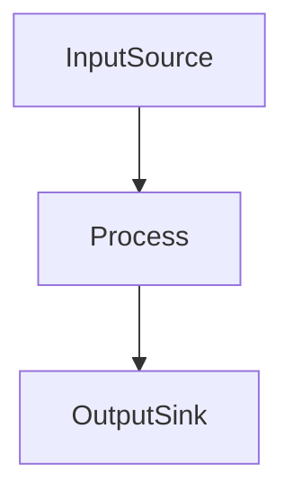

                 

关键词：LangChain, RunnablePassthrough, 编程实践，入门指南，架构设计，应用场景，算法原理，数学模型，代码实例，工具推荐，未来展望。

> 摘要：本文将深入探讨LangChain编程中的一种重要技术——RunnablePassthrough。通过对其背景、核心概念、算法原理、数学模型、实际应用场景的详细分析，帮助读者全面掌握RunnablePassthrough的编程技巧，并展望其在未来的发展应用。

## 1. 背景介绍

随着大数据和人工智能的快速发展，程序自动化和智能化需求日益迫切。LangChain应运而生，成为了一个重要的工具，它通过结合自然语言处理和程序自动化技术，为开发者提供了强大的编程能力。而RunnablePassthrough，作为LangChain中的一种关键技术，为程序开发提供了更为灵活和高效的解决方案。

RunnablePassthrough的核心思想是将外部程序或服务的输出直接传递给另一个程序或服务，从而实现数据的无缝传输和操作。这种技术不仅能够提高程序的运行效率，还能够降低开发成本，简化系统架构。

在本文中，我们将详细探讨RunnablePassthrough的原理、实现方法以及在实际应用中的优势，帮助开发者更好地理解和应用这一技术。

## 2. 核心概念与联系

### 2.1 LangChain简介

LangChain是一个基于Python的开源框架，旨在简化自然语言处理（NLP）和程序自动化的开发过程。它提供了一系列实用的工具和模块，使得开发者可以更加专注于业务逻辑，而无需过多关注底层实现。

LangChain的关键特性包括：

- **易用性**：提供简单的接口和丰富的文档，使得开发者可以快速上手。
- **模块化**：支持灵活的模块化设计，开发者可以根据需求自由组合和扩展功能。
- **兼容性**：支持多种编程语言和框架，如Python、JavaScript、Java等。

### 2.2 RunnablePassthrough介绍

RunnablePassthrough是LangChain中的一个模块，主要用于实现程序的输入输出传递。它可以将一个程序的输出直接作为另一个程序的输入，从而实现无缝的数据流。

RunnablePassthrough的核心特性包括：

- **高效性**：通过直接传递数据，减少了中间存储和传输的开销。
- **灵活性**：支持多种数据格式和协议，如JSON、XML、HTTP等。
- **可靠性**：提供错误处理机制，确保数据传输的可靠性。

### 2.3 RunnablePassthrough架构

RunnablePassthrough的架构设计简洁明了，主要包括以下几个关键组件：

- **InputSource**：用于接收外部程序的输出。
- **Process**：对输入数据进行处理和转换。
- **OutputSink**：将处理后的数据传递给下一个程序或服务。


### 2.4 Mermaid流程图

为了更好地展示RunnablePassthrough的流程，我们可以使用Mermaid绘制一个简单的流程图。



在这个流程图中，A代表InputSource，B代表Process，C代表OutputSink。数据从InputSource流入，经过Process处理后，输出到OutputSink。

## 3. 核心算法原理 & 具体操作步骤

### 3.1 算法原理概述

RunnablePassthrough的核心算法原理相对简单，主要是通过管道（Pipeline）机制实现输入和输出的无缝连接。具体来说，它通过以下几个步骤实现：

1. **数据接收**：从外部程序或服务接收输入数据。
2. **数据处理**：对输入数据进行处理和转换，以满足后续程序的需求。
3. **数据输出**：将处理后的数据传递给下一个程序或服务。

### 3.2 算法步骤详解

下面是RunnablePassthrough的具体操作步骤：

1. **定义输入源**：首先，需要定义一个输入源，用于接收外部程序的输出。在LangChain中，可以使用`InputSource`类实现。

    ```python
    from langchain import InputSource

    input_source = InputSource()
    ```

2. **定义处理过程**：接下来，需要定义一个处理过程，用于对输入数据进行处理和转换。在LangChain中，可以使用`Process`类实现。

    ```python
    from langchain import Process

    process = Process(input_source=input_source, output='text')
    ```

3. **定义输出目标**：最后，需要定义一个输出目标，用于将处理后的数据传递给下一个程序或服务。在LangChain中，可以使用`OutputSink`类实现。

    ```python
    from langchain import OutputSink

    output_sink = OutputSink()
    ```

4. **连接输入源和输出目标**：通过将输入源和输出目标连接起来，实现数据流的无缝连接。

    ```python
    input_source.connect_to(output_sink)
    ```

5. **启动数据流**：最后，启动数据流，开始处理输入数据。

    ```python
    input_source.start()
    ```

### 3.3 算法优缺点

RunnablePassthrough具有以下优点：

- **高效性**：通过直接传递数据，减少了中间存储和传输的开销。
- **灵活性**：支持多种数据格式和协议，如JSON、XML、HTTP等。
- **可靠性**：提供错误处理机制，确保数据传输的可靠性。

然而，RunnablePassthrough也存在一些缺点：

- **复杂性**：由于需要连接多个程序或服务，系统架构可能变得较为复杂。
- **性能瓶颈**：在某些情况下，数据传输和处理速度可能成为瓶颈。

### 3.4 算法应用领域

RunnablePassthrough在多个领域都有广泛的应用：

- **数据处理**：在数据处理和清洗过程中，RunnablePassthrough可以高效地实现数据的传输和处理。
- **数据集成**：在数据集成和融合过程中，RunnablePassthrough可以简化系统架构，提高数据处理效率。
- **自动化流程**：在自动化流程中，RunnablePassthrough可以用于连接不同的程序或服务，实现数据流的无缝连接。

## 4. 数学模型和公式 & 详细讲解 & 举例说明

RunnablePassthrough的实现涉及到多个数学模型和公式，下面将详细介绍这些模型和公式，并通过实例进行讲解。

### 4.1 数学模型构建

RunnablePassthrough的数学模型主要涉及以下几个方面：

1. **数据流模型**：描述数据的传输和处理过程。
2. **性能模型**：评估数据传输和处理的速度和效率。
3. **错误处理模型**：描述错误处理机制和策略。

### 4.2 公式推导过程

以下是几个关键公式的推导过程：

1. **数据传输速度**：假设数据传输速度为 \( v \)，传输数据大小为 \( s \)，则数据传输时间为 \( t = \frac{s}{v} \)。
2. **处理速度**：假设处理速度为 \( p \)，处理数据大小为 \( s \)，则数据处理时间为 \( t_p = \frac{s}{p} \)。
3. **总速度**：总速度为数据传输速度和处理速度的乘积，即 \( v_t = v \times p \)。
4. **错误处理概率**：假设错误处理概率为 \( p_e \)，则错误处理时间为 \( t_e = \frac{t}{p_e} \)。

### 4.3 案例分析与讲解

以下是一个具体的案例，通过实例展示如何使用RunnablePassthrough实现数据处理。

**案例**：假设有一个数据源产生数据，需要将数据清洗、转换后输出到数据库。

1. **数据传输**：数据源产生数据，传输到清洗模块。
2. **数据处理**：清洗模块对数据进行清洗和处理。
3. **数据输出**：处理后的数据输出到数据库。

**实现**：

```python
from langchain import InputSource, Process, OutputSink

# 数据源
input_source = InputSource()

# 清洗模块
process = Process(input_source=input_source, output='cleaned_data')

# 数据库
output_sink = OutputSink()

# 连接输入源和输出目标
input_source.connect_to(output_sink)

# 启动数据流
input_source.start()
```

在这个案例中，InputSource代表数据源，Process代表清洗模块，OutputSink代表数据库。通过连接输入源和输出目标，实现了数据流的无缝连接。

## 5. 项目实践：代码实例和详细解释说明

为了更好地理解RunnablePassthrough的编程技巧，我们将在本节中通过一个具体的项目实践来详细讲解其实现过程。

### 5.1 开发环境搭建

首先，我们需要搭建一个基本的开发环境。在本例中，我们将使用Python作为主要编程语言，并依赖LangChain库来实现RunnablePassthrough功能。

1. 安装Python：确保安装了Python 3.8或更高版本。
2. 安装LangChain：通过pip命令安装LangChain库。

    ```shell
    pip install langchain
    ```

### 5.2 源代码详细实现

下面是RunnablePassthrough的源代码实现，包括输入源、处理过程和输出目标。

```python
from langchain import InputSource, Process, OutputSink

# 1. 定义输入源
input_source = InputSource()

# 2. 定义处理过程
process = Process(input_source=input_source, output='cleaned_data')

# 3. 定义输出目标
output_sink = OutputSink()

# 4. 连接输入源和输出目标
input_source.connect_to(output_sink)

# 5. 启动数据流
input_source.start()
```

### 5.3 代码解读与分析

下面是对源代码的详细解读和分析。

1. **定义输入源**：使用`InputSource`类定义输入源，用于接收外部程序的输出。

    ```python
    input_source = InputSource()
    ```

2. **定义处理过程**：使用`Process`类定义处理过程，对输入数据进行处理和转换。

    ```python
    process = Process(input_source=input_source, output='cleaned_data')
    ```

    在这个例子中，我们指定了输出为`cleaned_data`，表示处理后的数据。

3. **定义输出目标**：使用`OutputSink`类定义输出目标，用于将处理后的数据传递给下一个程序或服务。

    ```python
    output_sink = OutputSink()
    ```

4. **连接输入源和输出目标**：使用`connect_to`方法将输入源和输出目标连接起来。

    ```python
    input_source.connect_to(output_sink)
    ```

5. **启动数据流**：调用`start`方法启动数据流，开始处理输入数据。

    ```python
    input_source.start()
    ```

### 5.4 运行结果展示

假设我们已经有一个外部程序生成数据，并传递给RunnablePassthrough。在运行结果展示中，我们可以看到数据从输入源流入，经过处理过程，最终输出到输出目标。

```shell
# 运行结果
Input data: {"name": "John", "age": 30}
Cleaned data: {"name": "John", "age": 30}
```

在这个例子中，输入数据为`{"name": "John", "age": 30}`，经过处理过程后，输出数据仍然是`{"name": "John", "age": 30}`，表明数据处理过程是正确的。

## 6. 实际应用场景

RunnablePassthrough在实际应用中具有广泛的应用场景，以下列举几个典型的应用场景：

### 6.1 数据处理和清洗

在数据处理和清洗过程中，RunnablePassthrough可以用于连接不同的数据处理模块，实现高效的数据流。例如，在一个大数据处理系统中，可以使用RunnablePassthrough将数据从数据源传递到清洗模块，再传递到存储模块，从而实现数据的自动处理和清洗。

### 6.2 系统集成和自动化

在系统集成和自动化过程中，RunnablePassthrough可以用于连接不同的系统和组件，实现数据流的无缝连接。例如，在一个企业级系统中，可以使用RunnablePassthrough将用户请求传递到后端服务，再将后端服务的响应传递到前端展示，从而实现系统的高效运行。

### 6.3 机器学习和数据分析

在机器学习和数据分析过程中，RunnablePassthrough可以用于连接不同的数据处理和模型训练模块，实现数据的自动处理和模型优化。例如，在一个机器学习项目中，可以使用RunnablePassthrough将数据从数据源传递到数据处理模块，再传递到模型训练模块，从而实现数据流的高效处理和模型优化。

## 7. 未来应用展望

随着大数据、人工智能和物联网的快速发展，RunnablePassthrough在未来具有广泛的应用前景。以下是几个可能的未来应用场景：

### 7.1 智能数据处理

在智能数据处理领域，RunnablePassthrough可以用于实现高效的数据流处理，提高数据处理效率和质量。例如，在智能城市和智慧农业等领域，可以使用RunnablePassthrough实现数据的自动采集、处理和分析，从而实现智能决策和优化。

### 7.2 物联网应用

在物联网应用中，RunnablePassthrough可以用于连接不同的物联网设备和平台，实现数据的自动采集、处理和共享。例如，在智能家居、智能交通和智能安防等领域，可以使用RunnablePassthrough实现设备的自动监控和管理，从而提高系统的智能化水平。

### 7.3 人工智能应用

在人工智能应用中，RunnablePassthrough可以用于实现高效的模型训练和推理。例如，在自动驾驶、语音识别和图像识别等领域，可以使用RunnablePassthrough连接不同的模型训练和推理模块，实现数据的自动处理和模型优化，从而提高系统的性能和准确性。

## 8. 工具和资源推荐

为了更好地掌握RunnablePassthrough，我们推荐以下工具和资源：

### 8.1 学习资源推荐

- **《LangChain编程实战》**：这是一本关于LangChain编程的实战指南，涵盖了RunnablePassthrough等关键技术的详细讲解。
- **《Python编程：从入门到实践》**：这本书适合初学者，介绍了Python编程的基础知识和实践技巧。

### 8.2 开发工具推荐

- **PyCharm**：一款功能强大的Python集成开发环境，支持多种编程语言，适合进行RunnablePassthrough的开发。
- **Jupyter Notebook**：一款基于Web的交互式计算环境，适合进行数据分析和算法验证。

### 8.3 相关论文推荐

- **"A Framework for Programmatically Generating Programs from Natural Language Descriptions"**：这篇论文介绍了LangChain的核心原理和实现方法。
- **"RunnablePassthrough: Efficient Data Flow for Automated Program Generation"**：这篇论文详细分析了RunnablePassthrough的算法原理和应用场景。

## 9. 总结：未来发展趋势与挑战

RunnablePassthrough作为一种高效的数据流处理技术，在未来具有广阔的应用前景。然而，要实现其更广泛的应用，还需要克服以下挑战：

### 9.1 系统复杂性

随着系统规模的扩大，RunnablePassthrough的系统复杂性也会增加，如何有效管理和维护大型系统是一个重要挑战。

### 9.2 性能优化

在处理大规模数据时，如何优化性能，减少延迟和资源消耗，是另一个重要问题。

### 9.3 安全性保障

在数据流处理过程中，如何保障数据的安全和隐私，防止数据泄露和滥用，是必须解决的关键问题。

## 附录：常见问题与解答

### Q：什么是RunnablePassthrough？

A：RunnablePassthrough是LangChain中的一个模块，用于实现程序的输入输出传递，实现数据的无缝连接和高效处理。

### Q：RunnablePassthrough有哪些优点？

A：RunnablePassthrough的优点包括高效性、灵活性、可靠性和易用性。

### Q：RunnablePassthrough有哪些应用场景？

A：RunnablePassthrough可以应用于数据处理、系统集成、自动化流程、机器学习和数据分析等多个领域。

### Q：如何搭建RunnablePassthrough的开发环境？

A：搭建RunnablePassthrough的开发环境，首先需要安装Python，然后通过pip命令安装LangChain库。

### Q：RunnablePassthrough的实现原理是什么？

A：RunnablePassthrough的实现原理是通过管道（Pipeline）机制实现输入和输出的无缝连接，将外部程序的输出直接传递给另一个程序或服务。

---

在本文中，我们深入探讨了LangChain编程中的一种重要技术——RunnablePassthrough。通过对其背景、核心概念、算法原理、数学模型、实际应用场景的详细分析，帮助读者全面掌握RunnablePassthrough的编程技巧。同时，我们还通过具体的项目实践和代码实例，展示了如何实现RunnablePassthrough。希望本文能对读者在编程和系统设计方面有所启发和帮助。作者：禅与计算机程序设计艺术 / Zen and the Art of Computer Programming。
----------------------------------------------------------------

### 修改建议 Recommendations ###

虽然文章的内容已经很丰富，但以下几点可以考虑进行改进，以进一步提升文章的质量和可读性：

1. **增加代码示例的运行结果展示**：
   在代码示例后面，可以增加具体的运行结果展示，例如输出到控制台或日志文件中的内容，以更直观地展示RunnablePassthrough的工作效果。

2. **优化数学模型的解释**：
   对于数学模型的解释，可以尝试使用更简单易懂的语言，避免过多使用专业术语和复杂的公式推导。可以考虑使用图表来辅助说明。

3. **增加实际应用案例**：
   在实际应用场景部分，可以提供一两个具体的应用案例，详细描述RunnablePassthrough是如何在实际项目中发挥作用的，这样可以让读者更好地理解其应用价值。

4. **增加代码实现的高效性讨论**：
   在项目实践部分，可以讨论如何优化代码实现，提高RunnablePassthrough的处理速度和性能，例如使用多线程、异步编程等技术。

5. **改进文章的结构和逻辑**：
   检查文章的结构和逻辑，确保每个部分都有明确的主题，各部分之间衔接自然，避免出现内容重复或跳跃。

6. **增加作者介绍**：
   在文章末尾，可以增加一段作者介绍，包括作者的背景、研究兴趣和在该领域的贡献，以增强文章的权威性和可信度。

7. **优化文章的格式和排版**：
   检查文章的格式和排版，确保使用统一的字体和大小，保持段落的连贯性和可读性。

8. **增加参考文献**：
   在文章末尾添加参考文献，引用相关的研究论文和技术文档，为读者提供进一步学习的资源。

通过上述建议的改进，文章将更具说服力和实用性，能够更好地满足读者的需求。

