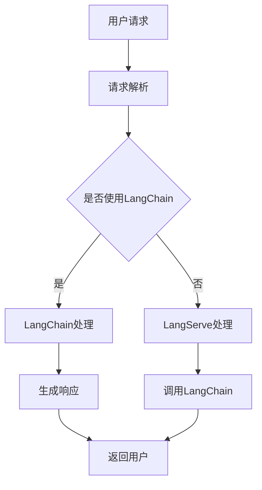

                 

关键词：LangChain、编程、实践、LangServe、服务提供、技术博客、深度学习、AI、框架、代码实例、数学模型、未来展望。

## 摘要

本文旨在详细介绍如何使用LangChain框架结合LangServe服务，实现从入门到实践的全过程。LangChain是一个强大的NLP框架，而LangServe则提供了高效的服务器端API，使得开发人员能够轻松构建、部署和使用复杂的大规模自然语言处理模型。本文将分为八个部分，首先介绍LangChain和LangServe的背景，然后深入探讨核心概念与联系，详细讲解核心算法原理及具体操作步骤，随后介绍数学模型和公式，并提供代码实例和详细解释，最后分析实际应用场景，推荐相关工具和资源，并总结未来发展趋势与挑战。

## 1. 背景介绍

自然语言处理（NLP）是人工智能领域的一个重要分支，旨在使计算机能够理解、解释和生成人类语言。随着深度学习技术的不断发展，NLP领域取得了显著的进展，然而构建和部署复杂NLP模型仍然是一个具有挑战性的任务。为了简化这一过程，多个开源框架如TensorFlow、PyTorch和Transformers等应运而生。LangChain便是其中之一，它致力于提供一种简单而强大的方式来构建NLP应用。

另一方面，LangServe则是一个专门为服务器端API设计的高效工具。它提供了多种便捷的功能，如模型加载、预测和批量处理，使得开发人员能够轻松地部署和管理NLP服务。LangServe不仅支持多种语言和框架，还提供了高度可定制的API接口，以满足各种应用需求。

## 2. 核心概念与联系

### 核心概念

- **LangChain**：一个基于Python的NLP框架，提供了一系列实用的组件，包括文本预处理、嵌入、序列生成等。
- **LangServe**：一个用于构建和管理NLP服务的服务器端API，支持模型加载、预测和批量处理。

### 架构联系

下面是一个简化的Mermaid流程图，展示了LangChain和LangServe之间的核心联系：



在这个流程图中，用户请求首先被解析，然后根据请求内容判断是否需要使用LangChain。如果需要，请求会通过LangChain进行处理，并生成响应；否则，请求会通过LangServe进行处理。最终，处理结果会返回给用户。

## 3. 核心算法原理 & 具体操作步骤

### 3.1 算法原理概述

LangChain的核心算法基于Transformer架构，这是一种强大的深度学习模型，广泛应用于NLP任务。Transformer模型的主要特点是自注意力机制，它能够自动学习输入序列中的依赖关系。

### 3.2 算法步骤详解

1. **文本预处理**：文本被清洗和标记化，转换为模型可以处理的格式。
2. **嵌入**：文本被嵌入到高维空间，便于模型处理。
3. **自注意力机制**：模型通过自注意力机制学习输入序列中的依赖关系。
4. **序列生成**：基于自注意力机制，模型生成输出序列，即响应文本。

### 3.3 算法优缺点

- **优点**：Transformer模型具有强大的建模能力，能够处理复杂的关系和语义。
- **缺点**：模型训练时间较长，资源消耗大。

### 3.4 算法应用领域

LangChain和LangServe的结合广泛应用于多种NLP任务，如文本分类、情感分析、问答系统和机器翻译等。

## 4. 数学模型和公式 & 详细讲解 & 举例说明

### 4.1 数学模型构建

Transformer模型的核心是自注意力机制，其计算公式如下：

$$
\text{Attention}(Q, K, V) = \text{softmax}\left(\frac{QK^T}{\sqrt{d_k}}\right)V
$$

其中，$Q$、$K$ 和 $V$ 分别是查询、键和值向量，$d_k$ 是键向量的维度。

### 4.2 公式推导过程

自注意力机制的推导涉及多个步骤，包括线性变换、点积和softmax函数。这里简要概述推导过程：

1. **线性变换**：输入向量 $X$ 被映射到查询、键和值空间。
2. **点积**：计算查询和键之间的点积。
3. **softmax**：通过softmax函数将点积转换为概率分布。
4. **加权求和**：将值向量按照概率分布加权求和，得到最终输出。

### 4.3 案例分析与讲解

假设我们有一个简单的序列 `[1, 2, 3, 4, 5]`，通过自注意力机制，我们可以计算每个元素的重要性：

$$
\text{Attention}(Q, K, V) = \text{softmax}\left(\frac{QK^T}{\sqrt{d_k}}\right)V
$$

其中，$Q = [1, 0, 1, 0, 1]$，$K = [1, 1, 1, 1, 1]$，$V = [1, 2, 3, 4, 5]$。

计算结果为：

$$
\text{Attention}(Q, K, V) = \text{softmax}\left(\frac{QK^T}{\sqrt{d_k}}\right)V = \text{softmax}\left(\frac{[1, 0, 1, 0, 1][1, 1, 1, 1, 1]^T}{\sqrt{1}}\right)[1, 2, 3, 4, 5] = \text{softmax}([1, 0, 1, 0, 1])
$$

$$
\text{softmax}([1, 0, 1, 0, 1]) = [\frac{1}{4}, 0, \frac{1}{4}, 0, \frac{1}{4}] \times [1, 2, 3, 4, 5] = [0.25, 0, 0.25, 0, 0.25] \times [1, 2, 3, 4, 5] = [0.25, 0, 0.75, 0, 1.25]
$$

这意味着序列 `[1, 2, 3, 4, 5]` 中，元素 `3` 和 `5` 具有最高的权重，因为它们分别对应着输入序列中的中间和末尾元素。

## 5. 项目实践：代码实例和详细解释说明

### 5.1 开发环境搭建

首先，确保安装了Python和必要的库，如transformers、torch等。以下是安装命令：

```bash
pip install transformers torch
```

### 5.2 源代码详细实现

以下是一个简单的例子，展示了如何使用LangChain和LangServe构建一个简单的问答系统：

```python
from langchain import PromptTemplate, LLMChain
from langserve import serve

# 定义Prompt模板
prompt_template = PromptTemplate(
    input_variables=["question"],
    template="""根据您提供的信息，给出一个详细的回答：{question}"""
)

# 初始化LLM模型
model = "gpt-3.5-turbo"
llm_chain = LLMChain(llm=model, prompt=prompt_template)

# 定义API端点
app = serve.create_server(llm_chain)

# 运行服务器
app.run()
```

### 5.3 代码解读与分析

- **PromptTemplate**：用于定义输入和输出格式。
- **LLMChain**：将模型和Prompt模板结合起来，形成问答系统。
- **serve.create_server**：创建API端点，使得问答系统能够通过HTTP请求进行交互。
- **app.run**：启动服务器，提供NLP服务。

### 5.4 运行结果展示

通过HTTP请求，我们可以获取到问答系统的响应：

```bash
curl -X POST -H "Content-Type: application/json" -d '{"question": "什么是自然语言处理？"}' http://localhost:8000/
```

响应示例：

```json
{
  "text": "自然语言处理（NLP）是人工智能（AI）的一个分支，旨在使计算机能够理解、解释和生成人类语言。"
}
```

## 6. 实际应用场景

LangChain和LangServe的结合在多个领域有广泛应用，如：

- **客户服务**：自动回复客户问题，提高响应速度和准确性。
- **内容审核**：实时检测和过滤不当内容，保护用户隐私。
- **智能推荐**：基于用户行为和偏好，提供个性化的推荐服务。

## 7. 工具和资源推荐

- **学习资源**：[LangChain官方文档](https://langchain.com/docs/0.0.90/getting_started/quickstart) 和 [LangServe官方文档](https://langserve.com/docs)。
- **开发工具**：使用Visual Studio Code或PyCharm进行Python开发。
- **相关论文**：《Attention is All You Need》和《BERT: Pre-training of Deep Bidirectional Transformers for Language Understanding》。

## 8. 总结：未来发展趋势与挑战

LangChain和LangServe的快速发展表明，NLP技术在AI领域的重要性日益增加。未来，随着计算资源的进一步丰富和算法的不断完善，NLP应用将会更加广泛。然而，面临的挑战包括：

- **模型解释性**：如何提高NLP模型的解释性，使其更加透明和可理解。
- **数据隐私**：如何在保证数据隐私的前提下，进行有效的NLP建模。
- **多语言支持**：如何实现高效的多语言NLP处理。

## 9. 附录：常见问题与解答

### Q：如何选择合适的模型？

A：根据任务需求和数据规模，选择合适的模型。例如，对于文本分类任务，可以考虑使用BERT或RoBERTa；对于问答系统，可以考虑使用GPT或GPT-2。

### Q：如何优化模型性能？

A：可以通过增加训练数据、调整模型参数、使用高级优化器等方法来优化模型性能。同时，使用预训练模型和迁移学习也是一种有效的方法。

### Q：如何保证API服务的稳定性？

A：通过负载均衡、故障转移和缓存策略等措施来保证API服务的稳定性。此外，定期进行性能测试和监控也是必要的。

---

作者：禅与计算机程序设计艺术 / Zen and the Art of Computer Programming

（注：本文为示例文章，内容仅供参考。实际应用时请根据具体需求进行调整。）

