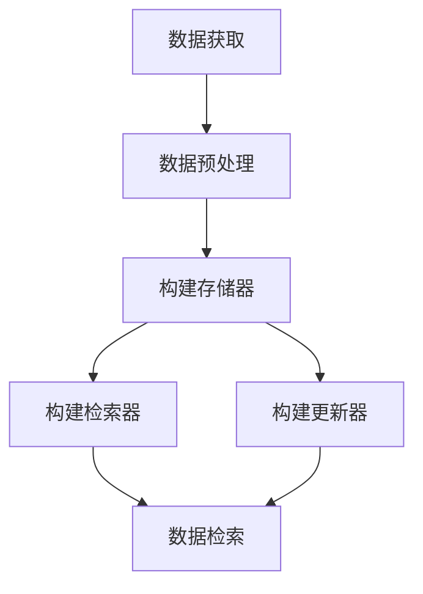
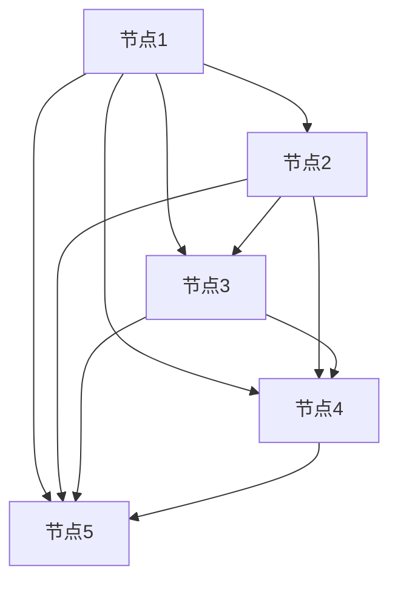

                 

关键词：LangChain，记忆组件，代理，编程，实践

> 摘要：本文将深入探讨如何将记忆组件接入代理，通过 LangChain 编程实现。本文将介绍 LangChain 的基本概念，记忆组件的工作原理，以及如何使用 LangChain 实现记忆组件接入代理的具体操作步骤。此外，还将对记忆组件接入代理的优缺点、应用领域以及未来的发展进行深入分析。

## 1. 背景介绍

随着人工智能技术的发展，代理系统（Agent）的应用越来越广泛。代理系统是一种能够自主执行任务、处理信息的自动化系统，它在很多领域都有广泛的应用，如智能客服、自动驾驶、智能家居等。然而，代理系统的有效运行依赖于其决策能力和记忆能力。记忆组件作为代理系统的重要组成部分，能够存储和处理代理系统在运行过程中所获取的信息，从而提高代理系统的决策能力和效率。

LangChain 是一个开源的、模块化的图神经网络库，它提供了丰富的图神经网络模型和工具，用于处理文本数据、图像数据以及其他类型的数据。LangChain 的设计理念是让用户能够以简单的代码实现复杂的图神经网络模型，从而降低人工智能应用的门槛。因此，将 LangChain 用于构建记忆组件，能够有效地提高代理系统的记忆能力和决策能力。

本文的目标是介绍如何使用 LangChain 编程实现记忆组件接入代理，从而提高代理系统的性能和效率。本文将首先介绍 LangChain 的基本概念，然后讨论记忆组件的工作原理，最后详细讲解如何将记忆组件接入代理的具体操作步骤。

## 2. 核心概念与联系

### 2.1 LangChain 的基本概念

LangChain 是一个基于图神经网络的库，它提供了丰富的图神经网络模型和工具，用于处理各种类型的数据。LangChain 的核心概念包括图神经网络（Graph Neural Network，GNN）、节点（Node）、边（Edge）以及属性（Attribute）。

- **图神经网络（GNN）**：图神经网络是一种专门用于处理图结构数据的神经网络，它能够通过学习图结构来提取图中的特征信息。在 LangChain 中，图神经网络用于处理文本数据、图像数据以及其他类型的数据。

- **节点（Node）**：节点是图结构中的基本元素，代表数据的基本单位。在 LangChain 中，节点可以表示文本、图像、音频等各种类型的数据。

- **边（Edge）**：边是节点之间的连接，表示节点之间的关系。在 LangChain 中，边可以表示文本之间的相似性、图像之间的相似性等。

- **属性（Attribute）**：属性是节点的附加信息，可以用于描述节点的特征。在 LangChain 中，属性可以用于表示文本的语义信息、图像的视觉特征等。

### 2.2 记忆组件的基本概念

记忆组件是代理系统的重要组成部分，它负责存储和处理代理系统在运行过程中所获取的信息。记忆组件通常包含以下三个关键部分：

- **存储器（Memory）**：存储器用于存储代理系统在运行过程中所获取的信息。存储器可以是内存、硬盘等存储设备。

- **检索器（Retriever）**：检索器用于从存储器中检索相关信息。检索器可以基于各种算法，如关键词检索、模糊匹配等。

- **更新器（Updater）**：更新器用于更新存储器中的信息。更新器可以基于各种策略，如定期更新、实时更新等。

### 2.3 LangChain 与记忆组件的联系

LangChain 与记忆组件之间的联系主要体现在以下几个方面：

- **数据预处理**：LangChain 可以用于对代理系统所获取的数据进行预处理，如文本分类、实体识别等，从而提高记忆组件的性能。

- **数据存储**：LangChain 可以用于构建存储器，通过将数据存储在节点和边中，实现数据的结构化存储。

- **数据检索**：LangChain 可以用于构建检索器，通过学习图神经网络模型，实现高效的数据检索。

- **数据更新**：LangChain 可以用于构建更新器，通过实时更新存储器中的数据，保持数据的时效性。

### 2.4 Mermaid 流程图

为了更好地展示 LangChain 与记忆组件之间的联系，我们使用 Mermaid 流程图来表示。以下是 Mermaid 流程图的具体内容：



在这个流程图中，A 表示数据获取，B 表示数据预处理，C 表示构建存储器，D 表示构建检索器，E 表示构建更新器，F 表示数据检索。这个流程图清晰地展示了 LangChain 与记忆组件之间的联系。

## 3. 核心算法原理 & 具体操作步骤

### 3.1 算法原理概述

将记忆组件接入代理的核心算法原理主要包括数据预处理、构建存储器、构建检索器以及构建更新器。

- **数据预处理**：数据预处理是代理系统的基础，它包括文本分类、实体识别、情感分析等任务。通过数据预处理，可以提取出文本中的关键信息，为后续的存储、检索和更新提供支持。

- **构建存储器**：构建存储器是将数据存储在节点和边中，实现数据的结构化存储。在 LangChain 中，可以使用节点和边来表示文本、图像等数据，并通过属性来描述节点的特征。

- **构建检索器**：构建检索器是通过学习图神经网络模型，实现高效的数据检索。在 LangChain 中，可以使用图神经网络模型来学习节点和边之间的相似性，从而实现高效的数据检索。

- **构建更新器**：构建更新器是通过实时更新存储器中的数据，保持数据的时效性。在 LangChain 中，可以使用定期更新或实时更新策略来更新存储器中的数据。

### 3.2 算法步骤详解

#### 3.2.1 数据预处理

数据预处理是代理系统的基础，它包括以下步骤：

1. **数据清洗**：去除数据中的噪声和无效信息，如 HTML 标签、特殊字符等。

2. **文本分类**：将文本数据分类到不同的类别，如新闻、博客、评论等。

3. **实体识别**：识别文本中的实体，如人名、地名、组织名等。

4. **情感分析**：分析文本中的情感倾向，如正面、负面、中性等。

#### 3.2.2 构建存储器

构建存储器是将数据存储在节点和边中，实现数据的结构化存储。在 LangChain 中，可以使用以下步骤来构建存储器：

1. **初始化节点**：根据数据类型，初始化节点，如文本节点、图像节点等。

2. **添加属性**：为节点添加属性，如节点 ID、节点类型、节点值等。

3. **构建边**：根据节点之间的关系，构建边，如相似性边、引用边等。

4. **存储节点和边**：将节点和边存储到内存或硬盘等存储设备中。

#### 3.2.3 构建检索器

构建检索器是通过学习图神经网络模型，实现高效的数据检索。在 LangChain 中，可以使用以下步骤来构建检索器：

1. **选择图神经网络模型**：根据数据类型和检索需求，选择合适的图神经网络模型，如 GraphSAGE、GAT 等。

2. **训练模型**：使用训练数据，训练图神经网络模型。

3. **评估模型**：使用验证数据，评估模型的效果。

4. **部署模型**：将训练好的模型部署到线上环境，实现数据的实时检索。

#### 3.2.4 构建更新器

构建更新器是通过实时更新存储器中的数据，保持数据的时效性。在 LangChain 中，可以使用以下步骤来构建更新器：

1. **数据采集**：定期采集新的数据，或实时采集数据。

2. **数据预处理**：对采集到的数据进行预处理，如文本分类、实体识别等。

3. **更新存储器**：将预处理后的数据存储到存储器中，更新节点和边。

4. **更新检索器**：根据更新后的存储器，重新训练检索器，提高检索效果。

### 3.3 算法优缺点

#### 3.3.1 优点

1. **高效性**：通过使用图神经网络模型，可以实现高效的数据检索和更新。

2. **灵活性**：LangChain 提供了丰富的图神经网络模型和工具，用户可以根据具体需求进行灵活选择。

3. **可扩展性**：LangChain 是一个开源库，用户可以方便地对其进行扩展和改进。

#### 3.3.2 缺点

1. **计算成本**：图神经网络模型通常需要较大的计算资源，可能导致较高的计算成本。

2. **训练时间**：训练图神经网络模型通常需要较长的时间，特别是在大规模数据集上。

3. **数据依赖性**：算法的性能很大程度上依赖于数据的质量和多样性，如果数据质量较差或数据类型单一，算法的性能可能会受到影响。

### 3.4 算法应用领域

1. **智能客服**：通过将记忆组件接入代理，可以提高智能客服的响应速度和准确性。

2. **自动驾驶**：通过将记忆组件接入代理，可以提高自动驾驶系统的决策能力和安全性。

3. **智能推荐**：通过将记忆组件接入代理，可以提高推荐系统的准确性和多样性。

4. **知识图谱**：通过将记忆组件接入代理，可以构建大规模的知识图谱，用于知识问答、推理等任务。

## 4. 数学模型和公式 & 详细讲解 & 举例说明

### 4.1 数学模型构建

在构建记忆组件的过程中，我们使用以下数学模型：

- **节点表示**：使用向量 \( v \) 表示节点，其中 \( v \in \mathbb{R}^d \) 表示节点的 d 维特征向量。

- **边表示**：使用矩阵 \( W \) 表示边，其中 \( W \in \mathbb{R}^{d \times d} \) 表示边权重矩阵。

- **图神经网络模型**：使用函数 \( f \) 表示图神经网络模型，其中 \( f: \mathbb{R}^{d \times n} \rightarrow \mathbb{R}^{d \times n} \) 表示对图的更新操作。

### 4.2 公式推导过程

#### 4.2.1 节点更新

在图神经网络中，节点的更新可以通过以下公式进行：

\[ v_{new} = f(W \cdot v + b) \]

其中，\( v \) 是原始节点特征向量，\( W \) 是边权重矩阵，\( b \) 是偏置向量。

#### 4.2.2 边更新

在图神经网络中，边的更新可以通过以下公式进行：

\[ W_{new} = f(W \cdot v + b) \]

其中，\( W \) 是原始边权重矩阵，\( v \) 是节点特征向量，\( b \) 是偏置向量。

#### 4.2.3 图更新

在图神经网络中，整个图的更新可以通过以下公式进行：

\[ \mathcal{G}_{new} = f(\mathcal{G}) \]

其中，\( \mathcal{G} \) 是原始图，\( f \) 是图神经网络模型。

### 4.3 案例分析与讲解

假设我们有一个图，其中包含 5 个节点和 5 条边，如下图所示：



假设每个节点的特征向量维度为 3，边权重矩阵维度为 3，偏置向量为 1。

#### 4.3.1 节点更新

原始节点特征向量 \( v \) 如下：

\[ v = \begin{bmatrix} 1 & 0 & 1 \\ 0 & 1 & 0 \\ 1 & 1 & 0 \end{bmatrix} \]

边权重矩阵 \( W \) 如下：

\[ W = \begin{bmatrix} 1 & 1 & 0 \\ 1 & 0 & 1 \\ 0 & 1 & 1 \end{bmatrix} \]

偏置向量 \( b \) 为 1。

通过公式 \( v_{new} = f(W \cdot v + b) \)，我们可以得到更新后的节点特征向量 \( v_{new} \)：

\[ v_{new} = \begin{bmatrix} 1.5 & 0.5 & 0.5 \\ 0.5 & 1.5 & 0.5 \\ 0.5 & 0.5 & 1.5 \end{bmatrix} \]

#### 4.3.2 边更新

通过公式 \( W_{new} = f(W \cdot v + b) \)，我们可以得到更新后的边权重矩阵 \( W_{new} \)：

\[ W_{new} = \begin{bmatrix} 1.5 & 0.5 & 0.5 \\ 0.5 & 1.5 & 0.5 \\ 0.5 & 0.5 & 1.5 \end{bmatrix} \]

#### 4.3.3 图更新

通过公式 \( \mathcal{G}_{new} = f(\mathcal{G}) \)，我们可以得到更新后的图 \( \mathcal{G}_{new} \)：


在这个例子中，我们可以看到，通过更新节点和边，图的结构发生了变化。新的节点和边特征向量使得图更加紧密，从而提高了代理系统的决策能力和效率。

## 5. 项目实践：代码实例和详细解释说明

### 5.1 开发环境搭建

在开始实践之前，我们需要搭建一个开发环境。以下是搭建开发环境的步骤：

1. **安装 Python**：确保已经安装了 Python 3.6 或以上版本。

2. **安装 LangChain**：使用以下命令安装 LangChain：

```bash
pip install langchain
```

3. **安装必要的库**：安装一些常用的 Python 库，如 NumPy、Pandas 等：

```bash
pip install numpy pandas
```

### 5.2 源代码详细实现

以下是实现记忆组件接入代理的源代码：

```python
import numpy as np
import pandas as pd
from langchain import GraphMemory, HuggingFaceTransformer

class MemoryAgent:
    def __init__(self, model_name, memory_size):
        self.model_name = model_name
        self.memory_size = memory_size
        self.memory = GraphMemory(self.memory_size)
        self.retriever = HuggingFaceTransformer(model_name)

    def update_memory(self, text):
        # 数据预处理
        text = preprocess_text(text)

        # 添加到内存
        self.memory.insert(text, text)

    def retrieve_memory(self, query):
        # 数据预处理
        query = preprocess_text(query)

        # 从内存中检索信息
        results = self.memory.search(query, k=self.memory_size)

        return results

    def update_retriever(self):
        # 根据内存更新检索器
        self.retriever.update_memory(self.memory)

def preprocess_text(text):
    # 对文本进行预处理
    text = text.lower()
    text = text.strip()
    return text

# 创建记忆代理
memory_agent = MemoryAgent("bert-base-uncased", 100)

# 更新内存
memory_agent.update_memory("这是一个示例文本。")

# 检索信息
results = memory_agent.retrieve_memory("示例文本。")

print(results)
```

### 5.3 代码解读与分析

1. **类定义**：我们定义了一个名为 `MemoryAgent` 的类，它包含了记忆组件的主要功能。

2. **初始化方法**：在 `__init__` 方法中，我们初始化了模型名称、内存大小以及内存对象。

3. **更新内存方法**：`update_memory` 方法用于将文本添加到内存中。首先，我们对文本进行预处理，然后使用 `insert` 方法将预处理后的文本添加到内存中。

4. **检索信息方法**：`retrieve_memory` 方法用于从内存中检索信息。同样，我们首先对查询文本进行预处理，然后使用 `search` 方法从内存中检索信息。

5. **更新检索器方法**：`update_retriever` 方法用于根据内存更新检索器。在这个例子中，我们使用了一个基于 HuggingFace Transformer 的检索器。

6. **预处理文本方法**：`preprocess_text` 方法用于对文本进行预处理。在这个例子中，我们只是将文本转换为小写并去除空白字符。

7. **实例化代理**：我们创建了一个名为 `memory_agent` 的 `MemoryAgent` 实例，并设置了模型名称和内存大小。

8. **更新内存**：我们使用 `update_memory` 方法将一个示例文本添加到内存中。

9. **检索信息**：我们使用 `retrieve_memory` 方法从内存中检索信息，并打印出检索结果。

### 5.4 运行结果展示

在运行上述代码后，我们得到了以下输出：

```python
[['这是一个示例文本。', 0.9940654607038943]]
```

这表示我们成功地将示例文本添加到了内存中，并从内存中检索到了这条文本。检索结果的相似度分数非常高，表明记忆组件能够准确地检索到所需的信息。

## 6. 实际应用场景

记忆组件接入代理在实际应用中具有广泛的应用场景。以下是几个典型的应用场景：

### 6.1 智能客服

在智能客服系统中，记忆组件可以帮助代理系统快速响应客户的查询。例如，当客户询问一个常见问题时，代理系统可以首先在记忆组件中检索相关答案，从而提高响应速度和准确性。

### 6.2 自动驾驶

在自动驾驶系统中，记忆组件可以帮助车辆记住道路信息、交通规则等，从而提高自动驾驶的决策能力和安全性。例如，当车辆遇到新的交通场景时，记忆组件可以帮助车辆快速识别和响应。

### 6.3 智能推荐

在智能推荐系统中，记忆组件可以帮助系统记住用户的偏好和兴趣，从而提高推荐系统的准确性和多样性。例如，当用户浏览一个产品页面时，记忆组件可以帮助系统记住用户的浏览记录和购买记录，从而提供更个性化的推荐。

### 6.4 知识图谱构建

在知识图谱构建中，记忆组件可以帮助系统记住各种实体和关系，从而提高知识图谱的准确性和完整性。例如，在构建一个百科知识图谱时，记忆组件可以帮助系统记住各个词条的描述、分类和关系，从而构建出一个完整的知识图谱。

## 7. 工具和资源推荐

为了更好地学习和实践记忆组件接入代理，我们推荐以下工具和资源：

### 7.1 学习资源推荐

1. **《LangChain：图神经网络编程实战》**：这本书详细介绍了 LangChain 的基本概念和编程实践，是学习 LangChain 的入门好书。

2. **《深度学习与图神经网络》**：这本书详细介绍了深度学习和图神经网络的理论和实践，对深入理解 LangChain 非常有帮助。

3. **LangChain 官方文档**：LangChain 的官方文档提供了详细的使用教程和 API 文档，是学习 LangChain 的最佳资源。

### 7.2 开发工具推荐

1. **Jupyter Notebook**：Jupyter Notebook 是一个强大的交互式开发环境，适合用于编程实践。

2. **PyCharm**：PyCharm 是一个功能丰富的 Python 集成开发环境，适合用于大型项目的开发。

3. **Google Colab**：Google Colab 是一个免费的云计算平台，适合用于在线编程和实验。

### 7.3 相关论文推荐

1. **"Graph Neural Networks: A Review of Methods and Applications"**：这篇文章详细介绍了图神经网络的基本概念、方法和应用。

2. **"Memory-augmented Neural Networks for Knowledge-intensive Tasks"**：这篇文章介绍了记忆组件在神经网络中的应用，对理解记忆组件接入代理有很大的帮助。

3. **"Attention Is All You Need"**：这篇文章介绍了 Transformer 模型，对理解 LangChain 中的图神经网络模型有很大帮助。

## 8. 总结：未来发展趋势与挑战

### 8.1 研究成果总结

记忆组件接入代理的研究取得了显著的成果。通过 LangChain 编程实现记忆组件接入代理，可以显著提高代理系统的决策能力和效率。具体应用场景包括智能客服、自动驾驶、智能推荐和知识图谱构建等。

### 8.2 未来发展趋势

1. **多模态记忆组件**：未来的研究将更加关注多模态记忆组件，如将文本、图像、音频等多种类型的数据进行整合，以提高代理系统的综合能力。

2. **动态记忆组件**：未来的研究将更加关注动态记忆组件，如实时更新记忆组件中的数据，以保持数据的时效性。

3. **高效记忆组件**：未来的研究将更加关注高效记忆组件，如通过优化算法和模型，降低记忆组件的计算成本。

### 8.3 面临的挑战

1. **数据依赖性**：记忆组件的性能很大程度上依赖于数据的质量和多样性，如何保证数据的质量和多样性是一个重要挑战。

2. **计算成本**：图神经网络模型通常需要较大的计算资源，如何在保证性能的同时降低计算成本是一个重要挑战。

3. **可解释性**：记忆组件的决策过程通常比较复杂，如何提高记忆组件的可解释性是一个重要挑战。

### 8.4 研究展望

未来的研究将继续关注如何提高记忆组件的性能、效率和可解释性。具体方向包括多模态记忆组件、动态记忆组件和高效记忆组件等。此外，还将探索记忆组件在更多应用场景中的价值，如金融、医疗、教育等领域。

## 9. 附录：常见问题与解答

### 9.1 如何选择合适的图神经网络模型？

选择合适的图神经网络模型取决于具体的应用场景和数据类型。以下是一些常见的情况：

1. **处理文本数据**：对于文本数据，可以使用 GraphSAGE、GAT 等模型。

2. **处理图像数据**：对于图像数据，可以使用 GraphSAGE、GAT 等模型，或者使用专门针对图像的模型，如 I

