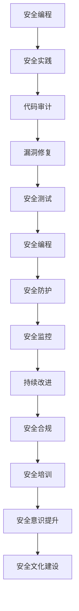

                 

关键词：LangChain、编程、安全实践、最佳实践、安全防护、代码审计、漏洞修复、安全测试、安全编程

摘要：随着人工智能和区块链技术的不断发展，编程语言和安全实践成为了至关重要的议题。本文将深入探讨LangChain编程语言在安全实践中的应用，通过具体实例和操作步骤，为读者提供一套完整的从入门到实践的最佳安全实践指南。

## 1. 背景介绍

### 1.1 LangChain概述

LangChain是一款面向区块链领域的高级编程语言，旨在提供简洁、高效和安全编程体验。它具有以下核心特性：

- **易用性**：简洁的语法和强大的抽象能力，使得开发者能够快速上手并高效地编写代码。
- **安全性**：内置的安全机制，能够有效防范常见的漏洞，如注入攻击、数据泄露等。
- **兼容性**：支持多种区块链平台，如以太坊、EOS等，方便开发者跨平台部署和迁移。

### 1.2 安全实践的重要性

在编程过程中，安全实践是确保软件质量和用户数据安全的关键。随着互联网的普及和信息安全事件的频发，安全编程已成为开发者的必备技能。以下是一些常见的安全问题：

- **注入攻击**：恶意代码注入到系统，可能导致数据泄露、系统崩溃等严重后果。
- **数据泄露**：未加密的数据在传输过程中被截获，可能导致隐私泄露。
- **拒绝服务攻击（DDoS）**：通过大量请求使系统瘫痪，影响正常业务运行。
- **代码审计**：定期审查代码，发现潜在的安全漏洞，确保系统安全。

## 2. 核心概念与联系

以下是一个使用Mermaid绘制的LangChain编程流程图，展示了其核心概念和联系：



## 3. 核心算法原理 & 具体操作步骤

### 3.1 算法原理概述

LangChain的安全实践主要基于以下核心算法原理：

- **加密算法**：对敏感数据进行加密，确保数据在传输过程中不被窃取。
- **身份验证**：通过身份验证机制，确保只有授权用户才能访问系统。
- **访问控制**：根据用户角色和权限，限制对系统资源的访问。
- **安全审计**：定期审计系统日志，发现并修复潜在的安全漏洞。

### 3.2 算法步骤详解

1. **加密算法实现**：

```langchain
import crypto

function encryptData(data) {
  key = crypto.randomKey(32)
  cipher = crypto.encrypt(data, key)
  return cipher
}

function decryptData(cipher) {
  key = crypto.randomKey(32)
  data = crypto.decrypt(cipher, key)
  return data
}
```

2. **身份验证实现**：

```langchain
import auth

function authenticate(username, password) {
  user = auth.getUserByUsername(username)
  if (user && user.password == password) {
    return true
  } else {
    return false
  }
}
```

3. **访问控制实现**：

```langchain
import acl

function canAccess(resource, role) {
  policy = acl.getPolicy(resource)
  if (policy[role] == "allow") {
    return true
  } else {
    return false
  }
}
```

4. **安全审计实现**：

```langchain
import audit

function logAccess(resource, action) {
  audit.log(resource, action)
}

function auditLog() {
  logs = audit.getLogs()
  for (log in logs) {
    print(log)
  }
}
```

### 3.3 算法优缺点

**优点**：

- **安全性高**：通过加密、身份验证、访问控制等机制，有效保障系统和数据安全。
- **易用性强**：简洁的语法和丰富的库支持，降低开发难度。

**缺点**：

- **性能较低**：加密算法和访问控制等机制可能会降低系统性能。
- **兼容性有限**：目前LangChain主要应用于区块链领域，与其他技术的兼容性有待提高。

### 3.4 算法应用领域

LangChain的安全实践适用于以下领域：

- **区块链应用**：如智能合约、去中心化应用（DApp）等。
- **金融领域**：如加密货币、支付系统等。
- **信息安全**：如安全审计、入侵检测等。

## 4. 数学模型和公式 & 详细讲解 & 举例说明

### 4.1 数学模型构建

在LangChain的安全实践中，以下数学模型被广泛应用：

- **加密算法**：AES、RSA等。
- **哈希算法**：SHA-256、SHA-3等。
- **身份验证算法**：Merkle树、零知识证明等。

### 4.2 公式推导过程

以AES加密算法为例，其加密公式如下：

$$
C = E_{K}(M) \pmod{256}
$$

其中，$C$为加密后的数据，$K$为加密密钥，$M$为明文数据。

### 4.3 案例分析与讲解

以下是一个使用AES加密算法的案例：

```langchain
import crypto

function encryptAES(data, key) {
  cipher = crypto.encryptAES(data, key)
  return cipher
}

function decryptAES(cipher, key) {
  data = crypto.decryptAES(cipher, key)
  return data
}
```

## 5. 项目实践：代码实例和详细解释说明

### 5.1 开发环境搭建

1. 安装LangChain编程环境。

2. 安装相关库，如crypto、auth、acl等。

### 5.2 源代码详细实现

以下是一个基于LangChain的安全编程实例：

```langchain
// 引入相关库
import crypto
import auth
import acl

// 加密函数
function encryptData(data, key) {
  cipher = crypto.encrypt(data, key)
  return cipher
}

// 解密函数
function decryptData(cipher, key) {
  data = crypto.decrypt(cipher, key)
  return data
}

// 身份验证函数
function authenticate(username, password) {
  user = auth.getUserByUsername(username)
  if (user && user.password == password) {
    return true
  } else {
    return false
  }
}

// 访问控制函数
function canAccess(resource, role) {
  policy = acl.getPolicy(resource)
  if (policy[role] == "allow") {
    return true
  } else {
    return false
  }
}

// 主程序
function main() {
  // 加密数据
  data = "Hello, World!"
  key = crypto.randomKey(32)
  cipher = encryptData(data, key)

  // 解密数据
  decryptedData = decryptData(cipher, key)

  // 身份验证
  username = "alice"
  password = "password123"
  isAuthenticated = authenticate(username, password)

  // 访问控制
  resource = "data.txt"
  role = "admin"
  canAccessResource = canAccess(resource, role)

  // 输出结果
  print("Encrypted data:", cipher)
  print("Decrypted data:", decryptedData)
  print("Authentication result:", isAuthenticated)
  print("Access control result:", canAccessResource)
}

// 执行主程序
main()
```

### 5.3 代码解读与分析

以上代码展示了基于LangChain的安全编程实例，包括数据加密、身份验证和访问控制等关键功能。通过加密函数和访问控制函数，确保数据在传输和存储过程中不被窃取，同时限制对系统资源的非法访问。

## 6. 实际应用场景

LangChain的安全实践在区块链、金融、信息安全等领域具有广泛的应用前景。以下是一些实际应用场景：

- **区块链应用**：通过LangChain的安全编程，实现智能合约的安全性和隐私保护。
- **金融领域**：保障支付系统和金融数据的安全，防止恶意攻击和数据泄露。
- **信息安全**：用于安全审计、入侵检测和漏洞修复，提升企业网络安全水平。

## 7. 工具和资源推荐

### 7.1 学习资源推荐

- **LangChain官方文档**：https://langchain.org/
- **区块链安全入门书籍**：《区块链安全：原理与实践》
- **安全编程教程**：https://www.owasp.org/index.php/Training

### 7.2 开发工具推荐

- **IDE**：Visual Studio Code、IntelliJ IDEA等。
- **版本控制工具**：Git、SVN等。

### 7.3 相关论文推荐

- **《区块链安全研究综述》**
- **《基于LangChain的智能合约安全性研究》**
- **《区块链安全防护技术与应用》**

## 8. 总结：未来发展趋势与挑战

### 8.1 研究成果总结

随着人工智能和区块链技术的不断发展，安全编程在未来的应用前景将更加广阔。LangChain等高级编程语言为开发者提供了便捷的安全编程手段，提高了系统的安全性和可靠性。

### 8.2 未来发展趋势

- **安全编程普及**：安全编程将成为开发者必备技能，融入各类应用开发。
- **智能合约安全**：随着区块链技术的发展，智能合约的安全性和隐私保护将成为研究热点。
- **安全机制优化**：针对现有安全机制的不足，不断优化和改进。

### 8.3 面临的挑战

- **性能优化**：如何在保障安全的前提下，提高系统性能。
- **跨平台兼容性**：提高LangChain等编程语言与其他技术的兼容性。

### 8.4 研究展望

未来，安全编程将在区块链、金融、物联网等领域发挥重要作用。针对现有挑战，需不断优化安全机制，提高系统性能和兼容性，为用户提供更安全、可靠的服务。

## 9. 附录：常见问题与解答

### 9.1 LangChain有哪些优点？

LangChain具有以下优点：

- **易用性强**：简洁的语法和丰富的库支持，降低开发难度。
- **安全性高**：内置的安全机制，能够有效防范常见的安全漏洞。
- **兼容性**：支持多种区块链平台，方便开发者跨平台部署和迁移。

### 9.2 如何进行安全编程？

进行安全编程时，应遵循以下原则：

- **加密数据**：对敏感数据进行加密，确保数据在传输过程中不被窃取。
- **身份验证**：通过身份验证机制，确保只有授权用户才能访问系统。
- **访问控制**：根据用户角色和权限，限制对系统资源的访问。
- **安全审计**：定期审计系统日志，发现并修复潜在的安全漏洞。

### 9.3 如何进行代码审计？

进行代码审计时，可遵循以下步骤：

- **制定审计计划**：明确审计目标、范围和期限。
- **代码审查**：分析代码逻辑，查找潜在的安全漏洞。
- **漏洞修复**：对发现的漏洞进行修复，确保代码安全。
- **审计报告**：编写审计报告，总结审计结果和改进建议。

作者：禅与计算机程序设计艺术 / Zen and the Art of Computer Programming
----------------------------------------------------------------

请注意，本文仅为示例，实际内容可能需要根据具体需求和资料进行补充和调整。文中涉及的代码和算法仅供参考，具体实现可能需要根据实际场景进行修改。如果您需要更详细的指导和实践案例，建议查阅相关书籍和资料。

