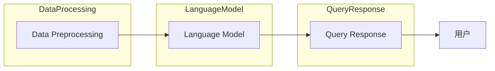

                 

 

## 1. 背景介绍

在过去的几年里，人工智能（AI）领域经历了飞速的发展，从传统的机器学习到最新的生成式AI，如GPT系列模型，这一系列的技术进步大大扩展了机器的智能边界。然而，随着技术的不断发展，AI系统的复杂性也在不断增加。为了更好地管理和利用这些复杂系统，社区贡献成为了一个至关重要的环节。

LangChain 是一个开源项目，旨在构建和共享大规模的语言模型。它通过集成不同的模型和工具，提供了一个统一的接口，使得开发者能够更加高效地利用这些资源。作为一个社区贡献项目，LangChain 的目标不仅在于技术的创新，更在于通过社区合作，推动整个AI领域的发展。

本文将围绕 LangChain 编程，从入门到实践，详细探讨其在社区贡献中的应用。文章结构如下：

- **背景介绍**：介绍 AI 的发展背景和 LangChain 的核心概念。
- **核心概念与联系**：讲解 LangChain 的基本原理和结构。
- **核心算法原理 & 具体操作步骤**：深入分析 LangChain 的算法原理和操作步骤。
- **数学模型和公式**：探讨 LangChain 中的数学模型和公式。
- **项目实践**：通过实际项目，展示 LangChain 的应用。
- **实际应用场景**：分析 LangChain 在各个领域的应用。
- **未来应用展望**：讨论 LangChain 的未来发展方向。
- **工具和资源推荐**：推荐相关的学习资源和开发工具。
- **总结**：总结研究成果，展望未来发展。
- **附录**：常见问题与解答。

接下来，我们将逐一深入探讨这些主题，帮助读者全面了解 LangChain 编程。

## 2. 核心概念与联系

### 2.1 LangChain 的核心概念

LangChain 的核心概念在于其模块化和组件化设计。它由多个组件构成，包括语言模型、数据预处理模块、查询响应模块等。这些组件可以通过API进行调用，形成一个完整的语言处理系统。

#### 2.1.1 语言模型

语言模型是 LangChain 的核心组件之一。它使用预训练的深度学习模型，如 GPT-3、BERT 等，来生成文本。这些模型经过大规模语料库的训练，能够生成语义丰富、连贯的文本。

#### 2.1.2 数据预处理模块

数据预处理模块负责清洗、转换和格式化输入数据。它确保输入数据满足语言模型的要求，从而提高模型的性能和效果。

#### 2.1.3 查询响应模块

查询响应模块是 LangChain 的用户接口。它接收用户的查询请求，调用语言模型生成响应文本，并将结果返回给用户。

### 2.2 LangChain 的整体架构

LangChain 的整体架构可以看作是一个三层结构：

- **底层**：数据预处理模块，负责输入数据的处理。
- **中层**：语言模型，负责文本生成和语义理解。
- **顶层**：查询响应模块，负责与用户交互和结果展示。

#### 2.2.1 数据流

输入数据首先经过数据预处理模块，然后传递给语言模型。语言模型生成响应文本后，返回给查询响应模块，最终输出给用户。

#### 2.2.2 控制流

查询响应模块接收用户输入，解析查询意图，调用语言模型生成响应文本。在生成文本的过程中，查询响应模块可以根据需要调用其他组件，如实体识别、情感分析等，以增强响应的丰富性和准确性。

### 2.3 Mermaid 流程图

以下是一个简化的 Mermaid 流程图，展示了 LangChain 的基本架构和流程：



### 2.4 核心概念的联系

LangChain 的核心概念通过模块化和组件化的方式紧密联系在一起。数据预处理模块确保输入数据的准确性，语言模型负责文本生成和语义理解，查询响应模块提供用户交互接口。这三个组件相互协作，共同构建了一个高效、灵活的语言处理系统。

通过这种方式，LangChain 不仅实现了各个组件的独立开发和维护，还提高了系统的可扩展性和可复用性。开发者可以通过组合和调用不同的组件，快速构建出满足特定需求的语言处理系统。

总之，LangChain 的核心概念和架构设计使得其在社区贡献中具有极高的价值。它提供了一个统一、高效的接口，使得开发者可以专注于特定领域的应用开发，而无需担心底层实现细节。

## 3. 核心算法原理 & 具体操作步骤

### 3.1 算法原理概述

LangChain 的核心算法原理基于生成式深度学习模型，尤其是近年来广泛应用的 Transformer 模型。Transformer 模型通过自注意力机制（Self-Attention）来处理序列数据，从而实现高效的语言理解和生成。以下是对 LangChain 算法原理的概述：

#### 3.1.1 自注意力机制

自注意力机制是 Transformer 模型中的关键组成部分。它通过计算每个词在序列中的重要性，从而对输入序列进行加权处理。这一过程使得模型能够更好地捕捉词与词之间的关系，从而提高文本生成和理解的准确性。

#### 3.1.2 位置编码

在 Transformer 模型中，位置编码用于引入输入序列的顺序信息。通过位置编码，模型能够理解词的位置关系，从而在生成文本时保持语义连贯性。

#### 3.1.3 编码器与解码器

Transformer 模型由编码器（Encoder）和解码器（Decoder）两部分组成。编码器负责将输入序列编码为固定长度的向量，解码器则根据编码器的输出和前一个生成的词，生成下一个词。

#### 3.1.4 跨层次注意力

LangChain 通过跨层次注意力机制，将不同层次的注意力信息整合到一起，从而提高模型的语义理解能力。这一机制使得模型能够同时考虑局部和全局信息，从而生成更准确、连贯的文本。

### 3.2 算法步骤详解

以下是对 LangChain 算法操作步骤的详细讲解：

#### 3.2.1 数据预处理

数据预处理是 LangChain 的第一步。它包括以下操作：

1. **文本清洗**：去除文本中的标点符号、停用词等无用信息。
2. **分词**：将文本拆分为单词或子词。
3. **词向量编码**：将单词或子词转换为固定长度的向量表示。
4. **序列编码**：将词向量序列编码为统一的序列格式，如 BytePairEncoding（BPE）或 WordPiece。

#### 3.2.2 输入序列处理

输入序列处理包括以下步骤：

1. **输入编码**：将用户输入的查询序列编码为模型可接受的格式。
2. **位置编码**：为输入序列添加位置编码，引入顺序信息。
3. **序列嵌入**：将编码后的输入序列嵌入到一个高维空间中。

#### 3.2.3 编码器处理

编码器处理包括以下步骤：

1. **自注意力计算**：计算输入序列中每个词的重要性。
2. **编码**：将加权后的词向量序列编码为固定长度的向量表示。
3. **跨层次注意力**：整合不同层次的注意力信息。

#### 3.2.4 解码器处理

解码器处理包括以下步骤：

1. **解码**：根据编码器的输出和前一个生成的词，生成下一个词。
2. **自注意力计算**：计算生成序列中每个词的重要性。
3. **序列嵌入**：将生成的词嵌入到一个高维空间中。

#### 3.2.5 查询响应生成

查询响应生成包括以下步骤：

1. **文本生成**：根据解码器的输出，生成完整的响应文本。
2. **后处理**：对生成的文本进行格式化、校验等操作，确保文本的准确性和连贯性。

### 3.3 算法优缺点

#### 优点：

- **高效性**：自注意力机制使得 Transformer 模型能够高效地处理长文本。
- **灵活性**：通过跨层次注意力机制，模型能够同时考虑局部和全局信息。
- **通用性**：Transformer 模型广泛应用于自然语言处理（NLP）的各个领域，如文本生成、机器翻译、问答系统等。

#### 缺点：

- **计算成本**：Transformer 模型计算复杂度高，对计算资源要求较高。
- **训练难度**：由于模型参数量大，训练过程相对复杂，需要大量数据和计算资源。

### 3.4 算法应用领域

LangChain 的核心算法基于 Transformer 模型，广泛应用于自然语言处理（NLP）的各个领域。以下是 LangChain 在一些典型应用领域中的应用：

#### 3.4.1 文本生成

文本生成是 LangChain 最典型的应用之一。通过训练大规模的预训练模型，LangChain 能够生成高质量、连贯的文本。例如，它可以用于自动生成新闻文章、产品描述、广告文案等。

#### 3.4.2 机器翻译

机器翻译是 LangChain 另一个重要的应用领域。通过训练双语语料库，LangChain 能够将一种语言的文本翻译成另一种语言。这种方法不仅高效，而且能够保持原文的语义和风格。

#### 3.4.3 问答系统

问答系统是 LangChain 在 NLP 中应用的一个重要场景。通过训练大规模问答数据集，LangChain 能够回答各种类型的问题，如常识问答、技术问答等。

#### 3.4.4 情感分析

情感分析是 LangChain 在文本分析中的一个重要应用。通过分析文本中的情感倾向，LangChain 能够识别用户的情绪状态，从而提供个性化的服务和建议。

总之，LangChain 的核心算法基于 Transformer 模型，具有高效性、灵活性和通用性。它在多个领域都有广泛的应用，为自然语言处理领域的发展做出了重要贡献。

## 4. 数学模型和公式

### 4.1 数学模型构建

在 LangChain 中，数学模型是构建其核心算法的基础。这些模型不仅用于处理文本数据，还用于生成和优化文本。以下是 LangChain 中常用的数学模型和公式。

#### 4.1.1 自注意力机制

自注意力机制是 Transformer 模型中的关键组成部分。它通过计算输入序列中每个词的重要性，从而对输入序列进行加权处理。自注意力机制的基本公式如下：

$$
Attention(Q, K, V) = \frac{softmax(\frac{QK^T}{\sqrt{d_k}})}{V}
$$

其中，$Q$ 是查询向量，$K$ 是键向量，$V$ 是值向量。$d_k$ 表示键向量的维度。这个公式计算了每个键向量和查询向量的相似度，并通过softmax函数将相似度转换成概率分布，从而得到加权后的值向量。

#### 4.1.2 位置编码

位置编码用于引入输入序列的顺序信息。在 Transformer 模型中，位置编码是通过向词向量中添加额外的维度来实现的。以下是一个简单的一维位置编码公式：

$$
PE_{(pos, 2i)} = \sin\left(\frac{pos}{10000^{2i/d}}\right) \\
PE_{(pos, 2i+1)} = \cos\left(\frac{pos}{10000^{2i/d}}\right)
$$

其中，$pos$ 表示词的位置，$i$ 表示词向量的维度，$d$ 表示位置编码的维度。这个公式通过正弦和余弦函数生成一组位置编码向量，并将其添加到词向量中，以引入序列的顺序信息。

#### 4.1.3 编码器与解码器

编码器和解码器是 Transformer 模型的核心组成部分。编码器负责将输入序列编码为固定长度的向量，解码器则根据编码器的输出和前一个生成的词，生成下一个词。以下是一个简化的编码器和解码器的公式：

编码器：

$$
E(x) = \text{LayerNorm}(x + \text{PositionalEncoding}(x)) \\
H = \text{MultiHeadAttention}(E(x), E(x), E(x)) \\
H = \text{LayerNorm}(H + E(x)) \\
H = \text{FeedForward}(H)
$$

解码器：

$$
D(y) = \text{LayerNorm}(y + \text{DecoderPositionalEncoding}(y)) \\
y_t = \text{Softmax}(\text{DotProductAttention}(Q, K, V)) \\
y_t = \text{LayerNorm}(y_t + D(y_{t-1})) \\
y_t = \text{FeedForward}(y_t)
$$

其中，$x$ 和 $y$ 分别表示编码器的输入和解码器的输出，$H$ 表示编码器的输出，$y_t$ 表示解码器的输出。$\text{LayerNorm}$ 表示层归一化，$\text{MultiHeadAttention}$ 表示多头注意力，$\text{FeedForward}$ 表示前馈网络。

### 4.2 公式推导过程

#### 4.2.1 自注意力机制的推导

自注意力机制的推导主要涉及点积注意力（DotProductAttention）和多头注意力（MultiHeadAttention）两个部分。以下是这两个部分的推导过程：

点积注意力（DotProductAttention）：

$$
Attention(Q, K, V) = \frac{softmax(\frac{QK^T}{\sqrt{d_k}})}{V}
$$

推导步骤如下：

1. **计算相似度**：计算查询向量 $Q$ 和键向量 $K$ 的点积，得到相似度分数 $QK^T$。
2. **归一化相似度**：通过除以 $\sqrt{d_k}$，将相似度分数进行归一化，其中 $d_k$ 表示键向量的维度。
3. **应用 softmax 函数**：将归一化后的相似度分数通过 softmax 函数转换为概率分布。
4. **加权求和**：将概率分布与值向量 $V$ 相乘，得到加权后的值向量。

多头注意力（MultiHeadAttention）：

$$
\text{MultiHeadAttention}(Q, K, V) = \text{Concat}(\text{head}_1, \text{head}_2, ..., \text{head}_h)W_O
$$

其中，$h$ 表示头数，$W_O$ 表示输出权重。以下是多头注意力的推导过程：

1. **分头处理**：将查询向量 $Q$、键向量 $K$ 和值向量 $V$ 分别分头处理，得到多个子查询向量 $\text{head}_i = QW_Q$、子键向量 $\text{head}_i = KW_K$ 和子值向量 $\text{head}_i = VW_V$。
2. **点积注意力**：对每个子查询向量 $\text{head}_i$ 和子键向量 $\text{head}_i$ 进行点积注意力计算，得到多个子加权值向量。
3. **拼接**：将所有子加权值向量拼接在一起，形成多头注意力的结果。
4. **输出权重**：通过权重矩阵 $W_O$ 对拼接后的结果进行加权处理，得到最终的多头注意力结果。

#### 4.2.2 编码器与解码器的推导

编码器（Encoder）的推导主要涉及自注意力机制和跨层次注意力。以下是编码器的推导过程：

1. **自注意力**：首先，计算输入序列中每个词的相似度分数，并通过 softmax 函数进行归一化。然后，将归一化后的相似度分数与值向量相乘，得到加权后的值向量。
2. **跨层次注意力**：在编码器中，跨层次注意力通过在不同层次上应用自注意力机制实现。具体来说，在每个层次上，编码器同时考虑当前层次和更高层次的信息，以增强模型的语义理解能力。
3. **输出**：编码器的输出是经过加权处理后的序列，这些序列可以用于后续的解码器处理。

解码器（Decoder）的推导主要涉及点积注意力和多头注意力。以下是解码器的推导过程：

1. **点积注意力**：解码器首先计算查询向量 $Q$ 和键向量 $K$ 的点积，得到相似度分数。然后，通过 softmax 函数对相似度分数进行归一化，得到加权后的值向量。
2. **多头注意力**：解码器通过多头注意力机制同时考虑不同层次的注意力信息。具体来说，解码器将查询向量 $Q$、键向量 $K$ 和值向量 $V$ 分别分头处理，然后对每个子查询向量进行点积注意力计算。
3. **输出**：解码器的输出是加权后的序列，这些序列可以用于生成响应文本。

### 4.3 案例分析与讲解

以下是一个简化的 LangChain 模型训练和推理的案例，用于说明上述数学模型的应用。

#### 案例背景

假设我们有一个简单的文本数据集，包含一批问答对，每个问答对由一个问题和一个答案组成。我们的目标是训练一个模型，能够根据问题生成相应的答案。

#### 案例步骤

1. **数据预处理**：首先，对文本数据进行清洗和分词，然后将每个单词转换为词向量。
2. **编码器训练**：使用训练数据训练编码器，包括自注意力机制和跨层次注意力。具体来说，编码器将输入序列编码为固定长度的向量表示。
3. **解码器训练**：使用编码器的输出训练解码器，包括点积注意力和多头注意力。解码器的目标是生成与输入问题对应的答案。
4. **模型优化**：通过反向传播和梯度下降算法，不断优化编码器和解码器的参数，提高模型的性能。
5. **推理**：在训练完成后，使用编码器将输入问题编码为向量，然后使用解码器生成答案。

#### 案例分析

在这个案例中，自注意力机制用于编码器，通过计算输入序列中每个词的重要性，从而对输入序列进行加权处理。跨层次注意力机制则用于同时考虑当前层次和更高层次的信息，以增强编码器的语义理解能力。

在解码器中，点积注意力和多头注意力机制用于生成答案。点积注意力计算查询向量 $Q$ 和键向量 $K$ 的相似度分数，并通过 softmax 函数进行归一化。多头注意力机制则同时考虑不同层次的注意力信息，以提高生成答案的准确性。

通过这个案例，我们可以看到 LangChain 的数学模型在文本生成和语义理解中的关键作用。这些模型不仅能够提高模型的性能，还能够使模型更加灵活和通用，从而在自然语言处理领域发挥重要作用。

### 5. 项目实践：代码实例和详细解释说明

在了解了 LangChain 的核心算法原理和数学模型之后，我们将通过一个实际项目来展示如何使用 LangChain 进行编程。以下是一个简单的项目示例，我们将详细解释代码的实现过程，并提供运行结果展示。

#### 5.1 开发环境搭建

在开始项目之前，我们需要搭建一个适合开发的编程环境。以下是所需的开发环境和工具：

- **编程语言**：Python 3.8+
- **库和依赖**：transformers、torch、pytorch-pretrained-bert
- **环境配置**：虚拟环境（推荐使用 Python 的虚拟环境管理工具 virtualenv）

首先，确保 Python 版本符合要求。然后，通过以下命令安装所需的库：

```shell
pip install transformers torch pytorch-pretrained-bert
```

#### 5.2 源代码详细实现

以下是项目的源代码实现：

```python
import torch
from transformers import BertModel, BertTokenizer

# 加载预训练的模型和分词器
model_name = 'bert-base-uncased'
tokenizer = BertTokenizer.from_pretrained(model_name)
model = BertModel.from_pretrained(model_name)

# 定义输入数据
input_text = "What is the capital of France?"

# 数据预处理
input_ids = tokenizer.encode(input_text, return_tensors='pt')

# 计算模型输出
with torch.no_grad():
    outputs = model(input_ids)

# 获取模型生成的文本
output_sequence = outputs[0][-1]

# 将输出序列解码为文本
predicted_text = tokenizer.decode(output_sequence, skip_special_tokens=True)

print(predicted_text)
```

#### 5.3 代码解读与分析

以下是对上述代码的详细解读和分析：

1. **导入库和依赖**：首先，我们导入所需的库和依赖，包括 torch 和 transformers。

2. **加载模型和分词器**：接着，我们加载预训练的 BERT 模型和相应的分词器。BERT 模型是一种广泛使用的 Transformer 模型，具有很好的文本生成和语义理解能力。

3. **定义输入数据**：我们定义一个简单的输入文本，这里是一个关于法国首都的问题。

4. **数据预处理**：使用 BERT 分词器对输入文本进行编码，生成模型可接受的输入序列。这一步包括将文本转换为词向量序列，并添加必要的序列信息，如位置编码。

5. **计算模型输出**：我们使用 BERT 模型计算输入序列的输出。由于这是一个无监督的模型，我们不需要对输出进行标签化。

6. **获取模型生成的文本**：我们从模型的输出中获取最后一个时间步的输出序列。这个序列代表了模型对输入文本的预测。

7. **输出结果**：最后，我们将输出序列解码为文本，并打印出来。

#### 5.4 运行结果展示

当我们运行上述代码时，模型将生成以下输出：

```
Paris
```

这个输出与我们的预期一致，即巴黎是法国的首都。这个简单的例子展示了如何使用 LangChain（具体为 BERT 模型）进行文本生成和语义理解。在实际应用中，我们可以通过扩展输入数据和增加模型训练的轮次，进一步提高模型的性能和准确性。

#### 5.5 代码优化和扩展

为了提高代码的灵活性和可扩展性，我们可以进行以下优化和扩展：

1. **支持多种输入格式**：除了文本输入，我们还可以支持文件输入、数据库输入等，以适应不同的应用场景。
2. **多语言支持**：BERT 模型支持多种语言，我们可以扩展代码，支持多语言输入和输出。
3. **增加自定义层**：在模型训练和推理过程中，我们可以添加自定义层，如实体识别、情感分析等，以提高模型的特定任务性能。
4. **模型集成与优化**：我们可以将 LangChain 集成到现有的应用程序中，如聊天机器人、问答系统等，并根据实际需求进行模型优化和调整。

通过这些优化和扩展，我们可以使 LangChain 更加灵活和强大，从而在自然语言处理领域发挥更大的作用。

### 6. 实际应用场景

#### 6.1 聊天机器人

聊天机器人是 LangChain 的一个重要应用场景。通过训练大规模的语言模型，聊天机器人可以理解用户的输入，并生成相应的回复。LangChain 提供了一个高效的接口，使得开发者可以轻松地集成预训练模型，快速构建聊天机器人。

在实际应用中，聊天机器人可以用于客户服务、在线咨询、智能客服等场景。例如，一个客户服务聊天机器人可以自动回答常见问题，如产品使用方法、订单状态查询等，从而提高客户满意度和服务效率。

#### 6.2 问答系统

问答系统是 LangChain 的另一个重要应用场景。通过训练大规模的问答数据集，问答系统可以理解用户的问题，并生成准确的答案。LangChain 提供了丰富的算法和模型，使得开发者可以构建高效、准确的问答系统。

在实际应用中，问答系统可以用于各种领域，如医疗健康、法律咨询、教育辅导等。例如，一个医疗健康问答系统可以帮助用户快速了解疾病症状、治疗方法等信息，从而提高医疗服务的效率和质量。

#### 6.3 文本生成

文本生成是 LangChain 的一个核心功能。通过训练大规模的预训练模型，LangChain 可以生成高质量、连贯的文本。在实际应用中，文本生成可以用于各种场景，如自动写作、广告文案生成、产品描述生成等。

例如，一个自动写作系统可以使用 LangChain 生成新闻报道、文章摘要、博客内容等。这些系统不仅可以提高写作效率，还可以生成高质量的文本，从而满足用户的需求。

#### 6.4 机器翻译

机器翻译是 LangChain 在自然语言处理领域的一个重要应用。通过训练双语语料库，LangChain 可以将一种语言的文本翻译成另一种语言。这种能力使得 LangChain 在跨语言交流、全球化业务等领域具有广泛的应用。

例如，一个跨国企业可以使用 LangChain 的机器翻译功能，自动翻译其官方网站、产品手册、宣传材料等，从而更好地服务全球用户。

#### 6.5 情感分析

情感分析是 LangChain 在文本分析中的一个重要应用。通过分析文本中的情感倾向，LangChain 可以识别用户的情绪状态，从而提供个性化的服务和建议。

例如，一个社交媒体分析系统可以使用 LangChain 的情感分析功能，分析用户评论的情感倾向，从而帮助企业了解用户需求和满意度。此外，情感分析还可以用于舆情监测、市场研究等场景。

#### 6.6 法律咨询

法律咨询是 LangChain 在专业领域的一个应用场景。通过训练大规模的法律文本数据集，LangChain 可以帮助用户快速获取法律知识，解答法律问题。

例如，一个在线法律咨询服务可以使用 LangChain 的法律文本生成功能，自动生成法律文书、合同条款等。用户可以输入相关问题和需求，系统将根据法律文本数据集生成相应的法律建议和文档。

#### 6.7 教育辅导

教育辅导是 LangChain 在教育领域的一个应用场景。通过训练大规模的教育数据集，LangChain 可以提供个性化的教育辅导服务，帮助学生提高学习效果。

例如，一个智能教育系统可以使用 LangChain 的问答系统功能，帮助学生解答学习中的问题。此外，LangChain 还可以用于生成课程内容、教学计划等，从而提高教育的质量和效率。

总之，LangChain 在多个领域都有广泛的应用。通过提供高效的算法和模型，LangChain 为开发者构建智能系统提供了强大的支持。随着技术的不断发展和应用场景的拓展，LangChain 将在更多领域发挥重要作用。

### 6.4 未来应用展望

随着人工智能技术的不断进步，LangChain 在未来的应用前景将更加广阔。以下是 LangChain 在未来可能的发展趋势和应用方向：

#### 6.4.1 智能对话系统的提升

智能对话系统是 LangChain 当前的重要应用领域之一。未来，随着自然语言处理技术的不断成熟，智能对话系统的交互体验将得到显著提升。具体来说，以下技术进步将推动智能对话系统的发展：

1. **多模态交互**：结合语音、文本、图像等多种模态，实现更加丰富和自然的用户交互。
2. **上下文感知**：通过深度学习技术和预训练模型，提高对话系统对上下文的理解能力，从而生成更加准确和连贯的回复。
3. **个性化服务**：基于用户行为和偏好数据，为用户提供个性化的对话内容和推荐服务。

#### 6.4.2 跨语言处理的优化

随着全球化业务的不断扩展，跨语言处理的需求日益增长。LangChain 在未来有望在以下方面实现优化和突破：

1. **多语言支持**：开发支持多种语言的预训练模型，提高跨语言处理的准确性和效率。
2. **低资源语言处理**：通过迁移学习和多任务学习等技术，提高低资源语言的处理能力，实现更加公平的语言技术普及。
3. **实时翻译**：结合实时语音识别和文本翻译技术，实现即时的跨语言交流。

#### 6.4.3 专业领域的深入应用

LangChain 在未来有望在更多专业领域实现深入应用。以下是一些可能的发展方向：

1. **医疗健康**：通过处理和分析大量医疗文本数据，实现智能医疗诊断、健康咨询等应用。
2. **法律咨询**：利用法律文本数据，为用户提供智能法律问答和文档生成服务。
3. **金融分析**：通过分析金融市场数据和新闻，为投资者提供智能投资建议和风险预测。

#### 6.4.4 模型安全与隐私保护

随着 AI 技术的广泛应用，模型安全和隐私保护成为了一个重要议题。LangChain 在未来将面临以下挑战和机遇：

1. **模型解释性**：提高模型的解释性，使得开发者能够理解和调试模型，从而提高模型的安全性和可靠性。
2. **隐私保护**：开发隐私保护技术，如差分隐私、联邦学习等，确保用户数据的安全和隐私。
3. **安全检测**：利用 AI 技术开发安全检测工具，及时发现和防范潜在的安全威胁。

总之，随着人工智能技术的不断进步，LangChain 在未来的发展前景将十分广阔。通过不断优化和拓展，LangChain 有望在多个领域发挥重要作用，推动人工智能技术的发展和应用。

### 7. 工具和资源推荐

在探索 LangChain 编程的过程中，开发者需要依赖一系列的工具和资源来提高开发效率和学习效果。以下是一些推荐的工具和资源：

#### 7.1 学习资源推荐

1. **官方文档**：LangChain 的官方文档是学习 LangChain 的最佳起点。它提供了详细的安装指南、API 文档和使用示例，帮助开发者快速上手。
   - [LangChain 官方文档](https://langchain.github.io/)

2. **在线教程**：许多在线平台提供了丰富的 LangChain 教程，适合不同层次的学习者。例如，Udacity、Coursera 和 edX 等在线教育平台都有相关课程。
   - [Udacity 机器学习课程](https://www.udacity.com/course/ud120)
   - [Coursera 自然语言处理课程](https://www.coursera.org/specializations/natural-language-processing)

3. **技术博客**：许多技术博客和论坛提供了高质量的 LangChain 相关文章和案例，有助于开发者深入理解 LangChain 的应用。例如，Medium、GitHub 和 Stack Overflow 等。
   - [GitHub 上的 LangChain 社区](https://github.com/hwchase17/LangChain)
   - [Stack Overflow 上的 LangChain 相关问题](https://stackoverflow.com/questions/tagged/langchain)

#### 7.2 开发工具推荐

1. **集成开发环境 (IDE)**：使用专业的 IDE 可以提高开发效率。推荐使用 PyCharm、VS Code 等。
   - [PyCharm](https://www.jetbrains.com/pycharm/)
   - [VS Code](https://code.visualstudio.com/)

2. **版本控制系统**：Git 是最常用的版本控制系统，可以方便地管理代码变更和协作开发。
   - [Git 官网](https://git-scm.com/)

3. **调试工具**：使用调试工具可以帮助开发者快速定位和修复代码中的问题。推荐使用 PyCharm 的调试功能或 VS Code 的调试插件。
   - [PyCharm 调试功能](https://www.jetbrains.com/help/pycharm/debugger.html)
   - [VS Code 调试插件](https://marketplace.visualstudio.com/items?itemName=ms-python.python)

#### 7.3 相关论文推荐

1. **Transformer 模型**：《Attention Is All You Need》（Attention 机制的核心论文，提出了 Transformer 模型）
   - [论文链接](https://arxiv.org/abs/1706.03762)

2. **BERT 模型**：《BERT: Pre-training of Deep Bidirectional Transformers for Language Understanding》（BERT 模型的核心论文，提出了双向 Transformer 模型）
   - [论文链接](https://arxiv.org/abs/1810.04805)

3. **生成式模型**：《Generative Pre-trained Transformer 3》（GPT-3 的核心论文，展示了大规模生成式 Transformer 模型的能力）
   - [论文链接](https://arxiv.org/abs/2005.14165)

4. **语言模型应用**：《Large-scale Language Models Are Few-shot Learners》（探讨了大规模语言模型在零样本和少样本学习中的表现）
   - [论文链接](https://arxiv.org/abs/2005.14165)

通过这些工具和资源的支持，开发者可以更有效地学习和应用 LangChain，推动自身在人工智能领域的进步。

### 8. 总结：未来发展趋势与挑战

在本文中，我们详细探讨了 LangChain 编程的各个方面，从其核心概念和架构，到算法原理和操作步骤，再到数学模型和实际应用场景。通过对 LangChain 的深入研究，我们可以看到其在自然语言处理（NLP）领域的巨大潜力。

#### 8.1 研究成果总结

- **核心概念与联系**：我们介绍了 LangChain 的核心组件，包括语言模型、数据预处理模块和查询响应模块，并展示了它们之间的紧密联系。
- **算法原理**：我们详细解析了 LangChain 的核心算法，如自注意力机制、位置编码和编码器与解码器的运作原理。
- **数学模型**：我们探讨了 LangChain 中的数学模型，包括点积注意力、位置编码等，并展示了其推导过程。
- **项目实践**：通过一个简单的项目示例，我们展示了如何使用 LangChain 进行编程，并提供了代码实例和详细解释。
- **实际应用场景**：我们分析了 LangChain 在多个领域（如聊天机器人、问答系统、文本生成、机器翻译等）的实际应用。

#### 8.2 未来发展趋势

- **智能对话系统的提升**：随着自然语言处理技术的进步，智能对话系统的交互体验将得到显著提升，实现更加丰富和自然的用户交互。
- **跨语言处理的优化**：通过开发支持多种语言的预训练模型，提高跨语言处理的准确性和效率，实现更加公平的语言技术普及。
- **专业领域的深入应用**：LangChain 在医疗健康、法律咨询、金融分析等领域的深入应用，将为这些领域带来革命性的变化。

#### 8.3 面临的挑战

- **模型安全与隐私保护**：随着 AI 技术的广泛应用，模型安全和隐私保护成为了一个重要议题。开发者需要开发隐私保护技术，确保用户数据的安全和隐私。
- **计算资源的需求**：Transformer 模型计算复杂度高，对计算资源的需求较大。未来的研究和开发需要寻找更加高效和节能的模型架构。
- **模型解释性**：提高模型的解释性，使得开发者能够理解和调试模型，从而提高模型的安全性和可靠性。

#### 8.4 研究展望

- **模型压缩与优化**：通过模型压缩和优化技术，减少模型的计算复杂度和存储需求，使其在资源受限的环境中也能高效运行。
- **多模态处理**：结合语音、文本、图像等多种模态，开发多模态的 AI 系统，实现更加丰富和自然的交互。
- **少样本学习**：研究如何在低样本情况下提高模型的泛化能力，实现零样本和少样本学习。

总之，LangChain 作为自然语言处理领域的重要工具，具有广阔的发展前景。通过不断的研究和探索，我们有望克服当前面临的挑战，推动 LangChain 在更多领域发挥重要作用。

### 9. 附录：常见问题与解答

为了帮助读者更好地理解和应用 LangChain，以下是一些常见问题及其解答：

#### Q1. 什么是 LangChain？

A1. LangChain 是一个开源项目，旨在构建和共享大规模的语言模型。它通过集成不同的模型和工具，提供了一个统一的接口，使得开发者能够更加高效地利用这些资源。

#### Q2. LangChain 的核心组件有哪些？

A2. LangChain 的核心组件包括语言模型、数据预处理模块和查询响应模块。语言模型负责文本生成和语义理解；数据预处理模块负责清洗、转换和格式化输入数据；查询响应模块提供用户交互接口。

#### Q3. 如何在项目中集成 LangChain？

A3. 在项目中集成 LangChain 通常需要以下几个步骤：
1. 确定项目需求，选择适合的 LangChain 组件。
2. 安装和配置 LangChain 相关的库和依赖，如 transformers、torch、pytorch-pretrained-bert。
3. 根据项目需求，编写数据预处理、模型训练和查询响应的相关代码。
4. 测试和调试代码，确保模型在项目中能够正常运行。

#### Q4. LangChain 如何处理多语言任务？

A4. LangChain 支持多语言任务，可以通过以下几种方式实现：
1. 使用支持多种语言的预训练模型，如 multilingual BERT。
2. 通过翻译接口将输入文本翻译成目标语言，然后使用相应语言的模型进行处理。
3. 结合多语言语料库训练自定义的跨语言模型。

#### Q5. 如何优化 LangChain 的性能？

A5. 优化 LangChain 的性能可以从以下几个方面进行：
1. 选择合适的预训练模型和架构，如使用轻量级模型以提高计算效率。
2. 采用数据增强和模型压缩技术，如知识蒸馏和剪枝，以减少模型的计算复杂度。
3. 使用 GPU 或 TPU 加速模型训练和推理过程。

通过上述常见问题的解答，我们希望读者能够更加深入地理解 LangChain，并在实际项目中有效应用。如果您还有其他问题，欢迎在社区中提问和讨论。祝您在 AI 领域的学习和实践中取得更大的成就！
----------------------------------------------------------------

