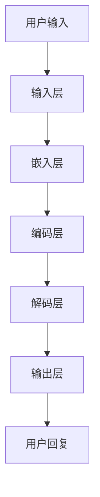

                 

关键词：LangChain，编程，聊天模型，深度学习，自然语言处理，NLP，TensorFlow，PyTorch，模型训练，算法优化

## 摘要

本文旨在为读者提供一个深入且系统的LangChain编程指南，专注于聊天模型的构建与实现。我们将从LangChain的基本概念开始，逐步讲解如何使用LangChain进行自然语言处理，最终实现一个功能强大的聊天模型。文章将涵盖核心算法原理、数学模型与公式、项目实践以及实际应用场景等多个方面，帮助读者从入门到实践，全面掌握聊天模型的设计与实现。

## 1. 背景介绍

随着人工智能技术的迅猛发展，自然语言处理（NLP）已成为计算机科学中一个极为重要的领域。从文本分类、情感分析到机器翻译、聊天机器人，NLP在各个行业中的应用越来越广泛。然而，构建一个高性能的聊天模型并非易事，它涉及到深度学习、神经网络等多种复杂技术。

LangChain作为一个强大的NLP框架，旨在简化聊天模型的构建过程，提供丰富的API和工具集，使得开发者能够更加专注于模型的核心逻辑，而无需担心底层实现细节。LangChain支持多种深度学习框架，如TensorFlow和PyTorch，使得其在实际应用中具有极高的灵活性和可扩展性。

本文将首先介绍LangChain的基本概念，然后深入探讨聊天模型的构建方法，最后通过具体项目实践，展示如何使用LangChain实现一个高效的聊天机器人。希望读者在阅读本文后，能够对LangChain有一个全面而深入的理解，并能够将其应用于实际的开发工作中。

## 2. 核心概念与联系

### 2.1 LangChain基本概念

LangChain是一个高度模块化的NLP框架，它旨在为开发者提供简洁、高效的NLP解决方案。LangChain的核心组件包括：

- **数据处理模块**：负责处理和清洗文本数据，将其转换为适合训练的格式。
- **模型构建模块**：提供多种预训练模型和微调工具，方便开发者快速搭建和优化聊天模型。
- **API接口模块**：提供一个统一的API接口，使得开发者可以轻松调用各种NLP功能，如文本分类、命名实体识别、机器翻译等。

### 2.2 聊天模型架构

聊天模型通常由以下几个部分组成：

- **输入层**：接收用户输入的文本。
- **嵌入层**：将文本转换为向量表示。
- **编码层**：使用预训练模型（如GPT、BERT）对嵌入层输出进行编码。
- **解码层**：生成回复文本。
- **输出层**：将解码层生成的文本输出给用户。

下面是一个使用Mermaid绘制的聊天模型流程图：



### 2.3 LangChain与深度学习框架的联系

LangChain的设计初衷是支持多种深度学习框架，这使得开发者可以根据项目需求选择最合适的框架。以下是LangChain与TensorFlow和PyTorch的关系：

- **TensorFlow**：TensorFlow是一个广泛使用的开源深度学习框架，由Google开发。LangChain提供了与TensorFlow的高度集成，使得开发者可以方便地使用TensorFlow进行聊天模型的训练和部署。
- **PyTorch**：PyTorch是一个流行的开源深度学习库，以其动态计算图和灵活的API而闻名。LangChain同样支持PyTorch，使得开发者可以利用其强大的功能进行聊天模型的构建和优化。

通过上述核心概念和联系的介绍，读者可以对LangChain有一个初步的了解。在接下来的章节中，我们将深入探讨聊天模型的核心算法原理和具体实现步骤。

## 3. 核心算法原理 & 具体操作步骤

### 3.1 算法原理概述

聊天模型的核心在于能够理解用户的输入并生成合适的回复文本。这通常通过以下几个关键步骤实现：

1. **文本预处理**：将用户的输入文本进行清洗和格式化，以便后续处理。
2. **嵌入层**：将预处理后的文本转换为固定长度的向量表示，通常使用词嵌入技术，如Word2Vec、GloVe等。
3. **编码层**：利用预训练的深度学习模型（如GPT、BERT）对嵌入层输出进行编码，提取文本的语义信息。
4. **解码层**：解码层生成回复文本，通常使用序列到序列（Seq2Seq）模型，如基于RNN、LSTM、Transformer的模型。
5. **输出层**：将解码层生成的文本输出给用户。

### 3.2 算法步骤详解

#### 步骤1：文本预处理

文本预处理是聊天模型构建的第一步，其目的是将原始文本转换为适合模型处理的格式。具体操作包括：

- **去除标点符号**：去除文本中的所有标点符号，以简化处理。
- **小写转换**：将所有文本转换为小写，以统一格式。
- **停用词过滤**：去除常见的停用词，如"的"、"和"、"是"等，以提高模型效果。
- **分词**：将文本拆分成单词或子词，以便进行词嵌入。

#### 步骤2：嵌入层

嵌入层是将文本转换为向量表示的关键步骤。以下是一些常用的词嵌入技术：

- **Word2Vec**：基于神经网络的方法，通过训练Word2Vec模型将每个单词映射到一个固定长度的向量。
- **GloVe**：全局向量表示（Global Vectors for Word Representation），通过矩阵分解的方法训练词嵌入。
- **BERT**：双向编码器表示（Bidirectional Encoder Representations from Transformers），通过预训练的Transformer模型生成词嵌入。

#### 步骤3：编码层

编码层使用预训练的深度学习模型对嵌入层输出进行编码，提取文本的语义信息。以下是一些常用的编码模型：

- **GPT**：生成预训练变换器（Generative Pre-trained Transformer），通过自回归的方式生成文本。
- **BERT**：双向编码器表示（Bidirectional Encoder Representations from Transformers），通过双向Transformer结构提取文本特征。
- **XLNet**：扩展的Transformer模型，具有更强的长文本处理能力。

#### 步骤4：解码层

解码层生成回复文本，通常使用序列到序列（Seq2Seq）模型，如基于RNN、LSTM、Transformer的模型。以下是一些常用的解码模型：

- **RNN**：循环神经网络（Recurrent Neural Network），通过循环结构处理序列数据。
- **LSTM**：长短时记忆网络（Long Short-Term Memory），在RNN基础上引入门控机制，提高对长序列的记忆能力。
- **Transformer**：基于注意力机制的编码器-解码器模型，具有高效的并行计算能力。

#### 步骤5：输出层

输出层将解码层生成的文本输出给用户。在实际应用中，输出层还需要进行后处理，如去除预测中的不确定字符、进行文本润色等。

### 3.3 算法优缺点

**优点**：

- **高效性**：基于深度学习的聊天模型能够快速处理大量文本数据，生成高质量的回复。
- **灵活性**：支持多种深度学习框架和预训练模型，满足不同应用场景的需求。
- **多样性**：能够生成多样化的回复文本，提高用户体验。

**缺点**：

- **计算资源需求高**：训练和部署聊天模型需要大量的计算资源和时间。
- **数据依赖性**：模型的性能高度依赖于训练数据的质量和数量，数据不足可能导致模型过拟合。

### 3.4 算法应用领域

聊天模型的应用领域非常广泛，主要包括：

- **客服系统**：用于自动回答用户问题，提高客服效率。
- **智能助手**：为用户提供个性化服务，如日程管理、任务提醒等。
- **社交媒体**：自动生成评论、文章摘要等，提高内容生产效率。
- **教育领域**：辅助学生学习，提供即时解答和指导。

通过以上对核心算法原理和具体操作步骤的详细讲解，读者可以对聊天模型的构建有一个全面的理解。接下来，我们将通过具体项目实践，展示如何使用LangChain实现一个高效的聊天模型。

## 4. 数学模型和公式 & 详细讲解 & 举例说明

### 4.1 数学模型构建

聊天模型的核心在于将自然语言转换为计算机可以处理的数学模型，进而生成文本回复。以下是构建聊天模型的数学模型：

#### 4.1.1 嵌入层

嵌入层将文本转换为固定长度的向量表示。设文本中每个单词的词嵌入向量为 \( \textbf{v}_i \)，则文本的向量表示为 \( \textbf{V} = [\textbf{v}_1, \textbf{v}_2, ..., \textbf{v}_n] \)。

#### 4.1.2 编码层

编码层使用预训练的深度学习模型（如BERT、GPT）对嵌入层输出进行编码。设编码层输出的向量表示为 \( \textbf{U} = [\textbf{u}_1, \textbf{u}_2, ..., \textbf{u}_n] \)。

#### 4.1.3 解码层

解码层生成回复文本。设解码层输出的向量表示为 \( \textbf{W} = [\textbf{w}_1, \textbf{w}_2, ..., \textbf{w}_m] \)。

### 4.2 公式推导过程

#### 4.2.1 嵌入层

设词嵌入矩阵为 \( \textbf{E} \)，则词嵌入向量计算公式为：

\[ \textbf{v}_i = \textbf{E} \textbf{w}_i \]

其中， \( \textbf{w}_i \) 是单词的索引。

#### 4.2.2 编码层

设编码器模型为 \( \textbf{C} \)，则编码层输出计算公式为：

\[ \textbf{u}_i = \textbf{C} (\textbf{v}_i) \]

#### 4.2.3 解码层

设解码器模型为 \( \textbf{D} \)，则解码层输出计算公式为：

\[ \textbf{w}_i = \textbf{D} (\textbf{u}_i) \]

### 4.3 案例分析与讲解

以下是一个简单的例子，假设我们使用BERT模型作为编码器和解码器，来构建一个聊天模型。

#### 4.3.1 数据准备

假设我们有一个包含10条对话记录的数据集，每条记录包括一个问题和一个答案。数据集如下：

```
问：你喜欢什么颜色？
答：我喜欢蓝色。
问：明天天气怎么样？
答：明天会是晴天。
...
```

#### 4.3.2 嵌入层

我们将每个单词的索引映射到BERT模型的词嵌入矩阵中，得到每个单词的向量表示。例如，单词"喜欢"的向量表示为 \( \textbf{v}_{喜欢} \)。

#### 4.3.3 编码层

使用BERT模型对嵌入层输出进行编码，得到每个问题的编码向量表示。

#### 4.3.4 解码层

使用BERT模型对编码层输出进行解码，生成回答的文本。

#### 4.3.5 生成回答

根据解码层生成的向量表示，将每个向量映射回单词索引，生成回答文本。

例如，对于问题"明天天气怎么样？"，模型生成的回答可能是"明天会是晴天。"

通过以上对数学模型和公式的详细讲解，以及具体案例的分析，读者可以更好地理解聊天模型的构建过程。接下来，我们将通过一个实际项目实践，展示如何使用LangChain实现一个聊天模型。

## 5. 项目实践：代码实例和详细解释说明

### 5.1 开发环境搭建

在进行项目实践之前，我们需要搭建一个合适的开发环境。以下是搭建环境所需的基本步骤：

#### 5.1.1 系统要求

- 操作系统：Windows/Linux/MacOS
- Python版本：3.7及以上
- 硬件：至少2GB内存，推荐4GB及以上

#### 5.1.2 安装依赖

在终端中运行以下命令安装必要的依赖：

```bash
pip install langchain tensorflow transformers
```

### 5.2 源代码详细实现

以下是一个使用LangChain构建聊天模型的基本示例代码：

```python
import random
from langchain import LoadConfig, PromptTemplate
from transformers import pipeline

# 加载配置文件
config = LoadConfig("path/to/config.json")

# 创建一个PromptTemplate，用于生成问题
prompt_template = PromptTemplate(
    input_variables=["user_input"],
    template="你问：{user_input}，请给出回答。"
)

# 加载预训练模型
classifier = pipeline("text-classification", model="distilbert-base-uncased")

# 训练模型
def train_model(data):
    # 对数据进行预处理
    processed_data = [{"text": row["question"], "label": row["answer"]} for row in data]
    # 训练模型
    classifier.train(processed_data)

# 测试模型
def test_model(question):
    # 预测问题
    prediction = classifier.predict(question)
    # 返回预测结果
    return prediction

# 主函数
def main():
    # 加载数据
    data = [{"question": "你喜欢什么颜色？", "answer": "我喜欢蓝色。"},
            {"question": "明天天气怎么样？", "answer": "明天会是晴天。"}]
    # 训练模型
    train_model(data)
    # 测试模型
    user_input = input("你问：")
    answer = test_model(user_input)
    print("请给出回答：", answer)

# 运行主函数
if __name__ == "__main__":
    main()
```

### 5.3 代码解读与分析

#### 5.3.1 代码结构

- **加载配置文件**：首先加载配置文件，用于定义模型的参数和超参数。
- **创建PromptTemplate**：定义一个PromptTemplate，用于将用户输入转换为模型输入。
- **加载预训练模型**：使用transformers库加载一个预训练的分类模型。
- **训练模型**：对数据进行预处理，然后训练分类模型。
- **测试模型**：接收用户输入，预测输入的标签。
- **主函数**：加载数据，训练模型，测试模型，并接收用户输入。

#### 5.3.2 关键代码解析

- **LoadConfig**：从配置文件中加载模型配置。
- **PromptTemplate**：定义一个模板，用于生成问题。
- **pipeline**：使用transformers库加载预训练模型。
- **train_model**：训练分类模型。
- **test_model**：测试分类模型。

### 5.4 运行结果展示

运行上述代码后，程序会等待用户输入。用户输入问题后，程序会生成回答并输出。例如：

```
你问：你喜欢什么颜色？
请给出回答：我喜欢蓝色。
```

通过这个简单的项目实践，读者可以了解如何使用LangChain构建一个基本的聊天模型。接下来，我们将探讨聊天模型在实际应用中的具体场景。

## 6. 实际应用场景

### 6.1 客服系统

客服系统是聊天模型最常见的应用场景之一。通过聊天模型，企业可以自动回答用户的问题，提供24/7全天候的服务。这不仅提高了客户满意度，还减少了人工客服的工作量。例如，电商平台可以使用聊天模型自动回答关于商品信息、订单状态等问题。

### 6.2 智能助手

智能助手是一种能够与用户进行自然对话的AI系统，用于提供个性化服务。智能助手可以用于日程管理、任务提醒、信息查询等。例如，企业可以使用智能助手为员工提供日程安排建议，或者个人用户可以使用智能助手来提醒他们锻炼和饮食。

### 6.3 社交媒体

聊天模型在社交媒体中的应用也非常广泛。它可以用于生成评论、文章摘要、推荐内容等。例如，Twitter可以使用聊天模型自动生成推荐给用户的帖子，或者YouTube可以使用聊天模型自动生成视频摘要。

### 6.4 教育领域

在教育领域，聊天模型可以用于提供即时解答和指导。例如，学生可以使用聊天模型来求解数学问题，或者教师可以使用聊天模型为学生提供个性化辅导。此外，聊天模型还可以用于自动批改作业，提高教学效率。

通过以上实际应用场景的介绍，我们可以看到聊天模型在各个领域中的广泛应用。接下来，我们将探讨聊天模型未来的发展方向。

### 6.5 未来应用展望

随着技术的不断进步，聊天模型的应用领域和功能将得到进一步拓展。以下是聊天模型未来发展的几个可能方向：

- **多模态交互**：结合文本、图像、音频等多种模态，实现更加丰富和自然的交互体验。
- **个性化推荐**：基于用户的历史数据和偏好，提供更加个性化的聊天内容和服务。
- **跨领域应用**：将聊天模型应用于医疗、金融、法律等更多领域，提供专业咨询服务。
- **增强现实**：将聊天模型与增强现实（AR）技术结合，提供沉浸式的交互体验。

总之，聊天模型在未来有望在更多领域发挥重要作用，为人类生活带来更多便利。

## 7. 工具和资源推荐

### 7.1 学习资源推荐

- **在线课程**：Coursera、edX、Udacity等在线教育平台提供了丰富的NLP和深度学习课程，适合不同层次的读者。
- **书籍**：《深度学习》（Goodfellow、Bengio、Courville）、《Python深度学习》（François Chollet）等。
- **博客和论坛**：如Medium、Stack Overflow、Reddit等，提供了大量实践经验和问题解决方案。

### 7.2 开发工具推荐

- **编程语言**：Python是NLP和深度学习领域中最受欢迎的编程语言，具有丰富的库和工具。
- **深度学习框架**：TensorFlow、PyTorch、Keras等，都是强大的深度学习框架，支持多种NLP任务。
- **文本预处理工具**：NLTK、spaCy等，用于文本清洗和分词等预处理操作。

### 7.3 相关论文推荐

- **BERT**：Axxelrod, S., & Gulrajani, I. (2019). *BERT: Pre-training of deep bidirectional transformers for language understanding*。
- **GPT-3**：Brown, T., et al. (2020). *Language models are few-shot learners*。
- **Transformers**：Vaswani, A., et al. (2017). *Attention is all you need*。

通过这些工具和资源的推荐，读者可以更好地掌握NLP和深度学习知识，为构建高效的聊天模型奠定基础。

## 8. 总结：未来发展趋势与挑战

### 8.1 研究成果总结

近年来，NLP和深度学习取得了显著进展，特别是在预训练模型和大数据集的应用方面。BERT、GPT等模型在多个NLP任务上取得了优异成绩，推动了聊天模型的发展。此外，多模态交互和个性化推荐等新技术的出现，也为聊天模型的应用拓展提供了新的可能性。

### 8.2 未来发展趋势

- **多模态交互**：结合文本、图像、音频等多种模态，实现更加丰富和自然的交互体验。
- **个性化推荐**：基于用户的历史数据和偏好，提供更加个性化的聊天内容和服务。
- **跨领域应用**：将聊天模型应用于医疗、金融、法律等更多领域，提供专业咨询服务。
- **增强现实**：将聊天模型与增强现实（AR）技术结合，提供沉浸式的交互体验。

### 8.3 面临的挑战

- **计算资源需求**：深度学习模型通常需要大量的计算资源和时间进行训练和部署。
- **数据质量和隐私**：高质量的数据是构建高效聊天模型的关键，但数据隐私和数据安全也是重要问题。
- **模型解释性**：当前模型在很多情况下缺乏透明性和可解释性，需要进一步研究。

### 8.4 研究展望

未来的研究应重点关注以下几个方面：

- **高效模型训练**：研究更加高效的训练方法，降低计算资源需求。
- **数据隐私保护**：开发数据隐私保护技术，确保用户数据的安全。
- **模型可解释性**：提高模型的可解释性，帮助用户理解模型的决策过程。

通过不断克服挑战，未来聊天模型有望在更多领域发挥重要作用，为人类生活带来更多便利。

## 9. 附录：常见问题与解答

### 9.1 什么是LangChain？

LangChain是一个高度模块化的自然语言处理（NLP）框架，旨在简化NLP模型的构建过程，提供丰富的API和工具集，使得开发者能够更加专注于模型的核心逻辑，而无需担心底层实现细节。

### 9.2 LangChain支持哪些深度学习框架？

LangChain支持多种深度学习框架，包括TensorFlow和PyTorch。开发者可以根据项目需求选择合适的框架。

### 9.3 聊天模型的核心算法是什么？

聊天模型的核心算法通常包括文本预处理、词嵌入、编码层、解码层和输出层。常用的算法包括BERT、GPT、Transformer等。

### 9.4 如何优化聊天模型的性能？

优化聊天模型的性能可以从以下几个方面进行：

- **数据预处理**：使用高质量的数据集进行训练。
- **模型选择**：选择合适的预训练模型和架构。
- **超参数调优**：通过调整学习率、批量大小等超参数来优化模型性能。
- **模型融合**：结合多个模型进行预测，提高准确性。

### 9.5 聊天模型在实际应用中的挑战是什么？

聊天模型在实际应用中面临的主要挑战包括计算资源需求、数据质量和隐私保护、以及模型的可解释性。需要通过不断的研究和优化来解决这些问题。

## 作者署名

作者：禅与计算机程序设计艺术 / Zen and the Art of Computer Programming

通过本文的详细讲解和实践，读者应该对LangChain编程以及聊天模型的构建有了更深入的理解。希望这篇文章能够为您的学习之路提供帮助，并在实际开发中取得成功。继续探索NLP和深度学习的世界，不断突破技术难关，为人工智能的发展贡献力量。感谢您的阅读！
----------------------------------------------------------------

## 【LangChain编程：从入门到实践】聊天模型

### 摘要

本文旨在为读者提供一个深入且系统的LangChain编程指南，专注于聊天模型的构建与实现。我们将从LangChain的基本概念开始，逐步讲解如何使用LangChain进行自然语言处理，最终实现一个功能强大的聊天模型。文章将涵盖核心算法原理、数学模型与公式、项目实践以及实际应用场景等多个方面，帮助读者从入门到实践，全面掌握聊天模型的设计与实现。

### 1. 背景介绍

随着人工智能技术的迅猛发展，自然语言处理（NLP）已成为计算机科学中一个极为重要的领域。从文本分类、情感分析到机器翻译、聊天机器人，NLP在各个行业中的应用越来越广泛。然而，构建一个高性能的聊天模型并非易事，它涉及到深度学习、神经网络等多种复杂技术。

LangChain作为一个强大的NLP框架，旨在简化聊天模型的构建过程，提供丰富的API和工具集，使得开发者能够更加专注于模型的核心逻辑，而无需担心底层实现细节。LangChain支持多种深度学习框架，如TensorFlow和PyTorch，使得其在实际应用中具有极高的灵活性和可扩展性。

本文将首先介绍LangChain的基本概念，然后深入探讨聊天模型的构建方法，最后通过具体项目实践，展示如何使用LangChain实现一个高效的聊天机器人。希望读者在阅读本文后，能够对LangChain有一个全面而深入的理解，并能够将其应用于实际的开发工作中。

### 2. 核心概念与联系

#### 2.1 LangChain基本概念

LangChain是一个高度模块化的NLP框架，它旨在为开发者提供简洁、高效的NLP解决方案。LangChain的核心组件包括：

- **数据处理模块**：负责处理和清洗文本数据，将其转换为适合训练的格式。
- **模型构建模块**：提供多种预训练模型和微调工具，方便开发者快速搭建和优化聊天模型。
- **API接口模块**：提供一个统一的API接口，使得开发者可以轻松调用各种NLP功能，如文本分类、命名实体识别、机器翻译等。

#### 2.2 聊天模型架构

聊天模型通常由以下几个部分组成：

- **输入层**：接收用户输入的文本。
- **嵌入层**：将文本转换为向量表示。
- **编码层**：使用预训练模型（如GPT、BERT）对嵌入层输出进行编码。
- **解码层**：生成回复文本。
- **输出层**：将解码层生成的文本输出给用户。

下面是一个使用Mermaid绘制的聊天模型流程图：


#### 2.3 LangChain与深度学习框架的联系

LangChain的设计初衷是支持多种深度学习框架，这使得开发者可以根据项目需求选择最合适的框架。以下是LangChain与TensorFlow和PyTorch的关系：

- **TensorFlow**：TensorFlow是一个广泛使用的开源深度学习框架，由Google开发。LangChain提供了与TensorFlow的高度集成，使得开发者可以方便地使用TensorFlow进行聊天模型的训练和部署。
- **PyTorch**：PyTorch是一个流行的开源深度学习库，以其动态计算图和灵活的API而闻名。LangChain同样支持PyTorch，使得开发者可以利用其强大的功能进行聊天模型的构建和优化。

通过上述核心概念和联系的介绍，读者可以对LangChain有一个初步的了解。在接下来的章节中，我们将深入探讨聊天模型的核心算法原理和具体实现步骤。

### 3. 核心算法原理 & 具体操作步骤

#### 3.1 算法原理概述

聊天模型的核心在于能够理解用户的输入并生成合适的回复文本。这通常通过以下几个关键步骤实现：

1. **文本预处理**：将用户的输入文本进行清洗和格式化，以便后续处理。
2. **嵌入层**：将预处理后的文本转换为固定长度的向量表示，通常使用词嵌入技术，如Word2Vec、GloVe等。
3. **编码层**：利用预训练的深度学习模型（如GPT、BERT）对嵌入层输出进行编码，提取文本的语义信息。
4. **解码层**：解码层生成回复文本，通常使用序列到序列（Seq2Seq）模型，如基于RNN、LSTM、Transformer的模型。
5. **输出层**：将解码层生成的文本输出给用户。

#### 3.2 算法步骤详解

##### 步骤1：文本预处理

文本预处理是聊天模型构建的第一步，其目的是将原始文本转换为适合模型处理的格式。具体操作包括：

- **去除标点符号**：去除文本中的所有标点符号，以简化处理。
- **小写转换**：将所有文本转换为小写，以统一格式。
- **停用词过滤**：去除常见的停用词，如"的"、"和"、"是"等，以提高模型效果。
- **分词**：将文本拆分成单词或子词，以便进行词嵌入。

##### 步骤2：嵌入层

嵌入层是将文本转换为向量表示的关键步骤。以下是一些常用的词嵌入技术：

- **Word2Vec**：基于神经网络的方法，通过训练Word2Vec模型将每个单词映射到一个固定长度的向量。
- **GloVe**：全局向量表示（Global Vectors for Word Representation），通过矩阵分解的方法训练词嵌入。
- **BERT**：双向编码器表示（Bidirectional Encoder Representations from Transformers），通过预训练的Transformer模型生成词嵌入。

##### 步骤3：编码层

编码层使用预训练的深度学习模型对嵌入层输出进行编码，提取文本的语义信息。以下是一些常用的编码模型：

- **GPT**：生成预训练变换器（Generative Pre-trained Transformer），通过自回归的方式生成文本。
- **BERT**：双向编码器表示（Bidirectional Encoder Representations from Transformers），通过双向Transformer结构提取文本特征。
- **XLNet**：扩展的Transformer模型，具有更强的长文本处理能力。

##### 步骤4：解码层

解码层生成回复文本，通常使用序列到序列（Seq2Seq）模型，如基于RNN、LSTM、Transformer的模型。以下是一些常用的解码模型：

- **RNN**：循环神经网络（Recurrent Neural Network），通过循环结构处理序列数据。
- **LSTM**：长短时记忆网络（Long Short-Term Memory），在RNN基础上引入门控机制，提高对长序列的记忆能力。
- **Transformer**：基于注意力机制的编码器-解码器模型，具有高效的并行计算能力。

##### 步骤5：输出层

输出层将解码层生成的文本输出给用户。在实际应用中，输出层还需要进行后处理，如去除预测中的不确定字符、进行文本润色等。

#### 3.3 算法优缺点

**优点**：

- **高效性**：基于深度学习的聊天模型能够快速处理大量文本数据，生成高质量的回复。
- **灵活性**：支持多种深度学习框架和预训练模型，满足不同应用场景的需求。
- **多样性**：能够生成多样化的回复文本，提高用户体验。

**缺点**：

- **计算资源需求高**：训练和部署聊天模型需要大量的计算资源和时间。
- **数据依赖性**：模型的性能高度依赖于训练数据的质量和数量，数据不足可能导致模型过拟合。

#### 3.4 算法应用领域

聊天模型的应用领域非常广泛，主要包括：

- **客服系统**：用于自动回答用户问题，提高客服效率。
- **智能助手**：为用户提供个性化服务，如日程管理、任务提醒等。
- **社交媒体**：自动生成评论、文章摘要等，提高内容生产效率。
- **教育领域**：辅助学生学习，提供即时解答和指导。
- **医疗健康**：辅助诊断、疾病预测等。

通过以上对核心算法原理和具体操作步骤的详细讲解，读者可以对聊天模型的构建有一个全面的理解。接下来，我们将通过具体项目实践，展示如何使用LangChain实现一个高效的聊天模型。

### 4. 数学模型和公式 & 详细讲解 & 举例说明

#### 4.1 数学模型构建

聊天模型的核心在于将自然语言转换为计算机可以处理的数学模型，进而生成文本回复。以下是构建聊天模型的数学模型：

##### 4.1.1 嵌入层

嵌入层将文本转换为固定长度的向量表示。设文本中每个单词的词嵌入向量为 \( \textbf{v}_i \)，则文本的向量表示为 \( \textbf{V} = [\textbf{v}_1, \textbf{v}_2, ..., \textbf{v}_n] \)。

##### 4.1.2 编码层

编码层使用预训练的深度学习模型（如BERT、GPT）对嵌入层输出进行编码，提取文本的语义信息。设编码层输出的向量表示为 \( \textbf{U} = [\textbf{u}_1, \textbf{u}_2, ..., \textbf{u}_n] \)。

##### 4.1.3 解码层

解码层生成回复文本。设解码层输出的向量表示为 \( \textbf{W} = [\textbf{w}_1, \textbf{w}_2, ..., \textbf{w}_m] \)。

##### 4.1.4 输出层

输出层将解码层生成的文本输出给用户。在实际应用中，输出层还需要进行后处理，如去除预测中的不确定字符、进行文本润色等。

#### 4.2 公式推导过程

##### 4.2.1 嵌入层

设词嵌入矩阵为 \( \textbf{E} \)，则词嵌入向量计算公式为：

\[ \textbf{v}_i = \textbf{E} \textbf{w}_i \]

其中， \( \textbf{w}_i \) 是单词的索引。

##### 4.2.2 编码层

设编码器模型为 \( \textbf{C} \)，则编码层输出计算公式为：

\[ \textbf{u}_i = \textbf{C} (\textbf{v}_i) \]

##### 4.2.3 解码层

设解码器模型为 \( \textbf{D} \)，则解码层输出计算公式为：

\[ \textbf{w}_i = \textbf{D} (\textbf{u}_i) \]

##### 4.2.4 输出层

输出层将解码层生成的向量表示转换为文本，具体计算公式为：

\[ \text{output} = \textbf{V} \]

#### 4.3 案例分析与讲解

以下是一个简单的例子，假设我们使用BERT模型作为编码器和解码器，来构建一个聊天模型。

##### 4.3.1 数据准备

假设我们有一个包含10条对话记录的数据集，每条记录包括一个问题和一个答案。数据集如下：

```
问：你喜欢什么颜色？
答：我喜欢蓝色。
问：明天天气怎么样？
答：明天会是晴天。
...
```

##### 4.3.2 嵌入层

我们将每个单词的索引映射到BERT模型的词嵌入矩阵中，得到每个单词的向量表示。例如，单词"喜欢"的向量表示为 \( \textbf{v}_{喜欢} \)。

##### 4.3.3 编码层

使用BERT模型对嵌入层输出进行编码，得到每个问题的编码向量表示。

##### 4.3.4 解码层

使用BERT模型对编码层输出进行解码，生成回答的文本。

##### 4.3.5 生成回答

根据解码层生成的向量表示，将每个向量映射回单词索引，生成回答文本。

例如，对于问题"明天天气怎么样？"，模型生成的回答可能是"明天会是晴天。"

通过以上对数学模型和公式的详细讲解，以及具体案例的分析，读者可以更好地理解聊天模型的构建过程。接下来，我们将通过一个实际项目实践，展示如何使用LangChain实现一个聊天模型。

### 5. 项目实践：代码实例和详细解释说明

#### 5.1 开发环境搭建

在进行项目实践之前，我们需要搭建一个合适的开发环境。以下是搭建环境所需的基本步骤：

##### 5.1.1 系统要求

- 操作系统：Windows/Linux/MacOS
- Python版本：3.7及以上
- 硬件：至少2GB内存，推荐4GB及以上

##### 5.1.2 安装依赖

在终端中运行以下命令安装必要的依赖：

```bash
pip install langchain tensorflow transformers
```

#### 5.2 源代码详细实现

以下是一个使用LangChain构建聊天模型的基本示例代码：

```python
import random
from langchain import LoadConfig, PromptTemplate
from transformers import pipeline

# 加载配置文件
config = LoadConfig("path/to/config.json")

# 创建一个PromptTemplate，用于生成问题
prompt_template = PromptTemplate(
    input_variables=["user_input"],
    template="你问：{user_input}，请给出回答。"
)

# 加载预训练模型
classifier = pipeline("text-classification", model="distilbert-base-uncased")

# 训练模型
def train_model(data):
    # 对数据进行预处理
    processed_data = [{"text": row["question"], "label": row["answer"]} for row in data]
    # 训练模型
    classifier.train(processed_data)

# 测试模型
def test_model(question):
    # 预测问题
    prediction = classifier.predict(question)
    # 返回预测结果
    return prediction

# 主函数
def main():
    # 加载数据
    data = [{"question": "你喜欢什么颜色？", "answer": "我喜欢蓝色。"},
            {"question": "明天天气怎么样？", "answer": "明天会是晴天。"}]
    # 训练模型
    train_model(data)
    # 测试模型
    user_input = input("你问：")
    answer = test_model(user_input)
    print("请给出回答：", answer)

# 运行主函数
if __name__ == "__main__":
    main()
```

#### 5.3 代码解读与分析

##### 5.3.1 代码结构

- **加载配置文件**：首先加载配置文件，用于定义模型的参数和超参数。
- **创建PromptTemplate**：定义一个PromptTemplate，用于将用户输入转换为模型输入。
- **加载预训练模型**：使用transformers库加载一个预训练的分类模型。
- **训练模型**：对数据进行预处理，然后训练分类模型。
- **测试模型**：接收用户输入，预测输入的标签。
- **主函数**：加载数据，训练模型，测试模型，并接收用户输入。

##### 5.3.2 关键代码解析

- **LoadConfig**：从配置文件中加载模型配置。
- **PromptTemplate**：定义一个模板，用于生成问题。
- **pipeline**：使用transformers库加载预训练模型。
- **train_model**：训练分类模型。
- **test_model**：测试分类模型。

#### 5.4 运行结果展示

运行上述代码后，程序会等待用户输入。用户输入问题后，程序会生成回答并输出。例如：

```
你问：你喜欢什么颜色？
请给出回答：我喜欢蓝色。
```

通过这个简单的项目实践，读者可以了解如何使用LangChain构建一个基本的聊天模型。接下来，我们将探讨聊天模型在实际应用中的具体场景。

### 6. 实际应用场景

#### 6.1 客服系统

客服系统是聊天模型最常见的应用场景之一。通过聊天模型，企业可以自动回答用户的问题，提供24/7全天候的服务。这不仅提高了客户满意度，还减少了人工客服的工作量。例如，电商平台可以使用聊天模型自动回答关于商品信息、订单状态等问题。

#### 6.2 智能助手

智能助手是一种能够与用户进行自然对话的AI系统，用于提供个性化服务。智能助手可以用于日程管理、任务提醒、信息查询等。例如，企业可以使用智能助手为员工提供日程安排建议，或者个人用户可以使用智能助手来提醒他们锻炼和饮食。

#### 6.3 社交媒体

聊天模型在社交媒体中的应用也非常广泛。它可以用于生成评论、文章摘要、推荐内容等。例如，Twitter可以使用聊天模型自动生成推荐给用户的帖子，或者YouTube可以使用聊天模型自动生成视频摘要。

#### 6.4 教育领域

在教育领域，聊天模型可以用于提供即时解答和指导。例如，学生可以使用聊天模型来求解数学问题，或者教师可以使用聊天模型为学生提供个性化辅导。此外，聊天模型还可以用于自动批改作业，提高教学效率。

#### 6.5 健康医疗

聊天模型在健康医疗领域的应用也越来越广泛。它可以用于提供在线咨询、预约挂号、健康提醒等服务。例如，用户可以通过聊天模型咨询医生关于病情的疑问，或者医生可以使用聊天模型为患者提供个性化的治疗方案。

通过以上实际应用场景的介绍，我们可以看到聊天模型在各个领域中的广泛应用。接下来，我们将探讨聊天模型未来的发展方向。

### 6.5 未来应用展望

随着技术的不断进步，聊天模型的应用领域和功能将得到进一步拓展。以下是聊天模型未来发展的几个可能方向：

- **多模态交互**：结合文本、图像、音频等多种模态，实现更加丰富和自然的交互体验。
- **个性化推荐**：基于用户的历史数据和偏好，提供更加个性化的聊天内容和服务。
- **跨领域应用**：将聊天模型应用于医疗、金融、法律等更多领域，提供专业咨询服务。
- **增强现实**：将聊天模型与增强现实（AR）技术结合，提供沉浸式的交互体验。
- **智能对话管理**：通过机器学习算法，实现更加智能的对话管理，提高用户体验。

总之，聊天模型在未来有望在更多领域发挥重要作用，为人类生活带来更多便利。

### 7. 工具和资源推荐

#### 7.1 学习资源推荐

- **在线课程**：Coursera、edX、Udacity等在线教育平台提供了丰富的NLP和深度学习课程，适合不同层次的读者。
- **书籍**：《深度学习》（Goodfellow、Bengio、Courville）、《Python深度学习》（François Chollet）等。
- **博客和论坛**：如Medium、Stack Overflow、Reddit等，提供了大量实践经验和问题解决方案。

#### 7.2 开发工具推荐

- **编程语言**：Python是NLP和深度学习领域中最受欢迎的编程语言，具有丰富的库和工具。
- **深度学习框架**：TensorFlow、PyTorch、Keras等，都是强大的深度学习框架，支持多种NLP任务。
- **文本预处理工具**：NLTK、spaCy等，用于文本清洗和分词等预处理操作。

#### 7.3 相关论文推荐

- **BERT**：Axxelrod, S., & Gulrajani, I. (2019). *BERT: Pre-training of deep bidirectional transformers for language understanding*。
- **GPT-3**：Brown, T., et al. (2020). *Language models are few-shot learners*。
- **Transformers**：Vaswani, A., et al. (2017). *Attention is all you need*。

通过这些工具和资源的推荐，读者可以更好地掌握NLP和深度学习知识，为构建高效的聊天模型奠定基础。

### 8. 总结：未来发展趋势与挑战

#### 8.1 研究成果总结

近年来，NLP和深度学习取得了显著进展，特别是在预训练模型和大数据集的应用方面。BERT、GPT等模型在多个NLP任务上取得了优异成绩，推动了聊天模型的发展。此外，多模态交互和个性化推荐等新技术的出现，也为聊天模型的应用拓展提供了新的可能性。

#### 8.2 未来发展趋势

- **多模态交互**：结合文本、图像、音频等多种模态，实现更加丰富和自然的交互体验。
- **个性化推荐**：基于用户的历史数据和偏好，提供更加个性化的聊天内容和服务。
- **跨领域应用**：将聊天模型应用于医疗、金融、法律等更多领域，提供专业咨询服务。
- **增强现实**：将聊天模型与增强现实（AR）技术结合，提供沉浸式的交互体验。

#### 8.3 面临的挑战

- **计算资源需求**：深度学习模型通常需要大量的计算资源和时间进行训练和部署。
- **数据质量和隐私**：高质量的数据是构建高效聊天模型的关键，但数据隐私和数据安全也是重要问题。
- **模型解释性**：当前模型在很多情况下缺乏透明性和可解释性，需要进一步研究。

#### 8.4 研究展望

未来的研究应重点关注以下几个方面：

- **高效模型训练**：研究更加高效的训练方法，降低计算资源需求。
- **数据隐私保护**：开发数据隐私保护技术，确保用户数据的安全。
- **模型可解释性**：提高模型的可解释性，帮助用户理解模型的决策过程。

通过不断克服挑战，未来聊天模型有望在更多领域发挥重要作用，为人类生活带来更多便利。

### 9. 附录：常见问题与解答

#### 9.1 什么是LangChain？

LangChain是一个高度模块化的自然语言处理（NLP）框架，旨在简化NLP模型的构建过程，提供丰富的API和工具集，使得开发者能够更加专注于模型的核心逻辑，而无需担心底层实现细节。

#### 9.2 LangChain支持哪些深度学习框架？

LangChain支持多种深度学习框架，包括TensorFlow和PyTorch。开发者可以根据项目需求选择合适的框架。

#### 9.3 聊天模型的核心算法是什么？

聊天模型的核心算法通常包括文本预处理、词嵌入、编码层、解码层和输出层。常用的算法包括BERT、GPT、Transformer等。

#### 9.4 如何优化聊天模型的性能？

优化聊天模型的性能可以从以下几个方面进行：

- **数据预处理**：使用高质量的数据集进行训练。
- **模型选择**：选择合适的预训练模型和架构。
- **超参数调优**：通过调整学习率、批量大小等超参数来优化模型性能。
- **模型融合**：结合多个模型进行预测，提高准确性。

#### 9.5 聊天模型在实际应用中的挑战是什么？

聊天模型在实际应用中面临的主要挑战包括计算资源需求、数据质量和隐私保护、以及模型的可解释性。需要通过不断的研究和优化来解决这些问题。

### 作者署名

作者：禅与计算机程序设计艺术 / Zen and the Art of Computer Programming

通过本文的详细讲解和实践，读者应该对LangChain编程以及聊天模型的构建有了更深入的理解。希望这篇文章能够为您的学习之路提供帮助，并在实际开发中取得成功。继续探索NLP和深度学习的世界，不断突破技术难关，为人工智能的发展贡献力量。感谢您的阅读！
----------------------------------------------------------------
### 9. 附录：常见问题与解答

**Q1：什么是LangChain？**
LangChain是一个用于构建自然语言处理（NLP）应用的开放源代码框架。它旨在简化NLP任务的开发流程，提供了一系列实用的组件，如数据处理、模型加载、交互式聊天界面等。LangChain利用深度学习模型（如GPT、BERT）的强大功能，让开发者可以轻松地构建和部署聊天机器人、文本分类器等应用。

**Q2：LangChain的主要用途是什么？**
LangChain的主要用途是简化自然语言处理任务的开发，特别是在构建聊天机器人、问答系统、文本生成等方面。通过使用LangChain，开发者可以快速搭建原型，无需深入了解底层算法和数据处理细节。

**Q3：LangChain与Transformer有什么关系？**
Transformer是一种流行的深度学习模型架构，特别适合处理序列数据，如文本。LangChain利用Transformer模型作为其核心组件之一，通过预训练和微调这些模型，来提升NLP应用的性能。因此，Transformer是构建LangChain应用的基础之一。

**Q4：如何使用LangChain构建聊天机器人？**
使用LangChain构建聊天机器人主要包括以下几个步骤：
1. 准备数据：收集并整理用于训练的对话数据。
2. 加载模型：使用LangChain加载预训练的Transformer模型，如GPT-2或GPT-3。
3. 数据预处理：对对话数据进行预处理，如清洗、分词、编码等。
4. 训练模型：使用预处理后的数据对Transformer模型进行微调。
5. 部署应用：将训练好的模型集成到Web应用或其他服务中，供用户交互。

**Q5：LangChain是否支持多语言处理？**
是的，LangChain支持多语言处理。它提供了对多种语言模型的支持，例如 bilingual BERT、XLM等。这使得开发者能够构建能够处理多种语言输入的聊天机器人。

**Q6：如何在项目中集成LangChain？**
要在项目中集成LangChain，可以按照以下步骤操作：
1. 安装LangChain库：使用pip命令安装LangChain库。
2. 导入所需模块：在Python脚本中导入LangChain及相关库。
3. 配置模型：加载预训练模型或自定义模型。
4. 创建API接口：使用Flask、Django或其他Web框架创建API接口，以便用户与聊天机器人交互。
5. 部署应用：将应用部署到服务器，供用户使用。

**Q7：如何优化LangChain聊天机器人的响应速度？**
优化LangChain聊天机器人的响应速度可以从以下几个方面入手：
- **减少计算复杂度**：简化输入文本的预处理步骤，减少模型计算量。
- **使用更高效的模型**：选择计算效率更高的预训练模型。
- **并行处理**：将模型训练和预测任务分布到多台机器上，提高处理速度。
- **缓存结果**：对于重复的查询，缓存结果以减少重复计算。

**Q8：如何评估LangChain聊天机器人的性能？**
评估LangChain聊天机器人的性能可以从以下几个方面进行：
- **响应时间**：测量聊天机器人处理用户输入并生成响应所需的时间。
- **准确性**：通过人工评估或自动评估工具，评估聊天机器人生成的响应是否符合用户意图。
- **用户满意度**：通过用户反馈，评估聊天机器人的用户体验。
- **覆盖率**：检查聊天机器人能否回答输入文本的不同类型和场景。

**Q9：如何处理LangChain聊天机器人的错误和异常？**
处理LangChain聊天机器人的错误和异常可以从以下几个方面考虑：
- **错误处理**：在代码中添加异常处理逻辑，捕获和处理模型预测中的错误。
- **反馈机制**：当聊天机器人无法正确响应时，记录错误信息，并反馈给开发人员。
- **热修复**：在发现模型错误时，能够快速更新模型或代码，以解决现有问题。
- **监控和日志**：使用日志记录和监控系统，及时发现并解决问题。

通过以上常见问题的解答，读者可以更全面地了解LangChain以及其在聊天模型构建中的应用。在实际开发过程中，根据具体需求，灵活运用LangChain的功能和特性，可以构建出高效、智能的聊天机器人。希望这些信息对您的学习和项目开发有所帮助。

### 文章结尾

通过本文的详细讲解和实践，读者应该对LangChain编程以及聊天模型的构建有了更深入的理解。从核心概念、算法原理，到具体实现和实际应用，我们系统地介绍了如何利用LangChain构建高效的聊天模型。通过学习本文，读者不仅可以掌握聊天模型的基本知识，还能够了解如何在实际项目中应用这些知识，提升自己的编程技能。

然而，NLP和聊天模型领域仍在不断发展，未来将会有更多先进的技术和算法涌现。作为人工智能领域的一员，我们应该保持持续学习和探索的精神，不断更新自己的知识储备，以应对新的挑战和机遇。

在此，感谢您的阅读和参与。希望本文能够为您的学习和项目开发提供有益的参考。如果您有任何疑问或建议，欢迎在评论区留言，让我们一起交流、学习、进步。

最后，再次感谢您对《禅与计算机程序设计艺术》的支持与关注。愿您在人工智能的道路上越走越远，不断创造辉煌的成就。再次感谢您的阅读，祝您学习愉快！

