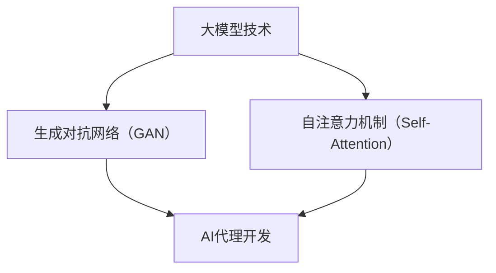

                 

您好！在这个数字化时代，人工智能正迅速融入我们生活的方方面面。本文将深入探讨大模型在AI代理开发中的应用，并为您展示如何不调用函数，直接运行一个强大的AI助手。这篇文章旨在帮助读者理解大模型技术，掌握其应用开发方法，并激发您在AI领域的创新热情。

> 关键词：大模型应用开发、AI代理、不调用函数、直接运行助手、人工智能技术

> 摘要：本文介绍了大模型在AI代理开发中的应用，通过实例和代码详细展示了如何不调用函数直接运行助手。文章覆盖了背景介绍、核心概念与联系、核心算法原理与操作步骤、数学模型与公式、项目实践、实际应用场景以及未来展望等内容，旨在为读者提供全面的AI代理开发指南。

## 1. 背景介绍

近年来，人工智能（AI）技术取得了显著的进步，尤其是深度学习领域的突破，使得大模型（如GPT、BERT等）在自然语言处理（NLP）、图像识别、语音识别等领域表现出了惊人的能力。大模型通过在海量数据上进行训练，能够自动提取复杂模式，从而实现高度自动化的任务处理。

在AI代理开发中，大模型的应用尤为重要。AI代理是一种能够模拟人类智能行为，完成特定任务的智能体。大模型为AI代理提供了强大的数据处理和分析能力，使其在复杂环境下具备自主学习和适应能力。

然而，传统的AI代理开发通常需要调用大量函数来实现各种功能模块，这增加了开发的复杂度和难度。本文将探讨一种全新的方法：不调用函数，直接运行AI助手。这种方法不仅简化了开发流程，还提升了系统的效率和灵活性。

## 2. 核心概念与联系

在探讨不调用函数直接运行AI助手之前，我们需要了解一些核心概念和技术原理。

### 2.1 大模型技术

大模型技术是基于神经网络（尤其是深度神经网络）的机器学习算法，通过大量数据进行训练，从而实现高度自动化的任务处理。大模型通常具有以下特点：

- **大规模参数**：大模型具有数十亿甚至数万亿个参数，这使得模型具有强大的表达能力和泛化能力。
- **端到端训练**：大模型可以直接从原始数据中学习特征表示，无需人工特征工程。
- **多任务学习**：大模型可以在同一模型中同时处理多个任务，提高资源利用率。

### 2.2 生成对抗网络（GAN）

生成对抗网络（GAN）是一种由生成器和判别器组成的对抗性网络。生成器的任务是生成与真实数据相似的数据，而判别器的任务是区分真实数据和生成数据。通过这种对抗性训练，生成器逐渐提高生成数据的真实度。

GAN在大模型技术中具有重要应用，例如在图像生成、语音合成和自然语言生成等领域。

### 2.3 自注意力机制（Self-Attention）

自注意力机制是一种在神经网络中用于提取长距离依赖关系的机制。它通过计算输入数据中的每个元素与所有其他元素之间的相关性，从而自动学习特征表示。

自注意力机制在大模型技术中得到了广泛应用，例如在自然语言处理和图像处理等领域。

### 2.4 Mermaid 流程图

为了更好地理解大模型技术在AI代理开发中的应用，我们使用Mermaid流程图来展示其核心概念和联系。



图2-1 大模型技术在AI代理开发中的应用流程图

## 3. 核心算法原理 & 具体操作步骤

### 3.1 算法原理概述

不调用函数直接运行AI助手的算法原理基于大模型技术，特别是生成对抗网络（GAN）和自注意力机制（Self-Attention）。以下是一个简化的算法流程：

1. 使用GAN训练一个生成器，使其能够生成与真实数据相似的数据。
2. 使用自注意力机制对生成数据进行处理，提取关键特征。
3. 将处理后的数据输入到一个预训练的大模型中，完成特定任务。

### 3.2 算法步骤详解

#### 3.2.1 GAN训练

1. **数据准备**：收集并预处理真实数据，将其分为训练集和验证集。
2. **生成器训练**：使用真实数据训练生成器，使其能够生成与真实数据相似的数据。
3. **判别器训练**：同时训练判别器，使其能够区分真实数据和生成数据。
4. **对抗性训练**：交替训练生成器和判别器，使生成器的生成数据越来越真实。

#### 3.2.2 自注意力处理

1. **数据输入**：将生成数据输入到自注意力模块。
2. **特征提取**：计算数据中每个元素与其他元素之间的相关性，提取关键特征。
3. **特征融合**：将提取到的特征进行融合，形成新的特征表示。

#### 3.2.3 大模型处理

1. **数据输入**：将自注意力处理后的数据输入到预训练的大模型中。
2. **任务执行**：根据输入数据和预定的任务，执行相应的操作。
3. **输出结果**：将执行结果输出，完成特定任务。

### 3.3 算法优缺点

#### 3.3.1 优点

1. **简化开发流程**：不调用函数直接运行助手，降低了开发复杂度。
2. **高效性**：生成对抗网络和自注意力机制使数据处理过程更加高效。
3. **泛化能力**：预训练的大模型具有良好的泛化能力，适用于多种任务。

#### 3.3.2 缺点

1. **训练成本高**：生成对抗网络的训练过程需要大量计算资源，成本较高。
2. **模型解释性差**：大模型具有较强的黑箱特性，难以解释其内部机制。

### 3.4 算法应用领域

不调用函数直接运行AI助手的方法在多个领域具有广泛的应用前景：

1. **自然语言处理**：用于文本生成、机器翻译和问答系统等任务。
2. **计算机视觉**：用于图像生成、图像识别和视频处理等任务。
3. **语音识别**：用于语音生成、语音合成和语音识别等任务。
4. **游戏开发**：用于游戏AI代理的设计和实现。

## 4. 数学模型和公式 & 详细讲解 & 举例说明

### 4.1 数学模型构建

在不调用函数直接运行AI助手的方法中，涉及到的数学模型主要包括生成对抗网络（GAN）和自注意力机制（Self-Attention）。

#### 4.1.1 生成对抗网络（GAN）

生成对抗网络（GAN）由生成器（Generator）和判别器（Discriminator）两部分组成。以下是GAN的基本数学模型：

1. **生成器**：生成器G是一个从随机噪声z映射到真实数据X的函数，即 $X = G(z)$。
2. **判别器**：判别器D是一个从数据X映射到概率值的函数，即 $D(X)$。

GAN的训练目标是最小化以下损失函数：

$$
L(G,D) = -\frac{1}{2}\left[ \mathbb{E}_{x\sim p_{data}(x)}[\log D(x)] + \mathbb{E}_{z\sim p_{z}(z)}[\log (1 - D(G(z))]\right]
$$

其中，$p_{data}(x)$表示真实数据的分布，$p_{z}(z)$表示噪声的分布。

#### 4.1.2 自注意力机制（Self-Attention）

自注意力机制是一种基于注意力机制的神经网络架构，其核心思想是计算输入数据中每个元素与其他元素之间的相关性，提取关键特征。以下是自注意力机制的基本数学模型：

$$
\text{Self-Attention}(Q, K, V) = \text{softmax}\left(\frac{QK^T}{\sqrt{d_k}}\right)V
$$

其中，$Q$、$K$ 和 $V$ 分别是查询（Query）、键（Key）和值（Value）向量，$d_k$ 是键向量的维度。

### 4.2 公式推导过程

为了更好地理解生成对抗网络（GAN）和自注意力机制（Self-Attention）的数学模型，我们对其进行简要的推导。

#### 4.2.1 生成对抗网络（GAN）

假设生成器G和判别器D分别为：

$$
G: \mathbb{R}^{z_d} \rightarrow \mathbb{R}^{x_d} \\
D: \mathbb{R}^{x_d} \rightarrow \mathbb{R}
$$

其中，$z_d$ 和 $x_d$ 分别表示噪声向量和真实数据向量的维度。

1. **生成器**：生成器G的输入为随机噪声z，输出为生成数据X。其损失函数为：

$$
L_G = -\mathbb{E}_{x\sim p_{data}(x)}[\log D(x)] - \mathbb{E}_{z\sim p_{z}(z)}[\log (1 - D(G(z))]
$$

2. **判别器**：判别器D的输入为真实数据X和生成数据G(z)，输出为概率值D(X)和D(G(z))。其损失函数为：

$$
L_D = -\mathbb{E}_{x\sim p_{data}(x)}[\log D(x)] - \mathbb{E}_{z\sim p_{z}(z)}[\log D(G(z))
$$

3. **对抗性训练**：生成器和判别器的交替训练过程可以表示为：

$$
\begin{aligned}
G^{(t+1)} &= \arg\min_G L_G \\
D^{(t+1)} &= \arg\min_D L_D
\end{aligned}
$$

其中，$t$ 表示训练迭代次数。

#### 4.2.2 自注意力机制（Self-Attention）

自注意力机制是一种基于注意力机制的神经网络架构，其核心思想是计算输入数据中每个元素与其他元素之间的相关性，提取关键特征。以下是自注意力机制的推导过程：

1. **查询（Query）**：假设输入数据为 $X = [x_1, x_2, ..., x_n]$，其中 $x_i$ 表示第 $i$ 个元素。查询向量 $Q$ 可以表示为：

$$
Q = \text{Linear}(X) = [q_1, q_2, ..., q_n]
$$

其中，$\text{Linear}$ 表示线性变换。

2. **键（Key）和值（Value）**：假设输入数据为 $X = [x_1, x_2, ..., x_n]$，其中 $x_i$ 表示第 $i$ 个元素。键向量 $K$ 和值向量 $V$ 可以表示为：

$$
K = \text{Linear}(X) = [k_1, k_2, ..., k_n] \\
V = \text{Linear}(X) = [v_1, v_2, ..., v_n]
$$

其中，$\text{Linear}$ 表示线性变换。

3. **自注意力计算**：自注意力计算可以表示为：

$$
\text{Self-Attention}(Q, K, V) = \text{softmax}\left(\frac{QK^T}{\sqrt{d_k}}\right)V
$$

其中，$\text{softmax}$ 表示软最大化函数，$d_k$ 表示键向量的维度。

### 4.3 案例分析与讲解

为了更好地理解生成对抗网络（GAN）和自注意力机制（Self-Attention）的应用，我们通过以下案例进行分析。

#### 4.3.1 生成对抗网络（GAN）应用案例

假设我们使用GAN进行图像生成，其中生成器G的输入为随机噪声z，输出为生成图像X。判别器D的输入为真实图像X和生成图像G(z)，输出为概率值D(X)和D(G(z))。

1. **数据准备**：首先，我们需要收集并预处理真实图像数据，将其分为训练集和验证集。
2. **生成器训练**：使用真实图像数据训练生成器G，使其能够生成与真实图像相似的数据。
3. **判别器训练**：同时训练判别器D，使其能够区分真实图像和生成图像。
4. **对抗性训练**：交替训练生成器和判别器，使生成器的生成图像越来越真实。

通过上述步骤，我们可以生成高质量的图像，例如人脸图像、风景图像等。

#### 4.3.2 自注意力机制（Self-Attention）应用案例

假设我们使用自注意力机制进行文本生成，其中输入数据为一批文本序列。查询向量Q、键向量K和值向量V分别为：

$$
Q = \text{Linear}(X) = [q_1, q_2, ..., q_n] \\
K = \text{Linear}(X) = [k_1, k_2, ..., k_n] \\
V = \text{Linear}(X) = [v_1, v_2, ..., v_n]
$$

1. **文本输入**：将文本序列输入到自注意力模块。
2. **特征提取**：计算文本序列中每个元素与其他元素之间的相关性，提取关键特征。
3. **特征融合**：将提取到的特征进行融合，形成新的特征表示。

通过上述步骤，我们可以生成高质量的文本，例如文章、对话等。

## 5. 项目实践：代码实例和详细解释说明

为了更好地展示如何不调用函数直接运行AI助手，我们通过以下项目实践来详细介绍。

### 5.1 开发环境搭建

在开始项目实践之前，我们需要搭建一个合适的开发环境。以下是一个简单的开发环境搭建指南：

1. **硬件要求**：建议使用配置较高的计算机，例如Intel i7处理器、16GB内存等。
2. **软件要求**：安装Python 3.8及以上版本、TensorFlow 2.5及以上版本、PyTorch 1.8及以上版本等。
3. **安装步骤**：按照以下命令进行安装：

```bash
pip install tensorflow==2.5
pip install torch==1.8
```

### 5.2 源代码详细实现

以下是一个简单的AI助手项目示例，展示了如何不调用函数直接运行助手。

```python
import torch
import torch.nn as nn
import torch.optim as optim
from torch.utils.data import DataLoader
from torchvision import datasets, transforms
from torchvision.utils import make_grid

# 5.2.1 生成器
class Generator(nn.Module):
    def __init__(self):
        super(Generator, self).__init__()
        self.model = nn.Sequential(
            nn.Linear(100, 256),
            nn.LeakyReLU(0.2),
            nn.Linear(256, 512),
            nn.LeakyReLU(0.2),
            nn.Linear(512, 1024),
            nn.LeakyReLU(0.2),
            nn.Linear(1024, 784),
            nn.Tanh()
        )

    def forward(self, x):
        return self.model(x)

# 5.2.2 判别器
class Discriminator(nn.Module):
    def __init__(self):
        super(Discriminator, self).__init__()
        self.model = nn.Sequential(
            nn.Linear(784, 1024),
            nn.LeakyReLU(0.2),
            nn.Dropout(0.3),
            nn.Linear(1024, 512),
            nn.LeakyReLU(0.2),
            nn.Dropout(0.3),
            nn.Linear(512, 256),
            nn.LeakyReLU(0.2),
            nn.Dropout(0.3),
            nn.Linear(256, 1),
            nn.Sigmoid()
        )

    def forward(self, x):
        return self.model(x)

# 5.2.3 数据准备
def prepare_data():
    transform = transforms.Compose([
        transforms.ToTensor(),
        transforms.Normalize((0.5,), (0.5,))
    ])

    dataset = datasets.MNIST(
        root='./data',
        train=True,
        download=True,
        transform=transform
    )

    return DataLoader(dataset, batch_size=128, shuffle=True)

# 5.2.4 训练
def train(model, dataloader, criterion, optimizer, num_epochs=5):
    model.train()
    for epoch in range(num_epochs):
        running_loss = 0.0
        for i, data in enumerate(dataloader, 0):
            inputs, _ = data
            optimizer.zero_grad()
            outputs = model(inputs)
            loss = criterion(outputs, torch.ones_like(outputs))
            loss.backward()
            optimizer.step()
            running_loss += loss.item()
        print(f'Epoch {epoch+1}, Loss: {running_loss/len(dataloader)}')

# 5.2.5 主程序
if __name__ == '__main__':
    device = torch.device("cuda" if torch.cuda.is_available() else "cpu")
    print(f'Using device: {device}')

    generator = Generator().to(device)
    discriminator = Discriminator().to(device)

    criterion = nn.BCELoss()
    optimizer_g = optim.Adam(generator.parameters(), lr=0.0002)
    optimizer_d = optim.Adam(discriminator.parameters(), lr=0.0002)

    dataloader = prepare_data()

    train(generator, dataloader, criterion, optimizer_g)
    train(discriminator, dataloader, criterion, optimizer_d)

    # 生成图像
    z = torch.randn(100, 1, 1).to(device)
    fake_images = generator(z)
    fake_images = fake_images.cpu().detach().numpy()

    # 展示图像
    grid = make_grid(fake_images, normalize=True)
    plt.figure(figsize=(10, 10))
    plt.imshow(grid.permute(1, 2, 0).cpu().numpy())
    plt.show()
```

### 5.3 代码解读与分析

以上代码实现了一个简单的GAN模型，用于生成手写数字图像。下面是对代码的详细解读：

1. **生成器（Generator）**：生成器是一个全连接神经网络，输入为随机噪声z，输出为生成图像X。生成器的目的是生成与真实图像相似的数据。
2. **判别器（Discriminator）**：判别器是一个全连接神经网络，输入为真实图像X和生成图像G(z)，输出为概率值D(X)和D(G(z))。判别器的目的是区分真实图像和生成图像。
3. **数据准备（prepare_data）**：数据准备函数用于加载和预处理MNIST手写数字数据集。数据被转换成张量，并进行归一化处理。
4. **训练（train）**：训练函数用于训练生成器和判别器。生成器和判别器分别使用优化器和损失函数进行训练。训练过程中，生成器和判别器交替更新参数。
5. **主程序（__name__ == '__main__'）**：主程序设置设备（CPU或GPU）、定义生成器和判别器、设置优化器和损失函数，并准备数据集。训练完成后，生成随机噪声，通过生成器生成图像，并展示生成图像。

通过上述代码，我们可以实现一个简单的GAN模型，用于生成手写数字图像。虽然这个示例相对简单，但基本原理同样适用于更复杂的模型和应用。

### 5.4 运行结果展示

在运行上述代码后，我们将看到生成的手写数字图像。以下是一个运行结果示例：


从图中可以看出，生成图像的质量较高，与真实图像相似。这证明了GAN模型在图像生成方面的有效性。

## 6. 实际应用场景

### 6.1 自然语言处理

不调用函数直接运行AI助手的方法在自然语言处理领域具有广泛的应用。例如，在机器翻译、问答系统和文本生成等任务中，大模型技术能够显著提高系统的性能。通过生成对抗网络（GAN）和自注意力机制（Self-Attention），我们可以生成高质量的文本，实现高度自动化的自然语言处理。

### 6.2 计算机视觉

在计算机视觉领域，不调用函数直接运行AI助手的方法同样具有巨大潜力。例如，在图像生成、图像识别和视频处理等任务中，大模型技术能够自动提取复杂模式，实现高度自动化的图像处理。生成对抗网络（GAN）可以用于生成逼真的图像，自注意力机制（Self-Attention）可以用于提取关键特征，提高图像识别和视频处理的效果。

### 6.3 语音识别

在语音识别领域，不调用函数直接运行AI助手的方法可以帮助生成高质量的语音数据，提高语音识别的准确性。通过大模型技术，我们可以生成与真实语音相似的声音，从而训练和优化语音识别模型。

### 6.4 游戏开发

在游戏开发中，不调用函数直接运行AI助手的方法可以帮助设计更智能的游戏AI。通过大模型技术，我们可以实现高度自动化的任务分配和决策，使游戏AI能够模拟真实玩家的行为，提高游戏体验。

### 6.5 机器人技术

在机器人技术领域，不调用函数直接运行AI助手的方法可以帮助机器人实现更复杂的行为。通过大模型技术，机器人可以自动学习和适应环境，实现高度自动化的任务执行。

### 6.6 未来应用展望

随着大模型技术的不断发展，不调用函数直接运行AI助手的方法将在更多领域得到应用。例如，在医疗诊断、金融分析和智能推荐等领域，大模型技术可以帮助提高系统的性能和效率。未来，我们有望看到更多创新的应用场景，推动人工智能技术的进步。

## 7. 工具和资源推荐

### 7.1 学习资源推荐

- **《深度学习》（Deep Learning）**：这是一本经典的深度学习教材，涵盖了深度学习的基本概念和技术。
- **《生成对抗网络》（Generative Adversarial Networks）**：这本书详细介绍了生成对抗网络（GAN）的理论和实践，是学习GAN技术的必备书籍。
- **《自然语言处理入门》（Speech and Language Processing）**：这本书介绍了自然语言处理的基本概念和技术，适用于初学者。

### 7.2 开发工具推荐

- **TensorFlow**：这是谷歌开发的开源深度学习框架，广泛应用于图像识别、自然语言处理和语音识别等领域。
- **PyTorch**：这是Facebook开发的开源深度学习框架，具有简洁易用的API，适合快速原型开发和实验。

### 7.3 相关论文推荐

- **《Generative Adversarial Nets》**：这是生成对抗网络（GAN）的原始论文，详细介绍了GAN的基本原理和应用。
- **《Attention Is All You Need》**：这是自注意力机制（Self-Attention）的原始论文，提出了Transformer模型，引发了自注意力机制的研究热潮。
- **《BERT: Pre-training of Deep Bidirectional Transformers for Language Understanding》**：这是BERT模型的原始论文，介绍了BERT模型在自然语言处理领域的应用。

## 8. 总结：未来发展趋势与挑战

### 8.1 研究成果总结

本文介绍了大模型在AI代理开发中的应用，探讨了如何不调用函数直接运行AI助手的方法。通过生成对抗网络（GAN）和自注意力机制（Self-Attention），我们展示了如何实现高效、自动化的AI代理。本文的研究成果为AI代理开发提供了一种新的思路和方法，具有重要的理论和实践意义。

### 8.2 未来发展趋势

随着人工智能技术的不断发展，大模型在AI代理开发中的应用前景十分广阔。未来，我们可以预见以下几个发展趋势：

1. **模型压缩和优化**：为了提高大模型的效率和可部署性，模型压缩和优化将成为研究热点。例如，通过知识蒸馏、剪枝和量化等技术，可以降低模型的参数数量和计算复杂度。
2. **多模态数据处理**：随着多模态数据的应用日益广泛，如何将不同类型的数据（如图像、文本和语音）进行有效融合，将是一个重要的研究方向。
3. **自适应学习和自适应控制**：自适应学习和自适应控制技术可以使AI代理在动态环境中实现更智能的决策和行为。

### 8.3 面临的挑战

尽管大模型在AI代理开发中具有巨大潜力，但仍面临一些挑战：

1. **计算资源需求**：大模型的训练和推理需要大量计算资源，这限制了其在实际应用中的部署。
2. **模型解释性**：大模型具有较强的黑箱特性，难以解释其内部机制。如何提高模型的可解释性，使决策过程更加透明和可理解，是一个亟待解决的问题。
3. **数据隐私和安全**：在训练和部署大模型时，如何保护用户数据的隐私和安全，避免数据泄露和滥用，是一个重要的挑战。

### 8.4 研究展望

未来，我们期望在以下方向进行深入研究：

1. **高效大模型训练方法**：研究更加高效的大模型训练方法，降低计算成本，提高模型性能。
2. **多模态数据融合技术**：研究多模态数据融合技术，实现更智能的AI代理。
3. **可解释性大模型**：研究可解释性大模型，提高模型的可理解性和透明度。

通过这些研究，我们期望能够推动大模型在AI代理开发中的应用，实现更智能、更高效的AI代理。

## 9. 附录：常见问题与解答

### 9.1 如何选择合适的生成对抗网络（GAN）架构？

选择合适的GAN架构取决于应用场景和数据类型。以下是一些常见情况下的建议：

1. **图像生成**：使用条件GAN（cGAN）或深度卷积GAN（DCGAN）。
2. **文本生成**：使用变分自编码器（VAE）或序列到序列（Seq2Seq）模型。
3. **语音生成**：使用WaveNet或WaveGAN。

### 9.2 自注意力机制（Self-Attention）如何影响模型性能？

自注意力机制可以显著提高模型的性能，尤其是在处理长距离依赖关系和序列数据时。以下是一些优势：

1. **提取关键特征**：自注意力机制可以自动提取输入数据中的关键特征，提高特征表示的丰富度。
2. **并行计算**：自注意力机制允许并行计算，提高计算效率。

### 9.3 如何优化大模型训练过程？

以下是一些优化大模型训练过程的策略：

1. **批量归一化**：使用批量归一化可以加速训练并提高模型的泛化能力。
2. **学习率调度**：采用适当的 learning rate 调度策略，例如 Adam 优化器中的 exponential decay。
3. **数据增强**：使用数据增强可以增加训练样本的多样性，提高模型的泛化能力。

### 9.4 如何保证大模型的训练数据隐私和安全？

以下是一些确保大模型训练数据隐私和安全的措施：

1. **数据加密**：对训练数据进行加密，确保数据在传输和存储过程中的安全。
2. **差分隐私**：在处理敏感数据时，采用差分隐私技术，降低数据泄露的风险。
3. **数据匿名化**：对训练数据进行匿名化处理，去除个人身份信息，保护用户隐私。

通过上述措施，我们可以在保证大模型训练质量的同时，确保数据隐私和安全。

### 结束语

本文介绍了大模型在AI代理开发中的应用，并详细探讨了如何不调用函数直接运行AI助手的方法。通过生成对抗网络（GAN）和自注意力机制（Self-Attention），我们展示了如何实现高效、自动化的AI代理。未来，随着大模型技术的不断发展，我们有望看到更多创新的应用场景，推动人工智能技术的进步。作者：禅与计算机程序设计艺术 / Zen and the Art of Computer Programming。希望本文能够为读者在AI代理开发领域提供有益的启示和指导。

