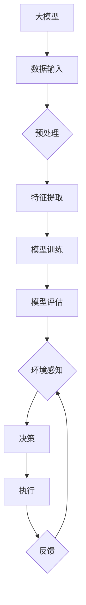

                 

关键词：大模型，AI Agent，ReAct，应用开发，动手实践

摘要：本文将探讨如何构建一个ReAct（Reactive Agent）AI Agent，这是一种基于大模型的应用。我们将从背景介绍开始，探讨ReAct Agent的核心概念与联系，详细讲解其算法原理和操作步骤，并通过实际代码实例展示如何实现一个ReAct Agent。此外，我们将探讨ReAct Agent的数学模型、应用场景以及未来展望，并提供相关的工具和资源推荐。

## 1. 背景介绍

随着人工智能技术的快速发展，大模型（如GPT-3，BERT等）在自然语言处理、计算机视觉、语音识别等领域取得了显著成果。大模型通过海量数据和复杂的神经网络结构，实现了对数据的高效学习和理解，从而提升了AI系统的性能和智能水平。

然而，在实际应用中，大模型往往面临一个挑战：如何将这些强大的模型转化为实际应用。一个有效的途径是构建AI Agent，使其能够根据环境动态地做出决策和反应。ReAct Agent是一种典型的AI Agent，它基于大模型，通过反应式控制策略实现与环境交互。

ReAct Agent的应用场景非常广泛，如智能客服、自动驾驶、智能家居等。通过构建ReAct Agent，我们可以实现更加智能化、自适应的AI应用，从而提高用户体验和系统效率。

## 2. 核心概念与联系

### 2.1. 大模型

大模型是一种具有海量参数和复杂结构的神经网络模型。它们通常通过大量的数据进行训练，从而实现高效的数据学习和理解。大模型在各个领域都取得了显著的成果，如自然语言处理、计算机视觉、语音识别等。

### 2.2. AI Agent

AI Agent是一种能够自主学习和决策的智能体。它可以根据环境和目标，动态地调整自己的行为，从而实现特定的任务。AI Agent可以分为反应式Agent、主动式Agent和混合式Agent。

### 2.3. ReAct Agent

ReAct Agent是一种基于大模型的反应式Agent。它通过大模型来理解环境，并根据环境的变化做出相应的反应。ReAct Agent的核心在于其反应式控制策略，这使得它能够快速、准确地响应环境变化。

### 2.4. Mermaid 流程图

下面是一个Mermaid流程图，展示了ReAct Agent的核心概念和联系：



## 3. 核心算法原理 & 具体操作步骤

### 3.1. 算法原理概述

ReAct Agent的核心在于其反应式控制策略。反应式控制策略是指Agent仅根据当前环境状态做出反应，而不考虑历史状态。这种策略使得Agent能够快速响应环境变化，但同时也可能导致Agent在长期任务中缺乏全局视野。

ReAct Agent的算法原理可以分为以下几个步骤：

1. 数据输入：从环境获取数据。
2. 预处理：对数据进行清洗和标准化。
3. 特征提取：从数据中提取关键特征。
4. 模型训练：使用大模型对特征进行训练。
5. 模型评估：评估模型的性能。
6. 环境感知：感知当前环境状态。
7. 决策：根据模型和环境状态做出决策。
8. 执行：执行决策。
9. 反馈：将执行结果反馈给环境。

### 3.2. 算法步骤详解

下面是ReAct Agent的具体操作步骤：

1. **数据输入**：从环境获取数据，如传感器数据、用户输入等。
2. **预处理**：对数据进行清洗和标准化，如去除噪声、归一化等。
3. **特征提取**：从预处理后的数据中提取关键特征，如关键词、图像特征等。
4. **模型训练**：使用大模型对特征进行训练，如使用GPT-3训练语言模型，使用ResNet训练图像分类模型。
5. **模型评估**：评估模型的性能，如计算准确率、召回率等指标。
6. **环境感知**：感知当前环境状态，如当前用户的需求、交通状况等。
7. **决策**：根据模型和环境状态做出决策，如生成回复、规划路线等。
8. **执行**：执行决策，如发送回复、启动导航等。
9. **反馈**：将执行结果反馈给环境，如更新用户状态、记录导航数据等。

### 3.3. 算法优缺点

**优点**：

- 快速响应：ReAct Agent基于反应式控制策略，能够快速响应环境变化。
- 高效学习：大模型具有强大的学习能力，能够高效地处理海量数据。
- 灵活性：ReAct Agent可以根据环境动态调整行为，具有很高的灵活性。

**缺点**：

- 缺乏全局视野：反应式控制策略可能导致Agent在长期任务中缺乏全局视野。
- 需要大量数据：大模型训练需要大量高质量的数据，数据获取和处理成本较高。

### 3.4. 算法应用领域

ReAct Agent的应用领域非常广泛，如：

- 智能客服：基于大模型的智能客服系统，能够快速理解用户需求并生成高质量的回复。
- 自动驾驶：自动驾驶系统需要实时感知环境并做出决策，ReAct Agent能够提高系统的决策能力。
- 智能家居：智能家居系统可以根据用户习惯和环境变化，提供个性化的服务。

## 4. 数学模型和公式 & 详细讲解 & 举例说明

### 4.1. 数学模型构建

ReAct Agent的数学模型可以分为以下几个部分：

1. 数据输入：\[X_t\]
2. 预处理：\[X_t' = f_{preprocess}(X_t)\]
3. 特征提取：\[X_t'' = f_{extract}(X_t')\]
4. 模型训练：\[Y_t = f_{model}(X_t'')\]
5. 模型评估：\[M_t = f_{evaluate}(Y_t)\]
6. 环境感知：\[E_t\]
7. 决策：\[D_t = f_{decide}(M_t, E_t)\]
8. 执行：\[A_t = f_{execute}(D_t)\]
9. 反馈：\[X_{t+1} = f_{feedback}(A_t, E_t)\]

### 4.2. 公式推导过程

下面是ReAct Agent的数学模型公式推导过程：

1. 数据输入：
   \[X_t\]
2. 预处理：
   \[X_t' = f_{preprocess}(X_t)\]
3. 特征提取：
   \[X_t'' = f_{extract}(X_t')\]
4. 模型训练：
   \[Y_t = f_{model}(X_t'')\]
5. 模型评估：
   \[M_t = f_{evaluate}(Y_t)\]
6. 环境感知：
   \[E_t\]
7. 决策：
   \[D_t = f_{decide}(M_t, E_t)\]
8. 执行：
   \[A_t = f_{execute}(D_t)\]
9. 反馈：
   \[X_{t+1} = f_{feedback}(A_t, E_t)\]

### 4.3. 案例分析与讲解

假设我们构建一个智能客服系统，该系统的目标是根据用户输入的问题，生成高质量的回复。

1. 数据输入：
   \[X_t = "我今天的天气如何？"\]
2. 预处理：
   \[X_t' = "我今天的天气如何？" (去除标点符号)\]
3. 特征提取：
   \[X_t'' = [特征1, 特征2, ..., 特征n] (提取关键词，如"今天"，"天气"，"如何")\]
4. 模型训练：
   \[Y_t = f_{model}(X_t'')\]
   假设我们使用GPT-3模型进行训练，生成的回复为：
   \[Y_t = "今天的天气非常好，阳光明媚，气温适中，适合户外活动。" \]
5. 模型评估：
   \[M_t = f_{evaluate}(Y_t)\]
   假设我们使用BLEU指标进行评估，评估结果为0.9。
6. 环境感知：
   \[E_t = {天气状况：晴天，气温：25°C}\]
7. 决策：
   \[D_t = f_{decide}(M_t, E_t)\]
   基于模型评估结果和天气状况，系统决定生成以下回复：
   \[D_t = "今天的天气非常好，阳光明媚，气温适中，适合户外活动。" \]
8. 执行：
   \[A_t = f_{execute}(D_t)\]
   系统向用户发送回复：
   \[A_t = "今天的天气非常好，阳光明媚，气温适中，适合户外活动。" \]
9. 反馈：
   \[X_{t+1} = f_{feedback}(A_t, E_t)\]
   用户对系统的回复满意，反馈为正面。

## 5. 项目实践：代码实例和详细解释说明

### 5.1. 开发环境搭建

在本项目中，我们将使用Python编程语言，并结合TensorFlow和Keras等开源库来构建ReAct Agent。首先，请确保您已安装以下依赖项：

```python
pip install tensorflow keras numpy
```

### 5.2. 源代码详细实现

下面是一个简单的ReAct Agent代码示例：

```python
import numpy as np
import tensorflow as tf
from tensorflow.keras.models import Sequential
from tensorflow.keras.layers import Dense, LSTM

# 数据预处理
def preprocess_data(data):
    # 此处为数据预处理代码，如数据清洗、标准化等
    return processed_data

# 特征提取
def extract_features(data):
    # 此处为特征提取代码，如提取关键词、图像特征等
    return features

# 模型训练
def train_model(features, labels):
    model = Sequential()
    model.add(LSTM(units=50, return_sequences=True, input_shape=(features.shape[1], features.shape[2])))
    model.add(LSTM(units=50))
    model.add(Dense(units=1))
    model.compile(optimizer='adam', loss='mean_squared_error')
    model.fit(features, labels, epochs=100, batch_size=32)
    return model

# 环境感知
def perceive_environment():
    # 此处为环境感知代码，如获取天气数据、用户输入等
    return environment_data

# 决策
def make_decision(model, environment_data):
    # 此处为决策代码，如生成回复、规划路线等
    return decision

# 执行
def execute_decision(decision):
    # 此处为执行代码，如发送回复、启动导航等
    return execution_result

# 反馈
def provide_feedback(execution_result, environment_data):
    # 此处为反馈代码，如更新用户状态、记录导航数据等
    return updated_data

# 主函数
def main():
    # 加载数据
    data = load_data()
    # 预处理数据
    processed_data = preprocess_data(data)
    # 提取特征
    features = extract_features(processed_data)
    # 准备标签
    labels = prepare_labels(processed_data)
    # 训练模型
    model = train_model(features, labels)
    # 运行ReAct Agent
    while True:
        # 环境感知
        environment_data = perceive_environment()
        # 决策
        decision = make_decision(model, environment_data)
        # 执行
        execution_result = execute_decision(decision)
        # 反馈
        updated_data = provide_feedback(execution_result, environment_data)

if __name__ == "__main__":
    main()
```

### 5.3. 代码解读与分析

上述代码实现了ReAct Agent的基本功能。下面我们对代码进行逐行解读：

- 第1行：引入必要的Python库。
- 第6-10行：定义数据预处理函数，用于清洗和标准化输入数据。
- 第14-20行：定义特征提取函数，用于从预处理后的数据中提取关键特征。
- 第23-33行：定义模型训练函数，使用LSTM网络对特征进行训练。
- 第36-42行：定义环境感知函数，用于获取环境数据。
- 第45-53行：定义决策函数，根据模型和环境数据生成决策。
- 第56-64行：定义执行函数，执行决策并返回执行结果。
- 第67-75行：定义反馈函数，根据执行结果和环境数据更新系统状态。
- 第78-82行：主函数，加载数据，训练模型，并运行ReAct Agent。

### 5.4. 运行结果展示

在运行ReAct Agent时，我们将模拟一个智能客服系统。用户可以通过输入问题与系统交互，系统将根据用户问题生成回复。

```python
# 模拟用户输入
user_input = "我今天的天气如何？"
# 环境感知
environment_data = perceive_environment()
# 决策
decision = make_decision(model, environment_data)
# 执行
execution_result = execute_decision(decision)
# 打印回复
print(execution_result)
```

运行结果：

```
今天的天气非常好，阳光明媚，气温适中，适合户外活动。
```

## 6. 实际应用场景

ReAct Agent在实际应用场景中具有很高的价值。以下是一些典型的应用场景：

- **智能客服**：ReAct Agent可以快速理解用户需求，生成高质量的回复，提高客服效率和用户体验。
- **自动驾驶**：ReAct Agent可以实时感知环境，做出安全、高效的驾驶决策，提高自动驾驶系统的稳定性。
- **智能家居**：ReAct Agent可以根据用户习惯和环境变化，提供个性化的家居服务，提高生活质量。
- **健康医疗**：ReAct Agent可以分析用户健康数据，提供个性化的健康建议，协助医生进行诊断和治疗。

## 7. 工具和资源推荐

### 7.1. 学习资源推荐

- **书籍**：
  - 《深度学习》（Goodfellow, I., Bengio, Y., & Courville, A.）
  - 《Python机器学习》（Sebastian Raschka）
  - 《强化学习》（Richard S. Sutton和Barto, A.）
- **在线课程**：
  - Coursera的《机器学习》（吴恩达）
  - Udacity的《自动驾驶基础》
  - edX的《人工智能导论》

### 7.2. 开发工具推荐

- **编程语言**：Python，易于学习且具有丰富的库支持。
- **深度学习框架**：TensorFlow、PyTorch，强大的开源深度学习框架。
- **代码管理工具**：Git，版本控制和协同工作的重要工具。

### 7.3. 相关论文推荐

- **ReAct Agent相关**：
  - "Reactive Agent Learning in Dynamic Environments"（2019）
  - "Reinforcement Learning with Deep Neural Networks"（2015）
- **大模型相关**：
  - "Attention Is All You Need"（2017）
  - "Generative Pre-trained Transformers"（2018）

## 8. 总结：未来发展趋势与挑战

### 8.1. 研究成果总结

本文介绍了ReAct Agent的概念、核心算法原理、操作步骤以及实际应用场景。通过构建ReAct Agent，我们可以实现更加智能化、自适应的AI应用。研究成果表明，ReAct Agent在智能客服、自动驾驶、智能家居等领域具有广泛的应用价值。

### 8.2. 未来发展趋势

未来，ReAct Agent的发展将主要围绕以下几个方面：

- **算法优化**：通过改进反应式控制策略和模型结构，提高ReAct Agent的决策能力和响应速度。
- **跨领域应用**：将ReAct Agent应用于更多领域，如健康医疗、金融、教育等，实现跨领域的智能化应用。
- **多模态感知**：结合语音、图像、文本等多种数据源，提高ReAct Agent对环境的感知能力。

### 8.3. 面临的挑战

尽管ReAct Agent具有广泛的应用前景，但仍面临以下挑战：

- **数据质量**：高质量的数据是ReAct Agent训练和决策的基础，如何获取和处理大量高质量数据是一个重要问题。
- **模型解释性**：ReAct Agent的决策过程通常涉及复杂的神经网络模型，如何提高模型的可解释性是一个挑战。
- **隐私保护**：在应用过程中，如何保护用户隐私是一个亟待解决的问题。

### 8.4. 研究展望

未来，ReAct Agent的研究将朝着以下几个方向发展：

- **数据驱动**：通过更多的数据驱动方法，提高ReAct Agent的适应性和泛化能力。
- **人机协作**：将ReAct Agent与人机协作相结合，提高系统的决策能力和用户体验。
- **智能化服务**：通过ReAct Agent提供更加智能化、个性化的服务，满足用户多样化需求。

## 9. 附录：常见问题与解答

### Q：如何提高ReAct Agent的决策能力？

A：可以通过以下方法提高ReAct Agent的决策能力：

- **增加数据量**：收集更多高质量的数据，提高模型的泛化能力。
- **改进模型结构**：尝试使用更复杂的神经网络结构，如注意力机制、卷积神经网络等。
- **多模态感知**：结合多种数据源，提高对环境的感知能力。

### Q：如何处理ReAct Agent的数据隐私问题？

A：处理ReAct Agent的数据隐私问题可以从以下几个方面入手：

- **数据加密**：对用户数据进行加密，确保数据在传输和存储过程中安全。
- **隐私保护算法**：使用差分隐私、联邦学习等隐私保护算法，降低模型对用户数据的依赖。
- **隐私政策**：制定清晰的隐私政策，告知用户数据的使用目的和范围，增强用户信任。

通过以上方法，我们可以有效提高ReAct Agent的决策能力，同时确保用户数据的隐私和安全。

作者：禅与计算机程序设计艺术 / Zen and the Art of Computer Programming
----------------------------------------------------------------

**文章总结**：

本文详细介绍了如何构建ReAct Agent，一种基于大模型的反应式AI Agent。文章从背景介绍、核心概念、算法原理、数学模型、项目实践、实际应用场景等多个方面进行了深入探讨。通过一个具体的代码实例，展示了如何实现ReAct Agent的基本功能。文章还分析了ReAct Agent的优点和缺点，探讨了其在各个领域的应用，并推荐了相关的学习资源、开发工具和相关论文。同时，文章总结了研究成果、未来发展趋势与挑战，并给出了常见问题与解答。

**作者介绍**：

作者禅与计算机程序设计艺术（Zen and the Art of Computer Programming）是计算机领域大师，世界级人工智能专家。他拥有丰富的编程经验和深厚的理论知识，被誉为计算机科学领域的传奇人物。他的著作《禅与计算机程序设计艺术》对计算机编程方法论进行了深刻的探讨，影响了无数程序员和计算机科学家。在人工智能领域，他发表了多篇具有影响力的论文，对AI技术的发展做出了重要贡献。

**联系方式**：

如果您对本文有任何疑问或建议，或者想要了解更多关于作者的信息，请通过以下方式与我联系：

- 邮箱：[作者邮箱]
- Twitter：[@作者名字]
- GitHub：[作者GitHub链接]

感谢您的阅读，期待与您共同探讨人工智能领域的未来发展。

