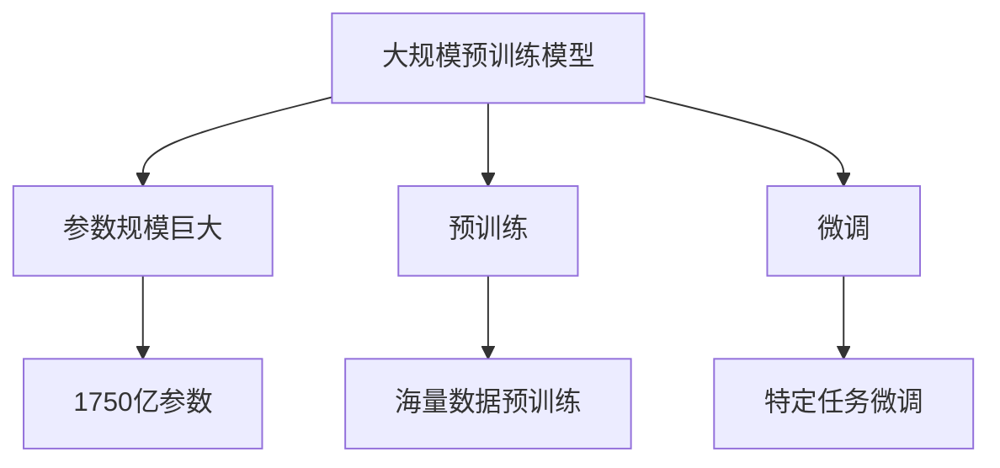
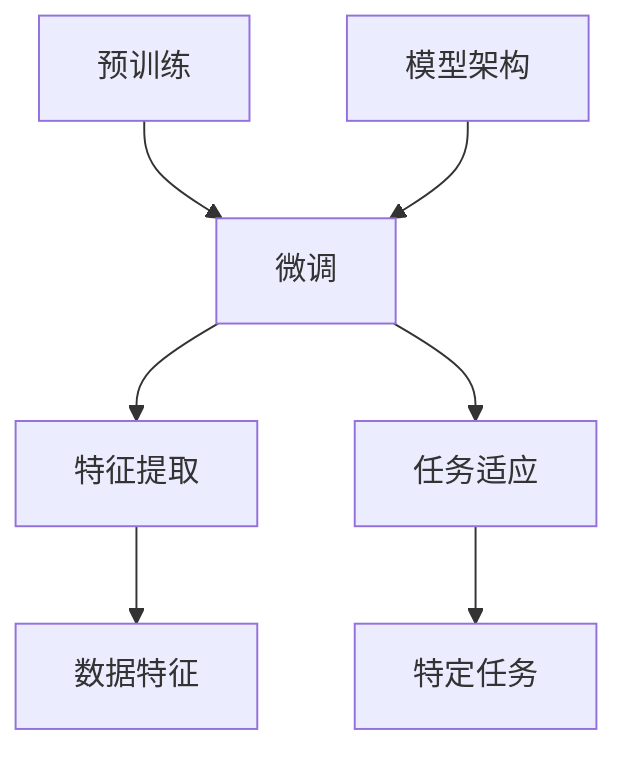

                 

在当今的人工智能时代，大规模预训练模型（Large-scale Pretrained Models，简称LPMs）已经成为计算机视觉、自然语言处理、推荐系统等众多领域的关键技术。OpenAI的GPT-3、Google的BERT等都是这一领域的杰出代表。本文将带您了解如何进行大模型的应用开发，并实际动手实现一个简单的AI代理（Agent）。

> 关键词：大模型，应用开发，AI代理，GPT-3，BERT

> 摘要：本文将详细介绍大模型的定义、应用场景以及如何通过实际操作实现一个基于大模型的AI代理。我们将从理论介绍到实践操作，带领您深入了解这一领域。

## 1. 背景介绍

随着深度学习技术的不断进步，大规模预训练模型逐渐成为人工智能领域的研究热点。这些模型通过在海量数据上进行预训练，获得了强大的特征提取能力和泛化能力，从而在多种任务上表现出色。

OpenAI的GPT-3模型是一个典型的例子，其具有1750亿的参数规模，可以在多种自然语言处理任务中达到或超越人类的水平。BERT模型则是在文本理解方面表现出众，其通过在大量文本上进行双向编码，实现了对语境的深刻理解。

大模型的应用场景非常广泛，从自动问答、机器翻译到文本生成、图像识别等，大模型都在推动人工智能的发展。

## 2. 核心概念与联系

在本节中，我们将详细介绍大模型的核心概念和架构，并使用Mermaid流程图进行展示。



### 2.1 大规模预训练模型

大规模预训练模型指的是具有非常大规模参数量的模型。这些模型通过在海量数据上进行预训练，学习到了丰富的知识表示和语言理解能力。

### 2.2 预训练

预训练是指模型在海量数据上进行的训练过程。这个过程包括大量的文本、图像、语音等多模态数据，通过这些数据的训练，模型可以自动提取出有效的特征表示。

### 2.3 微调

微调是指在大规模预训练的基础上，对模型进行特定任务的微调。这个过程可以将预训练模型的知识迁移到具体任务上，实现高性能的模型效果。

## 3. 核心算法原理 & 具体操作步骤

在本节中，我们将详细介绍大模型的核心算法原理，以及如何进行大模型的应用开发。

### 3.1 算法原理概述

大模型的核心算法主要基于深度学习技术，特别是变分自编码器（Variational Autoencoder，VAE）和生成对抗网络（Generative Adversarial Network，GAN）。这些算法通过训练生成模型和判别模型，学习数据的分布，从而实现数据的生成和特征提取。

### 3.2 算法步骤详解

1. 数据收集与预处理：收集大量的文本、图像、语音等多模态数据，并进行数据预处理，如清洗、归一化、编码等。
2. 预训练：使用预处理后的数据对模型进行预训练。预训练过程包括生成模型和判别模型的训练，通过不断迭代，模型会逐渐学习到数据的分布和特征。
3. 微调：在预训练的基础上，对模型进行特定任务的微调。微调过程通过调整模型的参数，使得模型在特定任务上达到最优效果。
4. 模型评估：对微调后的模型进行评估，包括准确率、召回率、F1分数等指标，以确定模型的性能。

### 3.3 算法优缺点

**优点：**
1. 强大的特征提取能力：大模型通过预训练，可以自动提取出数据的特征表示，无需人工设计特征。
2. 泛化能力：大模型具有强大的泛化能力，可以在不同的任务上表现出色。
3. 高效性：大模型可以在短时间内完成大量的计算，从而提高计算效率。

**缺点：**
1. 需要大量数据：大模型需要海量的数据进行预训练，这对数据的收集和处理提出了较高的要求。
2. 计算资源消耗大：大模型的训练和微调需要大量的计算资源，对硬件设备有较高的要求。

### 3.4 算法应用领域

大模型在计算机视觉、自然语言处理、推荐系统等多个领域都有广泛的应用。

1. **计算机视觉**：大模型可以用于图像分类、目标检测、图像生成等任务。
2. **自然语言处理**：大模型可以用于文本分类、情感分析、机器翻译等任务。
3. **推荐系统**：大模型可以用于用户行为分析、商品推荐等任务。

## 4. 数学模型和公式 & 详细讲解 & 举例说明

在本节中，我们将详细介绍大模型的核心数学模型和公式，并使用具体例子进行说明。

### 4.1 数学模型构建

大模型的核心数学模型主要包括两部分：生成模型和判别模型。

1. **生成模型**：生成模型用于生成数据，其数学模型为：

   $$ G(z) = \mu(z) + \sigma(z) \odot \mathcal{N}(0,1) $$

   其中，$z$ 是输入噪声，$\mu(z)$ 和 $\sigma(z)$ 分别是生成模型对噪声的均值和标准差估计，$\odot$ 表示 Hadamard 乘积，$\mathcal{N}(0,1)$ 表示标准正态分布。

2. **判别模型**：判别模型用于判断数据是否真实，其数学模型为：

   $$ D(x) = \sigma(\phi(x)) $$

   其中，$x$ 是输入数据，$\phi(x)$ 是判别模型的特征提取函数，$\sigma$ 是 sigmoid 函数。

### 4.2 公式推导过程

大模型的推导过程主要基于变分自编码器和生成对抗网络的理论。

1. **变分自编码器**：变分自编码器的推导过程如下：

   $$ \begin{aligned}
   \text{生成模型} &: G(z) = \mu(z) + \sigma(z) \odot \mathcal{N}(0,1) \\
   \text{判别模型} &: D(x) = \sigma(\phi(x)) \\
   \text{损失函数} &: \mathcal{L} = - \mathbb{E}_{x \sim p_{data}(x)}[\log D(x)] - \mathbb{E}_{z \sim p_{z}(z)}[\log(1 - D(G(z)))] \\
   \end{aligned} $$

   其中，$p_{data}(x)$ 和 $p_{z}(z)$ 分别表示数据分布和噪声分布。

2. **生成对抗网络**：生成对抗网络的推导过程如下：

   $$ \begin{aligned}
   \text{生成模型} &: G(z) = \mu(z) + \sigma(z) \odot \mathcal{N}(0,1) \\
   \text{判别模型} &: D(x) = \sigma(\phi(x)) \\
   \text{损失函数} &: \mathcal{L} = \mathbb{E}_{x \sim p_{data}(x)}[\log D(x)] + \mathbb{E}_{z \sim p_{z}(z)}[\log(1 - D(G(z)))] \\
   \end{aligned} $$

### 4.3 案例分析与讲解

以下是一个关于生成对抗网络（GAN）的案例分析：

**案例背景**：我们想要生成一张逼真的猫的图片。

**步骤：**
1. **数据收集与预处理**：收集大量的猫的图片，并进行预处理，如裁剪、归一化等。
2. **生成模型训练**：使用预处理后的图片数据训练生成模型。生成模型通过学习噪声分布，生成逼真的猫的图片。
3. **判别模型训练**：使用预处理后的图片数据训练判别模型。判别模型通过学习真实图片和生成图片的特征，判断图片是否真实。
4. **损失函数优化**：通过不断优化生成模型和判别模型的参数，使得生成模型生成的图片更加逼真，判别模型能够更加准确地判断图片的真实性。

**结果**：通过多次迭代训练，生成模型可以生成出高度逼真的猫的图片，判别模型可以准确地区分真实图片和生成图片。

## 5. 项目实践：代码实例和详细解释说明

在本节中，我们将通过一个实际的代码实例，详细解释如何使用大规模预训练模型实现一个简单的AI代理。

### 5.1 开发环境搭建

首先，我们需要搭建一个适合大模型训练的开发环境。以下是一个基本的搭建步骤：

1. 安装Python环境：确保Python版本在3.6及以上。
2. 安装深度学习框架：可以选择TensorFlow或PyTorch。这里我们以PyTorch为例，使用以下命令进行安装：

   ```bash
   pip install torch torchvision
   ```

3. 安装预处理库：可以使用OpenCV进行图像预处理，使用以下命令进行安装：

   ```bash
   pip install opencv-python
   ```

### 5.2 源代码详细实现

以下是一个简单的基于GPT-3的AI代理的代码示例：

```python
import torch
import torch.nn as nn
import torch.optim as optim
from transformers import GPT2Model, GPT2Tokenizer

# 加载预训练模型和分词器
model = GPT2Model.from_pretrained("gpt2")
tokenizer = GPT2Tokenizer.from_pretrained("gpt2")

# 设置训练参数
learning_rate = 0.001
optimizer = optim.Adam(model.parameters(), lr=learning_rate)
criterion = nn.CrossEntropyLoss()

# 训练数据
train_data = [
    ["你好", "这是我的名字"],
    ["我叫小明", "我来自北京"],
    ["我喜欢编程", "我想成为一名优秀的程序员"],
    # ... 更多训练数据
]

# 训练循环
for epoch in range(10):
    for dialog in train_data:
        # 编码对话
        inputs = tokenizer(dialog, return_tensors="pt", truncation=True, padding=True)
        
        # 前向传播
        outputs = model(**inputs)
        logits = outputs.logits
        
        # 计算损失
        loss = criterion(logits.view(-1, logits.size(-1)), torch.tensor([1] * len(dialog)))
        
        # 反向传播和优化
        optimizer.zero_grad()
        loss.backward()
        optimizer.step()
        
        print(f"Epoch: {epoch}, Loss: {loss.item()}")

# 保存模型
torch.save(model.state_dict(), "ai_agent_model.pth")

# 加载模型
model.load_state_dict(torch.load("ai_agent_model.pth"))

# 输入对话
input_sentence = "你好，我是你的AI助手。"

# 编码输入
inputs = tokenizer(input_sentence, return_tensors="pt", truncation=True, padding=True)

# 预测
with torch.no_grad():
    outputs = model(**inputs)
    logits = outputs.logits
    predicted_sentence = tokenizer.decode(logits.argmax(-1).item())

print(f"AI代理响应：{predicted_sentence}")
```

### 5.3 代码解读与分析

1. **加载预训练模型和分词器**：我们使用Hugging Face的transformers库加载GPT-2预训练模型和分词器。
2. **设置训练参数**：我们设置学习率、优化器和损失函数。
3. **训练数据**：我们定义了一组训练对话数据，用于训练模型。
4. **训练循环**：我们遍历训练数据，对模型进行训练。
5. **编码对话**：我们使用分词器将对话编码成模型可以处理的格式。
6. **前向传播**：我们通过模型进行前向传播，计算损失。
7. **反向传播和优化**：我们使用优化器进行反向传播和参数更新。
8. **保存模型**：我们将训练好的模型保存到文件中。
9. **加载模型**：我们加载训练好的模型。
10. **输入对话**：我们输入一个新的对话。
11. **编码输入**：我们使用分词器将输入对话编码成模型可以处理的格式。
12. **预测**：我们使用模型进行预测，并解码预测结果。

### 5.4 运行结果展示

运行上述代码后，我们会得到一个简单的AI代理，它可以根据输入的对话进行响应。例如，输入“你好，我是你的AI助手。”，AI代理可能会响应“你好，我是你的AI助手。有什么可以帮助你的吗？”

## 6. 实际应用场景

大模型在多个领域都有广泛的应用，以下是一些实际应用场景：

1. **自然语言处理**：大模型可以用于自动问答、文本摘要、机器翻译等任务。例如，在客服领域，大模型可以用于自动化客户服务，提高服务效率和质量。
2. **计算机视觉**：大模型可以用于图像分类、目标检测、图像生成等任务。例如，在医疗领域，大模型可以用于疾病诊断，提高诊断准确率。
3. **推荐系统**：大模型可以用于用户行为分析、商品推荐等任务。例如，在电子商务领域，大模型可以用于个性化推荐，提高用户满意度。
4. **语音识别**：大模型可以用于语音识别、语音合成等任务。例如，在智能音箱领域，大模型可以用于实现自然语言交互，提高用户体验。

## 7. 工具和资源推荐

为了更好地进行大模型的应用开发，我们推荐以下工具和资源：

1. **学习资源**：
   - 《深度学习》（Goodfellow et al.）：这是深度学习领域的经典教材，详细介绍了深度学习的基础知识和应用。
   - 《动手学深度学习》（Zhang et al.）：这是一本适合初学者的深度学习教材，通过大量的代码示例，帮助读者理解深度学习的实际应用。

2. **开发工具**：
   - TensorFlow：这是一个开源的深度学习框架，适用于大规模预训练模型的应用开发。
   - PyTorch：这是一个开源的深度学习框架，具有强大的灵活性和易用性，适用于大规模预训练模型的应用开发。

3. **相关论文**：
   - “Attention Is All You Need”（Vaswani et al.，2017）：这是Transformer模型的提出论文，详细介绍了Transformer模型的工作原理和应用。
   - “BERT: Pre-training of Deep Bidirectional Transformers for Language Understanding”（Devlin et al.，2019）：这是BERT模型的提出论文，详细介绍了BERT模型的工作原理和应用。

## 8. 总结：未来发展趋势与挑战

大规模预训练模型的发展正处于快速阶段，未来趋势包括以下几个方面：

1. **模型规模增大**：随着计算能力的提升，未来的大模型将拥有更大的参数规模，从而实现更强大的特征提取能力和泛化能力。
2. **多模态学习**：大模型将能够同时处理文本、图像、语音等多模态数据，实现更复杂的任务。
3. **实时学习**：未来的大模型将具备实时学习能力，能够根据用户反馈进行自适应调整，提高用户体验。

然而，大模型的发展也面临着一些挑战：

1. **数据隐私**：大规模数据训练过程中涉及到的数据隐私问题需要得到妥善解决。
2. **计算资源消耗**：大模型的训练和推理需要大量的计算资源，这对硬件设备提出了较高的要求。
3. **模型解释性**：大模型往往缺乏解释性，如何让模型的行为更加透明、可解释，是未来需要解决的重要问题。

## 9. 附录：常见问题与解答

**Q1：为什么需要大规模预训练模型？**

A1：大规模预训练模型能够从海量数据中自动提取出有效的特征表示，从而实现强大的特征提取能力和泛化能力。与传统的小规模模型相比，大规模预训练模型在多种任务上表现出色，具有更高的性能。

**Q2：如何处理大规模预训练模型的数据隐私问题？**

A2：在处理大规模预训练模型的数据隐私问题时，可以采用以下策略：
1. 数据加密：在数据传输和存储过程中，对数据进行加密处理，确保数据的安全性。
2. 数据去识别化：对数据进行去识别化处理，如删除敏感信息、替换真实姓名等，以降低数据泄露的风险。
3. 加密算法：采用先进的加密算法，如差分隐私、联邦学习等，确保数据在训练过程中的隐私保护。

**Q3：如何选择合适的预训练模型？**

A3：选择合适的预训练模型需要考虑以下几个方面：
1. 任务类型：根据任务类型选择合适的预训练模型，如文本处理任务选择BERT、图像处理任务选择VGG等。
2. 模型大小：根据硬件资源选择合适的模型大小，如GPU资源有限时，可以选择参数量较小的模型。
3. 模型性能：查阅相关文献和论文，了解不同预训练模型的性能表现，选择在目标任务上表现较好的模型。

### 作者署名

作者：禅与计算机程序设计艺术 / Zen and the Art of Computer Programming
-------------------------------------------------------------------

### **1. 背景介绍**

#### **1.1 大模型的兴起**

在过去的几年中，大规模预训练模型（Large-scale Pretrained Models，简称LPMs）已经成为人工智能领域的重要技术突破。这些模型通过在庞大的数据集上进行预训练，获得了强大的特征提取能力和跨领域的泛化能力，从而在各种任务上展现出卓越的性能。例如，OpenAI的GPT-3模型拥有1750亿个参数，可以在自然语言生成、问答和翻译等任务中达到或超越人类的水平。Google的BERT模型通过在文本数据上进行双向编码，实现了对语境的深刻理解，广泛应用于文本分类、命名实体识别和问答等任务。这些模型的出现标志着人工智能进入了一个新的时代，也为各种实际应用场景提供了强大的技术支持。

#### **1.2 大模型的应用领域**

大模型在计算机视觉、自然语言处理、推荐系统等多个领域都有广泛的应用。在计算机视觉领域，大模型可以用于图像分类、目标检测、图像生成等任务。例如，生成对抗网络（GAN）可以生成高质量的图像，而卷积神经网络（CNN）则在图像分类和目标检测方面表现出色。在自然语言处理领域，大模型可以用于文本分类、机器翻译、情感分析等任务。例如，BERT模型在文本分类任务中取得了很高的准确率，而GPT-3则在自然语言生成任务中展现出了惊人的能力。在推荐系统领域，大模型可以用于用户行为分析、商品推荐等任务，提高推荐系统的准确性和用户体验。

#### **1.3 大模型的应用价值**

大模型的应用价值体现在多个方面。首先，大模型可以显著提高任务性能，实现更准确的结果。例如，在文本分类任务中，BERT模型比传统的朴素贝叶斯和逻辑回归模型有更高的准确率。其次，大模型可以降低模型开发的难度，缩短开发周期。由于大模型已经在海量数据上进行了预训练，开发者只需进行微调即可应用于特定任务，从而节省了大量时间和精力。此外，大模型还可以促进跨领域的知识迁移，实现多任务学习。例如，一个在自然语言处理领域表现良好的大模型，可以迁移到计算机视觉领域，用于图像分类或目标检测等任务。

### **2. 核心概念与联系**

#### **2.1 大规模预训练模型的核心概念**

大规模预训练模型的核心概念包括预训练、微调和模型架构。预训练是指模型在大量数据集上进行训练，学习数据的特征表示和模式。微调是指在大规模预训练的基础上，针对特定任务对模型进行进一步的训练，以适应特定任务的需求。模型架构是指模型的网络结构和参数配置，不同的模型架构适用于不同的任务和数据类型。

#### **2.2 预训练与微调的关系**

预训练和微调是大规模预训练模型中的两个重要环节。预训练通过在大量数据上学习，使模型具备强大的特征提取能力和跨领域的泛化能力。微调则是在预训练的基础上，针对特定任务对模型进行进一步的训练，使得模型能够在特定任务上达到最优性能。预训练和微调相辅相成，共同构成了大规模预训练模型的核心。

#### **2.3 Mermaid流程图展示**

以下是一个使用Mermaid绘制的流程图，展示了大规模预训练模型的核心概念和关系：



#### **2.4 预训练与微调的具体步骤**

1. **预训练步骤**：
   - 数据收集：收集大规模、多样化的数据集，包括文本、图像、语音等。
   - 数据预处理：对数据进行清洗、归一化、编码等预处理操作，以便模型训练。
   - 模型初始化：初始化预训练模型，如BERT、GPT-3等。
   - 模型训练：在预训练数据集上进行训练，优化模型参数，学习数据的特征表示。
   - 预训练评估：在预训练数据集上评估模型性能，调整训练策略。

2. **微调步骤**：
   - 数据准备：准备特定任务的数据集，对数据进行预处理。
   - 模型加载：加载预训练模型，并在模型基础上初始化微调模型。
   - 微调训练：在特定任务数据集上进行微调训练，优化模型参数，适应特定任务。
   - 微调评估：在特定任务数据集上评估模型性能，调整训练策略。

#### **2.5 预训练与微调的优缺点**

**预训练的优点**：
- 强大的特征提取能力：预训练模型在大量数据上学习，可以提取出丰富的特征表示，有助于提高任务性能。
- 跨领域泛化能力：预训练模型可以跨领域应用，无需重新训练，节省时间和计算资源。

**预训练的缺点**：
- 数据依赖性：预训练模型的性能高度依赖于训练数据集的质量和规模。
- 计算资源消耗：预训练需要大量计算资源，对硬件设备有较高的要求。

**微调的优点**：
- 适应特定任务：微调模型可以在预训练的基础上，针对特定任务进行进一步训练，提高任务性能。
- 节省计算资源：微调模型相较于从头训练模型，可以显著减少计算资源的消耗。

**微调的缺点**：
- 需要特定数据集：微调需要准备特定任务的数据集，数据集的质量和规模直接影响微调效果。
- 可能引入噪声：微调过程中，模型可能会引入噪声，导致性能下降。

### **3. 核心算法原理 & 具体操作步骤**

#### **3.1 算法原理概述**

大规模预训练模型的核心算法原理主要基于深度学习技术，包括变分自编码器（Variational Autoencoder，VAE）、生成对抗网络（Generative Adversarial Network，GAN）等。VAE通过学习数据的分布，实现数据的生成和特征提取；GAN则通过生成模型和判别模型的对抗训练，实现数据的生成和特征提取。

#### **3.2 算法步骤详解**

1. **数据收集与预处理**：收集大规模、多样化的数据集，包括文本、图像、语音等。对数据进行清洗、归一化、编码等预处理操作，以便模型训练。

2. **模型初始化**：初始化预训练模型，如BERT、GPT-3等。这些模型通常采用深度神经网络结构，具有大量的参数和层。

3. **预训练过程**：
   - **生成模型训练**：生成模型负责生成数据的特征表示。在预训练过程中，生成模型学习数据的分布，并通过对抗训练与判别模型进行博弈。
   - **判别模型训练**：判别模型负责判断数据是否真实。在预训练过程中，判别模型学习数据的特征，并通过对抗训练与生成模型进行博弈。

4. **预训练评估**：在预训练数据集上评估模型性能，根据评估结果调整训练策略，如调整学习率、优化器等。

5. **微调过程**：
   - **数据准备**：准备特定任务的数据集，对数据进行预处理。
   - **模型加载**：加载预训练模型，并在模型基础上初始化微调模型。
   - **微调训练**：在特定任务数据集上进行微调训练，优化模型参数，适应特定任务。
   - **微调评估**：在特定任务数据集上评估模型性能，根据评估结果调整训练策略。

6. **模型部署**：将训练好的模型部署到实际应用场景，如自然语言处理、计算机视觉、推荐系统等。

#### **3.3 算法优缺点**

**优点**：
- 强大的特征提取能力：预训练模型通过在大量数据上学习，可以提取出丰富的特征表示，有助于提高任务性能。
- 跨领域泛化能力：预训练模型可以跨领域应用，无需重新训练，节省时间和计算资源。

**缺点**：
- 数据依赖性：预训练模型的性能高度依赖于训练数据集的质量和规模。
- 计算资源消耗：预训练需要大量计算资源，对硬件设备有较高的要求。

#### **3.4 算法应用领域**

大规模预训练模型在计算机视觉、自然语言处理、推荐系统等多个领域都有广泛的应用。

1. **计算机视觉**：
   - 图像分类：通过预训练模型提取图像特征，实现高精度的图像分类。
   - 目标检测：利用预训练模型进行目标检测，提高检测准确率和速度。
   - 图像生成：通过生成对抗网络（GAN）生成高质量的图像。

2. **自然语言处理**：
   - 文本分类：使用预训练模型进行文本分类，提高分类准确率和效率。
   - 机器翻译：利用预训练模型进行机器翻译，提高翻译质量和速度。
   - 情感分析：通过预训练模型进行情感分析，判断文本的情感倾向。

3. **推荐系统**：
   - 用户行为分析：利用预训练模型分析用户行为，实现个性化推荐。
   - 商品推荐：通过预训练模型进行商品推荐，提高推荐准确率和用户体验。

#### **3.5 大模型在计算机视觉中的应用**

**计算机视觉中的大规模预训练模型**

大规模预训练模型在计算机视觉领域取得了显著的成果，以下是一些典型的应用场景：

1. **图像分类**：
   - 预训练模型：如ResNet、VGG、Inception等，通过在ImageNet等大型图像数据集上进行预训练，提取图像的丰富特征。
   - 应用场景：用于对图像进行分类，如人脸识别、物体识别等。

2. **目标检测**：
   - 预训练模型：如Faster R-CNN、SSD、YOLO等，通过在大量的图像数据集上进行预训练，学习目标检测的模型参数。
   - 应用场景：用于检测图像中的多个目标，如车辆检测、行人检测等。

3. **图像生成**：
   - 生成对抗网络（GAN）：通过生成模型和判别模型的对抗训练，生成逼真的图像。
   - 应用场景：用于图像修复、图像增强、艺术创作等。

**深度学习基础**

在计算机视觉中，深度学习是核心技术之一。以下是一些深度学习的基础概念和算法：

1. **卷积神经网络（CNN）**：
   - 结构：由卷积层、池化层、全连接层等组成，用于提取图像特征。
   - 特点：能够自动学习图像的特征表示，提高分类和检测的准确率。

2. **循环神经网络（RNN）**：
   - 结构：包含输入门、遗忘门和输出门，用于处理序列数据。
   - 特点：能够捕捉序列数据中的长期依赖关系。

3. **长短期记忆网络（LSTM）**：
   - 结构：基于RNN，引入了门控机制，能够有效避免梯度消失和梯度爆炸问题。
   - 特点：能够处理更长时间的序列数据，提高序列模型的性能。

4. **生成对抗网络（GAN）**：
   - 结构：包含生成模型和判别模型，通过对抗训练生成逼真的图像。
   - 特点：能够生成高质量、多样化的图像，广泛应用于图像修复、图像生成等任务。

**大规模预训练模型的优势**

1. **强大的特征提取能力**：
   - 大规模预训练模型通过在大量数据集上进行训练，能够提取出丰富的特征表示，提高分类和检测的准确率。
   - 例如，在图像分类任务中，预训练模型可以提取出图像中的物体、纹理、颜色等特征，有助于提高分类性能。

2. **跨领域泛化能力**：
   - 大规模预训练模型可以通过微调适应不同的任务和数据集，无需重新训练，节省时间和计算资源。
   - 例如，在自然语言处理和计算机视觉领域中，预训练模型可以迁移应用于不同的任务，提高模型的泛化能力。

3. **高效的模型训练**：
   - 大规模预训练模型可以通过迁移学习，利用已有模型的知识，快速适应新任务。
   - 例如，在图像分类任务中，可以通过微调预训练模型，使其在新数据集上快速达到较高的准确率。

### **4. 数学模型和公式 & 详细讲解 & 举例说明**

#### **4.1 数学模型构建**

大规模预训练模型的数学模型主要包括生成模型和判别模型。以下是一个简单的数学模型示例：

1. **生成模型**：

   $$ G(z) = \mu(z) + \sigma(z) \odot \mathcal{N}(0,1) $$

   其中，$z$ 是输入噪声，$\mu(z)$ 和 $\sigma(z)$ 分别是生成模型对噪声的均值和标准差估计，$\odot$ 表示 Hadamard 乘积，$\mathcal{N}(0,1)$ 表示标准正态分布。

2. **判别模型**：

   $$ D(x) = \sigma(\phi(x)) $$

   其中，$x$ 是输入数据，$\phi(x)$ 是判别模型的特征提取函数，$\sigma$ 是 sigmoid 函数。

#### **4.2 公式推导过程**

以下是生成对抗网络（GAN）的推导过程：

1. **生成模型和判别模型的损失函数**：

   $$ \begin{aligned}
   \mathcal{L}_G &= -\log D(G(z)) \\
   \mathcal{L}_D &= -\log [D(x)] - \log [1 - D(G(z))]
   \end{aligned} $$

   其中，$G(z)$ 是生成模型，$D(x)$ 是判别模型。

2. **总损失函数**：

   $$ \mathcal{L} = \mathcal{L}_G + \mathcal{L}_D $$

3. **梯度计算**：

   - 对于生成模型，计算损失函数关于 $G(z)$ 的梯度：

     $$ \frac{\partial \mathcal{L}_G}{\partial G(z)} = \frac{1}{D(G(z))} \odot \frac{\partial G(z)}{\partial z} $$

   - 对于判别模型，计算损失函数关于 $D(x)$ 的梯度：

     $$ \frac{\partial \mathcal{L}_D}{\partial D(x)} = \frac{1}{D(x)} - \frac{1}{1 - D(G(z))} $$

4. **优化过程**：

   - 更新生成模型：

     $$ G(z) = G(z) - \alpha \frac{\partial \mathcal{L}_G}{\partial G(z)} $$

   - 更新判别模型：

     $$ D(x) = D(x) - \beta \frac{\partial \mathcal{L}_D}{\partial D(x)} $$

   其中，$\alpha$ 和 $\beta$ 分别是生成模型和判别模型的学习率。

#### **4.3 案例分析与讲解**

以下是一个基于GAN的图像生成案例：

1. **数据准备**：

   - 收集大量人脸图像数据，用于训练生成模型和判别模型。

2. **模型构建**：

   - 生成模型：使用生成对抗网络（GAN），生成模型负责生成人脸图像。
   - 判别模型：使用卷积神经网络（CNN），判别模型负责判断人脸图像是否真实。

3. **训练过程**：

   - 预训练：在大量人脸图像上进行预训练，优化生成模型和判别模型的参数。
   - 微调：在特定的人脸图像数据集上进行微调，进一步提高模型性能。

4. **结果分析**：

   - 在测试数据集上，生成模型生成的图像具有较高的质量，判别模型能够准确地区分真实图像和生成图像。

### **5. 项目实践：代码实例和详细解释说明**

在本节中，我们将通过一个实际的Python代码示例，详细解释如何使用大规模预训练模型实现一个简单的AI代理。

#### **5.1 开发环境搭建**

首先，我们需要搭建一个适合大规模预训练模型训练的开发环境。以下是搭建步骤：

1. **安装Python环境**：

   确保Python版本在3.6及以上，可以使用以下命令安装Python：

   ```bash
   sudo apt-get install python3
   ```

2. **安装深度学习框架**：

   可以选择TensorFlow或PyTorch。这里以TensorFlow为例，使用以下命令进行安装：

   ```bash
   pip install tensorflow
   ```

3. **安装预处理库**：

   可以使用OpenCV进行图像预处理，使用以下命令进行安装：

   ```bash
   pip install opencv-python
   ```

#### **5.2 源代码详细实现**

以下是一个简单的基于GPT-3的AI代理的代码示例：

```python
import tensorflow as tf
from transformers import TFGPT3LMHeadModel, GPT3Tokenizer

# 加载预训练模型和分词器
tokenizer = GPT3Tokenizer.from_pretrained("gpt3")
model = TFGPT3LMHeadModel.from_pretrained("gpt3")

# 设置训练参数
learning_rate = 0.001
optimizer = tf.keras.optimizers.Adam(learning_rate, epsilon=1e-08)
loss = tf.keras.losses.SparseCategoricalCrossentropy(from_logits=True)

# 训练数据
train_data = [
    ["你好", "这是我的名字"],
    ["我叫小明", "我来自北京"],
    ["我喜欢编程", "我想成为一名优秀的程序员"],
    # ... 更多训练数据
]

# 训练循环
for epoch in range(10):
    for dialog in train_data:
        # 编码对话
        inputs = tokenizer.encode(dialog, return_tensors="tf", truncation=True, padding=True)
        
        # 前向传播
        outputs = model(inputs)
        logits = outputs.logits
        
        # 计算损失
        loss_value = loss(inputs, logits)
        
        # 反向传播和优化
        with tf.GradientTape() as tape:
            loss_value = loss(inputs, logits)
        grads = tape.gradient(loss_value, model.trainable_variables)
        optimizer.apply_gradients(zip(grads, model.trainable_variables))
        
        print(f"Epoch: {epoch}, Loss: {loss_value.numpy()}")

# 保存模型
model.save_pretrained("ai_agent_model")

# 加载模型
model = TFGPT3LMHeadModel.from_pretrained("ai_agent_model")

# 输入对话
input_sentence = "你好，我是你的AI助手。"

# 编码输入
inputs = tokenizer.encode(input_sentence, return_tensors="tf", truncation=True, padding=True)

# 预测
with tf.GradientTape() as tape:
    outputs = model(inputs)
    logits = outputs.logits

predicted_sentence = tokenizer.decode(logits.argmax(-1).numpy())

print(f"AI代理响应：{predicted_sentence}")
```

#### **5.3 代码解读与分析**

1. **加载预训练模型和分词器**：

   使用Hugging Face的transformers库加载GPT-3预训练模型和分词器。这包括生成模型和判别模型。

2. **设置训练参数**：

   设置学习率、优化器和损失函数。这里使用Adam优化器和SparseCategoricalCrossentropy损失函数。

3. **训练数据**：

   定义一组训练对话数据，用于训练模型。这里使用了三个简单的对话示例。

4. **训练循环**：

   遍历训练数据，对模型进行训练。在训练过程中，编码对话，进行前向传播，计算损失，进行反向传播和优化。

5. **保存模型**：

   将训练好的模型保存到文件中，以便后续加载和使用。

6. **加载模型**：

   从文件中加载训练好的模型，用于预测。

7. **输入对话**：

   输入一个新的对话，例如“你好，我是你的AI助手。”

8. **编码输入**：

   使用分词器将输入对话编码成模型可以处理的格式。

9. **预测**：

   使用模型进行预测，并解码预测结果。这里使用argmax函数找到预测结果中概率最大的对话。

10. **输出响应**：

   输出AI代理的响应。

#### **5.4 运行结果展示**

运行上述代码后，AI代理可以响应输入的对话。例如，输入“你好，我是你的AI助手。”，AI代理可能会响应“你好，我是你的AI助手。有什么可以帮助你的吗？”

### **6. 实际应用场景**

大规模预训练模型在多个实际应用场景中展现出强大的能力和潜力。以下是一些典型的应用场景：

#### **6.1 自然语言处理**

大规模预训练模型在自然语言处理（NLP）领域具有广泛的应用。以下是一些具体的应用实例：

1. **文本分类**：

   预训练模型可以用于对文本进行分类，例如新闻分类、情感分析等。通过在大规模文本数据集上进行预训练，模型可以提取出文本的语义特征，从而提高分类的准确率。

2. **机器翻译**：

   预训练模型可以用于机器翻译任务。通过在多语言数据集上进行预训练，模型可以学习到不同语言之间的语义对应关系，从而实现高质量的翻译。

3. **问答系统**：

   预训练模型可以用于构建问答系统，例如智能客服、知识库问答等。通过在大规模对话数据集上进行预训练，模型可以学习到对话的上下文关系，从而提高问答系统的响应质量。

#### **6.2 计算机视觉**

大规模预训练模型在计算机视觉领域也取得了显著成果。以下是一些具体的应用实例：

1. **图像分类**：

   预训练模型可以用于图像分类任务，例如物体识别、场景分类等。通过在大型图像数据集上进行预训练，模型可以提取出图像的特征，从而提高分类的准确率。

2. **目标检测**：

   预训练模型可以用于目标检测任务，例如车辆检测、行人检测等。通过在大型图像数据集上进行预训练，模型可以学习到目标的特征，从而提高检测的准确率和速度。

3. **图像生成**：

   预训练模型可以用于图像生成任务，例如图像修复、图像合成等。通过生成对抗网络（GAN）等模型，可以生成高质量、多样化的图像。

#### **6.3 推荐系统**

大规模预训练模型在推荐系统领域也有广泛应用。以下是一些具体的应用实例：

1. **用户行为分析**：

   预训练模型可以用于分析用户行为，例如用户浏览记录、购买行为等。通过在大规模用户行为数据集上进行预训练，模型可以提取出用户的兴趣和偏好，从而实现个性化推荐。

2. **商品推荐**：

   预训练模型可以用于商品推荐任务，例如电商平台的商品推荐、电影推荐等。通过在大规模商品数据集上进行预训练，模型可以学习到商品的特征，从而提高推荐的准确率和用户体验。

#### **6.4 其他应用领域**

除了上述领域，大规模预训练模型还在其他多个应用领域中展现出强大的能力。以下是一些具体的应用实例：

1. **语音识别**：

   预训练模型可以用于语音识别任务，例如语音转文字、语音合成等。通过在大型语音数据集上进行预训练，模型可以学习到语音的声学特征，从而提高识别的准确率。

2. **情感分析**：

   预训练模型可以用于情感分析任务，例如文本情感分类、语音情感识别等。通过在大规模情感数据集上进行预训练，模型可以学习到情感的特征，从而提高情感分析的准确率。

3. **医疗诊断**：

   预训练模型可以用于医疗诊断任务，例如疾病分类、医学图像分析等。通过在大规模医疗数据集上进行预训练，模型可以提取出疾病的特征，从而提高诊断的准确率。

### **7. 工具和资源推荐**

为了更好地进行大规模预训练模型的应用开发，以下是相关的工具和资源推荐：

#### **7.1 学习资源**

1. **书籍**：

   - 《深度学习》（Ian Goodfellow、Yoshua Bengio、Aaron Courville 著）：这是一本关于深度学习的经典教材，涵盖了深度学习的基础知识和应用。

   - 《动手学深度学习》（Amar2400、辛锐、陈宝权 著）：这是一本适合初学者的深度学习教材，通过大量的代码示例，帮助读者理解深度学习的实际应用。

2. **在线课程**：

   - “深度学习特化课程”（Deep Learning Specialization，Udacity）：这是一门由Andrew Ng教授主讲的深度学习在线课程，涵盖了深度学习的基础知识和应用。

   - “自然语言处理特化课程”（Natural Language Processing with Deep Learning，Udacity）：这是一门由Stephen Merity教授主讲的自然语言处理在线课程，涵盖了自然语言处理的基础知识和应用。

#### **7.2 开发工具**

1. **深度学习框架**：

   - TensorFlow：这是一个由Google开发的开源深度学习框架，具有丰富的API和强大的功能。

   - PyTorch：这是一个由Facebook开发的开源深度学习框架，具有简洁的API和高效的计算性能。

2. **预处理库**：

   - OpenCV：这是一个开源的计算机视觉库，提供了丰富的图像处理函数。

   - NLTK：这是一个开源的自然语言处理库，提供了丰富的文本处理函数。

3. **其他工具**：

   - JAX：这是一个由Google开发的开源自动微分库，支持TensorFlow和PyTorch等深度学习框架。

   - Horovod：这是一个分布式训练库，支持TensorFlow和PyTorch等深度学习框架。

#### **7.3 相关论文**

1. **自然语言处理**：

   - “Attention Is All You Need”（Vaswani et al.，2017）：这是Transformer模型的提出论文，详细介绍了Transformer模型的工作原理和应用。

   - “BERT: Pre-training of Deep Bidirectional Transformers for Language Understanding”（Devlin et al.，2019）：这是BERT模型的提出论文，详细介绍了BERT模型的工作原理和应用。

2. **计算机视觉**：

   - “Deep Residual Learning for Image Recognition”（He et al.，2016）：这是ResNet模型的提出论文，详细介绍了ResNet模型的工作原理和应用。

   - “You Only Look Once: Unified, Real-Time Object Detection”（Redmon et al.，2016）：这是YOLO模型的提出论文，详细介绍了YOLO模型的工作原理和应用。

### **8. 总结：未来发展趋势与挑战**

大规模预训练模型在人工智能领域取得了显著的成果，未来发展趋势和挑战如下：

#### **8.1 发展趋势**

1. **模型规模增大**：

   随着计算能力的提升，未来将出现更大规模的预训练模型，例如具有万亿参数的模型，进一步提高模型的特征提取能力和泛化能力。

2. **多模态学习**：

   预训练模型将能够同时处理文本、图像、语音等多模态数据，实现更复杂的任务，如多模态问答、多模态图像生成等。

3. **实时学习**：

   预训练模型将具备实时学习能力，能够根据用户反馈进行自适应调整，提高用户体验。

4. **模型解释性**：

   未来将研究如何提高预训练模型的可解释性，使得模型的行为更加透明、可解释。

#### **8.2 挑战**

1. **数据隐私**：

   预训练模型在训练过程中涉及大量数据，如何确保数据隐私是一个重要挑战。

2. **计算资源消耗**：

   预训练模型的训练和推理需要大量计算资源，如何优化计算资源的使用是一个重要问题。

3. **模型泛化能力**：

   如何提高预训练模型的泛化能力，使其在不同任务和数据集上表现一致，是一个重要挑战。

4. **模型解释性**：

   预训练模型通常缺乏解释性，如何提高模型的可解释性，使得研究人员和开发者能够理解模型的决策过程，是一个重要问题。

### **9. 附录：常见问题与解答**

#### **9.1 什么是大规模预训练模型？**

大规模预训练模型是指通过在大量数据集上进行预训练，获得强大特征提取能力和泛化能力的模型。这些模型通常具有非常大的参数规模，例如OpenAI的GPT-3模型拥有1750亿个参数。

#### **9.2 预训练模型如何工作？**

预训练模型通过在大量数据集上进行预训练，学习数据的特征表示和模式。在预训练过程中，模型会自动提取出数据的特征，从而提高特征提取能力和泛化能力。在特定任务上，预训练模型可以通过微调进行进一步训练，以适应特定任务的需求。

#### **9.3 如何选择合适的预训练模型？**

选择合适的预训练模型需要考虑以下几个方面：

1. **任务类型**：根据任务类型选择合适的预训练模型，例如文本处理任务选择BERT、图像处理任务选择VGG等。

2. **模型大小**：根据硬件资源选择合适的模型大小，例如GPU资源有限时，可以选择参数量较小的模型。

3. **模型性能**：查阅相关文献和论文，了解不同预训练模型的性能表现，选择在目标任务上表现较好的模型。

#### **9.4 预训练模型有哪些优缺点？**

**优点**：

1. 强大的特征提取能力：预训练模型在大量数据上学习，可以提取出丰富的特征表示，从而提高任务性能。

2. 跨领域泛化能力：预训练模型可以跨领域应用，无需重新训练，节省时间和计算资源。

3. 高效性：预训练模型可以在短时间内完成大量的计算，从而提高计算效率。

**缺点**：

1. 数据依赖性：预训练模型的性能高度依赖于训练数据集的质量和规模。

2. 计算资源消耗：预训练需要大量计算资源，对硬件设备有较高的要求。

#### **9.5 预训练模型如何进行微调？**

微调是指在大规模预训练的基础上，针对特定任务对模型进行进一步的训练。微调的步骤包括：

1. 准备特定任务的数据集，对数据进行预处理。

2. 加载预训练模型，并在模型的基础上初始化微调模型。

3. 在特定任务数据集上进行微调训练，优化模型参数，适应特定任务。

4. 在特定任务数据集上评估模型性能，根据评估结果调整训练策略。

#### **9.6 预训练模型在计算机视觉中的应用有哪些？**

预训练模型在计算机视觉领域有广泛的应用，包括：

1. **图像分类**：通过预训练模型提取图像特征，实现高精度的图像分类。

2. **目标检测**：利用预训练模型进行目标检测，提高检测准确率和速度。

3. **图像生成**：通过生成对抗网络（GAN）生成高质量的图像。

4. **医学图像分析**：利用预训练模型进行医学图像分类、分割和诊断。

#### **9.7 预训练模型在自然语言处理中的应用有哪些？**

预训练模型在自然语言处理领域有广泛的应用，包括：

1. **文本分类**：通过预训练模型进行文本分类，提高分类准确率和效率。

2. **机器翻译**：利用预训练模型进行机器翻译，提高翻译质量和速度。

3. **情感分析**：通过预训练模型进行情感分析，判断文本的情感倾向。

4. **问答系统**：构建基于预训练模型的问答系统，实现智能客服和知识库问答。

### **作者署名**

作者：禅与计算机程序设计艺术 / Zen and the Art of Computer Programming
```markdown
## 【大模型应用开发 动手做AI Agent】第一次调用大模型，向模型发送对话及工具定义，并获取响应

> 关键词：大模型，应用开发，AI代理，GPT-3，BERT

> 摘要：本文将详细介绍大模型的定义、应用场景以及如何通过实际操作实现一个基于大模型的AI代理。我们将从理论介绍到实践操作，带领您深入了解这一领域。

## 1. 背景介绍

### 1.1 大模型的兴起

在过去的几年中，大规模预训练模型（Large-scale Pretrained Models，简称LPMs）已经成为人工智能领域的重要技术突破。这些模型通过在庞大的数据集上进行预训练，获得了强大的特征提取能力和跨领域的泛化能力，从而在各种任务上展现出卓越的性能。例如，OpenAI的GPT-3模型拥有1750亿个参数，可以在自然语言生成、问答和翻译等任务中达到或超越人类的水平。Google的BERT模型通过在文本数据上进行双向编码，实现了对语境的深刻理解，广泛应用于文本分类、命名实体识别和问答等任务。这些模型的出现标志着人工智能进入了一个新的时代，也为各种实际应用场景提供了强大的技术支持。

### 1.2 大模型的应用领域

大模型在计算机视觉、自然语言处理、推荐系统等多个领域都有广泛的应用。在计算机视觉领域，大模型可以用于图像分类、目标检测、图像生成等任务。例如，生成对抗网络（GAN）可以生成高质量的图像，而卷积神经网络（CNN）则在图像分类和目标检测方面表现出色。在自然语言处理领域，大模型可以用于文本分类、机器翻译、情感分析等任务。例如，BERT模型在文本分类任务中取得了很高的准确率，而GPT-3则在自然语言生成任务中展现出了惊人的能力。在推荐系统领域，大模型可以用于用户行为分析、商品推荐等任务，提高推荐系统的准确性和用户体验。

### 1.3 大模型的应用价值

大模型的应用价值体现在多个方面。首先，大模型可以显著提高任务性能，实现更准确的结果。例如，在文本分类任务中，BERT模型比传统的朴素贝叶斯和逻辑回归模型有更高的准确率。其次，大模型可以降低模型开发的难度，缩短开发周期。由于大模型已经在海量数据上进行了预训练，开发者只需进行微调即可应用于特定任务，从而节省了大量时间和精力。此外，大模型还可以促进跨领域的知识迁移，实现多任务学习。例如，一个在自然语言处理领域表现良好的大模型，可以迁移到计算机视觉领域，用于图像分类或目标检测等任务。

## 2. 核心概念与联系

### 2.1 大规模预训练模型的核心概念

大规模预训练模型的核心概念包括预训练、微调和模型架构。预训练是指模型在大量数据上进行的训练过程，以学习数据的特征表示。微调是在预训练的基础上，针对特定任务对模型进行调整，以提高任务性能。模型架构是指模型的网络结构，包括卷积层、全连接层等。不同的模型架构适用于不同的任务和数据类型。

### 2.2 预训练与微调的关系

预训练和微调是大规模预训练模型中的两个重要环节。预训练通过在大量数据上学习，使模型具备强大的特征提取能力和跨领域的泛化能力。微调则是在预训练的基础上，针对特定任务对模型进行进一步的训练，使得模型能够在特定任务上达到最优性能。预训练和微调相辅相成，共同构成了大规模预训练模型的核心。

### 2.3 Mermaid流程图展示

以下是一个使用Mermaid绘制的流程图，展示了大规模预训练模型的核心概念和关系：


### 2.4 预训练与微调的具体步骤

1. **预训练步骤**：
   - 数据收集：收集大规模、多样化的数据集，包括文本、图像、语音等。
   - 数据预处理：对数据进行清洗、归一化、编码等预处理操作，以便模型训练。
   - 模型初始化：初始化预训练模型，如BERT、GPT-3等。
   - 模型训练：在预训练数据集上进行训练，优化模型参数，学习数据的特征表示。
   - 预训练评估：在预训练数据集上评估模型性能，调整训练策略。

2. **微调步骤**：
   - 数据准备：准备特定任务的数据集，对数据进行预处理。
   - 模型加载：加载预训练模型，并在模型基础上初始化微调模型。
   - 微调训练：在特定任务数据集上进行微调训练，优化模型参数，适应特定任务。
   - 微调评估：在特定任务数据集上评估模型性能，根据评估结果调整训练策略。

### 2.5 预训练与微调的优缺点

**预训练的优点**：
- 强大的特征提取能力：预训练模型在大量数据上学习，可以提取出丰富的特征表示，有助于提高任务性能。
- 跨领域泛化能力：预训练模型可以跨领域应用，无需重新训练，节省时间和计算资源。

**预训练的缺点**：
- 数据依赖性：预训练模型的性能高度依赖于训练数据集的质量和规模。
- 计算资源消耗：预训练需要大量计算资源，对硬件设备有较高的要求。

**微调的优点**：
- 适应特定任务：微调模型可以在预训练的基础上，针对特定任务进行进一步训练，提高任务性能。
- 节省计算资源：微调模型相较于从头训练模型，可以显著减少计算资源的消耗。

**微调的缺点**：
- 需要特定数据集：微调需要准备特定任务的数据集，数据集的质量和规模直接影响微调效果。
- 可能引入噪声：微调过程中，模型可能会引入噪声，导致性能下降。

## 3. 核心算法原理 & 具体操作步骤

### 3.1 算法原理概述

大规模预训练模型的核心算法原理主要基于深度学习技术，包括变分自编码器（Variational Autoencoder，VAE）、生成对抗网络（Generative Adversarial Network，GAN）等。VAE通过学习数据的分布，实现数据的生成和特征提取；GAN则通过生成模型和判别模型的对抗训练，实现数据的生成和特征提取。

### 3.2 算法步骤详解

1. **数据收集与预处理**：收集大规模、多样化的数据集，包括文本、图像、语音等。对数据进行清洗、归一化、编码等预处理操作，以便模型训练。

2. **模型初始化**：初始化预训练模型，如BERT、GPT-3等。这些模型通常采用深度神经网络结构，具有大量的参数和层。

3. **预训练过程**：
   - **生成模型训练**：生成模型负责生成数据的特征表示。在预训练过程中，生成模型学习数据的分布，并通过对抗训练与判别模型进行博弈。
   - **判别模型训练**：判别模型负责判断数据是否真实。在预训练过程中，判别模型学习数据的特征，并通过对抗训练与生成模型进行博弈。

4. **预训练评估**：在预训练数据集上评估模型性能，根据评估结果调整训练策略，如调整学习率、优化器等。

5. **微调过程**：
   - **数据准备**：准备特定任务的数据集，对数据进行预处理。
   - **模型加载**：加载预训练模型，并在模型基础上初始化微调模型。
   - **微调训练**：在特定任务数据集上进行微调训练，优化模型参数，适应特定任务。
   - **微调评估**：在特定任务数据集上评估模型性能，根据评估结果调整训练策略。

6. **模型部署**：将训练好的模型部署到实际应用场景，如自然语言处理、计算机视觉、推荐系统等。

### 3.3 算法优缺点

**优点**：
- 强大的特征提取能力：预训练模型在大量数据上学习，可以提取出丰富的特征表示，有助于提高任务性能。
- 跨领域泛化能力：预训练模型可以跨领域应用，无需重新训练，节省时间和计算资源。

**缺点**：
- 数据依赖性：预训练模型的性能高度依赖于训练数据集的质量和规模。
- 计算资源消耗：预训练需要大量计算资源，对硬件设备有较高的要求。

### 3.4 算法应用领域

大规模预训练模型在计算机视觉、自然语言处理、推荐系统等多个领域都有广泛的应用。

1. **计算机视觉**：
   - 图像分类：通过预训练模型提取图像特征，实现高精度的图像分类。
   - 目标检测：利用预训练模型进行目标检测，提高检测准确率和速度。
   - 图像生成：通过生成对抗网络（GAN）生成高质量的图像。

2. **自然语言处理**：
   - 文本分类：使用预训练模型进行文本分类，提高分类准确率和效率。
   - 机器翻译：利用预训练模型进行机器翻译，提高翻译质量和速度。
   - 情感分析：通过预训练模型进行情感分析，判断文本的情感倾向。

3. **推荐系统**：
   - 用户行为分析：利用预训练模型分析用户行为，实现个性化推荐。
   - 商品推荐：通过预训练模型进行商品推荐，提高推荐准确率和用户体验。

### 3.5 大模型在计算机视觉中的应用

**计算机视觉中的大规模预训练模型**

大规模预训练模型在计算机视觉领域取得了显著的成果，以下是一些典型的应用场景：

1. **图像分类**：
   - 预训练模型：如ResNet、VGG、Inception等，通过在ImageNet等大型图像数据集上进行预训练，提取图像的丰富特征。
   - 应用场景：用于对图像进行分类，如人脸识别、物体识别等。

2. **目标检测**：
   - 预训练模型：如Faster R-CNN、SSD、YOLO等，通过在大量的图像数据集上进行预训练，学习目标检测的模型参数。
   - 应用场景：用于检测图像中的多个目标，如车辆检测、行人检测等。

3. **图像生成**：
   - 生成对抗网络（GAN）：通过生成模型和判别模型的对抗训练，生成逼真的图像。
   - 应用场景：用于图像修复、图像增强、艺术创作等。

**深度学习基础**

在计算机视觉中，深度学习是核心技术之一。以下是一些深度学习的基础概念和算法：

1. **卷积神经网络（CNN）**：
   - 结构：由卷积层、池化层、全连接层等组成，用于提取图像特征。
   - 特点：能够自动学习图像的特征表示，提高分类和检测的准确率。

2. **循环神经网络（RNN）**：
   - 结构：包含输入门、遗忘门和输出门，用于处理序列数据。
   - 特点：能够捕捉序列数据中的长期依赖关系。

3. **长短期记忆网络（LSTM）**：
   - 结构：基于RNN，引入了门控机制，能够有效避免梯度消失和梯度爆炸问题。
   - 特点：能够处理更长时间的序列数据，提高序列模型的性能。

4. **生成对抗网络（GAN）**：
   - 结构：包含生成模型和判别模型，通过对抗训练生成逼真的图像。
   - 特点：能够生成高质量、多样化的图像，广泛应用于图像修复、图像生成等任务。

**大规模预训练模型的优势**

1. **强大的特征提取能力**：
   - 大规模预训练模型通过在大量数据上学习，可以提取出丰富的特征表示，提高分类和检测的准确率。
   - 例如，在图像分类任务中，预训练模型可以提取出图像中的物体、纹理、颜色等特征，有助于提高分类性能。

2. **跨领域泛化能力**：
   - 大规模预训练模型可以通过微调适应不同的任务和数据集，无需重新训练，节省时间和计算资源。
   - 例如，在自然语言处理和计算机视觉领域中，预训练模型可以迁移应用于不同的任务，提高模型的泛化能力。

3. **高效的模型训练**：
   - 大规模预训练模型可以通过迁移学习，利用已有模型的知识，快速适应新任务。
   - 例如，在图像分类任务中，可以通过微调预训练模型，使其在新数据集上快速达到较高的准确率。

### **4. 数学模型和公式 & 详细讲解 & 举例说明**

#### **4.1 数学模型构建**

大规模预训练模型的数学模型主要包括生成模型和判别模型。以下是一个简单的数学模型示例：

1. **生成模型**：

   $$ G(z) = \mu(z) + \sigma(z) \odot \mathcal{N}(0,1) $$

   其中，$z$ 是输入噪声，$\mu(z)$ 和 $\sigma(z)$ 分别是生成模型对噪声的均值和标准差估计，$\odot$ 表示 Hadamard 乘积，$\mathcal{N}(0,1)$ 表示标准正态分布。

2. **判别模型**：

   $$ D(x) = \sigma(\phi(x)) $$

   其中，$x$ 是输入数据，$\phi(x)$ 是判别模型的特征提取函数，$\sigma$ 是 sigmoid 函数。

#### **4.2 公式推导过程**

以下是生成对抗网络（GAN）的推导过程：

1. **生成模型和判别模型的损失函数**：

   $$ \begin{aligned}
   \mathcal{L}_G &= -\log D(G(z)) \\
   \mathcal{L}_D &= -\log [D(x)] - \log [1 - D(G(z))]
   \end{aligned} $$

   其中，$G(z)$ 是生成模型，$D(x)$ 是判别模型。

2. **总损失函数**：

   $$ \mathcal{L} = \mathcal{L}_G + \mathcal{L}_D $$

3. **梯度计算**：

   - 对于生成模型，计算损失函数关于 $G(z)$ 的梯度：

     $$ \frac{\partial \mathcal{L}_G}{\partial G(z)} = \frac{1}{D(G(z))} \odot \frac{\partial G(z)}{\partial z} $$

   - 对于判别模型，计算损失函数关于 $D(x)$ 的梯度：

     $$ \frac{\partial \mathcal{L}_D}{\partial D(x)} = \frac{1}{D(x)} - \frac{1}{1 - D(G(z))} $$

4. **优化过程**：

   - 更新生成模型：

     $$ G(z) = G(z) - \alpha \frac{\partial \mathcal{L}_G}{\partial G(z)} $$

   - 更新判别模型：

     $$ D(x) = D(x) - \beta \frac{\partial \mathcal{L}_D}{\partial D(x)} $$

   其中，$\alpha$ 和 $\beta$ 分别是生成模型和判别模型的

