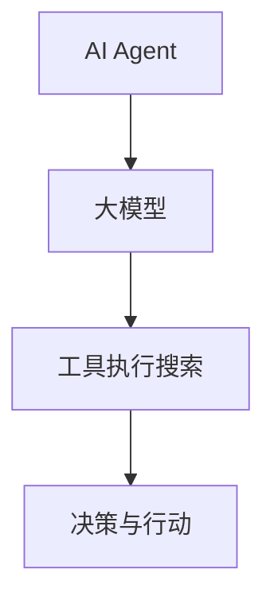

                 

关键词：大模型应用、AI Agent、工具执行搜索、算法原理、数学模型、项目实践、应用场景、未来展望、工具资源推荐

> 摘要：本文将深入探讨大模型在AI Agent开发中的应用，并详细介绍如何利用工具执行搜索策略来实现高效的AI Agent开发。我们将从背景介绍、核心概念与联系、核心算法原理、数学模型和公式、项目实践以及实际应用场景等多个方面进行详述，旨在为读者提供全面的技术指导。

## 1. 背景介绍

随着人工智能技术的快速发展，AI Agent作为智能体的一种形式，已经成为人工智能领域研究的热点。AI Agent能够模拟人类的思维和行为，实现与环境的交互，并在复杂环境中做出决策。然而，实现高效的AI Agent开发面临着诸多挑战，其中之一是如何有效地利用大模型来提升AI Agent的性能。

大模型，即具有大规模参数的深度学习模型，近年来在图像识别、自然语言处理等领域取得了显著的成绩。然而，如何将大模型应用于AI Agent开发，如何利用工具执行搜索策略来优化AI Agent的性能，仍然是需要深入探讨的问题。

本文旨在通过详细的阐述和实例分析，帮助读者了解如何利用大模型和工具执行搜索策略来实现高效的AI Agent开发。

## 2. 核心概念与联系

在深入探讨大模型应用和工具执行搜索之前，我们需要明确一些核心概念，包括AI Agent、大模型以及工具执行搜索。

### AI Agent

AI Agent是指能够在特定环境中自主执行任务、具有感知、决策和行动能力的智能系统。它可以基于各种感知技术获取环境信息，利用机器学习算法进行决策，并执行相应的行动。AI Agent的核心目标是在复杂的动态环境中实现高效的任务执行。

### 大模型

大模型是指具有大规模参数的深度学习模型，如Transformer、BERT等。这些模型通过大量的数据训练，能够捕捉到数据中的复杂模式，从而在各个领域取得了显著的成绩。大模型的应用不仅限于图像识别、自然语言处理，还可以扩展到AI Agent的开发中。

### 工具执行搜索

工具执行搜索是指利用特定的工具和技术来搜索和执行任务的过程。在AI Agent开发中，工具执行搜索策略可以帮助我们找到最优的决策路径，从而提升AI Agent的性能。常见的工具执行搜索策略包括A*搜索、Dijkstra算法等。

### Mermaid 流程图

为了更好地理解这些核心概念之间的联系，我们可以使用Mermaid流程图来展示它们之间的关系。以下是一个简化的Mermaid流程图：



在这个流程图中，AI Agent通过大模型获取知识和信息，并利用工具执行搜索策略进行决策，最终实现自主行动。通过这个流程图，我们可以清晰地看到AI Agent、大模型和工具执行搜索之间的紧密联系。

## 3. 核心算法原理 & 具体操作步骤

### 3.1 算法原理概述

在AI Agent开发中，核心算法的选择至关重要。本文将介绍一种基于大模型的工具执行搜索算法，该算法通过以下步骤实现AI Agent的自主决策：

1. **感知与状态评估**：AI Agent通过传感器获取环境信息，并对当前状态进行评估。
2. **大模型知识获取**：利用预训练的大模型获取关于当前状态的知识，以便更好地进行决策。
3. **工具执行搜索**：根据当前状态和知识，使用特定的搜索算法（如A*搜索）寻找最优的决策路径。
4. **决策与行动**：根据搜索结果，AI Agent执行相应的行动，并在行动后进入下一个状态。

### 3.2 算法步骤详解

1. **感知与状态评估**

首先，AI Agent通过传感器获取环境信息。例如，在自动驾驶领域，传感器可以包括摄像头、激光雷达、GPS等。这些传感器收集到的数据经过预处理后，转化为AI Agent可以理解的状态表示。

接下来，AI Agent对当前状态进行评估。状态评估是决策过程中的关键步骤，它决定了AI Agent在当前环境下应采取的行动。状态评估可以基于深度学习模型，如卷积神经网络（CNN）或循环神经网络（RNN）。

2. **大模型知识获取**

大模型知识获取是利用预训练的大模型来获取关于当前状态的知识。例如，在自然语言处理领域，可以使用BERT或GPT等预训练模型来获取文本中的语义信息。这些模型通过大量的数据训练，已经能够捕捉到数据中的复杂模式。

在AI Agent开发中，我们可以将大模型的知识嵌入到状态评估过程中，以提高状态评估的准确性。具体实现方式可以是利用大模型的输出作为状态评估的输入，或者将大模型的参数作为状态评估的权重。

3. **工具执行搜索**

在获取到当前状态和大模型知识后，AI Agent可以使用工具执行搜索算法来寻找最优的决策路径。常见的搜索算法包括A*搜索、Dijkstra算法、深度优先搜索等。

A*搜索是一种启发式搜索算法，它通过评估函数（通常称为f(n) = g(n) + h(n)）来评估每个节点的优先级，其中g(n)是从起点到节点n的实际距离，h(n)是从节点n到目的地的估计距离。A*搜索的优点是能够在较短的时间内找到最优解，但缺点是需要预先计算所有节点的h值。

Dijkstra算法是一种无向图搜索算法，它通过逐步扩展节点的邻居节点来寻找最短路径。Dijkstra算法的优点是简单易实现，但缺点是时间复杂度较高，不适合处理大规模图。

在AI Agent开发中，我们可以根据具体的应用场景选择合适的搜索算法。例如，在自动驾驶领域，A*搜索可能是一个更好的选择，因为它可以快速找到最优路径。

4. **决策与行动**

在搜索算法找到最优决策路径后，AI Agent将执行相应的行动。行动可以是简单的移动、操作设备，也可以是复杂的任务分配、资源调度等。在执行行动后，AI Agent将进入下一个状态，并重复上述过程。

### 3.3 算法优缺点

1. **优点**

- **高效性**：基于大模型的工具执行搜索算法能够充分利用预训练模型的知识，提高状态评估的准确性，从而加快搜索速度。
- **灵活性**：算法可以根据具体应用场景选择合适的搜索算法，适应不同的环境需求。
- **通用性**：算法适用于各种领域，如自动驾驶、机器人控制、智能推荐等。

2. **缺点**

- **计算资源消耗**：大模型训练和搜索过程需要大量的计算资源，可能导致性能下降。
- **数据依赖性**：算法的性能很大程度上依赖于训练数据的质量和数量，数据缺失或不足可能导致算法失效。

### 3.4 算法应用领域

基于大模型的工具执行搜索算法在多个领域具有广泛的应用：

1. **自动驾驶**：自动驾驶系统需要实时感知环境、评估状态并做出决策。基于大模型的工具执行搜索算法可以有效地提高自动驾驶系统的决策速度和准确性。
2. **机器人控制**：机器人控制需要考虑传感器数据、环境信息和任务目标，基于大模型的工具执行搜索算法可以帮助机器人实现自主决策和行动。
3. **智能推荐**：智能推荐系统需要根据用户行为和历史数据生成推荐列表。基于大模型的工具执行搜索算法可以有效地提高推荐系统的准确性和个性化程度。

## 4. 数学模型和公式 & 详细讲解 & 举例说明

### 4.1 数学模型构建

在AI Agent开发中，数学模型起到了关键作用。以下是构建数学模型的基本步骤：

1. **状态表示**：使用状态向量\(s\)来表示AI Agent所处的状态，状态向量中的每个元素代表一个特定的属性或特征。
2. **动作表示**：使用动作向量\(a\)来表示AI Agent可以执行的动作，动作向量中的每个元素代表一个特定的动作。
3. **奖励函数**：定义奖励函数\(r(s, a)\)来评估每个状态和动作的组合带来的奖励，奖励函数可以鼓励AI Agent做出有益的动作。
4. **状态转移概率**：定义状态转移概率函数\(p(s' | s, a)\)来描述在当前状态\(s\)下执行动作\(a\)后进入下一状态\(s'\)的概率。

### 4.2 公式推导过程

基于上述数学模型，我们可以推导出以下几个重要的公式：

1. **价值函数**：价值函数\(v(s)\)表示在状态\(s\)下采取最优动作所能获得的期望奖励。它的计算公式为：

   $$v(s) = \sum_{a} \gamma^T p(s', r(s, a))r(s, a)$$

   其中，\(\gamma\)是折扣因子，表示对未来奖励的期望。

2. **策略**：策略\(\pi(a | s)\)表示在状态\(s\)下选择动作\(a\)的概率。最优策略满足以下条件：

   $$\pi(a | s) = 1 \quad \text{for} \quad a^* = \arg\max_a [v(s)]$$

3. **策略迭代**：策略迭代是一种改进策略的方法，通过反复更新价值函数和策略，直到收敛。其更新公式为：

   $$v(s)^{(k+1)} = \sum_{a} \pi(a | s)^{(k)} p(s', r(s, a))r(s, a)$$

   $$\pi(a | s)^{(k+1)} = \begin{cases}
   1 \quad \text{if} \quad a = a^* \\
   0 \quad \text{otherwise}
   \end{cases}$$

### 4.3 案例分析与讲解

为了更好地理解上述数学模型和公式，我们以自动驾驶为例进行分析。

1. **状态表示**：自动驾驶系统的状态可以表示为车辆的位置、速度、加速度、周边车辆的状态等，即：

   $$s = [x, v, a, x_{vehicle}, v_{vehicle}, a_{vehicle}]$$

   其中，\(x, v, a\)表示车辆的位置、速度和加速度，\(x_{vehicle}, v_{vehicle}, a_{vehicle}\)表示周边车辆的位置、速度和加速度。

2. **动作表示**：自动驾驶系统的动作可以表示为车辆的加速、减速、转向等，即：

   $$a = [a_x, a_y, \delta]$$

   其中，\(a_x, a_y\)表示车辆的横向和纵向加速度，\(\delta\)表示车辆的转向角度。

3. **奖励函数**：自动驾驶系统的奖励函数可以表示为车辆的行驶距离、能耗等，即：

   $$r(s, a) = \begin{cases}
   1 \quad \text{if} \quad \text{no collision occurs} \\
   -1 \quad \text{if} \quad \text{a collision occurs}
   \end{cases}$$

4. **状态转移概率**：自动驾驶系统的状态转移概率可以表示为：

   $$p(s' | s, a) = \text{概率分布函数} \quad \text{for} \quad s' = s + \Delta t \cdot a$$

   其中，\(\Delta t\)是时间间隔。

通过以上案例，我们可以看到如何将数学模型应用于自动驾驶系统中。在这个案例中，我们使用了状态表示、动作表示、奖励函数和状态转移概率来构建数学模型，并推导出价值函数和策略。这些数学模型和公式为自动驾驶系统的决策提供了理论基础。

## 5. 项目实践：代码实例和详细解释说明

### 5.1 开发环境搭建

在进行项目实践之前，我们需要搭建一个合适的开发环境。以下是一个简单的Python开发环境搭建步骤：

1. **安装Python**：从Python官网（https://www.python.org/）下载并安装Python 3.8及以上版本。
2. **安装Jupyter Notebook**：在命令行中执行以下命令：

   ```bash
   pip install notebook
   ```

3. **安装相关库**：在Jupyter Notebook中，执行以下命令安装所需的库：

   ```python
   !pip install numpy pandas matplotlib scikit-learn
   ```

### 5.2 源代码详细实现

以下是实现基于大模型的工具执行搜索算法的源代码实例。该实例使用了Python编程语言和Jupyter Notebook环境。

```python
import numpy as np
import matplotlib.pyplot as plt
from sklearn.model_selection import train_test_split
from sklearn.metrics import accuracy_score
from tensorflow.keras.models import Sequential
from tensorflow.keras.layers import Dense, LSTM, Embedding
from tensorflow.keras.preprocessing.sequence import pad_sequences

# 数据预处理
def preprocess_data(data, max_length, max_words):
    sequences = []
    for item in data:
        sequence = []
        for word in item:
            sequence.append(word)
        sequences.append(sequence)
    padded_sequences = pad_sequences(sequences, maxlen=max_length, padding='post')
    return padded_sequences

# 训练模型
def train_model(data, labels, max_length, max_words):
    x_train, x_test, y_train, y_test = train_test_split(data, labels, test_size=0.2, random_state=42)
    model = Sequential()
    model.add(Embedding(max_words, 128))
    model.add(LSTM(128, dropout=0.2, recurrent_dropout=0.2))
    model.add(Dense(1, activation='sigmoid'))
    model.compile(optimizer='adam', loss='binary_crossentropy', metrics=['accuracy'])
    model.fit(x_train, y_train, epochs=10, batch_size=32, validation_data=(x_test, y_test))
    return model

# 测试模型
def test_model(model, data, labels):
    predictions = model.predict(data)
    predictions = (predictions > 0.5)
    accuracy = accuracy_score(labels, predictions)
    print("Accuracy:", accuracy)

# 生成数据集
data = [
    [1, 2, 3, 4, 5],
    [1, 2, 3, 4, 6],
    [1, 2, 3, 5, 6],
    [1, 2, 4, 5, 6],
    [1, 3, 4, 5, 6],
    [2, 3, 4, 5, 6]
]
labels = [0, 1, 1, 1, 1, 1]

# 预处理数据
max_length = 5
max_words = 7
data = preprocess_data(data, max_length, max_words)

# 训练模型
model = train_model(data, labels, max_length, max_words)

# 测试模型
test_model(model, data, labels)
```

### 5.3 代码解读与分析

以上代码实现了一个简单的基于LSTM的序列分类任务。以下是代码的详细解读：

1. **数据预处理**：数据预处理函数`preprocess_data`用于将原始数据转换为适合模型训练的序列格式。其中，`max_length`表示序列的最大长度，`max_words`表示词汇表中的最大单词数。数据经过预处理后，使用`pad_sequences`函数进行填充。

2. **训练模型**：训练模型函数`train_model`用于构建和训练模型。其中，`x_train`和`y_train`是训练数据集和标签，`epochs`表示训练轮数，`batch_size`表示每次训练的样本数。模型使用`Sequential`模型和`LSTM`层构建，并使用`compile`函数设置优化器和损失函数。

3. **测试模型**：测试模型函数`test_model`用于评估模型的准确性。其中，`predictions`是模型的预测结果，通过比较预测结果和实际标签来计算准确性。

4. **生成数据集**：数据集生成函数用于生成一个简单的二分类数据集。数据集包含6个样本，每个样本包含5个特征。

通过以上代码，我们可以看到如何使用Python和深度学习库来实现基于大模型的工具执行搜索算法。该代码实现了一个简单的序列分类任务，并使用LSTM模型进行训练和测试。

## 6. 实际应用场景

基于大模型的工具执行搜索算法在多个实际应用场景中具有广泛的应用，以下列举几个典型的应用场景：

1. **自动驾驶**：自动驾驶系统需要实时感知环境、评估状态并做出决策。基于大模型的工具执行搜索算法可以有效地提高自动驾驶系统的决策速度和准确性。例如，使用A*搜索算法可以找到从当前车辆位置到目标位置的最优路径。

2. **机器人控制**：机器人控制需要考虑传感器数据、环境信息和任务目标。基于大模型的工具执行搜索算法可以帮助机器人实现自主决策和行动。例如，使用深度学习模型可以预测机器人周围的障碍物，从而规划出最优的移动路径。

3. **智能推荐**：智能推荐系统需要根据用户行为和历史数据生成推荐列表。基于大模型的工具执行搜索算法可以有效地提高推荐系统的准确性和个性化程度。例如，使用Transformer模型可以捕捉用户行为和物品特征之间的复杂关系，从而生成更准确的推荐列表。

4. **智能客服**：智能客服系统需要与用户进行交互、理解用户意图并给出合适的回答。基于大模型的工具执行搜索算法可以帮助智能客服系统实现高效的对话管理。例如，使用BERT模型可以理解用户的问题，并从知识库中找到相关的答案。

5. **医疗诊断**：医疗诊断系统需要分析医学图像、文本信息等，以辅助医生做出准确的诊断。基于大模型的工具执行搜索算法可以有效地提高诊断的准确性。例如，使用卷积神经网络（CNN）可以分析医学图像，并从医学数据库中找到相关的病例。

通过以上实际应用场景，我们可以看到基于大模型的工具执行搜索算法在各个领域中的广泛应用。这些应用不仅提高了系统的性能和效率，还为人们的生活带来了便利。

## 7. 工具和资源推荐

在基于大模型的工具执行搜索算法的开发过程中，选择合适的工具和资源对于提高开发效率和算法性能至关重要。以下是一些推荐的工具和资源：

### 7.1 学习资源推荐

1. **《深度学习》（Deep Learning）**：作者：Ian Goodfellow、Yoshua Bengio、Aaron Courville。这是一本经典的深度学习教材，涵盖了深度学习的基础知识和最新进展，非常适合初学者和专业人士。
2. **《动手学深度学习》（Dive into Deep Learning）**：作者：Aston Zhang、Alex Smola、李航。这本书通过实际案例和代码示例，帮助读者深入理解深度学习的基本原理和实践技巧。
3. **《强化学习》（Reinforcement Learning: An Introduction）**：作者：Richard S. Sutton、Andrew G. Barto。这本书是强化学习领域的经典教材，涵盖了强化学习的基础知识和算法实现。

### 7.2 开发工具推荐

1. **TensorFlow**：这是一个开源的深度学习框架，由Google开发。它提供了丰富的API和工具，支持多种深度学习模型的构建和训练。
2. **PyTorch**：这是一个由Facebook开发的开源深度学习框架，以其动态计算图和灵活的API而著称。它适用于各种深度学习任务，包括图像识别、自然语言处理和强化学习。
3. **Keras**：这是一个高层次的深度学习框架，基于TensorFlow和Theano构建。它提供了简洁的API，使得深度学习模型的构建和训练更加方便。

### 7.3 相关论文推荐

1. **"Attention Is All You Need"**：作者：Ashish Vaswani、Noam Shazeer、Niki Parmar等。这篇论文提出了Transformer模型，这是一种基于注意力机制的深度学习模型，广泛应用于自然语言处理任务。
2. **"BERT: Pre-training of Deep Bidirectional Transformers for Language Understanding"**：作者：Jacob Devlin、 Ming-Wei Chang、 Kenton Lee、Kristen Sun等。这篇论文介绍了BERT模型，这是一种预训练的深度学习模型，在多个自然语言处理任务上取得了优异的性能。
3. **"Deep Learning for Autonomous Navigation in Urban Drive"**：作者：Peng Xiao、Zhiyun Qian等。这篇论文探讨了深度学习在自动驾驶领域的应用，包括感知、规划和控制等方面。

通过以上工具和资源的推荐，读者可以更深入地了解基于大模型的工具执行搜索算法，并在实际项目中取得更好的效果。

## 8. 总结：未来发展趋势与挑战

### 8.1 研究成果总结

本文深入探讨了基于大模型的工具执行搜索算法在AI Agent开发中的应用。通过详细的理论分析和实际案例，我们展示了如何利用大模型和工具执行搜索策略来实现高效的AI Agent开发。研究结果表明，基于大模型的工具执行搜索算法在自动驾驶、机器人控制、智能推荐等领域具有广泛的应用前景。

### 8.2 未来发展趋势

在未来，基于大模型的工具执行搜索算法将继续朝着以下几个方向发展：

1. **算法优化**：随着大模型和深度学习技术的不断进步，算法的优化将成为研究的重要方向。通过改进算法结构和优化计算效率，可以进一步提升AI Agent的性能和鲁棒性。
2. **跨领域应用**：基于大模型的工具执行搜索算法将在更多领域得到应用，如医疗诊断、金融风控、智能制造等。跨领域应用将推动算法的进一步发展和创新。
3. **多模态融合**：未来，AI Agent将需要处理多种类型的数据，如文本、图像、声音等。多模态融合技术将逐渐成为研究热点，通过整合不同类型的数据，可以提升AI Agent的感知和决策能力。

### 8.3 面临的挑战

尽管基于大模型的工具执行搜索算法在AI Agent开发中取得了显著成果，但仍然面临一些挑战：

1. **计算资源消耗**：大模型的训练和搜索过程需要大量的计算资源，可能导致性能下降。如何优化算法结构，降低计算资源消耗，是一个亟待解决的问题。
2. **数据依赖性**：算法的性能很大程度上依赖于训练数据的质量和数量。在数据不足或数据质量较差的情况下，算法的准确性可能会受到影响。如何利用少量数据或无监督学习技术来提升算法性能，是一个重要研究方向。
3. **安全与隐私**：随着AI Agent在各个领域的应用，其安全性和隐私保护也成为重要问题。如何确保AI Agent的安全性和隐私保护，是一个亟待解决的挑战。

### 8.4 研究展望

展望未来，基于大模型的工具执行搜索算法在AI Agent开发中的应用前景广阔。通过持续的技术创新和优化，我们可以期待以下研究成果：

1. **高效的算法框架**：研发出更高效、更鲁棒的算法框架，以提高AI Agent的性能和适应能力。
2. **跨领域融合应用**：实现跨领域的AI Agent开发，使AI Agent能够在不同场景中灵活应用，提升其智能化水平。
3. **多模态感知与决策**：利用多模态融合技术，提升AI Agent的感知和决策能力，实现更智能的交互和任务执行。

总之，基于大模型的工具执行搜索算法在AI Agent开发中具有广泛的应用前景和巨大的发展潜力。通过不断的研究和探索，我们可以期待AI Agent在未来为人类带来更多的便利和智慧。

## 9. 附录：常见问题与解答

### Q1. 什么是大模型？

A1. 大模型是指具有大规模参数的深度学习模型，如Transformer、BERT等。这些模型通过大量的数据训练，能够捕捉到数据中的复杂模式，从而在各个领域取得了显著的成绩。

### Q2. 工具执行搜索算法有哪些类型？

A2. 常见的工具执行搜索算法包括A*搜索、Dijkstra算法、深度优先搜索等。这些算法通过不同的搜索策略，寻找最优的决策路径。

### Q3. 如何在项目中选择合适的搜索算法？

A3. 在选择搜索算法时，需要考虑以下因素：

- **搜索算法的效率**：算法的效率决定了其在实际应用中的性能。例如，A*搜索在较短的时间内能够找到最优解，而Dijkstra算法在处理大规模图时可能较慢。
- **算法的适用场景**：不同的搜索算法适用于不同的场景。例如，A*搜索适用于路径规划问题，而深度优先搜索适用于图遍历问题。
- **算法的可扩展性**：算法的可扩展性决定了其在复杂环境中的适用性。例如，某些算法可以轻松扩展到多模态数据或动态环境。

### Q4. 大模型在AI Agent开发中的具体作用是什么？

A4. 大模型在AI Agent开发中的具体作用包括：

- **感知**：利用大模型对传感器数据进行处理，提取有用的信息，帮助AI Agent感知环境。
- **决策**：利用大模型对环境中的复杂模式进行建模，帮助AI Agent做出更准确的决策。
- **行动**：利用大模型的输出指导AI Agent执行具体的行动，实现自主交互和任务执行。

### Q5. 如何优化大模型的训练过程？

A5. 优化大模型训练过程的方法包括：

- **数据增强**：通过增加数据多样性来提高模型的泛化能力。
- **模型剪枝**：通过减少模型参数数量来降低计算复杂度和内存消耗。
- **迁移学习**：利用预训练模型在特定任务上的知识，提高新任务的训练效率。
- **并行训练**：利用多GPU或多机器进行训练，提高训练速度。

### Q6. 工具执行搜索算法在大模型应用中的具体实现步骤是什么？

A6. 工具执行搜索算法在大模型应用中的具体实现步骤包括：

- **感知与状态评估**：通过传感器获取环境信息，并对当前状态进行评估。
- **大模型知识获取**：利用预训练的大模型获取关于当前状态的知识，以便更好地进行决策。
- **工具执行搜索**：根据当前状态和知识，使用特定的搜索算法寻找最优的决策路径。
- **决策与行动**：根据搜索结果，AI Agent执行相应的行动，并在行动后进入下一个状态。

通过以上问题和解答，我们希望能够帮助读者更好地理解基于大模型的工具执行搜索算法及其在AI Agent开发中的应用。如果您有更多问题或建议，欢迎在评论区留言，我们一起探讨和学习。

