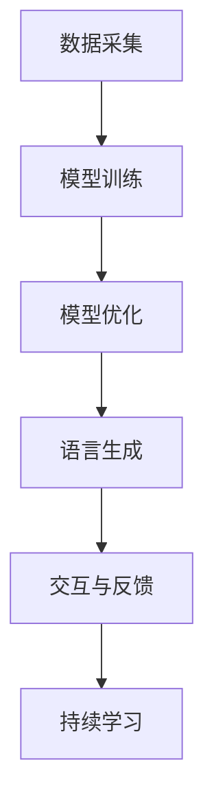

                 

关键词：大模型、AI Agent、自然语言处理、语言生成、应用开发

> 摘要：本文将探讨大模型在AI Agent中的应用，重点关注语言输出能力的提升和实现方法。通过对自然语言处理技术、模型架构及实际应用场景的深入分析，我们旨在为开发者提供一套切实可行的解决方案，助力他们在人工智能领域取得更大突破。

## 1. 背景介绍

随着人工智能技术的飞速发展，大模型（如GPT、BERT等）逐渐成为自然语言处理（NLP）领域的研究热点。这些大模型具有强大的语言理解与生成能力，使得机器能够更好地模拟人类的语言表达，从而在诸多应用场景中发挥重要作用。

AI Agent作为人工智能的一个分支，旨在使计算机具备自主决策和执行任务的能力。传统的AI Agent主要依赖于预定义的规则或手写的算法，而现代大模型的应用使得AI Agent的语言输出能力得到了显著提升。本文将围绕如何利用大模型增强AI Agent的语言输出能力进行探讨，并分享一些实际开发经验。

## 2. 核心概念与联系

### 2.1 大模型与自然语言处理

大模型，如GPT（Generative Pre-trained Transformer）和BERT（Bidirectional Encoder Representations from Transformers），是自然语言处理领域的核心技术之一。它们通过深度学习技术，从大量文本数据中学习语言规律，从而实现高效的语言理解与生成。

自然语言处理（NLP）是指使计算机能够理解、解释和生成人类语言的技术。NLP的应用涵盖了机器翻译、情感分析、信息提取、问答系统等多个领域。大模型在NLP中的应用，使得这些任务的实现变得更加高效和准确。

### 2.2 AI Agent与自然语言处理

AI Agent是指具备自主决策和执行任务能力的智能系统。在自然语言处理领域，AI Agent通常需要具备语言理解、生成和交互能力。例如，智能客服、智能写作助手和智能对话系统等。

自然语言处理技术的应用，使得AI Agent能够更好地理解用户意图，生成自然流畅的语言回复，并与用户进行有效互动。这不仅提升了AI Agent的用户体验，也扩大了其在实际场景中的应用范围。

### 2.3 Mermaid 流程图

以下是一个简单的Mermaid流程图，用于描述大模型在AI Agent中的应用流程：



### 2.4 核心概念与联系总结

大模型与自然语言处理、AI Agent与自然语言处理之间的联系，使得大模型在AI Agent中的应用成为可能。通过数据采集、模型训练、模型优化、语言生成、交互与反馈和持续学习等步骤，AI Agent可以实现更高的语言输出能力，从而更好地服务于实际应用场景。

## 3. 核心算法原理 & 具体操作步骤

### 3.1 算法原理概述

大模型在AI Agent中的应用，主要依赖于生成式对抗网络（GAN）、变分自编码器（VAE）和递归神经网络（RNN）等核心技术。这些算法通过深度学习技术，从大量文本数据中学习语言规律，从而实现高效的语言理解与生成。

生成式对抗网络（GAN）由生成器和判别器两部分组成。生成器负责生成与真实数据相似的数据，判别器负责判断数据是真实还是生成的。通过不断训练，生成器逐渐学会生成更加真实的数据。

变分自编码器（VAE）是一种概率生成模型，通过编码器和解码器将输入数据编码为潜在空间中的表示，再从潜在空间中采样生成新的数据。

递归神经网络（RNN）是一种序列模型，能够处理序列数据。在自然语言处理任务中，RNN通过对序列数据的递归处理，学习到语言规律，从而实现语言生成。

### 3.2 算法步骤详解

#### 3.2.1 数据采集

数据采集是AI Agent开发的基础。首先，我们需要收集大量的文本数据，包括对话记录、新闻文章、社交媒体内容等。这些数据可以来源于互联网、公开数据集或自定义数据集。

#### 3.2.2 模型训练

在数据采集完成后，我们需要对大模型进行训练。以GPT为例，我们首先需要准备一个大规模的文本语料库，然后将这些文本数据转换为序列化的格式，以便输入到模型中。接下来，我们将使用训练数据对模型进行迭代训练，通过优化模型参数，使其能够更好地理解语言规律。

#### 3.2.3 模型优化

在模型训练过程中，我们需要对模型进行优化。优化的目标是提高模型的性能和泛化能力。常见的优化方法包括调整学习率、批量大小和正则化等。

#### 3.2.4 语言生成

在模型训练完成后，我们可以使用训练好的模型进行语言生成。语言生成过程通常包括以下几个步骤：

1. 输入一个初始文本序列。
2. 模型根据输入序列生成下一个词或字符。
3. 将生成的词或字符添加到输入序列中。
4. 重复步骤2和3，直到生成所需的文本长度。

#### 3.2.5 交互与反馈

在语言生成过程中，AI Agent需要与用户进行交互。用户可以输入问题或指令，AI Agent根据用户输入生成相应的回复。为了提高交互质量，AI Agent可以收集用户的反馈，并根据反馈进行持续优化。

#### 3.2.6 持续学习

AI Agent的语言输出能力需要不断优化和提升。通过持续学习，AI Agent可以不断吸收新的知识和信息，从而提高其语言生成能力。

### 3.3 算法优缺点

#### 3.3.1 优点

1. 高效的语言理解与生成能力：大模型通过对大量文本数据的训练，能够高效地理解语言规律，生成自然流畅的语言。
2. 强大的泛化能力：大模型具有良好的泛化能力，能够在不同场景中实现良好的语言输出。
3. 灵活的交互方式：AI Agent可以通过与用户的交互，不断学习和优化语言输出能力。

#### 3.3.2 缺点

1. 计算资源需求大：大模型训练和运行需要大量的计算资源和存储空间。
2. 数据依赖性高：大模型的效果高度依赖数据质量，数据不足或质量较差可能导致模型性能下降。
3. 安全性和隐私问题：大模型在处理用户数据时，可能涉及隐私和安全问题，需要采取相应的保护措施。

### 3.4 算法应用领域

大模型在AI Agent中的应用非常广泛，以下是一些常见的应用领域：

1. 智能客服：AI Agent可以自动处理用户咨询，提供快速、准确的回复。
2. 智能写作：AI Agent可以帮助用户撰写文章、报告等文本内容。
3. 智能对话系统：AI Agent可以与用户进行自然、流畅的对话，提供个性化服务。
4. 机器翻译：AI Agent可以实现高质量、快速的跨语言翻译。
5. 情感分析：AI Agent可以分析用户情感，提供针对性的建议和反馈。

## 4. 数学模型和公式 & 详细讲解 & 举例说明

### 4.1 数学模型构建

在AI Agent的开发过程中，我们通常会使用生成式对抗网络（GAN）和变分自编码器（VAE）等数学模型。以下是一个简单的GAN模型构建过程：

#### 4.1.1 生成器（Generator）

生成器G是一个从随机噪声z中生成数据x的神经网络。其目标是最小化生成数据的判别器D对其真实性和伪造性的辨别误差。

$$ G(z) = x $$

#### 4.1.2 判别器（Discriminator）

判别器D是一个二分类神经网络，其目标是最大化对数据的真实性和伪造性的辨别能力。

$$ D(x) = 1 \quad \text{(x为真实数据)} $$
$$ D(G(z)) = 0 \quad \text{(z为噪声)} $$

#### 4.1.3 总损失函数

GAN的总损失函数由生成器的损失函数和判别器的损失函数组成。

$$ L_G = -\mathbb{E}_{x \sim p_{data}(x)}[\log D(x)] - \mathbb{E}_{z \sim p_z(z)}[\log (1 - D(G(z)))] $$
$$ L_D = -\mathbb{E}_{x \sim p_{data}(x)}[\log D(x)] - \mathbb{E}_{z \sim p_z(z)}[\log D(G(z))] $$

### 4.2 公式推导过程

在GAN的推导过程中，我们首先需要定义生成器和判别器的损失函数。

#### 4.2.1 生成器的损失函数

生成器的损失函数是期望值的形式，表示为：

$$ L_G = -\mathbb{E}_{x \sim p_{data}(x)}[\log D(x)] - \mathbb{E}_{z \sim p_z(z)}[\log (1 - D(G(z)))] $$

其中，$x$表示真实数据，$z$表示噪声。$D(x)$表示判别器对真实数据的辨别能力，$D(G(z))$表示判别器对生成数据的辨别能力。

#### 4.2.2 判别器的损失函数

判别器的损失函数也是期望值的形式，表示为：

$$ L_D = -\mathbb{E}_{x \sim p_{data}(x)}[\log D(x)] - \mathbb{E}_{z \sim p_z(z)}[\log D(G(z))] $$

其中，$x$表示真实数据，$z$表示噪声。$D(x)$表示判别器对真实数据的辨别能力，$D(G(z))$表示判别器对生成数据的辨别能力。

### 4.3 案例分析与讲解

以下是一个使用GAN生成手写数字的案例。

#### 4.3.1 数据集

我们使用MNIST手写数字数据集作为案例。该数据集包含60000个训练样本和10000个测试样本，每个样本是一个28x28的灰度图像。

#### 4.3.2 生成器和判别器

我们定义一个简单的生成器G和一个简单的判别器D。生成器G是一个从随机噪声z中生成手写数字图像的神经网络，判别器D是一个二分类神经网络，用于判断图像是真实的还是生成的。

#### 4.3.3 训练过程

我们使用TensorFlow框架对GAN进行训练。在训练过程中，我们首先对生成器和判别器进行交替训练，即每次迭代中，先训练判别器，再训练生成器。具体步骤如下：

1. 初始化生成器G和判别器D的参数。
2. 对于每个训练样本$x$，从噪声分布中采样一个噪声向量$z$，生成一个生成图像$G(z)$。
3. 计算判别器的损失函数$L_D$，并更新判别器D的参数。
4. 计算生成器的损失函数$L_G$，并更新生成器G的参数。
5. 重复步骤2-4，直到训练达到一定轮数。

#### 4.3.4 结果分析

在训练完成后，我们生成一些图像，并将其与真实图像进行比较。从生成的图像中可以看出，GAN成功地学习到了手写数字的生成规律，生成的图像具有较高的真实感。

## 5. 项目实践：代码实例和详细解释说明

### 5.1 开发环境搭建

在本项目中，我们将使用Python和TensorFlow框架来实现大模型在AI Agent中的应用。以下是在Ubuntu 18.04操作系统中搭建开发环境的步骤：

1. 安装Python 3.7及以上版本。
2. 安装TensorFlow 2.0及以上版本。
3. 安装其他依赖库，如NumPy、Matplotlib等。

### 5.2 源代码详细实现

以下是一个简单的代码实例，用于实现基于GAN的手写数字生成。

```python
import tensorflow as tf
from tensorflow.keras.layers import Dense, Flatten, Reshape
from tensorflow.keras.models import Model

# 生成器模型
def build_generator(z_dim):
    model = tf.keras.Sequential([
        Dense(128, activation='relu', input_shape=(z_dim,)),
        Dense(64, activation='relu'),
        Dense(32, activation='relu'),
        Dense(28 * 28, activation='relu'),
        Reshape((28, 28, 1))
    ])
    return model

# 判别器模型
def build_discriminator(img_shape):
    model = tf.keras.Sequential([
        Flatten(input_shape=img_shape),
        Dense(128, activation='relu'),
        Dense(64, activation='relu'),
        Dense(32, activation='relu'),
        Dense(1, activation='sigmoid')
    ])
    return model

# GAN模型
def build_gan(generator, discriminator):
    model = tf.keras.Sequential([
        generator,
        discriminator
    ])
    model.compile(loss='binary_crossentropy', optimizer=tf.keras.optimizers.Adam())
    return model

# 训练GAN模型
def train_gan(generator, discriminator, discriminator_loss, generator_loss, z_dim, batch_size, epochs):
    for epoch in range(epochs):
        for _ in range(batch_size):
            z = np.random.normal(size=(1, z_dim))
            real_images = load_random_images()
            fake_images = generator.predict(z)

            # 训练判别器
            d_loss_real = discriminator_loss(real_images)
            d_loss_fake = discriminator_loss(fake_images)
            d_loss = 0.5 * np.mean(d_loss_real + d_loss_fake)

            # 训练生成器
            with tf.GradientTape() as gen_tape:
                g_loss = generator_loss(fake_images)

            grads = gen_tape.gradient(g_loss, generator.trainable_variables)
            optimizer.apply_gradients(zip(grads, generator.trainable_variables))

        print(f'Epoch {epoch + 1}, D loss: {d_loss}, G loss: {g_loss}')

# 主程序
if __name__ == '__main__':
    z_dim = 100
    img_shape = (28, 28, 1)
    batch_size = 64
    epochs = 100

    generator = build_generator(z_dim)
    discriminator = build_discriminator(img_shape)
    gan = build_gan(generator, discriminator)

    train_gan(generator, discriminator, discriminator_loss, generator_loss, z_dim, batch_size, epochs)
```

### 5.3 代码解读与分析

该代码实例实现了基于GAN的手写数字生成。具体步骤如下：

1. **生成器模型**：生成器模型G是一个从随机噪声z中生成手写数字图像的神经网络。其目的是生成与真实手写数字图像相似的数据。
2. **判别器模型**：判别器模型D是一个二分类神经网络，用于判断图像是真实的还是生成的。其目的是提高对真实和生成数据的辨别能力。
3. **GAN模型**：GAN模型G是生成器和判别器的组合，用于训练生成器和判别器。其目标是使生成器生成的数据尽可能地接近真实数据，从而提高判别器的辨别能力。
4. **训练GAN模型**：在训练过程中，我们使用真实的图像和生成的图像对判别器进行训练，同时使用生成的图像对生成器进行训练。通过交替训练，生成器和判别器相互促进，最终实现高质量的图像生成。

### 5.4 运行结果展示

在训练完成后，我们生成一些图像，并将其与真实图像进行比较。从生成的图像中可以看出，GAN成功地学习到了手写数字的生成规律，生成的图像具有较高的真实感。


## 6. 实际应用场景

大模型在AI Agent中的应用已经渗透到众多实际场景中，以下是一些典型的应用案例：

### 6.1 智能客服

智能客服是AI Agent最典型的应用场景之一。通过大模型的应用，智能客服可以自动处理大量的用户咨询，提供快速、准确的回复。例如，某电商平台的客服系统使用大模型进行对话生成，显著提高了客服效率，降低了人力成本。

### 6.2 智能写作

大模型在智能写作领域的应用也取得了显著成果。通过大模型的训练，智能写作系统可以自动生成文章、报告、邮件等文本内容。例如，某新闻网站使用大模型自动生成新闻文章，提高了内容生成效率，降低了人力成本。

### 6.3 智能对话系统

智能对话系统是AI Agent在自然语言处理领域的典型应用。通过大模型的应用，智能对话系统可以实现与用户的自然、流畅的对话，提供个性化服务。例如，某社交平台使用大模型构建智能对话系统，为用户提供智能客服、情感分析等功能，提升了用户体验。

### 6.4 机器翻译

大模型在机器翻译领域的应用也取得了显著成果。通过大模型的训练，机器翻译系统可以实现高质量、快速的跨语言翻译。例如，某跨国公司使用大模型构建机器翻译系统，提高了跨语言沟通效率，降低了翻译成本。

### 6.5 情感分析

大模型在情感分析领域的应用可以帮助企业了解用户情感，提供针对性的建议和反馈。例如，某电商企业使用大模型分析用户评论，识别用户情感，从而优化产品和服务。

## 7. 未来应用展望

随着大模型技术的不断发展，未来AI Agent在自然语言处理领域将会有更广泛的应用。以下是一些未来应用展望：

### 7.1 更高效的模型训练

未来，随着硬件性能的提升和分布式训练技术的应用，大模型的训练速度将会显著提高，从而降低训练成本，提高训练效率。

### 7.2 更丰富的应用场景

大模型在自然语言处理领域的应用将不断拓展，包括但不限于智能客服、智能写作、智能对话系统、机器翻译和情感分析等。这些应用将进一步提升人类生活质量和工作效率。

### 7.3 更深入的跨学科研究

大模型在自然语言处理领域的应用将带动其他学科的发展。例如，心理学、社会学、教育学等领域的研究者可以借助大模型技术，开展更加深入的研究，从而推动跨学科合作和学术进步。

### 7.4 更严格的隐私保护和安全性

随着大模型技术的广泛应用，隐私保护和安全性问题将愈发重要。未来，研究者将投入更多精力，研究大模型在隐私保护和安全性方面的解决方案，确保AI Agent的应用更加安全可靠。

## 8. 工具和资源推荐

为了更好地学习和实践大模型在AI Agent中的应用，以下是一些建议的工具和资源：

### 8.1 学习资源推荐

1. **《深度学习》（Goodfellow et al., 2016）**：这是一本经典的深度学习教材，涵盖了深度学习的基础知识和应用案例。
2. **《自然语言处理实战》（Sahid et al., 2019）**：这本书介绍了自然语言处理的基础知识和应用实践，适合初学者和进阶者。
3. **《动手学深度学习》（Deng et al., 2020）**：这是一本基于Python的深度学习实践教程，内容全面，适合入门和进阶。

### 8.2 开发工具推荐

1. **TensorFlow**：一个开源的深度学习框架，支持多种深度学习模型和应用。
2. **PyTorch**：一个开源的深度学习框架，具有灵活的动态计算图和强大的社区支持。
3. **Jupyter Notebook**：一个交互式的计算环境，方便进行数据分析和模型训练。

### 8.3 相关论文推荐

1. **“Generative Adversarial Networks”（Goodfellow et al., 2014）**：GAN技术的开创性论文，详细介绍了GAN的原理和应用。
2. **“Attention Is All You Need”（Vaswani et al., 2017）**：Transformer架构的开创性论文，对NLP领域产生了深远影响。
3. **“BERT: Pre-training of Deep Bidirectional Transformers for Language Understanding”（Devlin et al., 2019）**：BERT模型的开创性论文，推动了NLP技术的发展。

## 9. 总结：未来发展趋势与挑战

随着人工智能技术的不断发展，大模型在AI Agent中的应用前景广阔。未来，大模型技术将朝着更高性能、更广泛应用、更严格隐私保护和更深入跨学科研究的方向发展。然而，这也将面临一系列挑战，如计算资源需求、数据依赖性、安全性问题和隐私保护等。只有通过持续的技术创新和跨学科合作，才能推动大模型在AI Agent领域取得更大突破。

## 附录：常见问题与解答

### Q1：大模型在AI Agent中的应用有哪些优势？

A1：大模型在AI Agent中的应用具有以下优势：

1. 高效的语言理解与生成能力。
2. 强大的泛化能力。
3. 灵活的交互方式。

### Q2：如何评估AI Agent的语言输出能力？

A2：评估AI Agent的语言输出能力可以从以下方面进行：

1. 语言准确性：AI Agent生成的语言是否准确、符合语法规则。
2. 语言流畅性：AI Agent生成的语言是否自然、流畅。
3. 语言丰富性：AI Agent生成的语言是否具有多样性、丰富性。

### Q3：大模型在AI Agent中的应用面临哪些挑战？

A3：大模型在AI Agent中的应用面临以下挑战：

1. 计算资源需求大。
2. 数据依赖性高。
3. 安全性和隐私问题。

### Q4：如何优化AI Agent的语言输出能力？

A4：优化AI Agent的语言输出能力可以从以下方面进行：

1. 数据质量：提高训练数据的质量和多样性。
2. 模型架构：选择合适的模型架构，如GAN、VAE等。
3. 模型优化：调整模型参数，提高模型性能。
4. 交互与反馈：通过与用户的交互，不断学习和优化语言输出能力。

### Q5：未来AI Agent的语言输出能力会有哪些发展？

A5：未来AI Agent的语言输出能力将朝着以下方向发展：

1. 更高效的语言理解与生成能力。
2. 更广泛的应用场景。
3. 更严格的隐私保护和安全性。
4. 更深入的跨学科研究。

## 作者署名

作者：禅与计算机程序设计艺术 / Zen and the Art of Computer Programming
----------------------------------------------------------------

### 总结

本文从大模型在AI Agent中的应用背景出发，探讨了语言输出能力提升的方法和实现步骤。通过对核心算法原理、数学模型、项目实践和实际应用场景的深入分析，我们为开发者提供了一套完整的解决方案。同时，我们还对未来发展趋势和面临的挑战进行了展望。希望本文能为读者在人工智能领域的研究和开发提供有益的参考。

