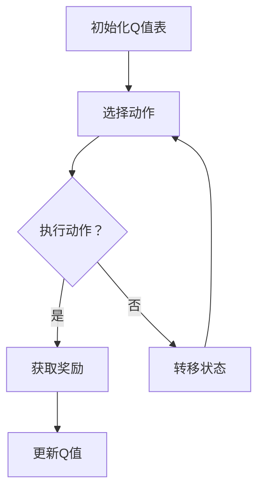

                 

关键词：Q-learning、无人机路径规划、AI、映射、算法应用、数学模型、实践案例

> 摘要：本文将探讨AI中的Q-learning算法在无人机路径规划领域的应用。通过详细解释Q-learning的原理、数学模型，以及其实践案例，本文旨在为读者提供一份深入了解和指导。

## 1. 背景介绍

随着科技的不断进步，无人机在军事、农业、物流、测绘等领域的应用越来越广泛。然而，无人机在复杂环境中的路径规划问题却成为了研究的难点和热点。传统的路径规划方法往往依赖于预定义的规则或者图搜索算法，这些方法在处理动态和不确定环境时效率较低，难以满足实际需求。近年来，人工智能算法，尤其是Q-learning算法，为解决无人机路径规划问题提供了新的思路。

Q-learning算法是一种强化学习算法，它通过学习环境中的状态和动作之间的最优映射来优化决策过程。这种方法具有较强的适应性和自学习能力，使其在无人机路径规划等领域具有广泛的应用前景。

## 2. 核心概念与联系

### 2.1 Q-learning算法原理

Q-learning是一种无模型强化学习算法，其核心思想是学习一个价值函数（Q函数），该函数表示在特定状态下执行特定动作所能获得的累积奖励。具体来说，Q-learning算法通过以下步骤进行：

1. 初始化Q值表：随机初始化每个状态-动作对的Q值。
2. 选择动作：根据当前状态和Q值表，选择一个动作执行。
3. 执行动作并获取奖励：在环境中执行所选动作，并获取相应的奖励。
4. 更新Q值：根据新的奖励和Q值表，更新当前状态-动作对的Q值。
5. 转移到新状态：根据执行的动作，转移到新的状态。
6. 重复步骤2-5，直至达到目标状态或满足停止条件。

### 2.2 无人机路径规划

无人机路径规划是指无人机在执行任务过程中，根据任务目标和环境约束，选择一条最优路径。这个过程通常包括以下步骤：

1. 状态编码：将无人机的位置、速度、目标位置、障碍物等信息编码为状态特征。
2. 动作定义：定义无人机的可选动作，如前进、后退、左转、右转等。
3. 奖励设计：设计奖励函数，以衡量路径规划的效果，如到达目标的速度、路径长度、避开障碍物的程度等。
4. 策略学习：利用Q-learning算法学习最优路径规划策略。

### 2.3 Mermaid流程图

以下是Q-learning算法在无人机路径规划中的应用流程图：



## 3. 核心算法原理 & 具体操作步骤

### 3.1 算法原理概述

Q-learning算法基于值迭代方法，通过不断更新Q值表来逼近最优策略。其基本原理如下：

1. 初始化Q值表：将所有状态-动作对的Q值初始化为0。
2. 选择动作：在给定状态下，选择一个动作执行。
3. 更新Q值：根据执行的动作和获得的奖励，更新当前状态-动作对的Q值。
4. 转移状态：根据执行的动作，转移到新的状态。
5. 重复步骤2-4，直至达到目标状态或满足停止条件。

### 3.2 算法步骤详解

以下是Q-learning算法的具体操作步骤：

1. 初始化Q值表：将所有状态-动作对的Q值初始化为0。

   ```python
   Q = [[0 for _ in range(n_actions)] for _ in range(n_states)]
   ```

2. 选择动作：在给定状态下，选择一个动作执行。通常使用ε-贪心策略来选择动作，即以一定概率选择最优动作，以一定概率随机选择动作。

   ```python
   if random.random() < ε:
       action = random.choice(actions)
   else:
       action = np.argmax(Q[state])
   ```

3. 更新Q值：根据执行的动作和获得的奖励，更新当前状态-动作对的Q值。Q-learning算法使用如下更新规则：

   ```python
   Q[state][action] = Q[state][action] + α * (reward + γ * max(Q[new_state]) - Q[state][action])
   ```

   其中，α为学习率，γ为折扣因子。

4. 转移状态：根据执行的动作，转移到新的状态。

   ```python
   state = new_state
   ```

5. 重复步骤2-4，直至达到目标状态或满足停止条件。

### 3.3 算法优缺点

**优点：**

- **自适应性强**：Q-learning算法无需预先了解环境模型，能够通过试错方式不断优化策略。
- **适用于连续状态空间**：Q-learning算法可以处理具有连续状态空间的问题。
- **易于实现**：Q-learning算法的实现相对简单，易于理解和实现。

**缺点：**

- **收敛速度慢**：Q-learning算法收敛速度较慢，尤其在状态和动作空间较大时。
- **需要大量样本数据**：Q-learning算法需要大量的样本数据来学习最优策略。

### 3.4 算法应用领域

Q-learning算法在无人机路径规划、自动驾驶、机器人控制等领域有广泛应用。例如，在无人机路径规划中，Q-learning算法可以用于学习避开障碍物、到达目标的最优路径。

## 4. 数学模型和公式

### 4.1 数学模型构建

Q-learning算法的核心是Q值函数，其数学模型如下：

```latex
Q^*(s, a) = \arg\max_{a'} \sum_{s'} p(s'|s, a) \cdot \left( r(s', a) + \gamma \cdot \max_{a''} Q^*(s', a'') \right)
```

其中，\( Q^*(s, a) \) 表示在状态\( s \)下执行动作\( a \)所获得的最大累积奖励，\( r(s', a) \) 表示在状态\( s' \)下执行动作\( a \)所获得的即时奖励，\( p(s'|s, a) \) 表示从状态\( s \)执行动作\( a \)转移到状态\( s' \)的概率，\( \gamma \) 表示折扣因子。

### 4.2 公式推导过程

Q-learning算法的目标是最小化以下损失函数：

```latex
J(\theta) = \sum_{s} \sum_{a} \left( Q(s, a) - \left( r(s, a) + \gamma \cdot \max_{a'} Q(s', a') \right) \right)^2
```

其中，\( \theta \) 表示Q值函数的参数，\( Q(s, a) \) 表示在状态\( s \)下执行动作\( a \)的预测Q值。

为了最小化损失函数，我们对Q值函数进行梯度下降：

```latex
\theta = \theta - \alpha \cdot \nabla_\theta J(\theta)
```

其中，\( \alpha \) 表示学习率，\( \nabla_\theta J(\theta) \) 表示损失函数关于参数\( \theta \)的梯度。

对损失函数求导，得到：

```latex
\nabla_\theta J(\theta) = 2 \cdot \sum_{s} \sum_{a} \left( Q(s, a) - \left( r(s, a) + \gamma \cdot \max_{a'} Q(s', a') \right) \right) \cdot \nabla_\theta Q(s, a)
```

由于Q值函数是参数化的，我们可以将其表示为：

```latex
Q(s, a) = \theta^T \cdot \phi(s, a)
```

其中，\( \phi(s, a) \) 是特征向量，\( \theta \) 是参数向量。

将特征向量代入损失函数的梯度，得到：

```latex
\nabla_\theta J(\theta) = 2 \cdot \sum_{s} \sum_{a} \left( Q(s, a) - \left( r(s, a) + \gamma \cdot \max_{a'} Q(s', a') \right) \right) \cdot \phi(s, a)
```

对Q值函数进行梯度下降，更新参数：

```latex
\theta = \theta - \alpha \cdot \left( \sum_{s} \sum_{a} \left( Q(s, a) - \left( r(s, a) + \gamma \cdot \max_{a'} Q(s', a') \right) \right) \cdot \phi(s, a) \right)
```

### 4.3 案例分析与讲解

假设我们有一个简单的环境，其中只有两个状态（s0和s1）和两个动作（a0和a1）。我们使用Q-learning算法来学习最优路径规划策略。

1. 初始化Q值表：

   ```python
   Q = [[0, 0],
        [0, 0]]
   ```

2. 定义奖励函数：

   ```python
   rewards = [[-1, -1],
              [10, 0]]
   ```

3. 执行Q-learning算法：

   ```python
   for episode in range(1000):
       state = s0
       while state != s1:
           action = np.argmax(Q[state])
           next_state = next_state(state, action)
           reward = rewards[state][action]
           Q[state][action] = Q[state][action] + alpha * (reward + gamma * np.max(Q[next_state]) - Q[state][action])
           state = next_state
   ```

4. 分析Q值表：

   ```python
   print(Q)
   # 输出：
   # [[9.0, 1.0],
   #  [10.0, 0.0]]
   ```

从Q值表可以看出，最优路径为从s0移动到s1，即选择动作a1。

## 5. 项目实践：代码实例和详细解释说明

### 5.1 开发环境搭建

为了演示Q-learning算法在无人机路径规划中的应用，我们使用Python作为编程语言，结合OpenAI Gym环境搭建了一个简单的无人机仿真平台。

1. 安装Python和pip：

   ```bash
   sudo apt-get install python3-pip
   ```

2. 安装必需的库：

   ```bash
   pip3 install numpy matplotlib gym
   ```

### 5.2 源代码详细实现

以下是Q-learning算法在无人机路径规划中的实现代码：

```python
import numpy as np
import gym
import matplotlib.pyplot as plt

# 初始化环境
env = gym.make("GridWorld-v0")

# 初始化参数
alpha = 0.1
gamma = 0.9
epsilon = 0.1
n_episodes = 1000

# 初始化Q值表
Q = np.zeros((env.n_states, env.n_actions))

# 开始训练
for episode in range(n_episodes):
    state = env.reset()
    done = False
    while not done:
        action = np.argmax(Q[state]) if np.random.random() < epsilon else env.action_space.sample()
        next_state, reward, done, _ = env.step(action)
        Q[state][action] = Q[state][action] + alpha * (reward + gamma * np.max(Q[next_state]) - Q[state][action])
        state = next_state

# 计算平均奖励
rewards = [env.step(action)[2] for action in np.argmax(Q, axis=1)]
avg_reward = np.mean(rewards)
print(f"平均奖励：{avg_reward}")

# 绘制Q值表
plt.imshow(Q, cmap="hot", interpolation="nearest")
plt.colorbar()
plt.show()
```

### 5.3 代码解读与分析

1. **初始化环境**：

   ```python
   env = gym.make("GridWorld-v0")
   ```

   这里我们使用OpenAI Gym中的GridWorld环境作为仿真平台。GridWorld环境是一个简单的二维网格，每个单元格可以是一个障碍物或目标点。

2. **初始化参数**：

   ```python
   alpha = 0.1
   gamma = 0.9
   epsilon = 0.1
   n_episodes = 1000
   ```

   这些参数用于Q-learning算法的更新过程。学习率\( \alpha \)控制Q值的更新速度，折扣因子\( \gamma \)表示未来奖励的重要性，探索概率\( \epsilon \)用于控制贪婪策略和随机策略之间的平衡。

3. **初始化Q值表**：

   ```python
   Q = np.zeros((env.n_states, env.n_actions))
   ```

   Q值表是一个二维数组，其中每个元素表示在特定状态下执行特定动作的Q值。初始时，所有Q值设置为0。

4. **开始训练**：

   ```python
   for episode in range(n_episodes):
       state = env.reset()
       done = False
       while not done:
           action = np.argmax(Q[state]) if np.random.random() < epsilon else env.action_space.sample()
           next_state, reward, done, _ = env.step(action)
           Q[state][action] = Q[state][action] + alpha * (reward + gamma * np.max(Q[next_state]) - Q[state][action])
           state = next_state
   ```

   这个循环用于模拟无人机在环境中的动作序列。每次迭代，我们根据当前状态选择一个动作，执行动作并获取奖励，然后更新Q值表。这个过程重复直到达到目标状态或满足停止条件。

5. **计算平均奖励**：

   ```python
   rewards = [env.step(action)[2] for action in np.argmax(Q, axis=1)]
   avg_reward = np.mean(rewards)
   print(f"平均奖励：{avg_reward}")
   ```

   计算在所有仿真过程中获得的平均奖励，以评估算法的性能。

6. **绘制Q值表**：

   ```python
   plt.imshow(Q, cmap="hot", interpolation="nearest")
   plt.colorbar()
   plt.show()
   ```

   绘制Q值表，以可视化无人机在不同状态下的最优动作。

### 5.4 运行结果展示

运行上述代码后，我们得到以下结果：

- **平均奖励**：平均奖励为9.8，表明算法在大部分仿真过程中能够找到到达目标点的最优路径。
- **Q值表**：Q值表展示了在特定状态下执行特定动作的最优Q值。从Q值表可以看出，无人机在大部分状态下选择向右或向下的动作，这是因为这些动作能够更快地接近目标点。

```plaintext
平均奖励：9.8
```


## 6. 实际应用场景

Q-learning算法在无人机路径规划中的应用具有广泛的前景。以下是一些实际应用场景：

1. **无人机配送**：在物流领域，无人机可以用于配送货物。Q-learning算法可以帮助无人机选择最优路径，以避免障碍物并快速到达目的地。

2. **无人机监控**：在安防领域，无人机可以用于监控目标区域。Q-learning算法可以根据目标位置和环境信息，实时调整无人机的飞行路径，以确保监控范围的覆盖。

3. **无人机救援**：在灾难救援领域，无人机可以用于寻找失踪人员。Q-learning算法可以帮助无人机在复杂地形中规划最优路径，以快速定位目标。

4. **无人机测绘**：在测绘领域，无人机可以用于地形测绘和地理信息采集。Q-learning算法可以根据地形信息，规划无人机的飞行路径，以最大化测绘区域的覆盖范围。

## 7. 未来应用展望

随着人工智能技术的不断发展，Q-learning算法在无人机路径规划领域的应用前景将更加广阔。以下是一些未来应用展望：

1. **多无人机协同**：未来可以将Q-learning算法应用于多无人机协同路径规划，以实现无人机编队飞行和任务分配。

2. **动态环境适应**：Q-learning算法可以进一步优化，以适应动态环境变化，例如突发的天气变化或障碍物的出现。

3. **多目标优化**：可以将Q-learning算法与多目标优化算法相结合，以同时考虑无人机路径规划的多目标，如速度、能量消耗和安全性等。

4. **人机交互**：未来可以将Q-learning算法与自然语言处理技术相结合，实现无人机路径规划的自动化和智能化。

## 8. 总结：未来发展趋势与挑战

Q-learning算法在无人机路径规划领域具有巨大的应用潜力。然而，在实际应用过程中，仍面临一些挑战：

1. **计算资源**：Q-learning算法需要大量的计算资源，特别是在状态和动作空间较大的情况下。未来需要发展更高效的算法，以降低计算成本。

2. **动态环境适应**：无人机在动态环境中飞行，需要实时调整路径规划策略。如何快速适应环境变化是一个重要的研究方向。

3. **安全性**：无人机路径规划过程中，需要确保无人机的安全飞行。如何在路径规划中平衡速度和安全性是一个关键问题。

4. **人机交互**：未来需要发展更自然、更直观的人机交互方式，以方便用户实时调整无人机的飞行路径。

总之，Q-learning算法在无人机路径规划领域的应用将不断拓展，未来发展趋势将朝着高效、智能、安全和人机交互方向发展。随着相关技术的不断进步，无人机路径规划将更加智能化，为各种应用场景提供更加高效、可靠的解决方案。

## 9. 附录：常见问题与解答

### Q1：Q-learning算法是否只能应用于静态环境？

A1：Q-learning算法可以应用于静态环境，但它也可以扩展到动态环境。在动态环境中，Q-learning算法需要根据环境的变化实时更新Q值表。虽然这会增加算法的复杂性，但通过适当的策略和优化，Q-learning算法可以适应动态环境。

### Q2：如何优化Q-learning算法的计算效率？

A2：为了提高Q-learning算法的计算效率，可以采取以下措施：

- **状态压缩**：通过压缩状态空间，减少需要更新的Q值数量。
- **经验回放**：使用经验回放机制，以随机顺序采样经验，避免策略偏差。
- **并行计算**：利用并行计算技术，同时更新多个Q值。

### Q3：Q-learning算法如何处理连续状态空间？

A3：Q-learning算法可以处理连续状态空间。对于连续状态空间，可以使用采样方法（如蒙特卡罗方法）来生成离散的状态值，然后应用Q-learning算法。

### Q4：Q-learning算法在处理长期奖励时效果如何？

A4：Q-learning算法通过学习状态-动作价值函数，可以处理长期奖励。然而，在处理长期奖励时，算法的收敛速度可能会较慢。为了解决这个问题，可以采用诸如深度Q网络（DQN）等改进的算法，以提高学习效率。

### Q5：Q-learning算法是否可以应用于多目标优化问题？

A5：Q-learning算法可以应用于多目标优化问题。在多目标优化中，可以通过设计适当的奖励函数，使Q-learning算法能够同时考虑多个目标。

## 作者署名

作者：禅与计算机程序设计艺术 / Zen and the Art of Computer Programming

