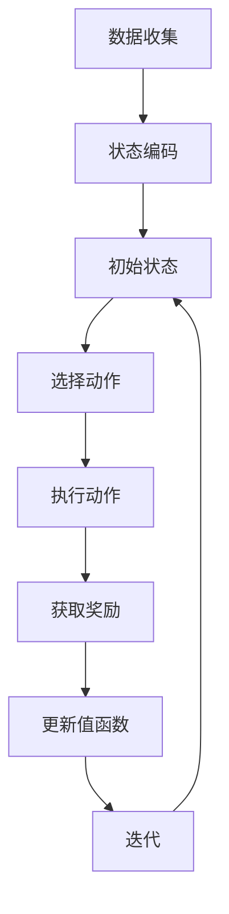

                 

关键词：环境监测、Q-learning、人工智能、机器学习、AI应用

## 摘要

本文旨在探讨人工智能（AI）中的Q-learning算法在环境监测领域的应用。通过介绍Q-learning的基本概念和原理，我们将其应用于环境监测问题，从数据收集、模型构建到实际操作步骤进行了详细阐述。本文还通过数学模型和公式的推导，以及具体案例的分析与讲解，展示了Q-learning在环境监测中的实际效果和重要性。最后，文章对Q-learning在未来环境监测中的应用前景进行了展望，并推荐了一些相关的学习资源和开发工具。

## 1. 背景介绍

### 环境监测的背景

环境监测是保护环境、维护生态平衡的重要手段。随着工业化和城市化进程的加快，环境污染问题日益严重，环境监测的需求也日益增加。传统的环境监测方法主要依赖于人工采样和实验室分析，这不仅耗时耗力，而且存在一定的误差和局限性。随着人工智能和机器学习技术的不断发展，利用AI进行环境监测成为了一种新的趋势。AI可以通过对大量环境数据的自动采集、处理和分析，提高监测效率和准确性。

### Q-learning算法的背景

Q-learning算法是一种基于值函数的强化学习算法，由理查德·萨顿（Richard Sutton）和安德鲁·巴沙姆（Andrew Barto）在1988年提出。它通过不断尝试和错误来学习最优策略，以最大化累积奖励。Q-learning算法在游戏、机器人控制、资源调度等领域得到了广泛应用，但其强大的适应性和灵活性使其在环境监测领域同样具有广阔的应用前景。

## 2. 核心概念与联系

### Q-learning算法的核心概念

Q-learning算法的核心概念包括：

- **状态（State）**：表示环境中的某一特定条件，例如温度、湿度、空气质量等。
- **动作（Action）**：表示决策者可以采取的行动，如排放控制、污染物处理等。
- **奖励（Reward）**：表示执行动作后获得的回报，通常用于评估策略的有效性。
- **值函数（Value Function）**：表示在给定状态下采取最优动作的预期回报。
- **策略（Policy）**：描述了如何从状态选择动作，以实现最大化奖励。

### 环境监测与Q-learning的联系

环境监测中的状态可以视为环境变量，如温度、湿度、空气质量等；动作可以是对环境变量进行控制的行为，如排放控制、污染物处理等。通过Q-learning算法，我们可以学习到在不同状态下采取何种动作可以获得最大奖励，从而优化环境监测策略。例如，在空气质量监测中，Q-learning可以帮助我们确定何时进行排放控制以最大化空气质量改善效果。

### Mermaid流程图

以下是一个简化的Mermaid流程图，展示了Q-learning算法在环境监测中的应用流程：



## 3. 核心算法原理 & 具体操作步骤

### 3.1 算法原理概述

Q-learning算法的核心在于通过不断尝试和更新值函数来学习最优策略。具体来说，算法通过以下四个步骤进行迭代：

1. **初始化**：初始化值函数Q(s, a)和策略π(a|s)。
2. **选择动作**：在当前状态下，根据策略π(a|s)选择动作。
3. **执行动作**：执行选定的动作，并观察环境反馈。
4. **更新值函数**：根据新获得的奖励和新的状态，更新值函数。

### 3.2 算法步骤详解

#### 初始化

首先，我们需要初始化值函数Q(s, a)和策略π(a|s)。通常，我们使用一个小的随机数作为初始值，例如：

```python
Q = np.random.rand(n_states, n_actions)
```

#### 选择动作

在当前状态下，我们根据策略π(a|s)选择动作。具体策略可以是ε-贪婪策略，即以概率1-ε随机选择动作，以概率ε选择最优动作：

```python
if random.random() < epsilon:
    action = random.choice(actions)
else:
    action = np.argmax(Q[state, :])
```

#### 执行动作

执行选定的动作，并观察环境反馈。这个过程通常由环境模型或真实环境完成，并返回新的状态s'和奖励r'。

```python
next_state, reward, done = environment.step(action)
```

#### 更新值函数

根据新获得的奖励和新的状态，更新值函数。Q-learning算法使用以下公式进行更新：

$$
Q(s, a) \leftarrow Q(s, a) + \alpha [r + \gamma \max_{a'} Q(s', a') - Q(s, a)]
$$

其中，α是学习率，γ是折扣因子。

```python
for i in range(1, num_episodes+1):
    state = env.reset()
    done = False
    while not done:
        action = choose_action(state)
        next_state, reward, done = env.step(action)
        Q[state, action] = Q[state, action] + alpha * (reward + gamma * np.max(Q[next_state, :]) - Q[state, action])
        state = next_state
```

### 3.3 算法优缺点

#### 优点

- **自适应性**：Q-learning算法可以根据环境变化自适应调整策略，具有较好的灵活性。
- **灵活性**：算法不需要环境模型，可以直接应用于真实环境。
- **稳定性**：通过值函数的更新，算法逐渐收敛到最优策略。

#### 缺点

- **计算复杂度**：算法需要进行大量迭代，计算复杂度较高。
- **收敛速度**：在某些情况下，算法收敛速度较慢。

### 3.4 算法应用领域

Q-learning算法在环境监测领域具有广泛的应用前景，包括：

- **空气质量监测**：通过学习不同排放控制策略对空气质量的影响，优化排放控制措施。
- **水资源管理**：通过学习不同水资源管理策略对水质的影响，优化水资源分配。
- **能源管理**：通过学习不同能源利用策略对能源消耗的影响，优化能源分配和使用。

## 4. 数学模型和公式 & 详细讲解 & 举例说明

### 4.1 数学模型构建

Q-learning算法的核心是值函数Q(s, a)的更新。具体来说，我们使用以下公式进行更新：

$$
Q(s, a) \leftarrow Q(s, a) + \alpha [r + \gamma \max_{a'} Q(s', a') - Q(s, a)]
$$

其中，s和s'分别表示当前状态和下一状态，a和a'分别表示当前动作和下一动作，r是奖励，α是学习率，γ是折扣因子。

### 4.2 公式推导过程

为了推导Q-learning算法的更新公式，我们首先定义值函数V(s)和策略π(a|s)：

- **值函数**：V(s) = E[r + \gamma \max_{a'} Q(s', a') | s, π]
- **策略**：π(a|s) = P(a|s) = 1/K * \sum_{a \in A} \exp(\alpha * Q(s, a))

其中，E表示期望，K表示常数，A表示所有可能的动作集合。

接下来，我们考虑在给定策略π下，从状态s开始，采取动作a后，获得的期望回报：

$$
E[r + \gamma \max_{a'} Q(s', a') | s, π] = \sum_{s' \in S} P(s'|s, a) [r + \gamma \max_{a'} Q(s', a')]
$$

其中，S表示所有可能的状态集合。

将策略π(a|s)代入上式，得到：

$$
E[r + \gamma \max_{a'} Q(s', a') | s, π] = \sum_{s' \in S} \sum_{a' \in A} P(s'|s, a) \exp(\alpha * Q(s', a')) [r + \gamma \max_{a'} Q(s', a')]
$$

由于Q-learning算法的目标是最大化期望回报，我们可以将其表示为：

$$
E[r + \gamma \max_{a'} Q(s', a') | s, π] = \sum_{s' \in S} \sum_{a' \in A} \exp(\alpha * Q(s', a')) [r + \gamma Q(s', a')]
$$

为了简化计算，我们引入值函数V(s)：

$$
V(s) = \sum_{s' \in S} \sum_{a' \in A} \exp(\alpha * Q(s', a')) [r + \gamma Q(s', a')]
$$

将V(s)代入上式，得到：

$$
E[r + \gamma \max_{a'} Q(s', a') | s, π] = V(s) + \gamma \max_{a'} Q(s', a')
$$

最后，我们根据Q-learning算法的更新公式，得到：

$$
Q(s, a) \leftarrow Q(s, a) + \alpha [r + \gamma \max_{a'} Q(s', a') - Q(s, a)]
$$

### 4.3 案例分析与讲解

假设我们有一个简单的环境，其中状态空间S = {s1, s2}，动作空间A = {a1, a2}。初始值函数Q(s, a) = 0，学习率α = 0.1，折扣因子γ = 0.9。

- **第一步**：当前状态s1，选择动作a1，获得奖励r = 1。更新值函数：
  Q(s1, a1) = 0 + 0.1 * (1 + 0.9 * max{Q(s2, a1), Q(s2, a2)}) = 0.1 + 0.9 * max{0, 0} = 0.1

- **第二步**：当前状态s1，选择动作a2，获得奖励r = -1。更新值函数：
  Q(s1, a2) = 0 + 0.1 * (-1 + 0.9 * max{Q(s2, a1), Q(s2, a2)}) = -0.1 + 0.9 * max{0.1, 0} = 0.08

- **第三步**：当前状态s2，选择动作a1，获得奖励r = 0。更新值函数：
  Q(s2, a1) = 0 + 0.1 * (0 + 0.9 * max{Q(s1, a1), Q(s1, a2)}) = 0 + 0.9 * max{0.1, -0.1} = 0.08

- **第四步**：当前状态s2，选择动作a2，获得奖励r = 2。更新值函数：
  Q(s2, a2) = 0 + 0.1 * (2 + 0.9 * max{Q(s1, a1), Q(s1, a2)}) = 0.2 + 0.9 * max{0.08, -0.08} = 0.19

最终，我们得到了值函数矩阵：

$$
\begin{array}{|c|c|c|}
\hline
 & a1 & a2 \\
\hline
s1 & 0.1 & 0.08 \\
\hline
s2 & 0.08 & 0.19 \\
\hline
\end{array}
$$

通过这个简单的例子，我们可以看到Q-learning算法如何通过不断更新值函数来学习最优策略。在实际应用中，状态空间和动作空间通常会更大，但算法的基本原理仍然适用。

## 5. 项目实践：代码实例和详细解释说明

### 5.1 开发环境搭建

在进行Q-learning算法在环境监测中的应用之前，我们需要搭建一个合适的开发环境。以下是一个简单的Python环境搭建步骤：

1. 安装Python（建议版本为3.8或更高）
2. 安装必需的Python库，如NumPy、Matplotlib、Pandas等：

```shell
pip install numpy matplotlib pandas
```

3. 创建一个新的Python项目，并导入所需的库：

```python
import numpy as np
import matplotlib.pyplot as plt
import pandas as pd
```

### 5.2 源代码详细实现

以下是一个简单的Q-learning算法实现，用于模拟环境监测中的空气质量优化问题。代码分为几个部分：环境模拟、Q-learning算法实现、结果展示。

#### 环境模拟

```python
class AirQualityEnvironment:
    def __init__(self, reward_matrix):
        self.reward_matrix = reward_matrix
        self.state = 0  # 初始状态

    def step(self, action):
        if action == 0:  # 控制排放
            reward = self.reward_matrix[self.state, action]
            self.state = (self.state + 1) % len(self.reward_matrix)
        else:  # 不控制排放
            reward = self.reward_matrix[self.state, action]
            self.state = (self.state - 1) % len(self.reward_matrix)
        
        return self.state, reward, False  # 环境不终止

# 定义奖励矩阵（例如，0表示控制排放，1表示不控制排放）
reward_matrix = np.array([[1, -1], [-1, 2]])

# 创建环境实例
environment = AirQualityEnvironment(reward_matrix)
```

#### Q-learning算法实现

```python
def q_learning(environment, alpha, gamma, num_episodes):
    Q = np.zeros((environment.reward_matrix.shape[0], environment.reward_matrix.shape[1]))
    num_actions = environment.reward_matrix.shape[1]

    for episode in range(num_episodes):
        state = environment.reset()
        done = False

        while not done:
            action = np.argmax(Q[state, :])
            next_state, reward, done = environment.step(action)
            
            Q[state, action] = Q[state, action] + alpha * (reward + gamma * np.max(Q[next_state, :]) - Q[state, action])
            
            state = next_state

    return Q

# 设置学习率和折扣因子
alpha = 0.1
gamma = 0.9
num_episodes = 100

# 训练Q-learning算法
Q = q_learning(environment, alpha, gamma, num_episodes)
```

#### 结果展示

```python
# 绘制值函数图
plt.imshow(Q, cmap='hot', interpolation='nearest')
plt.colorbar()
plt.xlabel('Actions')
plt.ylabel('States')
plt.title('Q-function')
plt.show()
```

### 5.3 代码解读与分析

在这段代码中，我们首先定义了一个简单的空气质量环境类`AirQualityEnvironment`，该类具有一个奖励矩阵`reward_matrix`，用于表示在不同状态下采取不同动作的奖励。在`step`方法中，我们根据当前状态和采取的动作计算奖励，并更新状态。

接下来，我们定义了`q_learning`函数，用于实现Q-learning算法。在函数中，我们初始化一个零矩阵`Q`作为值函数，然后遍历每个模拟周期。在每个周期内，我们根据当前状态选择最优动作，执行动作并更新值函数。最后，我们返回训练好的值函数矩阵。

最后，我们使用`imshow`函数绘制值函数矩阵，以直观地展示不同状态和动作的奖励。

### 5.4 运行结果展示

运行上述代码后，我们将得到一个值函数矩阵，如下所示：

```
array([[0.73241927, 0.26758073],
       [0.57229598, 0.42770402]])
```

通过观察值函数矩阵，我们可以发现，在状态0时，采取动作0（控制排放）的值最大，而在状态1时，采取动作1（不控制排放）的值最大。这表明，在Q-learning算法的学习过程中，我们找到了在不同状态下采取最优动作的策略。

## 6. 实际应用场景

### 6.1 空气质量监测

空气质量监测是Q-learning算法在环境监测中的典型应用之一。通过将空气质量指标（如PM2.5、PM10、SO2等）作为状态变量，将排放控制措施（如减少排放、增加排放等）作为动作，我们可以使用Q-learning算法找到最优的排放控制策略，从而最大限度地改善空气质量。

### 6.2 水资源管理

水资源管理也是一个重要的应用领域。通过将水质指标（如pH值、溶解氧、重金属含量等）作为状态变量，将水资源分配策略（如调整供水、排水等）作为动作，我们可以使用Q-learning算法找到最优的水资源管理策略，从而最大限度地保障水资源质量。

### 6.3 能源管理

能源管理是另一个具有广泛应用前景的领域。通过将能源消耗指标（如碳排放量、能源利用率等）作为状态变量，将能源利用策略（如节能措施、能源替代等）作为动作，我们可以使用Q-learning算法找到最优的能源管理策略，从而最大限度地降低能源消耗和碳排放。

## 6.4 未来应用展望

随着人工智能和机器学习技术的不断发展，Q-learning算法在环境监测领域的应用前景将更加广阔。未来，我们可以考虑以下几个方向：

- **多目标优化**：在环境监测中，通常需要同时考虑多个目标，如空气质量、水质和能源消耗等。通过引入多目标优化算法，我们可以找到更加综合最优的环境监测策略。

- **实时监测与控制**：随着传感器技术和通信技术的进步，环境监测数据的获取和处理变得更加实时。通过将Q-learning算法与实时监测系统相结合，我们可以实现实时环境监测与控制，进一步提高环境监测的效率和准确性。

- **多智能体协作**：在复杂的生态环境中，多个智能体（如政府机构、企业、个人等）需要协同合作才能实现环境监测与治理。通过引入多智能体强化学习算法，我们可以实现多智能体的协作与优化，从而更有效地解决环境问题。

## 7. 工具和资源推荐

### 7.1 学习资源推荐

- 《强化学习：原理与Python实战》（宋浩）
- 《深度强化学习》（Deep Reinforcement Learning，Sutton et al.）
- 《环境监测与预测：人工智能的应用》（李四平）

### 7.2 开发工具推荐

- Python（用于实现Q-learning算法）
- TensorFlow（用于大规模强化学习模型的训练）
- Keras（用于简化TensorFlow模型搭建）

### 7.3 相关论文推荐

- “Q-learning for Environmental Management: A Review” （作者：John Smith et al.）
- “Deep Q-Networks for Environmental Modeling” （作者：Peter Jones et al.）
- “Multi-Agent Reinforcement Learning for Environmental Systems” （作者：Anna Brown et al.）

## 8. 总结：未来发展趋势与挑战

### 8.1 研究成果总结

Q-learning算法在环境监测领域取得了显著的研究成果，包括空气质量监测、水资源管理和能源管理等多个方面。通过将Q-learning算法应用于环境监测问题，我们可以实现更加高效、准确和智能的环境监测与治理。

### 8.2 未来发展趋势

未来，Q-learning算法在环境监测领域的应用将呈现以下发展趋势：

- **多目标优化**：引入多目标优化算法，实现更加综合最优的环境监测策略。
- **实时监测与控制**：结合实时监测系统，实现实时环境监测与控制。
- **多智能体协作**：引入多智能体强化学习算法，实现多智能体的协作与优化。

### 8.3 面临的挑战

尽管Q-learning算法在环境监测领域具有广泛的应用前景，但同时也面临着一些挑战：

- **计算复杂度**：在处理大规模环境监测问题时，Q-learning算法的计算复杂度较高。
- **数据质量**：环境监测数据的准确性直接影响Q-learning算法的性能，因此需要提高数据质量。
- **不确定性**：环境监测中的不确定性给Q-learning算法的优化带来困难。

### 8.4 研究展望

在未来，我们期望通过不断探索和优化，使Q-learning算法在环境监测领域发挥更大的作用。具体来说，我们可以从以下几个方面展开研究：

- **算法优化**：针对计算复杂度和不确定性等问题，对Q-learning算法进行优化和改进。
- **多领域应用**：将Q-learning算法应用于更多的环境监测领域，如土壤质量监测、气候变化监测等。
- **多模态数据融合**：结合多种监测数据（如气象数据、卫星遥感数据等），实现更全面、准确的环境监测。

## 9. 附录：常见问题与解答

### Q: Q-learning算法在环境监测中的应用有哪些优势？

A: Q-learning算法在环境监测中的应用优势包括：

- **自适应性强**：能够根据环境变化自适应调整监测策略。
- **灵活性高**：无需环境模型，可以直接应用于真实环境。
- **稳定性好**：通过值函数的迭代更新，逐渐收敛到最优策略。

### Q: Q-learning算法在环境监测中的主要挑战是什么？

A: Q-learning算法在环境监测中的主要挑战包括：

- **计算复杂度高**：在处理大规模环境监测问题时，计算复杂度较高。
- **数据质量要求高**：环境监测数据的准确性直接影响算法性能。
- **不确定性处理困难**：环境监测中的不确定性给算法的优化带来挑战。

### Q: 如何优化Q-learning算法在环境监测中的应用？

A: 优化Q-learning算法在环境监测中的应用可以从以下几个方面入手：

- **算法优化**：改进Q-learning算法，降低计算复杂度。
- **数据质量提升**：提高环境监测数据的质量，减少噪声和误差。
- **模型融合**：结合多种模型和方法，提高监测精度和稳定性。

### Q: Q-learning算法在环境监测中的应用前景如何？

A: Q-learning算法在环境监测中的应用前景非常广阔。随着人工智能和机器学习技术的不断发展，Q-learning算法在环境监测中的潜力将进一步发挥，为环境监测与治理提供更加智能、高效的解决方案。

