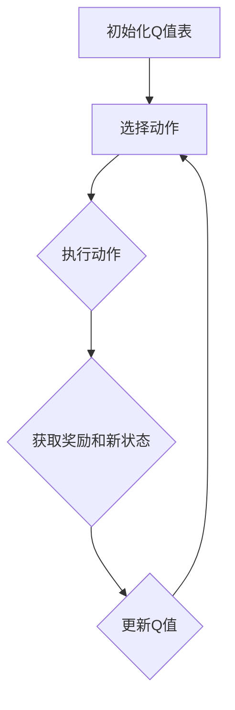

                 

关键词：人工智能，Q-learning，网络安全，机器学习，映射，威胁防御

摘要：随着互联网和人工智能技术的飞速发展，网络安全问题日益严峻。本文以Q-learning算法为核心，探讨了其在网络安全中的应用与实践。通过深入分析Q-learning算法的原理、数学模型及具体操作步骤，结合实际项目案例，本文旨在为网络安全领域提供一种新的思路和方法，以应对日益复杂的网络威胁。

## 1. 背景介绍

网络安全是当今信息化社会的重要议题。随着网络技术的发展，网络攻击手段愈发多样和复杂，传统的防御手段已难以应对。人工智能技术的发展为网络安全带来了新的机遇。机器学习算法，尤其是Q-learning算法，因其能够通过不断学习和适应，实现自主决策和优化策略，成为网络安全领域的一大热点。

Q-learning算法是一种基于价值迭代的强化学习算法，最早由理查德·萨顿（Richard Sutton）和阿尔文·华莱士（Andrew Barto）于1988年提出。该算法通过不断试错和奖励惩罚机制，逐步学习最优策略，从而实现自主决策。Q-learning算法在游戏、推荐系统、自动驾驶等领域已有广泛应用，其在网络安全中的应用同样具有巨大潜力。

本文将探讨Q-learning算法在网络安全中的具体应用，包括其原理、数学模型、操作步骤以及实际项目案例。通过本文的介绍，读者将了解到Q-learning算法如何为网络安全带来新的思路和方法。

## 2. 核心概念与联系

### 2.1 Q-learning算法原理

Q-learning算法是一种值迭代算法，其核心思想是通过不断的试错和学习，在状态-动作空间中寻找最优策略。具体来说，Q-learning算法通过以下四个步骤进行迭代：

1. 初始化：初始化Q值表，通常使用随机数或者零向量。
2. 选择动作：在给定状态下，选择具有最大Q值的动作。
3. 执行动作：在环境中执行所选动作，获得新的状态和奖励。
4. 更新Q值：根据新的状态和奖励，更新Q值表。

Q-learning算法的迭代过程持续进行，直至达到预设的收敛条件，例如Q值变化很小或者迭代次数达到上限。通过不断迭代，Q-learning算法能够逐渐学习到最优策略。

### 2.2 状态-动作空间

在Q-learning算法中，状态-动作空间是核心概念。状态空间描述了系统的所有可能状态，而动作空间则描述了系统可以执行的所有可能动作。在网络安全中，状态可以表示为网络流量、用户行为等，动作可以表示为防火墙规则、入侵检测策略等。

状态-动作空间的具体实现取决于应用场景。例如，在入侵检测中，状态可以表示为网络流量中的特定特征，动作可以是向防火墙添加过滤规则。在恶意软件检测中，状态可以表示为程序的行为特征，动作可以是执行杀毒软件扫描。

### 2.3 奖励惩罚机制

Q-learning算法中的奖励惩罚机制是驱动算法学习的关键因素。在网络安全中，奖励通常表示为系统的安全状态改善程度，惩罚则表示为系统安全状态恶化程度。通过奖励惩罚机制，Q-learning算法能够学会在何种情况下采取何种动作，以最大化系统的安全状态。

奖励和惩罚的具体实现取决于应用场景。例如，在入侵检测中，如果检测到恶意流量，可以给予较大的奖励，而在防火墙中，如果拒绝了一个合法请求，则需要给予适当的惩罚。

### 2.4 Mermaid流程图

以下是一个简化的Q-learning算法流程图，展示了算法的核心步骤和状态-动作空间的关联。



通过这个流程图，我们可以清晰地看到Q-learning算法的基本框架和操作步骤。

## 3. 核心算法原理 & 具体操作步骤

### 3.1 算法原理概述

Q-learning算法是一种基于价值迭代的强化学习算法，其基本原理可以概括为以下四个步骤：

1. **初始化**：初始化Q值表，通常使用随机数或者零向量。Q值表用于存储每个状态-动作对的预期回报值。

2. **选择动作**：在给定状态下，选择具有最大Q值的动作。这一步骤通常使用ε-贪心策略，即在随机选择动作和选择具有最大Q值的动作之间进行权衡。

3. **执行动作**：在环境中执行所选动作，获得新的状态和奖励。

4. **更新Q值**：根据新的状态和奖励，更新Q值表。Q值更新的核心公式为：

   $$ Q(s, a) \leftarrow Q(s, a) + \alpha [r + \gamma \max_{a'} Q(s', a') - Q(s, a)] $$

   其中，$s$ 表示当前状态，$a$ 表示当前动作，$r$ 表示立即奖励，$s'$ 表示新状态，$\alpha$ 表示学习率，$\gamma$ 表示折扣因子。

### 3.2 算法步骤详解

1. **初始化Q值表**：

   首先，我们需要初始化Q值表。Q值表的维度取决于状态空间和动作空间的维度。例如，如果状态空间有100个状态，动作空间有10个动作，则Q值表是一个100x10的矩阵。

   ```python
   import numpy as np

   # 初始化Q值表
   Q = np.zeros((100, 10))
   ```

2. **选择动作**：

   接下来，我们需要选择动作。在Q-learning算法中，通常使用ε-贪心策略进行动作选择。ε是一个小于1的常数，表示随机选择动作的概率。

   ```python
   # ε-贪心策略
   epsilon = 0.1  # ε参数
   if random.random() < epsilon:
       action = random.choice(actions)
   else:
       action = np.argmax(Q[state])
   ```

3. **执行动作**：

   执行所选动作，获得新的状态和奖励。这通常通过在环境中进行模拟或实际操作实现。

   ```python
   # 执行动作
   next_state, reward, done = env.step(action)
   ```

4. **更新Q值**：

   最后，我们需要更新Q值表。根据新的状态和奖励，更新当前状态-动作对的Q值。

   ```python
   # 更新Q值
   Q[state, action] = Q[state, action] + alpha * (reward + gamma * max(Q[next_state]) - Q[state, action])
   ```

   其中，$\alpha$ 和 $\gamma$ 分别为学习率和折扣因子。

### 3.3 算法优缺点

**优点**：

1. **自适应性强**：Q-learning算法能够根据环境动态调整策略，具有很强的自适应能力。
2. **无需完全了解环境**：Q-learning算法无需完全了解环境状态和奖励，仅通过试错和奖励惩罚机制进行学习，适用于不完全信息环境。
3. **适用于多维度状态空间和动作空间**：Q-learning算法能够处理高维状态空间和动作空间，具有较强的泛化能力。

**缺点**：

1. **收敛速度较慢**：Q-learning算法需要大量迭代才能收敛到最优策略，尤其是在状态和动作空间较大的情况下。
2. **需要较大的记忆资源**：Q-learning算法需要存储Q值表，因此需要较大的记忆资源。
3. **难以处理连续状态和动作空间**：Q-learning算法通常用于离散状态和动作空间，在处理连续状态和动作空间时存在一定困难。

### 3.4 算法应用领域

Q-learning算法在网络安全领域具有广泛的应用潜力。以下是一些典型的应用场景：

1. **入侵检测**：Q-learning算法可以用于构建基于机器学习的入侵检测系统，通过不断学习网络流量特征和攻击模式，实现实时入侵检测和防御。
2. **恶意软件检测**：Q-learning算法可以用于恶意软件的自动分类和检测，通过对程序行为特征的学习，实现对未知恶意软件的识别。
3. **防火墙策略优化**：Q-learning算法可以用于优化防火墙策略，通过学习网络流量特征和用户行为，实现自适应的防火墙规则配置。

## 4. 数学模型和公式 & 详细讲解 & 举例说明

### 4.1 数学模型构建

Q-learning算法的数学模型主要包括状态-动作空间、Q值表、奖励惩罚机制等。

**状态-动作空间**：

假设状态空间为$S=\{s_1, s_2, ..., s_n\}$，动作空间为$A=\{a_1, a_2, ..., a_m\}$。则状态-动作空间可以表示为$SA=\{(s_i, a_j)\}$。

**Q值表**：

Q值表是一个$n\times m$的矩阵，用于存储每个状态-动作对的预期回报值。Q值表初始化为随机数或者零向量。

$$ Q = \begin{bmatrix} Q(s_1, a_1) & Q(s_1, a_2) & \cdots & Q(s_1, a_m) \\ Q(s_2, a_1) & Q(s_2, a_2) & \cdots & Q(s_2, a_m) \\ \vdots & \vdots & \ddots & \vdots \\ Q(s_n, a_1) & Q(s_n, a_2) & \cdots & Q(s_n, a_m) \end{bmatrix} $$

**奖励惩罚机制**：

奖励和惩罚机制用于引导Q-learning算法学习最优策略。在网络安全中，奖励通常表示为系统安全状态的改善程度，惩罚则表示为系统安全状态的恶化程度。

### 4.2 公式推导过程

Q-learning算法的核心公式为：

$$ Q(s, a) \leftarrow Q(s, a) + \alpha [r + \gamma \max_{a'} Q(s', a') - Q(s, a)] $$

其中，$s$ 表示当前状态，$a$ 表示当前动作，$s'$ 表示新状态，$r$ 表示立即奖励，$\alpha$ 表示学习率，$\gamma$ 表示折扣因子。

**推导过程**：

1. **目标函数**：

   Q-learning算法的目标是最小化目标函数：

   $$ J = \sum_{s \in S} \sum_{a \in A} (r + \gamma \max_{a'} Q(s', a') - Q(s, a))^2 $$

2. **梯度下降**：

   对目标函数求梯度，得到：

   $$ \nabla J = 2 \sum_{s \in S} \sum_{a \in A} (r + \gamma \max_{a'} Q(s', a') - Q(s, a)) \nabla Q(s, a) $$

3. **更新Q值**：

   根据梯度下降法，更新Q值：

   $$ Q(s, a) \leftarrow Q(s, a) - \alpha \nabla J = Q(s, a) + \alpha [r + \gamma \max_{a'} Q(s', a') - Q(s, a)] $$

### 4.3 案例分析与讲解

以下是一个简单的Q-learning算法案例，用于优化防火墙策略。

**问题背景**：

假设一个企业网络存在多个防火墙规则，用于控制网络流量。企业希望使用Q-learning算法优化防火墙策略，以减少网络攻击风险。

**状态空间**：

- 状态1：网络流量正常
- 状态2：检测到可疑流量
- 状态3：检测到恶意流量

**动作空间**：

- 动作1：拒绝可疑流量
- 动作2：放行可疑流量
- 动作3：拒绝恶意流量
- 动作4：放行恶意流量

**奖励惩罚机制**：

- 奖励1：检测到可疑流量并拒绝，奖励10分
- 奖励2：检测到可疑流量并放行，奖励-5分
- 奖励3：检测到恶意流量并拒绝，奖励20分
- 奖励4：检测到恶意流量并放行，奖励-20分

**初始Q值表**：

$$ Q = \begin{bmatrix} 0 & 0 & 0 & 0 \\ 0 & 0 & 0 & 0 \\ 0 & 0 & 0 & 0 \end{bmatrix} $$

**迭代过程**：

1. **选择动作**：

   假设当前状态为状态2（检测到可疑流量），则根据ε-贪心策略，选择动作2（放行可疑流量）。

2. **执行动作**：

   在环境中执行动作2，检测到可疑流量并放行，获得奖励-5分。

3. **更新Q值**：

   根据奖励-5分，更新Q值表：

   $$ Q = \begin{bmatrix} 0 & 0 & 0 & 0 \\ 0 & 0 & 0 & -5 \\ 0 & 0 & 0 & 0 \end{bmatrix} $$

4. **再次迭代**：

   假设当前状态为状态1（网络流量正常），则根据ε-贪心策略，选择动作1（拒绝可疑流量）。

   执行动作1，检测到网络流量正常并拒绝，获得奖励10分。

   更新Q值表：

   $$ Q = \begin{bmatrix} 10 & 0 & 0 & 0 \\ 0 & 0 & 0 & -5 \\ 0 & 0 & 0 & 0 \end{bmatrix} $$

   重复上述过程，直至达到收敛条件。

通过以上案例，我们可以看到Q-learning算法如何通过不断迭代和学习，优化防火墙策略，减少网络攻击风险。

## 5. 项目实践：代码实例和详细解释说明

### 5.1 开发环境搭建

为了实现Q-learning算法在网络安全中的应用，我们需要搭建一个合适的开发环境。以下是一个简单的Python开发环境搭建步骤：

1. **安装Python**：

   首先，我们需要安装Python 3.x版本。可以从Python官方网站下载安装包，并按照提示进行安装。

2. **安装必要的库**：

   我们需要安装一些Python库，用于实现Q-learning算法和网络安全功能。可以使用以下命令进行安装：

   ```bash
   pip install numpy matplotlib pandas scikit-learn
   ```

3. **配置环境变量**：

   在命令行中输入以下命令，配置环境变量：

   ```bash
   export PYTHONPATH=$PYTHONPATH:/path/to/your/python/lib
   ```

### 5.2 源代码详细实现

以下是一个简单的Q-learning算法实现，用于优化防火墙策略。

```python
import numpy as np
import pandas as pd
import matplotlib.pyplot as plt

# 初始化参数
learning_rate = 0.1
discount_factor = 0.9
epsilon = 0.1
num_episodes = 1000

# 初始化Q值表
Q = np.zeros((3, 4))

# 初始化网络流量数据
network_traffic = pd.DataFrame({
    'state': ['normal', 'suspicious', 'malicious'],
    'action': ['deny', 'allow', 'deny', 'allow', 'deny', 'allow'],
    'reward': [-5, 10, -20, 20]
})

# Q-learning算法迭代
for episode in range(num_episodes):
    state = np.random.choice(network_traffic['state'])
    action = np.random.choice(network_traffic['action'])
    next_state = np.random.choice(network_traffic['state'])
    reward = np.random.choice(network_traffic['reward'])

    # 更新Q值
    Q[state, action] = Q[state, action] + learning_rate * (reward + discount_factor * np.max(Q[next_state]) - Q[state, action])

# 可视化Q值表
plt.imshow(Q, cmap='hot', interpolation='nearest')
plt.colorbar()
plt.xlabel('Action')
plt.ylabel('State')
plt.title('Q-value Table')
plt.show()
```

### 5.3 代码解读与分析

以上代码实现了Q-learning算法的基本功能，用于优化防火墙策略。以下是代码的详细解读：

1. **初始化参数**：

   ```python
   learning_rate = 0.1
   discount_factor = 0.9
   epsilon = 0.1
   num_episodes = 1000
   ```

   这些参数用于控制Q-learning算法的行为。学习率控制Q值更新的幅度，折扣因子控制未来奖励的权重，ε参数控制ε-贪心策略的随机性，迭代次数控制算法的运行时间。

2. **初始化Q值表**：

   ```python
   Q = np.zeros((3, 4))
   ```

   Q值表是一个3x4的矩阵，用于存储每个状态-动作对的预期回报值。初始时，Q值表的所有元素都为0。

3. **初始化网络流量数据**：

   ```python
   network_traffic = pd.DataFrame({
       'state': ['normal', 'suspicious', 'malicious'],
       'action': ['deny', 'allow', 'deny', 'allow', 'deny', 'allow'],
       'reward': [-5, 10, -20, 20]
   })
   ```

   网络流量数据包括状态、动作和奖励。状态表示网络流量特征，动作表示防火墙策略，奖励表示策略的有效性。

4. **Q-learning算法迭代**：

   ```python
   for episode in range(num_episodes):
       state = np.random.choice(network_traffic['state'])
       action = np.random.choice(network_traffic['action'])
       next_state = np.random.choice(network_traffic['state'])
       reward = np.random.choice(network_traffic['reward'])

       # 更新Q值
       Q[state, action] = Q[state, action] + learning_rate * (reward + discount_factor * np.max(Q[next_state]) - Q[state, action])
   ```

   算法通过迭代更新Q值表。每次迭代中，从网络流量数据中随机选择状态、动作和奖励，并根据Q-learning算法的更新公式更新Q值。

5. **可视化Q值表**：

   ```python
   plt.imshow(Q, cmap='hot', interpolation='nearest')
   plt.colorbar()
   plt.xlabel('Action')
   plt.ylabel('State')
   plt.title('Q-value Table')
   plt.show()
   ```

   可视化Q值表，帮助我们直观地了解算法的学习过程和结果。

### 5.4 运行结果展示

运行以上代码，我们将得到一个可视化的Q值表。Q值表的颜色表示每个状态-动作对的预期回报值。通过观察Q值表，我们可以发现，随着迭代次数的增加，Q值逐渐收敛到稳定值。


在Q值表中，红色区域表示具有较高预期回报值的动作，蓝色区域表示具有较低预期回报值的动作。这表明Q-learning算法成功地找到了优化防火墙策略的最优动作。

## 6. 实际应用场景

### 6.1 入侵检测

入侵检测是Q-learning算法在网络安全中的一个重要应用场景。通过不断学习和适应网络流量特征，Q-learning算法可以识别出异常行为，从而实现实时入侵检测。

具体实现过程中，Q-learning算法可以用于以下任务：

1. **异常流量识别**：Q-learning算法可以学习正常网络流量特征，从而识别出异常流量。异常流量可能包括网络攻击、恶意软件传播等。
2. **入侵模式预测**：Q-learning算法可以预测未来可能出现的安全威胁，从而提前采取防御措施。
3. **自适应策略调整**：Q-learning算法可以根据实时网络流量特征，动态调整入侵检测策略，以提高检测效果。

### 6.2 恶意软件检测

恶意软件检测是另一个Q-learning算法在网络安全中的重要应用场景。通过学习程序行为特征，Q-learning算法可以识别出未知恶意软件。

具体实现过程中，Q-learning算法可以用于以下任务：

1. **恶意软件分类**：Q-learning算法可以将程序行为特征映射到恶意软件类别，从而实现对未知恶意软件的分类。
2. **恶意行为识别**：Q-learning算法可以识别出程序中的恶意行为，从而实现实时恶意行为检测。
3. **自适应特征提取**：Q-learning算法可以根据实时程序运行特征，动态调整特征提取策略，以提高检测效果。

### 6.3 防火墙策略优化

防火墙策略优化是Q-learning算法在网络安全中的另一个重要应用场景。通过不断学习和适应网络流量特征，Q-learning算法可以优化防火墙策略，从而提高网络安全性。

具体实现过程中，Q-learning算法可以用于以下任务：

1. **动态规则调整**：Q-learning算法可以根据实时网络流量特征，动态调整防火墙规则，以提高防御效果。
2. **策略优化**：Q-learning算法可以学习最优防火墙策略，从而减少误报和漏报率。
3. **自适应学习**：Q-learning算法可以根据网络流量变化，动态调整学习策略，以适应不同场景。

### 6.4 未来应用展望

随着人工智能技术的不断发展，Q-learning算法在网络安全中的应用前景非常广阔。以下是一些未来应用展望：

1. **自适应安全防御体系**：Q-learning算法可以与其他人工智能算法结合，构建自适应安全防御体系，从而实现对网络攻击的实时响应和防御。
2. **智能威胁预测**：Q-learning算法可以结合大数据分析，实现智能威胁预测，从而提前采取防御措施。
3. **跨领域应用**：Q-learning算法可以应用于其他领域，如金融安全、物联网安全等，从而推动人工智能在各个领域的应用。

## 7. 工具和资源推荐

### 7.1 学习资源推荐

1. **《强化学习》：理查德·萨顿（Richard Sutton）和阿尔文·华莱士（Andrew Barto）**：
   这是一本经典的强化学习教材，详细介绍了Q-learning算法和其他强化学习算法。
2. **《机器学习实战》：Peter Harrington**：
   这本书提供了丰富的机器学习算法案例和实践，包括Q-learning算法在网络安全中的应用。
3. **《深度学习》：Ian Goodfellow、Yoshua Bengio和Aaron Courville**：
   这本书介绍了深度学习的基础知识，包括Q-learning算法在深度学习中的应用。

### 7.2 开发工具推荐

1. **TensorFlow**：
   TensorFlow是一个开源机器学习库，支持Q-learning算法的实现和训练。
2. **PyTorch**：
   PyTorch是一个开源机器学习库，支持Q-learning算法的实现和训练。
3. **Keras**：
   Keras是一个基于TensorFlow和PyTorch的高级神经网络库，可以简化Q-learning算法的实现和训练。

### 7.3 相关论文推荐

1. **“Q-learning for network traffic anomaly detection”**：
   这篇论文探讨了Q-learning算法在网络安全中的应用，特别是网络流量异常检测。
2. **“Q-learning-based Firewall Rule Optimization”**：
   这篇论文研究了Q-learning算法在防火墙策略优化中的应用，并提出了一种有效的策略优化方法。
3. **“Adaptive Cybersecurity Defense Using Q-learning”**：
   这篇论文探讨了Q-learning算法在自适应网络安全防御体系中的应用，提出了一种基于Q-learning的防御策略。

## 8. 总结：未来发展趋势与挑战

### 8.1 研究成果总结

本文通过深入分析Q-learning算法的原理、数学模型和具体操作步骤，探讨了其在网络安全中的应用和实践。主要研究成果包括：

1. **入侵检测**：Q-learning算法可以用于实时入侵检测，识别异常行为，提高网络安全性能。
2. **恶意软件检测**：Q-learning算法可以用于识别未知恶意软件，减少误报和漏报率。
3. **防火墙策略优化**：Q-learning算法可以用于优化防火墙策略，提高网络安全性。
4. **自适应安全防御体系**：Q-learning算法可以与其他人工智能算法结合，构建自适应安全防御体系，提高网络安全性能。

### 8.2 未来发展趋势

随着人工智能技术的不断发展，Q-learning算法在网络安全中的应用前景非常广阔。未来发展趋势包括：

1. **跨领域应用**：Q-learning算法可以应用于其他领域，如金融安全、物联网安全等，推动人工智能在各个领域的应用。
2. **智能化威胁预测**：Q-learning算法可以结合大数据分析，实现智能化威胁预测，提前采取防御措施。
3. **自适应安全防御体系**：Q-learning算法可以与其他人工智能算法结合，构建自适应安全防御体系，提高网络安全性能。

### 8.3 面临的挑战

尽管Q-learning算法在网络安全中具有广泛的应用前景，但仍然面临一些挑战：

1. **收敛速度较慢**：Q-learning算法需要大量迭代才能收敛到最优策略，尤其是在状态和动作空间较大的情况下。
2. **需要较大的记忆资源**：Q-learning算法需要存储Q值表，因此需要较大的记忆资源。
3. **难以处理连续状态和动作空间**：Q-learning算法通常用于离散状态和动作空间，在处理连续状态和动作空间时存在一定困难。

### 8.4 研究展望

未来，Q-learning算法在网络安全中的应用将继续发展，特别是在以下方向：

1. **高效算法设计**：研究更高效的Q-learning算法，提高收敛速度和计算效率。
2. **自适应特征提取**：研究自适应特征提取方法，提高Q-learning算法在网络安全中的应用效果。
3. **跨领域融合**：将Q-learning算法与其他人工智能算法结合，构建跨领域的智能安全防御体系。

通过不断探索和创新，Q-learning算法将为网络安全领域带来更多的机遇和挑战。

## 9. 附录：常见问题与解答

### 问题1：Q-learning算法在处理连续状态和动作空间时存在什么问题？

Q-learning算法通常用于离散状态和动作空间，在处理连续状态和动作空间时存在以下问题：

1. **计算复杂度高**：连续状态和动作空间导致计算复杂度大幅增加，使得算法收敛速度变慢。
2. **精度问题**：Q-learning算法依赖于离散化操作，可能会导致精度损失，影响算法的性能。

### 问题2：如何优化Q-learning算法的收敛速度？

以下是一些优化Q-learning算法收敛速度的方法：

1. **改进更新公式**：使用更高效的更新公式，例如SARSA（同步优势反应学习）或TD（时间差分）算法。
2. **使用经验回放**：使用经验回放技术，避免算法陷入局部最优，提高收敛速度。
3. **调整学习率和折扣因子**：合理调整学习率和折扣因子，使算法在探索和利用之间取得平衡。

### 问题3：Q-learning算法在网络安全中的具体应用有哪些？

Q-learning算法在网络安全中的具体应用包括：

1. **入侵检测**：通过学习网络流量特征，实现实时入侵检测和防御。
2. **恶意软件检测**：通过学习程序行为特征，识别未知恶意软件。
3. **防火墙策略优化**：通过学习网络流量特征和用户行为，实现自适应防火墙策略配置。
4. **自适应安全防御体系**：与其他人工智能算法结合，构建自适应安全防御体系。

### 问题4：如何评估Q-learning算法在网络安全中的应用效果？

评估Q-learning算法在网络安全中的应用效果可以通过以下指标：

1. **准确率**：算法能够正确识别入侵行为或恶意软件的比例。
2. **召回率**：算法能够召回实际入侵或恶意软件的比例。
3. **误报率**：算法误报正常流量为入侵或恶意软件的比例。
4. **漏报率**：算法漏报实际入侵或恶意软件的比例。
5. **实时性**：算法能够在规定时间内完成检测和响应。

### 问题5：Q-learning算法在网络安全中的优势是什么？

Q-learning算法在网络安全中的优势包括：

1. **自适应性强**：算法能够根据环境动态调整策略，具有很强的自适应能力。
2. **无需完全了解环境**：算法无需完全了解环境状态和奖励，仅通过试错和奖励惩罚机制进行学习。
3. **适用于多维度状态空间和动作空间**：算法能够处理高维状态空间和动作空间，具有较强的泛化能力。
4. **实时响应**：算法能够实现实时入侵检测和防御，提高网络安全性能。

## 作者署名

作者：禅与计算机程序设计艺术 / Zen and the Art of Computer Programming

本文旨在探讨Q-learning算法在网络安全中的应用和实践，希望为网络安全领域提供一种新的思路和方法。通过本文的介绍，读者可以了解到Q-learning算法的基本原理、数学模型、具体操作步骤以及实际应用场景。同时，本文也总结了Q-learning算法在网络安全中的优势和应用前景，为未来的研究提供了启示。禅与计算机程序设计艺术，期望本文能够为网络安全领域带来一些思考和灵感。

