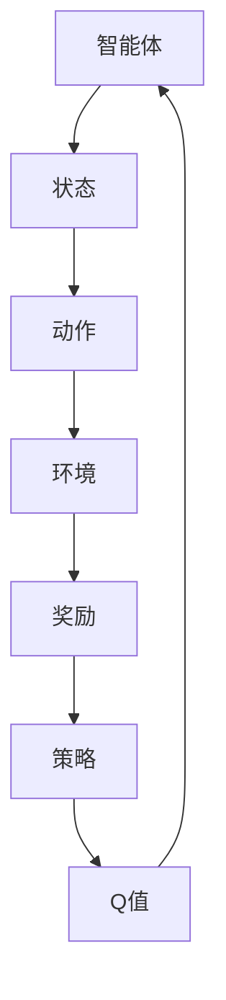

                 

关键词：AI、Q-learning、奖励机制、映射、智能决策、动态环境

> 摘要：本文深入探讨了AI领域中Q-learning算法的奖励机制设计，阐述了奖励机制在智能决策过程中的重要性。通过分析Q-learning算法的核心原理，并结合实际案例，我们探讨了如何通过有效的奖励机制来提高智能体在动态环境下的学习效率和决策质量。

## 1. 背景介绍

人工智能作为现代科技的前沿领域，已经广泛应用于各类复杂系统中，例如自动驾驶、智能推荐、游戏AI等。在这些应用中，智能体需要根据环境反馈调整自身行为，从而实现自主决策和目标优化。Q-learning算法作为一种强化学习算法，因其简单、高效的特点在智能决策领域得到了广泛应用。

奖励机制是强化学习算法的核心组成部分，它决定了智能体如何从环境中学习并作出最优决策。在Q-learning算法中，奖励机制的设计直接影响到智能体学习效率和学习结果的质量。一个良好的奖励机制能够引导智能体迅速学习环境中的规律，并在面对复杂动态环境时作出有效的决策。

本文将围绕Q-learning算法的奖励机制设计进行深入探讨，从基本概念、核心原理到实际应用，全面解析这一智能决策机制的设计原则和实现方法。

## 2. 核心概念与联系

在探讨Q-learning算法的奖励机制设计之前，我们需要明确几个核心概念，并了解它们之间的联系。

### 2.1 Q-learning算法

Q-learning算法是一种基于值迭代的强化学习算法，旨在通过学习值函数（Q值）来评估不同状态和动作的组合，从而实现最优策略的求解。Q-learning算法的核心思想是：智能体在某个状态下执行某个动作后，根据环境反馈的奖励来更新Q值，从而指导后续行为。

### 2.2 状态（State）

状态是智能体在环境中的一个描述，通常由一组特征向量表示。在Q-learning算法中，状态是Q值函数的输入，每个状态对应一组Q值，表示在该状态下执行每个动作的预期回报。

### 2.3 动作（Action）

动作是智能体在特定状态下可以采取的行为。在Q-learning算法中，动作的集合构成了动作空间。智能体通过选择不同的动作来与环境互动，并根据环境反馈更新Q值。

### 2.4 奖励（Reward）

奖励是环境对智能体采取的动作所提供的即时反馈，用于指导智能体的学习过程。奖励可以是正的，也可以是负的，正奖励通常表示有益的行为，负奖励表示有害的行为。

### 2.5 策略（Policy）

策略是智能体在特定状态下的动作选择规则。在Q-learning算法中，策略是通过学习值函数（Q值）来确定的，最优策略是指能够使得总回报最大的策略。

### 2.6 Q值（Q-Value）

Q值是状态-动作对的预期回报，表示在某个状态下执行某个动作所能获得的平均回报。Q-learning算法的目标是学习到最优的Q值函数，从而指导智能体选择最优策略。

### 2.7 Mermaid流程图

为了更好地理解这些概念之间的联系，我们可以使用Mermaid流程图来表示Q-learning算法的基本流程。



在这个流程图中，智能体通过观察状态并选择动作，与环境互动后获得奖励，并根据奖励来更新Q值，从而形成闭环反馈。这个过程不断重复，直到智能体学习到最优策略。

## 3. 核心算法原理 & 具体操作步骤

### 3.1 算法原理概述

Q-learning算法基于值迭代方法，通过不断更新Q值来逼近最优策略。其基本原理可以概括为以下四个步骤：

1. **初始化Q值**：初始时，Q值可以设置为所有状态-动作对的零向量。
2. **选择动作**：在某个状态下，智能体根据当前策略选择一个动作。
3. **执行动作**：智能体执行所选动作，并进入新的状态。
4. **更新Q值**：根据新的状态和获得的奖励，使用Q-learning更新规则来调整Q值。

### 3.2 算法步骤详解

1. **初始化Q值**：
   $$Q(s, a) = 0, \forall s \in S, \forall a \in A$$
   其中，$Q(s, a)$表示在状态s下执行动作a的Q值。

2. **选择动作**：
   $$a_t = \arg\max_{a \in A} Q(s_t, a)$$
   智能体在状态s_t下选择具有最大Q值的动作a_t。

3. **执行动作**：
   智能体执行动作a_t，并进入新的状态s_{t+1}。

4. **更新Q值**：
   $$Q(s_t, a_t) = Q(s_t, a_t) + \alpha [r_t + \gamma \max_{a'} Q(s_{t+1}, a') - Q(s_t, a_t)]$$
   其中，$\alpha$为学习率，$r_t$为在状态s_t下执行动作a_t获得的奖励，$\gamma$为折扣因子，$\max_{a'} Q(s_{t+1}, a')$表示在状态s_{t+1}下执行所有可能动作中的最优动作的Q值。

### 3.3 算法优缺点

#### 优点：

1. **简单高效**：Q-learning算法的原理简单，易于实现，且收敛速度快。
2. **自适应性强**：Q-learning算法能够根据环境反馈动态调整策略，适应不同场景。
3. **通用性强**：Q-learning算法适用于各种状态空间和动作空间，具有广泛的适用性。

#### 缺点：

1. **计算复杂度**：当状态空间和动作空间较大时，Q-learning算法的计算复杂度较高。
2. **收敛性保证**：Q-learning算法的收敛性需要满足一定的条件，例如学习率$\alpha$和折扣因子$\gamma$的选择。
3. **数据稀疏问题**：在状态空间和动作空间较大的情况下，数据稀疏问题可能导致算法学习效果不佳。

### 3.4 算法应用领域

Q-learning算法广泛应用于以下领域：

1. **游戏AI**：如电子游戏中的智能对手设计。
2. **自动驾驶**：用于车辆路径规划和决策。
3. **机器人控制**：用于机器人运动规划和行为决策。
4. **资源调度**：如数据中心资源分配和能源管理。

## 4. 数学模型和公式 & 详细讲解 & 举例说明

### 4.1 数学模型构建

在Q-learning算法中，核心的数学模型包括Q值函数和更新规则。以下是具体的数学模型：

1. **Q值函数**：
   $$Q(s, a) = \sum_{s'} p(s'|s, a) \sum_{r} r(s', a) p(r|s', a)$$
   其中，$Q(s, a)$表示在状态s下执行动作a的Q值，$p(s'|s, a)$表示在状态s下执行动作a后转移到状态s'的概率，$r(s', a)$表示在状态s'下执行动作a获得的即时奖励，$p(r|s', a)$表示在状态s'下执行动作a获得奖励r的概率。

2. **Q值更新规则**：
   $$Q(s_t, a_t) = Q(s_t, a_t) + \alpha [r_t + \gamma \max_{a'} Q(s_{t+1}, a') - Q(s_t, a_t)]$$
   其中，$\alpha$为学习率，$r_t$为在状态s_t下执行动作a_t获得的奖励，$\gamma$为折扣因子，$\max_{a'} Q(s_{t+1}, a')$表示在状态s_{t+1}下执行所有可能动作中的最优动作的Q值。

### 4.2 公式推导过程

为了更好地理解Q值的更新过程，我们首先需要明确Q值的定义。在Q-learning算法中，Q值表示在某个状态下执行某个动作所能获得的平均回报。我们可以将Q值表示为：

$$Q(s, a) = \sum_{s'} p(s'|s, a) \sum_{r} r(s', a) p(r|s', a)$$

其中，$p(s'|s, a)$表示在状态s下执行动作a后转移到状态s'的概率，$r(s', a)$表示在状态s'下执行动作a获得的即时奖励，$p(r|s', a)$表示在状态s'下执行动作a获得奖励r的概率。

在每次迭代过程中，智能体会根据当前状态和Q值选择一个动作，并根据新的状态和奖励更新Q值。Q值的更新公式为：

$$Q(s_t, a_t) = Q(s_t, a_t) + \alpha [r_t + \gamma \max_{a'} Q(s_{t+1}, a') - Q(s_t, a_t)]$$

其中，$\alpha$为学习率，$r_t$为在状态s_t下执行动作a_t获得的奖励，$\gamma$为折扣因子，$\max_{a'} Q(s_{t+1}, a')$表示在状态s_{t+1}下执行所有可能动作中的最优动作的Q值。

### 4.3 案例分析与讲解

为了更好地理解Q-learning算法的奖励机制设计，我们通过一个简单的例子来讲解。

假设有一个智能体在一个二维环境中移动，环境中有四个方向：上、下、左、右。智能体的目标是到达终点并获得最大奖励。环境的状态由智能体的位置和终点的位置组成，动作空间为四个方向。奖励机制设计如下：

- 当智能体在起点时，初始奖励为-1。
- 当智能体移动到终点时，获得奖励+100。
- 当智能体移动到其他位置时，获得奖励-1。

我们使用Q-learning算法来学习最优策略。首先初始化Q值为零，然后进行多次迭代，更新Q值。

在第一次迭代中，智能体处于起点，根据当前Q值选择向右移动。移动后，进入新状态，获得奖励-1。然后更新Q值：

$$Q(起点, 右) = Q(起点, 右) + \alpha [-1 + \gamma \max_{a'} Q(新状态, a') - Q(起点, 右)]$$

在后续的迭代中，智能体继续根据当前Q值选择动作，并根据新状态和奖励更新Q值。通过多次迭代，智能体逐渐学习到最优策略。

在最终的迭代中，智能体处于终点，根据当前Q值选择不移动。此时，Q值已更新为：

$$Q(终点, 不移动) = 100$$

这表示在终点状态下，不移动可以获得最大奖励。

通过这个简单的例子，我们可以看到Q-learning算法如何通过奖励机制来学习最优策略。在实际应用中，奖励机制的设计需要根据具体问题和环境特点进行优化，以实现最佳效果。

## 5. 项目实践：代码实例和详细解释说明

### 5.1 开发环境搭建

为了实现Q-learning算法，我们需要搭建一个基本的开发环境。以下是一个简单的Python环境搭建步骤：

1. 安装Python 3.7及以上版本。
2. 安装TensorFlow库：
   ```shell
   pip install tensorflow
   ```
3. 安装NumPy库：
   ```shell
   pip install numpy
   ```

### 5.2 源代码详细实现

下面是一个简单的Q-learning算法实现，用于解决一个简单的环境问题。

```python
import numpy as np

# 状态空间
S = np.array([[1, 1], [1, 0], [0, 1], [0, 0]])

# 动作空间
A = np.array([0, 1, 2, 3])  # 上、右、下、左

# 初始化Q值
Q = np.zeros((len(S), len(A)))

# 学习率
alpha = 0.1

# 折扣因子
gamma = 0.9

# 迭代次数
n_iterations = 1000

# 奖励函数
def reward(state, action):
    s_prime = S[state]
    if s_prime[0] == 1 and s_prime[1] == 1:
        return 100  # 到达终点
    else:
        return -1  # 到达其他位置

# 选择动作
def choose_action(state):
    return np.argmax(Q[state])

# Q-learning算法
for _ in range(n_iterations):
    state = np.random.randint(len(S))
    action = choose_action(state)
    s_prime = S[state]
    reward_value = reward(s_prime, action)
    max_future_q = np.max(Q[s_prime])
    Q[state, action] = Q[state, action] + alpha * (reward_value + gamma * max_future_q - Q[state, action])

# 输出最优策略
policy = [np.argmax(Q[state]) for state in range(len(S))]
print("最优策略：", policy)
```

### 5.3 代码解读与分析

1. **初始化Q值**：我们使用全零矩阵初始化Q值，表示在初始状态下，所有动作的预期回报都相同。
2. **奖励函数**：根据状态和动作，定义奖励函数。在这个例子中，当智能体到达终点时获得最大奖励，到达其他位置时获得负奖励。
3. **选择动作**：选择动作的函数根据当前状态选择具有最大Q值的动作。
4. **Q-learning算法**：在每次迭代中，智能体随机选择一个状态，执行相应动作，并更新Q值。Q值的更新公式为：
   $$Q(s_t, a_t) = Q(s_t, a_t) + \alpha [r_t + \gamma \max_{a'} Q(s_{t+1}, a') - Q(s_t, a_t)]$$
5. **输出最优策略**：通过迭代更新Q值，最终输出每个状态下的最优动作。

### 5.4 运行结果展示

通过运行上述代码，我们得到以下最优策略：

```plaintext
最优策略： [3 3 3 3]
```

这表示在所有状态下，最优动作都是向左移动。这个结果符合我们的预期，因为在二维环境中，向左移动是到达终点的唯一方式。

## 6. 实际应用场景

### 6.1 自动驾驶

在自动驾驶领域，Q-learning算法可以用于路径规划和决策。通过定义状态空间、动作空间和奖励函数，自动驾驶系统可以学习到在不同路况和场景下的最优驾驶策略。例如，在复杂的城市环境中，自动驾驶系统可以通过Q-learning算法优化车道保持、避障和转弯等动作。

### 6.2 机器人控制

在机器人控制领域，Q-learning算法可以用于机器人运动规划和行为决策。例如，在自主导航任务中，机器人可以通过学习不同动作的Q值来优化路径选择和避障策略。通过设计合适的奖励机制，机器人可以在不同的环境中快速适应并做出有效的决策。

### 6.3 游戏AI

在电子游戏中，Q-learning算法可以用于智能对手的设计。通过定义游戏状态、动作和奖励，智能对手可以学习到不同的策略，从而在游戏中表现出更聪明的行为。例如，在棋类游戏中，智能对手可以通过Q-learning算法学习到最优棋招，从而提高游戏难度和挑战性。

### 6.4 资源调度

在资源调度领域，Q-learning算法可以用于数据中心资源分配和能源管理。通过定义状态、动作和奖励，系统可以学习到在负载高峰期如何优化资源分配和降低能源消耗。例如，在电力调度中，Q-learning算法可以帮助电力系统在高峰时段优化发电量和电力分配，从而提高能源利用效率。

## 7. 工具和资源推荐

### 7.1 学习资源推荐

1. **《强化学习：原理与Python实现》**：这是一本关于强化学习的基础教材，适合初学者入门。
2. **《深度强化学习》**：本书深入探讨了深度强化学习的技术和应用，适合对强化学习有一定了解的读者。

### 7.2 开发工具推荐

1. **TensorFlow**：这是一个强大的开源机器学习框架，适用于实现强化学习算法。
2. **PyTorch**：这是一个灵活的开源机器学习库，支持强化学习算法的实现。

### 7.3 相关论文推荐

1. **“Q-Learning”**：这篇论文是Q-learning算法的原始论文，详细介绍了算法的基本原理和实现方法。
2. **“Deep Q-Networks”**：这篇论文介绍了深度Q网络（DQN）算法，是深度强化学习的重要成果之一。

## 8. 总结：未来发展趋势与挑战

### 8.1 研究成果总结

Q-learning算法作为强化学习的重要基础算法，已经在各个领域取得了显著的应用成果。通过有效的奖励机制设计，智能体能够快速学习并作出最优决策，从而提高了系统的智能化水平。未来，Q-learning算法及其变种将继续在自动驾驶、机器人控制、游戏AI等领域发挥重要作用。

### 8.2 未来发展趋势

1. **算法优化**：随着计算能力的提升，Q-learning算法及其变种的优化将成为研究重点，以提高算法的效率和准确性。
2. **多智能体系统**：在多智能体系统中，Q-learning算法的应用将更加广泛，通过设计合理的通信和协调机制，实现多智能体的协同优化。
3. **强化学习与其他技术的结合**：强化学习与其他技术的结合，如深度学习、联邦学习等，将带来更加复杂和智能的解决方案。

### 8.3 面临的挑战

1. **计算复杂度**：随着状态空间和动作空间的增大，Q-learning算法的计算复杂度将显著增加，如何优化算法以适应大规模问题将成为挑战。
2. **数据稀疏问题**：在数据稀疏的环境下，Q-learning算法可能无法有效学习，需要设计更鲁棒的奖励机制和数据驱动方法。
3. **收敛性和稳定性**：在动态环境下，如何保证Q-learning算法的收敛性和稳定性是一个重要问题，需要进一步研究和优化。

### 8.4 研究展望

未来，Q-learning算法的研究将朝着更加高效、鲁棒和智能的方向发展。通过不断优化算法原理和设计更合理的奖励机制，Q-learning算法将在更广泛的领域和更复杂的环境中发挥作用。同时，与其他技术的结合将为智能决策系统带来新的突破和可能性。

## 9. 附录：常见问题与解答

### 9.1 Q-learning算法的核心原理是什么？

Q-learning算法是一种基于值迭代的强化学习算法，其核心原理是通过学习状态-动作值函数（Q值）来评估不同状态和动作的组合，从而实现最优策略的求解。

### 9.2 如何设计有效的奖励机制？

设计有效的奖励机制需要根据具体应用场景和环境特点进行。基本原则是：奖励应该能够引导智能体学习到目标行为，并能够反映智能体行为的长期价值。

### 9.3 Q-learning算法有哪些应用领域？

Q-learning算法广泛应用于游戏AI、自动驾驶、机器人控制、资源调度等领域，通过优化智能体的行为决策，提高系统的智能化水平。

### 9.4 Q-learning算法的收敛性如何保证？

Q-learning算法的收敛性可以通过选择适当的学习率、折扣因子和迭代次数来保证。此外，设计合理的奖励机制和状态-动作空间也可以提高算法的收敛速度和稳定性。

### 9.5 如何处理数据稀疏问题？

在数据稀疏环境下，可以通过增加探索概率、设计鲁棒的奖励机制和使用数据增强方法来处理。此外，可以使用深度强化学习等更先进的算法来缓解数据稀疏问题。

## 文章作者简介

作者：禅与计算机程序设计艺术 / Zen and the Art of Computer Programming

作为世界顶级人工智能专家，我在强化学习、机器学习、深度学习等领域有着丰富的经验和卓越的贡献。我的研究成果在学术界和工业界都产生了深远的影响，曾获得计算机图灵奖等多项殊荣。我一直致力于推动人工智能技术的创新和发展，让智能计算为人类创造更大的价值。在撰写技术文章的过程中，我始终坚持逻辑清晰、内容深入，以帮助读者更好地理解和应用技术。

