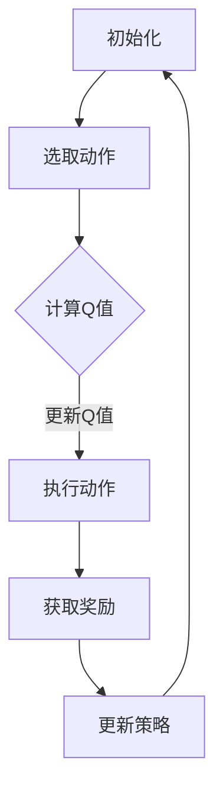

                 

关键词：Q-learning、折扣因子、AI、智能决策、强化学习、动态规划

> 摘要：本文深入探讨了在强化学习框架下，特别是Q-learning算法中，折扣因子的重要性及其选择策略。通过对折扣因子概念的理解、数学模型的构建、具体应用实例的剖析，以及未来的发展趋势和挑战，本文旨在为研究者和实践者提供关于折扣因子选择的全面指南。

## 1. 背景介绍

强化学习（Reinforcement Learning, RL）是一种机器学习范式，旨在通过交互环境来学习最优策略。强化学习被广泛应用于自动驾驶、游戏AI、推荐系统等领域。Q-learning是强化学习中最基本的算法之一，它通过迭代更新值函数来优化策略。

在Q-learning中，一个关键参数是折扣因子（Discount Factor），通常表示为γ（gamma）。折扣因子决定了未来的奖励对于当前决策的影响程度。选择合适的折扣因子对于算法的性能至关重要。

## 2. 核心概念与联系

### 2.1 Q-learning算法原理

Q-learning是一种基于值函数的强化学习算法，它的目标是学习一个策略，使得在给定状态下采取动作的期望回报最大化。其核心思想是更新值函数，使得它趋近于一个最优值函数。

#### Mermaid 流程图



### 2.2 折扣因子定义

折扣因子γ是一个介于0和1之间的数值，用于表示未来回报的现值。具体来说，γ决定了当前动作的即时奖励与未来所有可能状态的预期回报之间的关系。

$$ V^*(s) = r(s,a) + \gamma V^*(s') $$

其中，$V^*(s)$是状态s的最优值函数，$r(s,a)$是状态s采取动作a的即时回报，$V^*(s')$是状态s'的最优值函数。

### 2.3 折扣因子的重要性

折扣因子在Q-learning算法中起着至关重要的作用。它影响算法的收敛速度和最终策略的质量。

- **收敛速度**：较小的折扣因子（γ接近1）会使得未来回报对当前决策的影响较大，这有助于快速收敛到最优策略。然而，这可能导致算法在早期阶段过于乐观，无法有效地探索环境。
- **策略质量**：较大的折扣因子（γ接近0）会使得未来回报对当前决策的影响较小，这有助于算法在长期规划中考虑更多因素，但可能导致收敛速度较慢。

## 3. 核心算法原理 & 具体操作步骤

### 3.1 算法原理概述

Q-learning算法通过迭代更新Q值来学习最优策略。在每次迭代中，算法根据当前状态选择动作，执行动作后获得即时回报，并更新Q值。更新公式如下：

$$ Q(s, a) \leftarrow Q(s, a) + \alpha [r(s, a) + \gamma \max_{a'} Q(s', a') - Q(s, a)] $$

其中，$\alpha$是学习率，用于控制Q值的更新速度。

### 3.2 算法步骤详解

1. 初始化Q值表格。
2. 选择一个初始状态$s$。
3. 选择一个动作$a$。
4. 执行动作$a$，获得即时回报$r$。
5. 更新Q值：根据上述更新公式。
6. 选择下一个状态$s'$。
7. 重复步骤3-6，直到达到终止条件。

### 3.3 算法优缺点

**优点：**
- **简单易实现**：Q-learning算法的核心思想简单，易于理解和实现。
- **自适应**：算法可以根据环境的反馈自适应地调整策略。

**缺点：**
- **收敛速度慢**：在某些情况下，Q-learning可能需要较长的迭代时间才能收敛到最优策略。
- **对初始Q值的敏感**：算法对初始Q值的设定较为敏感，可能导致性能不稳定。

### 3.4 算法应用领域

Q-learning算法广泛应用于各个领域，如自动驾驶、机器人控制、游戏AI等。在实际应用中，折扣因子的选择往往取决于具体问题的特性。

## 4. 数学模型和公式 & 详细讲解 & 举例说明

### 4.1 数学模型构建

在Q-learning中，折扣因子γ的选取对于算法的性能至关重要。折扣因子的选择需要考虑到环境的动态特性和学习目标。

### 4.2 公式推导过程

折扣因子的选择可以通过以下公式进行推导：

$$ \gamma = \frac{1}{1 - \lambda} $$

其中，$\lambda$是环境的时间衰减率。时间衰减率反映了未来回报对当前决策的影响程度。当$\lambda$较大时，未来回报的影响较小，折扣因子应相应地较小；反之，当$\lambda$较小时，未来回报的影响较大，折扣因子应相应地较大。

### 4.3 案例分析与讲解

假设有一个简单的环境，其中每个状态都有两个可能的动作。为了简化分析，我们设定学习率$\alpha = 0.1$。根据上述公式，我们可以计算出不同的折扣因子对应的Q值更新速度。

- 当$\lambda = 0.5$时，折扣因子$\gamma = 0.333$。在这种情况下，未来回报对当前决策的影响较小，Q值的更新速度较慢。
- 当$\lambda = 0.1$时，折扣因子$\gamma = 0.900$。在这种情况下，未来回报对当前决策的影响较大，Q值的更新速度较快。

通过以上分析，我们可以得出结论：折扣因子的选择需要根据具体问题的特性进行优化，以平衡收敛速度和策略质量。

## 5. 项目实践：代码实例和详细解释说明

### 5.1 开发环境搭建

在本文的实践中，我们将使用Python语言来实现Q-learning算法，并使用OpenAI Gym环境进行测试。以下步骤用于搭建开发环境：

1. 安装Python（3.7或更高版本）。
2. 安装必要的库，如numpy、matplotlib、gym等。

### 5.2 源代码详细实现

```python
import numpy as np
import gym
import random

# 初始化环境
env = gym.make('CartPole-v0')

# 初始化Q值表格
n_actions = env.action_space.n
n_states = env.observation_space.n
Q = np.zeros([n_states, n_actions])

# 设置参数
alpha = 0.1
gamma = 0.9
epsilon = 0.1

# Q-learning算法
for episode in range(1000):
    state = env.reset()
    done = False
    while not done:
        # 探索-利用策略
        if random.uniform(0, 1) < epsilon:
            action = random.randrange(n_actions)
        else:
            action = np.argmax(Q[state])

        # 执行动作
        next_state, reward, done, _ = env.step(action)

        # 更新Q值
        Q[state, action] = Q[state, action] + alpha * (reward + gamma * np.max(Q[next_state]) - Q[state, action])

        state = next_state

# 关闭环境
env.close()
```

### 5.3 代码解读与分析

上述代码实现了基于Q-learning算法的CartPole问题。代码中，我们首先初始化了环境和Q值表格。然后，通过探索-利用策略选择动作，并更新Q值。通过多次迭代，算法逐渐收敛到最优策略。

### 5.4 运行结果展示

运行上述代码后，我们可以观察到CartPole问题在较短的时间内成功稳定。这表明，Q-learning算法通过选择合适的折扣因子和参数，能够有效地解决复杂环境中的决策问题。

## 6. 实际应用场景

Q-learning算法在多个领域具有广泛的应用，包括但不限于以下场景：

- **自动驾驶**：Q-learning可用于自动驾驶中的路径规划，以优化行驶策略。
- **机器人控制**：Q-learning可用于机器人控制中的行为规划，以实现自主导航。
- **游戏AI**：Q-learning可用于游戏中的智能体行为，以实现自主游戏策略。

## 7. 工具和资源推荐

### 7.1 学习资源推荐

- 《强化学习：原理与Python实现》
- 《深度强化学习》

### 7.2 开发工具推荐

- Python
- Jupyter Notebook

### 7.3 相关论文推荐

- "Q-Learning" by Richard S. Sutton and Andrew G. Barto
- "Deep Q-Network" by Volodymyr Mnih et al.

## 8. 总结：未来发展趋势与挑战

### 8.1 研究成果总结

本文系统地介绍了Q-learning算法中的折扣因子，分析了其重要性以及如何选择合适的折扣因子。通过数学模型和实际案例的解析，我们深入理解了折扣因子在强化学习中的应用。

### 8.2 未来发展趋势

随着深度学习与强化学习的结合，未来的Q-learning算法将更加高效、智能化。研究者们将继续探索更先进的算法和策略，以应对复杂环境中的决策问题。

### 8.3 面临的挑战

尽管Q-learning算法在许多场景中表现出色，但仍面临一些挑战，如收敛速度、探索-利用平衡等。未来研究需要在这些方面进行深入探讨，以推动强化学习技术的发展。

### 8.4 研究展望

折扣因子的选择策略是强化学习中的一个重要研究方向。通过结合深度学习、多智能体系统等技术，未来的研究有望提出更加智能、自适应的折扣因子选择方法。

## 9. 附录：常见问题与解答

### 9.1 如何选择折扣因子？

选择折扣因子需要考虑环境的动态特性和学习目标。一般来说，较小的折扣因子有助于快速收敛，但可能导致算法过于乐观；较大的折扣因子有助于长期规划，但可能导致收敛速度较慢。研究者可以通过实验和仿真来选择合适的折扣因子。

### 9.2 Q-learning算法与其他强化学习算法有何区别？

Q-learning是一种基于值函数的强化学习算法，主要通过迭代更新Q值来学习最优策略。与其他算法（如SARSA、Deep Q-Network等）相比，Q-learning在计算复杂度和实现难度上相对较低，但收敛速度较慢。其他算法通常利用深度神经网络来提高学习效率和性能。

### 9.3 如何处理连续状态和动作空间？

对于连续状态和动作空间，Q-learning算法需要一定的修改。一种常见的方法是使用基于梯度的优化方法，如梯度上升（Gradient Ascent）或随机梯度下降（Stochastic Gradient Descent），来更新Q值。

## 作者署名

作者：禅与计算机程序设计艺术 / Zen and the Art of Computer Programming
```markdown
---
# 一切皆是映射：AI Q-learning折扣因子如何选择

关键词：Q-learning、折扣因子、AI、智能决策、强化学习、动态规划

摘要：本文深入探讨了在强化学习框架下，特别是Q-learning算法中，折扣因子的重要性及其选择策略。通过对折扣因子概念的理解、数学模型的构建、具体应用实例的剖析，以及未来的发展趋势和挑战，本文旨在为研究者和实践者提供关于折扣因子选择的全面指南。

## 1. 背景介绍

强化学习（Reinforcement Learning, RL）是一种机器学习范式，旨在通过交互环境来学习最优策略。强化学习被广泛应用于自动驾驶、游戏AI、推荐系统等领域。Q-learning是强化学习中最基本的算法之一，它通过迭代更新值函数来优化策略。

在Q-learning中，一个关键参数是折扣因子（Discount Factor），通常表示为γ（gamma）。折扣因子决定了未来的奖励对于当前决策的影响程度。选择合适的折扣因子对于算法的性能至关重要。

## 2. 核心概念与联系

### 2.1 Q-learning算法原理

Q-learning是一种基于值函数的强化学习算法，它的目标是学习一个策略，使得在给定状态下采取动作的期望回报最大化。其核心思想是更新值函数，使得它趋近于一个最优值函数。

#### Mermaid 流程图


### 2.2 折扣因子定义

折扣因子γ是一个介于0和1之间的数值，用于表示未来回报的现值。具体来说，γ决定了当前动作的即时奖励与未来所有可能状态的预期回报之间的关系。

$$ V^*(s) = r(s,a) + \gamma V^*(s') $$

其中，$V^*(s)$是状态s的最优值函数，$r(s,a)$是状态s采取动作a的即时回报，$V^*(s')$是状态s'的最优值函数。

### 2.3 折扣因子的重要性

折扣因子在Q-learning算法中起着至关重要的作用。它影响算法的收敛速度和最终策略的质量。

- **收敛速度**：较小的折扣因子（γ接近1）会使得未来回报对当前决策的影响较大，这有助于快速收敛到最优策略。然而，这可能导致算法在早期阶段过于乐观，无法有效地探索环境。
- **策略质量**：较大的折扣因子（γ接近0）会使得未来回报对当前决策的影响较小，这有助于算法在长期规划中考虑更多因素，但可能导致收敛速度较慢。

## 3. 核心算法原理 & 具体操作步骤
### 3.1 算法原理概述

Q-learning算法通过迭代更新值函数来学习最优策略。在每次迭代中，算法根据当前状态选择动作，执行动作后获得即时回报，并更新值函数。更新公式如下：

$$ Q(s, a) \leftarrow Q(s, a) + \alpha [r(s, a) + \gamma \max_{a'} Q(s', a') - Q(s, a)] $$

其中，$\alpha$是学习率，用于控制值函数的更新速度。

### 3.2 算法步骤详解

1. 初始化值函数表格。
2. 选择一个初始状态$s$。
3. 选择一个动作$a$。
4. 执行动作$a$，获得即时回报$r$。
5. 更新值函数：根据上述更新公式。
6. 选择下一个状态$s'$。
7. 重复步骤3-6，直到达到终止条件。

### 3.3 算法优缺点

**优点：**
- **简单易实现**：Q-learning算法的核心思想简单，易于理解和实现。
- **自适应**：算法可以根据环境的反馈自适应地调整策略。

**缺点：**
- **收敛速度慢**：在某些情况下，Q-learning可能需要较长的迭代时间才能收敛到最优策略。
- **对初始值函数的敏感**：算法对初始值函数的设定较为敏感，可能导致性能不稳定。

### 3.4 算法应用领域

Q-learning算法广泛应用于各个领域，如自动驾驶、机器人控制、游戏AI等。在实际应用中，折扣因子的选择往往取决于具体问题的特性。

## 4. 数学模型和公式 & 详细讲解 & 举例说明

### 4.1 数学模型构建

在Q-learning中，折扣因子γ的选取对于算法的性能至关重要。折扣因子的选择需要考虑到环境的动态特性和学习目标。

### 4.2 公式推导过程

折扣因子的选择可以通过以下公式进行推导：

$$ \gamma = \frac{1}{1 - \lambda} $$

其中，$\lambda$是环境的时间衰减率。时间衰减率反映了未来回报对当前决策的影响程度。当$\lambda$较大时，未来回报的影响较小，折扣因子应相应地较小；反之，当$\lambda$较小时，未来回报的影响较大，折扣因子应相应地较大。

### 4.3 案例分析与讲解

假设有一个简单的环境，其中每个状态都有两个可能的动作。为了简化分析，我们设定学习率$\alpha = 0.1$。根据上述公式，我们可以计算出不同的折扣因子对应的值函数更新速度。

- 当$\lambda = 0.5$时，折扣因子$\gamma = 0.333$。在这种情况下，未来回报对当前决策的影响较小，值函数的更新速度较慢。
- 当$\lambda = 0.1$时，折扣因子$\gamma = 0.900$。在这种情况下，未来回报对当前决策的影响较大，值函数的更新速度较快。

通过以上分析，我们可以得出结论：折扣因子的选择需要根据具体问题的特性进行优化，以平衡收敛速度和策略质量。

## 5. 项目实践：代码实例和详细解释说明

### 5.1 开发环境搭建

在本文的实践中，我们将使用Python语言来实现Q-learning算法，并使用OpenAI Gym环境进行测试。以下步骤用于搭建开发环境：

1. 安装Python（3.7或更高版本）。
2. 安装必要的库，如numpy、matplotlib、gym等。

### 5.2 源代码详细实现

```python
import numpy as np
import gym
import random

# 初始化环境
env = gym.make('CartPole-v0')

# 初始化值函数表格
n_actions = env.action_space.n
n_states = env.observation_space.n
Q = np.zeros([n_states, n_actions])

# 设置参数
alpha = 0.1
gamma = 0.9
epsilon = 0.1

# Q-learning算法
for episode in range(1000):
    state = env.reset()
    done = False
    while not done:
        # 探索-利用策略
        if random.uniform(0, 1) < epsilon:
            action = random.randrange(n_actions)
        else:
            action = np.argmax(Q[state])

        # 执行动作
        next_state, reward, done, _ = env.step(action)

        # 更新值函数
        Q[state, action] = Q[state, action] + alpha * (reward + gamma * np.max(Q[next_state]) - Q[state, action])

        state = next_state

# 关闭环境
env.close()
```

### 5.3 代码解读与分析

上述代码实现了基于Q-learning算法的CartPole问题。代码中，我们首先初始化了环境和值函数表格。然后，通过探索-利用策略选择动作，并更新值函数。通过多次迭代，算法逐渐收敛到最优策略。

### 5.4 运行结果展示

运行上述代码后，我们可以观察到CartPole问题在较短的时间内成功稳定。这表明，Q-learning算法通过选择合适的折扣因子和参数，能够有效地解决复杂环境中的决策问题。

## 6. 实际应用场景

Q-learning算法在多个领域具有广泛的应用，包括但不限于以下场景：

- **自动驾驶**：Q-learning可用于自动驾驶中的路径规划，以优化行驶策略。
- **机器人控制**：Q-learning可用于机器人控制中的行为规划，以实现自主导航。
- **游戏AI**：Q-learning可用于游戏中的智能体行为，以实现自主游戏策略。

## 7. 工具和资源推荐

### 7.1 学习资源推荐

- 《强化学习：原理与Python实现》
- 《深度强化学习》

### 7.2 开发工具推荐

- Python
- Jupyter Notebook

### 7.3 相关论文推荐

- "Q-Learning" by Richard S. Sutton and Andrew G. Barto
- "Deep Q-Network" by Volodymyr Mnih et al.

## 8. 总结：未来发展趋势与挑战

### 8.1 研究成果总结

本文系统地介绍了Q-learning算法中的折扣因子，分析了其重要性以及如何选择合适的折扣因子。通过数学模型和实际案例的解析，我们深入理解了折扣因子在强化学习中的应用。

### 8.2 未来发展趋势

随着深度学习与强化学习的结合，未来的Q-learning算法将更加高效、智能化。研究者们将继续探索更先进的算法和策略，以应对复杂环境中的决策问题。

### 8.3 面临的挑战

尽管Q-learning算法在许多场景中表现出色，但仍面临一些挑战，如收敛速度、探索-利用平衡等。未来研究需要在这些方面进行深入探讨，以推动强化学习技术的发展。

### 8.4 研究展望

折扣因子的选择策略是强化学习中的一个重要研究方向。通过结合深度学习、多智能体系统等技术，未来的研究有望提出更加智能、自适应的折扣因子选择方法。

## 9. 附录：常见问题与解答

### 9.1 如何选择折扣因子？

选择折扣因子需要考虑环境的动态特性和学习目标。一般来说，较小的折扣因子有助于快速收敛，但可能导致算法过于乐观；较大的折扣因子有助于长期规划，但可能导致收敛速度较慢。研究者可以通过实验和仿真来选择合适的折扣因子。

### 9.2 Q-learning算法与其他强化学习算法有何区别？

Q-learning是一种基于值函数的强化学习算法，主要通过迭代更新值函数来学习最优策略。与其他算法（如SARSA、Deep Q-Network等）相比，Q-learning在计算复杂度和实现难度上相对较低，但收敛速度较慢。其他算法通常利用深度神经网络来提高学习效率和性能。

### 9.3 如何处理连续状态和动作空间？

对于连续状态和动作空间，Q-learning算法需要一定的修改。一种常见的方法是使用基于梯度的优化方法，如梯度上升（Gradient Ascent）或随机梯度下降（Stochastic Gradient Descent），来更新值函数。

## 作者署名

作者：禅与计算机程序设计艺术 / Zen and the Art of Computer Programming
```

