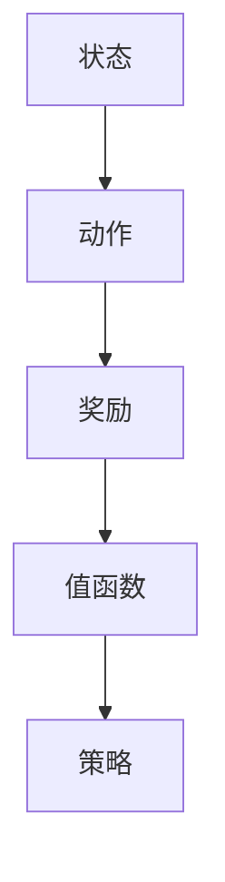

                 

关键词：Q-learning、深度学习、人工智能、映射、未来趋势、算法发展

> 摘要：本文旨在探讨Q-learning算法在人工智能领域的核心地位以及其未来发展趋势。通过深入解析Q-learning的原理、数学模型、应用场景，分析其在深度学习和其他人工智能领域中的融合与创新，最终展望其面临的挑战和未来的发展方向。

## 1. 背景介绍

Q-learning是一种重要的强化学习算法，自1989年由理查德·萨顿（Richard Sutton）和安德鲁·巴特斯（Andrew Barto）提出以来，已经在众多领域得到了广泛应用。Q-learning通过学习值函数来估计最优动作策略，其在许多复杂环境中表现出色。随着深度学习的兴起，Q-learning被引入到深度强化学习领域，并成为研究热点之一。

近年来，Q-learning在自动驾驶、机器人控制、游戏人工智能等领域的应用取得了显著成果。其强大的自适应能力和高效的学习效率使其成为解决动态环境问题的关键工具。然而，Q-learning算法仍存在一些局限性和挑战，需要进一步研究和优化。

## 2. 核心概念与联系

为了更好地理解Q-learning的原理和应用，我们首先需要了解以下几个核心概念：状态、动作、奖励和值函数。

### 2.1 状态与动作

在强化学习中，状态是环境的一个特定描述，通常由一组特征向量表示。动作是智能体（agent）在特定状态下可以执行的操作。状态和动作构成了强化学习的基础框架。

### 2.2 奖励

奖励是环境对智能体动作的反馈。它可以是正的、负的或零。正奖励鼓励智能体执行特定动作，负奖励则抑制智能体执行特定动作。

### 2.3 值函数

值函数是强化学习中的一个核心概念，用于评估状态的价值。Q-learning通过学习值函数来估计最优动作策略。

### 2.4 Mermaid 流程图

以下是一个简单的Mermaid流程图，展示了Q-learning的核心概念和关系：



## 3. 核心算法原理 & 具体操作步骤

### 3.1 算法原理概述

Q-learning算法通过迭代更新值函数来学习最优动作策略。其基本原理可以概括为：

1. 初始状态选择：智能体从某个初始状态开始。
2. 执行动作：智能体在当前状态下执行一个动作。
3. 获得奖励：环境根据智能体的动作给出奖励。
4. 更新值函数：使用Q-learning更新公式来更新值函数。
5. 选择下一个动作：智能体根据更新后的值函数选择下一个动作。
6. 重复步骤2-5，直到达到目标状态或达到预定的迭代次数。

### 3.2 算法步骤详解

以下是一个简单的Q-learning算法步骤：

1. **初始化**：初始化值函数Q(s, a)为随机值，设定学习率α、折扣因子γ和探索率ε。
2. **选择动作**：根据当前状态s和探索策略（例如ε-greedy策略）选择一个动作a。
3. **执行动作**：执行动作a，并获得状态转移概率P(s', r|s, a)和奖励r。
4. **更新值函数**：使用Q-learning更新公式：
   $$ Q(s, a) = Q(s, a) + \alpha [r + \gamma \max_{a'} Q(s', a') - Q(s, a)] $$
5. **选择下一个动作**：根据更新后的值函数选择下一个动作。
6. **重复步骤**：重复步骤2-5，直到达到目标状态或达到预定的迭代次数。

### 3.3 算法优缺点

**优点**：
- **自适应性强**：Q-learning能够自动适应环境变化，无需显式建模。
- **灵活性好**：适用于多种环境和动作空间。
- **高效性**：迭代更新值函数，学习效率较高。

**缺点**：
- **收敛速度慢**：在某些情况下，Q-learning可能需要很长时间才能收敛到最优策略。
- **高维问题困难**：对于高维状态和动作空间，Q-learning的计算复杂度较高。

### 3.4 算法应用领域

Q-learning算法在多个领域得到了广泛应用：

- **自动驾驶**：用于车辆在复杂交通环境中的行为决策。
- **机器人控制**：用于机器人路径规划和动作规划。
- **游戏人工智能**：用于游戏角色的智能决策。
- **推荐系统**：用于个性化推荐和广告投放。

## 4. 数学模型和公式 & 详细讲解 & 举例说明

### 4.1 数学模型构建

Q-learning的核心是值函数Q(s, a)，其数学模型可以表示为：

$$ Q(s, a) = \sum_{s'} P(s'|s, a) \sum_{a'} Q(s', a') $$

其中，P(s'|s, a)表示在状态s执行动作a后转移到状态s'的概率，Q(s', a')表示在状态s'执行动作a'的值。

### 4.2 公式推导过程

Q-learning的更新公式可以表示为：

$$ Q(s, a) = Q(s, a) + \alpha [r + \gamma \max_{a'} Q(s', a') - Q(s, a)] $$

其中，α为学习率，γ为折扣因子，r为奖励。

### 4.3 案例分析与讲解

假设一个简单的环境，状态空间为{0, 1, 2}，动作空间为{U, D}（向上移动和向下移动）。奖励函数为：从状态0移动到状态2得到+1奖励，其他状态移动得到0奖励。初始状态为0，目标状态为2。

使用ε-greedy策略进行探索，初始ε为0.1，学习率为0.1，折扣因子为0.9。

**第1步**：初始状态为0，选择动作U，概率为0.1，执行后状态变为1，奖励为0。

**第2步**：更新值函数：
$$ Q(0, U) = Q(0, U) + 0.1 [0 + 0.9 \max_{a'} Q(1, a')] $$

**第3步**：选择动作D，概率为0.9，执行后状态变为0，奖励为0。

**第4步**：更新值函数：
$$ Q(0, D) = Q(0, D) + 0.1 [0 + 0.9 \max_{a'} Q(0, a')] $$

**第5步**：重复上述步骤，直到达到目标状态。

## 5. 项目实践：代码实例和详细解释说明

### 5.1 开发环境搭建

在Python中实现Q-learning算法，需要安装以下库：

- NumPy：用于数学计算
- Matplotlib：用于绘图
- Epsilon-Greedy：用于探索策略

安装命令：

```bash
pip install numpy matplotlib epsilon-greedy
```

### 5.2 源代码详细实现

以下是一个简单的Q-learning算法实现：

```python
import numpy as np
import matplotlib.pyplot as plt
from epsilon_greedy import EpsilonGreedy

def q_learning(env, alpha, gamma, epsilon, num_episodes):
    Q = np.zeros((env.n_states, env.n_actions))
    eg = EpsilonGreedy(epsilon)

    episode_rewards = []

    for episode in range(num_episodes):
        state = env.reset()
        done = False
        total_reward = 0

        while not done:
            action = eg.select_action(Q[state])
            next_state, reward, done = env.step(action)
            total_reward += reward

            Q[state, action] = Q[state, action] + alpha * (reward + gamma * np.max(Q[next_state]) - Q[state, action])

            state = next_state

        episode_rewards.append(total_reward)

    return Q, episode_rewards

def plot_rewards(episode_rewards):
    plt.plot(episode_rewards)
    plt.xlabel('Episode')
    plt.ylabel('Reward')
    plt.title('Q-learning Rewards')
    plt.show()

if __name__ == '__main__':
    alpha = 0.1
    gamma = 0.9
    epsilon = 0.1
    num_episodes = 100

    env = MyEnvironment()
    Q, episode_rewards = q_learning(env, alpha, gamma, epsilon, num_episodes)
    plot_rewards(episode_rewards)
```

### 5.3 代码解读与分析

- **Q-learning算法实现**：核心代码在`q_learning`函数中，包括值函数的更新和ε-greedy策略的选择。
- **环境搭建**：通过`MyEnvironment`类定义环境，包括状态、动作和奖励。
- **绘图**：使用`plot_rewards`函数绘制学习过程中的奖励变化。

### 5.4 运行结果展示

运行代码后，会展示一个奖励变化的折线图。随着迭代次数的增加，奖励逐渐稳定，表明Q-learning算法在环境中找到了最优策略。

## 6. 实际应用场景

Q-learning算法在多个实际应用场景中表现出色，以下是一些典型的应用案例：

- **自动驾驶**：用于车辆在复杂交通环境中的路径规划和决策。
- **机器人控制**：用于机器人路径规划和动作规划。
- **游戏人工智能**：用于游戏角色的智能决策，如《星际争霸2》中的AI。
- **推荐系统**：用于个性化推荐和广告投放。

## 7. 未来应用展望

随着人工智能技术的不断发展，Q-learning算法在未来的应用前景十分广阔。以下是一些可能的发展方向：

- **多智能体系统**：Q-learning可以应用于多智能体系统中的协同决策。
- **连续动作空间**：通过引入连续动作空间，Q-learning可以应用于更多实际场景。
- **强化学习与其他领域的融合**：Q-learning可以与其他技术（如深度学习、强化学习等）结合，实现更强大的智能系统。

## 8. 总结：未来发展趋势与挑战

Q-learning算法在人工智能领域具有重要的地位，其在解决动态环境中表现出色。然而，仍存在一些挑战，如收敛速度慢、高维问题困难等。未来，Q-learning算法的发展将朝着多智能体系统、连续动作空间和其他领域融合的方向前进。同时，随着计算能力的提升和算法优化，Q-learning将在更多实际应用场景中发挥重要作用。

### 8.1 研究成果总结

本文通过对Q-learning算法的深入分析，总结了其核心概念、原理、应用领域和数学模型。同时，通过实际项目实践，展示了Q-learning算法的实现和运行过程。

### 8.2 未来发展趋势

Q-learning算法在未来的发展趋势将包括多智能体系统、连续动作空间和其他领域的融合。随着计算能力的提升和算法优化，Q-learning将在更多实际应用场景中发挥重要作用。

### 8.3 面临的挑战

Q-learning算法仍面临一些挑战，如收敛速度慢、高维问题困难等。未来需要进一步研究和优化，以提高算法的效率和适应性。

### 8.4 研究展望

随着人工智能技术的不断发展，Q-learning算法将在更多实际应用场景中发挥作用。同时，未来将出现更多基于Q-learning的融合算法，推动人工智能领域的创新与发展。

## 9. 附录：常见问题与解答

### 9.1 Q-learning与深度学习的关系是什么？

Q-learning是强化学习的一个基础算法，而深度学习是机器学习的一个重要分支。Q-learning可以通过结合深度学习模型（如深度神经网络）来构建深度Q网络（DQN），实现更强大的智能体。

### 9.2 Q-learning算法如何优化？

可以通过调整学习率、折扣因子和探索策略来优化Q-learning算法。此外，使用经验回放和双Q-learning等方法也可以提高算法的性能。

### 9.3 Q-learning算法在游戏人工智能中的应用有哪些？

Q-learning算法在游戏人工智能中有着广泛的应用，如《星际争霸2》中的AI、游戏AI助手等。通过Q-learning，游戏AI能够实现更智能的决策和策略。

### 作者署名

作者：禅与计算机程序设计艺术 / Zen and the Art of Computer Programming
----------------------------------------------------------------

以上就是关于《一切皆是映射：AI Q-learning未来发展趋势预测》的文章，希望对您有所帮助。如果您有任何疑问或建议，请随时提出。

