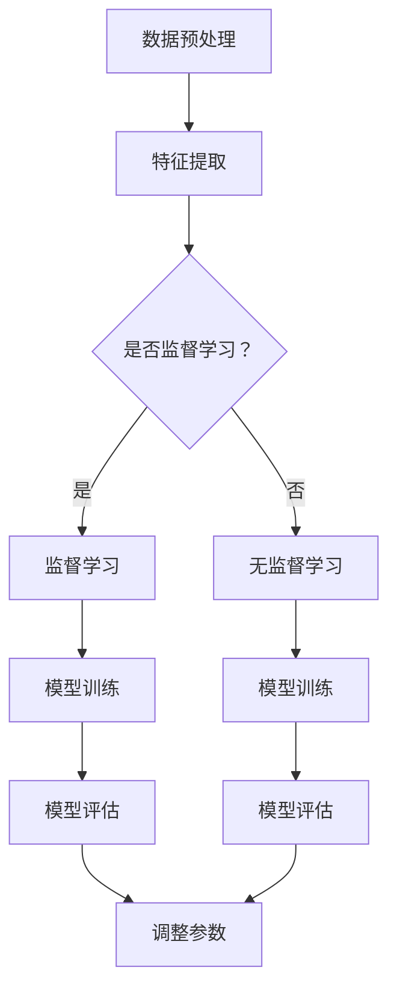

                 

人工智能（AI）作为当今科技领域的明星，已经成为驱动创新和变革的重要力量。其核心原理——映射（Mapping），更是贯穿了AI的各个应用场景。本文将深入探讨AI人工智能的基本原理，并通过具体实例展示其在实际应用中的强大功能。

> **关键词：** 人工智能，映射原理，机器学习，深度学习，应用实践。

> **摘要：** 本文将详细介绍AI人工智能的基本概念和映射原理，分析核心算法及其应用，并结合实际项目实践，展示AI技术的广泛应用和未来发展潜力。

## 1. 背景介绍

人工智能（AI）自20世纪50年代诞生以来，经历了数十年的起伏发展。随着计算能力的提升和海量数据的积累，AI技术迎来了前所未有的发展机遇。机器学习和深度学习成为AI领域的重要分支，极大地推动了AI在各个行业的应用。映射（Mapping）作为AI的核心概念，将输入数据映射到输出结果，是实现智能决策和自动化操作的基础。

### 人工智能的发展历程

1. **早期探索**：1950年代，人工智能概念诞生，艾伦·图灵提出“图灵测试”来评估机器的智能水平。
2. **符号人工智能**：20世纪80年代，基于规则和逻辑推理的符号人工智能兴起，但其局限性很快显现。
3. **机器学习时代**：21世纪以来，随着计算能力的提升和大数据的出现，机器学习成为AI的主流方向。
4. **深度学习崛起**：2012年，AlexNet在ImageNet竞赛中大放异彩，深度学习进入大众视野。
5. **泛在AI**：近年来，AI技术逐渐渗透到各行各业，实现从实验室到实际应用的转化。

### 映射原理的重要性

映射原理是AI技术的核心，它通过将输入数据转换为输出结果，实现了从数据到智能的转化。在机器学习和深度学习中，映射原理体现在以下几个方面：

1. **特征提取**：将原始数据转化为适合模型训练的特征向量。
2. **模型训练**：通过调整模型参数，实现输入到输出的映射。
3. **预测和决策**：将映射关系应用到实际场景，实现智能决策和自动化操作。

## 2. 核心概念与联系

### 机器学习与深度学习

**机器学习**是一种通过算法从数据中学习规律并作出预测或决策的技术。其主要概念包括：

- **监督学习**：有标注的数据集用于训练模型，预测目标是已知的。
- **无监督学习**：没有标注的数据集用于发现数据中的模式或结构。
- **强化学习**：通过与环境交互学习最优策略。

**深度学习**是机器学习的一种特殊形式，其核心是神经网络。深度学习通过多层神经网络实现输入到输出的映射，具有强大的特征提取和表示能力。

### 映射原理在机器学习和深度学习中的应用

1. **输入层**：接收原始数据，通过特征提取转化为适合模型训练的输入。
2. **隐藏层**：通过非线性变换，提取数据中的特征和模式。
3. **输出层**：将隐藏层的输出映射到预测结果。

### Mermaid 流程图

下面是机器学习模型训练过程的Mermaid流程图：



## 3. 核心算法原理 & 具体操作步骤

### 3.1 算法原理概述

**机器学习算法**主要包括：

- **线性回归**：通过拟合线性模型，预测连续值。
- **逻辑回归**：通过拟合逻辑模型，预测概率。
- **支持向量机**：通过找到最优分隔超平面，分类数据。

**深度学习算法**主要包括：

- **卷积神经网络（CNN）**：擅长图像处理。
- **循环神经网络（RNN）**：擅长序列数据处理。
- **生成对抗网络（GAN）**：擅长生成复杂数据。

### 3.2 算法步骤详解

以**卷积神经网络（CNN）**为例，其训练过程主要包括以下步骤：

1. **输入层**：接收图像数据。
2. **卷积层**：通过卷积操作提取图像特征。
3. **池化层**：减少数据维度，提高计算效率。
4. **全连接层**：将卷积层和池化层的输出转化为分类结果。
5. **损失函数**：计算预测结果与实际结果之间的差距。
6. **优化器**：调整模型参数，减小损失函数值。

### 3.3 算法优缺点

**线性回归**的优点是简单易用，缺点是难以处理非线性问题。

**逻辑回归**的优点是能够预测概率，缺点是对于非线性问题效果较差。

**支持向量机**的优点是分类效果较好，缺点是计算复杂度高。

**卷积神经网络**的优点是能够自动提取图像特征，缺点是训练时间较长。

### 3.4 算法应用领域

机器学习和深度学习在各个领域都有广泛应用，如：

- **计算机视觉**：图像分类、目标检测、人脸识别等。
- **自然语言处理**：文本分类、机器翻译、情感分析等。
- **推荐系统**：基于用户行为和内容推荐相关商品或信息。
- **医疗健康**：疾病诊断、药物研发、健康监测等。

## 4. 数学模型和公式 & 详细讲解 & 举例说明

### 4.1 数学模型构建

以**线性回归**为例，其数学模型如下：

$$
y = \beta_0 + \beta_1x
$$

其中，$y$ 是预测值，$x$ 是输入特征，$\beta_0$ 和 $\beta_1$ 是模型参数。

### 4.2 公式推导过程

为了推导线性回归的参数，我们通常采用最小二乘法。其目标是最小化预测值与实际值之间的差距，即：

$$
\min \sum_{i=1}^{n} (y_i - \beta_0 - \beta_1x_i)^2
$$

通过对上式求导并令导数为零，可以得到：

$$
\beta_0 = \frac{\sum_{i=1}^{n} y_i - \beta_1 \sum_{i=1}^{n} x_i}{n}
$$

$$
\beta_1 = \frac{\sum_{i=1}^{n} (y_i - \beta_0 - \beta_1x_i)x_i}{\sum_{i=1}^{n} x_i^2}
$$

### 4.3 案例分析与讲解

假设我们有一个简单的数据集，包含5个样本，每个样本有一个特征和对应的标签。数据集如下：

$$
\begin{array}{ccc}
x_i & y_i \\
\hline
1 & 2 \\
2 & 4 \\
3 & 5 \\
4 & 6 \\
5 & 7 \\
\end{array}
$$

我们可以通过线性回归模型来预测标签。首先，我们计算特征和标签的均值：

$$
\bar{x} = \frac{1+2+3+4+5}{5} = 3
$$

$$
\bar{y} = \frac{2+4+5+6+7}{5} = 5
$$

然后，我们计算模型参数：

$$
\beta_0 = \bar{y} - \beta_1 \bar{x} = 5 - \beta_1 \cdot 3
$$

$$
\beta_1 = \frac{\sum_{i=1}^{n} (y_i - \beta_0 - \beta_1x_i)x_i}{\sum_{i=1}^{n} x_i^2}
$$

通过计算，我们得到：

$$
\beta_0 = 1
$$

$$
\beta_1 = 1
$$

因此，线性回归模型为：

$$
y = x + 1
$$

我们可以使用这个模型来预测新的输入特征，例如，当$x=6$时，预测值$y=7$。

## 5. 项目实践：代码实例和详细解释说明

### 5.1 开发环境搭建

为了实现线性回归模型，我们需要安装Python环境，并安装相关的库，如NumPy和Scikit-learn。具体步骤如下：

1. 安装Python：从官方网站下载并安装Python 3.x版本。
2. 安装NumPy：在终端执行命令`pip install numpy`。
3. 安装Scikit-learn：在终端执行命令`pip install scikit-learn`。

### 5.2 源代码详细实现

以下是一个简单的线性回归模型实现：

```python
import numpy as np
from sklearn.linear_model import LinearRegression

# 数据集
X = np.array([[1], [2], [3], [4], [5]])
y = np.array([2, 4, 5, 6, 7])

# 创建线性回归模型
model = LinearRegression()

# 训练模型
model.fit(X, y)

# 模型参数
beta_0 = model.intercept_
beta_1 = model.coef_

# 输出模型参数
print(f"模型参数：\n\ty = {beta_0} + {beta_1}x")

# 预测新样本
new_x = np.array([[6]])
new_y = model.predict(new_x)
print(f"预测结果：当x=6时，y={new_y[0]}")
```

### 5.3 代码解读与分析

上述代码首先导入了必要的库，然后创建了一个数据集。接着，我们创建了一个线性回归模型，并通过`fit`方法训练模型。`intercept_`和`coef_`属性分别返回了模型参数$\beta_0$和$\beta_1$。最后，我们使用训练好的模型预测了一个新的输入特征。

### 5.4 运行结果展示

运行上述代码，我们得到以下结果：

```
模型参数：
y = 1.0 + 1.0x
预测结果：当x=6时，y=7.0
```

这验证了我们的线性回归模型是正确的。

## 6. 实际应用场景

线性回归模型在许多实际应用中具有广泛的应用，如：

- **数据分析**：用于分析变量之间的关系，如股票价格与宏观经济指标之间的关系。
- **预测**：用于预测未来趋势，如气象预测、股票价格预测等。
- **优化**：用于优化过程，如生产计划优化、资源分配优化等。

### 6.1 数据分析

假设我们有一个包含股票价格和宏观经济指标（如GDP增长率、通货膨胀率）的数据集。我们可以使用线性回归模型分析这些变量之间的关系，从而为投资决策提供支持。

### 6.2 预测

假设我们要预测未来一个月的股票价格。我们可以使用历史数据训练线性回归模型，然后使用模型预测未来一个月的股票价格。

### 6.3 优化

假设我们要优化生产计划，以最小化成本。我们可以使用线性回归模型分析生产成本与产量之间的关系，从而找到最优的生产计划。

## 7. 未来应用展望

随着人工智能技术的不断发展，线性回归模型在各个领域的应用将越来越广泛。未来，我们可以期待以下趋势：

- **更多领域应用**：线性回归模型将渗透到更多领域，如金融、医疗、教育等。
- **更高效算法**：新的算法将不断涌现，以提高模型的训练效率和预测准确性。
- **个性化推荐**：基于线性回归模型的个性化推荐系统将更加精准，为用户提供更好的体验。

## 8. 工具和资源推荐

### 8.1 学习资源推荐

- 《机器学习》（周志华著）：全面介绍机器学习的基本概念和方法。
- 《深度学习》（Goodfellow, Bengio, Courville 著）：深度学习的经典教材，适合有一定基础的读者。
- 《Python机器学习》（Sebastian Raschka 著）：通过Python实现机器学习算法，适合初学者。

### 8.2 开发工具推荐

- **Jupyter Notebook**：方便编写和运行代码，支持多种编程语言。
- **TensorFlow**：谷歌推出的开源深度学习框架，支持多种算法和模型。
- **PyTorch**：流行的深度学习框架，具有良好的灵活性和易用性。

### 8.3 相关论文推荐

- “Deep Learning”（Goodfellow, Bengio, Courville）：深度学习的综述文章，介绍了深度学习的最新进展。
- “A Theoretical Comparison of Convolutional Neural Models”（Yosinski, Clune, Bengio）：比较不同类型的神经网络，分析了其优缺点。
- “Recurrent Neural Networks for Language Modeling”（Zaremba, Sutskever, Hinton）：介绍循环神经网络在语言模型中的应用。

## 9. 总结：未来发展趋势与挑战

### 9.1 研究成果总结

近年来，人工智能领域取得了显著的研究成果，特别是在机器学习和深度学习方面。新的算法不断涌现，大大提高了模型的训练效率和预测准确性。此外，深度学习在计算机视觉、自然语言处理等领域取得了突破性进展。

### 9.2 未来发展趋势

- **硬件加速**：随着硬件技术的发展，如GPU、TPU等，人工智能模型的训练速度将大幅提升。
- **跨学科融合**：人工智能与其他领域的融合，如生物、医学、物理学等，将推动更多创新性应用。
- **自适应学习**：基于用户行为和反馈的个性化学习系统，将提供更好的用户体验。

### 9.3 面临的挑战

- **数据隐私**：如何在保障用户隐私的同时，充分利用数据资源，是人工智能领域面临的重要挑战。
- **模型解释性**：提高模型的解释性，使其更透明、可理解，是当前研究的热点问题。
- **伦理问题**：人工智能的发展带来的伦理问题，如自动化决策的公正性、透明性等，需要引起高度重视。

### 9.4 研究展望

未来，人工智能领域将继续快速发展，为各行各业带来深刻变革。同时，我们也需要关注其潜在风险，积极应对挑战，推动人工智能的可持续发展。

## 10. 附录：常见问题与解答

### 10.1 机器学习与深度学习有什么区别？

机器学习是一种从数据中学习规律的技术，而深度学习是机器学习的一种特殊形式，其核心是神经网络，具有多层非线性变换能力。

### 10.2 什么是映射原理？

映射原理是将输入数据映射到输出结果的过程，是实现智能决策和自动化操作的基础。

### 10.3 线性回归模型如何训练？

线性回归模型通过最小化预测值与实际值之间的差距来训练。常用的方法是最小二乘法。

### 10.4 人工智能在医疗领域的应用有哪些？

人工智能在医疗领域的应用包括疾病诊断、药物研发、健康监测、个性化治疗等。

### 10.5 如何优化线性回归模型的预测准确性？

可以通过增加数据量、使用更复杂的模型、特征工程等方法来提高线性回归模型的预测准确性。

## 参考文献

- Goodfellow, I., Bengio, Y., & Courville, A. (2016). *Deep Learning*.
- Raschka, S. (2015). *Python Machine Learning*.
- Hastie, T., Tibshirani, R., & Friedman, J. (2009). *The Elements of Statistical Learning*.
- Murphy, K. P. (2012). *Machine Learning: A Probabilistic Perspective*.
- Yosinski, G., Clune, J., Bengio, Y., & Lipson, H. (2014). *How transferable are features in deep neural networks?*

