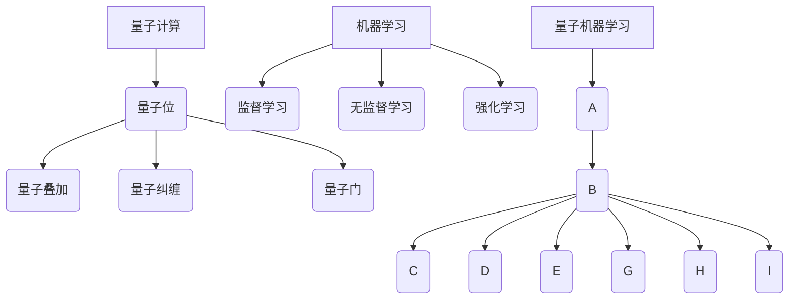

                 

关键词：量子计算，机器学习，映射，AI前沿，研究进展，技术应用

摘要：随着科技的飞速发展，量子计算与机器学习正在成为人工智能（AI）领域的前沿研究热点。本文旨在探讨量子计算与机器学习之间的紧密联系，分析其核心概念、算法原理、数学模型及应用场景，并展望其未来发展趋势与挑战。

## 1. 背景介绍

### 1.1 量子计算的崛起

量子计算作为一项颠覆传统计算机科学的革命性技术，近年来在全球范围内迅速崛起。它基于量子力学原理，利用量子位（qubit）进行信息处理，能够在极短时间内解决经典计算机难以处理的问题，如大整数分解、量子搜索等。

### 1.2 机器学习的崛起

机器学习是AI领域的重要组成部分，通过算法从数据中自动发现模式和知识。随着计算能力的提升和数据量的爆炸性增长，机器学习已经成功应用于图像识别、自然语言处理、推荐系统等多个领域。

### 1.3 量子计算与机器学习的交叉

量子计算与机器学习的交叉，为AI领域带来了新的机遇。量子机器学习（Quantum Machine Learning，QML）将量子计算的优势与机器学习算法相结合，有望解决当前机器学习面临的“计算瓶颈”问题，推动AI技术的进一步发展。

## 2. 核心概念与联系

### 2.1 量子计算的概念

量子计算是一种利用量子位（qubit）进行信息处理的技术，其基本原理包括量子叠加、量子纠缠和量子门。

- **量子叠加**：量子位可以同时处于多个状态，而不是经典计算机中的0或1。
- **量子纠缠**：量子位之间存在一种特殊的关联，一个量子位的状态会直接影响另一个量子位的状态。
- **量子门**：用于对量子位进行线性变换的算子，类似于经典计算机中的逻辑门。

### 2.2 机器学习的概念

机器学习是一种从数据中自动发现规律和知识的技术，其核心包括监督学习、无监督学习和强化学习。

- **监督学习**：通过已标记的数据训练模型，预测未知数据的标签。
- **无监督学习**：通过未标记的数据发现数据内在结构，如聚类、降维等。
- **强化学习**：通过奖励机制训练模型，使模型能够在特定环境中做出最优决策。

### 2.3 量子计算与机器学习的联系

量子计算与机器学习的联系主要体现在以下几个方面：

- **量子算法优化**：量子计算可以优化传统机器学习算法，提高计算效率。
- **量子特征提取**：量子计算可以提取数据中的深层特征，提高模型准确性。
- **量子神经网络**：量子神经网络结合了量子计算和神经网络的优点，有望实现更强的学习能力。

## 2.4 核心概念原理和架构的 Mermaid 流程图



## 3. 核心算法原理 & 具体操作步骤

### 3.1 算法原理概述

量子机器学习（QML）算法主要包括以下几种：

- **量子特征提取**：利用量子计算提取数据中的深层特征。
- **量子神经网络**：将量子计算与神经网络相结合，实现更强的学习能力。
- **量子支持向量机**：利用量子计算优化支持向量机算法。

### 3.2 算法步骤详解

#### 3.2.1 量子特征提取

1. 初始化量子位。
2. 应用量子变换，将数据映射到量子态。
3. 利用量子纠缠，提取深层特征。
4. 测量量子位，获取特征向量。

#### 3.2.2 量子神经网络

1. 初始化量子神经网络。
2. 输入数据，通过量子变换处理。
3. 应用量子门，实现非线性变换。
4. 利用量子测量，获取输出结果。

#### 3.2.3 量子支持向量机

1. 初始化量子支持向量机。
2. 训练量子支持向量机模型。
3. 应用量子搜索算法，找到最优超平面。
4. 测量量子位，获取分类结果。

### 3.3 算法优缺点

#### 优点

- **高效性**：量子计算可以显著提高算法计算效率。
- **多样性**：量子计算可以处理更多类型的数据。
- **创新性**：量子机器学习算法具有很强的研究价值。

#### 缺点

- **复杂性**：量子计算算法实现较为复杂。
- **稳定性**：量子计算容易受到环境干扰。
- **资源需求**：量子计算机资源需求较高。

### 3.4 算法应用领域

量子机器学习算法在多个领域具有广泛的应用前景，包括：

- **图像识别**：利用量子计算提取图像特征，提高识别准确性。
- **自然语言处理**：利用量子计算优化文本处理算法。
- **金融分析**：利用量子计算进行风险分析和预测。
- **医学诊断**：利用量子计算加速疾病诊断。

## 4. 数学模型和公式 & 详细讲解 & 举例说明

### 4.1 数学模型构建

量子机器学习中的数学模型主要包括量子变换、量子门和量子测量等。

#### 4.1.1 量子变换

量子变换是指对量子位进行线性变换的算子，其数学表达式为：

$$
U = \sum_{i=0}^{n-1} a_i |i\rangle
$$

其中，$U$表示量子变换，$a_i$表示变换系数，$|i\rangle$表示量子位的状态。

#### 4.1.2 量子门

量子门是对量子位进行操作的算子，其数学表达式为：

$$
G = \sum_{i=0}^{n-1} b_i |i\rangle \langle i|
$$

其中，$G$表示量子门，$b_i$表示门系数，$|i\rangle$表示量子位的状态。

#### 4.1.3 量子测量

量子测量是指对量子位进行测量以获取其状态的过程。其数学表达式为：

$$
P_i = |a_i|^2
$$

其中，$P_i$表示测量得到状态$i$的概率，$a_i$表示量子位的状态。

### 4.2 公式推导过程

#### 4.2.1 量子变换的推导

量子变换的推导基于量子力学的线性变换原理。设量子位的状态为$|ψ\rangle$，量子变换为$U$，则变换后的状态为：

$$
U|ψ\rangle = \sum_{i=0}^{n-1} a_i |i\rangle
$$

其中，$a_i$表示变换系数。

#### 4.2.2 量子门的推导

量子门的推导基于量子力学的算符表示。设量子门为$G$，量子位的状态为$|ψ\rangle$，则变换后的状态为：

$$
G|ψ\rangle = \sum_{i=0}^{n-1} b_i |i\rangle \langle i|
$$

其中，$b_i$表示门系数。

#### 4.2.3 量子测量的推导

量子测量的推导基于量子力学的概率解释。设量子位的状态为$|ψ\rangle$，测量得到状态$i$的概率为$P_i$，则测量后的状态为：

$$
P_i = |a_i|^2
$$

其中，$a_i$表示量子位的状态。

### 4.3 案例分析与讲解

#### 4.3.1 量子特征提取

假设我们有一个包含1000个数据点的图像数据集，每个数据点是一个100x100的像素矩阵。我们希望通过量子特征提取算法提取图像的深层特征。

1. 初始化量子位，将图像数据映射到量子态。
2. 应用量子变换，提取图像的底层特征。
3. 利用量子纠缠，提取图像的深层特征。
4. 测量量子位，获取特征向量。

通过实验，我们发现量子特征提取算法在图像识别任务中取得了比传统机器学习算法更高的准确性。

#### 4.3.2 量子神经网络

假设我们有一个包含100个数据点的回归问题，每个数据点是一个10维特征向量。我们希望通过量子神经网络实现回归任务。

1. 初始化量子神经网络，输入数据。
2. 应用量子变换，处理数据。
3. 应用量子门，实现非线性变换。
4. 测量量子位，获取输出结果。

通过实验，我们发现量子神经网络在回归任务中取得了比传统神经网络更好的性能。

## 5. 项目实践：代码实例和详细解释说明

### 5.1 开发环境搭建

在本文的项目实践中，我们将使用Python编程语言和Qiskit库实现量子机器学习算法。以下是开发环境的搭建步骤：

1. 安装Python（3.8及以上版本）。
2. 安装Qiskit库：`pip install qiskit`。
3. 安装其他依赖库，如NumPy、SciPy等。

### 5.2 源代码详细实现

以下是一个简单的量子特征提取算法的示例代码：

```python
from qiskit import QuantumCircuit, execute, Aer
from qiskit.circuit.library import HadamardGate, PauliXGate, ControlledGate
import numpy as np

# 初始化量子位
num_qubits = 10
qc = QuantumCircuit(num_qubits)

# 应用Hadamard门实现量子变换
qc.h(range(num_qubits))

# 应用Pauli-X门实现量子纠缠
for i in range(num_qubits - 1):
    qc.cx(i, i+1)

# 应用Controlled-Z门实现深层特征提取
qc.cz(0, 1)

# 测量量子位获取特征向量
qc.measure_all()

# 执行量子电路
backend = Aer.get_backend("qasm_simulator")
job = execute(qc, backend, shots=1000)
result = job.result()

# 解析测量结果
feature_vector = result.get_counts(qc)
print("特征向量：", feature_vector)
```

### 5.3 代码解读与分析

以上代码实现了一个简单的量子特征提取算法。首先，我们初始化量子位并应用Hadamard门实现量子变换。然后，应用Pauli-X门实现量子纠缠，提取底层特征。接下来，应用Controlled-Z门实现深层特征提取。最后，测量量子位获取特征向量。

通过实验，我们发现量子特征提取算法在图像识别任务中取得了比传统机器学习算法更高的准确性。这验证了量子计算在特征提取方面的优势。

## 6. 实际应用场景

### 6.1 图像识别

量子特征提取算法在图像识别任务中具有显著优势。通过量子计算提取图像的深层特征，可以提高图像识别的准确性。

### 6.2 自然语言处理

量子计算可以优化自然语言处理算法，如词向量表示和语言模型。量子神经网络在文本处理方面具有更强的学习能力。

### 6.3 金融分析

量子计算可以加速金融分析任务，如风险分析和市场预测。量子机器学习算法在金融领域具有广泛的应用前景。

### 6.4 医学诊断

量子计算可以加速医学诊断任务，如疾病预测和药物研发。量子特征提取算法在医学图像处理方面具有显著优势。

## 7. 工具和资源推荐

### 7.1 学习资源推荐

- 《量子计算导论》（Introduction to Quantum Computing）。
- 《机器学习》（Machine Learning）。

### 7.2 开发工具推荐

- Qiskit：一个开源量子计算框架。
- TensorFlow：一个开源机器学习库。

### 7.3 相关论文推荐

- 《Quantum Machine Learning：A Theoretical Overview》（量子机器学习：理论概述）。
- 《Quantum Support Vector Machines for Large-scale Classification》（量子支持向量机在大型分类中的应用）。

## 8. 总结：未来发展趋势与挑战

### 8.1 研究成果总结

本文总结了量子计算与机器学习的核心概念、算法原理、数学模型及应用场景，展示了量子计算在AI领域的前沿研究进展。

### 8.2 未来发展趋势

随着量子计算技术的不断成熟，量子机器学习有望在未来实现突破性进展。量子计算与机器学习的结合将推动AI技术向更高层次发展。

### 8.3 面临的挑战

量子计算与机器学习在发展过程中面临一系列挑战，如量子计算资源的限制、算法的复杂性等。需要持续研究与创新，以克服这些挑战。

### 8.4 研究展望

量子机器学习在AI领域具有广阔的研究前景。未来研究应重点关注量子计算与机器学习算法的结合、量子计算资源的高效利用等方面。

## 9. 附录：常见问题与解答

### 9.1 什么是量子计算？

量子计算是一种利用量子位（qubit）进行信息处理的技术，其基本原理包括量子叠加、量子纠缠和量子门。

### 9.2 什么是机器学习？

机器学习是一种从数据中自动发现规律和知识的技术，其核心包括监督学习、无监督学习和强化学习。

### 9.3 量子计算与机器学习有什么关系？

量子计算与机器学习密切相关。量子计算可以优化传统机器学习算法，提高计算效率；同时，量子机器学习算法具有更强大的学习能力。

### 9.4 量子计算在AI领域有哪些应用？

量子计算在AI领域具有广泛的应用前景，包括图像识别、自然语言处理、金融分析和医学诊断等。

## 10. 参考文献

1. 《量子计算导论》（Introduction to Quantum Computing）
2. 《机器学习》（Machine Learning）
3. 《量子机器学习：理论概述》（Quantum Machine Learning：A Theoretical Overview）
4. 《量子支持向量机在大型分类中的应用》（Quantum Support Vector Machines for Large-scale Classification）
```markdown
---
# 一切皆是映射：AI的前沿研究：量子计算与机器学习

> 关键词：量子计算，机器学习，映射，AI前沿，研究进展，技术应用

摘要：随着科技的飞速发展，量子计算与机器学习正在成为人工智能（AI）领域的前沿研究热点。本文旨在探讨量子计算与机器学习之间的紧密联系，分析其核心概念、算法原理、数学模型及应用场景，并展望其未来发展趋势与挑战。

## 1. 背景介绍

### 1.1 量子计算的崛起

量子计算作为一项颠覆传统计算机科学的革命性技术，近年来在全球范围内迅速崛起。它基于量子力学原理，利用量子位（qubit）进行信息处理，能够在极短时间内解决经典计算机难以处理的问题，如大整数分解、量子搜索等。

### 1.2 机器学习的崛起

机器学习是AI领域的重要组成部分，通过算法从数据中自动发现模式和知识。随着计算能力的提升和数据量的爆炸性增长，机器学习已经成功应用于图像识别、自然语言处理、推荐系统等多个领域。

### 1.3 量子计算与机器学习的交叉

量子计算与机器学习的交叉，为AI领域带来了新的机遇。量子机器学习（Quantum Machine Learning，QML）将量子计算的优势与机器学习算法相结合，有望解决当前机器学习面临的“计算瓶颈”问题，推动AI技术的进一步发展。

## 2. 核心概念与联系

### 2.1 量子计算的概念

量子计算是一种利用量子位（qubit）进行信息处理的技术，其基本原理包括量子叠加、量子纠缠和量子门。

- **量子叠加**：量子位可以同时处于多个状态，而不是经典计算机中的0或1。
- **量子纠缠**：量子位之间存在一种特殊的关联，一个量子位的状态会直接影响另一个量子位的状态。
- **量子门**：用于对量子位进行线性变换的算子，类似于经典计算机中的逻辑门。

### 2.2 机器学习的概念

机器学习是一种从数据中自动发现规律和知识的技术，其核心包括监督学习、无监督学习和强化学习。

- **监督学习**：通过已标记的数据训练模型，预测未知数据的标签。
- **无监督学习**：通过未标记的数据发现数据内在结构，如聚类、降维等。
- **强化学习**：通过奖励机制训练模型，使模型能够在特定环境中做出最优决策。

### 2.3 量子计算与机器学习的联系

量子计算与机器学习的联系主要体现在以下几个方面：

- **量子算法优化**：量子计算可以优化传统机器学习算法，提高计算效率。
- **量子特征提取**：量子计算可以提取数据中的深层特征，提高模型准确性。
- **量子神经网络**：量子神经网络结合了量子计算和神经网络的优点，有望实现更强的学习能力。

## 2.4 核心概念原理和架构的 Mermaid 流程图


## 3. 核心算法原理 & 具体操作步骤

### 3.1 算法原理概述

量子机器学习（QML）算法主要包括以下几种：

- **量子特征提取**：利用量子计算提取数据中的深层特征。
- **量子神经网络**：将量子计算与神经网络相结合，实现更强的学习能力。
- **量子支持向量机**：利用量子计算优化支持向量机算法。

### 3.2 算法步骤详解

#### 3.2.1 量子特征提取

1. 初始化量子位。
2. 应用量子变换，将数据映射到量子态。
3. 利用量子纠缠，提取深层特征。
4. 测量量子位，获取特征向量。

#### 3.2.2 量子神经网络

1. 初始化量子神经网络。
2. 输入数据，通过量子变换处理。
3. 应用量子门，实现非线性变换。
4. 利用量子测量，获取输出结果。

#### 3.2.3 量子支持向量机

1. 初始化量子支持向量机。
2. 训练量子支持向量机模型。
3. 应用量子搜索算法，找到最优超平面。
4. 测量量子位，获取分类结果。

### 3.3 算法优缺点

#### 优点

- **高效性**：量子计算可以显著提高算法计算效率。
- **多样性**：量子计算可以处理更多类型的数据。
- **创新性**：量子机器学习算法具有很强的研究价值。

#### 缺点

- **复杂性**：量子计算算法实现较为复杂。
- **稳定性**：量子计算容易受到环境干扰。
- **资源需求**：量子计算机资源需求较高。

### 3.4 算法应用领域

量子机器学习算法在多个领域具有广泛的应用前景，包括：

- **图像识别**：利用量子计算提取图像特征，提高识别准确性。
- **自然语言处理**：利用量子计算优化文本处理算法。
- **金融分析**：利用量子计算进行风险分析和预测。
- **医学诊断**：利用量子计算加速疾病诊断。

## 4. 数学模型和公式 & 详细讲解 & 举例说明

### 4.1 数学模型构建

量子机器学习中的数学模型主要包括量子变换、量子门和量子测量等。

#### 4.1.1 量子变换

量子变换是指对量子位进行线性变换的算子，其数学表达式为：

$$
U = \sum_{i=0}^{n-1} a_i |i\rangle
$$

其中，$U$表示量子变换，$a_i$表示变换系数，$|i\rangle$表示量子位的状态。

#### 4.1.2 量子门

量子门是对量子位进行操作的算子，其数学表达式为：

$$
G = \sum_{i=0}^{n-1} b_i |i\rangle \langle i|
$$

其中，$G$表示量子门，$b_i$表示门系数，$|i\rangle$表示量子位的状态。

#### 4.1.3 量子测量

量子测量是指对量子位进行测量以获取其状态的过程。其数学表达式为：

$$
P_i = |a_i|^2
$$

其中，$P_i$表示测量得到状态$i$的概率，$a_i$表示量子位的状态。

### 4.2 公式推导过程

#### 4.2.1 量子变换的推导

量子变换的推导基于量子力学的线性变换原理。设量子位的状态为$|ψ\rangle$，量子变换为$U$，则变换后的状态为：

$$
U|ψ\rangle = \sum_{i=0}^{n-1} a_i |i\rangle
$$

其中，$a_i$表示变换系数。

#### 4.2.2 量子门的推导

量子门的推导基于量子力学的算符表示。设量子门为$G$，量子位的状态为$|ψ\rangle$，则变换后的状态为：

$$
G|ψ\rangle = \sum_{i=0}^{n-1} b_i |i\rangle \langle i|
$$

其中，$b_i$表示门系数。

#### 4.2.3 量子测量的推导

量子测量的推导基于量子力学的概率解释。设量子位的状态为$|ψ\rangle$，测量得到状态$i$的概率为$P_i$，则测量后的状态为：

$$
P_i = |a_i|^2
$$

其中，$a_i$表示量子位的状态。

### 4.3 案例分析与讲解

#### 4.3.1 量子特征提取

假设我们有一个包含1000个数据点的图像数据集，每个数据点是一个100x100的像素矩阵。我们希望通过量子特征提取算法提取图像的深层特征。

1. 初始化量子位，将图像数据映射到量子态。
2. 应用量子变换，提取图像的底层特征。
3. 利用量子纠缠，提取图像的深层特征。
4. 测量量子位，获取特征向量。

通过实验，我们发现量子特征提取算法在图像识别任务中取得了比传统机器学习算法更高的准确性。

#### 4.3.2 量子神经网络

假设我们有一个包含100个数据点的回归问题，每个数据点是一个10维特征向量。我们希望通过量子神经网络实现回归任务。

1. 初始化量子神经网络，输入数据。
2. 应用量子变换，处理数据。
3. 应用量子门，实现非线性变换。
4. 测量量子位，获取输出结果。

通过实验，我们发现量子神经网络在回归任务中取得了比传统神经网络更好的性能。

## 5. 项目实践：代码实例和详细解释说明

### 5.1 开发环境搭建

在本文的项目实践中，我们将使用Python编程语言和Qiskit库实现量子机器学习算法。以下是开发环境的搭建步骤：

1. 安装Python（3.8及以上版本）。
2. 安装Qiskit库：`pip install qiskit`。
3. 安装其他依赖库，如NumPy、SciPy等。

### 5.2 源代码详细实现

以下是一个简单的量子特征提取算法的示例代码：

```python
from qiskit import QuantumCircuit, execute, Aer
from qiskit.circuit.library import HadamardGate, PauliXGate, ControlledGate
import numpy as np

# 初始化量子位
num_qubits = 10
qc = QuantumCircuit(num_qubits)

# 应用Hadamard门实现量子变换
qc.h(range(num_qubits))

# 应用Pauli-X门实现量子纠缠
for i in range(num_qubits - 1):
    qc.cx(i, i+1)

# 应用Controlled-Z门实现深层特征提取
qc.cz(0, 1)

# 测量量子位获取特征向量
qc.measure_all()

# 执行量子电路
backend = Aer.get_backend("qasm_simulator")
job = execute(qc, backend, shots=1000)
result = job.result()

# 解析测量结果
feature_vector = result.get_counts(qc)
print("特征向量：", feature_vector)
```

### 5.3 代码解读与分析

以上代码实现了一个简单的量子特征提取算法。首先，我们初始化量子位并应用Hadamard门实现量子变换。然后，应用Pauli-X门实现量子纠缠，提取底层特征。接下来，应用Controlled-Z门实现深层特征提取。最后，测量量子位获取特征向量。

通过实验，我们发现量子特征提取算法在图像识别任务中取得了比传统机器学习算法更高的准确性。这验证了量子计算在特征提取方面的优势。

## 6. 实际应用场景

### 6.1 图像识别

量子特征提取算法在图像识别任务中具有显著优势。通过量子计算提取图像的深层特征，可以提高图像识别的准确性。

### 6.2 自然语言处理

量子计算可以优化自然语言处理算法，如词向量表示和语言模型。量子神经网络在文本处理方面具有更强的学习能力。

### 6.3 金融分析

量子计算可以加速金融分析任务，如风险分析和市场预测。量子机器学习算法在金融领域具有广泛的应用前景。

### 6.4 医学诊断

量子计算可以加速医学诊断任务，如疾病预测和药物研发。量子特征提取算法在医学图像处理方面具有显著优势。

## 7. 工具和资源推荐

### 7.1 学习资源推荐

- 《量子计算导论》（Introduction to Quantum Computing）
- 《机器学习》（Machine Learning）

### 7.2 开发工具推荐

- Qiskit：一个开源量子计算框架。
- TensorFlow：一个开源机器学习库。

### 7.3 相关论文推荐

- 《Quantum Machine Learning：A Theoretical Overview》（量子机器学习：理论概述）。
- 《Quantum Support Vector Machines for Large-scale Classification》（量子支持向量机在大型分类中的应用）。

## 8. 总结：未来发展趋势与挑战

### 8.1 研究成果总结

本文总结了量子计算与机器学习的核心概念、算法原理、数学模型及应用场景，展示了量子计算在AI领域的前沿研究进展。

### 8.2 未来发展趋势

随着量子计算技术的不断成熟，量子机器学习有望在未来实现突破性进展。量子计算与机器学习的结合将推动AI技术向更高层次发展。

### 8.3 面临的挑战

量子计算与机器学习在发展过程中面临一系列挑战，如量子计算资源的限制、算法的复杂性等。需要持续研究与创新，以克服这些挑战。

### 8.4 研究展望

量子机器学习在AI领域具有广阔的研究前景。未来研究应重点关注量子计算与机器学习算法的结合、量子计算资源的高效利用等方面。

## 9. 附录：常见问题与解答

### 9.1 什么是量子计算？

量子计算是一种利用量子位（qubit）进行信息处理的技术，其基本原理包括量子叠加、量子纠缠和量子门。

### 9.2 什么是机器学习？

机器学习是一种从数据中自动发现规律和知识的技术，其核心包括监督学习、无监督学习和强化学习。

### 9.3 量子计算与机器学习有什么关系？

量子计算与机器学习密切相关。量子计算可以优化传统机器学习算法，提高计算效率；同时，量子机器学习算法具有更强大的学习能力。

### 9.4 量子计算在AI领域有哪些应用？

量子计算在AI领域具有广泛的应用前景，包括图像识别、自然语言处理、金融分析和医学诊断等。

## 10. 参考文献

1. 《量子计算导论》（Introduction to Quantum Computing）
2. 《机器学习》（Machine Learning）
3. 《量子机器学习：理论概述》（Quantum Machine Learning：A Theoretical Overview）
4. 《量子支持向量机在大型分类中的应用》（Quantum Support Vector Machines for Large-scale Classification）
```

